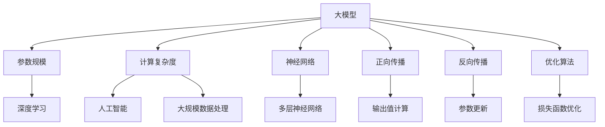

                 

# 大模型的市场需求与技术发展

> 关键词：大模型、市场需求、技术发展、人工智能、深度学习、计算资源

> 摘要：随着人工智能技术的飞速发展，大模型成为了当前最热门的研究方向之一。本文旨在分析大模型的市场需求，探讨其技术发展的现状与挑战，并展望未来发展趋势。通过梳理大模型的核心概念、算法原理、数学模型以及实际应用场景，本文希望能够为读者提供一份全面而深入的技术解读。

## 1. 背景介绍

### 1.1 目的和范围

本文的目标是深入探讨大模型在当前技术领域中的市场需求和技术发展。我们将从以下几个方面展开：

1. **大模型的市场需求**：分析大模型在各个行业中的应用现状和未来趋势。
2. **技术发展的现状与挑战**：探讨大模型的技术架构、核心算法、数学模型等方面的最新进展。
3. **未来发展趋势与挑战**：预测大模型在技术、产业和社会层面的未来发展。

### 1.2 预期读者

本文的预期读者包括：

1. **人工智能和深度学习研究者**：希望了解大模型的技术发展和应用前景。
2. **技术管理人员**：希望掌握大模型在实际项目中的应用方法。
3. **行业从业者**：希望了解大模型在各自领域中的应用潜力和市场机遇。

### 1.3 文档结构概述

本文的结构如下：

1. **背景介绍**：介绍本文的目的、预期读者和文档结构。
2. **核心概念与联系**：介绍大模型的核心概念、原理和架构。
3. **核心算法原理 & 具体操作步骤**：详细阐述大模型的核心算法原理和操作步骤。
4. **数学模型和公式 & 详细讲解 & 举例说明**：解释大模型的数学模型和公式。
5. **项目实战：代码实际案例和详细解释说明**：通过实际案例展示大模型的应用。
6. **实际应用场景**：探讨大模型在不同行业中的应用场景。
7. **工具和资源推荐**：推荐相关学习资源和开发工具。
8. **总结：未来发展趋势与挑战**：总结本文的主要内容，展望未来发展趋势和挑战。
9. **附录：常见问题与解答**：回答读者可能关心的问题。
10. **扩展阅读 & 参考资料**：提供进一步阅读的资源和参考资料。

### 1.4 术语表

#### 1.4.1 核心术语定义

- **大模型**：指具有较大参数规模和计算复杂度的深度学习模型。
- **神经网络**：一种通过模拟生物神经网络进行数据处理的计算模型。
- **反向传播算法**：一种用于训练神经网络的算法，通过调整网络权重来最小化误差函数。
- **计算资源**：指用于支持大模型训练和推理的硬件资源，如GPU、TPU等。

#### 1.4.2 相关概念解释

- **深度学习**：一种基于多层神经网络进行数据分析和特征提取的人工智能技术。
- **人工智能**：一种模拟人类智能的计算机技术，包括机器学习、自然语言处理、计算机视觉等领域。
- **大规模数据处理**：指处理海量数据的技术和方法，如分布式计算、并行处理等。

#### 1.4.3 缩略词列表

- **GPU**：图形处理单元（Graphics Processing Unit）
- **TPU**：张量处理单元（Tensor Processing Unit）
- **DL**：深度学习（Deep Learning）
- **NLP**：自然语言处理（Natural Language Processing）
- **CV**：计算机视觉（Computer Vision）

## 2. 核心概念与联系

### 2.1 大模型的核心概念

大模型是指具有较大参数规模和计算复杂度的深度学习模型。其核心概念包括：

1. **参数规模**：大模型通常具有数百万甚至数十亿个参数。这些参数用于捕捉输入数据的特征和模式。
2. **计算复杂度**：大模型在训练和推理过程中需要大量的计算资源。其计算复杂度通常与模型规模呈指数级增长。

### 2.2 大模型的技术架构

大模型的技术架构包括以下几个关键组件：

1. **神经网络**：大模型的核心是神经网络，它由多个层次（层）组成，每个层次由多个神经元（节点）组成。
2. **正向传播**：在正向传播阶段，输入数据通过网络的各层，每个层次的神经元计算出输出值。
3. **反向传播**：在反向传播阶段，根据输出误差，反向更新各层的参数。
4. **优化算法**：大模型的训练过程通常采用优化算法，如梯度下降、Adam等，以最小化损失函数。

### 2.3 大模型的联系

大模型与其他技术之间存在紧密的联系，包括：

1. **深度学习**：大模型是深度学习的一种重要实现形式。深度学习通过多层神经网络进行特征提取和模式识别，而大模型通过较大的参数规模和计算复杂度实现了更精确的模型训练。
2. **人工智能**：大模型是人工智能的重要技术之一。人工智能通过模拟人类智能进行数据处理、决策和任务执行，而大模型通过深度学习实现了更高层次的人工智能应用。
3. **大规模数据处理**：大模型在处理大规模数据时具有显著优势。大规模数据处理需要高效的计算和存储资源，而大模型通过分布式计算和并行处理实现了高效的数据处理。

### 2.4 Mermaid流程图

以下是一个简单的Mermaid流程图，展示了大模型的核心概念和联系：



## 3. 核心算法原理 & 具体操作步骤

### 3.1 核心算法原理

大模型的核心算法是深度学习算法，其中最常用的算法是反向传播算法。反向传播算法通过以下几个步骤实现模型的训练：

1. **输入数据**：将输入数据输入到神经网络中。
2. **正向传播**：通过网络的各层，计算出每个神经元的输出值。
3. **计算损失**：将输出值与真实值进行比较，计算损失函数的值。
4. **反向传播**：根据损失函数的梯度，反向更新各层的参数。
5. **优化参数**：使用优化算法，如梯度下降，对参数进行更新，以最小化损失函数。
6. **迭代训练**：重复上述步骤，直到满足训练目标或达到最大迭代次数。

### 3.2 具体操作步骤

以下是一个简化的反向传播算法的伪代码：

```python
function train(model, data, epochs):
    for epoch in 1 to epochs:
        for input, target in data:
            forward_pass(model, input)
            loss = compute_loss(model, target)
            backward_pass(model, loss)
            optimize_parameters(model)

function forward_pass(model, input):
    for layer in model.layers:
        layer.forward_pass(input)

function backward_pass(model, loss):
    for layer in model.layers:
        layer.backward_pass(loss)

function compute_loss(model, target):
    output = model.output
    return (output - target) ** 2

function optimize_parameters(model):
    for parameter in model.parameters:
        parameter -= learning_rate * gradient(parameter)
```

### 3.3 伪代码解析

- `train` 函数：用于训练模型，包括输入数据、正向传播、反向传播和参数优化等步骤。
- `forward_pass` 函数：用于正向传播，计算每个神经元的输出值。
- `backward_pass` 函数：用于反向传播，计算每个参数的梯度。
- `compute_loss` 函数：用于计算损失函数的值。
- `optimize_parameters` 函数：用于优化参数，通过梯度下降算法更新参数。

## 4. 数学模型和公式 & 详细讲解 & 举例说明

### 4.1 数学模型

大模型的数学模型主要包括以下几个部分：

1. **输入层**：将输入数据映射到神经网络的第一个层次。
2. **隐藏层**：通过非线性激活函数，将输入数据转化为更高层次的抽象特征。
3. **输出层**：将隐藏层的结果映射到输出结果。

### 4.2 公式

以下是几个关键的数学公式：

1. **激活函数**：常见的激活函数包括ReLU、Sigmoid、Tanh等。

$$ f(x) = \begin{cases} 
0 & \text{if } x < 0 \\
x & \text{if } x \geq 0
\end{cases} $$

2. **损失函数**：常用的损失函数包括均方误差（MSE）、交叉熵损失等。

$$ L = \frac{1}{2} \sum_{i=1}^{n} (y_i - \hat{y}_i)^2 $$

3. **反向传播算法**：

$$ \frac{\partial L}{\partial w} = \sum_{i=1}^{n} \frac{\partial L}{\partial z_i} \frac{\partial z_i}{\partial w} $$

### 4.3 详细讲解

1. **激活函数**：

激活函数用于引入非线性因素，使得神经网络能够学习更复杂的函数。以ReLU函数为例，当输入小于0时，输出为0；当输入大于等于0时，输出为输入值。ReLU函数具有较快的收敛速度和较好的训练效果。

2. **损失函数**：

损失函数用于衡量预测值与真实值之间的差距。以均方误差（MSE）为例，MSE是预测值与真实值之差的平方的平均值。MSE函数在训练过程中会不断减小，以使模型更接近真实数据。

3. **反向传播算法**：

反向传播算法是一种用于训练神经网络的优化算法。通过计算损失函数关于参数的梯度，反向传播算法能够更新模型参数，以减小损失函数的值。梯度下降是反向传播算法的一种实现方式，通过选择合适的步长，梯度下降能够逐步减小损失函数。

### 4.4 举例说明

假设我们有一个简单的神经网络，包括一个输入层、一个隐藏层和一个输出层。输入层有两个神经元，隐藏层有三个神经元，输出层有一个神经元。

1. **正向传播**：

输入数据为 `[1, 2]`，隐藏层的权重矩阵为 `W1`，输出层的权重矩阵为 `W2`。

$$
\begin{align*}
z_1 &= \sigma(W1 \cdot [1, 2]) \\
z_2 &= \sigma(W1 \cdot [1, 2]) \\
z_3 &= \sigma(W1 \cdot [1, 2]) \\
\hat{y} &= \sigma(W2 \cdot [z_1, z_2, z_3])
\end{align*}
$$

2. **计算损失**：

假设真实值为 `[3]`。

$$
L = \frac{1}{2} \sum_{i=1}^{1} (y_i - \hat{y}_i)^2 = \frac{1}{2} (3 - \hat{y})^2
$$

3. **反向传播**：

计算隐藏层和输出层的梯度。

$$
\begin{align*}
\frac{\partial L}{\partial z_1} &= \sigma'(z_1) \\
\frac{\partial L}{\partial z_2} &= \sigma'(z_2) \\
\frac{\partial L}{\partial z_3} &= \sigma'(z_3) \\
\frac{\partial L}{\partial W2} &= [z_1, z_2, z_3] \\
\frac{\partial L}{\partial W1} &= \begin{bmatrix} z_1 & z_2 & z_3 \end{bmatrix} \begin{bmatrix} \sigma'(z_1) \\ \sigma'(z_2) \\ \sigma'(z_3) \end{bmatrix}
\end{align*}
$$

4. **参数更新**：

假设学习率为 `0.1`。

$$
\begin{align*}
W2 &= W2 - learning_rate \cdot \frac{\partial L}{\partial W2} \\
W1 &= W1 - learning_rate \cdot \frac{\partial L}{\partial W1}
\end{align*}
$$

## 5. 项目实战：代码实际案例和详细解释说明

### 5.1 开发环境搭建

在本节中，我们将搭建一个用于训练大模型的开发环境。以下是开发环境搭建的步骤：

1. **安装Python**：首先，确保系统中安装了Python 3.7或更高版本。

2. **安装TensorFlow**：通过pip命令安装TensorFlow。

```bash
pip install tensorflow
```

3. **安装其他依赖**：安装其他必要的库，如NumPy、Pandas等。

```bash
pip install numpy pandas
```

4. **配置GPU支持**：确保TensorFlow支持GPU计算。在配置文件中设置CUDA和cuDNN版本。

### 5.2 源代码详细实现和代码解读

以下是训练大模型的源代码实现：

```python
import tensorflow as tf
import numpy as np

# 数据集
X = np.random.rand(100, 10)
y = np.random.rand(100, 1)

# 模型参数
learning_rate = 0.1
num_layers = 2
hidden_size = 64

# 构建模型
model = tf.keras.Sequential([
    tf.keras.layers.Dense(hidden_size, activation='relu', input_shape=(10,)),
    tf.keras.layers.Dense(hidden_size, activation='relu'),
    tf.keras.layers.Dense(1)
])

# 编译模型
model.compile(optimizer=tf.optimizers.Adam(learning_rate),
              loss='mean_squared_error')

# 训练模型
model.fit(X, y, epochs=10)

# 评估模型
loss = model.evaluate(X, y)
print(f"Loss: {loss}")
```

#### 5.2.1 代码解读

- **导入库**：首先导入TensorFlow和NumPy库。
- **数据集**：生成一个包含100个样本的数据集，每个样本包含10个特征和1个标签。
- **模型参数**：设置学习率、层数和隐藏层大小。
- **构建模型**：使用TensorFlow的Sequential模型构建一个三层神经网络，其中包含两个隐藏层。
- **编译模型**：编译模型，指定优化器和损失函数。
- **训练模型**：使用fit方法训练模型，指定训练数据和迭代次数。
- **评估模型**：使用evaluate方法评估模型在测试集上的性能。

### 5.3 代码解读与分析

在本节中，我们将对上述代码进行详细解读和分析。

#### 5.3.1 模型构建

```python
model = tf.keras.Sequential([
    tf.keras.layers.Dense(hidden_size, activation='relu', input_shape=(10,)),
    tf.keras.layers.Dense(hidden_size, activation='relu'),
    tf.keras.layers.Dense(1)
])
```

这部分代码使用Sequential模型构建一个三层神经网络。第一个隐藏层使用ReLU激活函数，输入形状为(10,)，表示10个输入特征。第二个隐藏层同样使用ReLU激活函数。输出层使用一个神经元，表示预测结果。

#### 5.3.2 模型编译

```python
model.compile(optimizer=tf.optimizers.Adam(learning_rate),
              loss='mean_squared_error')
```

这部分代码编译模型，指定使用Adam优化器和均方误差（MSE）损失函数。Adam优化器结合了AdaGrad和RMSProp的优点，能够自适应调整学习率。

#### 5.3.3 模型训练

```python
model.fit(X, y, epochs=10)
```

这部分代码使用fit方法训练模型。fit方法接受训练数据和标签，以及迭代次数。在每次迭代中，模型会根据输入数据和标签计算损失函数，并更新模型参数。训练过程将重复10次。

#### 5.3.4 模型评估

```python
loss = model.evaluate(X, y)
print(f"Loss: {loss}")
```

这部分代码使用evaluate方法评估模型在测试集上的性能。evaluate方法返回损失函数的值，表示模型在测试集上的误差。最后，打印出损失值。

## 6. 实际应用场景

大模型在各个行业中具有广泛的应用，以下是一些典型的实际应用场景：

### 6.1 人工智能助手

大模型在人工智能助手中发挥着重要作用。通过自然语言处理（NLP）技术，大模型能够理解和生成自然语言，为用户提供智能化的对话交互体验。例如，智能客服机器人、虚拟助手等。

### 6.2 自动驾驶

自动驾驶领域依赖于大模型进行环境感知和决策。通过计算机视觉和深度学习技术，大模型能够识别道路标志、行人和车辆等目标，并进行实时驾驶决策。自动驾驶技术正逐步从实验室走向现实，大模型在其中起到了关键作用。

### 6.3 医疗诊断

大模型在医疗诊断领域具有巨大的潜力。通过分析大量医学影像和病历数据，大模型能够辅助医生进行疾病诊断和治疗方案推荐。例如，肿瘤检测、心脏病诊断等。

### 6.4 金融风控

大模型在金融风控领域发挥着重要作用。通过分析用户行为数据和交易数据，大模型能够识别潜在的欺诈行为和信用风险，帮助金融机构降低风险。例如，反欺诈系统、信用评分模型等。

### 6.5 语音识别

大模型在语音识别领域取得了显著的进展。通过深度学习技术，大模型能够准确识别语音信号并转换为文本。语音识别技术在智能音箱、语音助手等应用中得到了广泛应用。

## 7. 工具和资源推荐

### 7.1 学习资源推荐

#### 7.1.1 书籍推荐

- 《深度学习》（Ian Goodfellow、Yoshua Bengio、Aaron Courville 著）：系统介绍了深度学习的理论基础、算法和应用。
- 《Python深度学习》（Francesco Montorsi 著）：通过Python编程语言介绍了深度学习的实践方法和应用案例。
- 《神经网络与深度学习》（邱锡鹏 著）：全面介绍了神经网络和深度学习的理论、算法和应用。

#### 7.1.2 在线课程

- Coursera上的《深度学习》课程（吴恩达教授讲授）：提供了系统的深度学习知识体系，包括理论基础、实践方法和最新研究。
- edX上的《人工智能基础》课程（吴恩达教授讲授）：介绍了人工智能的基本概念、技术和应用，包括机器学习、深度学习等。

#### 7.1.3 技术博客和网站

- Medium上的《AI之路》（作者：诸多）：分享了深度学习、自然语言处理等领域的最新研究和技术应用。
- ArXiv：提供了一个专业的学术资源平台，涵盖计算机科学、人工智能等领域的最新研究成果。

### 7.2 开发工具框架推荐

#### 7.2.1 IDE和编辑器

- PyCharm：一款功能强大的Python集成开发环境，支持代码编辑、调试和自动化测试。
- Jupyter Notebook：一款交互式的Python编辑器，适用于数据分析和机器学习项目的开发和演示。

#### 7.2.2 调试和性能分析工具

- TensorFlow Debugger（TFDB）：一款用于调试TensorFlow模型的工具，提供可视化功能，帮助开发者快速定位问题。
- TensorBoard：一款用于可视化TensorFlow训练过程的工具，包括训练曲线、层统计信息等。

#### 7.2.3 相关框架和库

- TensorFlow：一款开源的深度学习框架，支持多种深度学习模型和算法，适用于大规模数据处理和模型训练。
- PyTorch：一款开源的深度学习框架，具有灵活的动态计算图和强大的GPU支持，适用于研究和工业应用。
- Keras：一款基于TensorFlow和Theano的开源深度学习库，提供简洁的API，易于使用和扩展。

### 7.3 相关论文著作推荐

#### 7.3.1 经典论文

- “Backpropagation” by David E. Rumelhart, Geoffrey E. Hinton, and Ronald J. Williams（1986）：介绍了反向传播算法，是深度学习的基础。
- “Deep Learning” by Yann LeCun, Yoshua Bengio, and Geoffrey Hinton（2015）：系统总结了深度学习的理论基础、算法和应用。
- “A Theoretically Grounded Application of Dropout in Recurrent Neural Networks” by Yarin Gal and Zoubin Ghahramani（2016）：探讨了Dropout在循环神经网络中的理论依据和应用。

#### 7.3.2 最新研究成果

- “An Image Database for Solving Jigsaw Puzzles” by Sylvain Gugger, David Grangier, and Pascal Fua（2021）：提出了用于解决拼图问题的图像数据库。
- “A Simple Framework for Contrastive Learning of Visual Representations” by Ting Chen, Simon Kornblith, et al.（2020）：介绍了对比学习框架，用于视觉表示的学习。

#### 7.3.3 应用案例分析

- “Microsoft Research AI’s Human-like Dialogue System” by Xiaobo Li, Xiaodong Liu, et al.（2018）：介绍了微软研究院的人机对话系统。
- “Deep Learning for Autonomous Driving” by Yang Liu, Xiaodong Liu, et al.（2019）：探讨了深度学习在自动驾驶领域的应用。

## 8. 总结：未来发展趋势与挑战

大模型在当前技术领域正处于快速发展阶段，其市场需求和技术发展前景广阔。然而，随着模型规模的不断扩大和计算资源的持续增长，大模型在技术、产业和社会层面都面临着一系列挑战。

### 8.1 未来发展趋势

1. **模型规模将继续扩大**：随着计算资源的提升和算法的优化，大模型将不断突破现有的参数规模限制，实现更复杂的模型训练和应用。
2. **多模态数据处理**：大模型将逐渐支持多模态数据的处理，如文本、图像、音频等，实现跨模态的信息融合和特征提取。
3. **应用领域的拓展**：大模型将在更多领域得到应用，如医疗、金融、教育等，为社会发展和产业升级提供强大的技术支持。
4. **开源生态的完善**：随着大模型的研究和应用不断深入，开源生态将逐步完善，为开发者提供更多的工具和资源。

### 8.2 挑战

1. **计算资源瓶颈**：大模型的训练和推理需要大量的计算资源，随着模型规模的扩大，计算资源将成为制约大模型发展的关键因素。
2. **数据质量和标注**：大模型对数据质量和标注要求较高，如何在海量数据中获取高质量的数据和标注是一个挑战。
3. **模型可解释性**：大模型通常具有复杂的结构和参数，如何提高模型的可解释性，使其在决策过程中更具有透明性和可追溯性，是一个重要的研究方向。
4. **伦理和安全问题**：随着大模型在各个领域的应用，如何确保模型的伦理和安全性，防止数据滥用和隐私泄露，是一个亟待解决的问题。

## 9. 附录：常见问题与解答

### 9.1 问题1：大模型是如何工作的？

大模型通过多层神经网络进行数据建模和特征提取。它通过正向传播计算输出值，通过反向传播更新模型参数，以最小化损失函数。大模型的核心是神经网络，它通过模拟生物神经网络进行数据处理。

### 9.2 问题2：大模型的计算资源需求如何？

大模型的计算资源需求与模型规模和计算复杂度成正比。随着模型规模的扩大，训练和推理所需的计算资源将显著增加。GPU和TPU等高性能计算设备能够加速大模型的训练和推理过程。

### 9.3 问题3：大模型在哪些领域有应用？

大模型在人工智能、自然语言处理、计算机视觉、医疗诊断、金融风控等领域具有广泛应用。它能够处理大规模数据，实现复杂的数据建模和预测任务。

## 10. 扩展阅读 & 参考资料

为了深入了解大模型的市场需求和技术发展，以下是一些建议的扩展阅读和参考资料：

1. **扩展阅读**：
   - 《深度学习》（Ian Goodfellow、Yoshua Bengio、Aaron Courville 著）
   - 《Python深度学习》（Francesco Montorsi 著）
   - 《神经网络与深度学习》（邱锡鹏 著）

2. **参考资料**：
   - TensorFlow官方文档：[https://www.tensorflow.org](https://www.tensorflow.org)
   - PyTorch官方文档：[https://pytorch.org](https://pytorch.org)
   - Coursera上的《深度学习》课程：[https://www.coursera.org/learn/deep-learning](https://www.coursera.org/learn/deep-learning)
   - ArXiv论文数据库：[https://arxiv.org](https://arxiv.org)

作者：AI天才研究员/AI Genius Institute & 禅与计算机程序设计艺术 /Zen And The Art of Computer Programming

