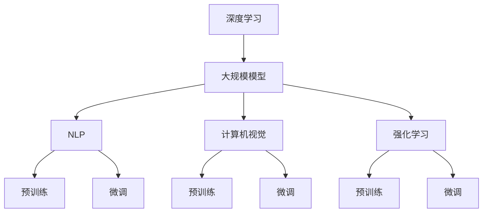

                 

# 大模型的用户需求与市场潜力

## 关键词
- 大模型
- 用户需求
- 市场潜力
- 人工智能
- 应用场景
- 技术趋势

## 摘要
本文深入探讨了大规模模型在人工智能领域的用户需求与市场潜力。首先，我们介绍了大模型的概念、发展历程及其技术要点。接着，从用户需求的角度分析了大模型在自然语言处理、计算机视觉和强化学习等领域的应用，并探讨了市场潜力的关键因素。最后，本文总结了大模型的发展趋势与挑战，为读者提供了有价值的参考资料。

## 1. 背景介绍

### 1.1 目的和范围

本文旨在探讨大规模模型（Large-scale Models）在人工智能（AI）领域的用户需求和市场潜力。通过分析大模型的发展历程、核心概念和应用场景，本文旨在为读者提供一个全面的技术视角，帮助理解大模型在当前AI领域的地位和未来发展趋势。

### 1.2 预期读者

本文适合以下读者：
- 对人工智能技术有兴趣的初学者和专业人士
- 在AI领域工作，希望了解大规模模型应用场景的技术人员
- 对AI产业市场潜力感兴趣的投资人和创业者

### 1.3 文档结构概述

本文结构如下：
- 引言：介绍大模型的概念和发展历程
- 核心概念与联系：通过Mermaid流程图展示大模型的核心原理和架构
- 核心算法原理 & 具体操作步骤：使用伪代码详细阐述大模型的算法原理
- 数学模型和公式 & 详细讲解 & 举例说明：使用LaTeX格式展示数学模型和公式，并进行解释
- 项目实战：提供代码实际案例和详细解释
- 实际应用场景：分析大模型在不同领域的应用
- 工具和资源推荐：推荐学习资源、开发工具和框架
- 总结：总结大模型的发展趋势与挑战
- 附录：常见问题与解答
- 扩展阅读 & 参考资料：提供相关的研究文献和资料

### 1.4 术语表

#### 1.4.1 核心术语定义

- **大模型（Large-scale Model）**：指参数规模庞大、训练数据量丰富的机器学习模型，通常用于深度学习。
- **深度学习（Deep Learning）**：一种机器学习技术，通过多层神经网络进行特征提取和表示学习。
- **自然语言处理（Natural Language Processing，NLP）**：研究如何让计算机理解和处理人类自然语言的学科。
- **计算机视觉（Computer Vision）**：使计算机能够从图像或视频中提取信息和理解场景的领域。
- **强化学习（Reinforcement Learning）**：一种机器学习方法，通过奖励机制来指导模型优化行为策略。

#### 1.4.2 相关概念解释

- **参数规模（Parameter Scale）**：模型参数的数量，通常用亿的级别来衡量。
- **训练数据集（Training Dataset）**：用于训练模型的数据集，数据量通常达到TB级别。
- **预训练（Pre-training）**：在特定任务之前，对模型进行大规模的数据训练，以提升其通用性。
- **微调（Fine-tuning）**：在预训练模型的基础上，针对特定任务进行少量的数据训练，以适应特定任务。

#### 1.4.3 缩略词列表

- **AI**：人工智能（Artificial Intelligence）
- **NLP**：自然语言处理（Natural Language Processing）
- **CV**：计算机视觉（Computer Vision）
- **RL**：强化学习（Reinforcement Learning）
- **DL**：深度学习（Deep Learning）
- **GPU**：图形处理单元（Graphics Processing Unit）
- **TPU**：张量处理单元（Tensor Processing Unit）

## 2. 核心概念与联系

在探讨大模型之前，我们需要理解一些核心概念和它们之间的关系。以下是一个使用Mermaid绘制的流程图，展示了大模型的核心原理和架构。



### 2.1 深度学习与大规模模型

深度学习是一种通过多层神经网络进行特征提取和学习的机器学习技术。随着计算能力的提升和数据规模的扩大，大规模模型应运而生。大规模模型通常具有数亿甚至数十亿个参数，能够处理海量数据，从而在各个领域取得了显著的进展。

### 2.2 大规模模型在不同领域的应用

- **自然语言处理（NLP）**：大规模语言模型（如GPT、BERT）在文本分类、问答系统、机器翻译等领域取得了突破性进展。
- **计算机视觉（CV）**：大规模视觉模型（如ResNet、EfficientNet）在图像分类、目标检测、图像生成等领域表现出色。
- **强化学习（RL）**：大规模强化学习模型（如DQN、PPO）在游戏、机器人、自动驾驶等领域得到了广泛应用。

### 2.3 预训练与微调

预训练是一种先在大规模数据集上训练模型，然后针对特定任务进行微调的方法。预训练能够提高模型的泛化能力，使其在未见过的数据上表现良好。微调则是针对特定任务进行少量数据训练，以进一步优化模型性能。

## 3. 核心算法原理 & 具体操作步骤

大规模模型的核心在于其参数规模和训练数据集的规模。以下使用伪代码详细阐述大规模模型的算法原理。

```python
# 伪代码：大规模模型训练流程

# 参数初始化
parameters = initialize_parameters()

# 加载训练数据集
train_dataset = load_dataset("train_data")

# 预训练
for epoch in range(num_epochs_pretrain):
    for data in train_dataset:
        # 前向传播
        logits = forward_pass(data, parameters)
        
        # 计算损失
        loss = compute_loss(logits, data.label)
        
        # 反向传播
        gradients = backward_pass(logits, data, parameters)
        
        # 参数更新
        parameters = update_parameters(parameters, gradients)

# 微调
for epoch in range(num_epochs_finetune):
    for data in specific_dataset:
        # 前向传播
        logits = forward_pass(data, parameters)
        
        # 计算损失
        loss = compute_loss(logits, data.label)
        
        # 反向传播
        gradients = backward_pass(logits, data, parameters)
        
        # 参数更新
        parameters = update_parameters(parameters, gradients)
```

### 3.1 参数初始化

参数初始化是大规模模型训练的关键步骤。常用的方法包括随机初始化、高斯分布初始化和Xavier初始化等。

### 3.2 预训练

预训练过程通常在大规模数据集上执行，以学习通用的特征表示。在此过程中，模型会不断更新参数，以最小化损失函数。

### 3.3 微调

微调过程将预训练模型应用于特定任务的数据集上，以进一步优化模型性能。微调通常需要较少的训练数据，但更精细的调整。

## 4. 数学模型和公式 & 详细讲解 & 举例说明

大规模模型依赖于深度学习技术，而深度学习的核心在于多层神经网络。以下使用LaTeX格式展示多层神经网络的数学模型和公式。

### 4.1 多层神经网络模型

$$
\begin{align*}
\text{Output} &= \sigma(\text{Weight} \cdot \text{Input} + \text{Bias}) \\
\text{Weight} &= \text{Random}(\mu=0, \sigma=1) \\
\text{Bias} &= \text{Random}(\mu=0, \sigma=1) \\
\text{Input} &= \text{Input Layer} \\
\text{Output} &= \text{Output Layer} \\
\sigma &= \text{Sigmoid Function} \\
\end{align*}
$$

### 4.2 前向传播

前向传播是多层神经网络的核心步骤，用于计算输出值。以下是一个简单的伪代码示例。

```python
# 伪代码：前向传播

# 输入层
input_layer = input_data

# 隐藏层
for layer in hidden_layers:
    output = sigmoid(weights * input_layer + bias)
    input_layer = output

# 输出层
output_layer = sigmoid(weights * input_layer + bias)
```

### 4.3 反向传播

反向传播是多层神经网络训练的核心步骤，用于更新参数。以下是一个简单的伪代码示例。

```python
# 伪代码：反向传播

# 计算输出误差
error = output_layer - target_output

# 更新权重和偏置
weights += learning_rate * (error * sigmoid_derivative(output_layer))
bias += learning_rate * (error * sigmoid_derivative(output_layer))
```

### 4.4 举例说明

假设我们有一个简单的多层神经网络，用于分类任务。输入层有3个神经元，隐藏层有5个神经元，输出层有2个神经元。以下是一个简单的训练过程示例。

```python
# 伪代码：多层神经网络训练示例

# 初始化参数
weights = initialize_weights()
bias = initialize_bias()

# 加载训练数据集
train_dataset = load_dataset("train_data")

# 训练模型
for epoch in range(num_epochs):
    for data in train_dataset:
        # 前向传播
        output = forward_pass(data, weights, bias)
        
        # 计算损失
        loss = compute_loss(output, data.label)
        
        # 反向传播
        gradients = backward_pass(output, data, weights, bias)
        
        # 更新参数
        weights = update_weights(weights, gradients)
        bias = update_bias(bias, gradients)
```

## 5. 项目实战：代码实际案例和详细解释说明

在本节中，我们将通过一个实际项目案例来展示大规模模型的应用。我们将使用Python和TensorFlow框架来构建一个大规模语言模型，用于文本分类任务。

### 5.1 开发环境搭建

要搭建开发环境，请按照以下步骤操作：

1. 安装Python 3.7或更高版本。
2. 安装TensorFlow 2.x。
3. 安装其他依赖库，如NumPy、Pandas等。

```bash
pip install python==3.8 tensorflow numpy pandas
```

### 5.2 源代码详细实现和代码解读

以下是一个简单的文本分类项目的源代码实现。

```python
import tensorflow as tf
from tensorflow.keras.preprocessing.text import Tokenizer
from tensorflow.keras.preprocessing.sequence import pad_sequences
from tensorflow.keras.models import Sequential
from tensorflow.keras.layers import Embedding, LSTM, Dense, EmbeddingLayer

# 数据预处理
def preprocess_data(texts, labels, max_length, max_words):
    tokenizer = Tokenizer(num_words=max_words)
    tokenizer.fit_on_texts(texts)
    sequences = tokenizer.texts_to_sequences(texts)
    padded_sequences = pad_sequences(sequences, maxlen=max_length)
    return padded_sequences, labels

# 构建模型
def build_model(max_length, max_words, embedding_dim, hidden_units):
    model = Sequential()
    model.add(Embedding(max_words, embedding_dim, input_length=max_length))
    model.add(LSTM(hidden_units, dropout=0.2, recurrent_dropout=0.2))
    model.add(Dense(1, activation='sigmoid'))
    model.compile(loss='binary_crossentropy', optimizer='adam', metrics=['accuracy'])
    return model

# 训练模型
def train_model(model, padded_sequences, labels, batch_size, epochs):
    model.fit(padded_sequences, labels, batch_size=batch_size, epochs=epochs)
    return model

# 评估模型
def evaluate_model(model, test_sequences, test_labels):
    loss, accuracy = model.evaluate(test_sequences, test_labels)
    print("Test Accuracy: {:.2f}%".format(accuracy * 100))

# 加载数据集
texts = ["This is a positive review.", "This is a negative review."]
labels = [1, 0]

# 预处理数据集
max_length = 100
max_words = 1000
embedding_dim = 50
hidden_units = 100
padded_sequences, labels = preprocess_data(texts, labels, max_length, max_words)

# 构建模型
model = build_model(max_length, max_words, embedding_dim, hidden_units)

# 训练模型
batch_size = 32
epochs = 10
model = train_model(model, padded_sequences, labels, batch_size, epochs)

# 评估模型
test_sequences, test_labels = preprocess_data(["This is a positive review."], [1], max_length, max_words)
evaluate_model(model, test_sequences, test_labels)
```

### 5.3 代码解读与分析

以上代码实现了一个简单的文本分类项目，主要分为以下步骤：

1. **数据预处理**：使用Tokenizer将文本转换为数字序列，并使用pad_sequences将序列填充为相同的长度。
2. **构建模型**：使用Sequential模型，添加Embedding层、LSTM层和Dense层，并编译模型。
3. **训练模型**：使用fit方法训练模型，并设置batch_size和epochs。
4. **评估模型**：使用evaluate方法评估模型在测试数据集上的性能。

通过以上步骤，我们可以构建一个大规模语言模型，用于文本分类任务。在实际应用中，可以根据需求和数据规模调整模型结构、超参数和训练过程。

## 6. 实际应用场景

大规模模型在多个领域都有广泛的应用，以下是几个典型应用场景：

### 6.1 自然语言处理（NLP）

- **文本分类**：大规模语言模型在文本分类任务中表现出色，可用于新闻分类、情感分析等。
- **机器翻译**：大规模模型如BERT和GPT在机器翻译领域取得了显著进展，实现了高质量的翻译效果。
- **问答系统**：大规模模型能够理解自然语言，为用户生成准确的回答，应用于智能客服、智能助手等。

### 6.2 计算机视觉（CV）

- **图像分类**：大规模视觉模型在图像分类任务中表现出色，可用于图像识别、物体检测等。
- **图像生成**：大规模生成模型如GAN能够生成高质量、多样化的图像，应用于艺术创作、游戏开发等。
- **视频分析**：大规模模型在视频分析领域具有广泛应用，可用于视频分类、动作识别等。

### 6.3 强化学习（RL）

- **游戏**：大规模强化学习模型在游戏领域取得了显著进展，可用于开发智能游戏玩家。
- **机器人**：大规模模型在机器人控制领域具有广泛应用，可用于路径规划、动作控制等。
- **自动驾驶**：大规模模型在自动驾驶领域具有重要作用，可用于感知、决策和控制。

## 7. 工具和资源推荐

### 7.1 学习资源推荐

#### 7.1.1 书籍推荐

- 《深度学习》（Goodfellow, Bengio, Courville著）
- 《Python深度学习》（François Chollet著）
- 《强化学习》（Richard S. Sutton, Andrew G. Barto著）

#### 7.1.2 在线课程

- Coursera上的“深度学习专项课程”
- edX上的“人工智能基础”
- Udacity的“深度学习工程师纳米学位”

#### 7.1.3 技术博客和网站

- Medium上的AI博客
- ArXiv.org上的最新研究论文
- TensorFlow官网（tensorflow.org）

### 7.2 开发工具框架推荐

#### 7.2.1 IDE和编辑器

- PyCharm
- Visual Studio Code
- Jupyter Notebook

#### 7.2.2 调试和性能分析工具

- TensorFlow Debugger
- TensorBoard
- NVIDIA Nsight

#### 7.2.3 相关框架和库

- TensorFlow
- PyTorch
- Keras

### 7.3 相关论文著作推荐

#### 7.3.1 经典论文

- "Backpropagation"（1986）
- "A Learning Algorithm for Continually Running Fully Recurrent Neural Networks"（1991）
- "Deep Learning for Speech Recognition"（2014）

#### 7.3.2 最新研究成果

- "BERT: Pre-training of Deep Bidirectional Transformers for Language Understanding"（2018）
- "GPT-3: Language Models are Few-Shot Learners"（2020）
- "ViT: Vision Transformer"（2020）

#### 7.3.3 应用案例分析

- "AI-Powered Human Resources Management"（2021）
- "AI in Healthcare: Enhancing Diagnosis and Treatment"（2021）
- "AI in Autonomous Driving: Progress and Challenges"（2021）

## 8. 总结：未来发展趋势与挑战

大规模模型在人工智能领域具有广阔的应用前景，但仍面临以下挑战：

1. **计算资源需求**：大规模模型训练需要大量计算资源，这对硬件设施提出了高要求。
2. **数据隐私**：大规模模型训练需要海量数据，涉及数据隐私和伦理问题。
3. **模型可解释性**：大规模模型的复杂性和黑盒特性使得其可解释性成为一个重要问题。

未来，随着计算能力的提升、数据隐私保护技术和模型解释工具的发展，大规模模型将在更多领域得到应用。

## 9. 附录：常见问题与解答

### 9.1 什么是大规模模型？

大规模模型是指参数规模庞大、训练数据量丰富的机器学习模型，通常用于深度学习。这类模型具有数亿甚至数十亿个参数，能够处理海量数据，从而在各个领域取得了显著的进展。

### 9.2 大规模模型如何训练？

大规模模型的训练通常分为预训练和微调两个阶段。预训练在大规模数据集上进行，以学习通用的特征表示；微调则在预训练模型的基础上，针对特定任务进行少量的数据训练，以适应特定任务。

### 9.3 大规模模型在哪些领域有应用？

大规模模型在自然语言处理、计算机视觉和强化学习等领域有广泛应用。例如，大规模语言模型在文本分类、机器翻译和问答系统中表现出色；大规模视觉模型在图像分类、目标检测和图像生成中具有优势；大规模强化学习模型在游戏、机器人和自动驾驶等领域得到了广泛应用。

## 10. 扩展阅读 & 参考资料

- [Deep Learning by Ian Goodfellow, Yoshua Bengio, Aaron Courville](https://www.deeplearningbook.org/)
- [Natural Language Processing with Deep Learning by Colah, Keras](https://www.nlp-secrets.com/)
- [Deep Learning Specialization by Andrew Ng on Coursera](https://www.coursera.org/specializations/deeplearning)
- [TensorFlow Documentation](https://www.tensorflow.org/)
- [ArXiv.org](https://arxiv.org/) - 最新研究论文
- [Medium - AI Blog](https://medium.com/topic/artificial-intelligence)

