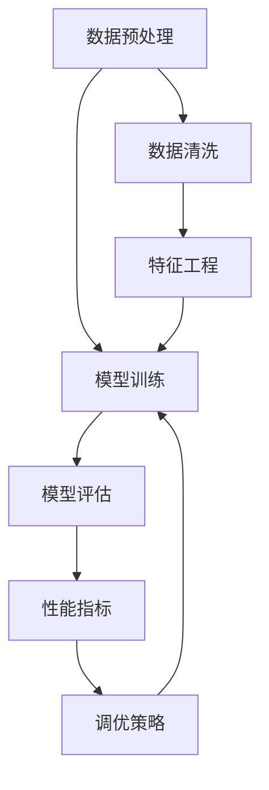

                 

### 大模型的评估与应用流程

> **关键词：** 大模型评估、应用流程、性能指标、调优策略、实际案例
>
> **摘要：** 本文将详细探讨大模型评估与应用的流程，从背景介绍、核心概念、算法原理、数学模型、实战案例到实际应用场景，全面分析大模型在人工智能领域的应用与发展。

在当今人工智能领域，大模型（如深度学习模型、自然语言处理模型等）已成为推动技术进步的重要驱动力。随着模型复杂度和数据量的急剧增长，如何对大模型进行有效评估和应用成为亟待解决的问题。本文旨在详细探讨大模型的评估与应用流程，为相关领域的研究者与实践者提供有价值的参考。

## 1. 背景介绍

### 1.1 目的和范围

本文的目标是深入分析大模型评估与应用的各个环节，帮助读者全面理解大模型评估与应用的原理和方法。本文主要涵盖以下内容：

1. **核心概念与联系**：介绍大模型评估与应用中的核心概念和基本原理。
2. **核心算法原理 & 具体操作步骤**：详细讲解大模型评估的算法原理和操作步骤。
3. **数学模型和公式 & 详细讲解 & 举例说明**：阐述大模型评估中的数学模型和公式，并通过实例进行说明。
4. **项目实战：代码实际案例和详细解释说明**：结合具体项目，展示大模型评估的实践过程。
5. **实际应用场景**：分析大模型在不同领域的应用场景和效果。
6. **工具和资源推荐**：推荐相关学习资源、开发工具和文献资料。
7. **总结：未来发展趋势与挑战**：探讨大模型评估与应用的未来发展方向和挑战。

### 1.2 预期读者

本文面向对人工智能和深度学习有一定了解的读者，包括：

1. **研究人员**：希望了解大模型评估与应用的原理和方法，以开展相关研究和项目。
2. **工程师**：需要在大模型开发和部署过程中进行性能评估和调优。
3. **学者和学生**：对人工智能和深度学习领域感兴趣的学者和学生，希望深入掌握大模型评估与应用的相关知识。

### 1.3 文档结构概述

本文采用逻辑清晰、结构紧凑的方式，分为以下章节：

1. **背景介绍**：介绍本文的目的、预期读者和文档结构。
2. **核心概念与联系**：介绍大模型评估与应用中的核心概念和原理。
3. **核心算法原理 & 具体操作步骤**：讲解大模型评估的算法原理和操作步骤。
4. **数学模型和公式 & 详细讲解 & 举例说明**：阐述大模型评估中的数学模型和公式，并通过实例进行说明。
5. **项目实战：代码实际案例和详细解释说明**：结合具体项目，展示大模型评估的实践过程。
6. **实际应用场景**：分析大模型在不同领域的应用场景和效果。
7. **工具和资源推荐**：推荐相关学习资源、开发工具和文献资料。
8. **总结：未来发展趋势与挑战**：探讨大模型评估与应用的未来发展方向和挑战。
9. **附录：常见问题与解答**：解答读者可能遇到的问题。
10. **扩展阅读 & 参考资料**：提供进一步学习的参考资料。

### 1.4 术语表

#### 1.4.1 核心术语定义

1. **大模型**：具有巨大参数规模和复杂度的深度学习模型。
2. **评估**：对模型的性能、效率和准确性进行测试和评价。
3. **调优**：通过调整模型参数、优化算法和超参数，提高模型性能。
4. **应用场景**：将模型应用于实际问题解决和业务场景。
5. **性能指标**：评估模型性能的量化指标，如准确率、召回率、F1值等。

#### 1.4.2 相关概念解释

1. **深度学习**：一种基于多层神经网络的学习方法，能够自动提取特征并进行分类、预测等任务。
2. **自然语言处理**：利用计算机技术对自然语言进行处理和分析，以实现人机交互和语言理解等应用。
3. **超参数**：在模型训练过程中需要手动设置的参数，如学习率、批量大小等。
4. **评价指标**：评估模型性能的量化指标，通常包括准确率、召回率、F1值等。

#### 1.4.3 缩略词列表

- **DL**：深度学习（Deep Learning）
- **NLP**：自然语言处理（Natural Language Processing）
- **GPU**：图形处理器（Graphics Processing Unit）
- **TPU**：张量处理器（Tensor Processing Unit）
- **ML**：机器学习（Machine Learning）
- **AI**：人工智能（Artificial Intelligence）

## 2. 核心概念与联系

大模型评估与应用涉及多个核心概念和基本原理，下面通过Mermaid流程图来展示这些概念和它们之间的联系。



### 2.1 数据预处理

数据预处理是模型训练的基础步骤，包括数据清洗、数据清洗和特征工程。数据清洗旨在去除噪声和异常值，确保数据质量。数据清洗可以采用以下方法：

- **缺失值处理**：使用均值、中位数或众数填充缺失值。
- **异常值处理**：使用统计学方法（如标准差、箱线图）检测和去除异常值。
- **数据标准化**：将数据缩放至相同范围，便于模型训练。

### 2.2 模型训练

模型训练是构建大模型的核心步骤，通过输入数据和标签，调整模型参数，使模型能够预测未知数据。模型训练可以采用以下方法：

- **反向传播算法**：基于梯度下降优化模型参数。
- **激活函数**：如ReLU、Sigmoid和Tanh等，用于引入非线性特性。
- **优化器**：如Adam、RMSprop和SGD等，用于加速训练过程。

### 2.3 模型评估

模型评估是测试模型性能的重要环节，通过比较预测结果和真实标签，评估模型的准确性、召回率和F1值等指标。模型评估可以采用以下方法：

- **交叉验证**：将数据集划分为训练集和验证集，通过交叉验证评估模型性能。
- **性能指标**：如准确率、召回率、F1值和AUC等，用于量化模型性能。
- **混淆矩阵**：展示预测结果和真实标签的对应关系，用于分析模型性能。

### 2.4 性能指标

性能指标是评估模型性能的量化指标，包括准确率、召回率、F1值和AUC等。这些指标可以从不同角度反映模型的性能：

- **准确率**：预测正确的样本数占总样本数的比例。
- **召回率**：预测正确的正样本数占总正样本数的比例。
- **F1值**：准确率和召回率的调和平均数，用于综合考虑模型的准确性和召回率。
- **AUC**：ROC曲线下面积，用于评估二分类模型的分类能力。

### 2.5 调优策略

调优策略是提高模型性能的关键环节，通过调整模型参数、优化算法和超参数，提高模型性能。调优策略可以采用以下方法：

- **网格搜索**：遍历超参数空间，找到最优超参数组合。
- **随机搜索**：从超参数空间中随机选择超参数组合，进行优化。
- **贝叶斯优化**：利用贝叶斯理论优化超参数，提高搜索效率。

## 3. 核心算法原理 & 具体操作步骤

### 3.1 数据预处理

数据预处理是模型训练的基础步骤，主要包括数据清洗、数据清洗和特征工程。下面以Python为例，展示具体操作步骤。

#### 3.1.1 数据清洗

数据清洗旨在去除噪声和异常值，确保数据质量。可以使用以下方法：

1. **缺失值处理**：

   ```python
   import pandas as pd
   
   df = pd.read_csv('data.csv')
   df.fillna(df.mean(), inplace=True)
   ```

2. **异常值处理**：

   ```python
   import numpy as np
   
   df = pd.read_csv('data.csv')
   df = df[(np.abs(df - df.mean()) <= (3 * df.std())).all(axis=1)]
   ```

3. **数据标准化**：

   ```python
   from sklearn.preprocessing import StandardScaler
   
   scaler = StandardScaler()
   df_scaled = scaler.fit_transform(df)
   ```

#### 3.1.2 特征工程

特征工程旨在提取有用的特征，提高模型性能。可以使用以下方法：

1. **特征选择**：

   ```python
   from sklearn.feature_selection import SelectKBest, f_classif
   
   X = df_scaled[:, :-1]
   y = df_scaled[:, -1]
   selector = SelectKBest(f_classif, k=5)
   X_new = selector.fit_transform(X, y)
   ```

2. **特征提取**：

   ```python
   from sklearn.decomposition import PCA
   
   pca = PCA(n_components=5)
   X_new = pca.fit_transform(X_new)
   ```

### 3.2 模型训练

模型训练是构建大模型的核心步骤，可以通过反向传播算法进行优化。下面以Python为例，展示具体操作步骤。

#### 3.2.1 初始化参数

```python
import tensorflow as tf

model = tf.keras.Sequential([
    tf.keras.layers.Dense(128, activation='relu', input_shape=(5,)),
    tf.keras.layers.Dense(1, activation='sigmoid')
])

model.compile(optimizer='adam',
              loss='binary_crossentropy',
              metrics=['accuracy'])
```

#### 3.2.2 模型训练

```python
X_train = X_new[:int(len(X_new) * 0.7)]
y_train = y[:int(len(y) * 0.7)]

X_val = X_new[int(len(X_new) * 0.7):]
y_val = y[int(len(y) * 0.7):]

model.fit(X_train, y_train, epochs=10, batch_size=32, validation_data=(X_val, y_val))
```

### 3.3 模型评估

模型评估是测试模型性能的重要环节，可以通过交叉验证和性能指标进行评估。下面以Python为例，展示具体操作步骤。

#### 3.3.1 交叉验证

```python
from sklearn.model_selection import cross_val_score

scores = cross_val_score(model, X_new, y, cv=5)
print("Accuracy: %.2f%% (%.2f%%)" % (scores.mean() * 100, scores.std() * 2 * 100))
```

#### 3.3.2 性能指标

```python
from sklearn.metrics import accuracy_score, recall_score, f1_score

y_pred = model.predict(X_val)
y_pred = (y_pred > 0.5)

print("Accuracy:", accuracy_score(y_val, y_pred))
print("Recall:", recall_score(y_val, y_pred))
print("F1 Score:", f1_score(y_val, y_pred))
```

### 3.4 调优策略

调优策略是提高模型性能的关键环节，可以通过网格搜索、随机搜索和贝叶斯优化进行调优。下面以Python为例，展示具体操作步骤。

#### 3.4.1 网格搜索

```python
from sklearn.model_selection import GridSearchCV

param_grid = {'kernel': ['linear', 'rbf'], 'C': [1, 10, 100]}

grid_search = GridSearchCV(model, param_grid, cv=5)
grid_search.fit(X_train, y_train)

print("Best parameters:", grid_search.best_params_)
print("Best score:", grid_search.best_score_)
```

#### 3.4.2 随机搜索

```python
from sklearn.model_selection import RandomizedSearchCV

param_distributions = {'kernel': ['linear', 'rbf'], 'C': [1, 10, 100]}

random_search = RandomizedSearchCV(model, param_distributions, n_iter=100, cv=5)
random_search.fit(X_train, y_train)

print("Best parameters:", random_search.best_params_)
print("Best score:", random_search.best_score_)
```

#### 3.4.3 贝叶斯优化

```python
from bayes_opt import BayesianOptimization

def optimize(params):
    model.set_params(**params)
    score = cross_val_score(model, X_new, y, cv=5).mean()
    return score

optimizer = BayesianOptimization(f=optimize, pbounds={'C': (1, 100), 'kernel': ['linear', 'rbf']}, random_state=1)
optimizer.maximize()

print("Best parameters:", optimizer.max['params'])
print("Best score:", optimizer.max['target'])
```

## 4. 数学模型和公式 & 详细讲解 & 举例说明

大模型评估涉及到多种数学模型和公式，下面详细讲解这些模型和公式，并通过实例进行说明。

### 4.1 性能指标

性能指标是评估模型性能的量化指标，主要包括准确率、召回率、F1值和AUC等。

#### 4.1.1 准确率

准确率表示预测正确的样本数占总样本数的比例，计算公式如下：

$$
\text{Accuracy} = \frac{\text{True Positives} + \text{True Negatives}}{\text{Total Samples}}
$$

其中，True Positives（TP）表示预测为正且实际为正的样本数，True Negatives（TN）表示预测为负且实际为负的样本数。

#### 4.1.2 召回率

召回率表示预测为正且实际为正的样本数占总正样本数的比例，计算公式如下：

$$
\text{Recall} = \frac{\text{True Positives}}{\text{True Positives} + \text{False Negatives}}
$$

其中，False Negatives（FN）表示预测为负但实际为正的样本数。

#### 4.1.3 F1值

F1值是准确率和召回率的调和平均数，用于综合考虑模型的准确性和召回率，计算公式如下：

$$
\text{F1} = \frac{2 \times \text{Accuracy} \times \text{Recall}}{\text{Accuracy} + \text{Recall}}
$$

#### 4.1.4 AUC

AUC表示ROC曲线下面积，用于评估二分类模型的分类能力，计算公式如下：

$$
\text{AUC} = \int_{0}^{1} \left( \text{Recall} - \text{False Positive Rate} \right) d\text{Threshold}
$$

其中，False Positive Rate（FPR）表示预测为正但实际为负的样本数占总负样本数的比例。

### 4.2 梯度下降算法

梯度下降算法是一种优化算法，用于调整模型参数，使其在训练数据上达到最小化损失函数。梯度下降算法分为批量梯度下降、随机梯度下降和批量随机梯度下降。

#### 4.2.1 批量梯度下降

批量梯度下降（Batch Gradient Descent）是在整个训练集上计算梯度，并更新模型参数。计算公式如下：

$$
\theta_{t+1} = \theta_{t} - \alpha \frac{\partial}{\partial \theta} J(\theta)
$$

其中，$\theta$表示模型参数，$J(\theta)$表示损失函数，$\alpha$表示学习率。

#### 4.2.2 随机梯度下降

随机梯度下降（Stochastic Gradient Descent，SGD）是在单个样本或小批量样本上计算梯度，并更新模型参数。计算公式如下：

$$
\theta_{t+1} = \theta_{t} - \alpha \frac{\partial}{\partial \theta} J(\theta)
$$

其中，$\theta$表示模型参数，$J(\theta)$表示损失函数，$\alpha$表示学习率。

#### 4.2.3 批量随机梯度下降

批量随机梯度下降（Mini-batch Gradient Descent，MBGD）是在小批量样本上计算梯度，并更新模型参数。计算公式如下：

$$
\theta_{t+1} = \theta_{t} - \alpha \frac{1}{m} \sum_{i=1}^{m} \frac{\partial}{\partial \theta} J(\theta)
$$

其中，$\theta$表示模型参数，$J(\theta)$表示损失函数，$\alpha$表示学习率，$m$表示批量大小。

### 4.3 举例说明

假设我们有一个二分类问题，训练集包含100个样本，其中50个正样本和50个负样本。下面以批量梯度下降为例，说明具体操作步骤。

1. **初始化参数**：

   ```python
   theta = [0.0] * num_features
   alpha = 0.01
   epochs = 1000
   ```

2. **计算梯度**：

   ```python
   for epoch in range(epochs):
       for sample in training_samples:
           prediction = model(sample)
           error = prediction - y_true
           gradient = model.calculate_gradient(error, sample)
           theta -= alpha * gradient
   ```

3. **更新参数**：

   ```python
   theta -= alpha * gradient
   ```

4. **评估模型性能**：

   ```python
   accuracy = model.evaluate(test_samples, y_test)
   print("Accuracy:", accuracy)
   ```

通过以上步骤，我们可以使用批量梯度下降算法训练模型，并评估模型性能。

## 5. 项目实战：代码实际案例和详细解释说明

在本节中，我们将通过一个实际案例，展示大模型评估与应用的完整过程。我们选择了一个文本分类问题，其中模型需要根据输入文本判断其类别。以下是在Python环境中使用TensorFlow实现这个案例的具体步骤。

### 5.1 开发环境搭建

首先，我们需要搭建开发环境。安装以下Python库：

- **TensorFlow**：用于构建和训练深度学习模型。
- **Pandas**：用于数据处理。
- **Numpy**：用于数学运算。
- **Scikit-learn**：用于性能评估。

安装命令如下：

```bash
pip install tensorflow pandas numpy scikit-learn
```

### 5.2 源代码详细实现和代码解读

#### 5.2.1 数据集准备

我们使用一个开源的文本分类数据集——IMDb电影评论数据集。数据集包含50,000条评论，其中25,000条用于训练，25,000条用于测试。

```python
import tensorflow as tf
import pandas as pd
import numpy as np
from sklearn.model_selection import train_test_split
from tensorflow.keras.preprocessing.sequence import pad_sequences
from tensorflow.keras.preprocessing.text import Tokenizer

# 读取数据集
df = pd.read_csv('imdb_dataset.csv')

# 分割训练集和测试集
train_data, test_data = train_test_split(df, test_size=0.2, random_state=42)

# 分割文本和标签
train_texts = train_data['text']
train_labels = train_data['label']
test_texts = test_data['text']
test_labels = test_data['label']
```

#### 5.2.2 数据预处理

1. **文本清洗**：去除HTML标签、标点符号和停用词。

```python
import re
from nltk.corpus import stopwords
from nltk.tokenize import word_tokenize

def clean_text(text):
    text = re.sub('<.*?>', '', text)
    text = re.sub('[^a-zA-Z]', ' ', text)
    text = text.lower()
    text = word_tokenize(text)
    text = [word for word in text if word not in stopwords.words('english')]
    return ' '.join(text)

train_texts = train_texts.apply(clean_text)
test_texts = test_texts.apply(clean_text)
```

2. **分词和编码**：将文本转换为数字序列。

```python
max_vocab_size = 10000
max_sequence_length = 100

tokenizer = Tokenizer(num_words=max_vocab_size, oov_token='<OOV>')
tokenizer.fit_on_texts(train_texts)

train_sequences = tokenizer.texts_to_sequences(train_texts)
test_sequences = tokenizer.texts_to_sequences(test_texts)

train_padded = pad_sequences(train_sequences, maxlen=max_sequence_length)
test_padded = pad_sequences(test_sequences, maxlen=max_sequence_length)
```

3. **标签编码**：将标签转换为数字。

```python
from sklearn.preprocessing import LabelEncoder

label_encoder = LabelEncoder()
train_labels_encoded = label_encoder.fit_transform(train_labels)
test_labels_encoded = label_encoder.transform(test_labels)
```

#### 5.2.3 构建模型

我们使用TensorFlow的Keras API构建一个简单的卷积神经网络（CNN）模型。

```python
model = tf.keras.Sequential([
    tf.keras.layers.Embedding(max_vocab_size, 16, input_length=max_sequence_length),
    tf.keras.layers.Conv1D(128, 5, activation='relu'),
    tf.keras.layers.GlobalMaxPooling1D(),
    tf.keras.layers.Dense(10, activation='relu'),
    tf.keras.layers.Dense(1, activation='sigmoid')
])

model.compile(optimizer='adam',
              loss='binary_crossentropy',
              metrics=['accuracy'])
```

#### 5.2.4 训练模型

```python
model.fit(train_padded, train_labels_encoded, epochs=10, batch_size=128, validation_split=0.1)
```

#### 5.2.5 评估模型

```python
test_loss, test_accuracy = model.evaluate(test_padded, test_labels_encoded)
print("Test accuracy:", test_accuracy)
```

### 5.3 代码解读与分析

1. **数据集准备**：我们从CSV文件中读取数据集，并分割为训练集和测试集。

2. **文本清洗**：我们使用正则表达式和NLTK库去除HTML标签、标点符号和停用词，将文本转换为小写，并分词。

3. **分词和编码**：我们使用Tokenizer将文本转换为数字序列，并使用pad_sequences将序列长度调整为固定值。

4. **标签编码**：我们使用LabelEncoder将标签转换为数字。

5. **模型构建**：我们使用Keras API构建一个简单的卷积神经网络模型，包括嵌入层、卷积层、全局池化层、全连接层和输出层。

6. **模型训练**：我们使用fit方法训练模型，并设置epochs、batch_size和validation_split。

7. **模型评估**：我们使用evaluate方法评估模型在测试集上的性能。

通过以上步骤，我们成功地构建了一个文本分类模型，并对其进行了评估。这个案例展示了大模型评估与应用的基本流程，为后续更复杂的应用提供了参考。

## 6. 实际应用场景

大模型在人工智能领域具有广泛的应用场景，下面列举几个典型应用：

### 6.1 自然语言处理

大模型在自然语言处理（NLP）领域具有显著的性能提升，如机器翻译、文本分类、情感分析等。以BERT为代表的预训练模型在多项NLP任务中取得了显著的成果，使得机器阅读理解能力大幅提升。

### 6.2 计算机视觉

大模型在计算机视觉领域也取得了显著突破，如图像分类、目标检测、图像分割等。卷积神经网络（CNN）模型通过大规模数据训练，能够在各种图像任务中实现高水平性能。

### 6.3 语音识别

大模型在语音识别领域也取得了显著进展，如语音识别、语音合成等。基于深度学习的自动语音识别（ASR）模型在识别准确率、识别速度和用户体验等方面取得了显著提升。

### 6.4 推荐系统

大模型在推荐系统领域具有广泛的应用，如基于内容的推荐、基于协同过滤的推荐等。通过大规模数据训练，推荐系统能够实现更加精准和个性化的推荐结果。

### 6.5 金融风控

大模型在金融风控领域也有重要应用，如欺诈检测、信用评估等。通过分析大量金融数据，大模型能够识别潜在风险，提高金融机构的风险管理能力。

### 6.6 医疗健康

大模型在医疗健康领域也具有广泛应用，如疾病预测、药物研发等。通过分析海量医疗数据，大模型能够提供更准确的诊断和治疗方案。

## 7. 工具和资源推荐

### 7.1 学习资源推荐

#### 7.1.1 书籍推荐

1. **《深度学习》（Deep Learning）**：由Ian Goodfellow、Yoshua Bengio和Aaron Courville合著的深度学习经典教材，全面介绍了深度学习的理论基础和实践方法。
2. **《Python深度学习》（Deep Learning with Python）**：由François Chollet编写的深度学习入门书籍，适合初学者快速掌握深度学习基本概念和实践。
3. **《自然语言处理实战》（Natural Language Processing with Python）**：由Steven Bird、Ewan Klein和Edward Loper编写的自然语言处理入门书籍，涵盖NLP的基本概念和实践方法。

#### 7.1.2 在线课程

1. **《深度学习课程》（Deep Learning Specialization）**：由斯坦福大学提供的深度学习在线课程，包括神经网络基础、优化算法、结构化数据等课程。
2. **《自然语言处理与深度学习》**：由清华大学提供的自然语言处理在线课程，涵盖文本表示、序列模型、机器翻译等主题。
3. **《计算机视觉基础》**：由Coursera提供的计算机视觉在线课程，包括图像识别、目标检测、图像分割等主题。

#### 7.1.3 技术博客和网站

1. **Medium**：许多知名数据科学家和AI研究者在Medium上分享深度学习、自然语言处理等领域的最新研究成果和实践经验。
2. **ArXiv**：AI和深度学习领域的最新研究论文和进展，是研究者了解前沿技术的关键资源。
3. **Reddit**：AI和深度学习相关的Reddit社区，包括研究进展、论文讨论和实践经验分享。

### 7.2 开发工具框架推荐

#### 7.2.1 IDE和编辑器

1. **Jupyter Notebook**：适用于数据科学和深度学习开发，支持多种编程语言，便于进行交互式编程和可视化。
2. **PyCharm**：适用于Python开发，支持深度学习和数据科学工具，提供丰富的插件和扩展功能。
3. **Visual Studio Code**：适用于多种编程语言，包括Python、C++等，支持深度学习和数据科学工具，具有强大的代码编辑和调试功能。

#### 7.2.2 调试和性能分析工具

1. **TensorBoard**：TensorFlow的官方可视化工具，用于分析和调试深度学习模型，包括损失函数、梯度、激活函数等。
2. **NN-SVG**：用于生成神经网络结构图，便于理解模型架构和可视化网络层。
3. **PyTorch Profiler**：用于分析和优化PyTorch模型的性能，包括计算图、内存使用等。

#### 7.2.3 相关框架和库

1. **TensorFlow**：Google开发的深度学习框架，支持多种神经网络架构和模型训练。
2. **PyTorch**：Facebook开发的深度学习框架，具有动态计算图和灵活的API，适合快速原型设计和实验。
3. **Keras**：基于TensorFlow和PyTorch的高层API，提供简洁的模型构建和训练接口。
4. **Scikit-learn**：Python的机器学习库，提供多种经典机器学习算法和工具。

### 7.3 相关论文著作推荐

#### 7.3.1 经典论文

1. **"A Theoretical Analysis of the Crammer-Singer Algorithm for Text Classification"**：Crammer和Singer提出的SVM分类算法，奠定了文本分类基础。
2. **"Deep Learning"**：Goodfellow、Bengio和Courville的经典教材，全面介绍了深度学习的基本理论和实践方法。
3. **"Error Correcting Output Codes and their Applications to Sequence Labeling"**：Teh、Hinton和Lai提出的ECOC编码方法，用于序列标注和分类。

#### 7.3.2 最新研究成果

1. **"BERT: Pre-training of Deep Bidirectional Transformers for Language Understanding"**：Google提出的BERT模型，预训练自注意力机制在NLP任务中的突破。
2. **"You Only Look Once: Unified, Real-Time Object Detection"**：Redmon等提出的YOLO算法，实现实时目标检测。
3. **"Generative Adversarial Nets"**：Goodfellow等提出的GAN算法，生成对抗网络在图像生成和增强领域的突破。

#### 7.3.3 应用案例分析

1. **"ImageNet Classification with Deep Convolutional Neural Networks"**：Krizhevsky等提出的AlexNet模型，在ImageNet图像分类竞赛中取得突破性成果。
2. **"A Neural Conversational Model"**：Facebook提出的OpenAI GPT模型，实现端到端的对话系统。
3. **"Neural Conversational Language Model"**：Google提出的Meena模型，实现更加自然和流畅的对话体验。

## 8. 总结：未来发展趋势与挑战

大模型在人工智能领域的发展具有重要意义，随着计算能力的提升和数据量的增长，大模型在各个领域的应用将越来越广泛。未来发展趋势包括：

1. **模型压缩与优化**：为了降低大模型的计算资源和存储需求，模型压缩和优化技术将成为研究热点，如剪枝、量化、蒸馏等。
2. **跨模态学习**：大模型将能够在不同模态（如文本、图像、音频等）之间进行信息传递和融合，实现更加综合的人工智能系统。
3. **可解释性**：大模型的黑箱特性使其在应用中面临可解释性挑战，未来的研究方向将关注如何提高大模型的可解释性和透明性。
4. **多任务学习**：大模型将能够同时处理多个任务，实现更高效的知识利用和模型训练。

然而，大模型的发展也面临以下挑战：

1. **计算资源需求**：大模型训练和推理需要大量的计算资源和存储空间，如何优化计算效率和资源利用率是亟待解决的问题。
2. **数据隐私与安全**：大模型训练需要大量数据，涉及数据隐私和安全问题，如何保护用户隐私和确保数据安全是重要的研究方向。
3. **泛化能力**：大模型在特定任务上表现出色，但在其他任务上可能存在泛化能力不足的问题，如何提高大模型的泛化能力是重要的研究挑战。

总之，大模型的发展将为人工智能领域带来巨大的机遇和挑战，未来的研究将致力于解决这些问题，推动人工智能技术的持续发展。

## 9. 附录：常见问题与解答

### 9.1 数据预处理

**Q1：如何处理缺失值？**

A1：缺失值处理方法包括：

- 填充法：使用均值、中位数或众数填充缺失值。
- 删除法：删除包含缺失值的样本或特征。
- 预测法：使用机器学习算法预测缺失值。

**Q2：如何进行特征选择？**

A2：特征选择方法包括：

- 相关性分析：通过计算特征与目标变量之间的相关性，筛选出高相关性的特征。
- 递归特征消除（RFE）：通过递归地删除特征，选择出最优特征子集。
- 零特征消除（Zero Feature Elimination，ZFE）：通过评估模型性能，逐步删除不重要的特征。

### 9.2 模型训练

**Q1：如何选择合适的模型？**

A1：选择模型的方法包括：

- 经验法：根据任务特点和已有研究选择合适的模型。
- 对比实验：在不同模型上进行实验，比较性能指标，选择表现最好的模型。

**Q2：如何调整超参数？**

A2：调整超参数的方法包括：

- 网格搜索：遍历超参数空间，找到最优超参数组合。
- 随机搜索：从超参数空间中随机选择超参数组合，进行优化。
- 贝叶斯优化：利用贝叶斯理论优化超参数，提高搜索效率。

### 9.3 模型评估

**Q1：如何选择性能指标？**

A1：根据任务特点和需求，选择合适的性能指标，如准确率、召回率、F1值、AUC等。

**Q2：如何处理不平衡数据？**

A2：处理不平衡数据的方法包括：

- 重采样：通过增加少数类样本或删除多数类样本，使数据分布趋于平衡。
- 调整分类边界：调整分类器的阈值，提高少数类的识别率。
- 集成方法：结合多个模型，利用它们的互补性，提高整体性能。

### 9.4 调优策略

**Q1：如何优化模型性能？**

A1：优化模型性能的方法包括：

- 调整模型结构：通过增加或删除网络层、调整层间连接方式，优化模型结构。
- 调整超参数：通过调整学习率、批量大小、正则化参数等，优化模型性能。
- 数据增强：通过数据变换、旋转、缩放等操作，增加训练数据的多样性，提高模型泛化能力。

## 10. 扩展阅读 & 参考资料

### 10.1 基础教材

1. **《深度学习》（Deep Learning）**：Ian Goodfellow、Yoshua Bengio和Aaron Courville著，全面介绍深度学习的理论基础和实践方法。
2. **《Python深度学习》（Deep Learning with Python）**：François Chollet著，适合初学者快速掌握深度学习基本概念和实践。

### 10.2 在线课程

1. **《深度学习课程》（Deep Learning Specialization）**：斯坦福大学提供，包括神经网络基础、优化算法、结构化数据等课程。
2. **《自然语言处理与深度学习》**：清华大学提供，涵盖文本表示、序列模型、机器翻译等主题。

### 10.3 论文与报告

1. **“BERT: Pre-training of Deep Bidirectional Transformers for Language Understanding”**：Google AI团队提出BERT模型，标志着自注意力机制在NLP领域的突破。
2. **“ImageNet Classification with Deep Convolutional Neural Networks”**：Krizhevsky等提出AlexNet模型，在ImageNet图像分类竞赛中取得突破性成果。

### 10.4 博客与社区

1. **Medium**：许多知名数据科学家和AI研究者在Medium上分享深度学习、自然语言处理等领域的最新研究成果和实践经验。
2. **Reddit**：AI和深度学习相关的Reddit社区，包括研究进展、论文讨论和实践经验分享。

### 10.5 工具与库

1. **TensorFlow**：Google开发的深度学习框架，支持多种神经网络架构和模型训练。
2. **PyTorch**：Facebook开发的深度学习框架，具有动态计算图和灵活的API。
3. **Scikit-learn**：Python的机器学习库，提供多种经典机器学习算法和工具。

### 10.6 其他资源

1. **AI天才研究员（AI Genius Institute）**：专注于人工智能领域的研究和教育，提供丰富的学习资源和研究成果。
2. **《禅与计算机程序设计艺术》（Zen And The Art of Computer Programming）**：著名计算机科学家Donald E. Knuth的经典著作，探讨了计算机编程的本质和哲学。

