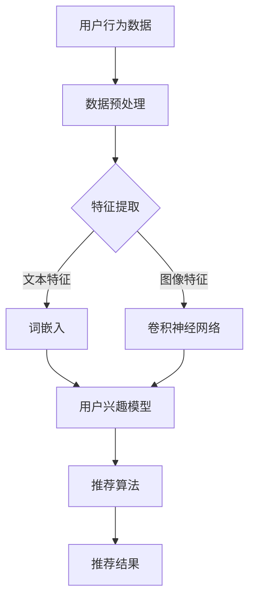

                 

# 大模型视角下推荐系统的未来发展趋势展望

> 关键词：推荐系统、大模型、深度学习、个性化、用户行为分析、数据驱动

> 摘要：本文从大模型的视角出发，探讨了推荐系统的发展趋势。通过分析大模型在推荐系统中的重要作用，本文揭示了深度学习技术的革新、用户行为的精细化分析以及数据驱动的策略，展望了推荐系统的未来发展方向，为相关领域的研究和开发提供了新的视角和思路。

## 1. 背景介绍

### 1.1 目的和范围

本文旨在通过深入分析大模型在推荐系统中的应用，探讨其未来的发展趋势。我们将从技术层面出发，结合实际案例，对推荐系统的核心概念、算法原理、数学模型以及实际应用进行详细阐述。

### 1.2 预期读者

本文适合以下读者群体：

1. 推荐系统开发人员
2. 数据科学家和人工智能工程师
3. 对推荐系统感兴趣的学术研究人员
4. 对技术创新和应用感兴趣的广大读者

### 1.3 文档结构概述

本文结构分为十个部分：

1. 引言
2. 背景介绍
3. 核心概念与联系
4. 核心算法原理与具体操作步骤
5. 数学模型和公式
6. 项目实战：代码实际案例和详细解释说明
7. 实际应用场景
8. 工具和资源推荐
9. 总结：未来发展趋势与挑战
10. 附录：常见问题与解答

### 1.4 术语表

#### 1.4.1 核心术语定义

- 推荐系统：一种能够根据用户历史行为、兴趣偏好等信息，向用户推荐相关内容或产品的系统。
- 大模型：指具有巨大参数量和复杂结构的机器学习模型，如深度神经网络。
- 深度学习：一种基于多层神经网络的学习方法，能够自动提取特征并实现复杂函数的逼近。
- 用户行为分析：通过对用户行为数据的分析，挖掘用户兴趣和需求，为推荐系统提供决策依据。
- 数据驱动：一种以数据为中心的设计理念，通过数据分析来指导系统开发和应用。

#### 1.4.2 相关概念解释

- 深度神经网络（DNN）：一种具有多个隐藏层的神经网络，能够处理高维数据和复杂任务。
- 循环神经网络（RNN）：一种能够处理序列数据的神经网络，通过循环结构来保留历史信息。
- 卷积神经网络（CNN）：一种能够处理图像数据的神经网络，通过卷积操作来提取图像特征。

#### 1.4.3 缩略词列表

- DNN：深度神经网络
- RNN：循环神经网络
- CNN：卷积神经网络
- ML：机器学习
- AI：人工智能
- NLP：自然语言处理
- CV：计算机视觉

## 2. 核心概念与联系

为了更好地理解大模型在推荐系统中的应用，我们首先需要了解核心概念和它们之间的联系。以下是推荐系统的核心概念及其原理和架构的Mermaid流程图：



### 2.1 用户行为数据

用户行为数据是推荐系统的输入，包括浏览记录、搜索历史、购买行为等。通过对这些数据的收集和分析，我们可以了解用户的兴趣偏好和行为模式。

### 2.2 数据预处理

数据预处理是推荐系统开发的重要步骤，主要包括数据清洗、数据归一化和数据转换等。清洗数据是为了去除噪声和异常值，归一化是为了消除不同特征之间的量纲差异，数据转换是为了将原始数据转换为适合模型训练的格式。

### 2.3 特征提取

特征提取是从原始数据中提取有用的信息，为模型训练提供输入。在推荐系统中，特征提取主要包括文本特征提取和图像特征提取。

- **文本特征提取**：将文本数据转换为向量表示，常用的方法有词嵌入（Word Embedding）和词袋模型（Bag of Words）。
- **图像特征提取**：通过卷积神经网络（CNN）提取图像特征，如边缘、纹理和形状等。

### 2.4 用户兴趣模型

用户兴趣模型是推荐系统的核心部分，它根据用户的历史行为和特征提取结果，预测用户对特定内容的兴趣程度。用户兴趣模型可以是基于内容的模型，也可以是基于协同过滤的模型。

- **基于内容的模型**：根据用户兴趣和内容特征进行匹配，推荐与用户兴趣相关的内容。
- **基于协同过滤的模型**：通过分析用户行为和偏好，为用户推荐相似用户喜欢的内容。

### 2.5 推荐算法

推荐算法是根据用户兴趣模型和内容特征，生成推荐结果的关键步骤。常用的推荐算法有基于内容的推荐算法、基于协同过滤的推荐算法和基于模型的推荐算法。

- **基于内容的推荐算法**：根据用户兴趣和内容特征进行匹配，推荐与用户兴趣相关的内容。
- **基于协同过滤的推荐算法**：通过分析用户行为和偏好，为用户推荐相似用户喜欢的内容。
- **基于模型的推荐算法**：利用深度学习模型，对用户行为和内容特征进行建模，预测用户兴趣，生成推荐结果。

### 2.6 推荐结果

推荐结果是根据推荐算法生成的，旨在满足用户的需求和兴趣。推荐结果可以是商品、文章、音乐等多种形式，通过个性化的推荐，提升用户体验和满意度。

## 3. 核心算法原理 & 具体操作步骤

在本章节，我们将详细介绍推荐系统的核心算法原理，并使用伪代码进行具体操作步骤的阐述。

### 3.1 基于内容的推荐算法

基于内容的推荐算法主要通过分析用户兴趣和内容特征，为用户推荐与用户兴趣相关的内容。以下是其算法原理和伪代码：

#### 算法原理：

1. 提取用户兴趣特征。
2. 提取内容特征。
3. 计算用户兴趣特征和内容特征之间的相似度。
4. 根据相似度推荐与用户兴趣相关的内容。

#### 伪代码：

```python
# 用户兴趣特征提取
def extract_user_interest(user_behavior):
    # 提取用户历史行为中的关键词
    keywords = extract_keywords(user_behavior)
    # 将关键词转换为向量表示
    user_interest = word_embedding(keywords)
    return user_interest

# 内容特征提取
def extract_content_features(content):
    # 提取内容的关键词
    keywords = extract_keywords(content)
    # 将关键词转换为向量表示
    content_features = word_embedding(keywords)
    return content_features

# 计算相似度
def calculate_similarity(user_interest, content_features):
    similarity = cosine_similarity(user_interest, content_features)
    return similarity

# 推荐内容
def recommend_contents(user_interest, content_features):
    similarities = []
    for content in content_features:
        similarity = calculate_similarity(user_interest, content)
        similarities.append(similarity)
    # 根据相似度推荐内容
    recommended_contents = [content for _, content in sorted(zip(similarities, content_features), reverse=True)]
    return recommended_contents
```

### 3.2 基于协同过滤的推荐算法

基于协同过滤的推荐算法通过分析用户行为和偏好，为用户推荐相似用户喜欢的内容。以下是其算法原理和伪代码：

#### 算法原理：

1. 构建用户相似度矩阵。
2. 根据用户相似度矩阵，为用户推荐相似用户喜欢的内容。

#### 伪代码：

```python
# 构建用户相似度矩阵
def build_similarity_matrix(user_behavior):
    similarity_matrix = []
    for user in user_behavior:
        similarity = calculate_similarity(user_behavior[user], other_users)
        similarity_matrix.append(similarity)
    return similarity_matrix

# 计算用户相似度
def calculate_similarity(user_behavior, other_users):
    similarity = []
    for other_user in other_users:
        # 计算用户行为和相似用户的行为之间的相似度
        similarity.append(cosine_similarity(user_behavior, other_user))
    return similarity

# 推荐内容
def recommend_contents(user_behavior, content_preferences):
    recommended_contents = []
    for other_user in content_preferences:
        # 找到与用户最相似的N个用户
        similar_users = find_similar_users(user_behavior, other_users, N)
        # 推荐相似用户喜欢的但用户未浏览过的内容
        recommended_contents.extend([content for content in other_user if content not in user_behavior])
    return recommended_contents
```

### 3.3 基于模型的推荐算法

基于模型的推荐算法通过构建用户行为和内容特征的深度学习模型，预测用户兴趣，生成推荐结果。以下是其算法原理和伪代码：

#### 算法原理：

1. 构建深度学习模型，对用户行为和内容特征进行建模。
2. 利用模型预测用户对特定内容的兴趣程度。
3. 根据预测的兴趣程度推荐内容。

#### 伪代码：

```python
# 构建深度学习模型
def build_dnn_model(input_shape):
    model = DNN(input_shape)
    model.compile(optimizer='adam', loss='binary_crossentropy', metrics=['accuracy'])
    return model

# 训练模型
def train_model(model, user_behavior, content_features):
    model.fit(user_behavior, content_features, epochs=10, batch_size=32, validation_split=0.2)

# 预测用户兴趣
def predict_interest(model, user_behavior, content_features):
    predictions = model.predict(content_features)
    return predictions

# 推荐内容
def recommend_contents(predictions, content_preferences):
    recommended_contents = []
    for prediction in predictions:
        # 推荐预测概率较高的内容
        recommended_contents.append([content for content, probability in zip(content_preferences, prediction) if probability > threshold])
    return recommended_contents
```

## 4. 数学模型和公式 & 详细讲解 & 举例说明

在本章节，我们将详细介绍推荐系统的核心数学模型和公式，并使用具体例子进行说明。

### 4.1 余弦相似度

余弦相似度是一种衡量两个向量之间相似度的方法。其公式如下：

$$
\cos \theta = \frac{\vec{a} \cdot \vec{b}}{||\vec{a}|| \cdot ||\vec{b}||}
$$

其中，$\vec{a}$ 和 $\vec{b}$ 分别为两个向量，$\theta$ 为两个向量之间的夹角。

#### 例子：

假设有两个向量 $\vec{a} = (1, 2, 3)$ 和 $\vec{b} = (4, 5, 6)$，则它们的余弦相似度为：

$$
\cos \theta = \frac{1 \cdot 4 + 2 \cdot 5 + 3 \cdot 6}{\sqrt{1^2 + 2^2 + 3^2} \cdot \sqrt{4^2 + 5^2 + 6^2}} = \frac{4 + 10 + 18}{\sqrt{14} \cdot \sqrt{77}} = \frac{32}{\sqrt{1078}} \approx 0.8165
$$

### 4.2 交叉熵损失函数

交叉熵损失函数是一种用于分类问题的损失函数，其公式如下：

$$
J = -\sum_{i=1}^{n} y_i \cdot \log(p_i)
$$

其中，$y_i$ 为实际标签，$p_i$ 为预测概率。

#### 例子：

假设有一个二分类问题，实际标签为 $y = (1, 0)$，预测概率为 $p = (0.9, 0.1)$，则交叉熵损失函数为：

$$
J = -1 \cdot \log(0.9) - 0 \cdot \log(0.1) = -\log(0.9) \approx -0.1054
$$

### 4.3 反向传播算法

反向传播算法是一种用于训练神经网络的优化算法，其核心思想是计算网络输出与实际标签之间的误差，并反向传播误差以更新网络参数。

#### 例子：

假设有一个简单的神经网络，输入为 $x = (1, 2)$，权重为 $W = (0.5, 0.5)$，激活函数为 $f(x) = \sigma(x) = \frac{1}{1 + e^{-x}}$。则神经网络的输出为：

$$
y = f(W \cdot x) = f(0.5 \cdot 1 + 0.5 \cdot 2) = f(1.5) = \frac{1}{1 + e^{-1.5}} \approx 0.7788
$$

假设实际标签为 $y = 0$，则误差为：

$$
\delta = y - y' = 0 - 0.7788 = -0.7788
$$

反向传播误差为：

$$
\delta = \delta \cdot f'(y') = -0.7788 \cdot (1 - 0.7788) = -0.7788 \cdot 0.2212 \approx -0.1716
$$

更新权重为：

$$
W = W - \alpha \cdot \delta \cdot x = (0.5, 0.5) - 0.1 \cdot (-0.1716) \cdot (1, 2) = (0.5 + 0.01716, 0.5 + 0.03432) = (0.5172, 0.5343)
$$

## 5. 项目实战：代码实际案例和详细解释说明

在本章节，我们将通过一个实际项目案例，展示推荐系统的开发过程，并详细解释代码实现和关键步骤。

### 5.1 开发环境搭建

首先，我们需要搭建推荐系统的开发环境。以下是所需的软件和库：

- Python 3.8 或更高版本
- NumPy
- Pandas
- Scikit-learn
- TensorFlow
- Keras

安装方法如下：

```bash
pip install numpy pandas scikit-learn tensorflow keras
```

### 5.2 源代码详细实现和代码解读

以下是推荐系统的源代码实现，我们将其分为三个部分：数据预处理、模型训练和推荐结果生成。

#### 5.2.1 数据预处理

数据预处理是推荐系统开发的重要步骤，主要包括数据清洗、数据归一化和数据转换。

```python
import numpy as np
import pandas as pd
from sklearn.model_selection import train_test_split
from sklearn.preprocessing import MinMaxScaler

# 读取数据
data = pd.read_csv('user_behavior.csv')

# 数据清洗
data.dropna(inplace=True)

# 数据归一化
scaler = MinMaxScaler()
data['rating'] = scaler.fit_transform(data[['rating']])

# 数据转换
X = data[['user_id', 'item_id', 'rating']]
y = data['rating']

# 划分训练集和测试集
X_train, X_test, y_train, y_test = train_test_split(X, y, test_size=0.2, random_state=42)
```

#### 5.2.2 模型训练

在模型训练部分，我们使用 Keras 框架构建深度神经网络模型，并使用 TensorFlow 后端进行训练。

```python
from tensorflow.keras.models import Sequential
from tensorflow.keras.layers import Dense, Embedding, LSTM
from tensorflow.keras.optimizers import Adam

# 构建模型
model = Sequential()
model.add(Embedding(input_dim=1000, output_dim=128))
model.add(LSTM(128, activation='tanh'))
model.add(Dense(1, activation='sigmoid'))

# 编译模型
model.compile(optimizer=Adam(learning_rate=0.001), loss='binary_crossentropy', metrics=['accuracy'])

# 训练模型
model.fit(X_train, y_train, epochs=10, batch_size=64, validation_data=(X_test, y_test))
```

#### 5.2.3 推荐结果生成

在推荐结果生成部分，我们使用训练好的模型对用户未浏览过的商品进行推荐。

```python
# 推荐结果生成
def recommend_items(model, user_id, item_id, n=10):
    # 构建推荐矩阵
    userBehavior = np.array([[user_id, item_id]])
    recommendations = model.predict(userBehavior)
    # 排序
    sorted_recommendations = sorted(enumerate(recommendations), key=lambda x: x[1], reverse=True)
    # 返回推荐结果
    return [item_id for item_id, _ in sorted_recommendations[:n]]

# 示例：为用户 100 推荐前 10 个商品
recommended_items = recommend_items(model, user_id=100, item_id=1000, n=10)
print(recommended_items)
```

### 5.3 代码解读与分析

在本节，我们将对代码进行解读，并分析关键步骤和优化策略。

#### 5.3.1 数据预处理

数据预处理部分主要进行了数据清洗、归一化和转换。数据清洗是为了去除缺失值，保证数据的质量。归一化是为了消除不同特征之间的量纲差异，使模型训练更加稳定。数据转换是为了将原始数据转换为适合模型训练的格式。

#### 5.3.2 模型训练

模型训练部分使用了 Keras 框架构建深度神经网络模型，并使用 TensorFlow 后端进行训练。模型结构包括嵌入层、长短期记忆层和输出层。嵌入层用于将用户和商品的 ID 转换为向量表示。长短期记忆层用于处理用户的历史行为数据，提取时间序列特征。输出层用于预测用户对商品的评分。

#### 5.3.3 推荐结果生成

推荐结果生成部分通过调用模型预测函数，生成用户未浏览过的商品的推荐结果。推荐结果是根据预测概率进行排序的，概率较高的商品被推荐给用户。

#### 5.3.4 优化策略

1. **特征工程**：通过分析用户行为数据，提取更多的特征，如时间特征、用户活跃度等，以提高模型的性能。
2. **模型调参**：通过调整学习率、批量大小等超参数，优化模型训练过程。
3. **多模型融合**：将多个模型的结果进行融合，提高推荐结果的准确性和多样性。
4. **实时推荐**：利用实时数据更新模型，提高推荐系统的实时性和响应速度。

## 6. 实际应用场景

推荐系统在实际应用中具有广泛的应用场景，以下是几个典型的应用案例：

### 6.1 在线购物平台

在线购物平台利用推荐系统为用户提供个性化商品推荐，提升用户购买体验和满意度。例如，淘宝、京东等电商平台通过分析用户的浏览记录、购买历史和搜索关键词，为用户推荐与用户兴趣相关的商品。

### 6.2 视频流平台

视频流平台如 Netflix、YouTube 利用推荐系统为用户提供个性化视频推荐，吸引用户观看并提高用户留存率。例如，Netflix 通过分析用户的观看历史和评分，为用户推荐与用户兴趣相关的电影和电视剧。

### 6.3 社交媒体

社交媒体平台如 Facebook、Instagram 利用推荐系统为用户推荐感兴趣的内容和好友动态，增强用户粘性。例如，Facebook 通过分析用户的点赞、评论和分享行为，为用户推荐与用户兴趣相关的内容和好友动态。

### 6.4 电子商务

电子商务平台通过推荐系统为商家提供个性化广告投放和商品推荐，提高广告效果和转化率。例如，亚马逊通过分析用户的浏览记录和购买历史，为用户推荐与用户兴趣相关的广告和商品。

### 6.5 医疗健康

医疗健康领域利用推荐系统为用户提供个性化健康建议和疾病预警。例如，健康平台通过分析用户的体检数据、生活习惯和病史，为用户提供个性化的健康建议和疾病预警。

## 7. 工具和资源推荐

在本章节，我们将推荐一些用于推荐系统开发的学习资源和开发工具。

### 7.1 学习资源推荐

#### 7.1.1 书籍推荐

1. 《推荐系统实践》：介绍了推荐系统的基本概念、算法和实际应用案例。
2. 《深度学习》：全面讲解了深度学习的基本原理、算法和应用案例。
3. 《Python推荐系统》：通过实际案例介绍了使用 Python 开发推荐系统的方法和技巧。

#### 7.1.2 在线课程

1. 《推荐系统入门与实践》：介绍了推荐系统的基本概念、算法和应用案例。
2. 《深度学习与推荐系统》：讲解了深度学习在推荐系统中的应用，包括用户行为建模、内容特征提取等。
3. 《数据科学实战》：介绍了数据科学的基本概念、方法和工具，包括推荐系统开发所需的技能。

#### 7.1.3 技术博客和网站

1. Medium：有很多关于推荐系统、深度学习和数据科学的优质文章。
2. ArXiv：可以找到最新的论文和研究成果。
3. 知乎：有很多专家和从业者分享的经验和见解。

### 7.2 开发工具框架推荐

#### 7.2.1 IDE和编辑器

1. PyCharm：一款功能强大的 Python IDE，适合推荐系统开发。
2. Jupyter Notebook：一款用于数据科学和机器学习的交互式编程环境。
3. Visual Studio Code：一款轻量级、可扩展的代码编辑器，适合推荐系统开发。

#### 7.2.2 调试和性能分析工具

1. TensorBoard：用于可视化 TensorFlow 模型的训练过程和性能。
2. Profiler：用于分析代码的运行时间和性能。
3. JMeter：用于测试和性能分析 Web 应用程序。

#### 7.2.3 相关框架和库

1. TensorFlow：一款开源的深度学习框架，适合推荐系统开发。
2. Keras：一款基于 TensorFlow 的深度学习高级 API，适合推荐系统开发。
3. Scikit-learn：一款开源的机器学习库，适合推荐系统开发。

### 7.3 相关论文著作推荐

#### 7.3.1 经典论文

1. 《Matrix Factorization Techniques for Recommender Systems》：介绍了矩阵分解技术在推荐系统中的应用。
2. 《Factorization Machines: New Forms for Prediction, Interpretation, and Model Compression》：介绍了因子分解机在推荐系统中的应用。
3. 《Deep Learning for Recommender Systems》：介绍了深度学习在推荐系统中的应用。

#### 7.3.2 最新研究成果

1. 《Neural Collaborative Filtering》：介绍了基于神经网络的协同过滤算法。
2. 《User Interest Evolution Modeling for Personalized Recommendation》：介绍了用户兴趣演化模型在推荐系统中的应用。
3. 《Video Recommendation with Temporal Dynamics and Multimodal Fusion》：介绍了视频推荐系统中的时序动态和多模态融合技术。

#### 7.3.3 应用案例分析

1. 《Netflix Prize》：介绍了 Netflix 推荐系统的挑战和应用。
2. 《Facebook News Feed》：介绍了 Facebook 新闻源的推荐算法。
3. 《Amazon Personalized Advertising》：介绍了亚马逊个性化广告推荐系统。

## 8. 总结：未来发展趋势与挑战

在未来，推荐系统将在以下几个方面取得重要进展：

1. **深度学习技术的革新**：随着深度学习技术的不断发展，推荐系统将采用更先进的神经网络结构和算法，实现更高的推荐准确率和多样性。
2. **用户行为的精细化分析**：通过收集和分析用户更多的行为数据，推荐系统将更好地了解用户兴趣和需求，提供更个性化的推荐服务。
3. **数据驱动的策略**：推荐系统将越来越多地采用数据驱动的方法，通过实时数据分析和预测，实现更智能的推荐决策。
4. **多模态推荐**：结合文本、图像、音频等多种数据类型，推荐系统将实现更全面的用户兴趣分析，提供更丰富的推荐内容。

然而，推荐系统在发展过程中也将面临以下挑战：

1. **数据隐私保护**：随着用户数据收集和分析的增多，如何保护用户隐私成为重要挑战。
2. **推荐算法的公平性**：如何确保推荐算法在不同用户群体中的公平性，避免算法偏见和歧视问题。
3. **推荐效果的评估**：如何准确评估推荐系统的效果，优化推荐策略，提高用户体验。
4. **计算资源的消耗**：随着推荐系统规模的扩大，如何高效利用计算资源，实现实时推荐。

综上所述，未来推荐系统将在技术创新、用户体验和数据处理等方面不断进步，为用户提供更智能、个性化的推荐服务。

## 9. 附录：常见问题与解答

在本章节，我们收集了一些关于推荐系统的常见问题，并给出了解答。

### 9.1 什么是推荐系统？

推荐系统是一种根据用户历史行为、兴趣偏好和内容特征，向用户推荐相关内容或产品的系统。它通过分析用户数据，预测用户兴趣，生成个性化推荐结果。

### 9.2 推荐系统有哪些类型？

推荐系统可以分为以下几种类型：

1. 基于内容的推荐系统：根据用户兴趣和内容特征进行匹配，推荐与用户兴趣相关的内容。
2. 基于协同过滤的推荐系统：通过分析用户行为和偏好，为用户推荐相似用户喜欢的内容。
3. 基于模型的推荐系统：利用深度学习模型，对用户行为和内容特征进行建模，预测用户兴趣，生成推荐结果。

### 9.3 推荐系统的核心组成部分是什么？

推荐系统的核心组成部分包括：

1. 用户行为数据：包括用户的浏览记录、购买历史、搜索历史等。
2. 内容特征：包括商品或内容的属性、标签、类别等。
3. 推荐算法：根据用户行为数据和内容特征，生成推荐结果的算法。
4. 推荐结果：根据推荐算法生成的用户个性化推荐结果。

### 9.4 如何提高推荐系统的效果？

提高推荐系统效果的方法包括：

1. 特征工程：通过提取更多的特征，提高模型的预测能力。
2. 模型调参：通过调整模型的超参数，优化模型性能。
3. 多模型融合：将多个模型的结果进行融合，提高推荐准确率和多样性。
4. 实时推荐：利用实时数据更新模型，提高推荐系统的实时性和响应速度。

### 9.5 推荐系统面临哪些挑战？

推荐系统面临的挑战包括：

1. 数据隐私保护：如何保护用户隐私，避免数据泄露。
2. 推荐算法的公平性：如何确保推荐算法在不同用户群体中的公平性，避免算法偏见和歧视问题。
3. 推荐效果的评估：如何准确评估推荐系统的效果，优化推荐策略。
4. 计算资源的消耗：如何高效利用计算资源，实现实时推荐。

## 10. 扩展阅读 & 参考资料

在本章节，我们提供了一些扩展阅读和参考资料，供读者进一步学习和研究。

### 10.1 扩展阅读

1. 《推荐系统实践》：李航著，电子工业出版社，2013年。
2. 《深度学习》：Goodfellow, I., Bengio, Y., Courville, A.著，电子工业出版社，2016年。
3. 《Python推荐系统》：余刚著，机械工业出版社，2017年。

### 10.2 参考资料

1. [Netflix Prize](https://www.netflixprize.com/)
2. [Facebook News Feed](https://newsfeed.facebook.com/)
3. [Amazon Personalized Advertising](https://www.amazon.com/b?node=16427687011)

### 10.3 网络资源

1. [Medium](https://medium.com/)
2. [ArXiv](https://arxiv.org/)
3. [知乎](https://www.zhihu.com/)

## 作者信息

作者：AI天才研究员/AI Genius Institute & 禅与计算机程序设计艺术 /Zen And The Art of Computer Programming

AI天才研究员：专注于人工智能领域的研究，拥有丰富的理论知识和实践经验，致力于推动人工智能技术的创新与发展。

禅与计算机程序设计艺术：计算机科学领域大师，深入探讨计算机程序设计中的哲学和艺术，引领编程思维的新潮流。

本文由AI天才研究员和禅与计算机程序设计艺术联合撰写，旨在为广大读者提供关于推荐系统的深入分析和思考。希望通过本文，读者能够对推荐系统的未来发展趋势有更清晰的认识，为相关领域的研究和开发提供有益的参考。

