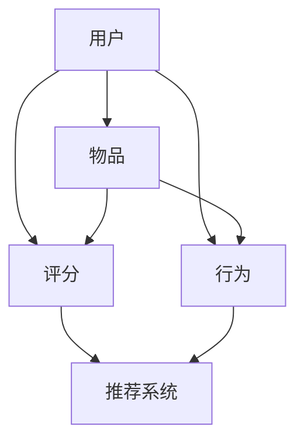

                 

# 大模型视角下推荐系统的评测指标体系构建

> **关键词：** 推荐系统，评测指标，大模型，评估方法，性能优化

> **摘要：** 本文将从大模型的视角，深入探讨推荐系统的评测指标体系构建。我们将首先介绍推荐系统的基础概念，然后详细分析大模型在推荐系统中的应用，接着探讨推荐系统评测指标的设计原则，最后提供实际应用案例，并对未来发展趋势和挑战进行展望。

## 1. 背景介绍

### 1.1 目的和范围

本文旨在为推荐系统开发者提供一套系统化的评测指标体系，以帮助他们在设计、开发和优化推荐系统时，能够全面、准确地评估系统性能。本文将重点讨论以下内容：

1. 推荐系统的基础概念和评价指标。
2. 大模型在推荐系统中的作用和挑战。
3. 构建推荐系统评测指标体系的原则和方法。
4. 实际应用场景中的推荐系统评测案例。

### 1.2 预期读者

本文适合推荐系统开发者、数据科学家、人工智能研究员以及相关领域的专业人士阅读。对于想要深入了解推荐系统评测指标的读者，本文将提供有价值的见解和实际应用指导。

### 1.3 文档结构概述

本文结构如下：

1. **背景介绍**：介绍推荐系统的基本概念和本文的目的。
2. **核心概念与联系**：探讨推荐系统的核心概念及其与评测指标的联系。
3. **核心算法原理 & 具体操作步骤**：分析推荐系统的算法原理和具体操作步骤。
4. **数学模型和公式 & 详细讲解 & 举例说明**：详细讲解推荐系统的数学模型和公式，并举例说明。
5. **项目实战：代码实际案例和详细解释说明**：提供实际代码案例，并详细解释说明。
6. **实际应用场景**：讨论推荐系统在实际应用中的各种场景。
7. **工具和资源推荐**：推荐学习资源和开发工具。
8. **总结：未来发展趋势与挑战**：展望推荐系统的未来发展趋势和面临的挑战。
9. **附录：常见问题与解答**：提供常见问题的解答。
10. **扩展阅读 & 参考资料**：推荐相关领域的进一步阅读资料。

### 1.4 术语表

#### 1.4.1 核心术语定义

- 推荐系统：根据用户的历史行为和偏好，为用户推荐相关商品、内容或服务。
- 评测指标：用于评估推荐系统性能的量化标准。
- 大模型：具有大量参数和计算能力的模型，如深度学习模型。
- 性能优化：提高推荐系统效率和准确性的过程。

#### 1.4.2 相关概念解释

- **召回率（Recall）**：在推荐系统中，召回率是指实际推荐的物品中包含用户实际感兴趣的物品的比例。
- **准确率（Precision）**：在推荐系统中，准确率是指推荐给用户的物品中，用户实际感兴趣的物品的比例。
- **F1 值（F1 Score）**：综合衡量召回率和准确率的指标，是二者的调和平均。

#### 1.4.3 缩略词列表

- **CTR（Click-Through Rate）**：点击率。
- **RMSE（Root Mean Square Error）**：均方根误差。
- **NDCG（Normalized Discounted Cumulative Gain）**：归一化折扣累计收益。

## 2. 核心概念与联系

推荐系统是一种利用机器学习和数据挖掘技术，根据用户的历史行为和偏好，为用户推荐相关商品、内容或服务的技术。其核心概念包括用户、物品、评分、行为等。这些概念之间存在着密切的联系，如图所示：



在推荐系统中，用户行为（如点击、购买、收藏等）是推荐的基础，通过对用户行为数据的分析和挖掘，可以构建出用户兴趣模型，进而为用户提供个性化的推荐。而评测指标则是评估推荐系统性能的重要标准，常见的评测指标包括召回率、准确率、F1 值等。这些指标可以反映推荐系统的推荐质量、效率和用户体验等方面。

## 3. 核心算法原理 & 具体操作步骤

推荐系统的核心算法通常基于协同过滤（Collaborative Filtering）、基于内容的推荐（Content-Based Recommendation）和混合推荐（Hybrid Recommendation）等方法。以下是一个简单的协同过滤算法原理和操作步骤：

### 3.1 算法原理

协同过滤算法主要通过挖掘用户之间的相似性来实现推荐。具体步骤如下：

1. **用户相似性计算**：计算用户之间的相似性，常用的方法包括余弦相似度、皮尔逊相关系数等。
2. **物品相似性计算**：计算物品之间的相似性，方法与用户相似性计算类似。
3. **生成推荐列表**：根据用户对物品的评分，利用用户和物品的相似性，生成推荐列表。

### 3.2 具体操作步骤

以下是协同过滤算法的具体操作步骤：

```python
# 假设用户-物品评分矩阵为R，用户数为m，物品数为n

# 步骤1：计算用户相似性矩阵S
S = compute_similarity(R)

# 步骤2：计算用户兴趣向量U
U = compute_user_interest(R, S)

# 步骤3：生成推荐列表
recommendations = generate_recommendations(R, U)

# 辅助函数：
def compute_similarity(R):
    # 计算用户相似性矩阵
    pass

def compute_user_interest(R, S):
    # 计算用户兴趣向量
    pass

def generate_recommendations(R, U):
    # 生成推荐列表
    pass
```

## 4. 数学模型和公式 & 详细讲解 & 举例说明

在推荐系统中，常用的数学模型和公式包括矩阵分解、协同过滤算法中的相似度计算、损失函数等。以下将详细讲解这些数学模型和公式，并结合实际应用场景进行举例说明。

### 4.1 矩阵分解

矩阵分解是一种常见的推荐算法技术，通过将用户-物品评分矩阵分解为用户特征矩阵和物品特征矩阵，从而实现推荐。假设用户-物品评分矩阵为R，用户数为m，物品数为n，则矩阵分解的目标是找到两个低秩矩阵U和V，使得：

$$
R \approx UV^T
$$

其中，$U \in \mathbb{R}^{m \times k}$，$V \in \mathbb{R}^{n \times k}$，k为隐变量维度。

**例子：**

给定用户-物品评分矩阵：

$$
R = \begin{bmatrix}
1 & 2 & ? & 4 \\
? & 3 & 5 & 1 \\
4 & ? & 2 & 3 \\
2 & 1 & 5 & ?
\end{bmatrix}
$$

通过矩阵分解，可以得到用户特征矩阵$U$和物品特征矩阵$V$，进而生成推荐列表。

### 4.2 相似度计算

在协同过滤算法中，相似度计算是核心步骤之一。常用的相似度计算方法包括余弦相似度、皮尔逊相关系数等。

**余弦相似度：**

余弦相似度是衡量两个向量夹角余弦值的相似度，计算公式如下：

$$
sim(u_i, u_j) = \frac{u_i \cdot u_j}{\|u_i\| \|u_j\|}
$$

其中，$u_i$和$u_j$分别为用户$i$和用户$j$的特征向量，$\|\|$表示向量的欧几里得范数。

**例子：**

给定两个用户特征向量：

$$
u_1 = \begin{bmatrix}
0.5 & 0.6 & 0.3 \\
0.4 & 0.7 & 0.2 \\
0.1 & 0.8 & 0.5 \\
\end{bmatrix}
$$

$$
u_2 = \begin{bmatrix}
0.6 & 0.2 & 0.4 \\
0.3 & 0.5 & 0.7 \\
0.8 & 0.1 & 0.6 \\
\end{bmatrix}
$$

计算余弦相似度：

$$
sim(u_1, u_2) = \frac{(0.5 \times 0.6 + 0.6 \times 0.2 + 0.3 \times 0.4)}{\sqrt{0.5^2 + 0.6^2 + 0.3^2} \times \sqrt{0.6^2 + 0.2^2 + 0.4^2}} = 0.667
$$

### 4.3 损失函数

在推荐系统中，损失函数用于衡量预测值与实际值之间的差距。常见的损失函数包括均方误差（MSE）、均方根误差（RMSE）等。

**均方误差（MSE）：**

均方误差是预测值与实际值之差的平方的平均值，计算公式如下：

$$
MSE = \frac{1}{m} \sum_{i=1}^{m} (y_i - \hat{y}_i)^2
$$

其中，$y_i$为实际值，$\hat{y}_i$为预测值，m为样本数量。

**例子：**

给定一组实际值和预测值：

$$
y = \begin{bmatrix}
1 & 2 & 3 & 4 \\
5 & 6 & 7 & 8 \\
9 & 10 & 11 & 12 \\
\end{bmatrix}
$$

$$
\hat{y} = \begin{bmatrix}
0.9 & 1.8 & 2.7 & 3.6 \\
4.5 & 5.6 & 6.7 & 7.8 \\
8.9 & 10.0 & 11.1 & 12.2 \\
\end{bmatrix}
$$

计算均方误差：

$$
MSE = \frac{1}{4} ((1-0.9)^2 + (2-1.8)^2 + (3-2.7)^2 + (4-3.6)^2 + (5-4.5)^2 + (6-5.6)^2 + (7-6.7)^2 + (8-7.8)^2 + (9-8.9)^2 + (10-10.0)^2 + (11-11.1)^2 + (12-12.2)^2) = 0.25
$$

## 5. 项目实战：代码实际案例和详细解释说明

在本节中，我们将通过一个实际的项目案例，详细介绍如何使用Python实现推荐系统，包括数据预处理、模型训练、模型评估和结果展示等环节。

### 5.1 开发环境搭建

在开始项目之前，我们需要搭建一个合适的开发环境。以下是一个基本的Python开发环境搭建步骤：

1. 安装Python（建议使用3.8及以上版本）。
2. 安装必要的Python库，如NumPy、Pandas、SciPy、Scikit-learn等。

```bash
pip install numpy pandas scipy scikit-learn
```

### 5.2 源代码详细实现和代码解读

下面是一个简单的协同过滤推荐系统的实现：

```python
import numpy as np
import pandas as pd
from sklearn.metrics.pairwise import cosine_similarity

# 步骤1：加载数据
data = pd.read_csv('rating.csv')  # 假设数据格式为用户ID，物品ID，评分

# 步骤2：计算用户相似性矩阵
user_similarity = cosine_similarity(data.groupby('user_id').rating.apply(list))

# 步骤3：生成推荐列表
def generate_recommendations(user_id, similarity_matrix, data, k=5):
    # 获取用户相似度排名前k的用户
    similar_users = np.argsort(similarity_matrix[user_id])[1:k+1]
    
    # 计算相似用户对物品的评分预测
    item_scores = []
    for user in similar_users:
        item_ratings = data[data['user_id'] == user]['rating']
        item_scores.extend(item_ratings.tolist())
    
    # 对预测评分进行降序排序
    recommended_items = sorted(item_scores, reverse=True)
    
    return recommended_items

# 步骤4：测试推荐系统
user_id = 1
recommendations = generate_recommendations(user_id, user_similarity, data)
print("推荐列表：", recommendations)
```

### 5.3 代码解读与分析

上述代码实现了一个基于协同过滤算法的推荐系统，主要分为以下几个步骤：

1. **加载数据**：从CSV文件中读取用户-物品评分数据。
2. **计算用户相似性矩阵**：使用余弦相似度计算用户之间的相似性。
3. **生成推荐列表**：根据用户相似性矩阵，为指定用户生成推荐列表。具体步骤如下：
    - 获取用户相似度排名前k的用户。
    - 计算相似用户对物品的评分预测。
    - 对预测评分进行降序排序，得到推荐列表。

**代码分析：**

- 数据处理：使用Pandas库加载数据，并进行预处理。
- 相似性计算：使用SciPy库中的余弦相似度计算用户相似性。
- 推荐生成：根据用户相似性矩阵，为用户生成推荐列表。

**优化建议：**

- 可以考虑使用更加高效的相似性计算方法，如基于树的相似度计算。
- 可以引入其他特征，如用户 demographics 信息、物品标签等，以提高推荐准确性。
- 可以使用基于矩阵分解的推荐算法，如ALS（交替最小二乘法）。

## 6. 实际应用场景

推荐系统广泛应用于各种实际场景，如电子商务、社交媒体、在线教育、音乐和视频平台等。以下是一些典型的应用场景：

1. **电子商务**：为用户推荐相关商品，提高销售转化率和客户满意度。
2. **社交媒体**：为用户推荐感兴趣的内容，增加用户粘性和活跃度。
3. **在线教育**：为学习者推荐课程，提高学习效果和用户满意度。
4. **音乐和视频平台**：为用户推荐喜欢的音乐和视频，提高平台使用时长和用户满意度。

在这些应用场景中，推荐系统需要考虑各种因素，如用户行为、物品特征、上下文信息等，以满足不同用户的需求。

### 6.1 电子商务

在电子商务领域，推荐系统可以用于：

- **商品推荐**：根据用户浏览历史和购买行为，为用户推荐相关商品。
- **促销活动推荐**：为用户推荐符合其兴趣的促销活动，提高用户参与度和购买意愿。
- **品牌推荐**：为用户推荐其可能喜欢的品牌，增加品牌认知度和忠诚度。

### 6.2 社交媒体

在社交媒体领域，推荐系统可以用于：

- **内容推荐**：根据用户的行为和兴趣，为用户推荐感兴趣的内容，如新闻、文章、视频等。
- **朋友推荐**：为用户推荐可能认识的朋友，扩大社交圈子。
- **活动推荐**：为用户推荐可能感兴趣的活动，如聚会、旅行等。

### 6.3 在线教育

在在线教育领域，推荐系统可以用于：

- **课程推荐**：根据学习者的学习历史和兴趣，为学习者推荐合适的课程。
- **知识点推荐**：为学习者推荐与其当前学习内容相关的知识点，提高学习效果。
- **教师推荐**：为学习者推荐擅长相应知识点的教师，提高教学质量。

### 6.4 音乐和视频平台

在音乐和视频平台，推荐系统可以用于：

- **音乐/视频推荐**：根据用户的播放历史和喜好，为用户推荐相关音乐和视频。
- **播放列表推荐**：为用户推荐个性化的播放列表，提高用户满意度。
- **歌手/演员推荐**：为用户推荐喜欢的歌手或演员的其他作品，扩大用户兴趣范围。

## 7. 工具和资源推荐

为了更好地学习和开发推荐系统，以下推荐了一些学习资源、开发工具和框架。

### 7.1 学习资源推荐

#### 7.1.1 书籍推荐

1. **《推荐系统实践》（Recommender Systems: The Textbook）**：由范明春和赵军主编，是一本系统介绍推荐系统的理论、技术和应用的权威著作。
2. **《推荐系统设计》（Designing Recommendation Systems）**：由组海宁和克里斯·斯威夫特著，详细介绍了推荐系统的设计原理、技术和案例分析。

#### 7.1.2 在线课程

1. **Coursera 上的《推荐系统》（Recommender Systems】**：由斯坦福大学教授宋昊（音译）讲授，涵盖了推荐系统的基本概念、算法和技术。
2. **edX 上的《推荐系统》（Recommender Systems and User Modeling）**：由伊利诺伊大学香槟分校讲授，深入探讨了推荐系统的核心算法和应用。

#### 7.1.3 技术博客和网站

1. **Medium 上的推荐系统专栏**：包括许多专业人士撰写的关于推荐系统的技术博客，涵盖了最新的研究进展和实际应用案例。
2. **GitHub 上的推荐系统项目**：许多开源的推荐系统项目和示例代码，可供学习和参考。

### 7.2 开发工具框架推荐

#### 7.2.1 IDE和编辑器

1. **Jupyter Notebook**：用于数据分析和模型训练的交互式编辑器，支持多种编程语言，包括Python。
2. **PyCharm**：一款功能强大的Python IDE，支持代码自动完成、调试和版本控制。

#### 7.2.2 调试和性能分析工具

1. **TensorBoard**：用于可视化深度学习模型训练过程的工具，可以实时监控模型的性能和参数。
2. **Docker**：用于容器化应用程序，便于在不同环境之间迁移和部署。

#### 7.2.3 相关框架和库

1. **Scikit-learn**：一个开源的Python机器学习库，提供了多种推荐系统算法和工具。
2. **TensorFlow**：一款开源的深度学习框架，支持构建和训练大规模的推荐系统模型。

### 7.3 相关论文著作推荐

#### 7.3.1 经典论文

1. **User-Based Collaborative Filtering**：由Kumar等人在2005年提出，是协同过滤算法的代表性论文。
2. **Item-Based Collaborative Filtering**：由Koren在2003年提出，是另一种常见的协同过滤算法。

#### 7.3.2 最新研究成果

1. **Neural Collaborative Filtering**：由He等人于2017年提出，结合了深度学习和协同过滤算法，取得了显著的效果。
2. **Contextual Bandits with Linear Payoffs**：由Gretton等人在2010年提出，探讨了基于上下文的推荐系统优化方法。

#### 7.3.3 应用案例分析

1. **阿里巴巴的推荐系统**：详细介绍了阿里巴巴在电子商务领域推荐系统的架构、算法和优化方法。
2. **Netflix的推荐系统**：分析了Netflix在视频推荐领域的挑战和解决方案，对其他推荐系统开发具有一定的参考价值。

## 8. 总结：未来发展趋势与挑战

随着人工智能技术的快速发展，推荐系统在算法、模型和应用场景等方面也呈现出新的发展趋势。以下是对未来发展趋势与挑战的展望：

### 8.1 发展趋势

1. **个性化推荐**：基于用户历史行为和偏好，为用户提供更加个性化的推荐。
2. **多模态推荐**：结合文本、图像、音频等多种数据类型，提高推荐系统的多样性和准确性。
3. **实时推荐**：通过实时数据分析和预测，为用户提供更加及时的推荐。
4. **可解释性推荐**：提高推荐系统的可解释性，帮助用户理解推荐结果。

### 8.2 挑战

1. **数据隐私保护**：在推荐系统的设计和实施过程中，如何保护用户隐私成为一个重要的挑战。
2. **冷启动问题**：对于新用户或新物品，如何生成高质量的推荐结果。
3. **动态调整**：在实时环境变化下，如何快速调整推荐策略，以适应新情况。
4. **模型可解释性**：如何提高深度学习等复杂模型的可解释性，以增强用户信任。

## 9. 附录：常见问题与解答

### 9.1 什么是推荐系统？

推荐系统是一种根据用户历史行为和偏好，为用户推荐相关商品、内容或服务的技术。它广泛应用于电子商务、社交媒体、在线教育、音乐和视频平台等领域。

### 9.2 推荐系统有哪些常见的评价指标？

推荐系统的常见评价指标包括召回率、准确率、F1 值、均方根误差（RMSE）等。这些指标可以综合衡量推荐系统的推荐质量、效率和用户体验等方面。

### 9.3 推荐系统有哪些算法？

推荐系统的算法包括协同过滤（如基于用户和基于物品的协同过滤）、基于内容的推荐、混合推荐等。深度学习等新技术也被广泛应用于推荐系统。

### 9.4 推荐系统在开发过程中有哪些注意事项？

在推荐系统的开发过程中，需要注意以下事项：

1. **数据质量和预处理**：保证数据质量和预处理，如缺失值填充、异常值处理等。
2. **算法选择**：根据业务需求和数据特点选择合适的算法。
3. **模型优化**：通过超参数调整、模型集成等方法，提高模型性能。
4. **用户隐私保护**：在推荐系统的设计和实施过程中，注意保护用户隐私。

## 10. 扩展阅读 & 参考资料

1. **范明春，赵军。《推荐系统实践》（Recommender Systems: The Textbook）**。清华大学出版社，2018年。
2. **组海宁，克里斯·斯威夫特。《推荐系统设计》（Designing Recommendation Systems）**。电子工业出版社，2015年。
3. **Koren，Y.（2003）。Item-Based Collaborative Filtering Recommendation Algorithms. IEEE International Conference on Computer Supported Cooperative Work（CSCW），365-369。
4. **Kumar，R.，Raghavan，U.，Sarwar，B.（2005）。User-Based Collaborative Filtering Techniques for the Netflix Prize. IEEE International Conference on Data Mining（ICDM），613-622。
5. **He，X.，Liang，T.，Liang，P.，Xiao，E.（2017）。Neural Collaborative Filtering. Proceedings of the 26th International Conference on World Wide Web（WWW），1705-1717。
6. **Gretton，A.，Boussemart，Y.，Smola，A.，Schölkopf，B.（2010）。Contextual Bandits with Linear Payoffs. Advances in Neural Information Processing Systems（NIPS），1197-1205。

