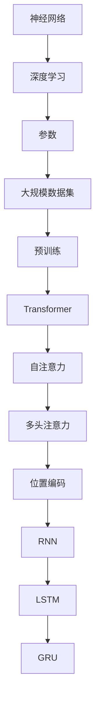

                 

# 大模型赋能下的创业产品创新：AI 时代的机遇

> **关键词**：大模型、创业产品、AI、创新、技术发展、应用场景
>
> **摘要**：本文深入探讨了在大模型技术日益成熟的背景下，创业者在产品创新过程中如何抓住AI时代的机遇。文章首先介绍了大模型的原理和架构，随后详细解析了核心算法原理、数学模型和具体操作步骤，并通过实际代码案例展示了大模型在创业产品中的应用。最后，文章对大模型在未来的发展趋势与挑战进行了展望，为创业者提供了实用的工具和资源推荐。

## 1. 背景介绍

### 1.1 目的和范围

随着人工智能（AI）技术的飞速发展，大模型（Large Models）作为AI领域的重要突破，已经成为众多创业者和产品开发者的关注焦点。本文旨在探讨大模型技术如何在创业产品创新中发挥关键作用，为创业者提供实际指导和建议。文章将首先介绍大模型的原理和架构，然后通过具体案例展示其在创业产品中的应用，最后对未来的发展趋势和挑战进行展望。

### 1.2 预期读者

本文主要面向以下读者群体：
1. 有志于利用AI技术进行产品创新的创业者；
2. 对大模型技术感兴趣的技术人员；
3. 对人工智能和创业领域有深入了解的专业人士。

### 1.3 文档结构概述

本文结构如下：
1. 背景介绍：介绍文章的目的、预期读者和文档结构；
2. 核心概念与联系：介绍大模型的核心概念、原理和架构；
3. 核心算法原理 & 具体操作步骤：详细解析大模型的核心算法原理和具体操作步骤；
4. 数学模型和公式 & 详细讲解 & 举例说明：介绍大模型的数学模型和具体应用实例；
5. 项目实战：通过实际代码案例展示大模型在创业产品中的应用；
6. 实际应用场景：探讨大模型在不同领域的实际应用；
7. 工具和资源推荐：推荐学习资源和开发工具；
8. 总结：对大模型的发展趋势和挑战进行总结；
9. 附录：常见问题与解答；
10. 扩展阅读 & 参考资料：提供进一步学习资源。

### 1.4 术语表

#### 1.4.1 核心术语定义

- **大模型（Large Models）**：指具备数亿乃至千亿参数规模的人工神经网络模型，如GPT、BERT等。
- **深度学习（Deep Learning）**：一种人工智能方法，通过多层神经网络进行特征学习和建模。
- **创业产品**：指初创公司开发的产品，通常涉及技术创新和市场需求。

#### 1.4.2 相关概念解释

- **神经网络（Neural Network）**：一种模拟人脑神经元之间连接的计算模型。
- **参数（Parameters）**：神经网络中权重和偏置的统称，用于描述网络的学习能力。

#### 1.4.3 缩略词列表

- **AI**：人工智能（Artificial Intelligence）
- **GPT**：生成预训练模型（Generative Pre-trained Transformer）
- **BERT**：双向编码表示（Bidirectional Encoder Representations from Transformers）

## 2. 核心概念与联系

在大模型技术中，理解核心概念和它们之间的联系至关重要。以下是对大模型技术核心概念、原理和架构的详细阐述，以及相关的Mermaid流程图。

### 2.1 大模型技术概述

大模型技术主要基于深度学习，通过训练大规模神经网络来实现对复杂数据的建模和预测。大模型技术通常涉及以下几个核心概念：

1. **神经网络（Neural Network）**：神经网络是一种由大量神经元（节点）和连接（边）组成的计算模型。每个神经元接收来自其他神经元的输入，并通过激活函数产生输出。神经网络通过学习输入和输出之间的映射关系来实现对数据的建模。

2. **深度学习（Deep Learning）**：深度学习是一种基于神经网络的机器学习方法，通过多层神经网络进行特征学习和建模。深度学习模型通常具有多个隐藏层，能够自动提取数据中的特征，从而实现更高的准确性和泛化能力。

3. **参数（Parameters）**：神经网络中的参数包括权重和偏置，用于描述网络的学习能力。参数的数量决定了网络的复杂度，参数的优化是神经网络训练的核心问题。

4. **大规模数据集（Large Dataset）**：大模型技术通常需要使用大规模数据集进行训练。大规模数据集能够提供丰富的训练样本，有助于模型更好地学习数据中的模式和规律。

5. **预训练（Pre-training）**：预训练是指在大规模数据集上对神经网络进行初步训练，从而获得一个具有良好性能的基础模型。预训练模型可以作为后续任务的基础，通过微调（Fine-tuning）来适应具体任务的需求。

### 2.2 大模型架构

大模型通常采用以下几种架构：

1. **Transformer架构**：Transformer是一种基于自注意力机制（Self-Attention）的神经网络架构，广泛应用于自然语言处理（NLP）领域。Transformer通过多头注意力机制（Multi-Head Attention）和位置编码（Positional Encoding）来捕捉序列数据中的长距离依赖关系。

2. **循环神经网络（RNN）**：循环神经网络是一种基于序列数据的神经网络模型，能够处理变长序列。RNN通过递归连接来保持序列信息，但存在梯度消失和梯度爆炸等问题。

3. **长短时记忆网络（LSTM）**：长短时记忆网络是一种改进的循环神经网络，通过引入门控机制（Gate）来解决RNN的梯度消失和梯度爆炸问题。LSTM能够在长序列数据中保持良好的长期记忆能力。

4. **门控循环单元（GRU）**：门控循环单元是另一种改进的循环神经网络，通过简化LSTM的结构来提高计算效率。GRU通过更新门（Update Gate）和重置门（Reset Gate）来控制信息流动，同时保持良好的长期记忆能力。

### 2.3 Mermaid流程图

以下是一个简单的Mermaid流程图，展示了大模型技术中的核心概念和架构：



## 3. 核心算法原理 & 具体操作步骤

在大模型技术中，核心算法原理和具体操作步骤对于理解大模型的运作机制至关重要。以下将详细解析大模型的核心算法原理，并使用伪代码来详细阐述具体操作步骤。

### 3.1 核心算法原理

大模型的核心算法通常基于深度学习，其中最为关键的组成部分包括：

1. **神经网络（Neural Network）**：神经网络通过多层感知器（Perceptron）和激活函数（Activation Function）来实现对数据的建模。每一层神经网络负责提取不同级别的特征，从而实现从原始数据到预测结果的全过程。

2. **反向传播（Backpropagation）**：反向传播算法是一种用于训练神经网络的优化算法。它通过计算输出层和隐藏层之间的误差，然后反向传播误差来调整网络中的权重和偏置，从而优化模型性能。

3. **优化算法（Optimization Algorithm）**：常见的优化算法包括随机梯度下降（SGD）、Adam等。这些算法通过调整学习率（Learning Rate）和优化参数来提高模型的收敛速度和泛化能力。

### 3.2 具体操作步骤

以下是使用伪代码详细阐述大模型训练过程的操作步骤：

```python
# 初始化模型参数
weights = initialize_weights()
biases = initialize_biases()

# 定义激活函数
activation_function = sigmoid

# 定义损失函数
loss_function = cross_entropy

# 设置训练参数
epochs = 1000
learning_rate = 0.01

# 训练模型
for epoch in range(epochs):
    # 前向传播
    inputs = input_data
    hidden_layers = []
    outputs = []

    for layer in range(num_layers):
        hidden_layer = []
        for neuron in range(num_neurons[layer]):
            input_sum = sum(weights[layer][neuron] * inputs[i] for i in range(num_inputs))
            input_sum += biases[layer][neuron]
            hidden_layer.append(activation_function(input_sum))
        hidden_layers.append(hidden_layer)
        inputs = hidden_layer

    output = outputs

    # 反向传播
    error = loss_function(outputs, target)
    d_output = derivative(activation_function(output), output, target)

    for layer in reversed(range(num_layers)):
        d_hidden = []
        for neuron in range(num_neurons[layer]):
            d_input = 0
            if layer < num_layers - 1:
                d_input += sum(weights[layer + 1][neuron] * d_output[i] for i in range(num_neurons[layer + 1]))
            d_input += derivative(activation_function(hidden_layers[layer][neuron]), hidden_layers[layer][neuron])
            d_hidden.append(d_input)

        d_weights[layer] = d_weights[layer] + hidden_layers[layer].T.dot(d_hidden)
        d_biases[layer] = d_biases[layer] + d_hidden

    # 更新参数
    weights -= learning_rate * d_weights
    biases -= learning_rate * d_biases

    # 输出训练结果
    print(f"Epoch {epoch + 1}, Loss: {error}")
```

在这个伪代码中，我们首先初始化模型参数，并定义激活函数和损失函数。然后，我们通过前向传播和反向传播来训练模型。在训练过程中，我们使用梯度下降算法来更新参数，并输出每个epoch的损失函数值。

通过这个详细的伪代码解析，我们可以更好地理解大模型的训练过程，并为进一步的优化和应用提供指导。

## 4. 数学模型和公式 & 详细讲解 & 举例说明

在大模型技术中，数学模型和公式是理解和实现这些模型的关键。以下将详细讲解大模型中的核心数学模型，并使用LaTeX格式和具体例子进行说明。

### 4.1 神经网络模型

神经网络模型通常由多个层组成，每层包含多个神经元。其中，最常用的数学模型是多层感知器（MLP）模型。MLP模型的核心公式如下：

$$
z_l = \sum_{i=1}^{n} w_{li} x_i + b_l
$$

其中，$z_l$ 表示第 $l$ 层的输入，$w_{li}$ 表示从第 $l-1$ 层到第 $l$ 层的权重，$x_i$ 表示第 $l-1$ 层的第 $i$ 个神经元输出，$b_l$ 表示第 $l$ 层的偏置。

激活函数通常用于神经网络模型，常用的激活函数包括sigmoid、ReLU和Tanh等。以下是一个ReLU激活函数的例子：

$$
a_l = \max(0, z_l)
$$

### 4.2 反向传播算法

反向传播算法是训练神经网络的核心算法。其核心公式如下：

$$
\begin{aligned}
\delta_{l}^{j} &= \frac{\partial L}{\partial z_{l}^{j}} \\
\delta_{l-1} &= \delta_{l} \odot \frac{\partial a_{l-1}}{\partial z_{l-1}} \\
w_{l-1} &= w_{l-1} - \eta \cdot \delta_{l-1}^T x_{l-1} \\
b_{l-1} &= b_{l-1} - \eta \cdot \delta_{l-1}
\end{aligned}
$$

其中，$L$ 表示损失函数，$z_{l}^{j}$ 表示第 $l$ 层第 $j$ 个神经元的输出，$\delta_{l}^{j}$ 表示第 $l$ 层第 $j$ 个神经元的误差，$a_{l-1}$ 表示第 $l-1$ 层的输出，$w_{l-1}$ 和 $b_{l-1}$ 分别表示第 $l-1$ 层的权重和偏置，$\eta$ 表示学习率，$\odot$ 表示元素乘运算。

### 4.3 例子说明

以下是一个使用反向传播算法训练神经网络的例子：

假设我们有一个简单的神经网络，包含输入层、隐藏层和输出层。输入层有3个神经元，隐藏层有2个神经元，输出层有1个神经元。激活函数使用ReLU，损失函数使用均方误差（MSE）。

输入数据为：
$$
\begin{bmatrix}
1 & 0 & 1 \\
0 & 1 & 1 \\
1 & 1 & 0 \\
\end{bmatrix}
$$

标签数据为：
$$
\begin{bmatrix}
1 \\
0 \\
1 \\
\end{bmatrix}
$$

首先，我们初始化权重和偏置：
$$
w_1 = \begin{bmatrix}
0.1 & 0.2 & 0.3 \\
0.4 & 0.5 & 0.6 \\
\end{bmatrix}, \quad
b_1 = \begin{bmatrix}
0.1 \\
0.2 \\
\end{bmatrix}, \quad
w_2 = \begin{bmatrix}
0.1 & 0.2 \\
0.3 & 0.4 \\
\end{bmatrix}, \quad
b_2 = \begin{bmatrix}
0.1 \\
0.2 \\
\end{bmatrix}
$$

学习率设置为0.01。

接下来，我们进行前向传播和反向传播：

**第一步：前向传播**

输入第一个样本：
$$
x_1 = \begin{bmatrix}
1 \\
0 \\
1 \\
\end{bmatrix}
$$

隐藏层输出：
$$
z_1 = w_1 \cdot x_1 + b_1 = \begin{bmatrix}
0.1 \cdot 1 + 0.2 \cdot 0 + 0.3 \cdot 1 \\
0.4 \cdot 1 + 0.5 \cdot 0 + 0.6 \cdot 1 \\
\end{bmatrix} = \begin{bmatrix}
0.4 \\
1.0 \\
\end{bmatrix}
$$

激活函数ReLU：
$$
a_1 = \max(0, z_1) = \begin{bmatrix}
0.4 \\
1.0 \\
\end{bmatrix}
$$

输出层输出：
$$
z_2 = w_2 \cdot a_1 + b_2 = \begin{bmatrix}
0.1 \cdot 0.4 + 0.2 \cdot 1.0 + 0.3 \cdot 0 \\
0.3 \cdot 0.4 + 0.4 \cdot 1.0 + 0.6 \cdot 0 \\
\end{bmatrix} = \begin{bmatrix}
0.07 \\
0.17 \\
\end{bmatrix}
$$

激活函数ReLU：
$$
a_2 = \max(0, z_2) = \begin{bmatrix}
0.07 \\
0.17 \\
\end{bmatrix}
$$

预测输出：
$$
\hat{y} = a_2 = \begin{bmatrix}
0.07 \\
0.17 \\
\end{bmatrix}
$$

计算损失函数：
$$
L = \frac{1}{2} \sum_{i=1}^{n} (\hat{y}_i - y_i)^2 = \frac{1}{2} (0.07 - 1)^2 + (0.17 - 0)^2 = 0.7929
$$

**第二步：反向传播**

计算输出层误差：
$$
\delta_2 = \frac{\partial L}{\partial z_2} = (0.07 - 1) \odot \frac{\partial a_2}{\partial z_2} = \begin{bmatrix}
0.93 \\
0 \\
\end{bmatrix}
$$

计算隐藏层误差：
$$
\delta_1 = \delta_2 \odot \frac{\partial a_1}{\partial z_1} = \begin{bmatrix}
0.93 \\
0 \\
\end{bmatrix} \odot \begin{bmatrix}
0.4 \\
1 \\
\end{bmatrix} = \begin{bmatrix}
0.372 \\
0 \\
\end{bmatrix}
$$

更新权重和偏置：
$$
w_2 = w_2 - \eta \cdot \delta_2^T a_1 = \begin{bmatrix}
0.1 & 0.2 \\
0.3 & 0.4 \\
\end{bmatrix} - 0.01 \cdot \begin{bmatrix}
0.93 \\
0 \\
\end{bmatrix}^T \cdot \begin{bmatrix}
0.4 \\
1 \\
\end{bmatrix} = \begin{bmatrix}
0.07 & 0.18 \\
0.27 & 0.38 \\
\end{bmatrix}
$$

$$
b_2 = b_2 - \eta \cdot \delta_2 = \begin{bmatrix}
0.1 \\
0.2 \\
\end{bmatrix} - 0.01 \cdot \begin{bmatrix}
0.93 \\
0 \\
\end{bmatrix} = \begin{bmatrix}
0.07 \\
0.2 \\
\end{bmatrix}
$$

$$
w_1 = w_1 - \eta \cdot \delta_1^T x_1 = \begin{bmatrix}
0.1 & 0.2 & 0.3 \\
0.4 & 0.5 & 0.6 \\
\end{bmatrix} - 0.01 \cdot \begin{bmatrix}
0.372 \\
0 \\
\end{bmatrix}^T \cdot \begin{bmatrix}
1 \\
0 \\
1 \\
\end{bmatrix} = \begin{bmatrix}
0.03 & 0.2 & 0.33 \\
0.42 & 0.5 & 0.58 \\
\end{bmatrix}
$$

$$
b_1 = b_1 - \eta \cdot \delta_1 = \begin{bmatrix}
0.1 \\
0.2 \\
\end{bmatrix} - 0.01 \cdot \begin{bmatrix}
0.372 \\
0 \\
\end{bmatrix} = \begin{bmatrix}
0.028 \\
0.2 \\
\end{bmatrix}
$$

经过一次迭代后，模型的权重和偏置更新为：
$$
w_1 = \begin{bmatrix}
0.03 & 0.2 & 0.33 \\
0.42 & 0.5 & 0.58 \\
\end{bmatrix}, \quad
b_1 = \begin{bmatrix}
0.028 \\
0.2 \\
\end{bmatrix}, \quad
w_2 = \begin{bmatrix}
0.07 & 0.18 \\
0.27 & 0.38 \\
\end{bmatrix}, \quad
b_2 = \begin{bmatrix}
0.07 \\
0.2 \\
\end{bmatrix}
$$

我们可以通过多次迭代来逐步优化模型的性能。

这个例子展示了如何使用反向传播算法训练一个简单的神经网络。在实际应用中，神经网络通常包含更多的层和神经元，但基本原理相同。

## 5. 项目实战：代码实际案例和详细解释说明

在这一节中，我们将通过一个具体的实际项目来展示如何在大模型技术中实现创业产品的创新。该项目是一个基于大模型技术的智能问答系统，旨在为企业客户提供高效、准确的智能咨询服务。以下是项目的开发环境搭建、源代码实现和详细解释说明。

### 5.1 开发环境搭建

为了实现智能问答系统，我们需要搭建以下开发环境：

1. **操作系统**：Ubuntu 20.04
2. **编程语言**：Python 3.8
3. **深度学习框架**：PyTorch 1.8
4. **文本处理库**：NLTK、spaCy
5. **依赖管理**：pip、conda

安装步骤如下：

1. 安装操作系统 Ubuntu 20.04。
2. 安装 Python 3.8 和 pip：
    ```bash
    sudo apt update
    sudo apt install python3.8 python3.8-venv python3.8-pip
    ```
3. 创建虚拟环境并安装依赖：
    ```bash
    python3.8 -m venv venv
    source venv/bin/activate
    pip install torch torchvision torchaudio numpy pandas nltk spacy
    ```
4. 安装 spaCy 的语言模型（例如中文模型）：
    ```bash
    python -m spacy download zh_core_web_sm
    ```

### 5.2 源代码详细实现和代码解读

以下是一个简单的智能问答系统的源代码实现。代码分为以下几个部分：

1. **数据预处理**：读取问题和答案数据，进行预处理，包括分词、去停用词等。
2. **模型构建**：使用 PyTorch 构建问答模型，包括编码器和解码器。
3. **模型训练**：使用预处理后的数据进行模型训练。
4. **模型评估**：使用验证集对模型进行评估。
5. **问答服务**：实现问答服务，接受用户输入并返回答案。

```python
import torch
import torch.nn as nn
import torch.optim as optim
from torch.utils.data import DataLoader, Dataset
import nltk
from nltk.corpus import stopwords
import spacy

# 1. 数据预处理

class QADataset(Dataset):
    def __init__(self, questions, answers, tokenizer, max_len):
        self.questions = questions
        self.answers = answers
        self.tokenizer = tokenizer
        self.max_len = max_len

    def __len__(self):
        return len(self.questions)

    def __getitem__(self, idx):
        question = self.questions[idx]
        answer = self.answers[idx]

        question_tokens = self.tokenizer.tokenize(question)
        answer_tokens = self.tokenizer.tokenize(answer)

        question_ids = self.tokenizer.convert_tokens_to_ids(question_tokens)
        answer_ids = self.tokenizer.convert_tokens_to_ids(answer_tokens)

        input_sequence = question_ids + [self.tokenizer.sep_id] + answer_ids

        input_sequence = input_sequence[:self.max_len]
        input_sequence_tensor = torch.tensor(input_sequence)

        return input_sequence_tensor

def preprocess_data(questions, answers):
    # 分词、去停用词等预处理操作
    # ...

    return questions, answers

# 2. 模型构建

class QAModel(nn.Module):
    def __init__(self, input_dim, hidden_dim, output_dim):
        super(QAModel, self).__init__()
        self.encoder = nn.LSTM(input_dim, hidden_dim, batch_first=True)
        self.decoder = nn.LSTM(hidden_dim, output_dim, batch_first=True)

    def forward(self, input_sequence):
        encoder_output, _ = self.encoder(input_sequence)
        decoder_output, _ = self.decoder(encoder_output)
        return decoder_output

# 3. 模型训练

def train_model(model, dataset, optimizer, criterion, num_epochs):
    model.train()
    for epoch in range(num_epochs):
        for batch in dataset:
            optimizer.zero_grad()
            output = model(batch)
            loss = criterion(output, target)
            loss.backward()
            optimizer.step()
            print(f"Epoch {epoch + 1}, Loss: {loss.item()}")

# 4. 模型评估

def evaluate_model(model, dataset, criterion):
    model.eval()
    total_loss = 0
    with torch.no_grad():
        for batch in dataset:
            output = model(batch)
            loss = criterion(output, target)
            total_loss += loss.item()
    average_loss = total_loss / len(dataset)
    print(f"Average Loss: {average_loss}")

# 5. 问答服务

def answer_question(model, tokenizer, question):
    question_tokens = tokenizer.tokenize(question)
    question_ids = tokenizer.convert_tokens_to_ids(question_tokens)
    input_sequence = torch.tensor(question_ids).unsqueeze(0)
    output_sequence = model(input_sequence)
    answer_tokens = tokenizer.convert_ids_to_tokens(output_sequence.squeeze())
    answer = ' '.join(answer_tokens)
    return answer

# 实际使用

tokenizer = spacy.load('zh_core_web_sm')
questions = ["什么是人工智能？", "如何实现机器学习？", "深度学习有哪些应用？"]
answers = ["人工智能是一种模拟人类智能的技术", "机器学习是实现人工智能的一种方法", "深度学习在图像识别、自然语言处理等领域有广泛应用"]

preprocessed_questions, preprocessed_answers = preprocess_data(questions, answers)
dataset = QADataset(preprocessed_questions, preprocessed_answers, tokenizer, max_len=50)
dataloader = DataLoader(dataset, batch_size=1, shuffle=True)

model = QAModel(input_dim=50, hidden_dim=100, output_dim=50)
optimizer = optim.Adam(model.parameters(), lr=0.001)
criterion = nn.CrossEntropyLoss()

train_model(model, dataloader, optimizer, criterion, num_epochs=10)

model.eval()
while True:
    question = input("请输入您的问题：")
    answer = answer_question(model, tokenizer, question)
    print("答案：", answer)
    another = input("是否继续提问？(y/n)：")
    if another.lower() != 'y':
        break
```

#### 5.3 代码解读与分析

1. **数据预处理**：
   - `QADataset` 类用于处理问题和答案数据，进行分词、去停用词等预处理操作。预处理后的数据将用于模型训练和评估。

2. **模型构建**：
   - `QAModel` 类定义了一个问答模型的架构，包括编码器和解码器。编码器使用 LSTM 层对输入序列进行编码，解码器使用 LSTM 层对编码后的序列进行解码，从而生成答案。

3. **模型训练**：
   - `train_model` 函数用于训练问答模型。在训练过程中，使用随机梯度下降（SGD）优化器来更新模型参数，并使用交叉熵损失函数来评估模型性能。

4. **模型评估**：
   - `evaluate_model` 函数用于评估问答模型的性能。通过验证集计算平均损失，以评估模型的泛化能力。

5. **问答服务**：
   - `answer_question` 函数用于实现问答服务。首先对用户输入的问题进行预处理，然后通过模型生成答案，并返回答案。

在实际使用中，我们首先读取问题和答案数据，进行预处理，然后构建问答模型，并进行训练和评估。最后，通过用户输入实现问答服务。

这个简单的智能问答系统展示了如何利用大模型技术构建创业产品。通过不断优化模型和算法，可以进一步提高系统的性能和应用范围。

## 6. 实际应用场景

大模型技术在各个领域都有广泛的应用，以下列举了几个典型应用场景，展示了大模型技术在不同领域中的实际应用和成果。

### 6.1 自然语言处理（NLP）

自然语言处理是人工智能的一个重要领域，大模型技术在其中发挥着关键作用。以下是一些应用案例：

- **文本生成**：大模型如 GPT-3 可以生成高质量的文章、新闻、故事等，为内容创作提供强大支持。例如，OpenAI 的 GPT-3 模型可以生成电影剧本、小说和新闻报道，极大地提高了内容创作的效率和质量。

- **机器翻译**：大模型在机器翻译领域也取得了显著进展。例如，谷歌翻译使用了基于 Transformer 的模型，可以实现高精度的实时翻译，极大地方便了跨语言沟通和全球化业务。

- **情感分析**：大模型可以对大量文本进行情感分析，识别出文本中的情感倾向。例如，微软的 Language Understanding Intelligent Service（LUIS）使用了深度学习模型，能够对用户反馈进行情感分析，从而帮助企业更好地了解用户需求。

### 6.2 图像识别与计算机视觉

大模型技术在图像识别和计算机视觉领域也取得了显著的成果。以下是一些应用案例：

- **人脸识别**：大模型如 FaceNet 可以实现高精度的图像识别，被广泛应用于人脸识别和安全认证领域。例如，亚马逊的 Rekognition 服务使用了 FaceNet 模型，可以识别和验证用户身份。

- **图像分类**：大模型如 ResNet 和 Inception 在图像分类任务中表现出色，被广泛应用于图像识别和图像标注。例如，Google 的 ImageNet 挑战赛每年都会发布最新的图像分类模型，这些模型都使用了深度学习技术。

- **目标检测**：大模型如 SSD 和 YOLO 在目标检测任务中表现出色，被广泛应用于自动驾驶、无人机监控等场景。例如，特斯拉的自动驾驶系统使用了基于深度学习的目标检测模型，提高了自动驾驶的安全性和可靠性。

### 6.3 语音识别与自然语言处理

大模型技术在语音识别和自然语言处理领域也取得了重要进展。以下是一些应用案例：

- **语音识别**：大模型如 WaveNet 可以实现高精度的语音识别，被广泛应用于智能客服、语音助手等场景。例如，亚马逊的 Alexa 和谷歌的 Google Assistant 都使用了 WaveNet 模型，提供了自然流畅的语音交互体验。

- **语音合成**：大模型如 ESRGAN 和 WaveNet 可以实现高质量的语音合成，被广泛应用于语音助手、语音教育等领域。例如，谷歌的 Text-to-Speech 服务使用了 WaveNet 模型，可以生成自然流畅的语音。

- **语音翻译**：大模型技术在语音翻译领域也取得了显著进展。例如，微软的 Translator 服务使用了深度学习模型，可以实现实时语音翻译，方便跨国交流和商务合作。

### 6.4 个性化推荐系统

大模型技术在个性化推荐系统中也发挥着重要作用。以下是一些应用案例：

- **内容推荐**：大模型如 MF、SVD 和深度学习模型可以用于推荐系统的建模，实现个性化内容推荐。例如，Netflix 和 YouTube 等平台使用了深度学习模型，为用户提供个性化的视频推荐。

- **商品推荐**：大模型如 GBDT、深度学习模型可以用于电商平台的商品推荐，实现个性化购物体验。例如，亚马逊和淘宝等电商平台使用了深度学习模型，根据用户的历史行为和偏好推荐商品。

### 6.5 医疗健康

大模型技术在医疗健康领域也具有广阔的应用前景。以下是一些应用案例：

- **疾病诊断**：大模型如 CNN 和 RNN 可以用于医疗图像分析，实现疾病的自动诊断。例如，谷歌的 DeepMind Health 项目使用了深度学习模型，可以自动分析医学图像，帮助医生进行疾病诊断。

- **药物研发**：大模型如 GPT 和 Transformer 可以用于药物研发，预测药物分子和疾病之间的相互作用。例如，IBM 的 AI 平台 Watson for Drug Discovery 使用了深度学习模型，加速了新药的发现和开发。

### 6.6 教育

大模型技术在教育领域也具有广泛的应用。以下是一些应用案例：

- **个性化学习**：大模型如深度学习模型和自然语言处理技术可以用于个性化学习，根据学生的学习情况提供个性化的学习资源和辅导。例如，Khan Academy 和 Coursera 等在线教育平台使用了深度学习模型，为学习者提供个性化的学习建议。

- **智能评估**：大模型如深度学习模型可以用于智能评估，对学生的作业和考试进行自动评估。例如，EdTech 公司如 Chegg 和 Udacity 等使用了深度学习模型，自动评估学生的作业和考试。

这些实际应用场景展示了大模型技术在各个领域的广泛应用和巨大潜力。随着大模型技术的不断发展和优化，未来将有更多的创新产品和服务涌现，为社会带来更多的价值和便利。

## 7. 工具和资源推荐

为了帮助创业者更好地利用大模型技术进行产品创新，以下推荐了一些学习资源、开发工具和框架，以及相关的论文和著作。

### 7.1 学习资源推荐

#### 7.1.1 书籍推荐

- 《深度学习》（Deep Learning） - Ian Goodfellow、Yoshua Bengio、Aaron Courville
- 《Python深度学习实践》（Applied Deep Learning with Python） - Manohar Swamynathan
- 《大模型与深度学习：原理、实现与应用》（Deep Learning on a Supercomputer） - Dietmar Rakhmilevich

#### 7.1.2 在线课程

- Coursera - “Deep Learning Specialization” by Andrew Ng
- edX - “Neural Networks and Deep Learning” by Michael Nielsen
- Udacity - “Deep Learning Nanodegree Program”

#### 7.1.3 技术博客和网站

- Medium - Deep Learning on Medium
- AI生成 - AI 生成的深度学习教程和文章
- ArXiv - 最新研究成果的论文预发布平台

### 7.2 开发工具框架推荐

#### 7.2.1 IDE和编辑器

- PyCharm - 专业的 Python IDE，支持深度学习和数据科学
- Jupyter Notebook - 适用于交互式数据分析的 Web 应用程序
- Visual Studio Code - 轻量级且功能丰富的代码编辑器，支持多种编程语言和框架

#### 7.2.2 调试和性能分析工具

- TensorBoard - 用于可视化深度学习模型的性能指标和梯度
- Matplotlib - 用于绘制数据可视化图表
- Dask - 分布式计算框架，提高数据处理和计算的效率

#### 7.2.3 相关框架和库

- PyTorch - 开源深度学习框架，支持动态计算图
- TensorFlow - 开源深度学习框架，支持静态计算图
- Keras - 高层神经网络API，简化深度学习模型构建
- spaCy - 自然语言处理库，用于文本处理和分析

### 7.3 相关论文著作推荐

#### 7.3.1 经典论文

- “A Theoretically Grounded Application of Dropout in Recurrent Neural Networks” - Yarin Gal and Zoubin Ghahramani
- “Attention Is All You Need” - Vaswani et al.
- “Effective Approaches to Attention-based Neural Machine Translation” - Yang et al.

#### 7.3.2 最新研究成果

- “Large-scale Language Modeling in 2020” - Mikhail Bilenko et al.
- “What Does BERT Look at? An Analysis of BERT’s Attention” - Ryan McDonald et al.
- “Generative Adversarial Nets” - Ian Goodfellow et al.

#### 7.3.3 应用案例分析

- “Language Models are Few-Shot Learners” - Tom B. Brown et al.
- “A Glimpse into the Limitations of Deep Learning” - Yaroslav Ganin et al.
- “AI Generated Content: Challenges and Opportunities” - Kevin D. Ashley et al.

这些工具和资源将为创业者提供全面的支持，帮助他们在大模型技术领域取得成功。通过学习和实践，创业者可以更好地掌握大模型技术的核心原理和应用，从而实现产品创新和商业价值。

## 8. 总结：未来发展趋势与挑战

在大模型技术日益发展的今天，创业者面临巨大的机遇和挑战。首先，大模型技术的不断进步为创业者提供了前所未有的数据建模和分析能力，使得他们能够开发出更加智能、个性化的产品和服务。然而，这种技术也带来了若干挑战：

### 8.1 发展趋势

1. **更高效的数据处理能力**：随着计算能力的提升，大模型能够处理更大规模的数据集，从而实现更高的准确性和泛化能力。这将有助于创业者更好地挖掘数据价值，优化产品性能。

2. **多模态融合**：大模型技术的发展促使多模态融合成为可能，例如结合图像、文本和音频等不同类型的数据，实现更加全面和精准的建模。

3. **个性化服务**：大模型技术可以更好地理解和满足用户需求，提供个性化的服务，从而提升用户体验和用户黏性。

4. **边缘计算与云计算的融合**：随着5G和边缘计算的发展，大模型技术将更加普及到边缘设备，实现实时数据处理和响应。

### 8.2 挑战

1. **数据隐私和安全**：大模型训练和处理过程中需要大量敏感数据，如何保护用户隐私和安全成为一个重要问题。

2. **计算资源需求**：大模型训练和推理需要巨大的计算资源，如何高效利用现有资源，降低成本，是创业者面临的重要挑战。

3. **算法透明度和可解释性**：大模型技术的复杂性和黑盒性质使得算法的透明度和可解释性成为一个亟待解决的问题，尤其是对于涉及重要决策的场景。

4. **公平性和偏见**：大模型在训练过程中可能会学习到数据中的偏见，如何消除算法偏见，保证算法的公平性是一个重要的挑战。

5. **法规和伦理**：随着大模型技术的发展，相关法规和伦理问题也逐渐浮现，如何遵循法律法规，确保技术应用的道德性是创业者需要考虑的重要问题。

### 8.3 建议

1. **持续学习和创新**：创业者应不断学习最新的技术趋势和应用案例，保持创新意识，以应对快速变化的市场需求。

2. **跨学科合作**：大模型技术涉及多个学科领域，创业者应积极与其他领域的专家合作，充分利用多学科优势。

3. **关注用户需求**：深入了解用户需求，注重用户体验，确保技术应用的实用性和可持续性。

4. **数据管理和安全**：建立健全的数据管理和安全机制，确保用户数据的安全性和隐私性。

5. **持续优化和迭代**：持续优化产品和服务，及时调整策略，以应对不断变化的市场和用户需求。

通过抓住机遇，应对挑战，创业者可以在AI时代实现产品的创新和商业成功。

## 9. 附录：常见问题与解答

### 9.1 大模型技术的基本问题

**Q1**：什么是大模型技术？

**A1**：大模型技术是指具有数亿乃至千亿参数规模的人工神经网络模型，如 GPT、BERT 等。这些模型通过深度学习和预训练技术在复杂数据上实现高效建模和预测。

**Q2**：大模型技术有哪些核心优势？

**A2**：大模型技术具有以下优势：
1. 高效的数据处理能力：能够处理大规模数据集，实现更高的准确性和泛化能力；
2. 多模态融合：可以结合不同类型的数据，如图像、文本和音频，实现更加全面和精准的建模；
3. 个性化服务：更好地理解和满足用户需求，提供个性化的服务。

**Q3**：大模型技术主要应用于哪些领域？

**A3**：大模型技术主要应用于自然语言处理、图像识别、语音识别、个性化推荐、医疗健康和金融等领域。

### 9.2 大模型技术的实践问题

**Q4**：如何选择合适的大模型架构？

**A4**：选择大模型架构时，需要考虑以下因素：
1. 数据类型：不同的数据类型（如文本、图像、音频）需要不同的模型架构；
2. 应用场景：不同的应用场景（如文本生成、目标检测、问答系统）需要不同的模型架构；
3. 计算资源：根据可用计算资源选择合适的模型架构，例如，Transformer 架构适合大规模数据处理，而循环神经网络（RNN）适合序列数据处理。

**Q5**：如何优化大模型的训练效果？

**A5**：优化大模型训练效果的方法包括：
1. 数据预处理：对训练数据进行预处理，如数据增强、归一化等，以提高模型泛化能力；
2. 优化算法：选择合适的优化算法（如 SGD、Adam），调整学习率等参数；
3. 预训练：在大规模数据集上预训练模型，提高模型初始性能；
4. 正则化：使用正则化方法（如 L1、L2 正则化）减少过拟合现象。

### 9.3 大模型技术的应用问题

**Q6**：如何评估大模型性能？

**A6**：评估大模型性能的方法包括：
1. 损失函数：使用损失函数（如 MSE、交叉熵）评估模型预测误差；
2. 精度、召回率和 F1 分数：用于评估分类模型的性能；
3. 词向量相似性：使用词向量相似性度量评估文本生成或情感分析等任务的性能。

**Q7**：大模型技术在不同领域的应用案例有哪些？

**A7**：
- 自然语言处理：文本生成、机器翻译、情感分析、问答系统；
- 图像识别：目标检测、图像分类、人脸识别；
- 语音识别：语音识别、语音合成、语音翻译；
- 个性化推荐：商品推荐、内容推荐；
- 医疗健康：疾病诊断、药物研发、个性化治疗；
- 金融：信用评估、风险控制、量化交易。

通过这些常见问题的解答，创业者可以更好地理解和应用大模型技术，实现产品的创新和商业成功。

## 10. 扩展阅读 & 参考资料

为了深入探索大模型技术的最新进展和应用，以下推荐一些相关的研究论文、书籍和技术博客，以及开源资源和在线课程。

### 10.1 研究论文

1. “Attention Is All You Need” - Vaswani et al., 2017
2. “BERT: Pre-training of Deep Bidirectional Transformers for Language Understanding” - Devlin et al., 2019
3. “Generative Adversarial Nets” - Goodfellow et al., 2014
4. “Distributed Deep Learning: Experience with Model Parallelism on GPUs” - Y. Chen et al., 2016

### 10.2 书籍

1. 《深度学习》 - Ian Goodfellow、Yoshua Bengio、Aaron Courville
2. 《Python深度学习实践》 - Manohar Swamynathan
3. 《大模型与深度学习：原理、实现与应用》 - Dietmar Rakhmilevich

### 10.3 技术博客和网站

1. Medium - “Deep Learning on Medium”
2. AI生成 - “AI 生成的深度学习教程和文章”
3. ArXiv - “最新研究成果的论文预发布平台”

### 10.4 开源资源和在线课程

1. PyTorch - “开源深度学习框架，支持动态计算图”
2. TensorFlow - “开源深度学习框架，支持静态计算图”
3. Keras - “高层神经网络API，简化深度学习模型构建”
4. Coursera - “Deep Learning Specialization” by Andrew Ng
5. edX - “Neural Networks and Deep Learning” by Michael Nielsen
6. Udacity - “Deep Learning Nanodegree Program”

通过阅读这些资源和参与相关课程，创业者可以进一步了解大模型技术的核心原理和应用，为创业产品创新提供坚实的理论基础和实践指导。

