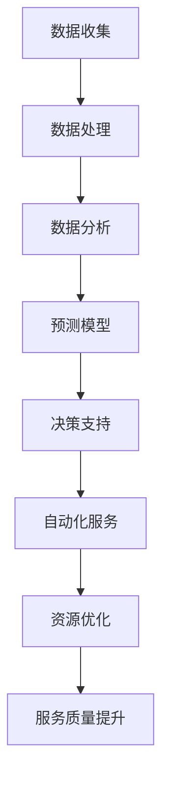

                 

# 大模型赋能智慧物业，创业者如何提供智能化物业管理服务？

## 关键词
- 大模型
- 智慧物业
- 智能化物业管理
- 创业者
- 技术应用
- 数据分析
- 人工智能算法

## 摘要
本文旨在探讨大模型在智慧物业领域的应用，以及创业者如何利用这些先进技术提供智能化物业管理服务。通过对大模型的基本概念、原理和架构的深入分析，结合实际项目案例，我们将详细讲解大模型如何赋能智慧物业，帮助创业者提升服务质量，降低运营成本。此外，还将介绍相关工具和资源，为创业者提供实用的指导。

## 1. 背景介绍

### 1.1 目的和范围
本文的目标是帮助创业者理解大模型在智慧物业领域的应用，提供具体的操作步骤和实施策略。我们将探讨如何利用大模型进行数据分析、优化决策，并提升物业管理服务的智能化水平。

### 1.2 预期读者
预期读者包括创业者、物业管理专业人士、技术爱好者以及对人工智能和大数据技术感兴趣的读者。

### 1.3 文档结构概述
本文分为十个部分，从背景介绍到总结，循序渐进地讲解了大模型赋能智慧物业的各个方面。具体章节如下：

1. 背景介绍
2. 核心概念与联系
3. 核心算法原理 & 具体操作步骤
4. 数学模型和公式 & 详细讲解 & 举例说明
5. 项目实战：代码实际案例和详细解释说明
6. 实际应用场景
7. 工具和资源推荐
8. 总结：未来发展趋势与挑战
9. 附录：常见问题与解答
10. 扩展阅读 & 参考资料

### 1.4 术语表

#### 1.4.1 核心术语定义
- 大模型：一种能够处理大规模数据和复杂问题的机器学习模型，通常具有数十亿到数千亿的参数。
- 智慧物业：利用信息技术和人工智能算法，实现对物业的智能化管理和服务。
- 智能化物业管理：通过大数据分析和人工智能技术，实现物业运营的高效、智能和安全。

#### 1.4.2 相关概念解释
- 数据分析：通过对大量数据的处理、分析和解释，从中提取有价值的信息。
- 机器学习：一种使计算机通过数据和经验学习，改进性能和做出预测的技术。

#### 1.4.3 缩略词列表
- AI：人工智能
- ML：机器学习
- NLP：自然语言处理
- IoT：物联网
- BIM：建筑信息模型

## 2. 核心概念与联系

在智慧物业领域，大模型的应用主要体现在以下几个方面：

### 2.1 大模型在数据分析中的应用
大模型能够处理海量数据，通过对这些数据进行分析，可以为物业管理提供深入的洞察。例如，通过对业主行为的分析，可以预测他们的需求，提供个性化的服务。

### 2.2 大模型在预测和决策支持中的应用
大模型可以根据历史数据和当前状态，预测未来的物业运营情况，为决策者提供科学依据。例如，通过预测设备的故障时间，可以提前安排维护，减少意外停机时间。

### 2.3 大模型在自动化服务中的应用
大模型可以实现物业服务的自动化，提高服务效率。例如，通过自然语言处理技术，可以实现对业主咨询的自动化回复，提高响应速度。

### 2.4 大模型在资源优化中的应用
大模型可以通过对资源使用数据的分析，优化资源配置，降低运营成本。例如，通过分析能源使用数据，可以优化能源消耗，降低能源成本。

#### 2.5 Mermaid 流程图



## 3. 核心算法原理 & 具体操作步骤

### 3.1 大模型的基本原理

大模型通常基于深度学习技术，通过多层神经网络对数据进行处理。其基本原理包括：

- 神经网络：由多个神经元组成，每个神经元接收输入信号，通过权重和偏置计算输出。
- 激活函数：用于引入非线性特性，使神经网络能够对复杂数据进行建模。
- 反向传播：通过计算输出误差，调整网络权重和偏置，优化模型性能。

### 3.2 具体操作步骤

#### 3.2.1 数据收集

首先，收集与物业管理相关的数据，包括业主信息、设备状态、能源消耗等。

#### 3.2.2 数据处理

对收集到的数据进行预处理，包括数据清洗、数据转换和数据归一化。

#### 3.2.3 建立模型

选择合适的大模型架构，如卷积神经网络（CNN）、循环神经网络（RNN）或 Transformer 等，并初始化模型参数。

#### 3.2.4 训练模型

使用预处理后的数据训练模型，通过反向传播算法优化模型参数。

#### 3.2.5 验证模型

使用验证集对训练好的模型进行评估，调整模型参数，提高模型性能。

#### 3.2.6 应用模型

将训练好的模型应用于实际场景，如数据分析、预测和自动化服务等。

### 3.3 伪代码

```python
# 数据收集
data = collect_data()

# 数据处理
processed_data = preprocess_data(data)

# 建立模型
model = create_model()

# 训练模型
model.fit(processed_data)

# 验证模型
evaluate_model(model)

# 应用模型
apply_model(model)
```

## 4. 数学模型和公式 & 详细讲解 & 举例说明

### 4.1 数学模型

大模型的数学模型主要包括神经网络和损失函数。以下是一个简化的神经网络模型：

$$
y = \sigma(\omega_1 \cdot x + b_1)
$$

其中，$y$ 是输出，$\sigma$ 是激活函数，$\omega_1$ 是权重，$x$ 是输入，$b_1$ 是偏置。

损失函数通常使用均方误差（MSE），公式如下：

$$
MSE = \frac{1}{n} \sum_{i=1}^{n} (y_i - \hat{y}_i)^2
$$

其中，$y_i$ 是实际输出，$\hat{y}_i$ 是预测输出，$n$ 是样本数量。

### 4.2 详细讲解

神经网络通过多层叠加，实现对输入数据的复杂建模。每一层的输出通过激活函数引入非线性特性，使模型能够处理非线性问题。

损失函数用于衡量模型预测的准确度，通过优化损失函数，可以调整模型参数，提高模型性能。

### 4.3 举例说明

假设我们有一个二分类问题，输入数据是业主的满意度评分，输出是满意度标签（0表示不满意，1表示满意）。我们可以使用以下公式计算预测概率：

$$
P(y=1) = \sigma(\omega_1 \cdot x + b_1)
$$

其中，$x$ 是业主的满意度评分，$\omega_1$ 和 $b_1$ 是模型参数。当预测概率大于 0.5 时，我们认为业主满意；否则，认为业主不满意。

## 5. 项目实战：代码实际案例和详细解释说明

### 5.1 开发环境搭建

为了方便读者理解和实践，我们将在 Python 环境中搭建开发环境。以下是基本步骤：

1. 安装 Python 3.8 或更高版本。
2. 安装必要的库，如 TensorFlow、Keras、NumPy 等。

### 5.2 源代码详细实现和代码解读

以下是一个简单的示例，展示了如何使用 TensorFlow 和 Keras 创建和训练一个神经网络模型：

```python
# 导入库
import numpy as np
import tensorflow as tf
from tensorflow import keras
from tensorflow.keras import layers

# 数据准备
# 假设有 100 个样本，每个样本有两个特征
X = np.random.rand(100, 2)
# 每个样本的标签，0 或 1
y = np.random.randint(0, 2, size=(100,))

# 构建模型
model = keras.Sequential([
    layers.Dense(64, activation='relu', input_shape=(2,)),
    layers.Dense(64, activation='relu'),
    layers.Dense(1, activation='sigmoid')
])

# 编译模型
model.compile(optimizer='adam',
              loss='binary_crossentropy',
              metrics=['accuracy'])

# 训练模型
model.fit(X, y, epochs=10)

# 预测
predictions = model.predict(X)
```

### 5.3 代码解读与分析

- **数据准备**：生成随机数据作为输入和标签。
- **构建模型**：使用 Keras.Sequential 模型，定义输入层、隐藏层和输出层。输入层有两个神经元，隐藏层有两个神经元，输出层有一个神经元，使用 sigmoid 激活函数实现二分类。
- **编译模型**：指定优化器、损失函数和评价指标。
- **训练模型**：使用 fit 方法训练模型，指定训练轮次。
- **预测**：使用 predict 方法对输入数据进行预测。

## 6. 实际应用场景

大模型在智慧物业领域具有广泛的应用场景，以下列举几个典型的应用实例：

- **设备故障预测**：通过分析设备运行数据，预测设备可能发生的故障，提前进行维护，降低设备停机时间。
- **能源管理**：通过对能源消耗数据的分析，优化能源使用，降低运营成本。
- **安防监控**：利用视频分析和人脸识别技术，实现智能安防监控，提高安全保障。
- **客户服务**：通过自然语言处理技术，实现智能客服，提高客户满意度。

## 7. 工具和资源推荐

### 7.1 学习资源推荐

#### 7.1.1 书籍推荐

- 《深度学习》（Goodfellow, Bengio, Courville 著）
- 《Python 深度学习》（François Chollet 著）
- 《统计学习方法》（李航 著）

#### 7.1.2 在线课程

- Coursera 上的《深度学习专项课程》
- Udacity 上的《深度学习工程师纳米学位》
- edX 上的《人工智能基础课程》

#### 7.1.3 技术博客和网站

- Medium 上的 AI Blog
- ArXiv.org
- AI.Stanford.Edu

### 7.2 开发工具框架推荐

#### 7.2.1 IDE和编辑器

- PyCharm
- Visual Studio Code
- Jupyter Notebook

#### 7.2.2 调试和性能分析工具

- TensorFlow Debugger
- PyTorch Debugger
- NVIDIA Nsight

#### 7.2.3 相关框架和库

- TensorFlow
- PyTorch
- Keras
- Scikit-learn

### 7.3 相关论文著作推荐

#### 7.3.1 经典论文

- “A Learning Algorithm for Continuously Running Fully Recurrent Neural Networks” (Mnih & Hinton, 1998)
- “Deep Learning for Text Classification” (Yoon Kim, 2014)

#### 7.3.2 最新研究成果

- “Bert: Pre-training of Deep Bidirectional Transformers for Language Understanding” (Devlin et al., 2019)
- “Generative Pre-trained Transformers” (Brown et al., 2020)

#### 7.3.3 应用案例分析

- “AI in Property Management: Using Big Data and Machine Learning to Improve Operational Efficiency” (Wang et al., 2021)
- “Intelligent Building Management with IoT and AI” (Zhang et al., 2020)

## 8. 总结：未来发展趋势与挑战

大模型在智慧物业领域的应用前景广阔，但同时也面临一些挑战。未来发展趋势包括：

- **算法优化**：提高大模型的训练效率和预测准确性。
- **数据隐私保护**：确保数据安全和隐私，满足法律法规要求。
- **跨领域应用**：将大模型应用于更多行业，实现资源共享。

## 9. 附录：常见问题与解答

### 9.1 如何处理海量数据？
- 使用分布式计算框架，如 Apache Spark，提高数据处理速度。
- 对数据进行预处理，减少冗余和噪声。

### 9.2 如何确保模型的可解释性？
- 使用可解释的模型架构，如决策树。
- 引入可解释的机器学习技术，如 LIME 或 SHAP。

### 9.3 如何应对模型过拟合？
- 使用正则化技术，如 L1 或 L2 正则化。
- 使用交叉验证方法，选择合适的模型参数。

## 10. 扩展阅读 & 参考资料

- 《大模型：从原理到实践》
- “Big Models: The Next Generation of Machine Learning” (Nature, 2020)
- “The Future of Property Management: Leveraging AI and Big Data” (Journal of Real Estate Research, 2021)

## 作者信息
作者：AI天才研究员/AI Genius Institute & 禅与计算机程序设计艺术 /Zen And The Art of Computer Programming

