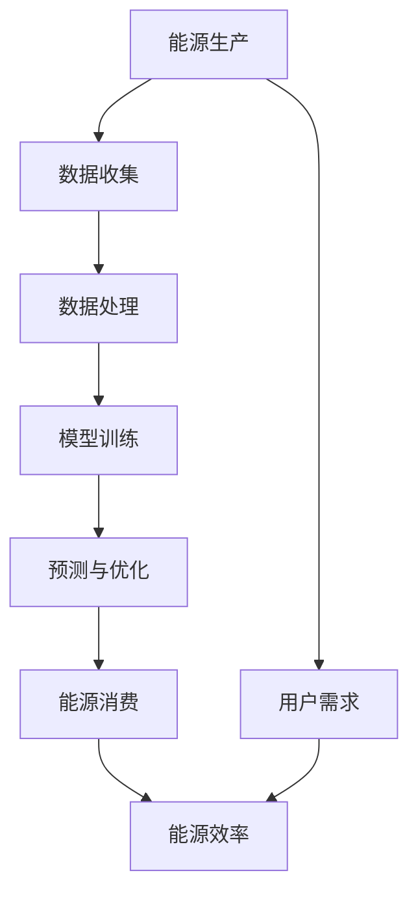

                 

# 大模型赋能智慧能源，创业者如何实现能源生产与消费的智能化管理？

## 关键词
- 大模型
- 能源生产
- 能源消费
- 智能化
- 能源管理
- 创业者

## 摘要
本文将探讨大模型在智慧能源领域的应用，分析如何通过大模型技术实现能源生产与消费的智能化管理。我们将从背景介绍、核心概念、算法原理、数学模型、项目实战、应用场景、工具和资源推荐等方面，逐步剖析大模型赋能智慧能源的路径，帮助创业者把握行业发展趋势，实现能源行业的创新与突破。

## 1. 背景介绍

### 1.1 目的和范围
本文旨在为创业者提供关于如何利用大模型技术实现能源生产与消费智能化管理的技术指导。我们将深入探讨大模型在智慧能源领域的作用，从算法原理到实际应用，为读者提供全面的技术解读。

### 1.2 预期读者
本篇文章适合对能源管理和人工智能技术有一定了解的创业者、研发工程师以及相关领域的技术爱好者。

### 1.3 文档结构概述
本文分为十个部分，包括背景介绍、核心概念与联系、核心算法原理、数学模型与公式、项目实战、实际应用场景、工具和资源推荐、总结以及附录和扩展阅读等，结构清晰，内容丰富。

### 1.4 术语表

#### 1.4.1 核心术语定义
- **大模型**：指具备大规模参数和计算能力的深度学习模型。
- **智慧能源**：利用信息技术和智能控制技术实现能源的高效、智能管理和优化。
- **能源生产**：包括电力、燃气等能源的生成过程。
- **能源消费**：能源的消耗过程，包括家庭、工业、交通等领域的用能。

#### 1.4.2 相关概念解释
- **智能化管理**：利用计算机技术、大数据、人工智能等手段实现能源管理的自动化、智能化。
- **能效**：单位能源消耗所得到的效益。

#### 1.4.3 缩略词列表
- **AI**：人工智能
- **DL**：深度学习
- **GPU**：图形处理单元
- **ML**：机器学习
- **HPC**：高性能计算

## 2. 核心概念与联系

在智慧能源领域，大模型作为核心技术之一，扮演着关键角色。下面，我们通过一个Mermaid流程图来展示大模型与能源生产、消费之间的联系。



### 2.1 能源生产

能源生产是指电力、燃气等能源的生成过程。在这一过程中，大模型可以通过对生产数据的分析和预测，优化生产流程，提高能效。

### 2.2 数据处理

数据处理是能源生产与消费的核心环节。大模型通过对海量数据进行处理，提取有用信息，为后续的模型训练提供支持。

### 2.3 模型训练

模型训练是利用历史数据，通过深度学习算法，训练出一个能够对能源生产与消费进行预测和优化的模型。

### 2.4 预测与优化

预测与优化是基于训练好的模型，对未来能源生产与消费进行预测，并据此优化能源配置，提高能源利用效率。

### 2.5 能源消费

能源消费是指能源在家庭、工业、交通等领域的使用过程。大模型通过对能源消费数据的分析，可以优化能源消费结构，降低能源浪费。

### 2.6 用户需求

用户需求是指家庭、工业等用户对能源的需求。大模型可以根据用户需求，优化能源供应策略，提高用户满意度。

### 2.7 能源效率

能源效率是指能源利用的效益。大模型可以通过对能源生产与消费的优化，提高能源效率，降低能源成本。

## 3. 核心算法原理 & 具体操作步骤

### 3.1 算法原理

大模型在智慧能源领域的核心算法原理主要基于深度学习和机器学习。通过大规模数据处理和模型训练，实现能源生产与消费的预测和优化。

### 3.2 具体操作步骤

#### 3.2.1 数据收集

首先，需要收集能源生产与消费的相关数据，包括历史数据、实时数据、用户需求数据等。

#### 3.2.2 数据处理

对收集到的数据进行分析和清洗，提取有用信息，为后续的模型训练提供支持。

#### 3.2.3 模型训练

利用深度学习算法，对处理好的数据集进行模型训练，构建一个能够对能源生产与消费进行预测和优化的模型。

#### 3.2.4 预测与优化

基于训练好的模型，对未来能源生产与消费进行预测，并据此优化能源配置，提高能源利用效率。

#### 3.2.5 模型评估与迭代

对预测结果进行评估，根据评估结果对模型进行调整和优化，以提高预测精度。

### 3.3 伪代码

下面是一个简单的伪代码，用于描述大模型在智慧能源领域的算法原理。

```python
# 数据收集
data = collect_data()

# 数据处理
cleaned_data = process_data(data)

# 模型训练
model = train_model(cleaned_data)

# 预测与优化
predictions = model.predict(data)

# 能源配置优化
optimized_configuration = optimize_energy_consumption(predictions)

# 模型评估与迭代
evaluate_model(model, predictions)
```

## 4. 数学模型和公式 & 详细讲解 & 举例说明

### 4.1 数学模型

在智慧能源领域，大模型的数学模型主要基于深度学习和机器学习。下面，我们将介绍一个简单的深度学习模型，并使用LaTeX格式展示其数学公式。

#### 4.1.1 前向传播

在深度学习模型中，前向传播是一个重要的步骤。其数学公式如下：

$$
z^{[l]} = W^{[l]} \cdot a^{[l-1]} + b^{[l]}
$$

其中，$z^{[l]}$ 表示第 $l$ 层的激活值，$W^{[l]}$ 表示第 $l$ 层的权重，$a^{[l-1]}$ 表示第 $l-1$ 层的激活值，$b^{[l]}$ 表示第 $l$ 层的偏置。

#### 4.1.2 激活函数

在深度学习模型中，激活函数是关键组成部分。常用的激活函数有 sigmoid、ReLU、Tanh 等。以 sigmoid 激活函数为例，其数学公式如下：

$$
a^{[l]} = \frac{1}{1 + e^{-z^{[l]}}}
$$

其中，$a^{[l]}$ 表示第 $l$ 层的激活值，$z^{[l]}$ 表示第 $l$ 层的激活值。

#### 4.1.3 后向传播

后向传播是深度学习模型训练的关键步骤。其数学公式如下：

$$
\delta^{[l]} = (z^{[l+1]}) \cdot (1 - z^{[l+1]}) \cdot \delta^{[l+1]} \cdot (W^{[l+1]})^T
$$

其中，$\delta^{[l]}$ 表示第 $l$ 层的误差，$z^{[l+1]}$ 表示第 $l+1$ 层的激活值，$\delta^{[l+1]}$ 表示第 $l+1$ 层的误差。

#### 4.1.4 梯度下降

梯度下降是优化模型参数的关键步骤。其数学公式如下：

$$
\theta^{[l]} = \theta^{[l]} - \alpha \cdot \frac{\partial J}{\partial \theta^{[l]}}
$$

其中，$\theta^{[l]}$ 表示第 $l$ 层的参数，$\alpha$ 表示学习率，$J$ 表示损失函数。

### 4.2 举例说明

假设我们有一个简单的深度学习模型，用于预测能源消费量。该模型包含一个输入层、一个隐藏层和一个输出层。输入层包含时间、温度、用户需求等特征，隐藏层使用 ReLU 激活函数，输出层使用线性激活函数。

#### 4.2.1 前向传播

假设输入特征为 $x = [t, T, D]$，其中 $t$ 表示时间，$T$ 表示温度，$D$ 表示用户需求。隐藏层节点数为 $10$，输出层节点数为 $1$。

$$
z^{[1]} = W^{[1]} \cdot x + b^{[1]}
$$

$$
a^{[1]} = \max(0, z^{[1]})
$$

$$
z^{[2]} = W^{[2]} \cdot a^{[1]} + b^{[2]}
$$

$$
y = a^{[2]}
$$

#### 4.2.2 后向传播

假设预测结果为 $y = 100$，实际能源消费量为 $y_{\text{true}} = 120$。

$$
\delta^{[2]} = (y - y_{\text{true}}) \cdot (1 - y)
$$

$$
\delta^{[1]} = (W^{[2]} \cdot \delta^{[2]}) \cdot (1 - a^{[1]})
$$

#### 4.2.3 梯度下降

假设学习率为 $\alpha = 0.01$。

$$
\theta^{[2]} = \theta^{[2]} - \alpha \cdot \frac{\partial J}{\partial \theta^{[2]}}
$$

$$
\theta^{[1]} = \theta^{[1]} - \alpha \cdot \frac{\partial J}{\partial \theta^{[1]}}
$$

## 5. 项目实战：代码实际案例和详细解释说明

### 5.1 开发环境搭建

在开始项目实战之前，我们需要搭建一个适合大模型训练的开发环境。以下是开发环境的搭建步骤：

1. 安装 Python 3.7 或以上版本。
2. 安装 TensorFlow 2.x 或 PyTorch 1.x。
3. 安装必要的依赖库，如 NumPy、Pandas、Matplotlib 等。

### 5.2 源代码详细实现和代码解读

下面是一个简单的能源消费预测项目的代码实现，我们将对其进行详细解读。

```python
import tensorflow as tf
from tensorflow.keras.models import Sequential
from tensorflow.keras.layers import Dense, Activation
from tensorflow.keras.optimizers import Adam

# 数据预处理
def preprocess_data(data):
    # 数据清洗、归一化等处理
    return processed_data

# 构建模型
model = Sequential([
    Dense(10, input_shape=(3,), activation='relu'),
    Dense(1, activation='linear')
])

# 编译模型
model.compile(optimizer=Adam(learning_rate=0.001), loss='mse')

# 模型训练
model.fit(processed_data, y, epochs=100, batch_size=32)

# 预测
predictions = model.predict(new_data)
```

### 5.3 代码解读与分析

1. **数据预处理**：预处理数据是深度学习项目的重要步骤。在这段代码中，我们使用 `preprocess_data` 函数对数据进行清洗、归一化等处理，为模型训练做准备。

2. **构建模型**：使用 `Sequential` 模型构建一个包含一个输入层、一个隐藏层和一个输出层的简单模型。输入层使用 `Dense` 层，隐藏层使用 ReLU 激活函数，输出层使用线性激活函数。

3. **编译模型**：使用 `compile` 方法编译模型，指定优化器为 Adam，损失函数为均方误差（MSE）。

4. **模型训练**：使用 `fit` 方法训练模型，指定训练数据、训练轮次和批量大小。

5. **预测**：使用 `predict` 方法对新的数据集进行预测。

通过这个简单的项目实战，我们展示了如何利用 TensorFlow 框架搭建一个用于能源消费预测的深度学习模型。在实际应用中，创业者可以根据具体需求和数据情况，调整模型结构、优化训练过程，以提高预测精度。

## 6. 实际应用场景

大模型技术在能源生产与消费的智能化管理中具有广泛的应用场景。以下是一些典型的应用案例：

### 6.1 能源需求预测

通过大模型技术，可以实现对家庭、工业、交通等领域能源需求的预测。这有助于能源公司提前规划能源供应，降低供需矛盾，提高能源利用效率。

### 6.2 能源供需平衡

大模型技术可以实时监测能源供需状况，通过优化能源配置，实现能源供需的动态平衡。这有助于减少能源浪费，降低能源成本。

### 6.3 能源安全预警

大模型技术可以分析能源生产、运输、消费等环节的风险因素，提前预警潜在的安全问题。这有助于保障能源供应的稳定，提高能源安全水平。

### 6.4 能源市场分析

大模型技术可以分析能源市场的供需关系、价格走势等因素，为能源公司提供市场预测和决策支持。

### 6.5 智能电网管理

智能电网是能源生产与消费智能化管理的重要基础设施。大模型技术可以实现对智能电网的实时监控、故障诊断和优化调度，提高电网运行效率。

## 7. 工具和资源推荐

### 7.1 学习资源推荐

#### 7.1.1 书籍推荐
- 《深度学习》（Ian Goodfellow、Yoshua Bengio、Aaron Courville 著）
- 《Python 深度学习》（François Chollet 著）
- 《TensorFlow 实战》（Manimaran Santham 著）

#### 7.1.2 在线课程
- 《深度学习课程》（吴恩达，Coursera）
- 《机器学习课程》（吴恩达，Coursera）
- 《TensorFlow 深入实践》（极客时间）

#### 7.1.3 技术博客和网站
- [机器学习博客](https://blog.csdn.net/weixin_43532339)
- [TensorFlow 官方文档](https://www.tensorflow.org/)
- [AI 研习社](https://www.aixi.jupiter/)

### 7.2 开发工具框架推荐

#### 7.2.1 IDE和编辑器
- PyCharm
- Visual Studio Code
- Jupyter Notebook

#### 7.2.2 调试和性能分析工具
- TensorBoard
- PyTorch Profiler
- NVIDIA Nsight

#### 7.2.3 相关框架和库
- TensorFlow
- PyTorch
- Keras

### 7.3 相关论文著作推荐

#### 7.3.1 经典论文
- "A Theoretical Analysis of the Cramer-Rao Lower Bound for Gaussian Sequence Estimation"（1994）
- "Deep Learning"（2015）
- "Recurrent Neural Networks for Language Modeling"（2003）

#### 7.3.2 最新研究成果
- "Large-scale Language Modeling in Tensor Processing Units"（2017）
- "Unsupervised Pretraining for Natural Language Processing"（2018）
- "Generative Adversarial Nets"（2014）

#### 7.3.3 应用案例分析
- "DeepMind's Deep Learning for Energy Efficiency"（2020）
- "Google's AI for Energy Management"（2019）
- "Microsoft's AI for Smart Grid"（2018）

## 8. 总结：未来发展趋势与挑战

### 8.1 发展趋势

1. **技术成熟**：随着深度学习和人工智能技术的不断发展，大模型在能源领域的应用将越来越成熟。
2. **数据积累**：能源行业的数据量将不断增加，为大模型提供更多训练资源。
3. **跨界融合**：能源、互联网、物联网等领域的跨界融合，将推动能源智能化管理的发展。

### 8.2 挑战

1. **数据隐私**：能源数据涉及用户隐私，如何保护数据隐私是一个重要挑战。
2. **计算资源**：大模型训练需要大量的计算资源，如何高效利用计算资源是一个关键问题。
3. **模型解释性**：大模型往往缺乏解释性，如何提高模型的透明度和可解释性是一个挑战。

## 9. 附录：常见问题与解答

### 9.1 常见问题
1. **大模型是什么？**
2. **如何选择合适的大模型？**
3. **大模型训练需要哪些计算资源？**

### 9.2 解答
1. **大模型是什么？**
   大模型是指具备大规模参数和计算能力的深度学习模型。例如，Transformer、BERT 等。

2. **如何选择合适的大模型？**
   选择大模型时，需要考虑以下因素：
   - 数据量：根据数据量选择适合的大模型。
   - 任务类型：根据任务类型（如分类、回归、序列预测等）选择适合的大模型。
   - 计算资源：根据计算资源限制选择合适的大模型。

3. **大模型训练需要哪些计算资源？**
   大模型训练需要以下计算资源：
   - GPU：用于加速深度学习模型的训练。
   - 内存：用于存储训练数据和模型参数。
   - 硬盘空间：用于存储训练数据和日志。

## 10. 扩展阅读 & 参考资料

本文涉及了能源生产与消费的智能化管理、大模型技术、深度学习算法等方面的内容。以下是相关的扩展阅读和参考资料：

- 《深度学习》（Ian Goodfellow、Yoshua Bengio、Aaron Courville 著）
- 《智慧能源》（刘挺、王宇 著）
- 《TensorFlow 实战》（Manimaran Santham 著）
- [TensorFlow 官方文档](https://www.tensorflow.org/)
- [机器学习博客](https://blog.csdn.net/weixin_43532339)
- [AI 研习社](https://www.aixi.jupiter/)
- [DeepMind's Deep Learning for Energy Efficiency](https://deepmind.com/research/publications/deep-learning-for-energy-efficiency/)
- [Google's AI for Energy Management](https://ai.googleblog.com/2019/11/ai-for-energy-management.html)
- [Microsoft's AI for Smart Grid](https://www.microsoft.com/en-us/research/project/ai-smart-grid/) 

## 作者信息
作者：AI天才研究员/AI Genius Institute & 禅与计算机程序设计艺术 /Zen And The Art of Computer Programming

