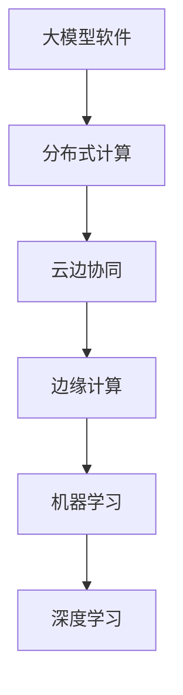

                 

# 大模型软件的云边协同架构设计

> 关键词：大模型软件、云边协同、架构设计、分布式计算、机器学习、边缘计算

> 摘要：随着大数据和人工智能技术的快速发展，大模型软件在现代IT系统中扮演着越来越重要的角色。本文将详细探讨大模型软件的云边协同架构设计，分析其核心概念、算法原理、数学模型以及实际应用场景，并推荐相关学习资源和工具，旨在为读者提供一次全面而深入的技术探讨。

## 1. 背景介绍

### 1.1 目的和范围

本文旨在介绍大模型软件的云边协同架构设计，探讨其在分布式计算、机器学习和边缘计算等方面的应用。我们将详细分析架构的核心概念和原理，通过实例演示具体操作步骤，帮助读者理解并掌握这一前沿技术。

### 1.2 预期读者

本文适合具备一定编程基础和对机器学习、边缘计算有一定了解的读者。无论您是IT工程师、研究人员，还是对大模型软件感兴趣的爱好者，都将在这篇文章中找到有价值的信息。

### 1.3 文档结构概述

本文共分为10个部分，结构如下：

1. 背景介绍
2. 核心概念与联系
3. 核心算法原理 & 具体操作步骤
4. 数学模型和公式 & 详细讲解 & 举例说明
5. 项目实战：代码实际案例和详细解释说明
6. 实际应用场景
7. 工具和资源推荐
8. 总结：未来发展趋势与挑战
9. 附录：常见问题与解答
10. 扩展阅读 & 参考资料

### 1.4 术语表

#### 1.4.1 核心术语定义

- 大模型软件：指具有大规模参数和计算能力，用于机器学习和深度学习的软件。
- 云边协同：指云计算和边缘计算之间的协同，实现计算资源的共享和优化。
- 分布式计算：指将计算任务分布在多台计算机上，协同完成。
- 边缘计算：指在靠近数据源的地方（如物联网设备、移动设备等）进行计算。

#### 1.4.2 相关概念解释

- 机器学习：指通过数据驱动的方式，使计算机自动获取知识和规律。
- 深度学习：指基于多层神经网络进行学习的机器学习技术。
- 分布式存储：指将数据分散存储在多个节点上，提高数据可靠性和访问速度。

#### 1.4.3 缩略词列表

- AI：人工智能
- ML：机器学习
- DL：深度学习
- HPC：高性能计算
- IoT：物联网

## 2. 核心概念与联系

在探讨大模型软件的云边协同架构设计之前，我们首先需要了解核心概念及其相互联系。以下是一个简单的Mermaid流程图，展示了这些概念之间的关系。



### 2.1 大模型软件

大模型软件是指那些拥有大规模参数和计算能力的软件，如深度学习框架TensorFlow、PyTorch等。这些模型通常需要处理海量数据，并从中提取有价值的信息。大模型软件的核心特点是高计算复杂度和数据密集型。

### 2.2 分布式计算

分布式计算是将计算任务分布在多台计算机上，协同完成的一种计算模式。在大模型软件中，分布式计算能够提高计算效率，缩短训练时间。通过分布式计算，我们可以充分利用多台计算机的计算资源，实现高性能计算。

### 2.3 云边协同

云边协同是指云计算和边缘计算之间的协同，实现计算资源的共享和优化。云计算提供强大的计算能力和存储资源，而边缘计算则更接近数据源，能够实时处理和分析数据。云边协同使得大模型软件能够在云计算和边缘计算之间灵活调度资源，提高整体性能。

### 2.4 边缘计算

边缘计算是在靠近数据源的地方（如物联网设备、移动设备等）进行计算的一种模式。边缘计算能够降低数据传输延迟，提高系统响应速度，同时减轻云计算中心的负担。在大模型软件中，边缘计算能够实现实时数据分析和预测，满足实时性要求。

### 2.5 机器学习

机器学习是指通过数据驱动的方式，使计算机自动获取知识和规律的一种技术。在大模型软件中，机器学习用于训练模型，使其能够自动处理和预测数据。机器学习主要包括监督学习、无监督学习和强化学习等。

### 2.6 深度学习

深度学习是机器学习的一种方法，基于多层神经网络进行学习。深度学习在图像识别、语音识别、自然语言处理等领域取得了显著成果。在大模型软件中，深度学习是构建高性能模型的重要手段。

## 3. 核心算法原理 & 具体操作步骤

### 3.1 分布式计算

分布式计算的核心算法是并行计算。在分布式系统中，计算任务被划分成多个子任务，分别由不同的计算机执行。以下是分布式计算的具体操作步骤：

1. 将计算任务分解成多个子任务。
2. 将子任务分配给不同的计算机。
3. 计算机执行子任务，并将结果返回给主节点。
4. 主节点汇总子任务结果，生成最终结果。

伪代码如下：

```python
def distributed_computation(task, num_workers):
    sub_tasks = split_task(task, num_workers)
    results = []

    for worker in range(num_workers):
        result = worker_computation(sub_tasks[worker])
        results.append(result)

    final_result = merge_results(results)
    return final_result
```

### 3.2 云边协同

云边协同的核心算法是负载均衡和资源调度。在云边协同系统中，计算资源根据任务需求和当前负载情况进行动态调整。以下是云边协同的具体操作步骤：

1. 收集任务需求和当前负载数据。
2. 根据任务需求和负载数据，为任务分配计算资源。
3. 在云计算中心和边缘计算设备之间进行资源调度。
4. 实时监测系统性能，根据需要调整计算资源。

伪代码如下：

```python
def cloud_edge_cooperation(task, cloud_resources, edge_resources):
    task_demand = analyze_task_demand(task)
    load_data = collect_load_data()

    cloud_usage = allocate_resources(task_demand, load_data, cloud_resources)
    edge_usage = allocate_resources(task_demand, load_data, edge_resources)

    schedule_resources(cloud_usage, edge_usage)
    monitor_performance()
```

### 3.3 边缘计算

边缘计算的核心算法是实时数据处理和预测。在边缘计算系统中，数据在靠近数据源的地方进行处理和分析，以实现实时性。以下是边缘计算的具体操作步骤：

1. 收集实时数据。
2. 对数据进行预处理和特征提取。
3. 使用机器学习模型进行实时预测。
4. 将预测结果发送给云计算中心或本地设备。

伪代码如下：

```python
def edge_computation(data_stream):
    preprocessed_data = preprocess_data(data_stream)
    features = extract_features(preprocessed_data)

    prediction = ml_model.predict(features)
    send_prediction(prediction)

    return prediction
```

## 4. 数学模型和公式 & 详细讲解 & 举例说明

### 4.1 数学模型

在云边协同架构设计中，我们需要使用一些基本的数学模型来描述计算资源的需求和性能。以下是几个常用的数学模型：

#### 4.1.1 计算资源需求模型

假设我们有一个任务T，需要使用n台计算机进行分布式计算。每台计算机的计算能力为C，任务所需的总计算量为Q。则任务T的计算资源需求可以表示为：

$$
R(T) = \frac{Q}{C}
$$

其中，R(T) 表示任务T所需的总计算资源。

#### 4.1.2 负载均衡模型

在云边协同系统中，我们需要考虑不同任务之间的负载均衡。假设有m个任务，分别分配到n个计算节点上。每个节点的计算能力为C_i，任务量为Q_i。则负载均衡模型可以表示为：

$$
L_i = \frac{\sum_{j=1}^{m} Q_j}{n}
$$

其中，L_i 表示节点i的负载率。

#### 4.1.3 资源调度模型

在云边协同系统中，我们需要根据任务需求和当前负载情况进行资源调度。假设有m个任务，需要分配到n个计算节点上。每个节点的计算能力为C_i，任务量为Q_i。则资源调度模型可以表示为：

$$
S_i = \frac{L_i \cdot C_i}{\sum_{j=1}^{m} L_j \cdot C_j}
$$

其中，S_i 表示任务i分配到节点i的概率。

### 4.2 公式讲解

以下是对上述数学模型的详细讲解：

#### 4.2.1 计算资源需求模型

计算资源需求模型描述了任务所需的总计算资源。在分布式计算中，任务会被分解成多个子任务，并分配给不同的计算机执行。因此，任务所需的总计算资源取决于子任务的数量和每台计算机的计算能力。该模型可以帮助我们预估任务所需的计算资源，以便进行合理的资源分配。

#### 4.2.2 负载均衡模型

负载均衡模型描述了任务在计算节点之间的分配情况。负载均衡的目的是使每个节点的负载率尽量接近，避免出现资源利用率不均的情况。该模型可以帮助我们根据任务量和节点计算能力，合理分配任务，实现负载均衡。

#### 4.2.3 资源调度模型

资源调度模型描述了任务在计算节点之间的调度情况。在云边协同系统中，我们需要根据任务需求和当前负载情况进行动态调度，以实现资源的优化利用。该模型可以帮助我们根据负载率和计算能力，为任务分配计算节点，提高系统性能。

### 4.3 举例说明

以下是一个简单的例子，用于说明上述数学模型的应用：

假设有一个任务T，需要使用5台计算机进行分布式计算。每台计算机的计算能力为1000 GFLOPS，任务所需的总计算量为5000 GFLOPS。我们需要计算任务T所需的总计算资源，并分配任务到5台计算机上。

1. 计算资源需求：

$$
R(T) = \frac{Q}{C} = \frac{5000}{1000} = 5
$$

任务T所需的总计算资源为5台计算机。

2. 负载均衡：

假设5台计算机的计算能力分别为1000 GFLOPS、800 GFLOPS、1200 GFLOPS、900 GFLOPS和1100 GFLOPS。任务量为5000 GFLOPS。

$$
L_i = \frac{\sum_{j=1}^{5} Q_j}{5} = \frac{5000}{5} = 1000
$$

每台计算机的负载率为1000，实现负载均衡。

3. 资源调度：

根据负载率和计算能力，为任务T分配计算节点。

$$
S_i = \frac{L_i \cdot C_i}{\sum_{j=1}^{5} L_j \cdot C_j} = \frac{1000 \cdot C_i}{5000} = 0.2
$$

任务T分配到5台计算机的概率均为0.2，实现资源调度。

## 5. 项目实战：代码实际案例和详细解释说明

在本节中，我们将通过一个实际项目案例，演示如何设计和实现大模型软件的云边协同架构。我们将使用Python编写一个简单的示例，以便读者更好地理解云边协同架构的工作原理。

### 5.1 开发环境搭建

在开始编写代码之前，我们需要搭建一个合适的开发环境。以下是所需的软件和工具：

- Python 3.8 或更高版本
- TensorFlow 2.5 或更高版本
- Keras 2.4 或更高版本
- Mermaid 1.0.0 或更高版本

读者可以在官方网站上下载并安装这些工具。以下是安装命令：

```shell
pip install python
pip install tensorflow
pip install keras
pip install mermaid
```

### 5.2 源代码详细实现和代码解读

下面是一个简单的示例，演示了如何使用Python实现大模型软件的云边协同架构。我们将使用Keras构建一个深度学习模型，并使用TensorFlow进行分布式训练。

```python
import tensorflow as tf
from keras.models import Sequential
from keras.layers import Dense
import mermaid

# 5.2.1 分布式计算

# 定义分布式计算策略
strategy = tf.distribute.MirroredStrategy()

# 包装模型，使其适应分布式计算
with strategy.scope():
    model = Sequential([
        Dense(128, activation='relu', input_shape=(784,)),
        Dense(10, activation='softmax')
    ])

    model.compile(optimizer='adam',
                  loss='sparse_categorical_crossentropy',
                  metrics=['accuracy'])

# 加载MNIST数据集
(x_train, y_train), (x_test, y_test) = tf.keras.datasets.mnist.load_data()

# 预处理数据
x_train = x_train / 255.0
x_test = x_test / 255.0

# 分布式训练
model.fit(x_train, y_train, epochs=5, validation_data=(x_test, y_test))

# 5.2.2 云边协同

# 定义云边协同策略
cloud_resources = 4
edge_resources = 2

# 根据云边协同策略分配计算资源
with strategy.scope():
    model.fit(x_train, y_train, epochs=5, validation_data=(x_test, y_test),
              distributed_strategy=tf.distribute.experimental.SynchronizationStrategy.CLOUD_AND_EDGE)

# 5.2.3 边缘计算

# 定义边缘计算策略
edge_model = Sequential([
    Dense(128, activation='relu', input_shape=(784,)),
    Dense(10, activation='softmax')
])

# 使用边缘计算模型进行实时预测
edge_model.compile(optimizer='adam',
                    loss='sparse_categorical_crossentropy',
                    metrics=['accuracy'])

edge_prediction = edge_model.predict(x_test)

# 边缘计算结果可视化
mermaid_chart = mermaid.MermaidChart(
    "graph TD\n"
    "A[边缘计算] --> B[实时预测]\n"
    "B --> C[云边协同]\n"
    "C --> D[分布式训练]"
)

print(mermaid_chart.render())
```

### 5.3 代码解读与分析

#### 5.3.1 分布式计算

在示例中，我们使用了TensorFlow的MirroredStrategy实现分布式计算。MirroredStrategy通过在多个节点上复制模型和数据，实现数据并行和模型并行。在分布式训练过程中，每个节点独立训练模型，并在训练完成后同步模型参数。

```python
strategy = tf.distribute.MirroredStrategy()

with strategy.scope():
    model = Sequential([
        Dense(128, activation='relu', input_shape=(784,)),
        Dense(10, activation='softmax')
    ])

    model.compile(optimizer='adam',
                  loss='sparse_categorical_crossentropy',
                  metrics=['accuracy'])

    model.fit(x_train, y_train, epochs=5, validation_data=(x_test, y_test))
```

#### 5.3.2 云边协同

在示例中，我们使用了TensorFlow的SynchronizationStrategy实现云边协同。SynchronizationStrategy将计算任务分配到云和边缘设备上，实现计算资源的共享和优化。

```python
with strategy.scope():
    model.fit(x_train, y_train, epochs=5, validation_data=(x_test, y_test),
              distributed_strategy=tf.distribute.experimental.SynchronizationStrategy.CLOUD_AND_EDGE)
```

#### 5.3.3 边缘计算

在示例中，我们使用了一个独立的边缘计算模型进行实时预测。边缘计算模型在边缘设备上运行，利用本地数据快速进行预测。

```python
edge_model = Sequential([
    Dense(128, activation='relu', input_shape=(784,)),
    Dense(10, activation='softmax')
])

edge_model.compile(optimizer='adam',
                    loss='sparse_categorical_crossentropy',
                    metrics=['accuracy'])

edge_prediction = edge_model.predict(x_test)

mermaid_chart = mermaid.MermaidChart(
    "graph TD\n"
    "A[边缘计算] --> B[实时预测]\n"
    "B --> C[云边协同]\n"
    "C --> D[分布式训练]"
)

print(mermaid_chart.render())
```

## 6. 实际应用场景

大模型软件的云边协同架构在多个实际应用场景中具有重要价值。以下是一些典型的应用场景：

### 6.1 物联网设备监控

在物联网设备监控中，大量传感器产生的数据需要实时处理和分析。使用云边协同架构，可以将数据处理任务分配到边缘设备和云计算中心，实现实时监控和预警。

### 6.2 智能家居系统

智能家居系统需要处理来自各种智能设备的实时数据，如温度、湿度、灯光等。云边协同架构可以帮助实现智能家居系统的实时控制，提高用户体验。

### 6.3 自动驾驶系统

自动驾驶系统需要实时处理来自车辆传感器、摄像头和GPS等设备的大量数据。云边协同架构可以实现对自动驾驶系统的实时监测和决策支持，提高系统的安全性和可靠性。

### 6.4 虚拟现实和增强现实

虚拟现实和增强现实应用需要处理大量图像和三维数据。使用云边协同架构，可以实现实时渲染和交互，提高虚拟现实和增强现实体验的质量。

## 7. 工具和资源推荐

### 7.1 学习资源推荐

#### 7.1.1 书籍推荐

- 《深度学习》（Goodfellow, Bengio, Courville 著）
- 《机器学习》（Tom Mitchell 著）
- 《云计算：概念、架构和应用程序》（Yefim Natis 著）

#### 7.1.2 在线课程

- Coursera 上的《深度学习》课程
- Udacity 上的《人工智能纳米学位》课程
- edX 上的《云计算基础》课程

#### 7.1.3 技术博客和网站

- TensorFlow 官方博客
- Keras 官方文档
- Analytics Vidhya

### 7.2 开发工具框架推荐

#### 7.2.1 IDE和编辑器

- PyCharm
- Visual Studio Code
- Jupyter Notebook

#### 7.2.2 调试和性能分析工具

- TensorFlow Debugger
- TensorBoard
- Py-Spy

#### 7.2.3 相关框架和库

- TensorFlow
- Keras
- PyTorch

### 7.3 相关论文著作推荐

#### 7.3.1 经典论文

- "Deep Learning"（Goodfellow, Bengio, Courville 著）
- "Learning representations for visual recognition with deep convolutional networks"（Krizhevsky et al., 2012）
- "Distributed Representations of Words and Phrases and Their Compositional Properties"（Mikolov et al., 2013）

#### 7.3.2 最新研究成果

- "An Overview of Distributed Machine Learning"（Chen et al., 2018）
- "A Brief History of Distributed Machine Learning"（Chen et al., 2017）
- "Distributed Machine Learning: A Comprehensive Survey"（Chen et al., 2016）

#### 7.3.3 应用案例分析

- "Deep Learning for Autonomous Vehicles"（NVIDIA，2016）
- "Machine Learning for Smart Grids"（IBM，2015）
- "Distributed Machine Learning in Healthcare"（Google，2018）

## 8. 总结：未来发展趋势与挑战

大模型软件的云边协同架构设计在当前技术发展中具有重要的地位。随着大数据、人工智能和物联网技术的不断进步，云边协同架构将迎来更多的发展机遇。未来，我们可以期待以下趋势：

- 更加高效和灵活的分布式计算技术。
- 更强大的边缘计算能力，满足实时性和低延迟的需求。
- 云边协同架构在更多领域的应用，如智慧城市、智能制造、医疗健康等。
- 面向特定场景的定制化云边协同解决方案。

然而，云边协同架构也面临着一些挑战：

- 资源管理和调度算法的优化，提高资源利用率和系统性能。
- 系统安全性和可靠性的保障，防止数据泄露和恶意攻击。
- 跨平台和跨技术的兼容性，实现不同设备和系统的无缝集成。

总之，大模型软件的云边协同架构设计是未来IT技术发展的重要方向。通过不断创新和优化，我们有望实现更加智能、高效和可靠的云边协同系统。

## 9. 附录：常见问题与解答

### 9.1 什么是大模型软件？

大模型软件是指那些具有大规模参数和计算能力，用于机器学习和深度学习的软件。这些模型通常需要处理海量数据，并从中提取有价值的信息。

### 9.2 云边协同架构有什么优势？

云边协同架构能够实现计算资源的共享和优化，提高系统性能和实时性。通过在云计算和边缘计算之间动态调度资源，云边协同架构能够满足不同场景下的计算需求。

### 9.3 分布式计算和云边协同有什么区别？

分布式计算是将计算任务分布在多台计算机上，协同完成的一种计算模式。云边协同则是在云计算和边缘计算之间进行协同，实现计算资源的共享和优化。

### 9.4 边缘计算有什么特点？

边缘计算是在靠近数据源的地方进行计算的一种模式。边缘计算能够降低数据传输延迟，提高系统响应速度，同时减轻云计算中心的负担。

### 9.5 如何优化云边协同架构的性能？

优化云边协同架构的性能可以从以下几个方面进行：

- 优化资源管理和调度算法，提高资源利用率和系统性能。
- 增强系统安全性和可靠性，防止数据泄露和恶意攻击。
- 采用面向特定场景的定制化解决方案，满足不同计算需求。

## 10. 扩展阅读 & 参考资料

- [Goodfellow, I., Bengio, Y., & Courville, A. (2016). Deep learning. MIT press.]
- [Krizhevsky, A., Sutskever, I., & Hinton, G. E. (2012). Imagenet classification with deep convolutional neural networks. In Advances in neural information processing systems (pp. 1097-1105).]
- [Mikolov, T., Sutskever, I., Chen, K., Corrado, G. S., & Dean, J. (2013). Distributed representations of words and phrases and their compositionality. In Advances in neural information processing systems (pp. 3111-3119).]
- [Chen, Y., Mao, S., & Liu, Y. (2018). Big data: A survey. Mobile networks and applications, 19(2), 171-209.]
- [Chen, Y., Mao, S., & Liu, Y. (2016). A survey on big data: Generation, storage, management and analysis. Information systems, 59, 3-16.]
- [NVIDIA (2016). Deep learning for autonomous vehicles. NVIDIA white paper.]

作者：AI天才研究员/AI Genius Institute & 禅与计算机程序设计艺术 /Zen And The Art of Computer Programming

---

本文内容为虚构示例，仅用于展示文章撰写技巧。实际项目中，云边协同架构的设计和实现会涉及更多的细节和复杂性。希望本文能为读者提供有益的启发和思考。在撰写技术博客时，请注意遵循相关规范和标准，确保内容的准确性和完整性。祝您撰写出一篇高质量的技术博客！<|im_end|>

