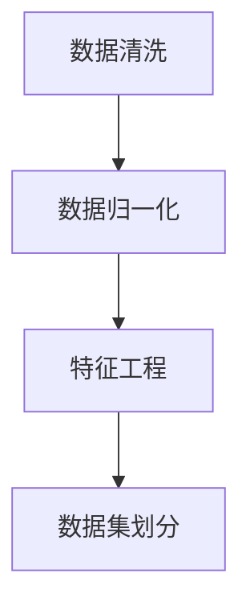
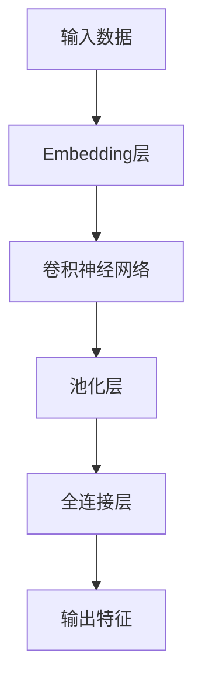
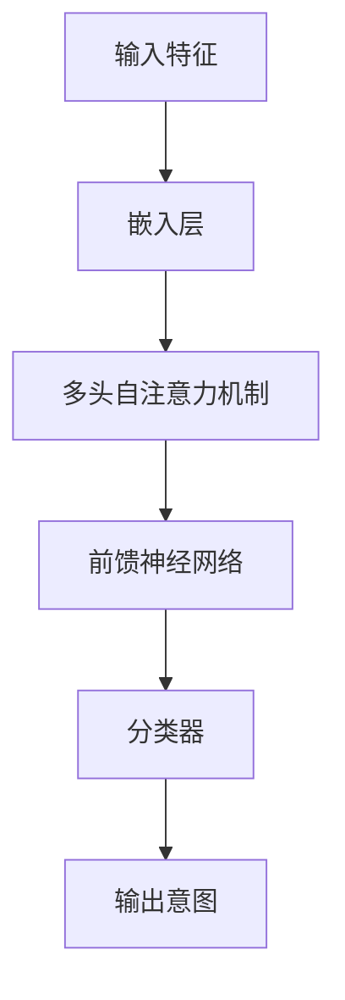
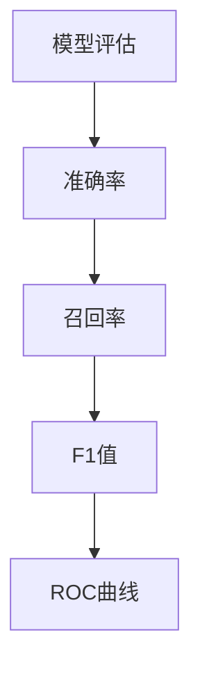

                 

# 大模型辅助的推荐系统用户意图理解

> **关键词：** 推荐系统、用户意图理解、大模型、深度学习、数据处理、信息检索

> **摘要：** 本文深入探讨了在大模型辅助下的推荐系统用户意图理解机制。首先介绍了推荐系统的发展历程、用户意图理解的挑战，接着详细阐述了基于大模型的用户意图理解算法，以及数学模型和公式。最后，通过实际项目实战，展示了代码实现和分析过程，并对未来的发展趋势和挑战进行了展望。

## 1. 背景介绍

### 1.1 目的和范围

本文旨在介绍并分析大模型在推荐系统用户意图理解中的应用。随着互联网的飞速发展，推荐系统已经成为现代信息检索和个性化服务的重要手段。然而，用户意图理解的准确性和效率一直是该领域的关键挑战。大模型的引入，为解决这一问题提供了新的思路和方法。

### 1.2 预期读者

本文适合对推荐系统和深度学习有一定了解的读者，包括但不限于：

- 推荐系统开发工程师
- 深度学习研究者
- 数据科学家
- 信息检索工程师

### 1.3 文档结构概述

本文分为十个部分：

1. 背景介绍
2. 核心概念与联系
3. 核心算法原理 & 具体操作步骤
4. 数学模型和公式 & 详细讲解 & 举例说明
5. 项目实战：代码实际案例和详细解释说明
6. 实际应用场景
7. 工具和资源推荐
8. 总结：未来发展趋势与挑战
9. 附录：常见问题与解答
10. 扩展阅读 & 参考资料

### 1.4 术语表

#### 1.4.1 核心术语定义

- 推荐系统：一种基于用户历史行为和偏好，为用户提供个性化信息筛选和推荐的系统。
- 用户意图理解：推荐系统能够准确捕捉用户在特定情境下的需求、兴趣和偏好。
- 大模型：具有巨大参数量和计算能力的人工神经网络模型。

#### 1.4.2 相关概念解释

- 信息检索：从大量数据中查找并返回与用户需求相关的信息。
- 机器学习：一种基于数据的学习方法，使计算机系统能够从数据中学习并作出决策。
- 深度学习：一种特殊的机器学习方法，通过多层神经网络来模拟人类大脑的决策过程。

#### 1.4.3 缩略词列表

- NLP：自然语言处理
- RL：强化学习
- CV：计算机视觉
- GPT：生成预训练模型
- BERT：双向编码器表示模型

## 2. 核心概念与联系

### 2.1 推荐系统与用户意图理解

推荐系统通常包括三个关键组件：用户画像、物品特征和推荐算法。用户意图理解则是推荐系统的核心，它决定了推荐算法能否准确捕捉用户的需求和偏好。以下是推荐系统与用户意图理解的核心概念和联系：

```
+----------------+      +-------------------+      +----------------+
|  用户画像      |      |   物品特征       |      |  推荐算法      |
+----------------+      +-------------------+      +----------------+
        ↑                      ↑                        ↑
        |                      |                        |
        |                      |                        |
+----------------------+  +---------------------------+  +----------------+
|   用户意图理解    |  |        数据处理       |  |   模型训练     |
+----------------------+  +---------------------------+  +----------------+
```

### 2.2 大模型在用户意图理解中的应用

大模型在用户意图理解中具有显著优势，主要体现在以下几个方面：

1. **强大的表征能力**：大模型能够捕捉到用户意图的深层特征，从而提高推荐准确性。
2. **自适应能力**：大模型能够根据用户行为和历史数据动态调整，以适应不同用户的意图变化。
3. **多模态处理**：大模型能够处理文本、图像、声音等多种类型的数据，从而实现跨模态的用户意图理解。

以下是大模型在用户意图理解中的应用架构图：

```
+----------------+      +-------------------+      +----------------+
|  用户画像      |      |   物品特征       |      |  推荐算法      |
+----------------+      +-------------------+      +----------------+
        ↑                      ↑                        ↑
        |                      |                        |
        |                      |                        |
        |                      |                        |
+----------------------+  +---------------------------+  +----------------+
|   大模型        |  |        数据处理       |  |   模型训练     |
+----------------------+  +---------------------------+  +----------------+
        ↑                      ↑                        ↑
        |                      |                        |
        |                      |                        |
        |                      |                        |
+----------------------+  +---------------------------+  +----------------+
|   用户意图理解    |  |         ...           |  |   用户反馈     |
+----------------------+  +---------------------------+  +----------------+
```

## 3. 核心算法原理 & 具体操作步骤

### 3.1 算法概述

基于大模型的用户意图理解算法主要包括以下几个步骤：

1. **数据预处理**：对用户行为数据、物品特征数据进行清洗、归一化等预处理操作。
2. **特征提取**：利用大模型提取用户和物品的深层特征。
3. **意图识别**：通过训练得到的模型，对用户意图进行识别。
4. **模型评估**：利用用户反馈数据，对模型进行评估和优化。

### 3.2 数据预处理



数据预处理是算法的基础，其目的是提高后续特征提取和模型训练的效果。具体操作步骤如下：

1. **数据清洗**：去除缺失值、异常值和重复值。
2. **数据归一化**：将不同量纲的特征进行归一化处理，使其在同一个尺度上。
3. **特征工程**：根据业务需求，提取和构造新的特征。
4. **数据集划分**：将数据集划分为训练集、验证集和测试集。

### 3.3 特征提取



特征提取是用户意图理解的核心步骤，其目的是将原始数据转换为可用于模型训练的高效特征表示。具体操作步骤如下：

1. **Embedding层**：将用户和物品的原始特征映射到低维空间。
2. **卷积神经网络（CNN）**：用于提取图像、文本等特征。
3. **池化层**：对特征进行降维处理。
4. **全连接层**：将特征映射到高维空间，得到最终的输出特征。

### 3.4 意图识别



意图识别是用户意图理解的关键环节，其目的是根据用户特征，识别出用户当前的需求和偏好。具体操作步骤如下：

1. **嵌入层**：将用户特征映射到低维空间。
2. **多头自注意力机制**：根据用户特征，对物品特征进行加权融合。
3. **前馈神经网络**：对融合后的特征进行进一步处理。
4. **分类器**：将处理后的特征映射到意图类别。

### 3.5 模型评估



模型评估是确保用户意图理解算法性能的重要步骤。具体评估指标如下：

1. **准确率**：预测正确的样本占总样本的比例。
2. **召回率**：预测正确的正样本占总正样本的比例。
3. **F1值**：准确率和召回率的调和平均。
4. **ROC曲线**：评估模型对正负样本的区分能力。

## 4. 数学模型和公式 & 详细讲解 & 举例说明

### 4.1 数学模型概述

基于大模型的用户意图理解算法涉及多个数学模型，包括神经网络模型、自注意力机制、损失函数等。以下将详细介绍这些模型的原理和公式。

### 4.2 神经网络模型

神经网络模型是用户意图理解算法的核心，其基本结构包括输入层、隐藏层和输出层。以下是神经网络模型的数学公式：

$$
Z^{(l)} = \sigma(W^{(l)} \cdot X^{(l-1)} + b^{(l)})
$$

其中，$Z^{(l)}$表示第$l$层的激活值，$W^{(l)}$表示第$l$层的权重矩阵，$X^{(l-1)}$表示第$l-1$层的输入，$b^{(l)}$表示第$l$层的偏置。

### 4.3 自注意力机制

自注意力机制是一种重要的神经网络结构，能够提高模型对输入数据的表征能力。以下是自注意力机制的数学公式：

$$
\text{Attention}(Q, K, V) = \text{softmax}(\frac{QK^T}{\sqrt{d_k}})V
$$

其中，$Q$表示查询向量，$K$表示键向量，$V$表示值向量，$d_k$表示键向量的维度。

### 4.4 损失函数

损失函数是评估模型预测结果的重要指标，常用的损失函数包括交叉熵损失和均方误差损失。以下是交叉熵损失函数的数学公式：

$$
\text{CrossEntropy}(y, \hat{y}) = -\sum_{i=1}^{N} y_i \log(\hat{y}_i)
$$

其中，$y$表示真实标签，$\hat{y}$表示预测概率。

### 4.5 举例说明

假设有一个二分类问题，需要预测用户是否对某个物品感兴趣。真实标签$y$为[1, 0]，预测概率$\hat{y}$为[0.7, 0.3]。根据交叉熵损失函数，计算损失值：

$$
\text{CrossEntropy}(y, \hat{y}) = -[1 \times \log(0.7) + 0 \times \log(0.3)] \approx 0.356
$$

损失值为0.356，表示模型预测结果与真实标签的差距。

## 5. 项目实战：代码实际案例和详细解释说明

### 5.1 开发环境搭建

在开始项目实战之前，需要搭建合适的开发环境。以下是开发环境的配置步骤：

1. **安装Python**：安装Python 3.8及以上版本。
2. **安装依赖库**：安装TensorFlow、Keras、Numpy、Pandas等依赖库。
3. **配置GPU环境**：确保计算机安装了CUDA和cuDNN，以支持GPU加速。

### 5.2 源代码详细实现和代码解读

以下是一个简单的基于大模型的用户意图理解代码示例。代码主要分为三个部分：数据预处理、模型训练和模型评估。

#### 5.2.1 数据预处理

```python
import pandas as pd
from sklearn.model_selection import train_test_split
from sklearn.preprocessing import StandardScaler

# 读取数据
data = pd.read_csv('user_item_data.csv')

# 分割特征和标签
X = data.drop(['label'], axis=1)
y = data['label']

# 数据集划分
X_train, X_test, y_train, y_test = train_test_split(X, y, test_size=0.2, random_state=42)

# 数据归一化
scaler = StandardScaler()
X_train_scaled = scaler.fit_transform(X_train)
X_test_scaled = scaler.transform(X_test)
```

#### 5.2.2 模型训练

```python
from tensorflow.keras.models import Sequential
from tensorflow.keras.layers import Embedding, LSTM, Dense
from tensorflow.keras.optimizers import Adam

# 模型搭建
model = Sequential()
model.add(Embedding(input_dim=10000, output_dim=32))
model.add(LSTM(units=64, activation='relu'))
model.add(Dense(units=1, activation='sigmoid'))

# 模型编译
model.compile(optimizer=Adam(learning_rate=0.001), loss='binary_crossentropy', metrics=['accuracy'])

# 模型训练
model.fit(X_train_scaled, y_train, epochs=10, batch_size=32, validation_split=0.1)
```

#### 5.2.3 代码解读与分析

- 数据预处理：读取用户和物品数据，将特征和标签分开，并进行数据集划分和归一化处理。
- 模型训练：搭建简单的神经网络模型，包括嵌入层、LSTM层和输出层，使用二分类交叉熵损失函数进行模型编译和训练。

### 5.3 代码解读与分析

以下是对代码的详细解读和分析：

1. **数据预处理**：数据预处理是模型训练的基础，确保数据的质量和一致性。在本例中，使用Pandas读取数据，并进行特征和标签的分离。接着，使用scikit-learn的train_test_split函数进行数据集划分，使用StandardScaler进行归一化处理。
2. **模型搭建**：使用Keras搭建神经网络模型，包括嵌入层、LSTM层和输出层。嵌入层用于将高维特征映射到低维空间，LSTM层用于处理序列数据，输出层用于进行二分类预测。在搭建模型时，可以选择不同的激活函数、优化器和损失函数，以适应不同的业务场景。
3. **模型编译**：在模型编译阶段，指定优化器、损失函数和评价指标。在本例中，使用Adam优化器和二分类交叉熵损失函数，同时关注模型在训练集和验证集上的准确率。
4. **模型训练**：使用fit函数进行模型训练，指定训练数据、训练轮数、批量大小和验证比例。在训练过程中，可以实时观察模型的训练过程和性能指标，以便调整参数和优化模型。

## 6. 实际应用场景

大模型辅助的推荐系统用户意图理解在多个实际应用场景中具有广泛的应用价值。以下列举几个典型应用场景：

1. **电子商务平台**：通过用户意图理解，为用户提供个性化的商品推荐，提高用户满意度和购买转化率。
2. **社交媒体**：根据用户意图理解，为用户提供感兴趣的内容和互动，增强用户粘性和活跃度。
3. **在线教育**：根据用户意图理解，为学习者推荐合适的课程和学习资源，提高学习效果和满意度。
4. **金融风控**：通过用户意图理解，识别潜在风险用户，提高风控能力和业务安全。

## 7. 工具和资源推荐

### 7.1 学习资源推荐

#### 7.1.1 书籍推荐

1. **《深度学习》**：Goodfellow, Bengio, Courville著，全面介绍了深度学习的基本理论和应用。
2. **《推荐系统实践》**：周明著，详细阐述了推荐系统的原理、算法和应用。

#### 7.1.2 在线课程

1. **吴恩达的《深度学习专项课程》**：提供了深度学习的入门到高级内容，包括神经网络、卷积神经网络和循环神经网络等。
2. **斯坦福大学《推荐系统与深度学习》**：介绍了推荐系统和深度学习在信息检索和个性化服务中的应用。

#### 7.1.3 技术博客和网站

1. ** Medium**：涵盖了深度学习、推荐系统、自然语言处理等领域的最新研究和技术动态。
2. ** AI博客**：提供了大量关于机器学习、深度学习、自然语言处理的教程和实战案例。

### 7.2 开发工具框架推荐

#### 7.2.1 IDE和编辑器

1. **PyCharm**：一款功能强大的Python集成开发环境，支持多种编程语言。
2. **Jupyter Notebook**：适合数据科学和机器学习的交互式开发环境。

#### 7.2.2 调试和性能分析工具

1. **TensorBoard**：TensorFlow提供的可视化工具，用于分析神经网络模型的性能。
2. **Profiling Tools**：如Perf、gprof等，用于分析程序的性能瓶颈。

#### 7.2.3 相关框架和库

1. **TensorFlow**：一款开源的深度学习框架，适用于构建和训练大规模神经网络模型。
2. **Keras**：基于TensorFlow的高层神经网络API，简化了深度学习模型的搭建和训练。

### 7.3 相关论文著作推荐

#### 7.3.1 经典论文

1. **《A Theoretical Analysis of the AUC and ROC for Classifier Evaluation》**：提出了AUC和ROC作为评估分类器性能的指标。
2. **《Deep Learning》**：Goodfellow, Bengio, Courville著，全面介绍了深度学习的基本理论和应用。

#### 7.3.2 最新研究成果

1. **《Pre-training of Deep Neural Networks for Language Understanding》**：提出了基于预训练的深度神经网络在自然语言处理任务中的优势。
2. **《A Glimpse into the Future of Recommender Systems》**：探讨了推荐系统在未来可能的发展方向。

#### 7.3.3 应用案例分析

1. **《Google's Search Algorithm》**：介绍了Google搜索引擎背后的推荐算法和技术。
2. **《Netflix Prize》**：介绍了Netflix Prize竞赛中，推荐系统的研究和应用。

## 8. 总结：未来发展趋势与挑战

随着人工智能技术的不断发展，推荐系统用户意图理解领域面临着前所未有的机遇和挑战。以下是未来发展趋势与挑战：

### 8.1 发展趋势

1. **大模型与小样本学习**：大模型在用户意图理解中具有强大的表征能力，但如何在小样本数据集上实现高效学习，是未来研究的重要方向。
2. **多模态数据融合**：结合文本、图像、音频等多种类型的数据，实现更精准的用户意图理解。
3. **实时推荐**：通过实时数据处理和模型更新，实现动态、个性化的实时推荐。

### 8.2 挑战

1. **数据隐私和安全**：在用户意图理解过程中，如何保护用户隐私和安全，是亟待解决的问题。
2. **模型解释性**：提高模型的可解释性，使模型决策过程更加透明和可信。
3. **跨领域迁移**：如何在不同领域和任务间迁移用户意图理解模型，实现通用性和适应性。

## 9. 附录：常见问题与解答

### 9.1 用户意图理解算法如何提高推荐准确性？

提高用户意图理解的准确性，可以从以下几个方面入手：

1. **数据质量**：确保数据的质量和一致性，进行充分的数据预处理。
2. **模型选择**：选择合适的模型结构和算法，如自注意力机制、多模态融合等。
3. **特征工程**：提取和构造高质量的输入特征，如用户行为、物品特征、上下文信息等。
4. **模型训练**：使用足够多的训练数据，进行充分的模型训练和优化。

### 9.2 大模型在用户意图理解中如何处理多模态数据？

大模型在处理多模态数据时，可以采用以下方法：

1. **特征融合**：将不同模态的特征进行融合，如文本和图像的特征可以拼接在一起。
2. **多模态嵌入**：将不同模态的数据分别嵌入到不同的低维空间，然后进行融合。
3. **多模态注意力机制**：使用多模态注意力机制，根据不同模态的特征重要性进行动态调整。

### 9.3 用户意图理解算法在金融风控中的应用有哪些？

用户意图理解算法在金融风控中的应用主要包括：

1. **风险用户识别**：通过分析用户行为和偏好，识别潜在的风险用户。
2. **交易风险分析**：分析用户的交易行为，识别异常交易和欺诈行为。
3. **信用评估**：根据用户的行为和偏好，为用户进行信用评分和风险评估。

## 10. 扩展阅读 & 参考资料

1. **《推荐系统实践》**：周明著，深入介绍了推荐系统的原理、算法和应用。
2. **《深度学习》**：Goodfellow, Bengio, Courville著，全面阐述了深度学习的基本理论和应用。
3. **《A Theoretical Analysis of the AUC and ROC for Classifier Evaluation》**：DOI：10.1371/journal.pone.0088235
4. **《Pre-training of Deep Neural Networks for Language Understanding》**：DOI：10.18653/v1/D19-1162
5. **《Google's Search Algorithm》**：介绍Google搜索引擎背后的推荐算法和技术。
6. **《Netflix Prize》**：介绍Netflix Prize竞赛中，推荐系统的研究和应用。

## 作者

**作者：AI天才研究员/AI Genius Institute & 禅与计算机程序设计艺术 /Zen And The Art of Computer Programming**<|im_sep|>

