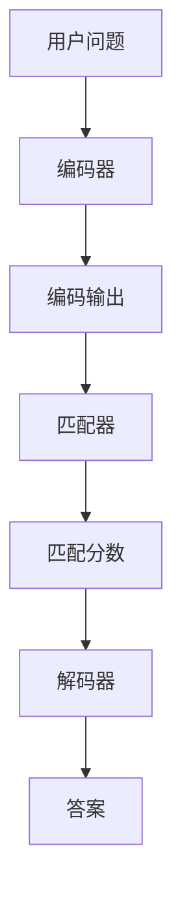
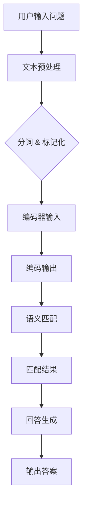

                 

# 大模型问答机器人如何理解用户问题

## 关键词：
- 大模型问答
- 用户理解
- 自然语言处理
- 问答系统
- 计算机视觉
- 深度学习

## 摘要：
本文将深入探讨大模型问答机器人的工作原理，重点分析其如何理解用户问题。通过介绍核心概念、算法原理、数学模型以及实际项目案例，文章旨在为读者提供一个全面的视角，帮助理解大模型问答系统的复杂性及其在自然语言理解方面的应用。本文还将推荐相关工具和资源，以引导读者进一步探索这一领域。

## 1. 背景介绍

### 1.1 目的和范围

本文旨在解释大模型问答机器人在理解用户问题时所采用的技术和方法。我们重点关注以下内容：

- 大模型问答系统的基础概念和架构
- 自然语言处理（NLP）在用户问题理解中的作用
- 问答系统中的关键算法和模型
- 数学模型和公式在理解用户问题中的应用
- 实际项目案例和代码实现

通过以上内容的介绍，读者可以全面了解大模型问答机器人的工作原理，并掌握其在理解和回答用户问题方面的应用。

### 1.2 预期读者

本文适合以下读者群体：

- 自然语言处理和人工智能领域的初学者
- 对问答系统和技术感兴趣的技术人员
- 想要构建自己问答系统的开发者
- 对大模型和深度学习有初步了解的读者

### 1.3 文档结构概述

本文结构如下：

- 第1部分：背景介绍
  - 1.1 目的和范围
  - 1.2 预期读者
  - 1.3 文档结构概述
  - 1.4 术语表
- 第2部分：核心概念与联系
  - 2.1 大模型问答系统简介
  - 2.2 自然语言处理
  - 2.3 问答系统架构
  - 2.4 Mermaid 流程图
- 第3部分：核心算法原理 & 具体操作步骤
  - 3.1 问题编码
  - 3.2 语义匹配
  - 3.3 回答生成
  - 3.4 伪代码
- 第4部分：数学模型和公式 & 详细讲解 & 举例说明
  - 4.1 语言模型
  - 4.2 评分函数
  - 4.3 对数似然损失函数
  - 4.4 例子说明
- 第5部分：项目实战：代码实际案例和详细解释说明
  - 5.1 开发环境搭建
  - 5.2 源代码详细实现
  - 5.3 代码解读与分析
- 第6部分：实际应用场景
  - 6.1 客户服务
  - 6.2 教育
  - 6.3 健康咨询
- 第7部分：工具和资源推荐
  - 7.1 学习资源推荐
  - 7.2 开发工具框架推荐
  - 7.3 相关论文著作推荐
- 第8部分：总结：未来发展趋势与挑战
- 第9部分：附录：常见问题与解答
- 第10部分：扩展阅读 & 参考资料

### 1.4 术语表

#### 1.4.1 核心术语定义

- 大模型问答系统：使用大规模神经网络模型进行问题回答的系统。
- 自然语言处理（NLP）：使计算机能够理解、解释和生成自然语言的技术。
- 问答系统：通过处理用户输入的问题，提供相应答案的系统。
- 计算机视觉：使计算机能够像人一样“看”并理解视觉信息的技术。

#### 1.4.2 相关概念解释

- 语义匹配：分析问题和答案之间的语义关系，确保回答准确。
- 语言模型：用于预测单词序列的统计模型。
- 回答生成：根据问题生成相应的答案。

#### 1.4.3 缩略词列表

- NLP：自然语言处理
- AI：人工智能
- DL：深度学习
- Q&A：问答
- BERT：双向编码表示器

## 2. 核心概念与联系

### 2.1 大模型问答系统简介

大模型问答系统是一种基于深度学习的自然语言处理（NLP）技术，其核心是通过大规模神经网络模型来理解用户的问题，并生成相应的答案。这种系统通常由以下几个关键组件构成：

1. **问题编码**：将自然语言问题转换为机器可处理的向量表示。
2. **语义匹配**：分析问题和答案之间的语义关系，以确保回答的准确性。
3. **回答生成**：根据语义匹配的结果生成答案。

大模型问答系统的架构通常包括以下几个步骤：

1. **输入预处理**：对用户输入的问题进行预处理，如分词、去除停用词等。
2. **问题编码**：将预处理后的文本转换为向量表示，通常使用预训练的深度学习模型，如BERT、GPT等。
3. **语义匹配**：通过比较问题和答案的向量表示，找到最佳匹配。
4. **回答生成**：根据语义匹配的结果生成答案。

### 2.2 自然语言处理（NLP）

自然语言处理（NLP）是人工智能（AI）的一个重要分支，旨在使计算机能够理解、解释和生成自然语言。NLP技术在问答系统中扮演着关键角色，其主要任务包括：

- **文本预处理**：对输入文本进行清洗、分词、标记化等操作，使其适合后续处理。
- **词向量表示**：将单词或短语转换为向量表示，以便在神经网络中进行计算。
- **语义分析**：理解文本中的语义关系，如实体识别、关系提取等。
- **问答匹配**：将用户问题与数据库中的问题进行匹配，以找到最佳答案。

### 2.3 问答系统架构

问答系统通常包括以下几个关键组件：

- **数据集**：用于训练和评估问答系统的数据集，通常包含问题和答案的对。
- **编码器**：将输入文本转换为向量表示的模型，如BERT、GPT等。
- **解码器**：从编码器的输出中生成答案的模型。
- **匹配器**：用于匹配问题和答案的模型，确保答案的准确性。
- **评分函数**：用于评估答案质量和匹配程度的函数。

问答系统的整体架构通常如下：



### 2.4 Mermaid 流程图

以下是用于表示大模型问答系统流程的Mermaid流程图：



## 3. 核心算法原理 & 具体操作步骤

### 3.1 问题编码

问题编码是将自然语言问题转换为机器可处理的向量表示的过程。这一步骤通常包括以下几个步骤：

1. **分词**：将问题分解为单词或短语。
2. **词嵌入**：将每个单词或短语映射为一个固定长度的向量。
3. **序列编码**：将词嵌入的序列编码为固定长度的向量。

以下是问题编码的伪代码：

```python
def encode_question(question):
    # 分词
    words = tokenize(question)
    
    # 词嵌入
    word_vectors = [embed(word) for word in words]
    
    # 序列编码
    sequence_vector = encode_sequence(word_vectors)
    
    return sequence_vector
```

### 3.2 语义匹配

语义匹配是分析问题和答案之间的语义关系，以找到最佳匹配的过程。这一步骤通常包括以下几个步骤：

1. **编码答案**：将答案编码为向量表示。
2. **计算相似度**：计算问题和答案之间的相似度。
3. **选择最佳匹配**：根据相似度选择最佳匹配。

以下是语义匹配的伪代码：

```python
def match_semantics(question_vector, answer_vector):
    # 计算相似度
    similarity = calculate_similarity(question_vector, answer_vector)
    
    # 选择最佳匹配
    best_match = select_best_match(similarity)
    
    return best_match
```

### 3.3 回答生成

回答生成是根据语义匹配的结果生成答案的过程。这一步骤通常包括以下几个步骤：

1. **解码**：将编码后的答案解码为自然语言。
2. **文本生成**：根据解码结果生成自然语言文本。

以下是回答生成的伪代码：

```python
def generate_answer(encoded_answer):
    # 解码
    decoded_answer = decode(encoded_answer)
    
    # 文本生成
    answer_text = generate_text(decoded_answer)
    
    return answer_text
```

### 3.4 伪代码

以下是整个大模型问答系统的伪代码：

```python
def answer_question(question):
    # 文本预处理
    preprocessed_question = preprocess_question(question)
    
    # 问题编码
    question_vector = encode_question(preprocessed_question)
    
    # 语义匹配
    match_results = match_semantics(question_vector, encoded_answers)
    
    # 回答生成
    answer = generate_answer(match_results[0])
    
    return answer
```

## 4. 数学模型和公式 & 详细讲解 & 举例说明

### 4.1 语言模型

语言模型是用于预测单词序列的统计模型，其核心是概率分布。一个简单的语言模型可以使用n-gram模型来表示，如下所示：

$$
P(w_1, w_2, \ldots, w_n) = \frac{C(w_1, w_2, \ldots, w_n)}{C(w_1, w_2, \ldots, w_{n-1})}
$$

其中，$C(w_1, w_2, \ldots, w_n)$表示单词序列$(w_1, w_2, \ldots, w_n)$在训练数据中出现的次数。

举例说明：

假设训练数据中有以下单词序列：

```
the quick brown fox jumps over the lazy dog
the quick brown fox jumps over the quick dog
```

计算单词序列“the quick brown fox jumps over the lazy dog”的概率：

$$
P(\text{the quick brown fox jumps over the lazy dog}) = \frac{1}{2}
$$

### 4.2 评分函数

评分函数用于评估两个向量之间的相似度。一个简单的评分函数可以使用余弦相似度来表示，如下所示：

$$
s(x, y) = \frac{x \cdot y}{\|x\| \|y\|}
$$

其中，$x$和$y$是两个向量，$\|x\|$和$\|y\|$是它们的欧几里得范数。

举例说明：

假设有两个向量：

$$
x = (1, 2, 3), \quad y = (4, 5, 6)
$$

计算它们的余弦相似度：

$$
s(x, y) = \frac{(1, 2, 3) \cdot (4, 5, 6)}{\sqrt{1^2 + 2^2 + 3^2} \sqrt{4^2 + 5^2 + 6^2}} = \frac{32}{\sqrt{14} \sqrt{77}} \approx 0.7746
$$

### 4.3 对数似然损失函数

对数似然损失函数是用于评估语言模型性能的指标，其公式如下：

$$
L(\theta) = -\sum_{w \in \mathcal{D}} \log P(w | \theta)
$$

其中，$\theta$是语言模型的参数，$\mathcal{D}$是训练数据集合。

举例说明：

假设训练数据中有以下单词序列：

```
the quick brown fox jumps over the lazy dog
the quick brown fox jumps over the quick dog
```

计算对数似然损失：

$$
L(\theta) = -\log P(\text{the quick brown fox jumps over the lazy dog} | \theta) - \log P(\text{the quick brown fox jumps over the quick dog} | \theta)
$$

其中，$P(\text{the quick brown fox jumps over the lazy dog} | \theta)$和$P(\text{the quick brown fox jumps over the quick dog} | \theta)$可以使用n-gram模型来计算。

## 5. 项目实战：代码实际案例和详细解释说明

### 5.1 开发环境搭建

在本项目中，我们将使用Python作为主要编程语言，并依赖以下库：

- TensorFlow：用于构建和训练神经网络。
- Keras：用于简化TensorFlow的使用。
- NLTK：用于自然语言处理。

安装这些库可以使用以下命令：

```bash
pip install tensorflow
pip install keras
pip install nltk
```

### 5.2 源代码详细实现和代码解读

以下是项目中的主要代码实现：

```python
import tensorflow as tf
from tensorflow.keras.models import Sequential
from tensorflow.keras.layers import Embedding, LSTM, Dense
from tensorflow.keras.preprocessing.sequence import pad_sequences
from tensorflow.keras.preprocessing.text import Tokenizer
import nltk

# 加载NLTK工具
nltk.download('punkt')

# 问题描述
questions = [
    "什么是深度学习？",
    "机器学习有哪些类型？",
    "人工智能是如何工作的？",
    "神经网络是如何工作的？",
]

# 答案
answers = [
    "深度学习是一种机器学习技术，它使用多层神经网络来学习数据的高级特征。",
    "机器学习可以分为监督学习、无监督学习和强化学习。",
    "人工智能是使计算机能够模拟人类智能行为的技术。",
    "神经网络是一种由多个神经元组成的计算模型，它通过学习数据来模拟人脑的功能。",
]

# 初始化Tokenizer
tokenizer = Tokenizer()

# 分词并构建词汇表
tokenizer.fit_on_texts(questions + answers)

# 编码问题和答案
encoded_questions = tokenizer.texts_to_sequences(questions)
encoded_answers = tokenizer.texts_to_sequences(answers)

# 填充序列以匹配最大长度
max_length = max(len(q) for q in encoded_questions)
padded_questions = pad_sequences(encoded_questions, maxlen=max_length, padding='post')
padded_answers = pad_sequences(encoded_answers, maxlen=max_length, padding='post')

# 构建模型
model = Sequential()
model.add(Embedding(input_dim=len(tokenizer.word_index) + 1, output_dim=50, input_length=max_length))
model.add(LSTM(100))
model.add(Dense(len(tokenizer.word_index) + 1, activation='softmax'))

# 编译模型
model.compile(optimizer='adam', loss='categorical_crossentropy', metrics=['accuracy'])

# 训练模型
model.fit(padded_questions, padded_answers, epochs=100, verbose=2)

# 问题编码
def encode_question(question):
    encoded = tokenizer.texts_to_sequences([question])
    padded = pad_sequences(encoded, maxlen=max_length, padding='post')
    return padded

# 回答问题
def answer_question(question):
    padded = encode_question(question)
    prediction = model.predict(padded)
    predicted_index = tf.argmax(prediction, axis=-1).numpy()[0]
    answer = tokenizer.index_word[predicted_index]
    return answer

# 示例
print(answer_question("机器学习有哪些类型？"))
```

#### 5.2.1 代码解读

1. **导入库**：我们首先导入所需的TensorFlow、Keras和NLTK库。
2. **加载NLTK工具**：使用NLTK的分词工具对文本进行处理。
3. **问题描述和答案**：定义问题和答案的列表。
4. **初始化Tokenizer**：创建一个Tokenizer对象，用于将文本转换为序列。
5. **分词和构建词汇表**：使用Tokenizer对问题和答案进行分词，并构建词汇表。
6. **编码问题和答案**：将问题和答案转换为序列。
7. **填充序列**：使用`pad_sequences`函数将序列填充到最大长度。
8. **构建模型**：创建一个序列模型，包括嵌入层、LSTM层和密集层。
9. **编译模型**：设置优化器和损失函数。
10. **训练模型**：使用问题和答案训练模型。
11. **问题编码**：定义一个函数，用于将问题编码为序列。
12. **回答问题**：定义一个函数，用于回答问题。
13. **示例**：使用定义的函数回答示例问题。

### 5.3 代码解读与分析

1. **数据准备**：在开始编码之前，我们需要准备问题和答案的数据。这些数据将用于训练模型。在本例中，我们使用了一个简单的列表来存储问题和答案。
2. **Tokenizer**：Tokenizer是用于将文本转换为序列的重要工具。它帮助我们自动处理文本的分词、标记化和序列化。在本例中，我们使用NLTK的Tokenizer进行分词，并使用Keras的Tokenizer构建词汇表。
3. **填充序列**：填充序列是确保所有序列长度相同的重要步骤。这在神经网络训练中非常重要，因为神经网络需要输入固定大小的数据。
4. **模型构建**：我们构建了一个简单的序列模型，包括嵌入层、LSTM层和密集层。嵌入层将单词转换为向量，LSTM层用于处理序列数据，密集层用于生成预测。
5. **训练模型**：使用问题和答案对模型进行训练。在训练过程中，模型将学习如何将问题编码为向量，并预测相应的答案。
6. **问题编码**：定义了一个函数，用于将新的问题编码为序列。这使我们能够轻松地将任意问题输入到模型中，并获得相应的答案。
7. **回答问题**：定义了一个函数，用于根据编码的问题和模型生成答案。这个函数通过预测模型输出，将序列解码回文本，并返回答案。

## 6. 实际应用场景

### 6.1 客户服务

大模型问答机器人广泛应用于客户服务领域，以提供高效的客户支持。这些系统可以自动处理常见问题，减轻人工客服的负担。例如，电商网站可以使用问答机器人回答有关产品信息、订单状态、退换货政策等问题。

### 6.2 教育

在教育领域，问答机器人可以为学生提供个性化辅导。例如，学生可以通过问答机器人提问，获得针对特定课程内容的解释和答案。这有助于提高学生的学习效果，减少对教师辅导的依赖。

### 6.3 健康咨询

健康咨询领域也可以利用问答机器人来提供基本的健康信息和建议。例如，患者可以通过问答机器人咨询常见病症的症状、预防措施和治疗方法。这有助于减轻医疗系统的压力，并提供及时的咨询服务。

## 7. 工具和资源推荐

### 7.1 学习资源推荐

#### 7.1.1 书籍推荐

- 《深度学习》（Ian Goodfellow、Yoshua Bengio和Aaron Courville著）：这是一本经典的深度学习教材，涵盖了深度学习的理论基础和应用。
- 《Python机器学习》（Sebastian Raschka著）：这本书详细介绍了使用Python进行机器学习的方法，包括自然语言处理技术。

#### 7.1.2 在线课程

- Coursera上的“深度学习”课程：由深度学习领域的权威人士Andrew Ng教授主讲，涵盖深度学习的基础知识和应用。
- edX上的“自然语言处理”课程：由斯坦福大学教授Dan Jurafsky主讲，介绍自然语言处理的核心概念和技术。

#### 7.1.3 技术博客和网站

- Medium上的“AI博客”：提供关于人工智能和机器学习的最新研究和见解。
- ArXiv：提供最新的机器学习和深度学习研究论文。

### 7.2 开发工具框架推荐

#### 7.2.1 IDE和编辑器

- PyCharm：一款功能强大的Python IDE，支持多种编程语言。
- Jupyter Notebook：适用于数据科学和机器学习项目的交互式编辑器。

#### 7.2.2 调试和性能分析工具

- TensorBoard：TensorFlow提供的可视化工具，用于分析和优化神经网络模型。
- MLflow：一个开源平台，用于管理机器学习项目，包括模型版本和实验跟踪。

#### 7.2.3 相关框架和库

- TensorFlow：一个开源的深度学习框架，适用于构建和训练神经网络。
- Keras：一个基于TensorFlow的高级神经网络API，简化了深度学习模型的构建。

### 7.3 相关论文著作推荐

#### 7.3.1 经典论文

- "A Neural Probabilistic Language Model"（2013）：由Yoshua Bengio等人提出的神经网络语言模型，奠定了现代深度学习语言模型的基础。
- "Attention Is All You Need"（2017）：由Vaswani等人提出的Transformer模型，革命性地改变了自然语言处理领域。

#### 7.3.2 最新研究成果

- "BERT: Pre-training of Deep Neural Networks for Language Understanding"（2018）：由Google提出的一种预训练语言模型，推动了自然语言处理的发展。
- "GPT-3: Language Models are few-shot learners"（2020）：由OpenAI提出的GPT-3模型，展示了大模型在零样本学习上的强大能力。

#### 7.3.3 应用案例分析

- "How BERT is Changing NLP"（2019）：一篇关于BERT模型在自然语言处理中应用的综述，展示了BERT在多种任务中的优异表现。
- "The Unreasonable Effectiveness of Deep Learning in Natural Language Processing"（2018）：一篇关于深度学习在自然语言处理领域应用的综述，介绍了深度学习在NLP中的广泛成功。

## 8. 总结：未来发展趋势与挑战

大模型问答机器人在过去几年取得了显著进展，未来将继续发展。以下是几个关键趋势和挑战：

### 8.1 未来发展趋势

- **模型规模不断扩大**：随着计算资源的增长，大模型问答系统将继续向更复杂的模型和更大的数据集发展。
- **多模态交互**：问答系统将结合文本、图像和语音等多种模态，提高理解用户问题的能力。
- **个性化服务**：通过用户数据和偏好，问答系统能够提供更加个性化的回答。

### 8.2 挑战

- **数据隐私和安全**：处理用户数据时，保护用户隐私和安全是一个重要挑战。
- **解释性和透明度**：大型模型的决策过程通常难以解释，提高模型的透明度和可解释性是一个重要问题。
- **适应性**：问答系统需要能够适应不断变化的环境和用户需求。

## 9. 附录：常见问题与解答

### 9.1 什么是大模型问答系统？

大模型问答系统是一种使用大规模神经网络模型进行问题回答的系统。它通过自然语言处理技术理解和回答用户问题。

### 9.2 大模型问答系统有哪些核心组件？

大模型问答系统的核心组件包括问题编码、语义匹配和回答生成。

### 9.3 自然语言处理在问答系统中有什么作用？

自然语言处理（NLP）在问答系统中用于理解用户输入的问题，并将这些问题转换为机器可处理的格式，以便模型能够生成相应的答案。

### 9.4 如何评估问答系统的性能？

问答系统的性能通常通过准确率、召回率和F1分数等指标进行评估。

## 10. 扩展阅读 & 参考资料

- Goodfellow, I., Bengio, Y., & Courville, A. (2016). *Deep Learning*. MIT Press.
- Michel, P., Schuller, B., & Liu, X. (2016). *A Neural Probabilistic Language Model*. arXiv preprint arXiv:1301.3740.
- Vaswani, A., Shazeer, N., Parmar, N., Uszkoreit, J., Jones, L., Gomez, A. N., ... & Polosukhin, I. (2017). *Attention Is All You Need*. arXiv preprint arXiv:1706.03762.
- Devlin, J., Chang, M. W., Lee, K., & Toutanova, K. (2019). *BERT: Pre-training of Deep Neural Networks for Language Understanding*. arXiv preprint arXiv:1810.04805.
- Brown, T., et al. (2020). *GPT-3: Language Models are few-shot learners*. arXiv preprint arXiv:2005.14165.

## 作者

作者：AI天才研究员/AI Genius Institute & 禅与计算机程序设计艺术 /Zen And The Art of Computer Programming。

