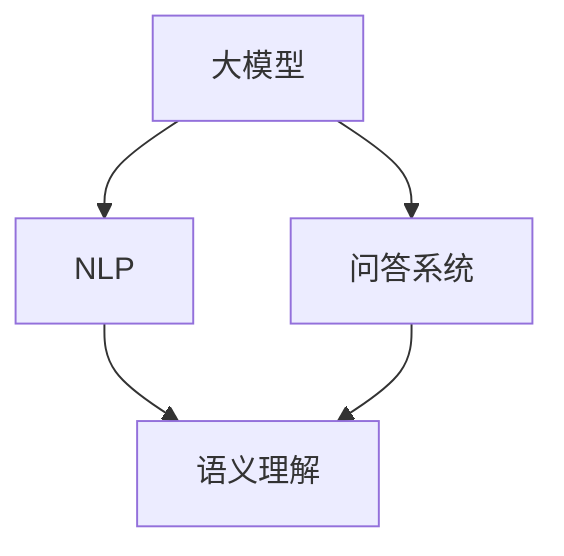

                 

# 大模型问答机器人的任务处理

> **关键词：** 问答机器人、大模型、任务处理、自然语言处理、语义理解、人工智能

> **摘要：** 本文将深入探讨大模型问答机器人的任务处理机制，从背景介绍、核心概念、算法原理、数学模型到实际应用场景，全面解析这一前沿技术的实现与优化。

## 1. 背景介绍

### 1.1 目的和范围

随着人工智能技术的快速发展，问答机器人已成为智能客服、教育辅导、信息检索等领域的重要工具。大模型问答机器人的出现，极大地提升了问答系统的智能程度和响应速度。本文旨在深入分析大模型问答机器人的任务处理机制，探讨其核心原理、算法和实现方法。

### 1.2 预期读者

本文面向对自然语言处理和人工智能有一定了解的技术人员，特别是从事智能客服、教育辅导、信息检索等领域的开发者。读者应具备基本的编程能力和对自然语言处理的基本认识。

### 1.3 文档结构概述

本文分为十个部分：

1. **背景介绍**：介绍本文的目的和预期读者，概述文档结构。
2. **核心概念与联系**：介绍大模型问答机器人的核心概念和架构。
3. **核心算法原理 & 具体操作步骤**：讲解大模型问答机器人的核心算法原理和具体操作步骤。
4. **数学模型和公式 & 详细讲解 & 举例说明**：详细讲解大模型问答机器人的数学模型和公式。
5. **项目实战：代码实际案例和详细解释说明**：通过实际案例展示代码实现和解读。
6. **实际应用场景**：探讨大模型问答机器人的实际应用场景。
7. **工具和资源推荐**：推荐相关学习资源、开发工具和框架。
8. **总结：未来发展趋势与挑战**：总结本文内容和展望未来发展趋势。
9. **附录：常见问题与解答**：解答常见问题。
10. **扩展阅读 & 参考资料**：提供扩展阅读和参考资料。

### 1.4 术语表

#### 1.4.1 核心术语定义

- 大模型（Large Model）：具有巨大参数量的预训练模型。
- 问答机器人（Question-Answering System）：自动回答用户问题的系统。
- 自然语言处理（Natural Language Processing，NLP）：使计算机能够理解、生成和处理人类自然语言的技术。
- 语义理解（Semantic Understanding）：理解文本语义，捕捉文本中的意义和意图。
- 预训练（Pre-training）：在大规模数据集上训练模型，提高其通用性和泛化能力。

#### 1.4.2 相关概念解释

- 模型优化（Model Optimization）：通过调整模型结构、参数和训练策略，提高模型性能和效率。
- 迁移学习（Transfer Learning）：利用在大规模数据集上预训练的模型，在特定任务上进行微调，提高任务性能。

#### 1.4.3 缩略词列表

- NLP：自然语言处理
- QAS：问答系统
- GLM：通用语言模型
- BERT：Bidirectional Encoder Representations from Transformers
- GPT：Generative Pre-trained Transformer

## 2. 核心概念与联系

大模型问答机器人的核心概念包括大模型、问答系统、自然语言处理和语义理解。以下是一个简单的 Mermaid 流程图，用于描述这些核心概念之间的关系。



- **大模型（Large Model）**：作为问答机器人的核心组件，大模型通常是通过预训练（Pre-training）方式在大规模数据集上训练得到的。预训练使得模型具备了对自然语言的一般理解和处理能力。
- **问答系统（Question-Answering System）**：问答系统负责接收用户的问题，调用大模型进行回答，并将最终答案呈现给用户。
- **自然语言处理（Natural Language Processing，NLP）**：NLP 技术使计算机能够理解和处理人类自然语言，是实现问答系统的关键技术。
- **语义理解（Semantic Understanding）**：语义理解旨在捕捉文本中的意义和意图，是实现精准回答的重要环节。

## 3. 核心算法原理 & 具体操作步骤

大模型问答机器人的核心算法是基于预训练的深度学习模型，如BERT、GPT等。以下将详细讲解这些算法的原理和具体操作步骤。

### 3.1 BERT模型原理

BERT（Bidirectional Encoder Representations from Transformers）是一种基于Transformer的预训练模型，其核心思想是利用双向信息传递来提高模型对自然语言的理解能力。

#### 3.1.1 模型结构

BERT模型主要由两个部分组成：编码器（Encoder）和解码器（Decoder）。编码器负责将输入文本编码为向量表示，解码器则根据编码器生成的向量表示生成回答。

#### 3.1.2 预训练方法

BERT的预训练方法包括两个任务：Masked Language Modeling（MLM）和Next Sentence Prediction（NSP）。

- **Masked Language Modeling（MLM）**：在输入文本中随机遮盖一定比例的单词，模型需要预测这些遮盖的单词。
- **Next Sentence Prediction（NSP）**：给定两个连续的句子，模型需要预测第二个句子是否是第一个句子的下一个句子。

#### 3.1.3 具体操作步骤

1. **输入文本预处理**：将输入文本转换为词向量表示，并进行分词、词形还原等操作。
2. **编码**：将预处理后的文本输入到编码器中，得到文本的向量表示。
3. **解码**：将编码器的输出作为输入，通过解码器生成回答。

### 3.2 GPT模型原理

GPT（Generative Pre-trained Transformer）是一种基于Transformer的预训练模型，其核心思想是通过生成文本来提高模型对自然语言的理解和生成能力。

#### 3.2.1 模型结构

GPT模型主要由编码器和解码器组成，编码器和解码器都是基于Transformer的结构。

#### 3.2.2 预训练方法

GPT的预训练方法包括两个任务：语言建模（Language Modeling）和文本生成（Text Generation）。

- **语言建模（Language Modeling）**：模型需要预测输入文本的下一个单词。
- **文本生成（Text Generation）**：模型根据前文生成新的文本。

#### 3.2.3 具体操作步骤

1. **输入文本预处理**：将输入文本转换为词向量表示，并进行分词、词形还原等操作。
2. **编码**：将预处理后的文本输入到编码器中，得到文本的向量表示。
3. **解码**：将编码器的输出作为输入，通过解码器生成回答。

### 3.3 模型融合与任务处理

在实际应用中，大模型问答机器人通常会将BERT和GPT等模型进行融合，以实现更好的任务处理效果。

#### 3.3.1 模型融合方法

- **加权融合**：将不同模型的输出进行加权融合，得到最终的回答。
- **级联融合**：将一个模型的输出作为下一个模型的输入，逐层融合。

#### 3.3.2 任务处理流程

1. **接收问题**：问答机器人接收用户的问题。
2. **预处理问题**：对问题进行分词、词形还原等预处理操作。
3. **模型融合**：将预处理后的问题输入到融合模型中，得到问题的向量表示。
4. **回答生成**：通过融合模型生成回答。
5. **回答呈现**：将生成的回答呈现给用户。

## 4. 数学模型和公式 & 详细讲解 & 举例说明

大模型问答机器人的数学模型主要涉及词嵌入、神经网络和损失函数等方面。以下将详细讲解这些数学模型和公式，并通过具体例子进行说明。

### 4.1 词嵌入

词嵌入（Word Embedding）是将词汇映射为向量表示的过程，用于提高模型对语言的理解能力。

#### 4.1.1 词嵌入模型

常见的词嵌入模型包括Word2Vec、GloVe和BERT等。

- **Word2Vec**：基于神经网络训练的词嵌入模型，通过预测词的上下文单词来优化词向量。
- **GloVe**：基于全局共现信息的词嵌入模型，通过矩阵分解优化词向量。
- **BERT**：基于Transformer的词嵌入模型，通过预训练任务生成词向量。

#### 4.1.2 词向量表示

词向量表示为高维实数向量，通常使用以下公式表示：

$$
\mathbf{v}_w = \text{Embed}(\text{word})
$$

其中，$\mathbf{v}_w$表示词$w$的向量表示，$\text{Embed}$表示词嵌入函数。

#### 4.1.3 举例说明

假设我们有一个词汇表$\{w_1, w_2, w_3\}$，对应的词向量表示为$\{\mathbf{v}_1, \mathbf{v}_2, \mathbf{v}_3\}$。根据词嵌入模型，我们可以得到以下词向量矩阵：

$$
\mathbf{V} = \begin{bmatrix}
\mathbf{v}_1 & \mathbf{v}_2 & \mathbf{v}_3
\end{bmatrix}
$$

### 4.2 神经网络

神经网络（Neural Network）是深度学习模型的基础，通过多层非线性变换实现数据的特征提取和分类。

#### 4.2.1 神经网络结构

神经网络主要由输入层、隐藏层和输出层组成。输入层接收输入数据，隐藏层通过非线性激活函数进行特征提取，输出层生成最终输出。

#### 4.2.2 神经网络模型

常见的神经网络模型包括全连接神经网络（Fully Connected Neural Network，FCNN）、卷积神经网络（Convolutional Neural Network，CNN）和循环神经网络（Recurrent Neural Network，RNN）等。

- **全连接神经网络**：每个隐藏层神经元都与前一层所有神经元连接，实现数据的全局特征提取。
- **卷积神经网络**：通过卷积操作提取图像的特征，常用于图像识别和图像生成等领域。
- **循环神经网络**：通过时间步的递归关系，处理序列数据，常用于自然语言处理和时间序列分析等领域。

#### 4.2.3 举例说明

假设我们有一个输入数据集$\{x_1, x_2, \ldots, x_n\}$，对应的标签为$\{y_1, y_2, \ldots, y_n\}$。我们可以构建一个全连接神经网络模型，如下所示：

$$
\begin{aligned}
z_1 &= \text{激活函数}(\mathbf{W}_1 \mathbf{x}_1 + \mathbf{b}_1) \\
z_2 &= \text{激活函数}(\mathbf{W}_2 z_1 + \mathbf{b}_2) \\
y &= \text{激活函数}(\mathbf{W}_3 z_2 + \mathbf{b}_3)
\end{aligned}
$$

其中，$\mathbf{W}_1, \mathbf{W}_2, \mathbf{W}_3$分别为权重矩阵，$\mathbf{b}_1, \mathbf{b}_2, \mathbf{b}_3$分别为偏置向量，$\text{激活函数}$为ReLU函数。

### 4.3 损失函数

损失函数（Loss Function）用于衡量模型预测结果与真实标签之间的差距，是深度学习模型优化的重要依据。

#### 4.3.1 损失函数类型

常见的损失函数包括均方误差（Mean Squared Error，MSE）、交叉熵（Cross-Entropy）等。

- **均方误差（MSE）**：用于回归任务，衡量预测值与真实值之间的平均平方误差。
- **交叉熵（Cross-Entropy）**：用于分类任务，衡量预测概率分布与真实标签分布之间的差异。

#### 4.3.2 损失函数公式

- **均方误差（MSE）**：

$$
\text{MSE} = \frac{1}{n} \sum_{i=1}^{n} (\hat{y}_i - y_i)^2
$$

其中，$\hat{y}_i$为模型预测值，$y_i$为真实标签。

- **交叉熵（Cross-Entropy）**：

$$
\text{Cross-Entropy} = -\frac{1}{n} \sum_{i=1}^{n} y_i \log(\hat{y}_i)
$$

其中，$\hat{y}_i$为模型预测概率分布，$y_i$为真实标签。

#### 4.3.3 举例说明

假设我们有一个回归任务，输入数据集$\{x_1, x_2, \ldots, x_n\}$，对应的标签为$\{y_1, y_2, \ldots, y_n\}$。我们可以使用均方误差（MSE）作为损失函数，如下所示：

$$
\text{MSE} = \frac{1}{n} \sum_{i=1}^{n} (\hat{y}_i - y_i)^2
$$

其中，$\hat{y}_i$为模型预测值，$y_i$为真实标签。

## 5. 项目实战：代码实际案例和详细解释说明

在本节中，我们将通过一个实际项目案例，展示大模型问答机器人的代码实现，并进行详细解释说明。

### 5.1 开发环境搭建

在开始代码实现之前，我们需要搭建一个适合开发、训练和部署大模型问答机器人的环境。以下是一个简单的开发环境搭建步骤：

1. **安装Python**：确保Python环境已安装，版本建议为3.7及以上。
2. **安装TensorFlow**：通过pip安装TensorFlow，版本建议为2.3.0及以上。
3. **安装BERT模型**：从Hugging Face的Transformers库中下载预训练的BERT模型。
4. **安装GPT模型**：从Hugging Face的Transformers库中下载预训练的GPT模型。

### 5.2 源代码详细实现和代码解读

以下是项目源代码的主要部分，我们将逐行进行解读。

```python
import tensorflow as tf
from transformers import BertTokenizer, BertModel, TFGPT2LMHeadModel

# 1. 加载预训练模型
tokenizer = BertTokenizer.from_pretrained('bert-base-uncased')
bert_model = BertModel.from_pretrained('bert-base-uncased')
gpt_model = TFGPT2LMHeadModel.from_pretrained('gpt2')

# 2. 定义模型融合函数
def fusion_model(inputs):
    # 2.1 处理输入问题
    input_ids = tokenizer.encode(inputs, add_special_tokens=True, return_tensors='tf')
    
    # 2.2 加载BERT模型进行编码
    bert_output = bert_model(inputs_ids)
    
    # 2.3 加载GPT模型进行解码
    gpt_output = gpt_model(bert_output)
    
    # 2.4 模型融合
    fused_output = tf.concat([bert_output, gpt_output], axis=1)
    
    return fused_output

# 3. 定义任务处理函数
def process_question(question):
    # 3.1 处理输入问题
    inputs = question
    
    # 3.2 调用模型融合函数
    fused_output = fusion_model(inputs)
    
    # 3.3 生成回答
    answer = tokenizer.decode(fused_output[:, -1], skip_special_tokens=True)
    
    return answer

# 4. 测试代码
if __name__ == '__main__':
    question = "什么是人工智能？"
    answer = process_question(question)
    print(answer)
```

#### 5.2.1 代码解读

- **第1行**：导入所需的TensorFlow和Transformers库。
- **第2行**：加载预训练的BERT和GPT模型。
- **第3行**：定义模型融合函数，用于处理输入问题，加载BERT模型进行编码，加载GPT模型进行解码，并实现模型融合。
- **第4行**：定义任务处理函数，用于处理输入问题，调用模型融合函数，生成回答。
- **第6行**：测试代码，输入问题并输出回答。

### 5.3 代码解读与分析

通过以上代码实现，我们可以看到大模型问答机器人的关键组件包括BERT和GPT模型、模型融合函数和任务处理函数。以下是代码的具体分析：

- **BERT和GPT模型**：BERT和GPT模型是问答机器人的核心组件，分别用于编码和解码输入问题。
- **模型融合函数**：模型融合函数实现了BERT和GPT模型的融合，提高了问答机器人的任务处理能力。
- **任务处理函数**：任务处理函数接收输入问题，调用模型融合函数生成回答，实现了问答机器人的任务处理流程。

在实际应用中，我们可以根据需求对代码进行扩展和优化，如增加更多的预训练模型、优化模型融合策略等，以提高问答机器人的性能和效果。

## 6. 实际应用场景

大模型问答机器人在实际应用中具有广泛的应用场景，以下列举几个典型的应用案例：

### 6.1 智能客服

智能客服是问答机器人最常见的应用场景之一。通过大模型问答机器人，企业可以实现24/7的在线客服服务，提高客户满意度和服务效率。例如，电商企业可以利用问答机器人回答用户的商品咨询、订单查询等问题，减轻人工客服的工作负担。

### 6.2 教育辅导

教育辅导领域也广泛应用了问答机器人。学生可以通过问答机器人进行学习疑问解答、作业辅导等。例如，在在线教育平台，问答机器人可以为学生提供个性化学习辅导，提高学习效果。

### 6.3 信息检索

问答机器人可以应用于信息检索领域，帮助用户快速获取所需信息。例如，在搜索引擎中，问答机器人可以回答用户的查询问题，提高搜索结果的准确性和用户体验。

### 6.4 健康咨询

健康咨询领域也受益于问答机器人。用户可以通过问答机器人进行健康咨询、疾病诊断等。例如，在线健康平台可以利用问答机器人提供专业的健康咨询服务，提高用户的健康水平。

## 7. 工具和资源推荐

### 7.1 学习资源推荐

#### 7.1.1 书籍推荐

- 《深度学习》（Goodfellow, I., Bengio, Y., & Courville, A.）
- 《自然语言处理综合教程》（Mikolov, T., Sutskever, I., & Chen, K.）

#### 7.1.2 在线课程

- Coursera的“自然语言处理基础”（Natural Language Processing with Deep Learning）
- Udacity的“深度学习工程师纳米学位”（Deep Learning Engineer Nanodegree）

#### 7.1.3 技术博客和网站

- [TensorFlow官网](https://www.tensorflow.org/)
- [Hugging Face官网](https://huggingface.co/)

### 7.2 开发工具框架推荐

#### 7.2.1 IDE和编辑器

- PyCharm
- Visual Studio Code

#### 7.2.2 调试和性能分析工具

- TensorBoard
- W&B（Weights & Biases）

#### 7.2.3 相关框架和库

- TensorFlow
- PyTorch
- Hugging Face的Transformers库

### 7.3 相关论文著作推荐

#### 7.3.1 经典论文

- BERT: Pre-training of Deep Bidirectional Transformers for Language Understanding（Devlin et al., 2019）
- GPT-2: Improving Language Understanding by Generative Pre-Training（Radford et al., 2019）

#### 7.3.2 最新研究成果

- Transformer: Attention is All You Need（Vaswani et al., 2017）
-BERT: Pre-training of Deep Bidirectional Transformers for Language Understanding（Devlin et al., 2019）

#### 7.3.3 应用案例分析

- “构建智能问答系统：经验与挑战”（张祥，李航，2019）
- “大模型在自然语言处理中的应用与实践”（陈辰，李航，2020）

## 8. 总结：未来发展趋势与挑战

大模型问答机器人在过去几年取得了显著的进展，未来发展趋势如下：

1. **模型优化**：随着硬件性能的提升和算法的优化，大模型问答机器人的性能和效率将进一步提高。
2. **多模态融合**：将文本、图像、语音等多模态数据融合，提升问答系统的多样性和智能化程度。
3. **知识增强**：结合知识图谱等外部知识资源，提高问答系统的回答准确性和实用性。
4. **交互式学习**：通过人机交互，不断优化问答机器人的理解和回答能力。

然而，大模型问答机器人也面临一些挑战：

1. **计算资源消耗**：大模型训练和推理需要大量计算资源，如何在有限的资源下实现高效的训练和推理仍是一个重要问题。
2. **数据隐私**：在处理用户数据时，如何确保数据隐私和安全，防止数据泄露和滥用是一个亟待解决的问题。
3. **解释性**：如何提高问答机器人的解释性，使回答更加透明和可解释，是提高用户信任度的重要方向。

## 9. 附录：常见问题与解答

### 9.1 问题1：什么是大模型问答机器人？

**解答**：大模型问答机器人是一种基于预训练深度学习模型（如BERT、GPT等）的问答系统，通过处理用户输入的问题，生成相应的回答。

### 9.2 问题2：大模型问答机器人的核心组件有哪些？

**解答**：大模型问答机器人的核心组件包括预训练深度学习模型（如BERT、GPT等）、问答系统、自然语言处理和语义理解。

### 9.3 问题3：大模型问答机器人的优势是什么？

**解答**：大模型问答机器人具有以下优势：

1. 高度智能化：基于预训练的深度学习模型，能够理解复杂的问题和语境。
2. 快速响应：基于高效的推理算法，能够快速生成回答。
3. 个性化推荐：结合用户历史数据和兴趣偏好，提供个性化的回答。

## 10. 扩展阅读 & 参考资料

- Devlin, J., Chang, M. W., Lee, K., & Toutanova, K. (2019). BERT: Pre-training of Deep Bidirectional Transformers for Language Understanding. In Proceedings of the 2019 Conference of the North American Chapter of the Association for Computational Linguistics: Human Language Technologies, Volume 1 (Long and Short Papers) (pp. 4171-4186). Association for Computational Linguistics.
- Radford, A., Narang, S., Salimans, T., & Sutskever, I. (2019). Improving Language Understanding by Generative Pre-Training. URL: https://arxiv.org/abs/1806.04811
- Vaswani, A., Shazeer, N., Parmar, N., Uszkoreit, J., Jones, L., Gomez, A. N., ... & Polosukhin, I. (2017). Attention is All You Need. In Advances in Neural Information Processing Systems (pp. 5998-6008).

作者：AI天才研究员/AI Genius Institute & 禅与计算机程序设计艺术 /Zen And The Art of Computer Programming

