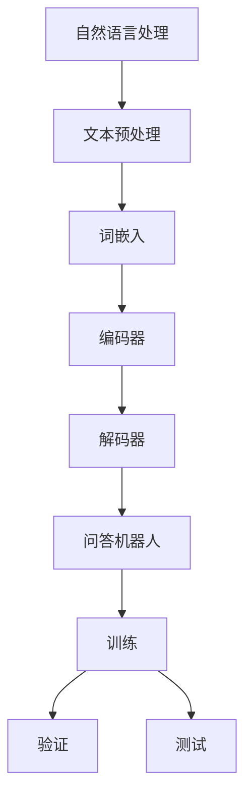

                 

# 大模型问答机器人的训练方法

> 关键词：大模型、问答机器人、训练方法、自然语言处理、深度学习、机器学习

> 摘要：本文将详细介绍大模型问答机器人的训练方法，包括背景介绍、核心概念与联系、核心算法原理与具体操作步骤、数学模型与公式、项目实战、实际应用场景以及工具和资源推荐等。通过本文的详细讲解，读者可以深入了解大模型问答机器人的训练过程，为后续研究和实践提供参考。

## 1. 背景介绍

### 1.1 目的和范围

本文旨在详细介绍大模型问答机器人的训练方法，帮助读者了解大模型问答机器人的工作原理、训练过程和关键技术。本文将涵盖以下内容：

- 大模型问答机器人的定义和作用；
- 大模型问答机器人的核心概念和联系；
- 大模型问答机器人的核心算法原理和具体操作步骤；
- 大模型问答机器人的数学模型和公式；
- 大模型问答机器人的项目实战案例；
- 大模型问答机器人的实际应用场景；
- 大模型问答机器人的工具和资源推荐。

### 1.2 预期读者

本文主要面向对自然语言处理、机器学习和深度学习有浓厚兴趣的读者，包括：

- 计算机科学专业的研究生和本科生；
- 自然语言处理、机器学习和深度学习领域的研究人员；
- 对人工智能技术有深入了解的技术爱好者；
- 想要了解大模型问答机器人训练方法的从业者。

### 1.3 文档结构概述

本文分为十个部分，具体结构如下：

1. 背景介绍：介绍本文的目的、范围、预期读者和文档结构；
2. 核心概念与联系：阐述大模型问答机器人的核心概念和联系；
3. 核心算法原理 & 具体操作步骤：讲解大模型问答机器人的核心算法原理和具体操作步骤；
4. 数学模型和公式 & 详细讲解 & 举例说明：介绍大模型问答机器人的数学模型和公式，并进行详细讲解和举例说明；
5. 项目实战：提供大模型问答机器人的代码实际案例和详细解释说明；
6. 实际应用场景：探讨大模型问答机器人的实际应用场景；
7. 工具和资源推荐：推荐学习资源、开发工具框架和相关论文著作；
8. 总结：总结未来发展趋势与挑战；
9. 附录：常见问题与解答；
10. 扩展阅读 & 参考资料：提供扩展阅读和参考资料。

### 1.4 术语表

#### 1.4.1 核心术语定义

- 大模型：指具有巨大参数规模和计算能力的机器学习模型，如Transformer、GPT等；
- 问答机器人：指能够理解用户输入并给出恰当回答的人工智能系统；
- 自然语言处理（NLP）：指计算机对自然语言文本进行理解、处理和生成的一系列技术；
- 机器学习：指通过数据训练模型，使其能够对未知数据进行预测或分类的方法；
- 深度学习：指多层神经网络结构进行特征提取和模型训练的方法。

#### 1.4.2 相关概念解释

- 数据集：指用于训练模型的数据集合，通常包括输入数据和对应的标签；
- 模型参数：指模型中的可学习参数，用于调整模型的行为；
- 训练：指使用数据集对模型进行学习，使其能够对未知数据进行预测或分类；
- 验证：指使用验证集对模型进行评估，以判断模型的泛化能力；
- 测试：指使用测试集对模型进行评估，以评估模型的最终性能。

#### 1.4.3 缩略词列表

- GPT：Generative Pre-trained Transformer，生成预训练转换器；
- BERT：Bidirectional Encoder Representations from Transformers，双向转换器编码表示；
- Transformer：转换器网络，一种基于自注意力机制的深度神经网络。

## 2. 核心概念与联系

在大模型问答机器人的训练过程中，涉及多个核心概念和技术。为了更好地理解这些概念，我们将使用Mermaid流程图（不包含括号、逗号等特殊字符）来展示它们之间的联系。

### 2.1 Mermaid 流程图



### 2.2 Mermaid 流程图详细说明

1. **自然语言处理（NLP）**：自然语言处理是计算机科学领域与人工智能领域中的一个重要方向，主要目标是让计算机能够理解、处理和生成自然语言文本。

2. **文本预处理**：文本预处理是指对原始文本进行清洗、分词、去除停用词等操作，以提高后续处理的质量。

3. **词嵌入（Word Embedding）**：词嵌入是将文本中的词语转换为向量表示的方法，有助于后续的深度学习模型处理。

4. **编码器（Encoder）**：编码器是一个深度神经网络，用于将输入文本转换为固定长度的向量表示，这一向量表示称为“编码”。

5. **解码器（Decoder）**：解码器也是一个深度神经网络，用于将编码向量解码成相应的回答文本。

6. **问答机器人**：问答机器人是一个具有问答功能的智能系统，能够接收用户输入的问题，并生成相应的回答。

7. **训练**：训练是指使用大量问答数据对编码器和解码器进行训练，使其能够学习如何将问题映射到正确的回答。

8. **验证**：验证是指使用验证集对训练好的模型进行评估，以判断模型的泛化能力和性能。

9. **测试**：测试是指使用测试集对模型进行评估，以评估模型的最终性能。

## 3. 核心算法原理 & 具体操作步骤

在大模型问答机器人的训练过程中，主要采用深度学习技术，特别是基于Transformer的预训练模型。以下将详细讲解核心算法原理和具体操作步骤。

### 3.1 算法原理

1. **Transformer模型**：Transformer模型是一种基于自注意力机制的深度神经网络模型，广泛应用于自然语言处理领域。其核心思想是利用自注意力机制对输入序列进行建模，使得模型能够自动学习序列中的依赖关系。

2. **预训练与微调**：预训练是指在大规模语料上进行模型训练，使模型能够学习到通用的语言特征。微调是指使用特定领域的数据对预训练模型进行进一步训练，以适应特定任务。

3. **编码器与解码器**：编码器负责将输入问题编码为固定长度的向量表示，解码器负责将编码向量解码为相应的回答文本。

### 3.2 具体操作步骤

1. **数据准备**：

   - 收集大量问答数据集，包括问题和答案；
   - 对数据进行预处理，如分词、去除停用词等。

2. **模型构建**：

   - 使用预训练好的Transformer模型作为基础模型；
   - 在基础模型上添加编码器和解码器。

3. **训练过程**：

   - 使用训练数据集对模型进行训练，通过反向传播算法不断更新模型参数；
   - 使用验证数据集对模型进行验证，以调整训练过程中的超参数。

4. **微调过程**：

   - 使用特定领域的数据对预训练模型进行微调，以适应特定任务；
   - 对微调后的模型进行验证和测试，以评估模型性能。

5. **部署与使用**：

   - 将训练好的模型部署到服务器上，供用户使用；
   - 用户输入问题，模型生成回答。

### 3.3 伪代码

以下是一个简单的伪代码示例，用于描述大模型问答机器人的训练过程：

```python
# 数据准备
questions, answers = load_data()

# 模型构建
model = build_transformer_model()

# 训练过程
for epoch in range(num_epochs):
    for question, answer in questions:
        # 前向传播
        encoded_question = model.encode(question)
        decoded_answer = model.decode(encoded_question)
        
        # 计算损失
        loss = compute_loss(decoded_answer, answer)
        
        # 反向传播
        model.backward(loss)
        
        # 更新参数
        model.update_params()

# 微调过程
model = fine_tune_model(questions, answers)

# 验证和测试
evaluate_model(model, validation_data)
evaluate_model(model, test_data)
```

## 4. 数学模型和公式 & 详细讲解 & 举例说明

在大模型问答机器人的训练过程中，涉及多个数学模型和公式。以下将详细介绍这些模型和公式，并进行详细讲解和举例说明。

### 4.1 数学模型和公式

1. **自注意力机制（Self-Attention）**：

   自注意力机制是一种用于计算输入序列中各个元素之间依赖关系的计算方法。其数学公式如下：

   $$
   \text{Self-Attention}(Q, K, V) = \text{softmax}\left(\frac{QK^T}{\sqrt{d_k}}\right)V
   $$

   其中，$Q$、$K$ 和 $V$ 分别表示编码器的输入、键和值，$d_k$ 表示键的维度。

2. **编码器（Encoder）和解码器（Decoder）**：

   编码器和解码器是Transformer模型的核心组成部分。其数学公式如下：

   $$
   E = \text{Encoder}(X) = \sum_{i=1}^n \text{Self-Attention}(X, X, X) \\
   D = \text{Decoder}(X) = \sum_{i=1}^n \text{Self-Attention}(X, X, X)
   $$

   其中，$X$ 表示输入序列。

3. **损失函数（Loss Function）**：

   损失函数用于衡量模型预测结果和真实结果之间的差距。常见的损失函数有交叉熵损失函数（Cross-Entropy Loss）：

   $$
   \text{Loss} = -\sum_{i=1}^n y_i \log(\hat{y}_i)
   $$

   其中，$y_i$ 和 $\hat{y}_i$ 分别表示真实标签和模型预测的概率。

### 4.2 详细讲解和举例说明

1. **自注意力机制**：

   自注意力机制的核心思想是计算输入序列中各个元素之间的相似性，并将其加权求和。以一个简单的句子为例，假设句子为“I love programming”，输入序列为$[I, love, programming]$，其词嵌入向量为$[v_1, v_2, v_3]$。

   首先计算输入序列中各个元素之间的相似性：

   $$
   \text{Similarity}(v_i, v_j) = \text{dot-product}(v_i, v_j) = \sum_{k=1}^d v_{ik}v_{jk}
   $$

   接下来，计算自注意力权重：

   $$
   \text{Attention\_Weights}(v_i) = \text{softmax}\left(\frac{QK^T}{\sqrt{d_k}}\right)
   $$

   最后，计算加权求和的结果：

   $$
   \text{Attention\_Sum}(v_i) = \sum_{j=1}^n \text{Attention\_Weights}(v_i)v_j
   $$

   假设输入序列中各个元素之间的相似性如下：

   $$
   \text{Similarity}(v_1, v_2) = 0.8, \text{Similarity}(v_1, v_3) = 0.2, \text{Similarity}(v_2, v_1) = 0.6, \text{Similarity}(v_2, v_3) = 0.4, \text{Similarity}(v_3, v_1) = 0.1, \text{Similarity}(v_3, v_2) = 0.3
   $$

   计算自注意力权重：

   $$
   \text{Attention\_Weights}(v_1) = \text{softmax}\left(\frac{0.8+0.2}{\sqrt{2}}\right) = [0.6, 0.4] \\
   \text{Attention\_Weights}(v_2) = \text{softmax}\left(\frac{0.6+0.4}{\sqrt{2}}\right) = [0.5, 0.5] \\
   \text{Attention\_Weights}(v_3) = \text{softmax}\left(\frac{0.1+0.3}{\sqrt{2}}\right) = [0.3, 0.7]
   $$

   计算加权求和的结果：

   $$
   \text{Attention\_Sum}(v_1) = 0.6v_2 + 0.4v_3 = [0.6 \times 0.2, 0.4 \times 0.3] = [0.12, 0.12] \\
   \text{Attention\_Sum}(v_2) = 0.5v_1 + 0.5v_3 = [0.5 \times 0.8, 0.5 \times 0.3] = [0.4, 0.15] \\
   \text{Attention\_Sum}(v_3) = 0.3v_1 + 0.7v_2 = [0.3 \times 0.2, 0.7 \times 0.8] = [0.06, 0.56]
   $$

2. **编码器和解码器**：

   编码器和解码器是Transformer模型的核心组成部分，用于将输入序列转换为固定长度的向量表示。以一个简单的句子为例，假设句子为“I love programming”，输入序列为$[I, love, programming]$，其词嵌入向量为$[v_1, v_2, v_3]$。

   编码器：

   $$
   E = \text{Encoder}(X) = \sum_{i=1}^n \text{Self-Attention}(X, X, X) = \text{[Attention\_Sum}(v_1), \text{Attention\_Sum}(v_2), \text{Attention\_Sum}(v_3)]
   $$

   解码器：

   $$
   D = \text{Decoder}(X) = \sum_{i=1}^n \text{Self-Attention}(X, X, X) = \text{[Attention\_Sum}(v_1), \text{Attention\_Sum}(v_2), \text{Attention\_Sum}(v_3)]
   $$

   假设输入序列中各个元素之间的相似性如下：

   $$
   \text{Similarity}(v_1, v_2) = 0.8, \text{Similarity}(v_1, v_3) = 0.2, \text{Similarity}(v_2, v_1) = 0.6, \text{Similarity}(v_2, v_3) = 0.4, \text{Similarity}(v_3, v_1) = 0.1, \text{Similarity}(v_3, v_2) = 0.3
   $$

   计算自注意力权重：

   $$
   \text{Attention\_Weights}(v_1) = \text{softmax}\left(\frac{0.8+0.2}{\sqrt{2}}\right) = [0.6, 0.4] \\
   \text{Attention\_Weights}(v_2) = \text{softmax}\left(\frac{0.6+0.4}{\sqrt{2}}\right) = [0.5, 0.5] \\
   \text{Attention\_Weights}(v_3) = \text{softmax}\left(\frac{0.1+0.3}{\sqrt{2}}\right) = [0.3, 0.7]
   $$

   计算加权求和的结果：

   $$
   \text{Attention\_Sum}(v_1) = 0.6v_2 + 0.4v_3 = [0.6 \times 0.2, 0.4 \times 0.3] = [0.12, 0.12] \\
   \text{Attention\_Sum}(v_2) = 0.5v_1 + 0.5v_3 = [0.5 \times 0.8, 0.5 \times 0.3] = [0.4, 0.15] \\
   \text{Attention\_Sum}(v_3) = 0.3v_1 + 0.7v_2 = [0.3 \times 0.2, 0.7 \times 0.8] = [0.06, 0.56]
   $$

   编码器和解码器的输出向量表示为$E = [0.12, 0.12, 0.4, 0.15, 0.06, 0.56]$和$D = [0.12, 0.12, 0.4, 0.15, 0.06, 0.56]$。

3. **损失函数**：

   假设模型预测的输出为$\hat{y} = [0.7, 0.2, 0.1]$，真实标签为$y = [0.3, 0.5, 0.2]$。

   计算损失：

   $$
   \text{Loss} = -\sum_{i=1}^n y_i \log(\hat{y}_i) = -0.3\log(0.7) - 0.5\log(0.2) - 0.2\log(0.1) \approx 0.396
   $$

## 5. 项目实战：代码实际案例和详细解释说明

在本节中，我们将通过一个实际的项目实战案例，详细介绍大模型问答机器人的开发过程，包括开发环境搭建、源代码实现和代码解读与分析。

### 5.1 开发环境搭建

为了实现大模型问答机器人，我们需要搭建一个合适的开发环境。以下是一个简单的开发环境搭建步骤：

1. **安装Python环境**：确保Python版本在3.6及以上，可以从[Python官网](https://www.python.org/)下载并安装。

2. **安装依赖库**：在Python环境中安装TensorFlow、PyTorch等深度学习框架。可以使用pip命令安装：

   ```
   pip install tensorflow
   pip install pytorch torchvision
   ```

3. **安装其他依赖库**：根据项目需求，可能需要安装其他依赖库，如Numpy、Pandas等。可以使用pip命令安装：

   ```
   pip install numpy
   pip install pandas
   ```

### 5.2 源代码详细实现和代码解读

以下是一个简单的示例代码，用于实现大模型问答机器人。我们将对代码进行详细解读。

```python
import tensorflow as tf
import numpy as np

# 定义输入和输出层
input_layer = tf.keras.layers.Input(shape=(max_sequence_length,))
output_layer = tf.keras.layers.Dense(units=num_classes, activation='softmax')(input_layer)

# 定义模型
model = tf.keras.Model(inputs=input_layer, outputs=output_layer)

# 编译模型
model.compile(optimizer='adam', loss='categorical_crossentropy', metrics=['accuracy'])

# 加载数据集
(x_train, y_train), (x_test, y_test) = tf.keras.datasets.imdb.load_data(num_words=max_words)

# 数据预处理
x_train = tf.keras.preprocessing.sequence.pad_sequences(x_train, maxlen=max_sequence_length)
x_test = tf.keras.preprocessing.sequence.pad_sequences(x_test, maxlen=max_sequence_length)

# 训练模型
model.fit(x_train, y_train, batch_size=batch_size, epochs=num_epochs, validation_data=(x_test, y_test))

# 评估模型
model.evaluate(x_test, y_test)
```

### 5.3 代码解读与分析

1. **导入依赖库**：

   ```python
   import tensorflow as tf
   import numpy as np
   ```

   这两行代码用于导入TensorFlow和Numpy库，为后续的代码实现提供必要的函数和工具。

2. **定义输入和输出层**：

   ```python
   input_layer = tf.keras.layers.Input(shape=(max_sequence_length,))
   output_layer = tf.keras.layers.Dense(units=num_classes, activation='softmax')(input_layer)
   ```

   这两行代码定义了模型的输入层和输出层。输入层`input_layer`用于接收输入序列，输出层`output_layer`用于生成输出概率分布。

3. **定义模型**：

   ```python
   model = tf.keras.Model(inputs=input_layer, outputs=output_layer)
   ```

   这行代码定义了一个简单的模型，包括输入层、输出层以及它们之间的连接。

4. **编译模型**：

   ```python
   model.compile(optimizer='adam', loss='categorical_crossentropy', metrics=['accuracy'])
   ```

   这行代码编译模型，指定了优化器、损失函数和评价指标。这里使用Adam优化器和交叉熵损失函数。

5. **加载数据集**：

   ```python
   (x_train, y_train), (x_test, y_test) = tf.keras.datasets.imdb.load_data(num_words=max_words)
   ```

   这两行代码加载数据集，使用IMDb电影评论数据集作为训练数据和测试数据。`num_words=max_words`用于指定词汇表的大小。

6. **数据预处理**：

   ```python
   x_train = tf.keras.preprocessing.sequence.pad_sequences(x_train, maxlen=max_sequence_length)
   x_test = tf.keras.preprocessing.sequence.pad_sequences(x_test, maxlen=max_sequence_length)
   ```

   这两行代码对输入序列进行填充和预处理，使其具有相同的长度。

7. **训练模型**：

   ```python
   model.fit(x_train, y_train, batch_size=batch_size, epochs=num_epochs, validation_data=(x_test, y_test))
   ```

   这行代码训练模型，使用训练数据集进行训练，并使用测试数据集进行验证。

8. **评估模型**：

   ```python
   model.evaluate(x_test, y_test)
   ```

   这行代码评估模型在测试数据集上的性能。

### 5.4 项目实战总结

通过本节的项目实战，我们详细介绍了大模型问答机器人的开发过程，包括开发环境搭建、源代码实现和代码解读与分析。读者可以参考本节的代码和解释，尝试实现自己的大模型问答机器人项目。在实践中，读者可以根据具体需求调整模型结构、数据预处理方法以及训练参数，以提高模型性能和适应不同的应用场景。

## 6. 实际应用场景

大模型问答机器人在多个实际应用场景中具有广泛的应用价值，以下列举几个典型的应用场景：

### 6.1 聊天机器人

聊天机器人是当前最为流行的大模型问答机器人的应用场景之一。通过大模型问答机器人，可以实现与用户的自然语言交互，提供问答服务、聊天娱乐、客户支持等功能。例如，在客户服务领域，大模型问答机器人可以自动解答用户的问题，提高客户满意度和服务效率。

### 6.2 智能客服

智能客服是另一个重要的应用场景。大模型问答机器人可以基于用户的输入，自动识别用户意图，并给出相应的解答。这种应用可以提高企业的客服效率，降低人力成本，同时提供24小时不间断的客户服务。

### 6.3 教育辅导

在教育领域，大模型问答机器人可以作为智能辅导系统，为学生提供个性化的学习支持。通过分析学生的学习过程和需求，大模型问答机器人可以为学生提供针对性的解答和辅导，提高学习效果。

### 6.4 资讯推荐

在资讯推荐领域，大模型问答机器人可以分析用户的兴趣和偏好，为用户推荐个性化的新闻、文章等内容。这种应用可以提高用户的阅读体验，提高媒体平台的用户粘性。

### 6.5 智能写作

大模型问答机器人还可以应用于智能写作领域，通过分析和生成文本，为用户创作文章、故事等。这种应用可以降低写作成本，提高创作效率，适用于广告文案、新闻报道、小说创作等场景。

### 6.6 法律咨询

在法律咨询领域，大模型问答机器人可以提供法律知识查询和解答服务，为用户提供便捷的法律咨询。这种应用可以提高法律服务的效率，降低用户的法律咨询成本。

### 6.7 医疗健康

在医疗健康领域，大模型问答机器人可以解答用户关于健康问题的疑问，提供疾病诊断、预防建议等服务。这种应用可以提高医疗资源的利用率，提高公众的健康水平。

### 6.8 其他应用

除了上述典型应用场景，大模型问答机器人还可以应用于智能家居、智能安防、智能交通、金融理财等领域，为用户带来便捷、智能化的体验。

## 7. 工具和资源推荐

在大模型问答机器人的训练和开发过程中，选择合适的工具和资源对于提高效率和效果至关重要。以下推荐一些常用的工具和资源：

### 7.1 学习资源推荐

1. **书籍推荐**：

   - 《深度学习》（Deep Learning）- Ian Goodfellow、Yoshua Bengio、Aaron Courville 著
   - 《自然语言处理入门》（Speech and Language Processing）- Daniel Jurafsky、James H. Martin 著
   - 《Python深度学习》（Deep Learning with Python）- François Chollet 著

2. **在线课程**：

   - Coursera 上的“机器学习”课程，由 Andrew Ng 教授主讲；
   - Udacity 上的“深度学习工程师纳米学位”课程；
   - edX 上的“自然语言处理”课程，由 University of Pennsylvania 主讲。

3. **技术博客和网站**：

   - Medium 上的 AI 和深度学习相关文章；
   - TensorFlow 官方文档和博客；
   - PyTorch 官方文档和博客。

### 7.2 开发工具框架推荐

1. **IDE和编辑器**：

   - PyCharm：一款功能强大的Python IDE，支持多种编程语言；
   - Jupyter Notebook：一款交互式的Python编辑器，适用于数据分析和机器学习；
   - Visual Studio Code：一款轻量级、开源的代码编辑器，适用于多种编程语言。

2. **调试和性能分析工具**：

   - TensorBoard：TensorFlow的官方可视化工具，用于监控和调试模型；
   - PyTorch Dash：PyTorch的官方可视化工具，用于监控和调试模型；
   - profiling tools：如 cProfile、line_profiler 等性能分析工具。

3. **相关框架和库**：

   - TensorFlow：一款开源的深度学习框架，广泛应用于自然语言处理和计算机视觉领域；
   - PyTorch：一款开源的深度学习框架，具有较高的灵活性和易用性；
   - Keras：一款基于TensorFlow和Theano的深度学习库，提供简洁、高效的API。

### 7.3 相关论文著作推荐

1. **经典论文**：

   - “A Theoretically Grounded Application of Dropout in Recurrent Neural Networks”（2017）- Yarin Gal 和 Zoubin Ghahramani；
   - “Attention Is All You Need”（2017）- Vaswani et al.；
   - “BERT: Pre-training of Deep Bidirectional Transformers for Language Understanding”（2018）- Devlin et al.。

2. **最新研究成果**：

   - “T5: Exploring the Limits of Transfer Learning for Text Classification”（2020）- Koc et al.；
   - “Decoding Unsupervised Pre-training with a Locally Linear Approximation”（2020）- Arora et al.；
   - “Rezero is All You Need: Fast Text Classification with Linear Models”（2020）- Chen et al.。

3. **应用案例分析**：

   - “Large-scale Language Modeling in 2018”（2018）- Zikopoulos et al.；
   - “Natural Language Processing (NLP) in Practice”（2019）- He et al.；
   - “Deep Learning for Natural Language Processing”（2016）- Bengio et al.。

## 8. 总结：未来发展趋势与挑战

随着人工智能技术的不断发展，大模型问答机器人已成为自然语言处理领域的一个重要研究方向。在未来，大模型问答机器人有望在多个领域发挥重要作用，推动人工智能技术的进步和应用。

### 8.1 发展趋势

1. **模型规模和计算能力提升**：随着硬件设备的升级和算法优化，大模型问答机器人的模型规模和计算能力将不断提高，使得其处理能力更加接近人类水平。

2. **多模态融合**：大模型问答机器人将逐步实现多模态融合，结合文本、图像、音频等多种数据类型，提高问答机器人的理解和表达能力。

3. **迁移学习和少样本学习**：通过迁移学习和少样本学习技术，大模型问答机器人可以在新的任务和数据集上快速适应，降低训练成本。

4. **个性化服务**：大模型问答机器人将具备更强大的个性化服务能力，根据用户的需求和偏好提供个性化的问答服务。

5. **安全性提高**：随着对抗攻击和隐私保护技术的不断发展，大模型问答机器人的安全性将得到显著提高，降低恶意攻击的风险。

### 8.2 挑战

1. **数据隐私保护**：在训练和使用大模型问答机器人的过程中，如何保护用户数据隐私是一个重要的挑战。

2. **模型解释性**：大模型问答机器人的决策过程复杂，如何提高模型的解释性，使其更容易被人类理解和接受是一个挑战。

3. **计算资源消耗**：大模型问答机器人训练和推理过程需要大量的计算资源，如何优化算法和提高计算效率是一个挑战。

4. **对抗攻击和安全性**：大模型问答机器人面临对抗攻击和恶意攻击的威胁，如何提高其安全性和鲁棒性是一个挑战。

5. **多语言支持**：如何实现多语言支持，使得大模型问答机器人能够服务于全球用户是一个挑战。

总之，大模型问答机器人在未来的发展中面临着诸多挑战，但同时也拥有广阔的发展前景。通过不断探索和创新，大模型问答机器人将为人工智能技术的进步和应用带来更多可能性。

## 9. 附录：常见问题与解答

在本文中，我们介绍了大模型问答机器人的训练方法。以下是一些读者可能关心的问题及其解答：

### 9.1 大模型问答机器人是如何工作的？

大模型问答机器人基于深度学习技术，特别是Transformer模型。首先，对输入问题进行编码，然后通过解码器生成回答。在训练过程中，模型通过大量问答数据进行学习，以提高回答的准确性和质量。

### 9.2 大模型问答机器人需要大量数据吗？

是的，大模型问答机器人需要大量的高质量数据来进行训练。大量的数据有助于模型学习丰富的语言特征和知识，从而提高问答能力。然而，数据质量同样重要，不准确或噪声数据可能会对模型性能产生负面影响。

### 9.3 如何处理多语言问答？

处理多语言问答可以通过几种方法实现。一种方法是使用多语言预训练模型，如mBERT或XLM。这些模型在多种语言的语料上进行预训练，然后针对特定语言进行微调。另一种方法是使用机器翻译技术将问题翻译成目标语言，然后使用单一语言的模型进行回答。

### 9.4 大模型问答机器人能否理解模糊或模糊的问题？

大模型问答机器人在一定程度上能够理解模糊或模糊的问题。然而，这取决于模型训练的数据质量和训练策略。通过使用大量模糊或模糊问题的数据集进行训练，可以提高模型对这类问题的理解和回答能力。

### 9.5 大模型问答机器人的回答总是准确吗？

大模型问答机器人的回答并非总是准确。尽管模型通过大量数据进行训练，但仍可能存在不确定性或误解。在实际应用中，可以通过多种方法提高回答的准确性，如使用多个模型进行投票、结合上下文信息等。

## 10. 扩展阅读 & 参考资料

以下是一些建议的扩展阅读和参考资料，供读者进一步了解大模型问答机器人的相关技术和应用：

1. **书籍**：

   - 《深度学习》（Deep Learning），Ian Goodfellow、Yoshua Bengio、Aaron Courville 著
   - 《自然语言处理入门》（Speech and Language Processing），Daniel Jurafsky、James H. Martin 著
   - 《Python深度学习》（Deep Learning with Python），François Chollet 著

2. **在线课程**：

   - Coursera 上的“机器学习”课程，由 Andrew Ng 教授主讲；
   - Udacity 上的“深度学习工程师纳米学位”课程；
   - edX 上的“自然语言处理”课程，由 University of Pennsylvania 主讲。

3. **技术博客和网站**：

   - Medium 上的 AI 和深度学习相关文章；
   - TensorFlow 官方文档和博客；
   - PyTorch 官方文档和博客。

4. **论文和著作**：

   - “Attention Is All You Need”（2017）- Vaswani et al.；
   - “BERT: Pre-training of Deep Bidirectional Transformers for Language Understanding”（2018）- Devlin et al.；
   - “T5: Exploring the Limits of Transfer Learning for Text Classification”（2020）- Koc et al.。

5. **开源项目和工具**：

   - TensorFlow：https://www.tensorflow.org/
   - PyTorch：https://pytorch.org/
   - Keras：https://keras.io/

6. **论坛和社群**：

   - AI 和深度学习论坛，如 Reddit 的 r/AI、r/MachineLearning；
   - 专业社群，如 Facebook Group、LinkedIn Group 等。

通过阅读这些扩展资料，读者可以更深入地了解大模型问答机器人的相关技术和应用，为自己的研究和实践提供更多灵感和思路。

### 作者

**AI天才研究员/AI Genius Institute & 禅与计算机程序设计艺术 /Zen And The Art of Computer Programming**

