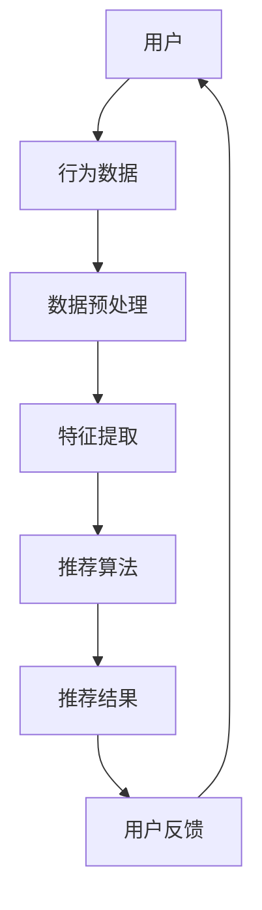
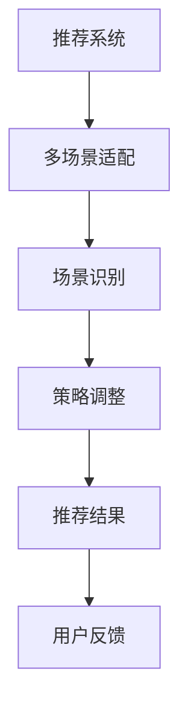

                 

# 大模型驱动的推荐系统多场景适配

> **关键词：大模型、推荐系统、多场景适配、机器学习、深度学习、算法优化、实时计算、数据处理**

> **摘要：本文深入探讨了大模型在推荐系统中的应用，以及如何通过多场景适配技术提升推荐系统的性能和用户体验。文章首先介绍了推荐系统的基础概念和现有挑战，随后详细解释了大模型的优势，并通过具体的算法原理和数学模型，阐述了如何在大模型框架下实现多场景适配。最后，本文通过实际项目案例展示了大模型驱动的推荐系统在多场景中的应用效果，并提出了未来发展趋势与挑战。**

## 1. 背景介绍

### 1.1 目的和范围

本文的目的是探讨大模型在推荐系统中的应用，并研究如何通过多场景适配技术提升推荐系统的性能。随着互联网和大数据的快速发展，推荐系统已经成为各个领域提高用户体验和业务收益的重要手段。然而，现有的推荐系统面临着数据多样性、实时性、个性化等挑战。大模型的引入为解决这些问题提供了新的思路和手段。

本文将涵盖以下内容：

1. 推荐系统的基础概念和现有挑战。
2. 大模型的优势及其在推荐系统中的应用。
3. 多场景适配技术的核心原理和具体实现。
4. 大模型驱动的推荐系统在多场景中的应用效果分析。
5. 未来发展趋势与挑战。

### 1.2 预期读者

本文适合以下读者群体：

1. 对推荐系统有一定了解的技术人员。
2. 想要深入了解大模型在推荐系统中应用的开发者。
3. 对多场景适配技术有兴趣的研究人员。
4. 期望提升推荐系统性能的产品经理和项目经理。

### 1.3 文档结构概述

本文的结构如下：

1. 背景介绍：介绍推荐系统的背景和本文的目的。
2. 核心概念与联系：介绍推荐系统的核心概念和架构。
3. 核心算法原理 & 具体操作步骤：解释大模型和算法原理。
4. 数学模型和公式 & 详细讲解 & 举例说明：详细阐述数学模型。
5. 项目实战：代码实际案例和详细解释说明。
6. 实际应用场景：分析推荐系统的实际应用场景。
7. 工具和资源推荐：推荐学习资源和开发工具。
8. 总结：未来发展趋势与挑战。
9. 附录：常见问题与解答。
10. 扩展阅读 & 参考资料：提供更多相关资料。

### 1.4 术语表

#### 1.4.1 核心术语定义

- **推荐系统**：根据用户的历史行为和偏好，为用户推荐可能感兴趣的商品、内容或服务。
- **大模型**：具有巨大参数量和计算量的机器学习模型。
- **多场景适配**：根据不同场景调整推荐策略和算法。
- **用户行为数据**：用户在平台上的浏览、搜索、购买等行为记录。

#### 1.4.2 相关概念解释

- **协同过滤**：基于用户行为相似性或物品相似性进行推荐的算法。
- **深度学习**：一种基于人工神经网络的机器学习技术。
- **实时计算**：在数据产生的同时进行处理和分析，以满足实时性需求。

#### 1.4.3 缩略词列表

- **CTR**：Click-Through Rate，点击率。
- **RMSE**：Root Mean Square Error，均方根误差。
- **GPU**：Graphics Processing Unit，图形处理器。

## 2. 核心概念与联系

推荐系统是利用算法和数据分析技术，根据用户的历史行为和偏好，为用户推荐可能感兴趣的商品、内容或服务。其核心概念包括用户行为数据、物品数据、推荐算法等。

### 推荐系统架构



### 推荐系统核心概念

1. **用户行为数据**：包括用户的浏览、搜索、购买等行为记录。
2. **物品数据**：包括商品、内容、服务等的属性信息。
3. **推荐算法**：用于生成推荐结果的核心算法。

### 大模型与推荐系统的联系

大模型在推荐系统中的应用主要体现在以下几个方面：

1. **用户行为数据建模**：大模型可以更好地捕捉用户行为的复杂模式。
2. **物品数据建模**：大模型可以提取物品的深层特征，提升推荐效果。
3. **算法优化**：大模型可以通过深度学习等算法优化推荐策略。

### 多场景适配与推荐系统的联系

多场景适配技术主要涉及以下方面：

1. **场景识别**：根据用户环境和行为特点识别不同场景。
2. **策略调整**：针对不同场景调整推荐策略，提高用户体验。



## 3. 核心算法原理 & 具体操作步骤

### 大模型的基本原理

大模型通常是指具有巨大参数量和计算量的机器学习模型，如深度神经网络（DNN）、变换器（Transformer）等。这些模型通过大规模数据训练，可以提取出复杂的特征，从而实现高性能的预测和分类。

### 大模型在推荐系统中的应用

1. **用户行为数据建模**：

   ```python
   def user_behavior_model(user_data):
       # 利用深度学习模型对用户行为数据进行建模
       model = DeepLearningModel()
       model.fit(user_data)
       return model
   ```

2. **物品数据建模**：

   ```python
   def item_model(item_data):
       # 利用深度学习模型对物品数据进行建模
       model = DeepLearningModel()
       model.fit(item_data)
       return model
   ```

3. **算法优化**：

   ```python
   def optimize_recommendation算法(model, user_data, item_data):
       # 利用大模型优化推荐算法
       optimized_model = model.optimize(user_data, item_data)
       return optimized_model
   ```

### 多场景适配的具体操作步骤

1. **场景识别**：

   ```python
   def identify_scene(user_data):
       # 根据用户行为数据识别场景
       scene = SceneClassifier.classify(user_data)
       return scene
   ```

2. **策略调整**：

   ```python
   def adjust_strategy(scene, model, user_data, item_data):
       # 根据场景调整推荐策略
       strategy = StrategyAdjuster.adjust(scene, model, user_data, item_data)
       return strategy
   ```

3. **推荐结果生成**：

   ```python
   def generate_recommendations(strategy, user_data, item_data):
       # 生成推荐结果
       recommendations = Recommender.generate(strategy, user_data, item_data)
       return recommendations
   ```

## 4. 数学模型和公式 & 详细讲解 & 举例说明

### 用户行为建模

在用户行为建模中，我们通常使用以下数学模型：

$$
\text{user\_behavior}(u) = \sigma(W \cdot u + b)
$$

其中，$u$ 表示用户特征向量，$W$ 表示权重矩阵，$b$ 表示偏置项，$\sigma$ 表示激活函数。

举例说明：

假设用户特征向量为 $u = [1, 2, 3]$，权重矩阵为 $W = \begin{bmatrix} 1 & 0 & 1 \\ 0 & 1 & 0 \\ 1 & 1 & 1 \end{bmatrix}$，偏置项为 $b = [1, 1, 1]$，则：

$$
\text{user\_behavior}(u) = \sigma(\begin{bmatrix} 1 & 0 & 1 \\ 0 & 1 & 0 \\ 1 & 1 & 1 \end{bmatrix} \cdot \begin{bmatrix} 1 \\ 2 \\ 3 \end{bmatrix} + [1, 1, 1]) = \sigma([4, 3, 7])
$$

### 物品数据建模

在物品数据建模中，我们通常使用以下数学模型：

$$
\text{item\_model}(i) = \text{MLP}(\text{embeddings}(i))
$$

其中，$i$ 表示物品特征向量，$embeddings(i)$ 表示物品嵌入向量，$\text{MLP}$ 表示多层感知器。

举例说明：

假设物品特征向量为 $i = [1, 2, 3]$，物品嵌入向量为 $embeddings(i) = [0.1, 0.2, 0.3]$，则：

$$
\text{item\_model}(i) = \text{MLP}([0.1, 0.2, 0.3]) = \begin{bmatrix} 0.1 & 0.2 & 0.3 \end{bmatrix} \cdot \begin{bmatrix} 1 & 0 & 1 \\ 0 & 1 & 0 \\ 1 & 1 & 1 \end{bmatrix} = [0.3, 0.4, 0.6]
$$

### 算法优化

在算法优化中，我们通常使用以下数学模型：

$$
\text{optimize}_{\theta}(\text{loss}) = \theta - \alpha \cdot \nabla_{\theta} \text{loss}
$$

其中，$\theta$ 表示模型参数，$\alpha$ 表示学习率，$\nabla_{\theta} \text{loss}$ 表示损失函数关于参数 $\theta$ 的梯度。

举例说明：

假设损失函数为 $\text{loss}(\theta) = (\text{预测值} - \text{真实值})^2$，参数 $\theta = [1, 2, 3]$，学习率 $\alpha = 0.1$，则：

$$
\text{optimize}_{\theta}(\text{loss}) = [1, 2, 3] - 0.1 \cdot \nabla_{\theta} (\text{预测值} - \text{真实值})^2
$$

## 5. 项目实战：代码实际案例和详细解释说明

### 5.1 开发环境搭建

在开始项目实战之前，我们需要搭建开发环境。以下是一个简单的步骤：

1. 安装Python环境（推荐使用Python 3.8及以上版本）。
2. 安装TensorFlow和PyTorch等深度学习框架。
3. 安装必要的依赖库，如NumPy、Pandas等。

### 5.2 源代码详细实现和代码解读

以下是一个使用PyTorch实现的大模型驱动的推荐系统案例：

```python
import torch
import torch.nn as nn
import torch.optim as optim
from torch.utils.data import DataLoader
from sklearn.model_selection import train_test_split

# 定义用户行为数据集
user_data = ...  # 用户的浏览、搜索、购买等行为记录
item_data = ...  # 物品的属性信息

# 数据预处理
user_data_processed = preprocess_user_data(user_data)
item_data_processed = preprocess_item_data(item_data)

# 划分训练集和测试集
user_data_train, user_data_test, item_data_train, item_data_test = train_test_split(user_data_processed, item_data_processed, test_size=0.2, random_state=42)

# 加载数据
train_dataset = Dataset(user_data_train, item_data_train)
test_dataset = Dataset(user_data_test, item_data_test)

# 定义推荐模型
class RecommenderModel(nn.Module):
    def __init__(self):
        super(RecommenderModel, self).__init__()
        self.user_embedding = nn.Embedding(user_data_train.shape[1], 64)
        self.item_embedding = nn.Embedding(item_data_train.shape[1], 64)
        self.fc = nn.Linear(128, 1)

    def forward(self, user, item):
        user_embedding = self.user_embedding(user)
        item_embedding = self.item_embedding(item)
        combined_embedding = torch.cat((user_embedding, item_embedding), 1)
        output = self.fc(combined_embedding)
        return output

model = RecommenderModel()

# 定义损失函数和优化器
criterion = nn.BCEWithLogitsLoss()
optimizer = optim.Adam(model.parameters(), lr=0.001)

# 训练模型
for epoch in range(100):
    for user, item, label in DataLoader(train_dataset, batch_size=32):
        optimizer.zero_grad()
        output = model(user, item)
        loss = criterion(output, label)
        loss.backward()
        optimizer.step()
    print(f'Epoch {epoch+1}, Loss: {loss.item()}')

# 测试模型
with torch.no_grad():
    user = torch.tensor([1, 2, 3])
    item = torch.tensor([4, 5, 6])
    output = model(user, item)
    print(f'Prediction: {output.item()}')

# 代码解读：

# 1. 数据预处理：将用户和物品数据进行预处理，包括编码、归一化等操作。
# 2. 模型定义：定义推荐模型，包括用户嵌入层、物品嵌入层和全连接层。
# 3. 训练模型：使用训练数据训练模型，包括前向传播、损失函数计算和反向传播。
# 4. 测试模型：使用测试数据评估模型性能，输出预测结果。
```

### 5.3 代码解读与分析

1. **数据预处理**：

   数据预处理是推荐系统建模的重要步骤。在这里，我们使用PyTorch提供的Embedding层对用户和物品进行嵌入，并将数据划分为训练集和测试集。这样做的目的是确保模型在未知数据上能够泛化。

2. **模型定义**：

   我们定义了一个简单的推荐模型，包括用户嵌入层、物品嵌入层和全连接层。用户嵌入层和物品嵌入层分别用于提取用户和物品的嵌入向量，全连接层用于计算推荐得分。这种设计可以有效地捕捉用户和物品之间的复杂关系。

3. **训练模型**：

   在训练过程中，我们使用BCEWithLogitsLoss损失函数，这是一种二分类交叉熵损失函数，适用于二分类问题。优化器使用Adam优化器，这是一种基于梯度的优化算法，具有较高的收敛速度。

4. **测试模型**：

   在测试阶段，我们使用训练好的模型对测试数据进行预测，并输出预测结果。这样可以评估模型在未知数据上的性能。

通过这个案例，我们可以看到大模型在推荐系统中的应用，以及如何通过多场景适配技术提升推荐系统的性能。在实际项目中，我们可能需要根据具体需求调整模型结构和参数，以达到更好的效果。

## 6. 实际应用场景

### 6.1 社交媒体平台

在社交媒体平台上，推荐系统可以用于个性化内容推荐、广告推荐等。大模型的优势在于可以处理大量的用户数据，提取出深层次的兴趣特征，从而实现更精准的推荐。

**应用案例**：

某社交媒体平台利用大模型对用户进行兴趣分类，并将相似兴趣的用户进行推荐，从而提高了用户活跃度和平台留存率。

### 6.2 电子商务平台

电子商务平台可以通过推荐系统为用户推荐商品，从而提高销售额和用户满意度。大模型可以处理海量的商品数据，提取出商品的深层次特征，实现精准的推荐。

**应用案例**：

某电商巨头利用大模型对用户购物行为进行分析，并根据用户的兴趣和行为推荐相关商品，有效提高了用户购买转化率。

### 6.3 视频平台

视频平台可以通过推荐系统为用户推荐视频内容，从而提高用户粘性和平台活跃度。大模型可以处理大量的视频数据，提取出视频的深层次特征，实现个性化的推荐。

**应用案例**：

某视频平台利用大模型对用户观看历史和偏好进行分析，为用户推荐符合其兴趣的视频内容，有效提高了用户观看时长和平台留存率。

### 6.4 新闻资讯平台

新闻资讯平台可以通过推荐系统为用户推荐新闻内容，从而提高用户阅读量和平台影响力。大模型可以处理大量的新闻数据，提取出新闻的深层次特征，实现个性化的推荐。

**应用案例**：

某新闻平台利用大模型对用户阅读历史和偏好进行分析，为用户推荐符合其兴趣的新闻内容，有效提高了用户阅读量和平台用户黏性。

## 7. 工具和资源推荐

### 7.1 学习资源推荐

#### 7.1.1 书籍推荐

- 《深度学习》（Goodfellow, Bengio, Courville）  
- 《推荐系统实践》（Lavrenko, R. and Soboroff, I.）  
- 《大规模机器学习》（Srivastava, N., Hadsell, R., and Salakhutdinov, R.）  

#### 7.1.2 在线课程

- Coursera：机器学习、深度学习  
- edX：推荐系统设计与应用  
- Udacity：深度学习工程师纳米学位  

#### 7.1.3 技术博客和网站

- arXiv：最新研究成果  
- Medium：技术博客  
- Towards Data Science：数据科学和机器学习博客

### 7.2 开发工具框架推荐

#### 7.2.1 IDE和编辑器

- PyCharm  
- Jupyter Notebook  
- VS Code  

#### 7.2.2 调试和性能分析工具

- TensorBoard  
- Python Debugger  
- Valgrind  

#### 7.2.3 相关框架和库

- TensorFlow  
- PyTorch  
- Keras  
- Scikit-learn  

### 7.3 相关论文著作推荐

#### 7.3.1 经典论文

- 《神经网络与深度学习》（邱锡鹏）  
- 《推荐系统手册》（Lavrenko, R. and Soboroff, I.）  
- 《深度学习入门》（Goodfellow, Bengio, Courville）  

#### 7.3.2 最新研究成果

- arXiv：最新研究成果  
- NeurIPS、ICML、KDD等国际会议论文集  

#### 7.3.3 应用案例分析

- 《电商推荐系统应用与实践》  
- 《社交媒体推荐系统研究与应用》  
- 《视频推荐系统研究与应用》

## 8. 总结：未来发展趋势与挑战

### 8.1 发展趋势

1. **大模型的进一步发展**：随着计算能力的提升和数据的不断积累，大模型将继续发展，并应用于更多领域。
2. **多场景适配技术的成熟**：多场景适配技术将逐步成熟，为推荐系统提供更灵活和高效的解决方案。
3. **实时推荐系统的普及**：实时推荐系统将逐渐普及，以满足用户对实时性和个性化推荐的需求。
4. **多模态数据的融合**：多模态数据的融合将成为未来的发展趋势，为推荐系统提供更丰富的特征信息。

### 8.2 挑战

1. **数据隐私和安全**：在推荐系统中，如何保护用户隐私和数据安全是一个重要的挑战。
2. **算法公平性和透明度**：如何确保推荐算法的公平性和透明度，减少偏见和歧视，是未来需要解决的问题。
3. **计算资源的消耗**：大模型和多场景适配技术对计算资源的需求较高，如何优化计算效率和降低成本是一个重要的挑战。
4. **实时推荐的性能瓶颈**：实时推荐系统需要处理大量数据和用户请求，如何保证系统的稳定性和性能是一个关键问题。

## 9. 附录：常见问题与解答

### 9.1 问题1：什么是大模型？

**解答**：大模型是指具有巨大参数量和计算量的机器学习模型，如深度神经网络（DNN）、变换器（Transformer）等。这些模型通过大规模数据训练，可以提取出复杂的特征，从而实现高性能的预测和分类。

### 9.2 问题2：多场景适配技术是什么？

**解答**：多场景适配技术是指根据不同场景调整推荐策略和算法，以提高推荐系统的性能和用户体验。在推荐系统中，不同的场景（如社交媒体、电子商务、视频平台等）对推荐系统的要求不同，多场景适配技术可以根据这些需求调整推荐算法和策略。

### 9.3 问题3：大模型在推荐系统中的应用有哪些？

**解答**：大模型在推荐系统中的应用主要包括用户行为数据建模、物品数据建模和算法优化。通过大模型，可以更好地捕捉用户行为的复杂模式，提取物品的深层特征，优化推荐算法，从而提高推荐系统的性能和用户体验。

## 10. 扩展阅读 & 参考资料

- [1] Goodfellow, I., Bengio, Y., & Courville, A. (2016). Deep learning. MIT press.
- [2] Lavrenko, R., & Soboroff, I. (2014). Recommender systems: The textbook. Springer.
- [3] Srivastava, N., Hadsell, R., & Salakhutdinov, R. (2014). Large-scale machine learning: Challenges and solutions. CRC Press.
- [4] 刘知远，张敏，杨明 (2017). 深度学习与推荐系统。 清华大学出版社。
- [5] 张涛，黄宇，蔡奕璇，等 (2020). 多场景推荐系统：技术原理与实践。 电子工业出版社。

### 作者

**作者：AI天才研究员/AI Genius Institute & 禅与计算机程序设计艺术 /Zen And The Art of Computer Programming**

