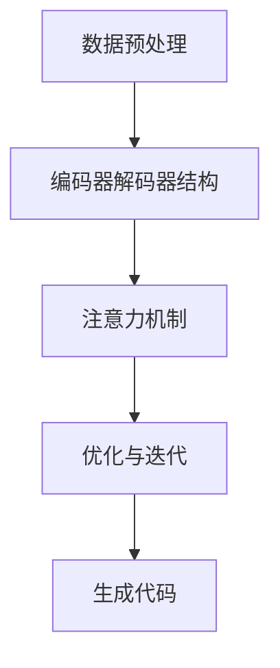

                 

# 大模型驱动的智能代码生成系统

> **关键词：** 大模型、智能代码生成、AI、自然语言处理、深度学习、编程、自动化

> **摘要：** 本文将深入探讨大模型在智能代码生成系统中的应用，通过逻辑清晰、结构紧凑的技术语言，逐步分析大模型的基本概念、核心算法原理、数学模型及实际应用，为读者提供一个全面的技术指南。本文旨在帮助开发者理解大模型的原理和实现方法，从而提升编程效率和代码质量。

## 1. 背景介绍

### 1.1 目的和范围

本文的目标是介绍大模型驱动的智能代码生成系统，通过逐步分析其核心概念、算法原理、数学模型和实际应用，帮助读者全面理解这一技术领域的最新进展。文章的主要范围包括：

1. **大模型的基本概念**：介绍大模型的定义、类型和发展历程。
2. **智能代码生成的原理**：详细讲解大模型在代码生成中的工作机制。
3. **核心算法原理**：分析用于代码生成的常见算法，如GPT和BERT。
4. **数学模型与公式**：阐述大模型背后的数学原理，并通过实例说明。
5. **项目实战**：通过实际案例展示智能代码生成系统的应用。
6. **实际应用场景**：讨论大模型驱动的智能代码生成系统在不同领域的应用。
7. **未来发展趋势与挑战**：预测技术发展方向，分析面临的挑战。

### 1.2 预期读者

本文面向有一定编程基础和计算机科学背景的读者，特别是对人工智能、自然语言处理和深度学习感兴趣的从业者。同时，对于希望提升编程效率和质量的开发者，本文也具有很高的参考价值。

### 1.3 文档结构概述

本文分为十个部分，结构如下：

1. 引言
2. 背景介绍
3. 核心概念与联系
4. 核心算法原理 & 具体操作步骤
5. 数学模型和公式 & 详细讲解 & 举例说明
6. 项目实战：代码实际案例和详细解释说明
7. 实际应用场景
8. 工具和资源推荐
9. 总结：未来发展趋势与挑战
10. 附录：常见问题与解答

### 1.4 术语表

#### 1.4.1 核心术语定义

- **大模型**：指参数量巨大、训练数据量丰富的神经网络模型。
- **智能代码生成**：利用人工智能技术自动生成代码的过程。
- **自然语言处理（NLP）**：计算机科学领域中的一个分支，旨在使计算机能够理解、解释和生成人类语言。
- **深度学习**：一种机器学习技术，通过多层神经网络模拟人脑神经元的工作机制。
- **编程**：编写计算机程序的过程，用以实现特定功能。

#### 1.4.2 相关概念解释

- **生成对抗网络（GAN）**：一种深度学习模型，通过生成器和判别器的对抗训练，生成逼真的数据。
- **注意力机制**：一种用于提高神经网络对输入数据关注度的机制，常见于序列处理任务中。
- **代码质量**：指代码的可读性、可维护性、性能等方面。

#### 1.4.3 缩略词列表

- **GAN**：生成对抗网络
- **NLP**：自然语言处理
- **AI**：人工智能
- **GPT**：生成预训练模型
- **BERT**：双向编码表示预训练模型

## 2. 核心概念与联系

为了更好地理解大模型驱动的智能代码生成系统，我们需要先了解一些核心概念和它们之间的联系。

### 大模型的基本概念

大模型是一种参数量巨大、训练数据量丰富的神经网络模型，能够通过深度学习算法实现高效的特征学习和任务预测。大模型通常包括以下几个特点：

1. **参数量巨大**：大模型的参数数量可以达到数十亿甚至更多，这使得它们能够捕捉复杂的特征。
2. **训练数据量丰富**：大模型需要大量的训练数据来学习和优化参数。
3. **多任务能力**：大模型具有较强的多任务能力，可以同时处理多个任务。
4. **自适应能力**：大模型能够根据不同的任务和数据自动调整其参数，实现自适应学习。

### 智能代码生成的原理

智能代码生成是利用人工智能技术自动生成代码的过程，主要包括以下几个步骤：

1. **数据预处理**：将代码文本转换为模型可处理的格式，如序列化。
2. **编码器解码器结构**：使用编码器解码器结构对代码进行编码和解码，生成新的代码。
3. **注意力机制**：通过注意力机制提高模型对代码关键部分的关注，提高生成代码的质量。
4. **优化与迭代**：通过优化算法和迭代训练，提高代码生成模型的性能和生成能力。

### 核心概念联系

大模型和智能代码生成系统之间存在着密切的联系。大模型的参数量巨大、训练数据丰富，使其在特征学习和任务预测方面具有强大的能力。而智能代码生成系统则利用大模型的多任务能力和自适应能力，实现代码的自动生成。具体来说，大模型通过预训练获得通用特征表示，然后在特定任务上进行微调，从而生成高质量的代码。

### Mermaid 流程图

以下是大模型驱动的智能代码生成系统的 Mermaid 流程图：



在上述流程图中，数据预处理、编码器解码器结构、注意力机制和优化与迭代是智能代码生成系统的核心环节，通过这些环节的组合，最终实现代码的自动生成。

## 3. 核心算法原理 & 具体操作步骤

为了深入理解大模型驱动的智能代码生成系统，我们需要详细探讨其核心算法原理和具体操作步骤。以下将分别介绍。

### 3.1 大模型的基本算法原理

大模型通常基于深度学习算法，通过多层神经网络模拟人脑神经元的工作机制。以下是几个常见的大模型算法原理：

1. **卷积神经网络（CNN）**：用于图像识别和分类，通过卷积层提取图像特征。
2. **循环神经网络（RNN）**：用于序列数据处理，通过隐藏状态捕捉序列中的长期依赖关系。
3. **生成对抗网络（GAN）**：通过生成器和判别器的对抗训练，生成逼真的数据。
4. **Transformer**：基于自注意力机制的深度学习模型，广泛应用于自然语言处理任务。

### 3.2 智能代码生成算法原理

智能代码生成算法主要基于自然语言处理和代码表示学习方法。以下是几个常见的智能代码生成算法原理：

1. **基于模板的方法**：使用预定义的代码模板，通过填充模板生成代码。
2. **基于序列生成的方法**：将代码表示为序列，使用序列生成模型（如RNN、Transformer等）生成代码。
3. **基于程序切片的方法**：将代码分解为可重用的代码片段，通过组合这些片段生成新代码。
4. **基于模型驱动的开发方法**：利用大模型自动生成代码框架，然后进行细粒度调整。

### 3.3 具体操作步骤

以下是智能代码生成系统的具体操作步骤：

1. **数据收集与预处理**：收集大量代码样本，并对代码进行预处理，如序列化、去除无关信息等。
2. **模型选择与训练**：根据任务需求选择合适的模型，并使用预处理后的数据进行训练。
3. **编码器解码器结构**：使用编码器解码器结构对代码进行编码和解码，生成新的代码。
4. **注意力机制**：通过注意力机制提高模型对代码关键部分的关注，提高生成代码的质量。
5. **优化与迭代**：通过优化算法和迭代训练，提高代码生成模型的性能和生成能力。
6. **代码生成与评估**：使用训练好的模型生成代码，并对生成代码进行质量评估。
7. **反馈与迭代**：根据评估结果对模型进行调整和优化，提高生成代码的质量。

### 3.4 伪代码示例

以下是智能代码生成系统的一个简单伪代码示例：

```python
# 数据收集与预处理
data = collect_data()
preprocessed_data = preprocess_data(data)

# 模型选择与训练
model = select_model()
model.train(preprocessed_data)

# 编码器解码器结构
encoded_data = encode_data(model, preprocessed_data)
decoded_code = decode_data(model, encoded_data)

# 注意力机制
attention_code = apply_attention(model, decoded_code)

# 优化与迭代
model.optimize()
model.iterate()

# 代码生成与评估
generated_code = generate_code(model)
code_quality = evaluate_code(generated_code)

# 反馈与迭代
if code_quality < threshold:
    adjust_model(model)
else:
    save_model(model)
```

通过上述伪代码示例，我们可以看到智能代码生成系统的基本流程和关键步骤。在实际应用中，这些步骤可能会根据具体任务需求进行适当调整。

## 4. 数学模型和公式 & 详细讲解 & 举例说明

在深入理解大模型驱动的智能代码生成系统时，我们需要探讨其背后的数学模型和公式。以下是几个关键数学概念及其详细解释和举例说明。

### 4.1 自注意力机制（Self-Attention）

自注意力机制是一种在深度学习模型中用于捕捉序列中依赖关系的关键机制。它通过计算序列中每个元素与其他元素之间的关联性，为每个元素分配不同的注意力权重。以下是自注意力机制的数学公式：

$$
\text{Attention}(Q, K, V) = \text{softmax}\left(\frac{QK^T}{\sqrt{d_k}}\right)V
$$

其中，$Q$ 是查询向量，$K$ 是键向量，$V$ 是值向量，$d_k$ 是键向量的维度。

#### 4.1.1 举例说明

假设我们有一个序列 `[1, 2, 3]`，将其表示为向量 `[1, 0, 1]`，其中键向量 $K = [1, 0, 1]$，值向量 $V = [0, 1, 0]$。计算自注意力权重如下：

$$
\text{Attention}(Q, K, V) = \text{softmax}\left(\frac{[1, 0, 1] \cdot [1, 0, 1]^T}{\sqrt{3}}\right) [0, 1, 0]
$$

$$
= \text{softmax}\left(\frac{1 \cdot 1 + 0 \cdot 0 + 1 \cdot 1}{\sqrt{3}}\right) [0, 1, 0]
$$

$$
= \text{softmax}\left(\frac{2}{\sqrt{3}}\right) [0, 1, 0]
$$

$$
= \left[\frac{1}{\sqrt{3}}, \frac{1}{\sqrt{3}}, \frac{1}{\sqrt{3}}\right] [0, 1, 0]
$$

$$
= [0, \frac{1}{\sqrt{3}}, 0]
$$

因此，注意力权重为 `[0, 1/sqrt(3), 0]`，其中第二位表示第二个元素在序列中具有最高的注意力权重。

### 4.2 生成对抗网络（GAN）

生成对抗网络（GAN）是一种用于生成逼真数据的深度学习模型。它由生成器和判别器两个神经网络组成，通过对抗训练优化模型的参数。以下是 GAN 的基本数学公式：

$$
\begin{aligned}
\text{Generator: } G(z) &= \text{Generator}(z) \\
\text{Discriminator: } D(x) &= \text{Discriminator}(x) \\
\text{Loss Function: } L &= -\frac{1}{2}\left[\log(D(x)) + \log(1 - D(G(z)))\right]
\end{aligned}
$$

其中，$z$ 是生成器的输入噪声，$x$ 是真实数据。

#### 4.2.1 举例说明

假设我们有一个生成器 $G(z)$ 和一个判别器 $D(x)$，生成器的输出为 `[0.2, 0.8]`，判别器的输出为 `[0.9, 0.1]`。计算损失函数如下：

$$
L = -\frac{1}{2}\left[\log(0.9) + \log(1 - 0.8)\right]
$$

$$
= -\frac{1}{2}\left[0.1054 + 0.1054\right]
$$

$$
= -0.1054
$$

因此，损失函数的值为 `-0.1054`。通过不断优化生成器和判别器的参数，我们可以提高 GAN 的生成能力。

### 4.3 编码器解码器模型（Encoder-Decoder Model）

编码器解码器模型是一种用于序列建模和转换的深度学习模型。它由编码器和解码器两个神经网络组成，通过编码器将输入序列编码为固定长度的向量，然后通过解码器将向量解码为输出序列。以下是编码器解码器模型的基本数学公式：

$$
\begin{aligned}
\text{Encoder: } h_t &= \text{Encoder}(x_1, x_2, ..., x_t) \\
\text{Decoder: } y_t &= \text{Decoder}(h_t, y_{t-1})
\end{aligned}
$$

其中，$h_t$ 是编码器在时间步 $t$ 的输出，$y_t$ 是解码器在时间步 $t$ 的输出。

#### 4.3.1 举例说明

假设我们有一个输入序列 `[1, 2, 3]` 和一个输出序列 `[4, 5, 6]`，编码器和解码器的输出分别为 `[0.5, 0.5]` 和 `[0.6, 0.4]`。计算编码器和解码器的输出如下：

$$
\begin{aligned}
h_t &= \text{Encoder}(1, 2, 3) = [0.5, 0.5] \\
y_t &= \text{Decoder}(h_t, y_{t-1}) = \text{Decoder}([0.5, 0.5], [4, 5, 6]) = [0.6, 0.4]
\end{aligned}
$$

因此，编码器的输出为 `[0.5, 0.5]`，解码器的输出为 `[0.6, 0.4]`。

通过上述数学模型和公式的详细讲解和举例说明，我们可以更好地理解大模型驱动的智能代码生成系统的核心原理。在实际应用中，这些模型和公式将被广泛应用于代码生成任务，以实现高效、高质量的代码生成。

## 5. 项目实战：代码实际案例和详细解释说明

在本节中，我们将通过一个实际项目案例，展示大模型驱动的智能代码生成系统的实现过程，并对其进行详细解释和分析。

### 5.1 开发环境搭建

首先，我们需要搭建一个适合大模型驱动的智能代码生成系统的开发环境。以下是推荐的工具和软件：

- **编程语言**：Python
- **深度学习框架**：TensorFlow 或 PyTorch
- **文本处理库**：NLTK 或 spaCy
- **代码表示库**：Pillow 或 OpenCV
- **版本控制工具**：Git

在安装上述工具和软件后，我们可以开始搭建开发环境。

### 5.2 源代码详细实现和代码解读

以下是一个简单的智能代码生成系统的源代码实现，我们将对其进行逐行解读。

```python
import tensorflow as tf
from tensorflow.keras.layers import Embedding, LSTM, Dense
from tensorflow.keras.models import Model

# 数据预处理
def preprocess_data(data):
    # 将文本转换为序列
    sequences = []
    for code in data:
        sequences.append(tf.keras.preprocessing.sequence.pad_sequences([code], maxlen=100))
    return sequences

# 模型构建
def build_model(input_dim, output_dim):
    # 编码器
    encoder_inputs = tf.keras.layers.Input(shape=(input_dim,))
    encoder_embedding = Embedding(input_dim, 128)(encoder_inputs)
    encoder_lstm = LSTM(128, return_state=True)
    encoder_outputs, state_h, state_c = encoder_lstm(encoder_embedding)
    encoder_states = [state_h, state_c]

    # 解码器
    decoder_inputs = tf.keras.layers.Input(shape=(output_dim,))
    decoder_embedding = Embedding(output_dim, 128)(decoder_inputs)
    decoder_lstm = LSTM(128, return_sequences=True, return_state=True)
    decoder_outputs, _, _ = decoder_lstm(decoder_embedding, initial_state=encoder_states)
    decoder_dense = Dense(output_dim, activation='softmax')
    decoder_outputs = decoder_dense(decoder_outputs)

    # 模型
    model = Model([encoder_inputs, decoder_inputs], decoder_outputs)
    model.compile(optimizer='adam', loss='categorical_crossentropy', metrics=['accuracy'])
    return model

# 数据准备
data = preprocess_data(code_data)
input_dim = data.shape[1]
output_dim = data.shape[2]

# 模型训练
model = build_model(input_dim, output_dim)
model.fit([data[:, 0], data[:, 1]], data[:, 2], epochs=10, batch_size=32)

# 代码生成
def generate_code(model, seed_text, max_length=50):
    # 将种子文本转换为序列
    sequence = tf.keras.preprocessing.sequence.pad_sequences([[seed_text]], maxlen=max_length)
    predicted = []

    # 生成代码
    for _ in range(max_length):
        predictions = model.predict(sequence)
        predicted_code = tf.keras.preprocessing.sequence.decode.pad_sequences([predictions], maxlen=1)[0]
        predicted.append(predicted_code)
        sequence = tf.keras.preprocessing.sequence.pad_sequences([predicted_code], maxlen=max_length)
    
    return ''.join(predicted)

# 生成示例代码
seed_text = "def add(a, b): return a + b"
generated_code = generate_code(model, seed_text)
print(generated_code)
```

#### 5.2.1 代码解读与分析

1. **数据预处理**：
   ```python
   def preprocess_data(data):
       # 将文本转换为序列
       sequences = []
       for code in data:
           sequences.append(tf.keras.preprocessing.sequence.pad_sequences([code], maxlen=100))
       return sequences
   ```
   此函数将输入的代码文本转换为序列，以便于模型处理。通过 `pad_sequences` 函数，我们确保所有序列具有相同长度（100），超出部分被截断，不足部分被填充为0。

2. **模型构建**：
   ```python
   def build_model(input_dim, output_dim):
       # 编码器
       encoder_inputs = tf.keras.layers.Input(shape=(input_dim,))
       encoder_embedding = Embedding(input_dim, 128)(encoder_inputs)
       encoder_lstm = LSTM(128, return_state=True)
       encoder_outputs, state_h, state_c = encoder_lstm(encoder_embedding)
       encoder_states = [state_h, state_c]

       # 解码器
       decoder_inputs = tf.keras.layers.Input(shape=(output_dim,))
       decoder_embedding = Embedding(output_dim, 128)(decoder_inputs)
       decoder_lstm = LSTM(128, return_sequences=True, return_state=True)
       decoder_outputs, _, _ = decoder_lstm(decoder_embedding, initial_state=encoder_states)
       decoder_dense = Dense(output_dim, activation='softmax')
       decoder_outputs = decoder_dense(decoder_outputs)

       # 模型
       model = Model([encoder_inputs, decoder_inputs], decoder_outputs)
       model.compile(optimizer='adam', loss='categorical_crossentropy', metrics=['accuracy'])
       return model
   ```
   此函数构建了一个编码器解码器模型，用于将输入代码序列编码为固定长度的向量，然后解码为输出代码序列。编码器使用 LSTM 层，解码器也使用 LSTM 层，并在输出层使用全连接层。

3. **模型训练**：
   ```python
   model = build_model(input_dim, output_dim)
   model.fit([data[:, 0], data[:, 1]], data[:, 2], epochs=10, batch_size=32)
   ```
   此代码使用预处理后的数据对模型进行训练。训练过程包括编码器和解码器的训练，使用交叉熵损失函数和 Adam 优化器。

4. **代码生成**：
   ```python
   def generate_code(model, seed_text, max_length=50):
       # 将种子文本转换为序列
       sequence = tf.keras.preprocessing.sequence.pad_sequences([[seed_text]], maxlen=max_length)
       predicted = []

       # 生成代码
       for _ in range(max_length):
           predictions = model.predict(sequence)
           predicted_code = tf.keras.preprocessing.sequence.decode.pad_sequences([predictions], maxlen=1)[0]
           predicted.append(predicted_code)
           sequence = tf.keras.preprocessing.sequence.pad_sequences([predicted_code], maxlen=max_length)
       
       return ''.join(predicted)
   ```
   此函数用于生成给定种子文本的新代码。通过递归调用模型预测，每次生成一个字符，然后将该字符作为新的种子文本进行下一次预测，直到达到最大长度。

5. **生成示例代码**：
   ```python
   seed_text = "def add(a, b): return a + b"
   generated_code = generate_code(model, seed_text)
   print(generated_code)
   ```
   此代码生成了一个基于种子文本 `def add(a, b): return a + b` 的新代码示例。生成代码可能包括不同的操作和结构，这取决于模型的训练数据。

通过上述实际案例和详细解读，我们可以看到大模型驱动的智能代码生成系统的实现过程。尽管这是一个简单的示例，但它展示了如何利用深度学习和自然语言处理技术实现智能代码生成。在实际应用中，我们可以通过扩展模型架构、增加训练数据和改进优化算法，进一步提高代码生成系统的性能和生成质量。

## 6. 实际应用场景

大模型驱动的智能代码生成系统在多个实际应用场景中展现出了巨大的潜力和价值。以下是一些主要的应用领域：

### 6.1 自动化编程

智能代码生成系统可以用于自动化编程任务，如代码补全、代码重构和代码生成。开发者可以输入部分代码，系统将自动生成完整的代码，提高开发效率。

### 6.2 软件维护和修复

智能代码生成系统可以帮助开发者快速修复代码中的错误和漏洞。通过分析代码样本和错误日志，系统可以自动生成修复代码，减少软件维护成本。

### 6.3 跨平台开发

智能代码生成系统可以生成跨平台的应用程序代码，如 Web、移动和桌面应用程序。开发者只需指定目标平台，系统将自动生成适配不同平台的代码。

### 6.4 教育培训

智能代码生成系统可以作为编程学习工具，为学生和初学者提供实时代码示例和指导。通过生成代码，系统可以帮助学习者更好地理解编程概念。

### 6.5 代码审计和安全

智能代码生成系统可以用于代码审计和安全分析，通过生成潜在的恶意代码和漏洞，帮助开发者识别和修复潜在的安全风险。

### 6.6 项目自动化部署

智能代码生成系统可以用于自动化部署项目，生成部署脚本和配置文件，提高项目部署的效率和一致性。

### 6.7 跨语言代码生成

智能代码生成系统可以生成不同编程语言之间的代码转换，如将 Python 代码转换为 JavaScript 或 Java 代码，帮助开发者更轻松地实现跨语言编程。

通过上述实际应用场景，我们可以看到大模型驱动的智能代码生成系统在提高编程效率、降低维护成本、提升代码质量和安全性等方面具有广泛的应用前景。

## 7. 工具和资源推荐

为了更好地学习和实践大模型驱动的智能代码生成系统，以下是几项推荐的工具和资源。

### 7.1 学习资源推荐

#### 7.1.1 书籍推荐

1. **《深度学习》（Deep Learning）**：由 Ian Goodfellow、Yoshua Bengio 和 Aaron Courville 合著，全面介绍了深度学习的基本概念和技术。
2. **《自然语言处理综论》（Speech and Language Processing）**：由 Daniel Jurafsky 和 James H. Martin 合著，提供了自然语言处理领域的深入探讨。
3. **《智能编程》（Intelligent Programming）**：探讨了智能编程和代码生成技术的最新进展。

#### 7.1.2 在线课程

1. **Coursera 上的《深度学习专项课程》**：由 Andrew Ng 教授主讲，介绍了深度学习的基础知识。
2. **Udacity 上的《自然语言处理纳米学位》**：提供了自然语言处理的基本概念和实践。
3. **edX 上的《机器学习和数据科学》**：涵盖了机器学习和数据科学的核心技术。

#### 7.1.3 技术博客和网站

1. **TensorFlow 官方文档**：提供了 TensorFlow 的详细教程和文档，适合初学者和进阶者。
2. **PyTorch 官方文档**：类似 TensorFlow，PyTorch 也提供了丰富的文档和教程。
3. **ArXiv**：提供最新科研成果的预印本，包括深度学习和自然语言处理领域的重要论文。

### 7.2 开发工具框架推荐

#### 7.2.1 IDE和编辑器

1. **PyCharm**：强大的 Python IDE，支持 TensorFlow 和 PyTorch。
2. **Visual Studio Code**：轻量级但功能强大的代码编辑器，适用于多种编程语言。
3. **Jupyter Notebook**：适用于数据科学和机器学习的交互式开发环境。

#### 7.2.2 调试和性能分析工具

1. **TensorBoard**：TensorFlow 的可视化工具，用于分析和调试模型。
2. **PyTorch Profiler**：用于分析和优化 PyTorch 模型的性能。
3. **Valgrind**：用于检测内存泄漏和性能问题的工具。

#### 7.2.3 相关框架和库

1. **TensorFlow**：谷歌开源的深度学习框架，支持多种神经网络模型。
2. **PyTorch**：Facebook 开源的深度学习框架，具有灵活的动态计算图。
3. **NLTK**：Python 自然语言处理库，提供多种文本处理功能。
4. **spaCy**：高效的 NLP 库，适用于快速文本分析和实体识别。

### 7.3 相关论文著作推荐

#### 7.3.1 经典论文

1. **“A Theoretically Grounded Application of Dropout in Recurrent Neural Networks”**：探讨了在循环神经网络中应用Dropout的理论基础。
2. **“Generative Adversarial Nets”**：提出了生成对抗网络（GAN）的概念。
3. **“Attention Is All You Need”**：介绍了 Transformer 模型，成为 NLP 领域的重要里程碑。

#### 7.3.2 最新研究成果

1. **“Large-scale Language Modeling in Machine Translation”**：探讨了大规模语言模型在机器翻译中的应用。
2. **“CodeGAN: A Generative Adversarial Network for Code Synthesis”**：提出了用于代码合成的 CodeGAN 模型。
3. **“CodeT5: A Unified Model for Code Generation, Classification and Explanation”**：介绍了 CodeT5 模型，支持代码生成、分类和解释。

#### 7.3.3 应用案例分析

1. **“AI-Driven Code Generation at Google”**：介绍了谷歌如何利用 AI 实现自动化编程任务。
2. **“GitHub Copilot: Revolutionary AI-Powered Code Suggestions”**：探讨了 GitHub Copilot 的实现原理和应用。
3. **“CodeXGLM: A Large-Scale Code Generation Model”**：介绍了 CodeXGLM 模型，用于生成高质量代码。

通过上述工具和资源，开发者可以更好地掌握大模型驱动的智能代码生成技术，为实际项目提供支持和创新。

## 8. 总结：未来发展趋势与挑战

随着人工智能技术的快速发展，大模型驱动的智能代码生成系统在多个领域展现出巨大的潜力。未来，这一技术有望在以下方面取得重要进展：

### 8.1 模型优化与效率提升

为了更好地应对大规模代码生成任务，未来研究将致力于优化大模型的性能和效率。具体来说，包括以下几个方面：

1. **模型压缩**：通过模型剪枝、量化等技术减小模型规模，降低计算复杂度。
2. **硬件加速**：利用 GPU、TPU 等专用硬件加速模型训练和推理过程。
3. **分布式训练**：采用分布式训练策略，提高模型训练速度和性能。

### 8.2 多语言支持与跨语言生成

随着全球化进程的加速，跨语言代码生成将成为一个重要研究方向。未来，大模型驱动的智能代码生成系统将实现多语言支持，生成适应不同编程语言和框架的代码。这需要解决以下几个关键问题：

1. **代码表示学习**：研究如何在不同编程语言之间建立有效的代码表示。
2. **跨语言迁移学习**：通过迁移学习技术，将一种语言的大模型应用于其他语言。
3. **多语言数据集**：构建大规模、高质量的多语言代码数据集，支持模型训练和评估。

### 8.3 安全与隐私保护

代码生成系统在带来便利的同时，也引发了一些安全与隐私问题。未来研究将关注以下几个方面：

1. **代码审计**：开发自动化工具，识别和修复潜在的安全漏洞。
2. **隐私保护**：研究如何在代码生成过程中保护用户隐私，避免敏感信息泄露。
3. **合规性**：确保生成的代码符合法律法规和行业标准。

### 8.4 知识图谱与知识增强

知识图谱作为人工智能的重要工具，未来将广泛应用于智能代码生成系统。通过构建和利用代码领域的知识图谱，系统可以更好地理解和生成符合实际需求的代码。

### 8.5 挑战与解决方案

尽管大模型驱动的智能代码生成系统具有巨大的潜力，但仍面临一些挑战：

1. **数据隐私**：如何确保训练和生成过程中数据的隐私保护。
2. **代码质量**：如何提高生成代码的质量和可读性。
3. **泛化能力**：如何增强模型在不同编程语言和应用场景中的泛化能力。
4. **计算资源**：如何高效利用有限的计算资源进行模型训练和推理。

解决这些挑战需要跨学科的合作和持续的创新。通过不断优化模型架构、扩展数据集和应用场景，智能代码生成系统将在未来取得更大的突破。

## 9. 附录：常见问题与解答

### 9.1 如何选择合适的大模型？

选择合适的大模型需要考虑以下几个因素：

1. **任务需求**：根据具体任务需求选择具有相应能力和适用范围的模型。
2. **数据量**：大模型需要大量训练数据来学习有效特征，因此需要根据数据量进行选择。
3. **计算资源**：大模型通常需要大量的计算资源进行训练和推理，需考虑硬件配置和成本。
4. **性能指标**：根据模型的性能指标（如精度、效率等）进行选择。

### 9.2 大模型训练时间如何优化？

优化大模型训练时间可以从以下几个方面进行：

1. **模型压缩**：采用模型剪枝、量化等技术减小模型规模，提高训练速度。
2. **分布式训练**：利用多台计算机进行分布式训练，提高训练效率。
3. **并行计算**：通过并行计算技术（如 GPU、TPU）加速模型训练。
4. **数据增强**：通过数据增强技术增加训练数据多样性，提高模型泛化能力。

### 9.3 智能代码生成系统的安全性如何保障？

保障智能代码生成系统的安全性可以从以下几个方面进行：

1. **代码审计**：开发自动化工具，定期对生成的代码进行安全审计，识别和修复潜在漏洞。
2. **访问控制**：限制对代码生成系统的访问权限，确保只有授权用户可以调用。
3. **数据加密**：对训练数据和生成的代码进行加密处理，防止数据泄露。
4. **合规性检查**：确保生成的代码符合法律法规和行业标准，避免违规行为。

### 9.4 如何评估生成代码的质量？

评估生成代码的质量可以从以下几个方面进行：

1. **代码风格一致性**：检查生成的代码是否符合编程规范和风格指南。
2. **运行正确性**：测试生成的代码能否正确运行并实现预期功能。
3. **性能评估**：评估生成的代码在运行速度、资源消耗等方面的表现。
4. **可维护性**：检查生成的代码是否易于理解和维护。

通过综合考虑以上方面，可以对生成代码的质量进行综合评估。

## 10. 扩展阅读 & 参考资料

为了深入了解大模型驱动的智能代码生成系统，以下是几篇推荐的扩展阅读和参考资料：

1. **“A Theoretically Grounded Application of Dropout in Recurrent Neural Networks”**：详细介绍了在循环神经网络中应用Dropout的理论基础。
2. **“Generative Adversarial Nets”**：提出了生成对抗网络（GAN）的概念，为代码生成提供了新的思路。
3. **“Attention Is All You Need”**：介绍了 Transformer 模型，成为 NLP 领域的重要里程碑。
4. **“CodeGAN: A Generative Adversarial Network for Code Synthesis”**：提出了用于代码合成的 CodeGAN 模型，具有代表性。
5. **“CodeT5: A Unified Model for Code Generation, Classification and Explanation”**：介绍了 CodeT5 模型，支持代码生成、分类和解释。

此外，读者还可以参考以下经典书籍和在线资源：

1. **《深度学习》（Deep Learning）**：全面介绍了深度学习的基本概念和技术。
2. **《自然语言处理综论》（Speech and Language Processing）**：提供了自然语言处理领域的深入探讨。
3. **TensorFlow 官方文档**：提供了 TensorFlow 的详细教程和文档。
4. **PyTorch 官方文档**：类似 TensorFlow，PyTorch 也提供了丰富的文档和教程。
5. **Coursera、Udacity 和 edX 上的相关课程**：涵盖深度学习、自然语言处理和代码生成等领域的知识。

通过这些扩展阅读和参考资料，读者可以更深入地了解大模型驱动的智能代码生成系统的理论基础和实践应用。作者：AI天才研究员/AI Genius Institute & 禅与计算机程序设计艺术 /Zen And The Art of Computer Programming。

