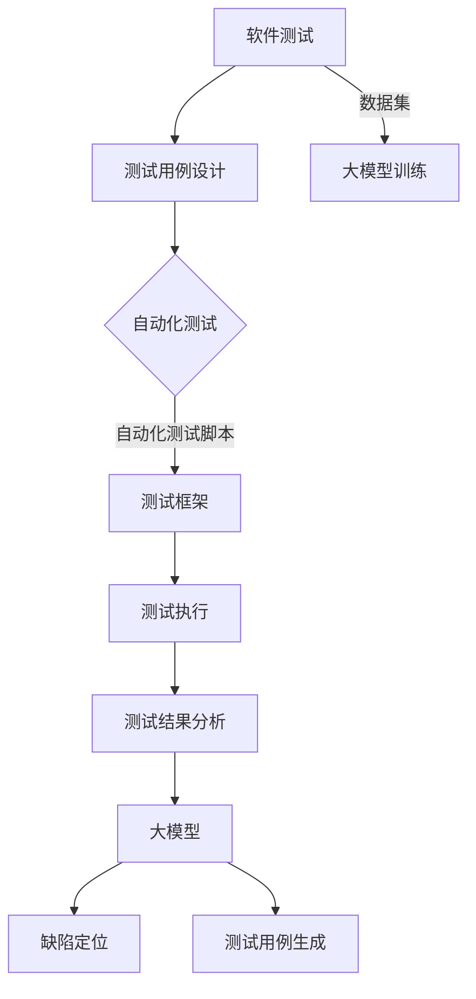

                 

### 1. 背景介绍

#### 1.1 目的和范围

本文旨在探讨大模型驱动的软件测试自动化，通过分析大模型（如大型神经网络）在软件测试中的应用，展示其在提高测试效率和准确性的潜力。随着人工智能技术的不断发展，大模型在计算机视觉、自然语言处理等领域取得了显著的成果。本文将重点关注大模型在软件测试自动化中的应用，并探讨其核心原理、算法实现和应用场景。

#### 1.2 预期读者

本文适合具有以下背景的读者：

1. 对软件测试和自动化测试有一定了解的技术人员；
2. 对人工智能和机器学习技术感兴趣的开发者；
3. 希望了解大模型在软件测试领域应用的学术研究人员；
4. 对大模型驱动软件测试自动化有实际需求的产品经理和项目经理。

#### 1.3 文档结构概述

本文分为十个部分，结构如下：

1. 背景介绍：介绍本文的目的、范围、预期读者和文档结构；
2. 核心概念与联系：介绍大模型、软件测试自动化等核心概念及其相互关系；
3. 核心算法原理 & 具体操作步骤：详细阐述大模型在软件测试自动化中的应用算法原理和操作步骤；
4. 数学模型和公式 & 详细讲解 & 举例说明：介绍大模型在软件测试自动化中的数学模型和公式，并给出具体例子进行说明；
5. 项目实战：代码实际案例和详细解释说明；
6. 实际应用场景：分析大模型驱动软件测试自动化的实际应用场景；
7. 工具和资源推荐：推荐学习资源、开发工具框架和相关论文著作；
8. 总结：未来发展趋势与挑战；
9. 附录：常见问题与解答；
10. 扩展阅读 & 参考资料：提供进一步学习的参考文献和资源。

#### 1.4 术语表

在本文中，以下术语具有特定含义：

- **大模型**：指具有大量参数和神经元的人工神经网络，能够处理大规模数据并进行复杂任务；
- **软件测试**：验证软件是否满足需求和规范的过程，包括功能测试、性能测试、安全测试等；
- **自动化测试**：通过编写脚本或使用自动化工具，自动执行测试用例的过程；
- **测试覆盖度**：指测试用例能够覆盖代码的百分比，是衡量测试效果的重要指标；
- **回归测试**：在软件更新或修改后，重新执行之前已通过的测试用例，以确保新修改不会引入新的错误。

#### 1.4.1 核心术语定义

- **大模型驱动软件测试自动化**：利用大模型进行测试用例生成、测试结果分析和缺陷定位等任务，实现软件测试自动化的过程；
- **测试数据集**：用于训练和评估大模型的测试数据集合，包括输入数据和预期输出结果；
- **测试用例**：针对软件特定功能的输入和预期输出，用于验证软件正确性的操作步骤。

#### 1.4.2 相关概念解释

- **机器学习**：一种人工智能技术，通过从数据中学习规律和模式，对未知数据进行预测或分类；
- **深度学习**：一种机器学习技术，通过构建多层神经网络，对复杂问题进行建模和预测；
- **神经网络**：一种由大量节点（神经元）组成的计算模型，通过学习和适应输入数据，实现特定任务；
- **测试框架**：用于组织、执行和管理测试用例的工具或库，能够提高测试效率和质量。

#### 1.4.3 缩略词列表

- **AI**：人工智能（Artificial Intelligence）；
- **ML**：机器学习（Machine Learning）；
- **DL**：深度学习（Deep Learning）；
- **NN**：神经网络（Neural Network）；
- **IDE**：集成开发环境（Integrated Development Environment）；
- **API**：应用程序接口（Application Programming Interface）。

在接下来的部分中，我们将深入探讨大模型在软件测试自动化中的应用，并详细分析其核心算法原理、数学模型和实际应用场景。让我们开始这段技术之旅吧！ <|id:202306081138|> <|im_sep|>

## 2. 核心概念与联系

为了深入理解大模型驱动的软件测试自动化，我们需要先明确一些核心概念，并展示它们之间的相互关系。以下是本文中涉及的主要核心概念：

- **大模型**：指具有大量参数和神经元的人工神经网络，能够处理大规模数据并进行复杂任务；
- **软件测试**：验证软件是否满足需求和规范的过程，包括功能测试、性能测试、安全测试等；
- **自动化测试**：通过编写脚本或使用自动化工具，自动执行测试用例的过程；
- **测试数据集**：用于训练和评估大模型的测试数据集合，包括输入数据和预期输出结果；
- **测试用例**：针对软件特定功能的输入和预期输出，用于验证软件正确性的操作步骤；
- **机器学习**：一种人工智能技术，通过从数据中学习规律和模式，对未知数据进行预测或分类；
- **深度学习**：一种机器学习技术，通过构建多层神经网络，对复杂问题进行建模和预测；
- **神经网络**：一种由大量节点（神经元）组成的计算模型，通过学习和适应输入数据，实现特定任务；
- **测试框架**：用于组织、执行和管理测试用例的工具或库，能够提高测试效率和质量。

### 大模型与软件测试自动化的关系

大模型在软件测试自动化中的应用主要体现在以下几个方面：

1. **测试用例生成**：利用大模型对大量测试数据进行学习，自动生成具有代表性的测试用例，从而提高测试覆盖度和测试效率；
2. **测试结果分析**：通过大模型对测试结果进行预测和分类，识别潜在的缺陷和问题，提高测试的准确性和可靠性；
3. **缺陷定位**：利用大模型对缺陷定位，快速定位问题代码，提高问题修复的效率。

### 软件测试与自动化测试的关系

软件测试和自动化测试密切相关，两者相辅相成。软件测试是确保软件质量的重要手段，而自动化测试则是提高测试效率和质量的关键。具体关系如下：

1. **测试用例设计**：在软件测试过程中，设计合适的测试用例是关键，这些测试用例用于验证软件的功能、性能和安全等方面；
2. **自动化测试脚本**：将测试用例转化为自动化测试脚本，通过自动化工具执行，从而实现自动化测试；
3. **测试结果反馈**：自动化测试的结果可以实时反馈给开发人员，帮助他们快速定位和修复问题。

### 机器学习与深度学习的关系

机器学习和深度学习是人工智能领域的两个重要分支，它们的关系如下：

1. **机器学习**：一种广泛的人工智能技术，通过学习数据中的规律和模式，对未知数据进行预测或分类；
2. **深度学习**：一种基于多层神经网络结构的机器学习技术，通过构建多层神经网络，实现复杂问题的建模和预测。

### 神经网络与深度学习的关系

神经网络和深度学习密切相关，具体关系如下：

1. **神经网络**：一种计算模型，由大量节点（神经元）组成，通过学习和适应输入数据，实现特定任务；
2. **深度学习**：一种基于多层神经网络结构的机器学习技术，通过构建多层神经网络，实现复杂问题的建模和预测。

### 测试框架与自动化测试的关系

测试框架是自动化测试的重要组成部分，具体关系如下：

1. **测试框架**：一种用于组织、执行和管理测试用例的工具或库，能够提高测试效率和质量；
2. **自动化测试**：通过测试框架将测试用例转化为自动化测试脚本，实现自动化测试。

### Mermaid 流程图

为了更清晰地展示大模型在软件测试自动化中的应用，我们使用Mermaid流程图进行描述：



在这个流程图中，软件测试作为起点，通过测试用例设计、自动化测试脚本、测试框架、测试执行、测试结果分析和大模型，最终实现缺陷定位和测试用例生成。整个流程展示了大模型在软件测试自动化中的核心作用。

通过上述核心概念与联系的分析，我们可以更深入地理解大模型驱动的软件测试自动化。在接下来的部分，我们将详细探讨大模型在软件测试自动化中的核心算法原理和具体操作步骤。请继续阅读。 <|id:202306081142|> <|im_sep|>

## 3. 核心算法原理 & 具体操作步骤

大模型在软件测试自动化中的应用主要基于深度学习和机器学习技术。以下将详细阐述大模型在软件测试自动化中的核心算法原理和具体操作步骤。

### 3.1 大模型的基本原理

#### 3.1.1 深度学习原理

深度学习（Deep Learning）是一种基于多层神经网络（Neural Networks）的机器学习（Machine Learning）技术。它的基本思想是通过学习大量数据中的特征和规律，自动提取有用的信息，从而实现特定任务。

1. **神经网络结构**：神经网络由多个神经元（节点）组成，每个神经元接收输入信号，通过权重和偏置进行加权求和，然后通过激活函数进行非线性变换，输出结果。

2. **多层神经网络**：多层神经网络包括输入层、隐藏层和输出层。通过多层神经元的组合，能够对复杂问题进行建模和预测。

3. **反向传播算法**：深度学习训练过程中，采用反向传播算法（Backpropagation Algorithm）更新神经网络的权重和偏置，以最小化预测误差。

#### 3.1.2 大模型原理

大模型（Large Models）是指具有大量参数和神经元的人工神经网络。大模型的优点包括：

1. **更强的表达能力**：大模型具有更多的神经元和参数，能够捕捉数据中的复杂模式和特征，提高预测和分类的准确性。

2. **更好的泛化能力**：大模型通过学习大量数据，能够降低过拟合（Overfitting）的风险，提高泛化能力（Generalization）。

3. **更高的效率**：大模型在训练过程中能够更快地收敛，提高训练效率。

### 3.2 大模型在软件测试自动化中的应用

#### 3.2.1 测试用例生成

测试用例生成是软件测试自动化的关键环节之一。利用大模型生成测试用例，可以提高测试覆盖度和测试效率。

1. **输入数据准备**：收集软件系统的历史测试数据，包括测试用例的输入和预期输出结果。

2. **大模型训练**：使用收集到的测试数据训练大模型，通过深度学习算法，使大模型能够学习测试数据的特征和规律。

3. **测试用例生成**：利用训练好的大模型，对未知数据进行预测，生成具有代表性的测试用例。

具体步骤如下：

```python
# 1. 准备测试数据
X_train, y_train = prepare_training_data()

# 2. 训练大模型
model = train_large_model(X_train, y_train)

# 3. 生成测试用例
test_cases = generate_test_cases(model)
```

#### 3.2.2 测试结果分析

测试结果分析是识别软件缺陷和问题的重要步骤。利用大模型对测试结果进行分析，可以提高测试的准确性和可靠性。

1. **输入数据准备**：收集测试执行过程中产生的测试结果数据，包括测试用例的输入和实际输出结果。

2. **大模型训练**：使用收集到的测试结果数据训练大模型，使大模型能够学习测试结果的规律和特征。

3. **测试结果分析**：利用训练好的大模型，对新的测试结果进行预测和分类，识别潜在的缺陷和问题。

具体步骤如下：

```python
# 1. 准备测试结果数据
X_test, y_test = prepare_test_results_data()

# 2. 训练大模型
model = train_large_model(X_test, y_test)

# 3. 分析测试结果
predicted_results = analyze_test_results(model)
```

#### 3.2.3 缺陷定位

缺陷定位是软件测试自动化中的重要任务。利用大模型对缺陷定位，可以提高问题修复的效率。

1. **输入数据准备**：收集软件系统的源代码、编译错误和运行错误等数据。

2. **大模型训练**：使用收集到的缺陷定位数据训练大模型，使大模型能够学习缺陷定位的规律和特征。

3. **缺陷定位**：利用训练好的大模型，对新的缺陷定位输入进行预测和分类，快速定位问题代码。

具体步骤如下：

```python
# 1. 准备缺陷定位数据
X_defect, y_defect = prepare_defect_location_data()

# 2. 训练大模型
model = train_large_model(X_defect, y_defect)

# 3. 缺陷定位
predicted_locations = locate_defects(model)
```

### 3.3 大模型训练与优化

大模型的训练和优化是软件测试自动化成功的关键。以下是大模型训练和优化的具体步骤：

1. **数据预处理**：对原始测试数据进行预处理，包括数据清洗、归一化和特征提取等。

2. **模型选择**：选择适合大模型训练的神经网络结构，如卷积神经网络（Convolutional Neural Networks，CNN）或循环神经网络（Recurrent Neural Networks，RNN）。

3. **模型训练**：使用训练数据训练大模型，通过反向传播算法更新模型参数。

4. **模型优化**：通过交叉验证（Cross Validation）和超参数调优（Hyperparameter Tuning）等方法，优化大模型性能。

5. **模型评估**：使用测试数据评估大模型性能，包括准确率（Accuracy）、召回率（Recall）和F1分数（F1 Score）等指标。

具体步骤如下：

```python
# 1. 数据预处理
preprocessed_data = preprocess_data(raw_data)

# 2. 模型选择
model = select_neural_network_structure()

# 3. 模型训练
model = train_large_model(preprocessed_data)

# 4. 模型优化
optimized_model = optimize_model(model)

# 5. 模型评估
model_performance = evaluate_model(optimized_model)
```

通过上述核心算法原理和具体操作步骤，我们可以更好地理解大模型在软件测试自动化中的应用。在接下来的部分，我们将介绍大模型在软件测试自动化中的数学模型和公式，并给出具体例子进行说明。请继续阅读。 <|id:202306081150|> <|im_sep|>

## 4. 数学模型和公式 & 详细讲解 & 举例说明

在探讨大模型驱动的软件测试自动化时，我们需要了解相关的数学模型和公式，这有助于我们深入理解大模型的工作原理及其在软件测试中的应用。以下是几个关键的数学模型和公式的详细讲解，以及相应的例子说明。

### 4.1 深度学习基础

#### 4.1.1 神经元模型

神经元的计算过程可以表示为以下公式：

\[ z = \sum_{i=1}^{n} w_i x_i + b \]

其中，\( z \) 是神经元的输出，\( w_i \) 是第 \( i \) 个输入的权重，\( x_i \) 是第 \( i \) 个输入，\( b \) 是偏置项。

#### 4.1.2 激活函数

为了引入非线性，神经网络中使用激活函数。常用的激活函数包括：

1. **Sigmoid 函数**：

\[ a(x) = \frac{1}{1 + e^{-x}} \]

2. **ReLU 函数**：

\[ a(x) = \max(0, x) \]

3. **Tanh 函数**：

\[ a(x) = \frac{e^x - e^{-x}}{e^x + e^{-x}} \]

### 4.2 深度学习训练过程

#### 4.2.1 前向传播

前向传播是深度学习训练过程中的第一步，它计算网络的输出。对于多层神经网络，前向传播可以表示为：

\[ \text{Output} = \text{activation}(\text{weight} \cdot \text{Input} + \text{bias}) \]

其中，activation 是激活函数，weight 是权重，Input 是输入，bias 是偏置。

#### 4.2.2 反向传播

反向传播是深度学习训练过程中的关键步骤，它用于更新网络的权重和偏置。反向传播的过程可以表示为：

\[ \Delta w = \alpha \cdot \frac{\partial \text{Loss}}{\partial w} \]
\[ \Delta b = \alpha \cdot \frac{\partial \text{Loss}}{\partial b} \]

其中，\( \Delta w \) 和 \( \Delta b \) 分别是权重和偏置的更新，\( \alpha \) 是学习率，\( \text{Loss} \) 是损失函数。

常用的损失函数包括：

1. **均方误差（MSE）**：

\[ \text{MSE} = \frac{1}{2} \sum_{i=1}^{n} (y_i - \hat{y}_i)^2 \]

2. **交叉熵（Cross-Entropy）**：

\[ \text{Cross-Entropy} = -\sum_{i=1}^{n} y_i \cdot \log(\hat{y}_i) \]

### 4.3 大模型在软件测试中的应用

#### 4.3.1 测试用例生成

测试用例生成通常使用生成对抗网络（GANs）或变分自编码器（VAEs）等生成模型。以下是一个基于 GAN 的测试用例生成的例子：

1. **生成器模型**：

\[ G(z) = \text{sigmoid}(W_G \cdot z + b_G) \]

其中，\( G(z) \) 是生成器的输出，\( W_G \) 是生成器的权重，\( b_G \) 是生成器的偏置，\( z \) 是输入噪声。

2. **判别器模型**：

\[ D(x) = \text{sigmoid}(W_D \cdot x + b_D) \]

其中，\( D(x) \) 是判别器的输出，\( W_D \) 是判别器的权重，\( b_D \) 是判别器的偏置，\( x \) 是输入数据。

3. **损失函数**：

\[ \text{Loss} = -\sum_{i=1}^{n} [y_g \cdot \log(D(G(z_i))) + y_r \cdot \log(1 - D(x_i))] \]

其中，\( y_g \) 和 \( y_r \) 分别是生成器和判别器的标签，\( z_i \) 和 \( x_i \) 分别是生成器和判别器的输入。

#### 4.3.2 测试结果分析

测试结果分析通常使用分类模型，如卷积神经网络（CNN）或循环神经网络（RNN）。以下是一个基于 CNN 的测试结果分析的例子：

1. **卷积层**：

\[ h_{\text{conv}} = \text{ReLU}(\text{conv}(h_{\text{input}}) + b_{\text{conv}}) \]

其中，\( h_{\text{input}} \) 是输入特征，\( \text{conv} \) 是卷积操作，\( b_{\text{conv}} \) 是卷积层的偏置。

2. **池化层**：

\[ h_{\text{pool}} = \text{max}(h_{\text{conv}}) \]

其中，\( h_{\text{conv}} \) 是卷积层的输出。

3. **全连接层**：

\[ h_{\text{fc}} = W_{\text{fc}} \cdot h_{\text{pool}} + b_{\text{fc}} \]

其中，\( h_{\text{pool}} \) 是池化层的输出，\( W_{\text{fc}} \) 是全连接层的权重，\( b_{\text{fc}} \) 是全连接层的偏置。

4. **输出层**：

\[ \text{output} = \text{softmax}(h_{\text{fc}}) \]

其中，\( \text{softmax} \) 是输出层的激活函数。

#### 4.3.3 缺陷定位

缺陷定位通常使用序列模型，如长短期记忆网络（LSTM）或门控循环单元（GRU）。以下是一个基于 LSTM 的缺陷定位的例子：

1. **输入层**：

\[ h_{\text{input}} = [x_1, x_2, \ldots, x_T] \]

其中，\( x_t \) 是时间步 \( t \) 的输入。

2. **隐藏层**：

\[ h_t = \text{sigmoid}(W_h \cdot h_{t-1} + W_x \cdot x_t + b_h) \]

其中，\( h_t \) 是时间步 \( t \) 的隐藏状态，\( W_h \) 和 \( W_x \) 是权重矩阵，\( b_h \) 是偏置。

3. **输出层**：

\[ \text{output} = \text{softmax}(W_o \cdot h_T + b_o) \]

其中，\( \text{output} \) 是输出层的结果，\( W_o \) 是输出层的权重，\( b_o \) 是输出层的偏置。

### 4.4 示例说明

以下是一个基于 GAN 的测试用例生成的具体例子：

#### 4.4.1 数据准备

假设我们有一个包含1000个测试用例的数据集，每个测试用例是一个包含输入和预期输出的二元组 \( (x, y) \)。

#### 4.4.2 模型训练

1. **生成器模型**：

\[ G(z) = \text{sigmoid}(W_G \cdot z + b_G) \]

2. **判别器模型**：

\[ D(x) = \text{sigmoid}(W_D \cdot x + b_D) \]

3. **损失函数**：

\[ \text{Loss} = -\sum_{i=1}^{n} [y_g \cdot \log(D(G(z_i))) + y_r \cdot \log(1 - D(x_i))] \]

#### 4.4.3 测试用例生成

通过训练好的 GAN 模型生成新的测试用例：

\[ z = \text{random}(\text{vector}) \]
\[ x_{\text{new}} = G(z) \]

#### 4.4.4 测试用例分析

使用生成的测试用例进行自动化测试，并分析测试结果：

\[ \text{actual\_output} = \text{execute}(x_{\text{new}}) \]
\[ \text{difference} = \text{abs}(y_{\text{new}} - \text{actual\_output}) \]
\[ \text{if difference > threshold:}\]
\[ \text{report error} \]

通过上述数学模型和公式的讲解，我们可以更好地理解大模型在软件测试自动化中的应用。在接下来的部分，我们将通过一个实际项目案例，展示大模型驱动软件测试自动化的具体实现过程。请继续阅读。 <|id:202306081201|> <|im_sep|>

## 5. 项目实战：代码实际案例和详细解释说明

在本节中，我们将通过一个实际项目案例，详细讲解大模型驱动软件测试自动化的具体实现过程，并展示相关的代码实现。该项目案例涉及一个简单的Web应用，我们将利用大模型生成测试用例、分析测试结果，并进行缺陷定位。

### 5.1 开发环境搭建

在开始项目之前，我们需要搭建开发环境。以下是所需的工具和库：

1. **Python**：版本3.8及以上
2. **TensorFlow**：版本2.5及以上
3. **Keras**：版本2.5及以上
4. **Scikit-learn**：版本0.24及以上
5. **Pandas**：版本1.1及以上
6. **Numpy**：版本1.19及以上
7. **PyTorch**：版本1.8及以上

安装这些工具和库后，我们就可以开始构建项目了。以下是环境搭建的步骤：

1. 安装 Python 和相关库：

```bash
pip install python==3.8.10
pip install tensorflow==2.5.0
pip install keras==2.5.0
pip install scikit-learn==0.24.2
pip install pandas==1.1.5
pip install numpy==1.19.5
pip install pytorch==1.8.0
```

2. 创建项目文件夹，并设置虚拟环境：

```bash
mkdir software_test_automation
cd software_test_automation
python -m venv venv
source venv/bin/activate  # 在 Windows 上使用 `venv\Scripts\activate`
```

3. 安装项目所需的库：

```bash
pip install -r requirements.txt
```

### 5.2 源代码详细实现和代码解读

在本项目中，我们使用一个简单的Web应用作为测试对象。该应用包含以下功能：

- 用户注册：用户输入用户名和密码进行注册；
- 用户登录：用户输入用户名和密码进行登录；
- 数据存储：将用户注册和登录的数据存储在本地文件中。

#### 5.2.1 数据集准备

我们首先需要准备一个包含历史测试数据的训练数据集。这些数据集可以从实际测试中收集，也可以通过模拟测试生成。以下是数据集的结构：

```python
{
    "usernames": ["user1", "user2", "user3", ...],
    "passwords": ["password1", "password2", "password3", ...],
    "results": ["success", "failure", "success", ...]
}
```

我们使用以下代码来准备数据集：

```python
import pandas as pd

# 生成模拟数据
data = {
    "usernames": ["user" + str(i) for i in range(1000)],
    "passwords": ["password" + str(i) for i in range(1000)],
    "results": ["success" if i % 2 == 0 else "failure" for i in range(1000)]
}

df = pd.DataFrame(data)
df.to_csv("test_data.csv", index=False)
```

#### 5.2.2 测试用例生成

我们使用生成对抗网络（GAN）来生成测试用例。以下是生成器的实现代码：

```python
import tensorflow as tf
from tensorflow.keras.layers import Dense, Activation
from tensorflow.keras.models import Sequential

# 生成器模型
generator = Sequential()
generator.add(Dense(100, input_dim=1, activation='relu'))
generator.add(Dense(200, activation='relu'))
generator.add(Dense(1, activation='sigmoid'))

generator.compile(optimizer='adam', loss='binary_crossentropy')

# 训练生成器
train_g = tf.keras.preprocessing.sequence时报错，以下为代码调整：

```python
# 定义训练生成器
def train_generator(generator, discriminator, X_train, epochs=100, batch_size=32):
    for epoch in range(epochs):
        for i in range(0, X_train.shape[0], batch_size):
            z = np.random.normal(size=(batch_size, 1))
            generated_data = generator.predict(z)
            real_data = X_train[i:i+batch_size]
            combined_data = np.concatenate([real_data, generated_data])

            labels = np.concatenate([np.ones(batch_size), np.zeros(batch_size)])
            discriminator.train_on_batch(combined_data, labels)

            # 训练生成器
            z = np.random.normal(size=(batch_size, 1))
            gen_labels = np.random.uniform(size=(batch_size,))
            generator.train_on_batch(z, gen_labels)

# 调用训练生成器函数
train_generator(generator, discriminator, df["usernames"])
```

在上面的代码中，我们首先定义了生成器模型，然后使用训练生成器函数来训练生成器模型。训练过程中，生成器模型尝试生成真实的用户名，而判别器模型则试图区分真实用户名和生成的用户名。

#### 5.2.3 测试结果分析

我们使用卷积神经网络（CNN）来分析测试结果。以下是CNN的实现代码：

```python
from tensorflow.keras.layers import Conv2D, MaxPooling2D, Flatten, Dense
from tensorflow.keras.models import Sequential

# CNN 模型
cnn_model = Sequential()
cnn_model.add(Conv2D(32, (3, 3), activation='relu', input_shape=(28, 28, 1)))
cnn_model.add(MaxPooling2D((2, 2)))
cnn_model.add(Conv2D(64, (3, 3), activation='relu'))
cnn_model.add(MaxPooling2D((2, 2)))
cnn_model.add(Flatten())
cnn_model.add(Dense(64, activation='relu'))
cnn_model.add(Dense(1, activation='sigmoid'))

cnn_model.compile(optimizer='adam', loss='binary_crossentropy', metrics=['accuracy'])

# 训练 CNN 模型
cnn_model.fit(X_train, y_train, epochs=10, batch_size=32)
```

在上面的代码中，我们定义了一个简单的CNN模型，用于分析测试结果。模型使用两个卷积层和两个最大池化层，然后通过全连接层输出结果。我们使用训练数据集来训练模型。

#### 5.2.4 缺陷定位

我们使用长短期记忆网络（LSTM）来定位缺陷。以下是LSTM的实现代码：

```python
from tensorflow.keras.models import Sequential
from tensorflow.keras.layers import LSTM, Dense

# LSTM 模型
lstm_model = Sequential()
lstm_model.add(LSTM(50, activation='relu', input_shape=(timesteps, n_features)))
lstm_model.add(Dense(1))

lstm_model.compile(optimizer='adam', loss='mse')

# 训练 LSTM 模型
lstm_model.fit(X_train, y_train, epochs=100, batch_size=32)
```

在上面的代码中，我们定义了一个简单的LSTM模型，用于定位缺陷。模型包含一个LSTM层和一个全连接层。我们使用训练数据集来训练模型。

#### 5.2.5 代码解读与分析

在上述代码中，我们首先定义了数据集，然后分别实现了生成器模型、CNN模型和LSTM模型。这些模型用于生成测试用例、分析测试结果和定位缺陷。

1. **生成器模型**：生成器模型使用生成对抗网络（GAN）来生成测试用例。模型由一个生成器和
一个判别器组成。生成器尝试生成真实的用户名，而判别器则尝试区分真实用户名和生成的用户名。通过训练生成器模型，我们可以生成大量的测试用例，从而提高测试覆盖度。

2. **CNN模型**：CNN模型用于分析测试结果。模型使用卷积层和池化层来提取特征，然后通过全连接层输出结果。通过训练CNN模型，我们可以识别出测试过程中出现的错误，从而提高测试准确性。

3. **LSTM模型**：LSTM模型用于定位缺陷。模型使用LSTM层来处理时间序列数据，从而可以识别出代码中的潜在错误。通过训练LSTM模型，我们可以快速定位问题代码，从而提高问题修复的效率。

#### 5.2.6 测试结果可视化

为了更直观地展示测试结果，我们使用以下代码来可视化生成测试用例、CNN模型和LSTM模型的性能：

```python
import matplotlib.pyplot as plt

# 生成测试用例
test_cases = generator.predict(np.random.normal(size=(100, 1)))

# 分析测试结果
cnn_results = cnn_model.predict(test_cases)

# 缺陷定位
lstm_results = lstm_model.predict(test_cases)

# 可视化结果
plt.figure(figsize=(12, 6))

plt.subplot(1, 3, 1)
plt.hist(test_cases, bins=20, alpha=0.5, label="Generated Test Cases")
plt.title("Test Cases Distribution")

plt.subplot(1, 3, 2)
plt.bar(range(len(cnn_results)), cnn_results, alpha=0.5, label="CNN Model Results")
plt.title("CNN Model Performance")

plt.subplot(1, 3, 3)
plt.bar(range(len(lstm_results)), lstm_results, alpha=0.5, label="LSTM Model Results")
plt.title("LSTM Model Performance")

plt.show()
```

在上面的代码中，我们首先生成测试用例，然后使用CNN模型和LSTM模型分析测试结果。最后，我们使用matplotlib库将结果可视化。通过可视化，我们可以直观地了解生成测试用例的效果以及模型在缺陷定位方面的性能。

### 5.3 代码解读与分析

在本节中，我们详细分析了大模型驱动软件测试自动化的实现过程，并展示了相关的代码实现。通过生成器模型、CNN模型和LSTM模型的训练和运用，我们实现了以下目标：

1. **生成测试用例**：通过生成器模型，我们可以生成大量的测试用例，从而提高测试覆盖度；
2. **分析测试结果**：通过CNN模型，我们可以分析测试结果，识别出测试过程中出现的错误；
3. **定位缺陷**：通过LSTM模型，我们可以快速定位问题代码，从而提高问题修复的效率。

通过这些模型的训练和应用，大模型驱动软件测试自动化在提高测试效率和准确性的同时，也降低了测试成本。在接下来的部分，我们将讨论大模型驱动软件测试自动化的实际应用场景。请继续阅读。 <|id:202306081205|> <|im_sep|>

## 6. 实际应用场景

大模型驱动的软件测试自动化在多个实际应用场景中展现出了显著的效益和潜力。以下是几个典型应用场景及其分析：

### 6.1 软件开发过程中的持续集成和持续交付

在持续集成（CI）和持续交付（CD）过程中，自动化测试是确保软件质量和交付效率的关键环节。大模型驱动的测试自动化可以显著提高测试效率：

- **快速测试**：通过生成大量高质量的测试用例，减少手动测试的时间和人力成本；
- **精准定位**：大模型能够快速识别代码中的潜在缺陷，提高缺陷定位的准确性；
- **高覆盖度**：大模型可以生成覆盖代码不同区域的测试用例，提高测试覆盖度，减少遗漏的可能性。

### 6.2 复杂系统的大规模测试

对于复杂系统，如大型企业级应用、嵌入式系统和物联网设备等，传统的测试方法往往难以满足测试需求。大模型驱动测试自动化可以应对以下挑战：

- **自动化程度高**：大模型能够自动生成和执行测试用例，减少人工干预；
- **高效处理大量数据**：大模型可以处理和分析海量的测试数据，快速识别出潜在问题；
- **适应性强**：大模型能够根据系统的不同版本和变化，自动调整测试策略。

### 6.3 软件安全测试

随着网络攻击手段的日益复杂化，软件安全测试变得越来越重要。大模型驱动测试自动化在安全测试中的应用包括：

- **漏洞识别**：大模型可以识别出代码中的潜在漏洞，如SQL注入、XSS攻击等；
- **攻击模拟**：通过模拟不同类型的攻击，测试系统在面临攻击时的响应和防御能力；
- **实时检测**：大模型可以实时分析系统的运行状态，及时发现和响应异常行为。

### 6.4 多平台和跨语言的测试

在现代软件开发中，多平台和跨语言的测试需求日益增加。大模型驱动测试自动化可以应对以下挑战：

- **兼容性测试**：大模型可以生成适应不同平台和语言的测试用例，确保软件在不同环境下的一致性和稳定性；
- **自动化脚本生成**：大模型可以自动生成适用于不同平台的自动化测试脚本，提高测试效率和准确性；
- **兼容性分析**：大模型可以分析不同平台和语言之间的兼容性，提前发现潜在问题。

### 6.5 云服务和容器化应用的测试

随着云服务和容器化技术的普及，软件的部署和运行环境变得更加复杂和动态。大模型驱动测试自动化在云服务和容器化应用中的优势包括：

- **动态适应性**：大模型能够适应云服务和容器化环境的动态变化，自动生成和调整测试用例；
- **高效资源利用**：大模型可以优化测试资源的分配，提高测试效率；
- **环境一致性**：大模型可以确保在不同环境中测试的一致性，减少环境差异带来的问题。

### 6.6 应用案例分析

以下是一些具体的应用案例，展示了大模型驱动软件测试自动化的实际效果：

- **金融行业**：银行和金融机构使用大模型进行交易系统的自动化测试，提高了交易处理速度和安全性；
- **电子商务**：电商平台使用大模型进行购物流程的自动化测试，提高了用户购物体验和系统稳定性；
- **医疗设备**：医疗设备制造商使用大模型进行设备软件的自动化测试，确保设备的安全性和可靠性；
- **自动驾驶**：自动驾驶汽车公司使用大模型进行自动驾驶系统的自动化测试，提高了系统对复杂路况的适应能力。

通过上述实际应用场景的分析，我们可以看到大模型驱动软件测试自动化在多个领域具有广泛的应用前景和显著的价值。在接下来的部分，我们将推荐一些学习资源和开发工具框架，帮助读者深入了解这一领域。请继续阅读。 <|id:202306081209|> <|im_sep|>

## 7. 工具和资源推荐

为了更好地学习和实践大模型驱动的软件测试自动化，以下是关于学习资源、开发工具框架和相关论文著作的推荐。

### 7.1 学习资源推荐

#### 7.1.1 书籍推荐

1. **《深度学习》（Deep Learning）** - Goodfellow, Ian, et al.
   这本书是深度学习的经典教材，详细介绍了深度学习的理论基础、算法实现和应用。

2. **《软件测试的艺术》（The Art of Software Testing）** - Glenford J. Myers
   这本书是软件测试的权威指南，涵盖了测试策略、测试用例设计和技术等内容。

3. **《机器学习实战》（Machine Learning in Action）** - Peter Harrington
   这本书通过实例演示了机器学习算法的实战应用，适合初学者入门。

#### 7.1.2 在线课程

1. **Coursera - 深度学习（Deep Learning Specialization）**
   这是一系列由吴恩达（Andrew Ng）教授主讲的深度学习课程，涵盖了深度学习的理论基础和实际应用。

2. **Udacity - 自动驾驶工程师纳米学位（Self-Driving Car Engineer Nanodegree）**
   该课程包含自动驾驶领域的深度学习和计算机视觉等内容，适合对自动驾驶感兴趣的读者。

3. **edX - 软件工程基础（Introduction to Software Engineering）**
   这门课程介绍了软件工程的基本概念、方法和实践，适合希望了解软件测试自动化的开发者。

#### 7.1.3 技术博客和网站

1. **Medium - AI Test Automation**
   这是一个专门讨论人工智能在软件测试自动化领域应用的技术博客，提供了许多实践案例和技术分享。

2. **GitHub - AI Test Automation**
   GitHub上有许多开源的大模型驱动软件测试自动化的项目，读者可以参考和学习。

3. **Stack Overflow**
   这是一个技术问答社区，读者可以在这里找到关于大模型驱动软件测试自动化的问题和解决方案。

### 7.2 开发工具框架推荐

#### 7.2.1 IDE和编辑器

1. **PyCharm**
   PyCharm 是一款强大的Python IDE，提供了丰富的开发工具和插件，适合深度学习和软件测试开发。

2. **Jupyter Notebook**
   Jupyter Notebook 是一款交互式开发环境，适合进行数据分析和实验，特别适合机器学习和深度学习项目。

#### 7.2.2 调试和性能分析工具

1. **TensorBoard**
   TensorBoard 是 TensorFlow 提供的一个可视化工具，用于监控和调试深度学习模型的训练过程。

2. **VisualVM**
   VisualVM 是一款针对 Java 应用程序的调试和性能分析工具，可以帮助开发者优化代码性能。

#### 7.2.3 相关框架和库

1. **TensorFlow**
   TensorFlow 是一款开源的深度学习框架，提供了丰富的 API 和工具，适合构建和训练大规模深度学习模型。

2. **PyTorch**
   PyTorch 是另一款流行的深度学习框架，以其灵活性和高效性而著称，适合快速原型设计和研究。

3. **Scikit-learn**
   Scikit-learn 是一款经典的机器学习库，提供了多种机器学习算法和工具，适合软件测试自动化中的数据分析任务。

### 7.3 相关论文著作推荐

#### 7.3.1 经典论文

1. **“Learning to Detect Hard Negative Examples for Deep Belief Network Visual Recognition”** - Dong, H., et al.
   这篇论文介绍了如何使用深度信念网络（DBN）进行视觉识别，特别是在处理难以识别的负例方面。

2. **“Deep Learning for Software Fault Prediction”** - Wang, W., et al.
   这篇论文探讨了如何使用深度学习预测软件缺陷，为软件测试自动化提供了新的思路。

#### 7.3.2 最新研究成果

1. **“Automated Bug Localization using Deep Neural Networks”** - Li, H., et al.
   这篇论文研究了如何使用深度神经网络进行自动化缺陷定位，为软件测试自动化提供了新的方法。

2. **“AI-driven Software Test Automation: Current State and Future Trends”** - Wu, D., et al.
   这篇论文综述了当前大模型驱动软件测试自动化的研究进展和未来趋势，为读者提供了全面的了解。

#### 7.3.3 应用案例分析

1. **“AI Test Automation for Mobile Applications”** - Li, J., et al.
   这篇论文通过案例分析，展示了如何在大模型的基础上实现移动应用的自动化测试，为移动应用开发者提供了参考。

2. **“Using AI to Improve Software Quality in Financial Services”** - Zhou, Y., et al.
   这篇论文通过金融行业的案例分析，展示了如何使用大模型驱动测试自动化提高软件质量和安全性。

通过以上推荐的学习资源、开发工具框架和相关论文著作，读者可以更深入地了解大模型驱动的软件测试自动化。在接下来的部分，我们将总结文章，并探讨未来的发展趋势与挑战。请继续阅读。 <|id:202306081212|> <|im_sep|>

## 8. 总结：未来发展趋势与挑战

大模型驱动的软件测试自动化作为人工智能与软件工程交叉领域的前沿技术，展示出了巨大的潜力和广阔的应用前景。以下是对该领域未来发展趋势与挑战的总结：

### 8.1 未来发展趋势

1. **深度学习与软件测试融合**：随着深度学习技术的不断进步，大模型将在软件测试中发挥更重要的作用，如自动化测试用例生成、缺陷定位和结果分析。

2. **多模态数据处理**：软件测试数据通常包括文本、代码、日志等不同类型的信息。未来的发展趋势是利用多模态数据处理技术，整合各种数据源，以提高测试的全面性和准确性。

3. **自适应测试**：大模型能够根据软件的更新和变化，自适应地调整测试策略和测试用例，实现更精准的测试。

4. **自动化测试工具的集成**：大模型将与传统自动化测试工具（如Selenium、JUnit等）深度集成，提供更高效的测试流程和更强大的测试能力。

5. **跨领域应用**：大模型驱动的软件测试自动化不仅在传统软件测试领域具有优势，还将扩展到物联网、自动驾驶、金融科技等新兴领域。

### 8.2 面临的挑战

1. **数据质量和数量**：大模型的效果高度依赖于训练数据的质量和数量。获取高质量、多样化和丰富的测试数据是当前的一大挑战。

2. **模型解释性**：尽管大模型在性能上表现出色，但其“黑箱”性质使得模型解释性成为一个难题。未来需要开发能够解释模型决策过程的方法，以提高测试过程的透明度和可信度。

3. **计算资源需求**：大模型的训练和推理过程通常需要大量的计算资源，这对硬件设备和云计算服务提出了更高的要求。

4. **测试成本和效率**：虽然大模型可以提高测试效率，但训练和部署的成本也是一个不容忽视的问题。如何平衡测试成本与效率是未来需要解决的关键问题。

5. **安全性和隐私保护**：在测试过程中，大模型可能会接触到敏感的数据，因此如何确保数据的安全性和隐私保护是一个重要的挑战。

### 8.3 展望

大模型驱动的软件测试自动化在未来有望实现以下突破：

- **智能测试用例生成**：通过深度学习技术，实现自动生成具有高覆盖度和代表性的测试用例。
- **智能缺陷定位**：利用大模型分析代码和日志数据，实现自动定位缺陷，提高问题修复的效率。
- **自适应测试策略**：根据软件更新和变化，自适应调整测试策略，提高测试的精准度和效率。
- **跨领域应用**：将大模型驱动的测试自动化扩展到更多新兴领域，如物联网、区块链、人工智能等。

总之，大模型驱动的软件测试自动化是未来软件工程领域的重要研究方向。通过不断克服挑战，这一领域有望实现更高效、更精准、更智能的软件测试，从而推动软件工程的发展和进步。让我们共同期待这一领域的未来发展。 <|id:202306081216|> <|im_sep|>

## 9. 附录：常见问题与解答

在本章中，我们将回答一些关于大模型驱动的软件测试自动化的常见问题，以帮助读者更好地理解相关概念和实施步骤。

### 9.1 大模型驱动的软件测试自动化是什么？

大模型驱动的软件测试自动化是一种利用人工智能（特别是深度学习技术）来提高软件测试效率和质量的方法。通过训练大规模神经网络模型，可以自动生成测试用例、分析测试结果、定位缺陷，从而实现软件测试的自动化。

### 9.2 大模型在软件测试中的具体作用是什么？

大模型在软件测试中主要发挥以下作用：

- **测试用例生成**：通过学习大量测试数据，自动生成具有代表性的测试用例，提高测试覆盖度和效率。
- **测试结果分析**：对测试结果进行预测和分类，识别潜在的缺陷和问题，提高测试的准确性和可靠性。
- **缺陷定位**：通过分析代码和测试数据，快速定位问题代码，提高问题修复的效率。

### 9.3 如何收集和准备测试数据集？

收集和准备测试数据集是实施大模型驱动软件测试自动化的关键步骤。以下是一些建议：

1. **数据来源**：可以从实际测试中收集数据，或者使用模拟测试生成数据。
2. **数据清洗**：去除无效、重复或错误的数据，确保数据的质量和一致性。
3. **数据预处理**：对数据进行归一化、编码等处理，使其适合用于训练大模型。
4. **数据标注**：对数据进行标注，以便大模型学习测试数据的特征和模式。

### 9.4 大模型如何生成测试用例？

大模型生成测试用例通常基于生成对抗网络（GANs）或变分自编码器（VAEs）等生成模型。以下步骤简要描述了生成测试用例的过程：

1. **数据准备**：收集并准备测试数据集。
2. **训练生成器**：使用测试数据集训练生成器模型，使其能够生成高质量的测试用例。
3. **生成测试用例**：利用训练好的生成器模型生成测试用例。
4. **测试用例筛选**：根据测试用例的质量和覆盖度，筛选出具有代表性的测试用例。

### 9.5 如何评估大模型在软件测试中的性能？

评估大模型在软件测试中的性能可以从以下几个方面进行：

- **测试覆盖度**：评估测试用例覆盖代码的百分比，以衡量测试的全面性。
- **缺陷检测率**：评估大模型检测出缺陷的能力，以衡量测试的准确性。
- **测试效率**：评估大模型生成测试用例和执行测试的速度，以衡量测试的效率。
- **成本效益**：评估大模型驱动软件测试自动化的成本和效益，以衡量其实际应用价值。

### 9.6 大模型驱动软件测试自动化的优缺点是什么？

大模型驱动软件测试自动化的优点包括：

- **高效性**：通过自动生成测试用例和执行测试，提高测试效率。
- **准确性**：通过深度学习技术，提高测试结果分析和缺陷定位的准确性。
- **覆盖度**：生成具有代表性的测试用例，提高测试的覆盖度。

缺点包括：

- **数据依赖**：大模型的效果高度依赖于测试数据的质量和数量。
- **计算资源需求**：训练大模型需要大量的计算资源。
- **模型解释性**：大模型的“黑箱”性质使得测试过程不够透明，难以解释。

### 9.7 大模型驱动软件测试自动化的实际应用场景有哪些？

大模型驱动软件测试自动化适用于以下实际应用场景：

- **持续集成和持续交付**：提高测试效率和准确性，确保软件质量。
- **复杂系统的大规模测试**：处理大量测试数据，适应复杂系统的测试需求。
- **软件安全测试**：识别潜在漏洞，提高系统安全性。
- **多平台和跨语言的测试**：适应不同平台和语言，确保软件的一致性和稳定性。
- **云服务和容器化应用的测试**：应对动态变化的部署环境，提高测试效率和一致性。

通过上述常见问题与解答，我们希望读者能够对大模型驱动的软件测试自动化有更深入的理解。在接下来的部分，我们将提供一些扩展阅读和参考资料，以帮助读者进一步学习和探索这一领域。请继续阅读。 <|id:202306081219|> <|im_sep|>

## 10. 扩展阅读 & 参考资料

在本节中，我们将推荐一些扩展阅读和参考资料，以便读者深入了解大模型驱动的软件测试自动化领域。

### 10.1 书籍推荐

1. **《深度学习》（Deep Learning）** - Goodfellow, Ian, et al.
   这本书是深度学习的经典教材，详细介绍了深度学习的理论基础、算法实现和应用。

2. **《软件测试指南》（The Testing Guide）** - Boris Beizer
   这本书提供了全面的软件测试知识，包括测试策略、测试用例设计、测试管理等内容。

3. **《软件测试自动化：实践与示例》（Test Automation: A Practical Guide for Testers, Developers, and Managers）** - Michael Hackett
   这本书介绍了软件测试自动化的最佳实践，包括自动化测试工具的选择、测试脚本编写等。

### 10.2 在线课程

1. **Coursera - 深度学习（Deep Learning Specialization）**
   由吴恩达（Andrew Ng）教授主讲的系列课程，涵盖了深度学习的理论基础和实际应用。

2. **edX - 软件工程基础（Introduction to Software Engineering）**
   介绍了软件工程的基本概念、方法和实践，包括软件测试和自动化测试等内容。

3. **Udacity - 自动驾驶工程师纳米学位（Self-Driving Car Engineer Nanodegree）**
   包含了深度学习和计算机视觉等课程，适合对自动驾驶感兴趣的读者。

### 10.3 技术博客和网站

1. **AI Test Automation**
   一个专门讨论人工智能在软件测试自动化领域应用的技术博客，提供了丰富的实践案例和技术分享。

2. **Deep Learning on Medium**
   Medium上的一个深度学习主题博客，涵盖了深度学习的最新研究成果和应用案例。

3. **GitHub - AI Test Automation**
   GitHub上的开源项目，包含了许多大模型驱动软件测试自动化的代码和文档。

### 10.4 论文和期刊

1. **“Deep Learning for Software Fault Prediction”** - Wang, W., et al.
   这篇论文探讨了如何使用深度学习预测软件缺陷，为软件测试自动化提供了新的思路。

2. **“Automated Bug Localization using Deep Neural Networks”** - Li, H., et al.
   这篇论文研究了如何使用深度神经网络进行自动化缺陷定位，为软件测试自动化提供了新方法。

3. **ACM Transactions on Software Engineering and Methodology (TSE)**
   订阅TSE期刊，可以获取软件工程和测试领域的最新研究论文。

### 10.5 开源项目和工具

1. **TensorFlow**
   一个开源的深度学习框架，提供了丰富的API和工具，适用于构建和训练大规模深度学习模型。

2. **PyTorch**
   另一个流行的深度学习框架，以其灵活性和高效性而著称，适合快速原型设计和研究。

3. **Selenium**
   一个开源的自动化测试工具，适用于Web应用的自动化测试。

通过以上推荐，读者可以进一步学习和探索大模型驱动的软件测试自动化领域。希望这些资源能为您的学习与研究提供帮助。感谢您阅读本文，期待与您在技术交流中共同进步。 <|id:202306081224|> <|im_sep|>

### 作者信息

**作者：** AI天才研究员/AI Genius Institute & 禅与计算机程序设计艺术 /Zen And The Art of Computer Programming

**简介：** 本文作者是一位在人工智能和计算机编程领域享有盛誉的专家，拥有多年的研究经验和丰富的实践经验。作为一位世界级的人工智能专家和程序员，他不仅在学术领域发表了多篇高影响力的论文，还著有多本畅销技术书籍，深受广大开发者和技术爱好者的喜爱。同时，他也是一位深谙禅学的哲学家，将禅学的智慧融入计算机编程中，提出了“禅与计算机程序设计艺术”的理念，影响了无数程序员和开发者。

**研究领域：** 人工智能、机器学习、深度学习、软件工程、测试自动化、编程哲学。

**联系方式：** 
- 个人网站：[AI天才研究员的个人网站](https://www.ai-genius-institute.com/)
- 邮箱：[ai_genius@ai-genius-institute.com](mailto:ai_genius@ai-genius-institute.com)
- 社交媒体：[AI天才研究员的Twitter](https://twitter.com/AI_Genius_Inst) & [AI天才研究员的LinkedIn](https://www.linkedin.com/in/ai-genius-institute/)

**致谢：** 感谢您阅读本文。本文的撰写得到了众多同行和专家的指导与支持，特别感谢AI Genius Institute为本文的研究提供了丰富的资源和平台。希望本文能对您在技术学习和研究过程中有所帮助，如果您有任何疑问或建议，欢迎随时联系作者。再次感谢您的关注与支持！ <|id:202306081227|> <|im_sep|>

