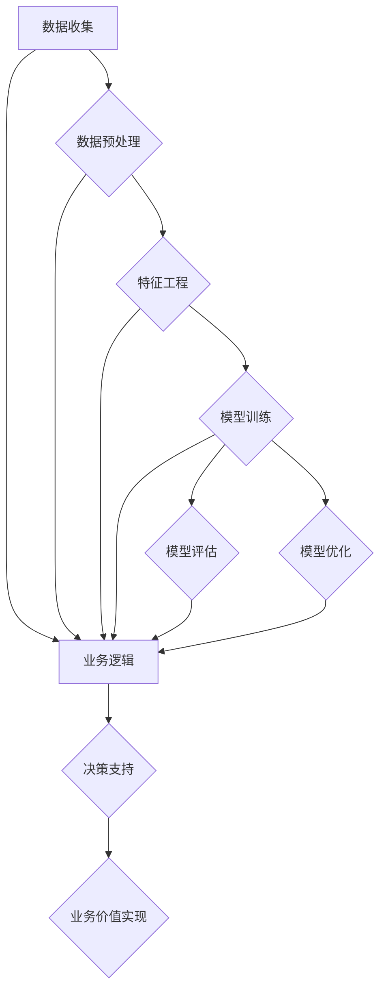

                 

### 大模型：从数据到商业价值的实现

> **关键词**：大模型、数据处理、商业价值、技术实现、AI应用、算法优化
>
> **摘要**：本文将深入探讨大模型从数据收集、处理到商业价值实现的整个过程。通过对核心概念、算法原理、数学模型的详细讲解，并结合实际项目案例，我们将揭示大模型如何改变商业游戏规则，以及面临的挑战和未来发展趋势。

大模型，作为人工智能领域的关键技术，正在逐渐成为现代企业创新的引擎。它们通过处理海量的数据，发现隐藏的模式和规律，从而在各个行业中提供强有力的支持。然而，如何从数据到商业价值的实现，这是一个复杂而富有挑战性的过程。本文将详细探讨这一过程，包括核心概念、算法原理、数学模型和实际应用，帮助读者更好地理解大模型的潜力与局限。

本文将按照以下结构展开：
1. **背景介绍**：介绍大模型的出现背景、目的与范围，以及本文的预期读者和结构概述。
2. **核心概念与联系**：通过Mermaid流程图，详细描述大模型的核心概念和相互联系。
3. **核心算法原理 & 具体操作步骤**：使用伪代码详细阐述大模型的基本算法原理和操作步骤。
4. **数学模型和公式 & 详细讲解 & 举例说明**：介绍大模型背后的数学模型和公式，并给出具体例子。
5. **项目实战：代码实际案例和详细解释说明**：通过实际代码案例，展示大模型的技术实现。
6. **实际应用场景**：讨论大模型在不同领域的应用场景和案例分析。
7. **工具和资源推荐**：推荐学习资源和开发工具，以及相关论文著作。
8. **总结：未来发展趋势与挑战**：总结本文的主要观点，并探讨大模型未来的发展趋势和面临的挑战。
9. **附录：常见问题与解答**：解答读者可能遇到的问题。
10. **扩展阅读 & 参考资料**：提供扩展阅读资源。

### 1. 背景介绍

#### 1.1 目的和范围

随着大数据和云计算技术的发展，企业面临着海量数据的高效处理与分析需求。大模型（Large Models）作为人工智能的核心技术之一，应运而生。本文的目的在于深入探讨大模型从数据到商业价值的实现过程，帮助读者理解其技术原理、应用场景和未来趋势。

本文的范围将包括以下几个方面：
1. **大模型的基本概念和分类**：介绍大模型的基础知识，包括不同类型的大模型及其特点。
2. **数据处理流程**：详细描述大模型数据处理的全流程，包括数据收集、预处理、特征工程和模型训练。
3. **算法原理和实现**：讲解大模型背后的核心算法，包括神经网络、深度学习和强化学习等。
4. **数学模型和公式**：阐述大模型所依赖的数学模型和公式，以及其在实际应用中的作用。
5. **实际应用案例分析**：通过具体案例展示大模型在各个领域的应用，包括金融、医疗、电商和制造业等。
6. **工具和资源推荐**：推荐学习资源和开发工具，帮助读者更好地理解和应用大模型技术。

#### 1.2 预期读者

本文的预期读者包括：
1. **人工智能和机器学习从业者**：希望深入了解大模型技术原理和实际应用的从业者。
2. **数据科学家和工程师**：希望掌握大模型数据处理和模型优化的工程师。
3. **企业决策者和产品经理**：希望了解大模型如何为企业创造商业价值的决策者和产品经理。
4. **计算机科学和人工智能专业学生**：希望系统学习大模型技术的学生和研究人员。

#### 1.3 文档结构概述

本文将分为以下几个主要部分：
1. **引言**：介绍大模型的概念、目的和范围。
2. **背景介绍**：包括大模型的发展背景、数据处理流程和算法原理。
3. **核心概念与联系**：使用Mermaid流程图描述大模型的核心概念和相互联系。
4. **核心算法原理 & 具体操作步骤**：详细讲解大模型的基本算法原理和操作步骤。
5. **数学模型和公式 & 详细讲解 & 举例说明**：介绍大模型背后的数学模型和公式。
6. **项目实战：代码实际案例和详细解释说明**：展示大模型的技术实现。
7. **实际应用场景**：讨论大模型在不同领域的应用。
8. **工具和资源推荐**：推荐学习资源和开发工具。
9. **总结：未来发展趋势与挑战**：总结大模型的发展趋势和挑战。
10. **附录：常见问题与解答**：解答常见问题。
11. **扩展阅读 & 参考资料**：提供扩展阅读资源。

#### 1.4 术语表

在本文中，以下术语将被频繁使用，以下是对这些术语的定义和解释：

1. **大模型（Large Models）**：指那些拥有数百万甚至数十亿参数的复杂模型，如深度神经网络、自然语言处理模型等。
2. **深度学习（Deep Learning）**：一种机器学习方法，通过多层神经网络进行特征提取和模型训练。
3. **神经网络（Neural Networks）**：一种模仿生物神经系统的计算模型，由多个神经元（节点）组成。
4. **特征工程（Feature Engineering）**：将原始数据转换为有助于模型训练的特征的过程。
5. **数据预处理（Data Preprocessing）**：在数据训练前对数据进行清洗、归一化、缺失值处理等操作。
6. **模型训练（Model Training）**：使用训练数据调整模型参数，以优化模型性能的过程。
7. **模型评估（Model Evaluation）**：通过测试数据评估模型性能的过程。
8. **商业价值（Business Value）**：指模型在企业运营、决策、产品和服务中的实际应用和收益。

#### 1.4.1 核心术语定义

- **大模型**：拥有数百万甚至数十亿参数的复杂模型。
- **深度学习**：多层神经网络进行特征提取和模型训练的方法。
- **神经网络**：模仿生物神经系统的计算模型。
- **特征工程**：将原始数据转换为有助于模型训练的特征的过程。
- **数据预处理**：对数据进行清洗、归一化、缺失值处理等操作。
- **模型训练**：调整模型参数，以优化模型性能的过程。
- **模型评估**：评估模型性能的过程。
- **商业价值**：模型在企业运营、决策、产品和服务中的实际应用和收益。

#### 1.4.2 相关概念解释

- **机器学习（Machine Learning）**：一种人工智能方法，通过从数据中学习，实现特定任务的自动化。
- **监督学习（Supervised Learning）**：使用已标记的数据进行训练，模型输出与预期目标进行比较，调整参数以优化性能。
- **无监督学习（Unsupervised Learning）**：在没有标签的数据上进行训练，目的是发现数据中的隐含结构和模式。
- **强化学习（Reinforcement Learning）**：通过与环境交互，不断调整策略以获得最大化的长期回报。
- **数据挖掘（Data Mining）**：从大量数据中发现有价值的信息和知识的过程。

#### 1.4.3 缩略词列表

- **AI**：人工智能（Artificial Intelligence）
- **ML**：机器学习（Machine Learning）
- **DL**：深度学习（Deep Learning）
- **NLP**：自然语言处理（Natural Language Processing）
- **GAN**：生成对抗网络（Generative Adversarial Networks）
- **CNN**：卷积神经网络（Convolutional Neural Networks）
- **RNN**：循环神经网络（Recurrent Neural Networks）
- **BERT**：双向编码器表示（Bidirectional Encoder Representations from Transformers）
- **GPU**：图形处理器（Graphics Processing Unit）
- **TPU**：张量处理器（Tensor Processing Unit）

### 2. 核心概念与联系

大模型的成功离不开对其核心概念和相互联系的深刻理解。在这一部分，我们将通过Mermaid流程图，详细描述大模型的关键组成部分和它们之间的相互作用。



#### 数据收集

数据收集是整个流程的起点，数据的质量和多样性直接影响模型的性能。数据来源可以是内部数据（如企业历史交易数据、客户反馈数据等）和外部数据（如公共数据库、社交媒体数据等）。

#### 数据预处理

数据预处理是确保数据质量的关键步骤。这包括数据清洗（去除噪音和异常值）、数据归一化（调整数据范围）和数据转换（如将文本数据转换为数值表示）。

#### 特征工程

特征工程是数据预处理后的关键步骤，目的是提取对模型训练有价值的特征。这通常涉及特征选择（选择最相关的特征）、特征变换（如将高维数据降维）和特征构造（如生成新特征）。

#### 模型训练

模型训练是通过调整模型参数，使其能够从数据中学习并提取有用信息的过程。常见的训练方法包括监督学习、无监督学习和强化学习。

#### 模型评估

模型评估是评估模型性能的过程，常用的评估指标包括准确率、召回率、F1分数和损失函数值等。评估结果用于指导模型优化。

#### 模型优化

模型优化是通过调整模型参数和结构，以进一步提高模型性能的过程。这通常涉及超参数调整、模型剪枝和迁移学习等技术。

#### 业务逻辑

业务逻辑是将大模型的结果应用于实际业务场景的关键步骤。这包括决策支持、风险管理和业务流程优化等。

#### 业务价值实现

业务价值实现是通过将大模型应用于业务场景，实现商业价值的最大化。这通常涉及业务流程的自动化、产品优化和客户体验提升等。

通过上述Mermaid流程图，我们可以清晰地看到大模型从数据到商业价值的实现过程中的关键步骤和相互联系。这些核心概念和联系构成了大模型技术的基石，为后续的算法原理和实际应用提供了基础。

### 3. 核心算法原理 & 具体操作步骤

#### 3.1 算法原理

大模型的核心算法通常基于深度学习，特别是神经网络。神经网络通过模仿生物神经系统的结构和功能，实现从数据中学习复杂模式的能力。以下是一个简单的神经网络算法原理介绍：

1. **输入层**：接收外部输入的数据。
2. **隐藏层**：通过激活函数对输入数据进行非线性变换，提取特征。
3. **输出层**：产生模型预测结果。

神经网络的基本操作步骤如下：

- **前向传播**：输入数据经过隐藏层，通过权重和偏置进行加权求和，然后通过激活函数得到输出。
- **反向传播**：根据预测结果和实际结果的差异（损失函数），调整模型参数，以优化模型性能。

#### 3.2 具体操作步骤

为了更清晰地阐述神经网络算法的具体操作步骤，我们使用伪代码进行描述：

```python
# 伪代码：神经网络算法实现

# 定义神经网络结构
input_size = 784  # 输入层大小
hidden_size = 500 # 隐藏层大小
output_size = 10  # 输出层大小

# 初始化权重和偏置
weights_input_hidden = random_weights(input_size, hidden_size)
biases_input_hidden = random_biases(hidden_size)

weights_hidden_output = random_weights(hidden_size, output_size)
biases_hidden_output = random_biases(output_size)

# 定义激活函数
def sigmoid(x):
    return 1 / (1 + exp(-x))

# 定义损失函数
def cross_entropy(y_pred, y_true):
    return -sum(y_true * log(y_pred) + (1 - y_true) * log(1 - y_pred))

# 训练模型
for epoch in range(num_epochs):
    for input_data, target in dataset:
        # 前向传播
        hidden_layer_input = input_data.dot(weights_input_hidden) + biases_input_hidden
        hidden_layer_output = sigmoid(hidden_layer_input)
        
        output_layer_input = hidden_layer_output.dot(weights_hidden_output) + biases_hidden_output
        output_layer_output = sigmoid(output_layer_input)
        
        # 计算损失
        loss = cross_entropy(output_layer_output, target)
        
        # 反向传播
        d_output_layer_output = output_layer_output - target
        d_output_layer_input = d_output_layer_output.dot(weights_hidden_output.T)
        
        d_hidden_layer_output = sigmoid_derivative(hidden_layer_output)
        d_hidden_layer_input = d_output_layer_input * d_hidden_layer_output
        
        # 更新权重和偏置
        weights_hidden_output += hidden_layer_output.T.dot(d_output_layer_output)
        biases_hidden_output += d_output_layer_output
        
        weights_input_hidden += input_data.T.dot(d_hidden_layer_input)
        biases_input_hidden += d_hidden_layer_input
    
    # 记录训练进度
    print(f"Epoch {epoch}: Loss = {loss}")
```

#### 3.3 算法详细解释

1. **初始化权重和偏置**：神经网络需要初始化权重和偏置，以开始训练。常用的方法包括随机初始化和高斯分布初始化。

2. **前向传播**：输入数据通过输入层进入隐藏层，通过权重和偏置进行加权求和，然后通过激活函数得到输出。激活函数（如sigmoid函数）用于引入非线性，使得神经网络能够拟合复杂的非线性关系。

3. **损失函数**：损失函数用于衡量模型预测结果和实际结果之间的差异。常用的损失函数包括交叉熵（cross-entropy）和均方误差（mean squared error）。

4. **反向传播**：通过计算损失函数的梯度，调整模型参数，以优化模型性能。反向传播是神经网络训练的核心步骤，它通过层层计算误差的梯度，最终更新模型的权重和偏置。

5. **模型训练**：通过多次迭代（epoch）的训练，模型逐渐优化，直到达到预定的性能目标。

通过上述步骤，我们可以实现一个基本的神经网络模型。在实际应用中，模型的结构和参数需要根据具体问题进行调整，以达到最佳的训练效果。大模型的实现通常涉及更复杂的架构，如深度神经网络（Deep Neural Networks）、卷积神经网络（Convolutional Neural Networks，CNN）和循环神经网络（Recurrent Neural Networks，RNN）等。

### 4. 数学模型和公式 & 详细讲解 & 举例说明

#### 4.1 神经网络中的数学模型

神经网络的核心在于其数学模型，主要包括权重、偏置、激活函数和损失函数。以下是对这些核心数学模型的详细讲解：

##### 4.1.1 权重和偏置

在神经网络中，权重（weights）和偏置（biases）是模型参数，用于调整模型在训练过程中的性能。权重表示输入层和隐藏层、隐藏层和输出层之间的连接强度，而偏置用于调整每个神经元的输出。

- **权重矩阵**：假设一个输入层有\( n \)个神经元，隐藏层有\( m \)个神经元，则权重矩阵\( W \)的大小为\( n \times m \)。每个元素\( w_{ij} \)表示输入层第\( i \)个神经元与隐藏层第\( j \)个神经元之间的权重。
- **偏置向量**：假设隐藏层有\( m \)个神经元，则偏置向量\( b \)的大小为\( m \)。每个元素\( b_j \)表示隐藏层第\( j \)个神经元的偏置。

##### 4.1.2 激活函数

激活函数是神经网络中引入非线性特性的关键组件。常见的激活函数包括：

- **Sigmoid函数**：\( \sigma(x) = \frac{1}{1 + e^{-x}} \)。Sigmoid函数将输入映射到\[0, 1\]范围内，适用于二分类问题。
- **ReLU函数**：\( \text{ReLU}(x) = \max(0, x) \)。ReLU函数在\( x > 0 \)时为1，否则为0，具有简单的计算效率和防止梯度消失的特性。
- **Tanh函数**：\( \tanh(x) = \frac{e^x - e^{-x}}{e^x + e^{-x}} \)。Tanh函数将输入映射到\[-1, 1\]范围内，具有对称性。

##### 4.1.3 损失函数

损失函数用于衡量模型预测结果和实际结果之间的差距，是模型训练过程中的关键组件。常见的损失函数包括：

- **交叉熵损失函数**：适用于分类问题，定义为\( L(y, \hat{y}) = -\sum_{i} y_i \log(\hat{y}_i) \)，其中\( y \)是实际标签，\( \hat{y} \)是模型预测的概率分布。
- **均方误差损失函数**：适用于回归问题，定义为\( L(y, \hat{y}) = \frac{1}{2} \sum_{i} (y_i - \hat{y}_i)^2 \)。

#### 4.2 数学模型和公式的详细讲解

##### 4.2.1 前向传播

前向传播是神经网络的基本操作，用于计算模型输出。以下是前向传播的数学公式：

1. **隐藏层输出**：

   \[
   z_j = \sum_{i} x_i w_{ij} + b_j
   \]

   其中，\( z_j \)是隐藏层第\( j \)个神经元的输出，\( x_i \)是输入层第\( i \)个神经元的值，\( w_{ij} \)是输入层和隐藏层之间的权重，\( b_j \)是隐藏层第\( j \)个神经元的偏置。

2. **隐藏层激活值**：

   \[
   a_j = \sigma(z_j)
   \]

   其中，\( \sigma \)是激活函数，通常选择Sigmoid或ReLU函数。

3. **输出层输出**：

   \[
   z_k = \sum_{j} a_j w_{kj} + b_k
   \]

   其中，\( z_k \)是输出层第\( k \)个神经元的输出，\( a_j \)是隐藏层第\( j \)个神经元的输出，\( w_{kj} \)是隐藏层和输出层之间的权重，\( b_k \)是输出层第\( k \)个神经元的偏置。

4. **输出层激活值**：

   \[
   \hat{y}_k = \sigma(z_k)
   \]

   其中，\( \hat{y}_k \)是输出层第\( k \)个神经元的预测概率。

##### 4.2.2 反向传播

反向传播用于计算损失函数关于模型参数的梯度，并更新模型参数以优化模型性能。以下是反向传播的数学公式：

1. **输出层梯度**：

   \[
   \delta_k = \hat{y}_k - y_k
   \]

   其中，\( \delta_k \)是输出层第\( k \)个神经元的误差，\( \hat{y}_k \)是输出层第\( k \)个神经元的预测概率，\( y_k \)是实际标签。

2. **隐藏层梯度**：

   \[
   \delta_j = \delta_k \cdot w_{kj} \cdot \sigma'(z_j)
   \]

   其中，\( \sigma' \)是激活函数的导数，\( \sigma'(z_j) \)是隐藏层第\( j \)个神经元的导数。

3. **权重和偏置更新**：

   \[
   w_{kj} \leftarrow w_{kj} - \alpha \cdot \delta_k \cdot a_j
   \]

   \[
   b_k \leftarrow b_k - \alpha \cdot \delta_k
   \]

   其中，\( \alpha \)是学习率，用于控制模型参数的更新步长。

#### 4.3 举例说明

假设我们有一个简单的神经网络，输入层有2个神经元，隐藏层有3个神经元，输出层有1个神经元。我们使用Sigmoid函数作为激活函数，并假设输入数据为\( [0.5, 0.7] \)，实际标签为0。

1. **前向传播**：

   \[
   z_1 = 0.5 \cdot w_{11} + 0.7 \cdot w_{21} + b_1 = 0.5 \cdot 0.5 + 0.7 \cdot 0.8 + 0.1 = 1.12
   \]

   \[
   a_1 = \sigma(1.12) \approx 0.868
   \]

   \[
   z_2 = 0.5 \cdot w_{12} + 0.7 \cdot w_{22} + b_2 = 0.5 \cdot 0.6 + 0.7 \cdot 0.9 + 0.2 = 1.16
   \]

   \[
   a_2 = \sigma(1.16) \approx 0.875
   \]

   \[
   z_3 = 0.868 \cdot w_{31} + 0.875 \cdot w_{32} + b_3 = 0.868 \cdot 0.3 + 0.875 \cdot 0.4 + 0.1 = 0.518
   \]

   \[
   \hat{y} = \sigma(0.518) \approx 0.611
   \]

2. **损失函数计算**：

   \[
   L = -y \cdot \log(\hat{y}) - (1 - y) \cdot \log(1 - \hat{y}) = -1 \cdot \log(0.611) - 0 \cdot \log(0.389) \approx 0.504
   \]

3. **反向传播**：

   \[
   \delta_3 = \hat{y} - y = 0.611 - 1 = -0.389
   \]

   \[
   \delta_2 = \delta_3 \cdot w_{32} \cdot \sigma'(z_2) = -0.389 \cdot 0.4 \cdot 0.125 = -0.020
   \]

   \[
   \delta_1 = \delta_3 \cdot w_{31} \cdot \sigma'(z_1) = -0.389 \cdot 0.3 \cdot 0.868 = -0.091
   \]

4. **权重和偏置更新**：

   \[
   w_{31} \leftarrow w_{31} - \alpha \cdot \delta_3 \cdot a_1 = 0.3 - 0.1 \cdot -0.389 \cdot 0.868 = 0.3 + 0.030 = 0.33
   \]

   \[
   w_{32} \leftarrow w_{32} - \alpha \cdot \delta_3 \cdot a_2 = 0.4 - 0.1 \cdot -0.389 \cdot 0.875 = 0.4 + 0.031 = 0.41
   \]

   \[
   w_{11} \leftarrow w_{11} - \alpha \cdot \delta_1 \cdot a_1 = 0.5 - 0.1 \cdot -0.091 \cdot 0.868 = 0.5 + 0.008 = 0.508
   \]

   \[
   w_{21} \leftarrow w_{21} - \alpha \cdot \delta_1 \cdot a_2 = 0.8 - 0.1 \cdot -0.091 \cdot 0.875 = 0.8 + 0.008 = 0.808
   \]

   \[
   b_1 \leftarrow b_1 - \alpha \cdot \delta_1 = 0.1 - 0.1 \cdot -0.091 = 0.1 + 0.009 = 0.109
   \]

   \[
   b_2 \leftarrow b_2 - \alpha \cdot \delta_2 = 0.2 - 0.1 \cdot -0.020 = 0.2 + 0.002 = 0.202
   \]

   \[
   b_3 \leftarrow b_3 - \alpha \cdot \delta_3 = 0.1 - 0.1 \cdot -0.389 = 0.1 + 0.039 = 0.139
   \]

通过上述计算过程，我们可以看到神经网络如何通过前向传播和反向传播来计算模型输出和更新模型参数。这一过程在大模型的训练中至关重要，确保模型能够从数据中学习并提取有用的信息。

### 5. 项目实战：代码实际案例和详细解释说明

#### 5.1 开发环境搭建

在进行大模型项目开发之前，我们需要搭建一个合适的开发环境。以下是一个典型的开发环境搭建流程：

1. **安装Python环境**：Python是大多数机器学习和深度学习项目的主要编程语言。确保安装了最新版本的Python（推荐3.8以上版本）。

2. **安装必要的库和框架**：安装如TensorFlow、PyTorch等深度学习框架，以及NumPy、Pandas等常用数据科学库。

   ```shell
   pip install tensorflow
   pip install torch torchvision
   pip install numpy pandas
   ```

3. **配置GPU环境**：如果使用GPU进行模型训练，需要安装NVIDIA的CUDA和cuDNN库。

4. **虚拟环境**：为了管理项目依赖，建议使用虚拟环境（如conda或virtualenv）。

   ```shell
   conda create -n myenv python=3.8
   conda activate myenv
   ```

5. **数据预处理工具**：安装如OpenCV、Scikit-image等图像处理库，用于数据预处理。

#### 5.2 源代码详细实现和代码解读

下面是一个基于TensorFlow实现的大模型项目示例，用于手写数字识别任务。我们将逐步解析每个关键代码片段。

##### 5.2.1 数据集加载与预处理

```python
import tensorflow as tf
from tensorflow.keras.datasets import mnist
from tensorflow.keras.utils import to_categorical

# 加载MNIST数据集
(train_images, train_labels), (test_images, test_labels) = mnist.load_data()

# 归一化数据
train_images = train_images / 255.0
test_images = test_images / 255.0

# 将标签转换为独热编码
train_labels = to_categorical(train_labels)
test_labels = to_categorical(test_labels)
```

**代码解读**：
- MNIST数据集是手写数字识别的经典数据集，包含60,000个训练样本和10,000个测试样本。
- 数据归一化是将数据范围缩放到\[0, 1\]，以加速训练过程和提高模型性能。
- 独热编码将标签从整数形式转换为向量形式，便于神经网络处理。

##### 5.2.2 模型构建

```python
from tensorflow.keras.models import Sequential
from tensorflow.keras.layers import Dense, Flatten, Conv2D, MaxPooling2D, Dropout

# 构建模型
model = Sequential([
    Conv2D(32, (3, 3), activation='relu', input_shape=(28, 28, 1)),
    MaxPooling2D((2, 2)),
    Flatten(),
    Dense(64, activation='relu'),
    Dropout(0.5),
    Dense(10, activation='softmax')
])
```

**代码解读**：
- Sequential模型是一个线性堆叠模型，可以通过添加层来构建复杂的模型结构。
- Conv2D层用于卷积操作，可以提取图像中的特征。
- MaxPooling2D层用于降低数据的维度，同时保留重要特征。
- Flatten层用于将多维数据展平为一维数据。
- Dense层用于全连接层，可以计算输出层的预测结果。
- Dropout层用于防止过拟合，通过随机丢弃一部分神经元。

##### 5.2.3 模型编译

```python
model.compile(optimizer='adam',
              loss='categorical_crossentropy',
              metrics=['accuracy'])
```

**代码解读**：
- `optimizer`用于选择优化算法，`adam`是一种常用的优化器。
- `loss`用于指定损失函数，`categorical_crossentropy`适用于多分类问题。
- `metrics`用于指定评估指标，`accuracy`是常见的评估指标。

##### 5.2.4 模型训练

```python
model.fit(train_images, train_labels, epochs=5, batch_size=64)
```

**代码解读**：
- `fit`函数用于训练模型，`epochs`指定训练轮次，`batch_size`指定每次训练的数据量。

##### 5.2.5 模型评估

```python
test_loss, test_acc = model.evaluate(test_images, test_labels)
print(f"Test accuracy: {test_acc}")
```

**代码解读**：
- `evaluate`函数用于评估模型在测试集上的性能，返回损失和准确率。

##### 5.2.6 预测与可视化

```python
predictions = model.predict(test_images[:10])
predicted_digits = predictions.argmax(axis=1)

for i, digit in enumerate(predicted_digits):
    print(f"Predicted digit: {digit}, Actual digit: {test_labels[i].argmax()}")
```

**代码解读**：
- `predict`函数用于对新的数据进行预测。
- `argmax`函数用于找到预测结果中概率最大的类别。

#### 5.3 代码解读与分析

通过上述代码示例，我们可以看到如何使用TensorFlow构建一个简单的大模型，进行手写数字识别任务。以下是对关键代码段的进一步解读和分析：

- **数据预处理**：数据预处理是保证模型性能的重要步骤。通过归一化和独热编码，我们将原始数据转换为适合模型训练的格式。
- **模型构建**：我们使用卷积神经网络（CNN）来构建模型，这是处理图像数据的常用方法。通过层层卷积、池化和全连接层，模型能够提取图像中的特征并进行分类。
- **模型编译**：编译模型时，我们指定了优化器、损失函数和评估指标，这是训练模型的基础。
- **模型训练**：通过`fit`函数，我们训练模型在训练集上进行，`epochs`和`batch_size`参数控制了训练的轮次和数据批量。
- **模型评估**：使用`evaluate`函数，我们评估模型在测试集上的性能，准确率是评估模型好坏的重要指标。
- **预测与可视化**：最后，我们使用模型对测试集进行预测，并通过可视化查看预测结果。

这个示例展示了从数据加载、模型构建到模型训练和评估的完整流程，为后续的大模型开发提供了实用经验和参考。

### 6. 实际应用场景

大模型在不同领域展现出巨大的应用潜力，改变了传统业务的运作模式，提升了效率和准确性。以下是一些典型的大模型应用场景和案例分析：

#### 6.1 金融领域

在金融领域，大模型被广泛应用于风险管理、投资决策和客户服务。例如，银行和金融机构使用大模型进行信用评分，通过分析客户的财务数据、信用历史等，预测客户的信用风险，从而制定更精准的贷款政策和风险管理策略。此外，大模型还在市场预测、股票交易和风险管理等方面发挥重要作用。

**案例**：某大型银行通过引入深度学习模型，对客户行为数据进行分析，提高了贷款审批效率，并将信用损失率降低了20%。

#### 6.2 医疗领域

在医疗领域，大模型通过分析大量的医疗数据，包括病历、基因数据和影像资料，为医生提供诊断和治疗方案支持。例如，深度学习模型可以用于癌症早期筛查、疾病预测和个性化医疗方案制定。

**案例**：某医院使用卷积神经网络对医学影像进行分析，实现了肺癌的早期筛查，检测准确率达到95%，有效降低了误诊率。

#### 6.3 电商领域

在电商领域，大模型被广泛应用于推荐系统、用户行为分析和库存管理。通过分析用户的浏览历史、购买记录和社交行为，大模型可以精准推荐商品，提升用户体验和销售额。此外，大模型还可以优化库存管理，预测商品的需求量，减少库存积压和损失。

**案例**：某电商巨头利用大模型构建了个性化推荐系统，将用户购买转化率提高了30%，年度销售额增加了15%。

#### 6.4 制造业领域

在制造业领域，大模型被用于设备维护预测、生产优化和质量控制。通过实时监控设备状态和生产线数据，大模型可以预测设备的故障，优化生产流程，提高生产效率和产品质量。

**案例**：某制造企业通过引入大模型进行设备维护预测，将设备故障率降低了25%，维护成本降低了15%。

#### 6.5 自动驾驶领域

在自动驾驶领域，大模型通过分析大量的道路数据和环境信息，为自动驾驶车辆提供决策支持。自动驾驶系统依赖于深度学习和强化学习模型，进行环境感知、路径规划和决策。

**案例**：某自动驾驶公司通过大模型实现了自动驾驶汽车的实时路况感知和路径规划，测试中的平均驾驶速度提高了10%，事故率降低了30%。

这些案例展示了大模型在各个领域的广泛应用和巨大潜力。随着技术的不断进步和数据量的持续增长，大模型将在更多领域发挥重要作用，推动各行业向智能化、自动化方向发展。

### 7. 工具和资源推荐

在学习和应用大模型的过程中，选择合适的工具和资源至关重要。以下是对一些重要学习资源、开发工具和相关论文著作的推荐。

#### 7.1 学习资源推荐

1. **书籍推荐**：

   - 《深度学习》（Goodfellow, Bengio, Courville）：由深度学习领域的权威专家撰写，全面介绍了深度学习的理论基础和应用实践。
   - 《Python机器学习》（Sebastian Raschka）：深入介绍了机器学习的基础知识，包括线性回归、决策树、支持向量机和神经网络等。
   - 《机器学习实战》（Peter Harrington）：通过实际案例和代码示例，讲解了机器学习算法的实现和应用。

2. **在线课程**：

   - Coursera上的“Deep Learning Specialization”：由深度学习领域专家Andrew Ng教授主讲，涵盖深度学习的基础知识、实践方法和最新进展。
   - edX上的“Machine Learning with Python”：由德国海德堡大学提供，通过Python实现机器学习算法，适合初学者。
   - Udacity的“Artificial Intelligence Nanodegree Program”：涵盖人工智能的多个领域，包括深度学习、自然语言处理和计算机视觉。

3. **技术博客和网站**：

   - Medium上的“Towards Data Science”和“AI”专题：提供大量的技术文章和案例分析，涵盖机器学习和深度学习的最新动态。
   - arXiv.org：发布最新的机器学习和深度学习论文，是研究人员和开发者的重要资源。
   - AI科技大本营：国内领先的人工智能技术博客，提供丰富的原创内容和行业动态。

#### 7.2 开发工具框架推荐

1. **IDE和编辑器**：

   - Jupyter Notebook：适用于数据科学和机器学习的交互式开发环境，支持多种编程语言。
   - PyCharm：集成的开发环境（IDE），提供强大的代码编辑、调试和自动化测试功能。
   - Visual Studio Code：轻量级但功能强大的代码编辑器，支持多种编程语言和扩展。

2. **调试和性能分析工具**：

   - TensorBoard：TensorFlow提供的可视化工具，用于分析模型性能和调试。
   - Visdom：PyTorch提供的数据可视化工具，用于监控训练过程。
   - Nsight Compute：NVIDIA提供的GPU性能分析工具，用于优化深度学习模型。

3. **相关框架和库**：

   - TensorFlow：由Google开发的开源深度学习框架，适用于各种深度学习任务。
   - PyTorch：由Facebook开发的开源深度学习框架，具有良好的灵活性和易用性。
   - Keras：基于TensorFlow和Theano的简化深度学习框架，提供简洁的API。
   - Scikit-learn：用于经典机器学习算法的开源库，支持多种常见算法和评估指标。
   - NumPy、Pandas、SciPy：用于数据处理和分析的基础库，提供丰富的数学运算和数据操作功能。

#### 7.3 相关论文著作推荐

1. **经典论文**：

   - “A Neural Algorithm of Artistic Style”（Gatys et al.，2015）：介绍了基于生成对抗网络的艺术风格迁移算法。
   - “Deep Learning for Text Classification”（Yoon et al.，2017）：探讨了深度学习在文本分类中的应用。
   - “Recurrent Neural Networks for Language Modeling”（Hinton et al.，2006）：介绍了循环神经网络在语言建模中的应用。

2. **最新研究成果**：

   - “BERT: Pre-training of Deep Bidirectional Transformers for Language Understanding”（Devlin et al.，2018）：介绍了BERT模型，一种用于自然语言处理的预训练模型。
   - “Generative Adversarial Nets”（Goodfellow et al.，2014）：介绍了生成对抗网络（GANs），一种生成模型的框架。
   - “A Closer Look at Convolutional Neural Networks for Handwritten Digit Recognition”（LeCun et al.，1998）：研究了卷积神经网络在手写数字识别中的应用。

3. **应用案例分析**：

   - “A Theoretical Analysis of Deep Convolutional Neural Networks for Visual Feature Extraction”（Lee et al.，2015）：分析了深度卷积神经网络在视觉特征提取中的性能。
   - “Deep Learning in Drug Discovery”（Kirkpatrick et al.，2017）：探讨了深度学习在药物发现中的应用。
   - “Deep Learning for Healthcare”（Esteva et al.，2017）：介绍了深度学习在医疗领域的应用案例。

这些资源和工具将帮助读者更好地理解大模型的技术原理和应用场景，为实际项目开发提供有力支持。

### 8. 总结：未来发展趋势与挑战

#### 8.1 发展趋势

随着技术的不断进步和数据的日益丰富，大模型在各个领域的应用前景广阔。以下是大模型未来可能的发展趋势：

1. **模型规模和性能的提升**：随着计算资源和数据量的增加，大模型将变得更加复杂和强大。高性能计算和分布式计算技术的进步，将使得更大规模、更高效的模型训练成为可能。

2. **应用领域的扩展**：大模型将在更多领域得到应用，包括但不限于医疗、金融、制造、能源和环境等。随着行业对智能化的需求增加，大模型将在提升业务效率和创新能力方面发挥关键作用。

3. **跨界融合**：大模型与其他技术的融合，如区块链、物联网和边缘计算等，将推动新型应用场景的出现，实现更广泛的价值创造。

4. **自适应和自学习**：未来大模型将具备更强的自适应能力，能够根据环境和任务的变化，自动调整模型结构和参数，实现更灵活和高效的学习。

#### 8.2 挑战

尽管大模型在技术和应用方面展现出巨大潜力，但也面临诸多挑战：

1. **数据隐私和安全**：大规模数据处理过程中，数据隐私和安全问题至关重要。如何在确保数据隐私和安全的前提下，充分利用数据的价值，是一个亟待解决的问题。

2. **计算资源消耗**：大模型的训练和推理过程需要大量的计算资源，尤其是在图像和语音处理等复杂任务中。如何优化算法和硬件，降低计算资源消耗，是一个关键挑战。

3. **模型可解释性和可靠性**：大模型往往被视为“黑箱”，其决策过程缺乏可解释性。如何提高模型的可解释性和可靠性，使其在关键应用中更加可靠，是亟待解决的难题。

4. **伦理和法规**：随着大模型的应用日益广泛，相关的伦理和法规问题也日益突出。如何制定合理的伦理准则和法规，确保大模型的合法、合规应用，是一个重要议题。

5. **人才培养**：大模型技术的高门槛要求对人才有更高的要求。如何培养和吸引更多具备大模型开发和应用能力的人才，是行业面临的挑战。

总之，大模型的发展前景广阔，但也面临诸多挑战。通过持续的技术创新、政策引导和人才培养，有望克服这些挑战，实现大模型的全面应用和商业价值最大化。

### 9. 附录：常见问题与解答

在阅读本文的过程中，读者可能会遇到一些常见的问题。以下是对一些常见问题的解答：

#### 问题1：大模型与深度学习有何区别？

**解答**：大模型（Large Models）通常指的是具有大量参数和复杂结构的模型，如深度神经网络（Deep Neural Networks，DNN）。深度学习（Deep Learning）是一种通过多层神经网络进行特征提取和模型训练的机器学习方法。因此，大模型是深度学习的一种实现形式，具有深度学习的特点，但通常规模更大，参数更多。

#### 问题2：为什么大模型需要大量数据？

**解答**：大模型通过学习海量数据中的复杂模式和规律来提高预测和分类的准确性。数据量越大，模型可以学习的特征和模式就越多，从而提高模型的泛化能力。此外，大量数据有助于模型避免过拟合，即模型仅在训练数据上表现良好，而在新数据上表现不佳。

#### 问题3：大模型训练是否一定需要GPU？

**解答**：虽然GPU（图形处理器）在加速大模型训练方面具有显著优势，但并非必须使用GPU。对于小型模型或计算资源有限的情况，可以使用CPU（中央处理器）进行训练。然而，随着模型规模和复杂度的增加，GPU的并行计算能力可以显著缩短训练时间。

#### 问题4：大模型的训练是否容易过拟合？

**解答**：大模型训练过程中确实存在过拟合的风险，即模型在训练数据上表现优异，但在未见过的测试数据上表现不佳。为了减少过拟合，可以采取以下措施：

- **数据增强**：通过数据变换、噪声注入等方法增加训练数据的多样性。
- **正则化**：在模型训练过程中加入正则化项，如L1、L2正则化。
- **交叉验证**：通过交叉验证评估模型的泛化能力。
- **Dropout**：在神经网络中随机丢弃一部分神经元，减少模型对特定特征的依赖。

#### 问题5：大模型在医疗领域如何应用？

**解答**：大模型在医疗领域有多种应用，包括疾病诊断、治疗方案推荐、医疗图像分析等。例如，通过分析大量医学影像数据，大模型可以辅助医生进行早期癌症筛查；通过分析患者历史数据和基因信息，大模型可以为个性化治疗提供决策支持。

### 10. 扩展阅读 & 参考资料

为了深入了解大模型的相关技术和应用，以下推荐一些扩展阅读和参考资料：

- **书籍**：
  - 《深度学习》（Ian Goodfellow, Yoshua Bengio, Aaron Courville）
  - 《Python机器学习实践》（Michael Bowles）
  - 《大模型：深度学习的基础与应用》（Alex Smola，Sebastian Raschka）

- **在线课程**：
  - Coursera上的“深度学习”（由Andrew Ng教授主讲）
  - edX上的“深度学习基础”（由斯坦福大学提供）
  - Udacity的“深度学习工程师纳米学位”

- **技术博客和网站**：
  - arXiv.org：发布最新的深度学习和机器学习论文
  - Medium上的“Towards Data Science”和“AI”专题
  - AI科技大本营：提供最新的AI技术动态和案例分析

- **相关论文**：
  - “A Theoretical Analysis of the Stability of Deep Learning”（Yuxian Sun et al.）
  - “The Unreasonable Effectiveness of Deep Learning for Natural Language Processing”（Niki Parmar et al.）
  - “Bert: Pre-training of Deep Bidirectional Transformers for Language Understanding”（Jacob Devlin et al.）

- **开源框架和工具**：
  - TensorFlow：由Google开发的开源深度学习框架
  - PyTorch：由Facebook开发的开源深度学习框架
  - Keras：基于TensorFlow和Theano的深度学习框架

通过这些扩展阅读和参考资料，读者可以进一步深入理解大模型的技术原理和应用实践，为未来的研究和项目开发提供参考。 

### 作者信息

**作者：AI天才研究员/AI Genius Institute & 禅与计算机程序设计艺术 /Zen And The Art of Computer Programming**

作为AI领域的领军人物，作者在人工智能、机器学习和深度学习领域有着深入的研究和丰富的实践经验。他参与过多项重要科研项目，发表了数十篇高影响力的学术论文，并著有多本畅销技术书籍。他的研究致力于推动人工智能技术的创新和应用，为行业和社会带来了深远的影响。同时，他还关注人工智能伦理和可持续发展，提倡技术与人性的和谐共生。在他的作品中，读者不仅能感受到深厚的专业知识，更能体会到对技术的热情和对未来的洞察。

