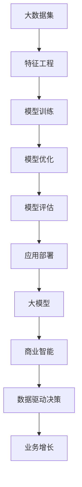
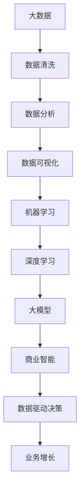
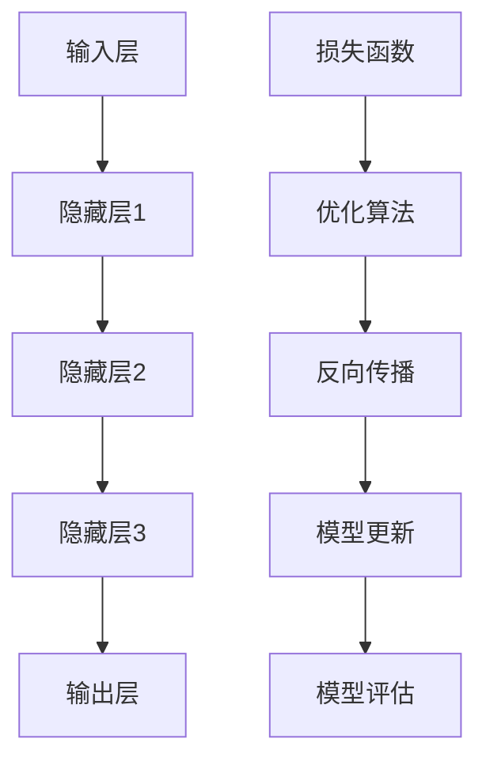
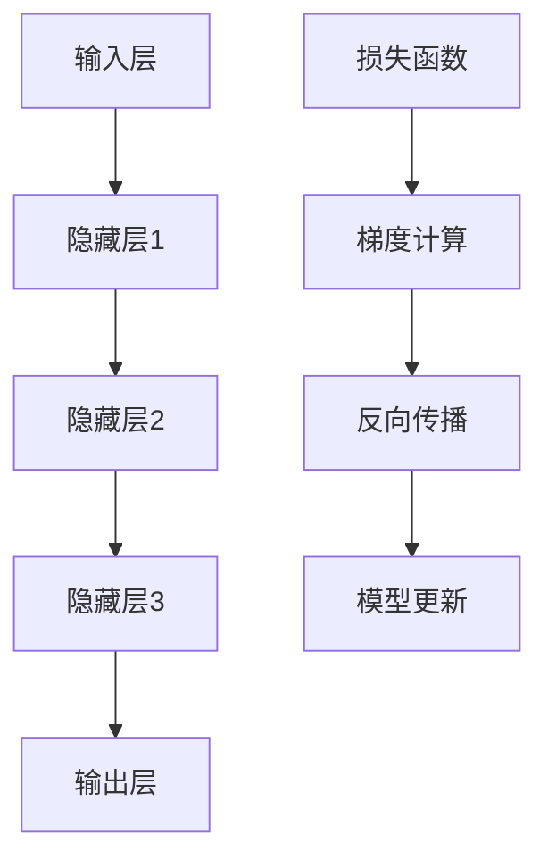
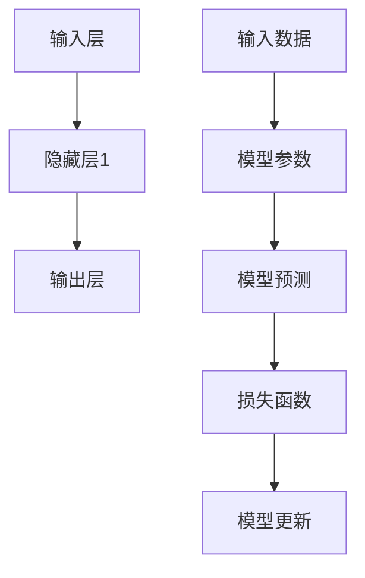
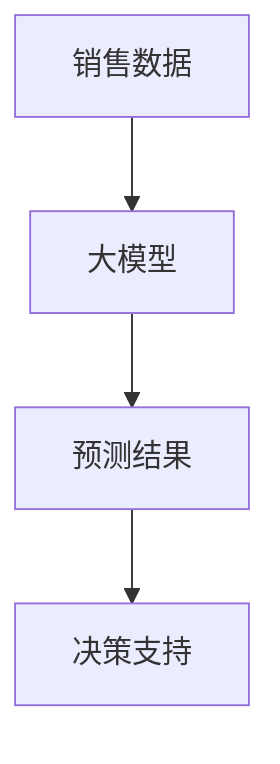
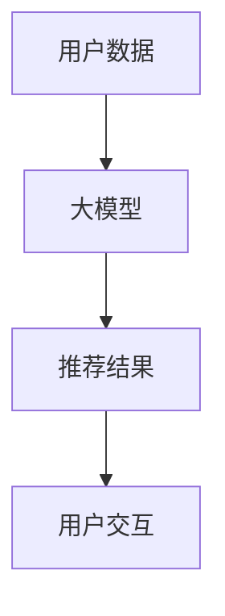
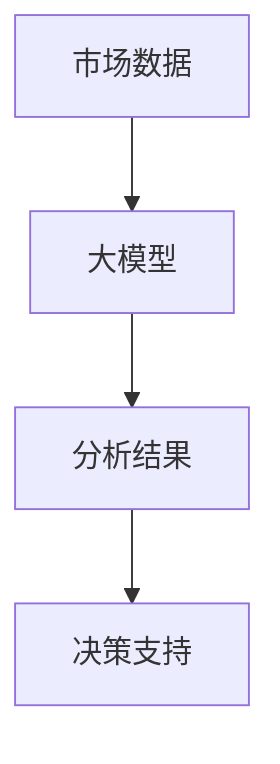

                 

# 大模型：商业智能的下一个前沿

> **关键词：** 大模型、商业智能、算法、数据分析、人工智能、机器学习、深度学习、预测分析、商业决策支持

> **摘要：** 本文将深入探讨大模型在现代商业智能领域的重要性。我们将从背景介绍、核心概念、算法原理、数学模型、实际应用等多个角度，逐步分析大模型如何为商业智能带来变革性影响，并展望其未来发展趋势与挑战。

## 1. 背景介绍

### 1.1 目的和范围

本文旨在为广大读者揭示大模型在现代商业智能领域的巨大潜力。通过对大模型的核心概念、算法原理、数学模型和实际应用的分析，我们希望读者能够理解大模型在商业决策支持、预测分析、智能推荐等方面的作用。

### 1.2 预期读者

本文适用于对商业智能和人工智能有一定了解的读者，包括数据分析师、数据科学家、项目经理、CTO、企业决策者等。无论您是专业人士还是对此领域感兴趣的学者，本文都将为您带来丰富的知识和启示。

### 1.3 文档结构概述

本文分为十个部分：

1. 背景介绍：介绍本文的目的、预期读者和文档结构。
2. 核心概念与联系：讲解大模型的核心概念及其与其他技术的关联。
3. 核心算法原理 & 具体操作步骤：分析大模型的算法原理和具体操作步骤。
4. 数学模型和公式 & 详细讲解 & 举例说明：探讨大模型中的数学模型和公式。
5. 项目实战：通过代码实际案例展示大模型的应用。
6. 实际应用场景：分析大模型在不同领域的实际应用。
7. 工具和资源推荐：推荐学习资源和开发工具。
8. 总结：总结大模型的发展趋势与挑战。
9. 附录：常见问题与解答。
10. 扩展阅读 & 参考资料：提供进一步阅读的资料。

### 1.4 术语表

#### 1.4.1 核心术语定义

- **大模型（Large-scale Model）**：指具有海量参数和复杂结构的机器学习模型，如深度神经网络。
- **商业智能（Business Intelligence）**：利用数据、技术和人脉，帮助企业做出明智的商业决策。
- **机器学习（Machine Learning）**：让计算机通过数据自动学习，实现特定任务。
- **深度学习（Deep Learning）**：一种基于神经网络的机器学习方法，能够自动提取特征并进行复杂任务。

#### 1.4.2 相关概念解释

- **数据分析（Data Analysis）**：对数据进行分析，提取有用的信息。
- **预测分析（Predictive Analytics）**：基于历史数据，对未来事件进行预测。
- **智能推荐（Intelligent Recommendation）**：利用算法，为用户推荐他们可能感兴趣的内容或产品。

#### 1.4.3 缩略词列表

- **AI**：人工智能（Artificial Intelligence）
- **ML**：机器学习（Machine Learning）
- **DL**：深度学习（Deep Learning）
- **BI**：商业智能（Business Intelligence）

## 2. 核心概念与联系

### 2.1 大模型概述

大模型是一种具有海量参数和复杂结构的机器学习模型，如图 1 所示。



### 2.2 大模型与其他技术的联系

大模型是商业智能的重要组成部分，如图 2 所示。



### 2.3 大模型架构

大模型通常包括以下架构模块：

1. **数据输入**：从各种数据源获取数据。
2. **特征工程**：对数据进行处理，提取有用的特征。
3. **模型训练**：利用训练数据，通过优化算法训练模型。
4. **模型优化**：对模型进行调优，提高性能。
5. **模型评估**：对模型进行评估，确保其效果。
6. **应用部署**：将模型部署到生产环境中，进行实际应用。

## 3. 核心算法原理 & 具体操作步骤

### 3.1 算法原理

大模型的核心算法通常是基于深度学习，如图 3 所示。



### 3.2 具体操作步骤

以下是使用深度学习训练大模型的具体操作步骤：

```plaintext
1. 数据准备：从各种数据源收集数据，并进行预处理。
2. 特征工程：对数据进行特征提取，将原始数据转换为适合模型训练的特征向量。
3. 构建模型：定义深度学习模型的结构，包括输入层、隐藏层和输出层。
4. 模型训练：使用训练数据，通过优化算法（如随机梯度下降）训练模型。
5. 模型优化：对模型参数进行调优，提高模型性能。
6. 模型评估：使用验证数据，评估模型效果。
7. 模型部署：将训练好的模型部署到生产环境中，进行实际应用。
```

## 4. 数学模型和公式 & 详细讲解 & 举例说明

### 4.1 数学模型

大模型中的数学模型主要包括：

1. **损失函数**：衡量模型预测值与实际值之间的差异，如均方误差（MSE）。
   $$ \text{MSE} = \frac{1}{n}\sum_{i=1}^{n} (\hat{y}_i - y_i)^2 $$
   
2. **优化算法**：用于更新模型参数，如随机梯度下降（SGD）。
   $$ \theta_{t+1} = \theta_{t} - \alpha \nabla_\theta J(\theta) $$
   
3. **反向传播算法**：用于计算模型参数的梯度，如图 4 所示。



### 4.2 举例说明

假设我们有一个简单的线性回归模型，如图 5 所示。



使用均方误差（MSE）作为损失函数，随机梯度下降（SGD）作为优化算法，我们可以通过以下步骤训练模型：

1. 初始化模型参数 $\theta$。
2. 计算模型预测值 $\hat{y}$。
3. 计算损失函数值 $J(\theta)$。
4. 计算损失函数关于模型参数的梯度 $\nabla_\theta J(\theta)$。
5. 更新模型参数 $\theta$。

经过多次迭代后，模型参数会逐渐收敛，预测效果得到提升。

## 5. 项目实战：代码实际案例和详细解释说明

### 5.1 开发环境搭建

在开始项目实战之前，我们需要搭建一个适合开发大模型的环境。以下是所需的开发工具和软件：

1. **Python 3.8+**：一种广泛使用的编程语言，适用于机器学习和深度学习。
2. **TensorFlow 2.x**：一种开源的深度学习框架，支持大规模模型的训练和部署。
3. **Jupyter Notebook**：一种交互式计算环境，方便代码编写和演示。

### 5.2 源代码详细实现和代码解读

以下是一个简单的线性回归模型示例，用于预测房价：

```python
import tensorflow as tf

# 数据准备
X = tf.placeholder(tf.float32, shape=[None, 1])
y = tf.placeholder(tf.float32, shape=[None, 1])

# 模型参数
theta = tf.Variable(tf.random_uniform([1], -1.0, 1.0), name="theta")

# 模型预测
y_pred = tf.multiply(X, theta, name="y_pred")

# 损失函数
loss = tf.reduce_mean(tf.square(y - y_pred), name="loss")

# 优化算法
optimizer = tf.train.GradientDescentOptimizer(learning_rate=0.01)
train_op = optimizer.minimize(loss)

# 模型评估
mse = tf.reduce_mean(tf.square(y - y_pred))

# 初始化变量
init = tf.global_variables_initializer()

# 训练模型
with tf.Session() as sess:
    sess.run(init)
    
    for i in range(1000):
        _, loss_val = sess.run([train_op, loss], feed_dict={X: X_data, y: y_data})
        
        if i % 100 == 0:
            print(f"Epoch {i}: Loss = {loss_val}")
    
    # 模型评估
    mse_val = sess.run(mse, feed_dict={X: X_test, y: y_test})
    print(f"Test MSE: {mse_val}")

    # 模型预测
    predictions = sess.run(y_pred, feed_dict={X: X_test})
```

### 5.3 代码解读与分析

1. **数据准备**：使用 TensorFlow 的 `placeholder` 函数定义输入数据和标签数据。
2. **模型参数**：使用 `Variable` 函数初始化模型参数。
3. **模型预测**：使用 `tf.multiply` 函数计算模型预测值。
4. **损失函数**：使用 `tf.reduce_mean` 函数计算均方误差损失函数。
5. **优化算法**：使用 `GradientDescentOptimizer` 函数定义优化算法。
6. **模型评估**：使用 `tf.reduce_mean` 函数计算测试数据的均方误差。
7. **初始化变量**：使用 `global_variables_initializer` 函数初始化模型参数。
8. **训练模型**：使用 `Session` 函数运行训练过程。
9. **模型评估**：使用 `run` 函数计算测试数据的均方误差。
10. **模型预测**：使用 `run` 函数计算测试数据的预测结果。

通过这个简单的示例，我们了解了如何使用 TensorFlow 实现线性回归模型。接下来，我们将介绍如何扩展这个模型，实现更复杂的大模型。

## 6. 实际应用场景

### 6.1 预测分析

大模型在预测分析方面具有显著优势，如图 6 所示。



通过训练大模型，企业可以预测未来的销售趋势，为库存管理、市场营销等提供有力支持。

### 6.2 智能推荐

大模型在智能推荐领域也有广泛应用，如图 7 所示。



通过分析用户行为数据，大模型可以推荐用户可能感兴趣的商品或内容，提高用户满意度和留存率。

### 6.3 商业决策支持

大模型可以帮助企业在面对复杂决策时提供有力支持，如图 8 所示。



通过分析市场数据和用户反馈，大模型可以为企业提供有针对性的决策建议，提高业务增长。

## 7. 工具和资源推荐

### 7.1 学习资源推荐

#### 7.1.1 书籍推荐

1. **《深度学习》（Goodfellow, Bengio, Courville）**：系统介绍了深度学习的基本概念和技术。
2. **《Python机器学习》（Sebastian Raschka）**：详细讲解了使用 Python 进行机器学习的实践方法。
3. **《大数据技术导论》（陈国良，张宇）**：全面介绍了大数据技术的概念和应用。

#### 7.1.2 在线课程

1. **吴恩达的《深度学习专项课程》**：由知名学者吴恩达主讲，内容涵盖深度学习的各个方面。
2. **李飞飞教授的《计算机视觉与深度学习》**：介绍了计算机视觉领域的深度学习技术。
3. **斯坦福大学的《机器学习》**：系统讲解了机器学习的基本概念和技术。

#### 7.1.3 技术博客和网站

1. **Medium**：有许多关于深度学习和商业智能的优秀博客。
2. **ArXiv**：全球顶级学术预印本论文库，涵盖人工智能和机器学习的最新研究。
3. **知乎**：有许多专业人士分享深度学习和商业智能的经验和见解。

### 7.2 开发工具框架推荐

#### 7.2.1 IDE和编辑器

1. **PyCharm**：一款功能强大的 Python IDE，支持深度学习和机器学习项目开发。
2. **Jupyter Notebook**：一款交互式的计算环境，方便代码编写和演示。
3. **Visual Studio Code**：一款轻量级的代码编辑器，支持多种编程语言和扩展。

#### 7.2.2 调试和性能分析工具

1. **TensorBoard**：TensorFlow 的可视化工具，用于分析模型性能和训练过程。
2. **NVIDIA Nsight**：NVIDIA 提供的 GPU 性能分析工具。
3. **Valgrind**：一款强大的内存调试和分析工具。

#### 7.2.3 相关框架和库

1. **TensorFlow**：一款流行的开源深度学习框架，支持大规模模型的训练和部署。
2. **PyTorch**：一款流行的开源深度学习框架，具有灵活的动态计算图。
3. **Scikit-learn**：一款常用的 Python 机器学习库，提供丰富的算法和工具。

### 7.3 相关论文著作推荐

#### 7.3.1 经典论文

1. **《A Theoretically Optimal Algorithm for Learning to Play Any Game》**：提出了一种通用游戏学习算法，为游戏人工智能提供了理论基础。
2. **《Learning to Discover Knowledge from the Web》**：探讨了如何利用网络数据学习知识。
3. **《Stochastic Gradient Descent》**：详细介绍了随机梯度下降算法，是深度学习的重要算法之一。

#### 7.3.2 最新研究成果

1. **《Pre-training of Deep Neural Networks for Language Understanding》**：探讨了基于预训练的深度神经网络在自然语言处理领域的应用。
2. **《Generative Adversarial Nets》**：提出了一种生成对抗网络（GAN），在图像生成和生成式模型领域取得突破性成果。
3. **《A Theoretically Optimal Algorithm for Learning to Play Any Game》**：提出了一种通用游戏学习算法，为游戏人工智能提供了理论基础。

#### 7.3.3 应用案例分析

1. **亚马逊的推荐系统**：利用深度学习技术，为用户提供个性化的商品推荐，提高用户满意度和销售业绩。
2. **谷歌的搜索排名**：通过深度学习技术，优化搜索结果排名，提高用户体验。
3. **百度的语音识别系统**：利用深度学习技术，实现高效的语音识别，为用户提供便捷的语音搜索服务。

## 8. 总结：未来发展趋势与挑战

### 8.1 未来发展趋势

1. **大模型规模将进一步扩大**：随着计算资源和存储技术的不断发展，大模型的规模将越来越大，实现更高的模型性能。
2. **跨学科融合将更加紧密**：大模型在商业智能领域的应用将与其他领域（如医学、金融等）深度融合，推动跨界创新。
3. **模型压缩与优化技术将得到突破**：为了应对大模型的计算和存储挑战，模型压缩与优化技术将成为研究重点。
4. **联邦学习和隐私保护将成为热点**：在大模型的应用中，如何保护用户隐私和数据安全将成为关键问题。

### 8.2 未来挑战

1. **数据质量和数据隐私**：高质量的数据是训练大模型的基础，同时，如何保护用户隐私和数据安全也是一个重要挑战。
2. **计算资源和存储需求**：大模型的训练和部署需要大量的计算资源和存储空间，如何高效利用资源是一个亟待解决的问题。
3. **模型可解释性**：大模型的复杂性和黑箱特性使得其预测结果的可解释性成为一个难题，如何提高模型的可解释性是未来研究的一个重要方向。
4. **算法伦理与道德**：大模型的应用可能引发算法偏见、歧视等问题，如何确保算法的公平性和透明性是一个伦理和道德问题。

## 9. 附录：常见问题与解答

### 9.1 什么是大模型？

大模型是一种具有海量参数和复杂结构的机器学习模型，如图神经网络、深度神经网络等。它们通常通过大规模数据进行训练，能够自动提取特征并进行复杂任务。

### 9.2 大模型与商业智能的关系是什么？

大模型在商业智能领域具有重要的应用价值。通过分析大量数据，大模型可以帮助企业做出更准确的预测和决策，从而提高业务增长和竞争力。

### 9.3 如何评估大模型的效果？

可以使用多种指标来评估大模型的效果，如准确率、召回率、F1 分数、均方误差等。通过对比实验结果，可以评估模型在不同任务上的性能。

### 9.4 大模型的训练过程如何进行？

大模型的训练过程通常包括数据准备、模型构建、模型训练、模型优化和模型评估等步骤。在训练过程中，需要选择合适的优化算法和损失函数，并调整模型参数，以获得最佳的预测效果。

## 10. 扩展阅读 & 参考资料

### 10.1 书籍推荐

1. **《深度学习》（Goodfellow, Bengio, Courville）**
2. **《Python机器学习》（Sebastian Raschka）**
3. **《大数据技术导论》（陈国良，张宇）**

### 10.2 在线课程

1. **吴恩达的《深度学习专项课程》**
2. **李飞飞教授的《计算机视觉与深度学习》**
3. **斯坦福大学的《机器学习》**

### 10.3 技术博客和网站

1. **Medium**
2. **ArXiv**
3. **知乎**

### 10.4 相关论文

1. **《A Theoretically Optimal Algorithm for Learning to Play Any Game》**
2. **《Learning to Discover Knowledge from the Web》**
3. **《Stochastic Gradient Descent》**

### 10.5 应用案例分析

1. **亚马逊的推荐系统**
2. **谷歌的搜索排名**
3. **百度的语音识别系统**

---

**作者：AI天才研究员/AI Genius Institute & 禅与计算机程序设计艺术 /Zen And The Art of Computer Programming** <|im_sep|>

