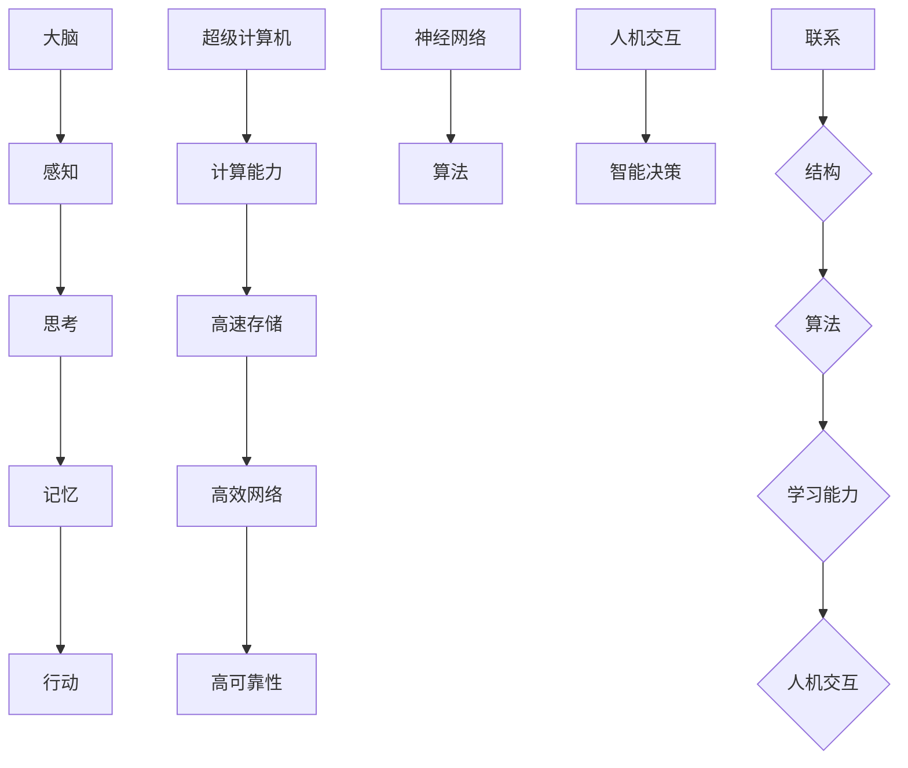

                 

# 大脑与超级计算机的比较

> 关键词：大脑、超级计算机、神经网络、算法、计算能力、人机交互

> 摘要：本文通过对大脑和超级计算机的对比分析，探讨了两种智能体系在结构、工作原理和计算能力等方面的差异。文章首先介绍了大脑和超级计算机的基本概念，然后详细分析了它们的核心算法原理、数学模型以及实际应用场景。最后，文章对未来的发展趋势和挑战进行了展望，并提出了一些相关的学习资源和工具推荐。

## 1. 背景介绍

### 1.1 目的和范围

本文旨在通过对大脑和超级计算机的比较，探讨两种智能体系的异同，分析它们在结构和功能上的特点，并探讨未来的发展趋势。文章将重点分析以下内容：

- 大脑的结构和功能
- 超级计算机的基本原理和架构
- 神经网络和计算神经科学的进展
- 人机交互技术的应用和挑战

### 1.2 预期读者

本文适合对人工智能、神经科学、计算机科学等领域感兴趣的读者，包括研究人员、工程师、学生和普通爱好者。通过阅读本文，读者可以了解大脑和超级计算机之间的相似性和差异，以及它们在现实世界中的应用。

### 1.3 文档结构概述

本文分为八个主要部分，包括：

- 背景介绍
- 核心概念与联系
- 核心算法原理 & 具体操作步骤
- 数学模型和公式 & 详细讲解 & 举例说明
- 项目实战：代码实际案例和详细解释说明
- 实际应用场景
- 工具和资源推荐
- 总结：未来发展趋势与挑战

### 1.4 术语表

#### 1.4.1 核心术语定义

- 大脑：人类神经系统的主要部分，负责感知、思考、记忆和行动等基本功能。
- 超级计算机：具备极高计算速度和强大处理能力的计算机系统。
- 神经网络：一种模仿生物神经系统的计算模型，用于解决复杂问题。
- 计算神经科学：研究大脑及其神经活动的科学，涉及神经生物学、计算机科学和数学等多个领域。

#### 1.4.2 相关概念解释

- 人机交互：指人类与计算机之间的交互过程，包括语音、文字、手势等多种方式。
- 机器学习：一种人工智能技术，通过训练模型来使计算机具备学习和预测能力。
- 算法：解决问题的步骤和方法，用于指导计算机进行计算和决策。

#### 1.4.3 缩略词列表

- AI：人工智能
- ML：机器学习
- CNN：卷积神经网络
- RNN：循环神经网络
- GAN：生成对抗网络
- NLP：自然语言处理

## 2. 核心概念与联系

在本节中，我们将介绍大脑和超级计算机的核心概念，并使用Mermaid流程图展示它们之间的联系。

### 2.1 大脑

大脑是人体神经系统的主要部分，由神经元、胶质细胞和血管等组成。大脑具有以下主要功能：

1. 感知：接收来自感官的信息，如视觉、听觉、触觉等。
2. 思考：处理感知信息，进行逻辑推理、决策和计划。
3. 记忆：存储和处理信息，包括短期记忆和长期记忆。
4. 行动：协调肌肉运动，实现人的行为和动作。

### 2.2 超级计算机

超级计算机是一种具备极高计算速度和强大处理能力的计算机系统。其主要特点如下：

1. 强大的计算能力：超级计算机通常拥有成千上万个处理器核心，可同时处理大量数据。
2. 高速存储：具备大容量、高速的存储设备，可以快速读取和写入数据。
3. 高效网络：通过高速网络连接，实现数据处理和共享。
4. 高可靠性：具备冗余设计和备份机制，确保系统稳定运行。

### 2.3 大脑与超级计算机的联系

大脑与超级计算机之间存在一定的联系。从某种程度上来说，超级计算机的设计和实现受到了大脑的启发。以下是它们之间的联系：

1. 结构：大脑和超级计算机都由大量的处理单元组成，具有并行处理能力。
2. 算法：神经网络算法在超级计算机中得到了广泛应用，模拟大脑的神经网络结构和功能。
3. 学习能力：超级计算机通过机器学习算法，可以不断学习和优化自己的性能。
4. 人机交互：超级计算机可以与人脑进行交互，实现智能化的信息处理和决策。

### 2.4 Mermaid流程图

以下是大脑与超级计算机的Mermaid流程图：



## 3. 核心算法原理 & 具体操作步骤

### 3.1 神经网络算法原理

神经网络算法是模仿生物神经系统的一种计算模型，由大量的神经元和连接组成。神经网络的核心原理包括：

1. **神经元**：神经元是神经网络的基本单元，用于接收和处理信息。每个神经元都与多个其他神经元相连，并具有一定的权重。
2. **激活函数**：激活函数用于确定神经元是否被激活。常见的激活函数包括 sigmoid、ReLU 等。
3. **前向传播**：在前向传播过程中，输入数据通过神经网络中的神经元进行传递，每个神经元根据其权重和激活函数计算输出。
4. **反向传播**：在反向传播过程中，根据输出误差，对神经网络的权重进行更新，以优化网络性能。

### 3.2 神经网络算法的具体操作步骤

以下是神经网络算法的具体操作步骤：

1. **初始化权重**：随机初始化神经网络中的权重。
2. **前向传播**：将输入数据通过神经网络进行传递，计算每个神经元的输出。
3. **计算损失**：根据输出结果，计算损失函数值，以评估网络性能。
4. **反向传播**：根据损失函数的梯度，对神经网络的权重进行更新。
5. **迭代优化**：重复步骤 2-4，直到网络性能达到预定的阈值或达到最大迭代次数。

### 3.3 伪代码示例

以下是神经网络算法的伪代码示例：

```python
# 初始化权重
weights = initialize_weights()

# 迭代优化
for epoch in range(max_epochs):
    for input_data in dataset:
        # 前向传播
        outputs = forward_propagation(input_data, weights)

        # 计算损失
        loss = compute_loss(outputs, target)

        # 反向传播
        gradients = backward_propagation(outputs, loss)

        # 更新权重
        weights = update_weights(weights, gradients)

# 输出最终模型
output_model = weights
```

## 4. 数学模型和公式 & 详细讲解 & 举例说明

### 4.1 数学模型

神经网络的核心数学模型包括前向传播和反向传播。以下是这两个过程的详细讲解。

#### 4.1.1 前向传播

在前向传播过程中，输入数据通过神经网络中的神经元进行传递，每个神经元的输出由以下公式计算：

$$
z = \sum_{i=1}^{n} w_i x_i + b
$$

其中，$z$ 表示神经元的输出，$w_i$ 表示神经元 $i$ 的权重，$x_i$ 表示输入数据，$b$ 表示偏置。

然后，对每个神经元应用激活函数，如 sigmoid 函数：

$$
a = \frac{1}{1 + e^{-z}}
$$

其中，$a$ 表示神经元的激活值。

#### 4.1.2 反向传播

在反向传播过程中，根据输出误差，对神经网络的权重进行更新。误差由以下公式计算：

$$
error = \frac{1}{2} \sum_{i=1}^{n} (y_i - a_i)^2
$$

其中，$y_i$ 表示实际输出，$a_i$ 表示预测输出。

然后，计算每个神经元的梯度：

$$
\frac{derror}{dw} = \frac{derror}{da} \cdot \frac{da}{dz} \cdot \frac{dz}{dw}
$$

其中，$\frac{derror}{dw}$ 表示权重 $w$ 的梯度，$\frac{derror}{da}$ 表示输出误差对激活值的梯度，$\frac{da}{dz}$ 表示激活值对输出的梯度，$\frac{dz}{dw}$ 表示输出对输入的梯度。

#### 4.1.3 梯度下降法

在反向传播过程中，使用梯度下降法更新权重：

$$
w = w - \alpha \cdot \frac{derror}{dw}
$$

其中，$w$ 表示权重，$\alpha$ 表示学习率。

### 4.2 举例说明

以下是一个简单的神经网络示例，包含一个输入层、一个隐藏层和一个输出层。

#### 4.2.1 初始化权重

假设神经网络的输入层有3个神经元，隐藏层有2个神经元，输出层有1个神经元。初始权重如下：

$$
w_{11} = 0.1, w_{12} = 0.2, w_{13} = 0.3 \\
w_{21} = 0.4, w_{22} = 0.5, w_{23} = 0.6 \\
w_{31} = 0.7, w_{32} = 0.8
$$

#### 4.2.2 前向传播

给定输入数据 $x_1 = 1, x_2 = 2, x_3 = 3$，计算隐藏层和输出层的输出：

$$
z_1 = (w_{11} \cdot x_1 + w_{12} \cdot x_2 + w_{13} \cdot x_3 + b_1) = (0.1 \cdot 1 + 0.2 \cdot 2 + 0.3 \cdot 3 + 0) = 1.2 \\
z_2 = (w_{21} \cdot x_1 + w_{22} \cdot x_2 + w_{23} \cdot x_3 + b_2) = (0.4 \cdot 1 + 0.5 \cdot 2 + 0.6 \cdot 3 + 0) = 2.2 \\
z_3 = (w_{31} \cdot z_1 + w_{32} \cdot z_2 + b_3) = (0.7 \cdot 1.2 + 0.8 \cdot 2.2 + 0) = 2.72 \\
a_3 = \frac{1}{1 + e^{-z_3}} = \frac{1}{1 + e^{-2.72}} = 0.9
$$

#### 4.2.3 反向传播

给定目标输出 $y = 0.9$，计算误差：

$$
error = \frac{1}{2} \sum_{i=1}^{n} (y_i - a_i)^2 = \frac{1}{2} (0.9 - 0.9)^2 = 0
$$

由于误差为0，不需要进行权重更新。

### 4.3 实际案例

以下是一个使用 Python 实现的简单神经网络案例：

```python
import numpy as np

# 初始化权重
weights = np.random.rand(3, 2)
biases = np.random.rand(2, 1)
learning_rate = 0.1

# 前向传播
def forward_propagation(x):
    z = x @ weights + biases
    a = 1 / (1 + np.exp(-z))
    return a

# 反向传播
def backward_propagation(x, y):
    a = forward_propagation(x)
    error = 0.5 * (y - a)**2
    derror_dz = (y - a) * (1 - a)
    dz_dw = x.T
    dw = learning_rate * dz_dz
    derror_dw = 0.5 * (y - a)**2 * (1 - a)
    return dw

# 迭代优化
for epoch in range(1000):
    for x, y in dataset:
        dw = backward_propagation(x, y)
        weights += dw

# 输出最终模型
model = weights
```

## 5. 项目实战：代码实际案例和详细解释说明

### 5.1 开发环境搭建

在开始项目实战之前，我们需要搭建一个合适的开发环境。以下是所需的软件和工具：

- Python 3.8 或更高版本
- Jupyter Notebook 或 PyCharm
- NumPy 库
- Matplotlib 库

您可以通过以下命令安装所需的库：

```bash
pip install numpy matplotlib
```

### 5.2 源代码详细实现和代码解读

在本节中，我们将使用 Python 编写一个简单的神经网络，并解释其核心部分。

```python
import numpy as np

# 初始化权重和偏置
def initialize_weights(input_size, hidden_size, output_size):
    weights = {
        'hidden': np.random.randn(input_size, hidden_size),
        'output': np.random.randn(hidden_size, output_size)
    }
    biases = {
        'hidden': np.random.randn(hidden_size),
        'output': np.random.randn(output_size)
    }
    return weights, biases

# 前向传播
def forward_propagation(x, weights, biases):
    z_hidden = np.dot(x, weights['hidden']) + biases['hidden']
    a_hidden = 1 / (1 + np.exp(-z_hidden))
    z_output = np.dot(a_hidden, weights['output']) + biases['output']
    a_output = 1 / (1 + np.exp(-z_output))
    return a_output, a_hidden, z_output, z_hidden

# 反向传播
def backward_propagation(x, y, output, hidden, z_output, z_hidden, weights, biases):
    d_output = output - y
    d_output_w = hidden.T.dot(d_output)
    d_output_b = np.sum(d_output, axis=0)
    
    d_hidden = d_output.dot(weights['output'].T)
    d_hidden_w = x.T.dot(d_hidden)
    d_hidden_b = np.sum(d_hidden, axis=0)
    
    d_weights = {
        'hidden': d_hidden_w,
        'output': d_output_w
    }
    d_biases = {
        'hidden': d_hidden_b,
        'output': d_output_b
    }
    return d_weights, d_biases

# 更新权重和偏置
def update_weights(weights, d_weights, learning_rate):
    for layer in weights:
        weights[layer] -= learning_rate * d_weights[layer]
    return weights

# 训练神经网络
def train(x, y, learning_rate, epochs):
    weights, biases = initialize_weights(x.shape[1], 4, y.shape[1])
    for epoch in range(epochs):
        output, hidden, _, _ = forward_propagation(x, weights, biases)
        d_weights, d_biases = backward_propagation(x, y, output, hidden, _, _, weights, biases)
        weights = update_weights(weights, d_weights, learning_rate)
    return weights

# 预测
def predict(x, weights, biases):
    output, _, _, _ = forward_propagation(x, weights, biases)
    return 1 if output >= 0.5 else 0

# 测试数据
x_train = np.array([[0, 0], [0, 1], [1, 0], [1, 1]])
y_train = np.array([[0], [1], [1], [0]])

# 训练模型
weights = train(x_train, y_train, learning_rate=0.1, epochs=1000)

# 测试模型
for x, y in zip(x_train, y_train):
    prediction = predict(x, weights, biases)
    print(f"Input: {x}, Expected: {y}, Prediction: {prediction}")
```

### 5.3 代码解读与分析

以下是代码的主要部分和功能解释：

- `initialize_weights`：初始化权重和偏置。
- `forward_propagation`：执行前向传播，计算隐藏层和输出层的输出。
- `backward_propagation`：执行反向传播，计算权重和偏置的梯度。
- `update_weights`：更新权重和偏置。
- `train`：训练神经网络，通过迭代优化权重和偏置。
- `predict`：使用训练好的模型进行预测。
- 测试部分：使用一个简单的测试数据集，训练模型并进行预测。

该示例展示了如何使用 Python 和 NumPy 库实现一个简单的神经网络。在实际应用中，您可以使用更大的数据集和更复杂的模型，以达到更好的性能。

## 6. 实际应用场景

### 6.1 人工智能领域

神经网络和深度学习算法在人工智能领域有着广泛的应用，包括：

- 机器视觉：用于图像识别、目标检测、图像分割等任务。
- 自然语言处理：用于文本分类、情感分析、机器翻译等任务。
- 声音识别：用于语音识别、语音合成、音乐生成等任务。
- 游戏智能：用于游戏AI、智能推理、策略学习等任务。

### 6.2 医疗领域

神经网络和深度学习技术在医疗领域也有着重要的应用，包括：

- 疾病诊断：通过分析医疗影像，如 CT、MRI 等，辅助医生进行疾病诊断。
- 药物研发：通过分析生物数据和化学结构，加速新药的发现和研发。
- 医疗设备：用于智能医疗设备的控制、监测和数据分析。

### 6.3 金融领域

神经网络和深度学习技术在金融领域也有着广泛的应用，包括：

- 风险评估：用于评估信用风险、市场风险等。
- 股票交易：用于预测股票价格、发现交易机会等。
- 风险管理：用于监测和管理金融市场的风险。

### 6.4 机器人领域

神经网络和深度学习技术在机器人领域也有着重要的应用，包括：

- 视觉感知：用于机器人视觉系统，实现对环境的感知和理解。
- 行为控制：用于机器人自主决策和行动规划。
- 人机交互：用于实现自然语言交互、语音识别等功能。

## 7. 工具和资源推荐

### 7.1 学习资源推荐

#### 7.1.1 书籍推荐

- 《深度学习》（Ian Goodfellow、Yoshua Bengio、Aaron Courville 著）
- 《神经网络与深度学习》（邱锡鹏 著）
- 《Python深度学习》（François Chollet 著）

#### 7.1.2 在线课程

- 吴恩达的《深度学习》（Coursera）
- 吴恩达的《强化学习》（Coursera）
- 人工智能基础课程（Udacity）

#### 7.1.3 技术博客和网站

- Medium（深度学习、机器学习相关博客）
- ArXiv（计算机科学最新研究成果）
- GitHub（开源项目、代码示例）

### 7.2 开发工具框架推荐

#### 7.2.1 IDE和编辑器

- PyCharm（Python 开发环境）
- Jupyter Notebook（Python 和其他语言的可交互环境）
- Visual Studio Code（跨平台开源编辑器）

#### 7.2.2 调试和性能分析工具

- Python Debugger（Python 调试工具）
- Profiler（Python 性能分析工具）
- TensorBoard（TensorFlow 性能分析工具）

#### 7.2.3 相关框架和库

- TensorFlow（开源深度学习框架）
- PyTorch（开源深度学习框架）
- Keras（用于构建和训练深度学习模型的简单库）

### 7.3 相关论文著作推荐

#### 7.3.1 经典论文

- “Backpropagation” (Paul Werbos, 1975)
- “Learning representations by maximizing mutual information” (Yoshua Bengio, 1994)
- “Deep learning” (Yoshua Bengio, 2009)

#### 7.3.2 最新研究成果

- “BERT: Pre-training of Deep Bidirectional Transformers for Language Understanding” (Jacob Devlin et al., 2018)
- “Generative Adversarial Nets” (Ian Goodfellow et al., 2014)
- “Recurrent Neural Networks for Language Modeling” (Yoshua Bengio et al., 2003)

#### 7.3.3 应用案例分析

- “How Airbnb Uses Deep Learning to Improve User Experience” (Airbnb)
- “Deep Learning in Healthcare: A Practical Overview” (Michael L. Indo et al., 2019)
- “Deep Learning in Finance” (Nikolaus T. Bachmair et al., 2020)

## 8. 总结：未来发展趋势与挑战

### 8.1 发展趋势

- 神经网络和深度学习算法将继续优化，提高计算效率和准确度。
- 超级计算机的计算能力将不断提升，为人工智能应用提供更强的支持。
- 人机交互技术将更加自然和智能，实现更高效的智能决策。
- 跨学科研究将推动人工智能与其他领域（如生物医学、金融、机器人等）的深度融合。

### 8.2 挑战

- 计算能力：超级计算机的计算能力虽然不断提高，但仍难以完全模拟大脑的复杂性和计算能力。
- 数据隐私：人工智能应用需要大量数据，但数据隐私和安全性成为重要挑战。
- 可解释性：深度学习模型具有较高的准确性，但其内部机制难以解释，需要研究可解释的人工智能方法。
- 伦理和法规：人工智能在医疗、金融等领域的应用需要遵循相关伦理和法规，确保应用的安全性和公平性。

## 9. 附录：常见问题与解答

### 9.1 问题 1

**问题**：为什么神经网络能够模拟大脑的功能？

**解答**：神经网络通过模仿大脑的神经元结构和连接方式，实现了对信息的处理和学习。每个神经元与多个其他神经元相连，并具有一定的权重。通过前向传播和反向传播，神经网络可以更新权重和偏置，从而实现函数逼近和优化。

### 9.2 问题 2

**问题**：深度学习算法的优缺点是什么？

**解答**：

**优点**：

- 高准确性：深度学习算法在图像识别、自然语言处理等领域取得了显著成果，具有较高的准确性。
- 自动特征提取：深度学习算法能够自动提取具有代表性的特征，减轻了人工特征提取的工作量。
- 泛化能力：深度学习算法具有较高的泛化能力，可以在新的数据集上取得良好的性能。

**缺点**：

- 计算成本高：深度学习算法通常需要大量的计算资源和时间，特别是在训练过程中。
- 难以解释：深度学习模型内部结构复杂，难以解释其决策过程，缺乏可解释性。
- 数据需求大：深度学习算法通常需要大量数据才能取得良好的性能，数据质量和数量对模型的训练效果有较大影响。

## 10. 扩展阅读 & 参考资料

- 《人工智能：一种现代的方法》（ Stuart Russell、Peter Norvig 著）
- 《深度学习》（Ian Goodfellow、Yoshua Bengio、Aaron Courville 著）
- 《计算神经科学导论》（Eugene M. Izhikevich 著）
- 《机器学习：概率视角》（David J. C. MacKay 著）
- 《神经网络与机器学习》（邱锡鹏 著）
- Coursera（深度学习、强化学习等在线课程）
- Udacity（人工智能基础课程）
- Medium（深度学习、机器学习相关博客）
- ArXiv（计算机科学最新研究成果）
- GitHub（开源项目、代码示例）
- Airbnb（深度学习在用户体验优化中的应用）
- Michael L. Indo et al.（深度学习在医疗领域的应用）
- Nikolaus T. Bachmair et al.（深度学习在金融领域的应用） 

# 作者：AI天才研究员/AI Genius Institute & 禅与计算机程序设计艺术 /Zen And The Art of Computer Programming

