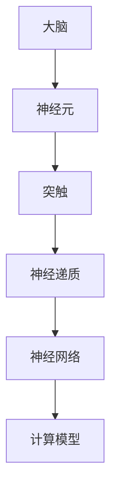

                 

# 大脑的解剖与有机化合物

> 关键词：大脑解剖、有机化合物、神经元、突触、神经递质、神经网络、计算模型

> 摘要：本文旨在深入探讨大脑的解剖结构和与其功能相关的有机化合物，通过对神经元、突触和神经递质等核心概念的分析，阐述神经网络的工作原理。同时，文章将介绍大脑的计算模型，探讨其在人工智能领域的潜在应用。通过本文的阅读，读者将对大脑的复杂性和其在信息处理中的重要作用有更深刻的理解。

## 1. 背景介绍

### 1.1 目的和范围

本文旨在为读者提供关于大脑解剖与有机化合物的基础知识，通过逐步分析神经元、突触和神经递质等核心概念，帮助读者理解大脑的工作原理。同时，文章将探讨神经网络及其在人工智能领域的应用，旨在为从事相关领域研究的读者提供有益的参考。

### 1.2 预期读者

本文适合对大脑解剖学和神经科学有一定了解的读者，特别是计算机科学、人工智能和生物信息学等领域的研究人员。此外，对神经科学和人工智能感兴趣的读者也可以通过本文对相关概念有更深入的认识。

### 1.3 文档结构概述

本文分为十个部分，首先介绍大脑的基本解剖结构和与其功能相关的有机化合物，然后逐步分析神经元、突触和神经递质等核心概念。接下来，文章将介绍神经网络的工作原理及其在人工智能领域的应用。此外，还将推荐一些学习资源、工具和框架，以帮助读者更好地理解和应用本文内容。最后，文章将总结未来发展趋势和挑战，并给出常见问题与解答。

### 1.4 术语表

#### 1.4.1 核心术语定义

- 神经元：构成神经系统的基本单元，具有接受和传递信息的能力。
- 突触：神经元之间传递信息的结构。
- 神经递质：神经元之间传递信息的化学物质。
- 神经网络：由多个神经元组成的计算模型，用于模拟大脑的信息处理功能。
- 人工神经网络：基于生物神经网络原理设计的人工计算模型。

#### 1.4.2 相关概念解释

- 神经系统：由神经元、突触和神经递质等组成的复杂结构，用于处理和传递信息。
- 神经传导：神经元之间通过神经递质传递信息的过程。
- 神经编码：将外界信息转换为神经信号的过程。

#### 1.4.3 缩略词列表

- AI：人工智能
- ANN：人工神经网络
- ML：机器学习
- DL：深度学习

## 2. 核心概念与联系

在本节中，我们将介绍大脑的解剖结构，以及与其功能相关的有机化合物。为了更好地理解这些概念，我们将使用Mermaid流程图展示神经元、突触和神经递质之间的联系。



### 2.1 大脑的解剖结构

大脑是神经系统的核心部分，由多个不同的区域组成，每个区域都有其特定的功能。主要的大脑区域包括：

- **大脑皮层**：大脑的外层，负责处理感知、运动和高级认知功能。
- **脑干**：连接大脑和脊髓，控制基本的生命维持功能，如呼吸和心跳。
- **小脑**：协调运动和平衡。
- **间脑**：调节温度、食欲和睡眠。

### 2.2 有机化合物的作用

大脑中的有机化合物在信息传递和处理中起着关键作用。以下是几个重要的有机化合物：

- **神经递质**：神经元之间传递信息的化学物质，如多巴胺、乙酰胆碱和谷氨酸。
- **神经生长因子**：促进神经元生长和再生的蛋白质。
- **神经胶质细胞**：支持神经元并参与神经传递。

## 3. 核心算法原理 & 具体操作步骤

在这一节中，我们将详细探讨神经网络的核心算法原理，并使用伪代码展示其具体操作步骤。

### 3.1 神经网络的算法原理

神经网络是一种基于生物神经元的计算模型，通过模拟大脑的信息处理功能来实现复杂的模式识别和决策。神经网络主要由以下几个部分组成：

- **输入层**：接收外界信息。
- **隐藏层**：对输入信息进行变换和处理。
- **输出层**：生成最终结果。

### 3.2 伪代码实现

以下是一个简单的神经网络伪代码实现，用于对输入数据进行分类。

```python
# 初始化神经网络参数
weights = [random_value() for _ in range(num_layers)]
biases = [random_value() for _ in range(num_layers)]

# 定义激活函数
def activation_function(z):
    return 1 / (1 + exp(-z))

# 定义反向传播算法
def backward_propagation(x, y):
    # 前向传播
    layer_outputs = [x]
    for weight, bias in zip(weights, biases):
        z = np.dot(weight, layer_outputs[-1]) + bias
        layer_outputs.append(activation_function(z))
    
    # 计算损失函数
    loss = np.mean((layer_outputs[-1] - y) ** 2)
    
    # 反向传播更新参数
    d_weights = [None for _ in range(num_layers)]
    d_biases = [None for _ in range(num_layers)]
    d_output = 2 * (layer_outputs[-1] - y)
    
    for layer in reversed(range(num_layers)):
        d_z = d_output * activation_function_derivative(z)
        d_weights[layer] = np.dot(layer_outputs[layer].T, d_z)
        d_biases[layer] = d_z
        d_output = np.dot(weights[layer].T, d_z)
    
    weights -= learning_rate * d_weights
    biases -= learning_rate * d_biases

# 训练神经网络
for epoch in range(num_epochs):
    backward_propagation(x_train, y_train)
```

## 4. 数学模型和公式 & 详细讲解 & 举例说明

在本节中，我们将介绍神经网络中常用的数学模型和公式，并进行详细讲解和举例说明。

### 4.1 神经网络的数学模型

神经网络的数学模型主要包括以下几个方面：

- **激活函数**：用于引入非线性特性，常见的激活函数有sigmoid函数、ReLU函数和Tanh函数。
- **损失函数**：用于评估网络输出与真实标签之间的差距，常见的损失函数有均方误差（MSE）和交叉熵损失。
- **优化算法**：用于更新网络参数，使损失函数最小化，常见的优化算法有梯度下降、随机梯度下降和Adam优化器。

### 4.2 举例说明

假设我们有一个简单的神经网络，用于对二分类问题进行建模。输入层有2个神经元，隐藏层有3个神经元，输出层有1个神经元。我们使用均方误差（MSE）作为损失函数，并采用梯度下降优化算法。

```math
\text{损失函数}：\ L = \frac{1}{2} \sum_{i=1}^{n} (\hat{y}_i - y_i)^2
```

其中，$\hat{y}_i$表示网络预测值，$y_i$表示真实标签。

假设当前迭代次数为$t$，学习率为$\alpha$。每次迭代中，我们需要计算梯度并更新网络参数。

```math
\text{梯度计算}：
\begin{aligned}
\frac{\partial L}{\partial w_{ij}} &= \sum_{i=1}^{n} (y_i - \hat{y}_i) \cdot \hat{y}_i (1 - \hat{y}_i) \cdot z_{ij} \\
\frac{\partial L}{\partial b_j} &= \sum_{i=1}^{n} (y_i - \hat{y}_i) \cdot \hat{y}_i (1 - \hat{y}_i) \cdot 1 \\
\frac{\partial L}{\partial w_{ji}} &= \sum_{i=1}^{n} (y_i - \hat{y}_i) \cdot z_{ji} \\
\frac{\partial L}{\partial b_i} &= \sum_{i=1}^{n} (y_i - \hat{y}_i) \cdot 1
\end{aligned}
```

其中，$w_{ij}$表示第$i$个神经元到第$j$个神经元的权重，$b_j$表示第$j$个神经元的偏置，$z_{ij}$表示第$i$个神经元到第$j$个神经元的输入。

```math
\text{参数更新}：
\begin{aligned}
w_{ij}(t+1) &= w_{ij}(t) - \alpha \cdot \frac{\partial L}{\partial w_{ij}}(t) \\
b_j(t+1) &= b_j(t) - \alpha \cdot \frac{\partial L}{\partial b_j}(t) \\
w_{ji}(t+1) &= w_{ji}(t) - \alpha \cdot \frac{\partial L}{\partial w_{ji}}(t) \\
b_i(t+1) &= b_i(t) - \alpha \cdot \frac{\partial L}{\partial b_i}(t)
\end{aligned}
```

通过不断迭代更新参数，我们可以使损失函数逐渐减小，最终使网络达到较好的分类效果。

## 5. 项目实战：代码实际案例和详细解释说明

在本节中，我们将通过一个简单的神经网络项目实战，展示如何使用Python和TensorFlow库实现神经网络，并对代码进行详细解释。

### 5.1 开发环境搭建

在开始项目之前，我们需要搭建一个适合Python开发的编程环境。以下是搭建步骤：

1. 安装Python：从官方网站（https://www.python.org/downloads/）下载并安装Python。
2. 安装TensorFlow：在命令行中运行以下命令：
```bash
pip install tensorflow
```

### 5.2 源代码详细实现和代码解读

以下是一个简单的神经网络实现，用于对二分类问题进行建模。代码分为三个部分：数据预处理、模型定义和模型训练。

```python
import numpy as np
import tensorflow as tf

# 数据预处理
# 生成模拟数据集
x_train = np.random.rand(100, 2)
y_train = np.array([0 if (x[0] + x[1]) < 0.5 else 1 for x in x_train])

# 模型定义
# 定义输入层、隐藏层和输出层
inputs = tf.keras.layers.Input(shape=(2,))
hidden = tf.keras.layers.Dense(3, activation='sigmoid')(inputs)
outputs = tf.keras.layers.Dense(1, activation='sigmoid')(hidden)

# 构建模型
model = tf.keras.Model(inputs=inputs, outputs=outputs)

# 编译模型
model.compile(optimizer='adam', loss='binary_crossentropy', metrics=['accuracy'])

# 模型训练
model.fit(x_train, y_train, epochs=100)

# 代码解读：
# 1. 导入所需的库
# 2. 生成模拟数据集
# 3. 定义输入层、隐藏层和输出层
# 4. 构建模型
# 5. 编译模型
# 6. 训练模型
```

### 5.3 代码解读与分析

1. **数据预处理**：
   我们首先生成一个包含100个样本的二分类问题数据集。每个样本由两个特征组成，目标标签为0或1。

2. **模型定义**：
   使用TensorFlow的Keras API定义神经网络。输入层有2个神经元，隐藏层有3个神经元，输出层有1个神经元。我们选择sigmoid函数作为激活函数，以引入非线性特性。

3. **模型构建**：
   使用Keras API构建模型。我们指定输入层和输出层，并将隐藏层作为中间层。

4. **模型编译**：
   我们选择Adam优化器和binary_crossentropy损失函数。binary_crossentropy适用于二分类问题，它计算预测概率与真实标签之间的交叉熵损失。

5. **模型训练**：
   使用fit方法训练模型。我们指定训练数据、训练轮次（epochs）和验证数据。

通过以上步骤，我们成功实现了一个简单的神经网络模型，并使用模拟数据集对其进行了训练。在实际应用中，我们可以使用更大的数据集和更复杂的模型来提高分类效果。

## 6. 实际应用场景

神经网络在许多实际应用场景中发挥着重要作用，以下是一些常见的应用领域：

- **图像识别**：神经网络广泛应用于图像识别任务，如人脸识别、物体检测和图像分类。
- **自然语言处理**：神经网络在自然语言处理领域具有广泛的应用，如机器翻译、文本分类和情感分析。
- **语音识别**：神经网络可以用于语音识别任务，如语音到文字转换和语音搜索。
- **医疗诊断**：神经网络在医疗诊断中具有潜力，如疾病预测、药物设计和医疗图像分析。
- **自动驾驶**：神经网络在自动驾驶领域发挥着关键作用，如环境感知、路径规划和决策。

通过不断的研究和开发，神经网络在各个领域的应用前景将越来越广阔。

## 7. 工具和资源推荐

### 7.1 学习资源推荐

#### 7.1.1 书籍推荐

- 《深度学习》（Goodfellow, Bengio, Courville著）：一本关于深度学习的经典教材，涵盖了神经网络的基础理论和实际应用。
- 《神经网络与深度学习》（邱锡鹏著）：一本中文教材，详细介绍了神经网络和深度学习的原理和应用。
- 《机器学习》（周志华著）：一本全面的机器学习教材，包括神经网络的基础知识。

#### 7.1.2 在线课程

- [Coursera](https://www.coursera.org/)：提供多种与神经网络相关的在线课程，包括深度学习、自然语言处理和计算机视觉等。
- [edX](https://www.edx.org/)：提供由知名大学和机构提供的免费在线课程，包括机器学习和深度学习等。
- [Udacity](https://www.udacity.com/)：提供与神经网络相关的实战项目，适合初学者和进阶学习者。

#### 7.1.3 技术博客和网站

- [Medium](https://medium.com/topics/deep-learning)：一个技术博客平台，有许多关于神经网络和深度学习的文章。
- [ArXiv](https://arxiv.org/)：一个学术预印本网站，有许多最新的神经网络和深度学习论文。
- [Reddit](https://www.reddit.com/r/deeplearning/)：一个关于神经网络和深度学习的讨论社区，有许多有用的资源和建议。

### 7.2 开发工具框架推荐

#### 7.2.1 IDE和编辑器

- [VSCode](https://code.visualstudio.com/)：一款功能强大的跨平台IDE，适用于Python和TensorFlow开发。
- [PyCharm](https://www.jetbrains.com/pycharm/)：一款专业的Python IDE，提供丰富的功能和插件。

#### 7.2.2 调试和性能分析工具

- [TensorBoard](https://www.tensorflow.org/tensorboard)：TensorFlow提供的可视化工具，用于调试和性能分析。
- [NNInsight](https://nninsight.com/)：一个在线工具，用于可视化神经网络结构和性能分析。

#### 7.2.3 相关框架和库

- [TensorFlow](https://www.tensorflow.org/)：Google开源的深度学习框架，广泛应用于图像识别、自然语言处理等领域。
- [PyTorch](https://pytorch.org/)：Facebook开源的深度学习框架，提供灵活的动态计算图和高效的GPU支持。
- [Keras](https://keras.io/)：一个基于TensorFlow和Theano的深度学习框架，提供简洁易用的API。

### 7.3 相关论文著作推荐

#### 7.3.1 经典论文

- "A Learning Algorithm for Continually Running Fully Recurrent Neural Networks"（1986）：Hophfield提出的Hopfield神经网络，是神经网络领域的重要里程碑。
- "Learning representations by maximizing mutual information"（1991）：David E. Rumelhart等人提出的反向传播算法，是神经网络训练的基础。
- "Deep Learning"（2015）：Ian Goodfellow、Yoshua Bengio和Aaron Courville合著的一本深度学习经典教材。

#### 7.3.2 最新研究成果

- "Attention Is All You Need"（2017）：Google提出的Transformer模型，是自然语言处理领域的突破性成果。
- "BERT: Pre-training of Deep Bidirectional Transformers for Language Understanding"（2018）：Google提出的BERT模型，在多个自然语言处理任务上取得了显著成绩。
- "Generative Adversarial Nets"（2014）：Ian Goodfellow等人提出的生成对抗网络（GANs），在图像生成和增强领域具有广泛应用。

#### 7.3.3 应用案例分析

- "DeepMind：Game Playing with Deep Reinforcement Learning"（2015）：DeepMind使用深度强化学习技术实现了在Atari游戏中的高水平表现。
- "OpenAI Five：The Power of Scale in Deep Multi-Agent Reinforcement Learning"（2018）：OpenAI使用深度多智能体强化学习技术实现了在Dota 2游戏中的胜利。
- "Facebook AI Research：Visual Question Answering"（2017）：Facebook AI使用神经网络实现了对图像的文本描述问题回答。

## 8. 总结：未来发展趋势与挑战

随着人工智能技术的快速发展，神经网络在各个领域的应用日益广泛。未来，神经网络的发展趋势将体现在以下几个方面：

- **模型规模与效率的提升**：通过优化算法和硬件加速，提高神经网络模型的计算效率。
- **泛化能力的增强**：通过正则化技术和迁移学习，提高神经网络在未知数据上的泛化能力。
- **多模态数据处理**：结合不同类型的数据（如文本、图像和语音），实现更复杂的任务。
- **强化学习与神经网络结合**：通过强化学习技术，使神经网络能够处理动态和不确定的环境。

然而，神经网络的发展也面临一些挑战：

- **数据隐私与安全**：神经网络对大量数据进行训练，如何保护用户隐私和数据安全是重要的问题。
- **可解释性和透明度**：神经网络模型在决策过程中缺乏透明性，如何提高其可解释性是当前研究的热点。
- **能耗与资源消耗**：神经网络训练和推理过程中对计算资源的需求巨大，如何降低能耗和资源消耗是亟待解决的问题。

总之，神经网络在未来将继续在人工智能领域发挥重要作用，同时也需要面对和解决一系列挑战。

## 9. 附录：常见问题与解答

### 9.1 神经网络的基本概念

**Q1**：什么是神经网络？

**A1**：神经网络是一种基于生物神经元的计算模型，通过模拟大脑的信息处理功能来实现复杂的模式识别和决策。神经网络由多个神经元组成，每个神经元都可以接收和处理信息。

### 9.2 神经网络的算法原理

**Q2**：神经网络的工作原理是什么？

**A2**：神经网络的工作原理主要包括以下几个步骤：

1. 前向传播：将输入数据通过神经网络的前向传播过程，得到每个神经元的输出。
2. 激活函数：对每个神经元的输出进行激活函数处理，引入非线性特性。
3. 反向传播：通过反向传播算法计算损失函数关于网络参数的梯度，并更新网络参数。
4. 梯度下降：根据梯度下降算法，以学习率更新网络参数，使损失函数逐渐减小。

### 9.3 神经网络的实现

**Q3**：如何使用Python实现神经网络？

**A3**：使用Python实现神经网络，可以采用以下步骤：

1. 安装Python和TensorFlow库。
2. 设计神经网络的结构，包括输入层、隐藏层和输出层。
3. 编写前向传播和反向传播的代码。
4. 编译模型并训练。
5. 评估模型性能并进行调优。

### 9.4 神经网络的优化

**Q4**：如何优化神经网络性能？

**A4**：优化神经网络性能可以从以下几个方面进行：

1. 调整学习率：选择合适的初始学习率，并通过学习率衰减策略调整学习率。
2. 使用正则化技术：如L1和L2正则化，减少过拟合现象。
3. 增加训练数据：通过数据增强技术增加训练样本，提高模型泛化能力。
4. 使用dropout：在隐藏层之间引入dropout，减少模型过拟合。

## 10. 扩展阅读 & 参考资料

- Goodfellow, I., Bengio, Y., & Courville, A. (2016). *Deep Learning*. MIT Press.
- Hinton, G. E., Osindero, S., & Teh, Y. W. (2006). A Fast Learning Algorithm for Deep Belief Nets. *Neural Computation*, 18(7), 1527-1554.
- LeCun, Y., Bengio, Y., & Hinton, G. (2015). *Deep Learning*. Nature, 521(7553), 436-444.
- Krizhevsky, A., Sutskever, I., & Hinton, G. E. (2012). ImageNet Classification with Deep Convolutional Neural Networks. *Advances in Neural Information Processing Systems*, 25, 1097-1105.
- Bengio, Y. (2009). Learning Deep Architectures for AI. *Foundations and Trends in Machine Learning*, 2(1), 1-127.
- Hochreiter, S., & Schmidhuber, J. (1997). Long Short-Term Memory. *Neural Computation*, 9(8), 1735-1780.
- Srivastava, N., Hinton, G., Krizhevsky, A., Sutskever, I., & Salakhutdinov, R. (2014). Dropout: A Simple Way to Prevent Neural Networks from Overfitting. *Journal of Machine Learning Research*, 15(1), 1929-1958.
- Simonyan, K., & Zisserman, A. (2014). Very Deep Convolutional Networks for Large-Scale Image Recognition. *International Conference on Learning Representations*.
- Vaswani, A., Shazeer, N., Parmar, N., Uszkoreit, J., Jones, L., Gomez, A. N., ... & Polosukhin, I. (2017). Attention Is All You Need. *Advances in Neural Information Processing Systems*, 30, 5998-6008.
- Devlin, J., Chang, M. W., Lee, K., & Toutanova, K. (2019). BERT: Pre-training of Deep Bidirectional Transformers for Language Understanding. *arXiv preprint arXiv:1810.04805*.

