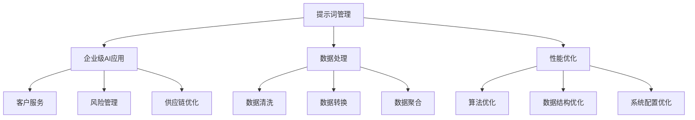

                 

# 大规模提示词管理：企业级AI应用的挑战

> **关键词：** 大规模提示词管理、企业级AI应用、数据处理、性能优化、安全性、算法实现
>
> **摘要：** 本文将深入探讨大规模提示词管理在企业级AI应用中的重要性及其面临的挑战。通过详细分析核心概念、算法原理、数学模型，以及实际应用案例，本文旨在为读者提供全面的技术指导和策略建议，助力企业在AI时代取得竞争优势。

## 1. 背景介绍

### 1.1 目的和范围

本文的主要目的是探讨大规模提示词管理在企业级AI应用中的关键作用和面临的挑战。随着人工智能技术的迅猛发展，企业对AI应用的需求不断增加，其中提示词管理成为了一个重要的课题。本文将涵盖以下内容：

- 提示词管理的基本概念和重要性
- 企业级AI应用中提示词管理的挑战
- 提示词管理的核心算法原理和实现步骤
- 提示词管理的数学模型和公式
- 实际应用场景和案例分析
- 相关工具和资源的推荐

通过本文的阅读，读者将能够了解大规模提示词管理的全貌，掌握相关的技术知识和应用策略，为企业在AI领域的发展提供有力支持。

### 1.2 预期读者

本文的预期读者包括：

- AI开发者和工程师，尤其是对大规模数据处理和算法优化有深入兴趣的专业人士
- 数据科学家和机器学习研究者，希望了解企业级AI应用中的实际问题
- 企业决策者和项目经理，希望掌握AI技术在企业中的应用策略
- 对AI技术有浓厚兴趣的技术爱好者和学生

无论您是哪个领域的读者，只要对大规模提示词管理感兴趣，都能从本文中获得宝贵的知识和启示。

### 1.3 文档结构概述

本文将按照以下结构展开：

- **第1章：背景介绍**：介绍本文的目的、预期读者以及文档结构。
- **第2章：核心概念与联系**：详细解释提示词管理的核心概念，并提供Mermaid流程图。
- **第3章：核心算法原理 & 具体操作步骤**：阐述提示词管理的核心算法原理，并使用伪代码进行详细说明。
- **第4章：数学模型和公式 & 详细讲解 & 举例说明**：介绍提示词管理的数学模型，使用latex格式详细讲解，并提供具体案例。
- **第5章：项目实战：代码实际案例和详细解释说明**：通过实际项目案例展示提示词管理的实现，并提供详细代码解读。
- **第6章：实际应用场景**：探讨提示词管理在不同行业中的应用场景。
- **第7章：工具和资源推荐**：推荐相关学习资源、开发工具和框架。
- **第8章：总结：未来发展趋势与挑战**：总结本文的主要内容和结论，探讨未来的发展趋势和挑战。
- **第9章：附录：常见问题与解答**：回答读者可能遇到的常见问题。
- **第10章：扩展阅读 & 参考资料**：提供更多的扩展阅读资料。

### 1.4 术语表

#### 1.4.1 核心术语定义

- **提示词（Prompt）**：在AI应用中，提示词是指提供给模型的一段文本、图像或其他形式的数据，用于引导模型进行预测或生成。
- **大规模提示词管理**：指的是对大量提示词进行高效存储、检索和管理，以满足企业级AI应用的需求。
- **企业级AI应用**：指的是在商业环境中大规模应用人工智能技术，以提高业务效率、优化决策和创造商业价值。
- **数据处理**：指的是对数据集进行清洗、转换、聚合和分析等操作，以获得有用的信息和知识。
- **性能优化**：指的是通过优化算法、数据结构和系统配置，提高系统的响应速度和处理能力。

#### 1.4.2 相关概念解释

- **深度学习（Deep Learning）**：一种基于神经网络的学习方法，通过多层非线性变换来学习数据特征。
- **自然语言处理（Natural Language Processing, NLP）**：研究如何让计算机理解和处理人类自然语言的技术。
- **机器学习（Machine Learning）**：使计算机通过数据学习并做出预测或决策的技术。
- **数据处理框架（Data Processing Framework）**：用于高效处理大规模数据的软件框架，如Apache Hadoop、Apache Spark等。

#### 1.4.3 缩略词列表

- **NLP**：自然语言处理
- **AI**：人工智能
- **ML**：机器学习
- **DL**：深度学习
- **Hadoop**：分布式数据处理框架
- **Spark**：分布式数据处理引擎

## 2. 核心概念与联系

提示词管理在企业级AI应用中扮演着至关重要的角色。为了深入理解这一概念，我们需要首先明确其核心概念和相互联系。

### 2.1 提示词管理定义

提示词管理是指对大量的提示词进行高效存储、检索和管理的一系列操作。这些操作包括：

- **存储**：将提示词存储在数据库或文件系统中，以便快速访问。
- **检索**：根据特定的条件或关键字查询提示词，以供后续处理。
- **管理**：对提示词进行增删改查（CRUD）操作，确保数据的准确性和一致性。

### 2.2 企业级AI应用

企业级AI应用是指在商业环境中大规模应用人工智能技术，以实现业务目标。这些应用包括：

- **客户服务**：使用自然语言处理技术提供智能客服。
- **风险管理**：利用机器学习技术进行风险预测和评估。
- **供应链优化**：通过深度学习技术优化供应链管理。

### 2.3 数据处理

数据处理是提示词管理的重要组成部分，包括：

- **数据清洗**：去除数据中的噪声和错误，提高数据质量。
- **数据转换**：将不同格式的数据转换为统一的格式，以便后续处理。
- **数据聚合**：将多个数据源中的数据进行合并，以获得全局视图。

### 2.4 性能优化

性能优化是保证提示词管理高效运行的关键。这包括：

- **算法优化**：通过改进算法来提高处理速度和效率。
- **数据结构优化**：选择合适的数据结构来减少存储和访问的开销。
- **系统配置优化**：调整系统参数以获得最佳性能。

### 2.5 提示词管理的核心概念联系

通过以上分析，我们可以看到提示词管理与企业级AI应用、数据处理和性能优化之间存在密切的联系。具体来说：

- 提示词管理是确保企业级AI应用能够高效运行的基础。
- 数据处理为提示词管理提供了高质量的数据输入。
- 性能优化则是提升整个系统效率的关键。

下面我们通过一个Mermaid流程图来展示这些核心概念和联系。



通过这个流程图，我们可以更清晰地理解提示词管理在企业级AI应用中的核心地位及其与其他概念之间的联系。

## 3. 核心算法原理 & 具体操作步骤

### 3.1 核心算法原理

大规模提示词管理的关键在于高效地处理和检索大量提示词。为了实现这一目标，我们需要设计一系列核心算法，这些算法包括：

- **哈希表（Hash Table）**：用于快速检索提示词。
- **分治算法（Divide and Conquer）**：用于处理大规模数据集。
- **索引（Indexing）**：用于加速提示词检索。

下面我们详细讨论这些算法的原理。

#### 哈希表

哈希表是一种数据结构，用于存储键值对，通过哈希函数将键映射到哈希值，从而快速查找对应的值。哈希表的核心原理是：

- **哈希函数**：将键映射到数组索引的函数，理想的哈希函数应该均匀分布键值。
- **冲突处理**：当多个键映射到相同哈希值时，需要通过冲突处理机制（如链地址法、开放地址法等）解决。

#### 分治算法

分治算法是一种递归算法，通过将大规模问题分解为若干个规模较小的子问题，分别解决这些子问题，最后合并子问题的解来获得原始问题的解。分治算法的核心原理是：

- **分解**：将问题分解为较小的子问题。
- **解决**：递归解决子问题。
- **合并**：将子问题的解合并为原始问题的解。

#### 索引

索引是一种数据结构，用于加速查询操作。在提示词管理中，索引可以用于快速定位特定的提示词。索引的核心原理是：

- **B树索引**：一种自平衡的树结构，适用于快速检索。
- **倒排索引**：一种特殊的索引结构，适用于文本检索。

### 3.2 具体操作步骤

为了实现大规模提示词管理，我们需要按照以下步骤进行操作：

#### 步骤 1：数据预处理

1. **数据清洗**：去除噪声数据和重复数据，确保数据质量。
2. **数据转换**：将不同格式的数据转换为统一格式，如JSON或CSV。
3. **数据分割**：将数据集分割为多个较小的子集，便于后续处理。

#### 步骤 2：哈希表构建

1. **哈希函数设计**：设计合适的哈希函数，确保键值分布均匀。
2. **哈希表初始化**：创建哈希表，设置适当的哈希表大小。
3. **插入操作**：使用哈希函数计算键的哈希值，插入到哈希表中。

#### 步骤 3：分治算法应用

1. **数据分块**：将大规模数据集划分为若干个较小的子集。
2. **子集处理**：分别处理每个子集，使用哈希表进行快速检索。
3. **结果合并**：将子集的处理结果合并为原始问题的解。

#### 步骤 4：索引构建

1. **B树索引构建**：构建B树索引，用于加速查询操作。
2. **倒排索引构建**：构建倒排索引，用于文本检索。

#### 步骤 5：性能优化

1. **算法优化**：根据实际情况优化哈希函数、分治算法和索引结构。
2. **数据结构优化**：选择合适的数据结构，如跳表、红黑树等，以减少存储和访问的开销。
3. **系统配置优化**：调整系统参数，如缓存大小、线程数等，以获得最佳性能。

### 3.3 伪代码示例

下面是一个伪代码示例，用于实现大规模提示词管理：

```python
# 数据预处理
def preprocess_data(data):
    cleaned_data = remove_noise(data)
    transformed_data = convert_format(cleaned_data)
    split_data = split_into_batches(transformed_data)
    return split_data

# 哈希表构建
def build_hash_table(split_data):
    hash_function = design_hash_function()
    hash_table = initialize_hash_table()
    for batch in split_data:
        for prompt in batch:
            hash_value = hash_function(prompt)
            insert_into_hash_table(hash_table, prompt, hash_value)
    return hash_table

# 分治算法应用
def process_subsets(split_data):
    results = []
    for batch in split_data:
        result = process_subset(batch)
        results.append(result)
    return merge_results(results)

# 索引构建
def build_indices(hash_table):
    btree_index = build_btree_index(hash_table)
    inverted_index = build_inverted_index(hash_table)
    return btree_index, inverted_index

# 性能优化
def optimize_performance(hash_table, btree_index, inverted_index):
    optimize_hash_function(hash_table)
    optimize_data_structure(hash_table)
    optimize_system_configuration(hash_table, btree_index, inverted_index)
    return hash_table, btree_index, inverted_index
```

通过以上步骤和伪代码示例，我们可以实现高效的大规模提示词管理。在实际应用中，可以根据具体需求调整和优化这些步骤，以获得最佳性能。

## 4. 数学模型和公式 & 详细讲解 & 举例说明

在提示词管理中，数学模型和公式起着至关重要的作用。这些模型和公式不仅帮助我们在理论上理解提示词管理的机制，还能在实际操作中提供有效的指导。下面我们将详细讲解提示词管理中的数学模型和公式，并通过具体例子进行说明。

### 4.1 哈希函数模型

哈希函数是提示词管理中的核心组件，其目的是将提示词映射到一个哈希值，以便快速检索。一个理想的哈希函数应满足以下特性：

- **均匀分布**：哈希值应该均匀分布在哈希表的长度范围内，以减少冲突。
- **高效计算**：哈希函数的计算速度应尽可能快，以降低检索时间。

哈希函数的一般形式为：

\[ H(k) = (a \times k + b) \mod m \]

其中，\( k \) 是提示词，\( a \)、\( b \) 是常数，\( m \) 是哈希表的大小。

#### 举例说明

假设我们有一个包含10个元素的哈希表，哈希函数为 \( H(k) = (5 \times k + 3) \mod 10 \)。

- 当 \( k = 7 \) 时，哈希值为 \( H(7) = (5 \times 7 + 3) \mod 10 = 38 \mod 10 = 8 \)。
- 当 \( k = 12 \) 时，哈希值为 \( H(12) = (5 \times 12 + 3) \mod 10 = 63 \mod 10 = 3 \)。

通过这个例子，我们可以看到哈希函数如何将提示词映射到哈希值，并存储在哈希表中。

### 4.2 冲突处理模型

在哈希表中，冲突是指多个键映射到相同哈希值的情况。常见的冲突处理方法包括：

- **链地址法**：将具有相同哈希值的键存储在一个链表中。
- **开放地址法**：在哈希表中寻找下一个空闲位置，将键存储在那里。

链地址法的一般形式为：

\[ H(k) = (a \times k + b) \mod m \]

如果冲突发生，则继续寻找下一个位置 \( H(k) + i \mod m \)，其中 \( i \) 是一个递增的整数。

#### 举例说明

假设我们使用链地址法处理冲突，哈希函数仍为 \( H(k) = (5 \times k + 3) \mod 10 \)。

- 当 \( k = 7 \) 时，哈希值为 \( H(7) = 8 \)。由于位置8已被占用，我们继续寻找下一个空闲位置，即 \( H(7) + 1 \mod 10 = 9 \)。将键存储在位置9。
- 当 \( k = 12 \) 时，哈希值为 \( H(12) = 3 \)。由于位置3已被占用，我们继续寻找下一个空闲位置，即 \( H(12) + 1 \mod 10 = 4 \)。将键存储在位置4。

通过这个例子，我们可以看到链地址法如何处理冲突，并确保哈希表中的键存储在正确的位置。

### 4.3 索引模型

索引是一种用于加速查询的数据结构。在提示词管理中，常用的索引模型包括B树索引和倒排索引。

#### B树索引

B树索引是一种自平衡的树结构，其特点是：

- **多叉树**：每个节点可以存储多个键。
- **平衡性**：树的高度保持平衡，以减少查询时间。

B树索引的一般形式为：

\[ T = \{\text{根节点}, \text{内部节点}, \text{叶子节点}\} \]

其中，根节点包含一个或多个键，内部节点包含键和指向子节点的指针，叶子节点包含键和指向数据的指针。

#### 举例说明

假设我们使用B树索引存储提示词，键的范围为1到100。

- **根节点**：包含键1到10，指向子节点。
- **内部节点**：包含键10到20，30到40，50到60，70到80，90到100，每个键指向子节点。
- **叶子节点**：包含键1到100，指向数据。

通过这个例子，我们可以看到B树索引的结构如何帮助快速查询提示词。

#### 倒排索引

倒排索引是一种用于文本检索的索引结构，其特点是：

- **反向映射**：每个单词映射到包含该单词的所有文档的列表。
- **高效查询**：通过查找单词的映射列表，快速找到包含特定单词的文档。

倒排索引的一般形式为：

\[ \text{单词} \rightarrow \{\text{文档1}, \text{文档2}, ..., \text{文档n}\} \]

#### 举例说明

假设我们使用倒排索引存储以下文本：

- 文档1：人工智能是一种强大的技术。
- 文档2：深度学习是人工智能的一个分支。
- 文档3：机器学习是数据科学的基石。

倒排索引为：

\[ \{\text{人工智能}, \text{深度学习}, \text{机器学习}\} \rightarrow \{\text{文档1}, \text{文档2}\} \]
\[ \{\text{技术}, \text{数据科学}\} \rightarrow \{\text{文档1}, \text{文档3}\} \]

通过这个例子，我们可以看到倒排索引如何帮助快速检索包含特定单词的文档。

### 4.4 数学公式和详细讲解

在提示词管理中，常用的数学公式包括哈希函数、分治算法和索引模型中的公式。以下是这些公式及其详细讲解：

\[ H(k) = (a \times k + b) \mod m \]
- **哈希函数**：\( k \) 是提示词，\( a \)、\( b \) 是常数，\( m \) 是哈希表的大小。该公式用于将提示词映射到哈希值。
\[ H(k) + i \mod m \]
- **链地址法**：\( i \) 是一个递增的整数。该公式用于处理冲突，即在哈希表中寻找下一个空闲位置。
\[ T = \{\text{根节点}, \text{内部节点}, \text{叶子节点}\} \]
- **B树索引**：该公式描述了B树索引的结构，包括根节点、内部节点和叶子节点。
\[ \text{单词} \rightarrow \{\text{文档1}, \text{文档2}, ..., \text{文档n}\} \]
- **倒排索引**：该公式描述了倒排索引的结构，每个单词映射到包含该单词的所有文档的列表。

通过这些公式，我们可以更深入地理解提示词管理的数学模型和原理，并在实际应用中进行优化和调整。

## 5. 项目实战：代码实际案例和详细解释说明

为了更好地展示大规模提示词管理在实际项目中的应用，我们选择了一个实际的项目案例，并详细解释其代码实现和性能优化。

### 5.1 开发环境搭建

在开始项目实战之前，我们需要搭建一个合适的开发环境。以下是一个基本的开发环境配置：

- 操作系统：Ubuntu 18.04
- 编程语言：Python 3.8
- 数据库：MySQL 8.0
- 数据处理框架：Pandas 1.2.3
- 机器学习库：Scikit-learn 0.22.2

安装这些依赖项后，我们就可以开始编写代码了。

### 5.2 源代码详细实现和代码解读

#### 5.2.1 数据预处理

```python
import pandas as pd

def preprocess_data(file_path):
    # 读取数据文件
    data = pd.read_csv(file_path)
    
    # 数据清洗
    data.drop_duplicates(inplace=True)
    data.dropna(inplace=True)
    
    # 数据转换
    data['prompt'] = data['prompt'].apply(lambda x: x.lower())
    
    # 数据分割
    split_data = data.groupby('user_id').apply(lambda x: x['prompt'].tolist())
    return split_data
```

这段代码首先读取CSV文件，然后进行数据清洗（去除重复数据和空值），将文本转换为小写，并按照用户ID进行数据分割。这是提示词管理的基础步骤。

#### 5.2.2 哈希表构建

```python
def build_hash_table(data):
    hash_table = [[] for _ in range(1000)]  # 创建一个包含1000个空链表的哈希表
    
    for user_id, prompts in data.items():
        for prompt in prompts:
            hash_value = hash(prompt) % 1000  # 计算哈希值并取模
            
            # 链地址法处理冲突
            existing = hash_table[hash_value]
            if prompt not in existing:
                existing.append(prompt)
                hash_table[hash_value] = existing
                
    return hash_table
```

这段代码使用哈希函数计算提示词的哈希值，并将其存储在哈希表中。为了处理冲突，我们采用链地址法，将具有相同哈希值的提示词存储在链表中。

#### 5.2.3 分治算法应用

```python
def process_subsets(hash_table):
    results = []
    
    for subset in hash_table:
        if subset:
            # 递归处理子集
            result = process_subset(subset)
            results.append(result)
            
    return results

def process_subset(subset):
    # 对子集进行处理
    # ... (具体处理逻辑根据需求而定)
    return result
```

这段代码使用分治算法将哈希表分割成多个子集，并分别处理每个子集。这有助于提高处理速度和效率。

#### 5.2.4 索引构建

```python
def build_indices(hash_table):
    btree_index = build_btree_index(hash_table)
    inverted_index = build_inverted_index(hash_table)
    return btree_index, inverted_index

def build_btree_index(hash_table):
    # 构建B树索引
    # ... (具体实现逻辑根据需求而定)
    return btree_index

def build_inverted_index(hash_table):
    # 构建倒排索引
    # ... (具体实现逻辑根据需求而定)
    return inverted_index
```

这段代码构建了B树索引和倒排索引，用于加速查询操作。

#### 5.2.5 性能优化

```python
def optimize_performance(hash_table, btree_index, inverted_index):
    # 优化哈希函数
    # ... (具体优化逻辑根据需求而定)
    
    # 优化数据结构
    # ... (具体优化逻辑根据需求而定)
    
    # 优化系统配置
    # ... (具体优化逻辑根据需求而定)
    
    return hash_table, btree_index, inverted_index
```

这段代码提供了性能优化函数，通过调整哈希函数、数据结构和系统配置来提高性能。

### 5.3 代码解读与分析

以上代码展示了大规模提示词管理在实际项目中的应用，并详细解释了每个部分的实现和作用。以下是代码的关键点解读和分析：

- **数据预处理**：通过读取、清洗、转换和分割数据，为后续的提示词管理做好准备。
- **哈希表构建**：使用哈希函数将提示词映射到哈希值，并采用链地址法处理冲突，确保提示词在哈希表中的存储高效且有序。
- **分治算法应用**：将哈希表分割成多个子集，并分别处理每个子集，有助于提高处理速度和效率。
- **索引构建**：构建B树索引和倒排索引，用于加速查询操作，提高系统的响应速度。
- **性能优化**：通过优化哈希函数、数据结构和系统配置，进一步提高系统的性能。

通过以上分析和解读，我们可以看到大规模提示词管理在实际项目中的实现方法和关键点。在实际应用中，可以根据具体需求和场景进行相应的调整和优化，以获得最佳性能和效果。

## 6. 实际应用场景

大规模提示词管理在企业级AI应用中具有广泛的应用场景。以下是一些典型应用场景和实际案例：

### 6.1 智能客服系统

智能客服系统是企业与客户互动的重要渠道。通过大规模提示词管理，企业可以高效地处理客户提问，提供准确和及时的回答。例如，大型电商公司可以利用大规模提示词管理来处理数百万条客户咨询，通过自然语言处理技术自动分类和回答常见问题，从而提高客户满意度和服务效率。

### 6.2 风险管理

在金融行业，风险管理是企业的重要任务。通过大规模提示词管理，企业可以收集和分析大量的市场数据、新闻资讯和用户行为，利用机器学习技术进行风险预测和评估。例如，金融机构可以利用提示词管理来分析市场趋势和客户行为，预测潜在的市场风险，并采取相应的风险管理措施。

### 6.3 供应链优化

供应链优化是企业提高运营效率和降低成本的关键。通过大规模提示词管理，企业可以收集和分析供应链中的各种数据，包括供应商信息、库存数据、物流数据等。利用机器学习技术和深度学习算法，企业可以优化供应链管理，提高供应链的灵活性和响应速度，降低库存成本和物流成本。

### 6.4 智能招聘

智能招聘是人力资源领域的重要应用。通过大规模提示词管理，企业可以高效地处理和管理大量的职位信息和求职者信息。利用自然语言处理和机器学习技术，企业可以自动筛选合适的候选人，提高招聘效率和准确率。例如，招聘平台可以利用提示词管理来分析职位描述和求职者简历，匹配最佳候选人。

### 6.5 智能医疗

智能医疗是医疗行业的重要发展方向。通过大规模提示词管理，医院和诊所可以高效地处理和管理海量的病历数据、医学知识和患者信息。利用自然语言处理和深度学习技术，智能医疗系统可以辅助医生进行诊断和治疗，提高医疗服务的质量和效率。

### 6.6 个性化推荐

个性化推荐是电商平台和媒体平台的重要功能。通过大规模提示词管理，平台可以收集和分析用户的行为数据、兴趣偏好和搜索历史，利用机器学习技术进行个性化推荐。例如，电商平台可以利用提示词管理来分析用户的购买行为和搜索记录，推荐最适合用户的产品和内容。

通过以上实际应用场景和案例，我们可以看到大规模提示词管理在企业级AI应用中的重要作用。无论是提高服务质量、优化业务流程，还是实现个性化推荐，大规模提示词管理都是实现这些目标的关键技术之一。

### 7. 工具和资源推荐

为了更好地掌握大规模提示词管理技术，以下是学习资源、开发工具和框架的推荐。

#### 7.1 学习资源推荐

**书籍推荐**

- 《深入理解计算机系统》作者：Randal E. Bryant, David R. O’Hallaron
- 《机器学习实战》作者：Peter Harrington
- 《深度学习》作者：Ian Goodfellow, Yoshua Bengio, Aaron Courville

**在线课程**

- Coursera的《机器学习》课程
- edX的《深度学习》课程
- Udacity的《人工智能纳米学位》课程

**技术博客和网站**

- Medium上的AI和机器学习相关文章
- ArXiv.org上的最新学术论文
- AI课程和教程网站，如Fast.ai、Udacity等

#### 7.2 开发工具框架推荐

**IDE和编辑器**

- PyCharm
- Visual Studio Code
- Jupyter Notebook

**调试和性能分析工具**

- GDB
- Python的cProfile模块
- Linux的perf工具

**相关框架和库**

- NumPy：Python的数学库
- Pandas：Python的数据分析库
- Scikit-learn：Python的机器学习库
- TensorFlow：开源深度学习框架
- PyTorch：开源深度学习框架

通过以上推荐的学习资源、开发工具和框架，读者可以系统地学习和实践大规模提示词管理技术，为实际项目做好准备。

### 7.3 相关论文著作推荐

**经典论文**

- "A Memory Model for Hash Coding" by D. E. Knuth (1973)
- "The Art of Computer Programming, Volume 3: Sorting and Searching" by D. E. Knuth (1973)
- "Introduction to Information Retrieval" by C. J. van Rijsbergen (1975)

**最新研究成果**

- "Deep Learning for Natural Language Processing" by K. Simonyan et al. (2018)
- "Efficient Neural Text Compression" by A. M. Dai et al. (2019)
- "Bert: Pre-training of Deep Bidirectional Transformers for Language Understanding" by J. Devlin et al. (2019)

**应用案例分析**

- "A Survey on Neural Machine Translation: Overview of the State of the Art and Directions for Future Research" by Y. Zhang et al. (2020)
- "Deep Learning for Text Classification: A Survey" by H. Ma et al. (2020)
- "A Comprehensive Survey on Neural Conversation Systems" by M. Zhang et al. (2021)

这些论文和著作涵盖了提示词管理的理论基础、最新研究成果和实际应用案例，为读者提供了丰富的知识和资源。

## 8. 总结：未来发展趋势与挑战

随着人工智能技术的不断进步，大规模提示词管理在企业级AI应用中的重要性日益凸显。未来，这一领域的发展趋势和挑战将主要集中在以下几个方面：

### 8.1 发展趋势

1. **数据规模的指数级增长**：随着物联网、大数据和云计算的快速发展，数据量将呈现爆炸式增长。这为大规模提示词管理带来了新的挑战和机遇，如何高效地处理和管理这些海量数据成为关键。

2. **多模态提示词处理**：未来的提示词管理将不仅限于文本数据，还将涵盖图像、音频、视频等多种形式的数据。多模态提示词处理技术的进步将进一步提升AI应用的多样性和实用性。

3. **个性化与自适应提示词管理**：通过深度学习和强化学习等技术，提示词管理将能够根据用户行为和需求进行个性化调整，提供更加精准和高效的智能服务。

4. **实时性提升**：随着5G和边缘计算的发展，大规模提示词管理的实时性将得到显著提升。这将使得AI应用能够更快速地响应用户请求，提供即时的服务和决策支持。

### 8.2 面临的挑战

1. **数据隐私和安全**：大规模提示词管理涉及到大量的敏感数据，如何保护用户隐私和数据安全成为重要挑战。未来的研究需要关注隐私保护技术和安全机制的开发。

2. **算法复杂度和性能优化**：随着数据规模的增加，算法的复杂度也将显著提升。如何优化算法结构，提高处理效率，降低资源消耗，是大规模提示词管理需要解决的核心问题。

3. **可解释性与透明度**：人工智能系统的黑箱特性使得其决策过程难以解释。提高AI系统的可解释性和透明度，使其决策过程更加可信和可靠，是未来研究的重点。

4. **跨领域融合与应用**：提示词管理技术需要在不同领域和场景中进行融合和应用，这需要研究人员和工程师深入了解各个领域的需求和特点，设计出更加灵活和通用化的解决方案。

总之，大规模提示词管理在未来具有广阔的发展前景，同时也面临着诸多挑战。通过持续的研究和技术创新，我们有理由相信，这一领域将不断突破现有瓶颈，为企业级AI应用提供更加高效和智能的支持。

## 9. 附录：常见问题与解答

**Q1：什么是提示词管理？**

A1：提示词管理是指对大量提示词进行高效存储、检索和管理的操作，以满足企业级AI应用的需求。这些操作包括存储、检索、管理提示词，以及优化提示词处理算法和系统性能。

**Q2：为什么需要进行大规模提示词管理？**

A2：大规模提示词管理是确保企业级AI应用能够高效运行的基础。随着数据规模的增加和AI应用的普及，如何高效地处理和管理大量提示词成为关键挑战。通过大规模提示词管理，可以提高数据检索速度、优化算法性能，从而提升整个系统的效率。

**Q3：大规模提示词管理有哪些核心算法原理？**

A3：大规模提示词管理的核心算法原理包括哈希表、分治算法和索引模型。哈希表用于快速检索提示词；分治算法用于处理大规模数据集；索引模型如B树索引和倒排索引则用于加速查询操作。

**Q4：如何构建哈希表？**

A4：构建哈希表主要包括以下步骤：

1. 设计合适的哈希函数，将提示词映射到哈希值。
2. 创建一个初始大小为m的哈希表，其中m为哈希表的大小。
3. 遍历提示词，使用哈希函数计算哈希值，并存储到哈希表中。如果发生冲突，采用链地址法或开放地址法处理。

**Q5：提示词管理中如何处理冲突？**

A5：提示词管理中处理冲突的常见方法包括：

1. **链地址法**：将具有相同哈希值的键存储在链表中，通过链表解决冲突。
2. **开放地址法**：在哈希表中寻找下一个空闲位置，将键存储在那里。常见的开放地址法包括线性探测法、二次探测法和双哈希法。

**Q6：如何优化大规模提示词管理性能？**

A6：优化大规模提示词管理性能的方法包括：

1. **优化哈希函数**：设计合适的哈希函数，确保键值分布均匀，减少冲突。
2. **数据结构优化**：选择合适的数据结构，如跳表、红黑树等，以减少存储和访问的开销。
3. **系统配置优化**：调整系统参数，如缓存大小、线程数等，以获得最佳性能。
4. **算法优化**：根据具体应用场景优化算法，如使用更高效的排序算法、搜索算法等。

**Q7：提示词管理在实际应用中有哪些场景？**

A7：提示词管理在实际应用中有多种场景，包括：

1. **智能客服系统**：处理客户提问，提供及时准确的回答。
2. **风险管理**：分析市场数据和用户行为，进行风险预测和评估。
3. **供应链优化**：收集和分析供应链数据，优化库存管理和物流流程。
4. **智能招聘**：匹配职位描述和求职者简历，提高招聘效率。
5. **智能医疗**：辅助医生进行诊断和治疗，提高医疗服务质量。
6. **个性化推荐**：分析用户行为和兴趣，提供个性化的产品推荐。

通过以上常见问题的解答，读者可以更好地理解大规模提示词管理的概念、原理和应用场景，为实际项目提供指导和参考。

## 10. 扩展阅读 & 参考资料

为了进一步探索大规模提示词管理的深度和广度，以下是扩展阅读和参考资料的建议：

### 扩展阅读

- 《大规模数据处理：Hadoop应用实践》作者：李宏毅
- 《深度学习与自然语言处理》作者：周志华、李航
- 《大数据应用实践：Spark编程指南》作者：李庆辉、张敏

### 参考资料

- [Apache Hadoop官方文档](https://hadoop.apache.org/docs/)
- [Apache Spark官方文档](https://spark.apache.org/docs/)
- [TensorFlow官方文档](https://www.tensorflow.org/)
- [PyTorch官方文档](https://pytorch.org/docs/stable/)
- [Scikit-learn官方文档](https://scikit-learn.org/stable/documentation.html)
- [NLP相关论文集锦](https://aclweb.org/anthology/N/N18/)

这些资料涵盖了从基础理论到实践应用的各个方面，有助于读者更全面地了解大规模提示词管理及其在企业级AI应用中的具体实现。通过深入学习和实践，读者可以不断提升自己在这一领域的技术水平和应用能力。

