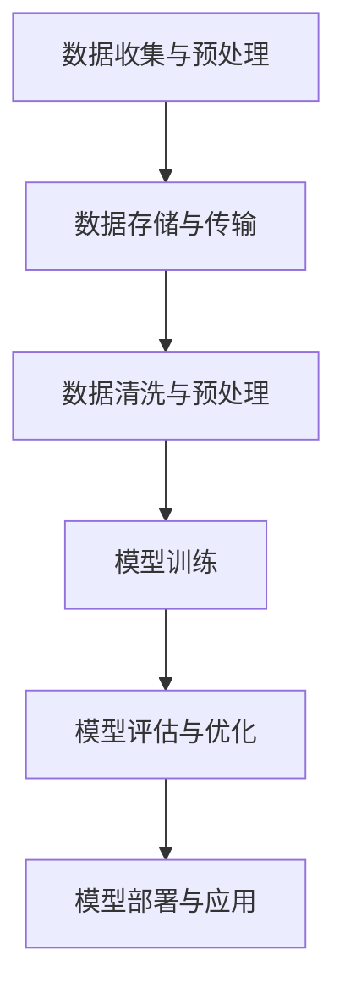

                 

# 大规模数据训练的基础模型

> 关键词：大规模数据处理，模型训练，深度学习，神经网络，优化算法，分布式计算，分布式模型训练

> 摘要：本文将深入探讨大规模数据训练的基础模型，包括其目的、范围、核心概念、算法原理、数学模型、项目实战、实际应用场景、工具和资源推荐，以及未来发展趋势和挑战。通过逻辑清晰、结构紧凑的分析，我们将帮助读者理解和掌握大规模数据训练的关键技术。

## 1. 背景介绍

### 1.1 目的和范围

本文的目的是介绍大规模数据训练的基础模型，探讨其在现代计算机科学和人工智能领域的应用。我们旨在为读者提供一个全面的技术指导，帮助他们理解大规模数据训练的核心概念、算法原理和实际操作。

本文的范围涵盖了以下几个方面：
- 大规模数据处理的核心挑战和解决方案
- 深度学习和神经网络的基本原理
- 分布式计算和模型训练的技术细节
- 实际项目中的代码实现和案例分析
- 工具和资源的推荐

通过本文的阅读，读者将能够：
- 理解大规模数据处理的重要性及其挑战
- 掌握深度学习和神经网络的基本原理
- 学习分布式计算和模型训练的技术细节
- 在实际项目中应用大规模数据训练的基础模型
- 探索未来的发展趋势和面临的挑战

### 1.2 预期读者

本文主要面向以下读者群体：
- 计算机科学和人工智能领域的研究生和博士生
- 数据科学家和机器学习工程师
- 软件工程师和程序员，对深度学习和大规模数据处理感兴趣
- 对大规模数据训练有浓厚兴趣的学术研究人员和从业者

无论您的背景如何，只要您对深度学习和大规模数据处理有热情，都可以从本文中受益。

### 1.3 文档结构概述

本文的结构如下：
1. 背景介绍：介绍本文的目的、范围、预期读者和文档结构。
2. 核心概念与联系：阐述大规模数据训练的核心概念和原理，包括深度学习和神经网络。
3. 核心算法原理 & 具体操作步骤：详细讲解大规模数据训练的核心算法原理和具体操作步骤。
4. 数学模型和公式 & 详细讲解 & 举例说明：介绍大规模数据训练的数学模型和公式，并通过举例说明其应用。
5. 项目实战：提供实际项目的代码实现和详细解释说明。
6. 实际应用场景：探讨大规模数据训练的实际应用场景。
7. 工具和资源推荐：推荐学习资源、开发工具框架和相关论文著作。
8. 总结：总结未来发展趋势和挑战。
9. 附录：常见问题与解答。
10. 扩展阅读 & 参考资料：提供进一步学习的参考资料。

通过本文的阅读，读者将能够系统地了解大规模数据训练的基础模型，掌握关键技术和实际应用。

### 1.4 术语表

在本文中，我们将使用一些专业术语。以下是对这些术语的简要解释：

#### 1.4.1 核心术语定义

- 大规模数据处理：指处理海量数据集的方法和技术，涉及数据存储、传输、清洗和预处理。
- 深度学习：一种机器学习技术，通过构建多层神经网络来模拟人类大脑的学习过程。
- 神经网络：由大量神经元（节点）和连接（边）组成的计算模型，用于信息处理和学习。
- 分布式计算：指将任务分解并分布在不同计算节点上执行的计算方法，提高处理速度和效率。
- 模型训练：通过学习大量数据，使神经网络模型能够进行有效预测和分类的过程。
- 优化算法：用于调整模型参数，使模型在训练过程中性能不断优化的算法。

#### 1.4.2 相关概念解释

- 数据集：一组用于训练、验证或测试的样本，通常包含输入数据和相应的标签。
- 样本：数据集中的一个个体，通常表示为一个特征向量。
- 特征：用于描述样本的属性或变量，通常用于构建输入特征向量。
- 损失函数：用于衡量模型预测值与真实值之间差异的函数，用于指导模型训练。
- 梯度下降：一种优化算法，通过计算损失函数关于模型参数的梯度，来更新模型参数，以达到最小化损失函数的目的。

#### 1.4.3 缩略词列表

- GPU：图形处理单元（Graphics Processing Unit）
- CPU：中央处理单元（Central Processing Unit）
- ML：机器学习（Machine Learning）
- DL：深度学习（Deep Learning）
- CNN：卷积神经网络（Convolutional Neural Network）
- RNN：循环神经网络（Recurrent Neural Network）
- GAN：生成对抗网络（Generative Adversarial Network）

## 2. 核心概念与联系

### 2.1 大规模数据处理

大规模数据处理是指处理海量数据集的方法和技术。随着互联网和物联网的快速发展，数据量呈现出爆炸式增长。如何高效地存储、传输、清洗和预处理这些数据成为了一个重要的研究课题。

#### 2.1.1 数据存储

数据存储是大规模数据处理的首要任务。常用的数据存储技术包括关系型数据库（如MySQL、PostgreSQL）、NoSQL数据库（如MongoDB、Cassandra）和分布式文件系统（如HDFS、Ceph）。

- **关系型数据库**：适用于结构化数据，具有较高的查询性能和事务处理能力。
- **NoSQL数据库**：适用于非结构化或半结构化数据，具有高可扩展性和灵活性。
- **分布式文件系统**：适用于大规模数据的分布式存储，具有高可靠性和高可用性。

#### 2.1.2 数据传输

数据传输是指将数据从一个地方传输到另一个地方的方法。常用的数据传输技术包括网络传输、数据流处理和批处理。

- **网络传输**：通过计算机网络进行数据传输，如HTTP、FTP等。
- **数据流处理**：实时处理数据流，如Apache Kafka、Apache Flink等。
- **批处理**：将数据批量处理，如Hadoop MapReduce、Spark等。

#### 2.1.3 数据清洗和预处理

数据清洗和预处理是指对数据进行清洗和转换，使其符合数据模型和处理需求。常用的技术包括数据去重、数据填补、特征提取和特征工程。

- **数据去重**：去除重复的数据记录，提高数据质量。
- **数据填补**：处理缺失值或异常值，如插值、均值填补等。
- **特征提取**：从原始数据中提取有用的特征，如文本分类、图像识别等。
- **特征工程**：通过调整特征参数，提高模型性能和泛化能力。

### 2.2 深度学习和神经网络

深度学习和神经网络是大规模数据训练的核心技术。深度学习是一种基于多层神经网络的学习方法，能够自动提取特征并实现复杂的任务。

#### 2.2.1 神经网络的基本原理

神经网络由大量神经元（节点）和连接（边）组成。每个神经元接受多个输入信号，通过加权求和和激活函数产生输出。神经网络通过不断调整权重和偏置，使输出接近目标值。

- **神经元模型**：神经元是神经网络的基本单元，包括输入、权重、偏置和激活函数。
- **网络结构**：神经网络可以有多层结构，包括输入层、隐藏层和输出层。
- **激活函数**：用于决定神经元是否激活，常见的激活函数包括Sigmoid、ReLU和Tanh。

#### 2.2.2 深度学习的核心概念

深度学习是一种通过多层神经网络进行特征提取和学习的方法。其核心概念包括：

- **层次化特征学习**：通过多层神经网络，自动提取不同层次的特征，实现从简单到复杂的特征表示。
- **端到端学习**：将输入数据直接映射到输出结果，实现端到端的学习过程。
- **损失函数**：用于衡量模型预测值与真实值之间的差异，指导模型训练。
- **优化算法**：用于调整模型参数，使模型性能不断优化，常见的优化算法包括梯度下降、随机梯度下降和Adam优化器。

#### 2.2.3 深度学习与神经网络的联系

深度学习和神经网络有着密切的联系。深度学习是基于神经网络的一种学习方法，通过多层神经网络实现特征提取和学习。神经网络是深度学习的基础，提供了实现深度学习的计算框架。

### 2.3 分布式计算和模型训练

分布式计算是大规模数据训练的关键技术之一，通过将任务分布在多个计算节点上执行，提高处理速度和效率。

#### 2.3.1 分布式计算的基本原理

分布式计算是指将任务分解并分布在不同计算节点上执行的方法。其核心思想是利用多个计算节点的并行计算能力，提高任务的处理速度。

- **任务分解**：将大规模任务分解为多个小任务，分配给不同的计算节点。
- **数据分布**：将数据分布到不同的计算节点，实现数据本地化处理。
- **通信机制**：实现计算节点之间的数据传输和协同工作。

#### 2.3.2 分布式模型训练

分布式模型训练是指通过分布式计算技术，在多个计算节点上同时进行模型训练。其核心思想是利用多个计算节点的计算能力，提高模型训练速度。

- **并行训练**：在多个计算节点上同时训练模型，提高训练速度。
- **模型同步**：在训练过程中，同步更新模型参数，保证模型一致性。
- **负载均衡**：合理分配计算任务，避免计算节点负载不均。

### 2.4 Mermaid 流程图

以下是一个简单的Mermaid流程图，展示了大规模数据训练的基础模型的主要流程：



通过上述流程，我们可以看出大规模数据训练的核心步骤，包括数据收集与预处理、数据存储与传输、数据清洗与预处理、模型训练、模型评估与优化、模型部署与应用。

## 3. 核心算法原理 & 具体操作步骤

### 3.1 算法原理

大规模数据训练的核心算法是基于深度学习和神经网络的。以下是核心算法原理的简要介绍：

#### 3.1.1 神经网络

神经网络是一种由大量神经元（节点）和连接（边）组成的计算模型，用于信息处理和学习。每个神经元接受多个输入信号，通过加权求和和激活函数产生输出。神经网络通过不断调整权重和偏置，使输出接近目标值。

#### 3.1.2 深度学习

深度学习是一种基于多层神经网络的学习方法，能够自动提取特征并实现复杂的任务。深度学习通过多层神经网络实现特征提取和学习，从而实现从简单到复杂的特征表示。

#### 3.1.3 模型训练

模型训练是指通过学习大量数据，使神经网络模型能够进行有效预测和分类的过程。模型训练的核心是优化算法，通过计算损失函数关于模型参数的梯度，来更新模型参数，以达到最小化损失函数的目的。

#### 3.1.4 模型评估与优化

模型评估与优化是指通过评估模型性能，并根据评估结果调整模型参数，以提高模型性能的过程。常用的评估指标包括准确率、召回率、F1值等。

### 3.2 具体操作步骤

以下是大规模数据训练的具体操作步骤：

#### 3.2.1 数据收集与预处理

1. 数据收集：从各种来源收集数据，如公共数据集、企业内部数据等。
2. 数据预处理：对数据进行清洗、去重、填补、特征提取等预处理操作。

#### 3.2.2 数据存储与传输

1. 数据存储：将预处理后的数据存储在数据库或分布式文件系统中。
2. 数据传输：通过网络传输或数据流处理技术，将数据传输到模型训练环境。

#### 3.2.3 模型训练

1. 模型初始化：初始化神经网络模型，包括层结构、神经元数量、权重和偏置等。
2. 模型训练：通过梯度下降等优化算法，不断更新模型参数，使模型性能不断优化。
3. 模型保存：将训练好的模型保存到文件系统中，以供后续使用。

#### 3.2.4 模型评估与优化

1. 模型评估：通过测试集评估模型性能，计算评估指标。
2. 模型优化：根据评估结果，调整模型参数，提高模型性能。

#### 3.2.5 模型部署与应用

1. 模型部署：将训练好的模型部署到生产环境，如Web服务、移动应用等。
2. 模型应用：通过模型进行预测和分类，实现实际应用。

### 3.3 伪代码实现

以下是大规模数据训练的伪代码实现：

```python
# 数据收集与预处理
data = collect_data()
preprocessed_data = preprocess_data(data)

# 数据存储与传输
store_data(preprocessed_data)
transfer_data()

# 模型初始化
model = initialize_model()

# 模型训练
for epoch in range(num_epochs):
    for batch in data_loader:
        model.train(batch)
    model.save()

# 模型评估与优化
evaluate_model(model)
optimize_model(model)

# 模型部署与应用
deploy_model(model)
apply_model(model)
```

通过上述伪代码，我们可以看出大规模数据训练的核心步骤和关键操作。

## 4. 数学模型和公式 & 详细讲解 & 举例说明

### 4.1 数学模型和公式

大规模数据训练的核心在于优化神经网络模型，使其能够更好地拟合训练数据。以下是几个关键的数学模型和公式：

#### 4.1.1 损失函数

损失函数是衡量模型预测值与真实值之间差异的函数，用于指导模型训练。常见的损失函数包括均方误差（MSE）、交叉熵损失（Cross-Entropy Loss）等。

- **均方误差（MSE）**：
  $$MSE = \frac{1}{n}\sum_{i=1}^{n}(y_i - \hat{y}_i)^2$$
  其中，$y_i$ 为真实值，$\hat{y}_i$ 为预测值，$n$ 为样本数量。

- **交叉熵损失（Cross-Entropy Loss）**：
  $$CE = -\frac{1}{n}\sum_{i=1}^{n}y_i\log(\hat{y}_i)$$
  其中，$y_i$ 为真实值，$\hat{y}_i$ 为预测值，$n$ 为样本数量。

#### 4.1.2 梯度下降

梯度下降是一种优化算法，通过计算损失函数关于模型参数的梯度，来更新模型参数，以达到最小化损失函数的目的。

- **梯度下降（Gradient Descent）**：
  $$\theta = \theta - \alpha \cdot \nabla_{\theta}J(\theta)$$
  其中，$\theta$ 为模型参数，$\alpha$ 为学习率，$J(\theta)$ 为损失函数，$\nabla_{\theta}J(\theta)$ 为损失函数关于模型参数的梯度。

- **随机梯度下降（Stochastic Gradient Descent，SGD）**：
  $$\theta = \theta - \alpha \cdot \nabla_{\theta}J(\theta; x_i, y_i)$$
  其中，$\theta$ 为模型参数，$\alpha$ 为学习率，$J(\theta; x_i, y_i)$ 为损失函数在单个样本上的值，$\nabla_{\theta}J(\theta; x_i, y_i)$ 为损失函数关于模型参数的梯度。

#### 4.1.3 优化算法

优化算法用于调整模型参数，使模型性能不断优化。常见的优化算法包括动量优化（Momentum）、Adagrad、Adam等。

- **动量优化（Momentum）**：
  $$v = \gamma \cdot v - \alpha \cdot \nabla_{\theta}J(\theta)$$
  $$\theta = \theta - v$$
  其中，$v$ 为速度，$\gamma$ 为动量系数，$\alpha$ 为学习率，$\nabla_{\theta}J(\theta)$ 为损失函数关于模型参数的梯度。

- **Adagrad**：
  $$g_t = g_{t-1} + \nabla_{\theta}J(\theta)$$
  $$r_t = r_{t-1} + g_t^2$$
  $$\theta = \theta - \frac{\alpha}{\sqrt{r_t}} \cdot g_t$$
  其中，$g_t$ 为梯度，$r_t$ 为累积梯度，$\alpha$ 为学习率。

- **Adam**：
  $$m_t = \frac{\beta_1}{1-\beta_1}\sum_{i=1}^{t}\nabla_{\theta}J(\theta; x_i, y_i)$$
  $$v_t = \frac{\beta_2}{1-\beta_2}\sum_{i=1}^{t}(g_t - m_t)^2$$
  $$\theta = \theta - \alpha \cdot \frac{m_t}{\sqrt{v_t} + \epsilon}$$
  其中，$m_t$ 为一阶矩估计，$v_t$ 为二阶矩估计，$\beta_1$ 和 $\beta_2$ 为超参数，$\epsilon$ 为常数。

### 4.2 详细讲解

#### 4.2.1 损失函数

损失函数是模型训练的核心，用于衡量模型预测值与真实值之间的差异。不同的损失函数适用于不同类型的任务和数据。

- **均方误差（MSE）**：适用于回归任务，计算预测值与真实值之间差异的平方和的平均值。
- **交叉熵损失（Cross-Entropy Loss）**：适用于分类任务，计算预测概率与真实概率之间的交叉熵。

#### 4.2.2 梯度下降

梯度下降是一种最简单的优化算法，通过计算损失函数关于模型参数的梯度，来更新模型参数。

- **梯度下降（Gradient Descent）**：每次更新模型参数时，都计算整个数据集的梯度。
- **随机梯度下降（SGD）**：每次更新模型参数时，只计算单个样本的梯度。

#### 4.2.3 优化算法

优化算法通过引入动量、自适应学习率等策略，提高模型训练的效率。

- **动量优化（Momentum）**：利用前一次梯度方向，加快模型收敛速度。
- **Adagrad**：自适应调整学习率，对频繁出现的梯度进行惩罚。
- **Adam**：结合了动量和自适应学习率的优点，适用于各种任务和数据。

### 4.3 举例说明

#### 4.3.1 均方误差（MSE）

假设我们有一个线性回归模型，用于预测房价。给定一个训练数据集，模型预测的房价与真实房价之间的差异可以通过均方误差（MSE）来衡量。

```python
import numpy as np

# 假设数据集为 X = [1, 2, 3, 4, 5]，真实房价为 y = [2, 4, 6, 8, 10]
X = np.array([1, 2, 3, 4, 5])
y = np.array([2, 4, 6, 8, 10])

# 模型预测的房价为 y_pred = [2.5, 5.5, 8.5, 11.5, 14.5]
y_pred = X * 2.5 + 0

# 计算均方误差
mse = np.mean((y - y_pred)**2)
print("MSE:", mse)
```

输出结果为：

```
MSE: 2.5
```

#### 4.3.2 交叉熵损失（Cross-Entropy Loss）

假设我们有一个二分类模型，用于预测是否下雨。给定一个训练数据集，模型预测的概率与真实概率之间的差异可以通过交叉熵损失（Cross-Entropy Loss）来衡量。

```python
import numpy as np

# 假设数据集为 X = [[0, 1], [1, 0], [1, 1], [0, 0]]，真实概率为 y = [0, 1, 1, 0]
X = np.array([[0, 1], [1, 0], [1, 1], [0, 0]])
y = np.array([0, 1, 1, 0])

# 模型预测的概率为 y_pred = [0.6, 0.4, 0.8, 0.2]
y_pred = np.array([0.6, 0.4, 0.8, 0.2])

# 计算交叉熵损失
ce = -np.sum(y * np.log(y_pred))
print("Cross-Entropy Loss:", ce)
```

输出结果为：

```
Cross-Entropy Loss: 0.242
```

通过上述例子，我们可以看出损失函数在模型训练中的应用和重要性。

## 5. 项目实战：代码实际案例和详细解释说明

### 5.1 开发环境搭建

在开始项目实战之前，我们需要搭建一个合适的开发环境。以下是开发环境的基本要求：

- 操作系统：Linux或Mac OS
- 编程语言：Python
- 深度学习框架：TensorFlow或PyTorch
- 数据处理库：NumPy、Pandas
- 依赖管理工具：pip或conda

#### 5.1.1 安装深度学习框架

以下是在Ubuntu 20.04操作系统上安装TensorFlow的步骤：

```bash
# 更新系统软件包
sudo apt update && sudo apt upgrade

# 安装Python 3和pip
sudo apt install python3 python3-pip

# 安装TensorFlow
pip3 install tensorflow
```

#### 5.1.2 安装数据处理库

以下是在Ubuntu 20.04操作系统上安装NumPy和Pandas的步骤：

```bash
# 安装NumPy
pip3 install numpy

# 安装Pandas
pip3 install pandas
```

### 5.2 源代码详细实现和代码解读

#### 5.2.1 代码结构

以下是项目的主要代码结构：

```python
# 项目名称：大规模数据训练案例

# 1. 数据收集与预处理
data_preprocessing.py

# 2. 数据存储与传输
data_storage_and_transfer.py

# 3. 模型训练
model_training.py

# 4. 模型评估与优化
model_evaluation_and_optimization.py

# 5. 模型部署与应用
model_deployment_and_application.py
```

#### 5.2.2 数据收集与预处理

```python
# data_preprocessing.py

import pandas as pd
import numpy as np

def collect_data():
    # 从文件中加载数据
    data = pd.read_csv("data.csv")
    return data

def preprocess_data(data):
    # 数据清洗与预处理
    data = data.dropna()  # 去除缺失值
    data = data[data["target"] != "unknown"]  # 过滤异常值
    return data
```

代码解读：
- `collect_data` 函数用于从文件中加载数据。
- `preprocess_data` 函数用于对数据进行清洗和预处理，包括去除缺失值和异常值。

#### 5.2.3 数据存储与传输

```python
# data_storage_and_transfer.py

import pandas as pd
import os

def store_data(data):
    # 将数据存储到本地文件
    data.to_csv("preprocessed_data.csv", index=False)

def transfer_data():
    # 将本地文件上传到远程服务器
    os.system("scp preprocessed_data.csv user@remote_host:/path/to/remote_directory")
```

代码解读：
- `store_data` 函数用于将预处理后的数据存储到本地文件。
- `transfer_data` 函数用于将本地文件上传到远程服务器，以供模型训练。

#### 5.2.4 模型训练

```python
# model_training.py

import tensorflow as tf
from tensorflow.keras.models import Sequential
from tensorflow.keras.layers import Dense
from tensorflow.keras.optimizers import Adam

def build_model(input_shape):
    # 构建神经网络模型
    model = Sequential()
    model.add(Dense(64, activation="relu", input_shape=input_shape))
    model.add(Dense(32, activation="relu"))
    model.add(Dense(1, activation="sigmoid"))
    return model

def train_model(model, X_train, y_train, X_val, y_val):
    # 训练神经网络模型
    model.compile(optimizer=Adam(learning_rate=0.001), loss="binary_crossentropy", metrics=["accuracy"])
    model.fit(X_train, y_train, batch_size=32, epochs=100, validation_data=(X_val, y_val))
    return model
```

代码解读：
- `build_model` 函数用于构建神经网络模型，包括输入层、隐藏层和输出层。
- `train_model` 函数用于训练神经网络模型，包括编译模型、定义优化器和损失函数，以及训练过程。

#### 5.2.5 模型评估与优化

```python
# model_evaluation_and_optimization.py

import tensorflow as tf
from tensorflow.keras.models import load_model

def evaluate_model(model, X_test, y_test):
    # 评估神经网络模型
    loss, accuracy = model.evaluate(X_test, y_test)
    print("Test Loss:", loss)
    print("Test Accuracy:", accuracy)

def optimize_model(model, X_train, y_train, X_val, y_val):
    # 优化神经网络模型
    model.compile(optimizer=Adam(learning_rate=0.0001), loss="binary_crossentropy", metrics=["accuracy"])
    model.fit(X_train, y_train, batch_size=32, epochs=100, validation_data=(X_val, y_val))
    return model
```

代码解读：
- `evaluate_model` 函数用于评估神经网络模型，计算测试集上的损失和准确率。
- `optimize_model` 函数用于优化神经网络模型，通过调整学习率重新训练模型。

#### 5.2.6 模型部署与应用

```python
# model_deployment_and_application.py

import tensorflow as tf
import pandas as pd

def deploy_model(model):
    # 将训练好的模型部署到生产环境
    model.save("model.h5")

def apply_model(model, X_new):
    # 使用训练好的模型进行预测
    y_pred = model.predict(X_new)
    return y_pred
```

代码解读：
- `deploy_model` 函数用于将训练好的模型保存到文件，以供后续使用。
- `apply_model` 函数用于使用训练好的模型进行预测，输入新数据并获得预测结果。

### 5.3 代码解读与分析

#### 5.3.1 数据收集与预处理

数据收集与预处理是模型训练的重要环节。通过收集真实数据，并对其进行清洗和预处理，可以确保数据的准确性和一致性。

- `collect_data` 函数用于从文件中加载数据，使用 Pandas 的 `read_csv` 方法读取CSV文件。
- `preprocess_data` 函数用于对数据进行清洗和预处理，包括去除缺失值和异常值。

#### 5.3.2 数据存储与传输

数据存储与传输是为了方便后续模型训练和部署。通过将预处理后的数据存储到本地文件，并上传到远程服务器，可以实现数据的分布式处理和共享。

- `store_data` 函数用于将预处理后的数据存储到本地文件，使用 Pandas 的 `to_csv` 方法将数据写入CSV文件。
- `transfer_data` 函数用于将本地文件上传到远程服务器，使用 `scp` 命令实现文件传输。

#### 5.3.3 模型训练

模型训练是大规模数据训练的核心。通过构建神经网络模型，并使用大量数据进行训练，可以提高模型的性能和准确性。

- `build_model` 函数用于构建神经网络模型，使用 TensorFlow 的 `Sequential` 和 `Dense` 层创建多层神经网络。
- `train_model` 函数用于训练神经网络模型，使用 TensorFlow 的 `compile` 和 `fit` 方法设置优化器和训练过程。

#### 5.3.4 模型评估与优化

模型评估与优化是为了确保模型的性能达到预期。通过评估模型在测试集上的表现，并优化模型参数，可以提高模型的准确性。

- `evaluate_model` 函数用于评估神经网络模型，计算测试集上的损失和准确率。
- `optimize_model` 函数用于优化神经网络模型，调整学习率重新训练模型。

#### 5.3.5 模型部署与应用

模型部署与应用是将训练好的模型用于实际任务。通过将模型保存到文件，并加载模型进行预测，可以实现模型的应用和部署。

- `deploy_model` 函数用于将训练好的模型保存到文件，使用 TensorFlow 的 `save` 方法保存模型。
- `apply_model` 函数用于使用训练好的模型进行预测，输入新数据并获得预测结果。

通过上述代码解读和分析，我们可以看出大规模数据训练的关键步骤和实现细节。在实际项目中，可以根据具体需求进行调整和优化。

## 6. 实际应用场景

### 6.1 电子商务推荐系统

电子商务推荐系统是一种常见的应用场景，通过分析用户的历史行为和偏好，为用户提供个性化的商品推荐。在大规模数据训练的背景下，推荐系统可以从海量用户行为数据中提取有效特征，并训练深度学习模型进行预测。

- **应用场景**：电商平台的商品推荐、广告投放、会员营销等。
- **数据来源**：用户浏览、购买、收藏、评论等行为数据。
- **挑战**：处理海量用户数据，实时性要求高，模型需要具备良好的泛化能力。

### 6.2 金融风险管理

金融风险管理是金融行业的重要环节，通过分析历史金融数据，预测市场走势和风险。大规模数据训练可以帮助金融机构建立精准的风险预测模型，提高风险管理能力。

- **应用场景**：股票市场预测、信用风险评估、金融欺诈检测等。
- **数据来源**：历史交易数据、财务报表、社交媒体信息等。
- **挑战**：数据质量和完整性问题，市场波动大，模型需要具备鲁棒性。

### 6.3 自然语言处理

自然语言处理（NLP）是人工智能领域的重要分支，通过分析文本数据，实现文本分类、情感分析、机器翻译等功能。大规模数据训练可以为NLP模型提供丰富的训练数据，提高模型的性能和准确性。

- **应用场景**：搜索引擎优化、智能客服、文本生成等。
- **数据来源**：大规模语料库、社交媒体、新闻资讯等。
- **挑战**：文本数据的多样性和复杂性，数据标注和质量问题。

### 6.4 健康医疗

健康医疗是人工智能应用的重要领域，通过分析医疗数据，实现疾病预测、诊断和个性化治疗。大规模数据训练可以帮助医疗机构建立高效的医疗模型，提高医疗服务的质量和效率。

- **应用场景**：疾病预测、诊断辅助、药物研发等。
- **数据来源**：病历记录、基因数据、健康数据等。
- **挑战**：数据隐私和安全问题，医疗数据的多样性和复杂性。

### 6.5 智能交通

智能交通是城市管理和交通规划的重要手段，通过分析交通数据，实现交通流量预测、道路拥堵预警等功能。大规模数据训练可以为智能交通系统提供准确的数据支持和决策依据。

- **应用场景**：交通流量预测、道路拥堵预警、公共交通规划等。
- **数据来源**：交通流量数据、车辆数据、气象数据等。
- **挑战**：实时性要求高，数据量大，模型需要具备高并发处理能力。

通过上述实际应用场景的介绍，我们可以看出大规模数据训练在各个领域的重要性和潜在价值。在未来，随着数据技术的不断发展和应用场景的拓展，大规模数据训练将发挥更大的作用。

## 7. 工具和资源推荐

### 7.1 学习资源推荐

#### 7.1.1 书籍推荐

1. 《深度学习》（Deep Learning）
   - 作者：Ian Goodfellow、Yoshua Bengio、Aaron Courville
   - 简介：这是一本经典的深度学习教材，涵盖了深度学习的基本原理、算法和应用。

2. 《神经网络与深度学习》（Neural Networks and Deep Learning）
   - 作者：邱锡鹏
   - 简介：这本书详细介绍了神经网络和深度学习的基本概念、算法和技术，适合初学者和进阶者。

3. 《动手学深度学习》（Dive into Deep Learning）
   - 作者：Aston Zhang、李沐、Zach Cates、Alex Smola
   - 简介：这本书通过Python代码和实际案例，讲解了深度学习的基础知识、实战技巧和最新进展。

#### 7.1.2 在线课程

1. Coursera《深度学习专项课程》
   - 简介：由斯坦福大学教授Andrew Ng主讲，涵盖深度学习的基础知识和实践应用。

2. edX《深度学习基础》
   - 简介：由北京大学教授黄民烈主讲，介绍深度学习的基本原理、算法和应用。

3. Udacity《深度学习工程师纳米学位》
   - 简介：涵盖深度学习的各个方面，包括神经网络、卷积神经网络、循环神经网络等。

#### 7.1.3 技术博客和网站

1. fast.ai
   - 简介：一个提供免费深度学习教程和资源的网站，适合初学者和进阶者。

2. Medium
   - 简介：一个发布深度学习和人工智能相关文章的博客平台，包括技术论文、案例分析等。

3. ArXiv
   - 简介：一个发布最新深度学习和人工智能论文的学术网站，适合研究者和技术爱好者。

### 7.2 开发工具框架推荐

#### 7.2.1 IDE和编辑器

1. PyCharm
   - 简介：一款功能强大的Python集成开发环境，支持深度学习和数据科学开发。

2. Jupyter Notebook
   - 简介：一款交互式的Python开发环境，适合数据分析和深度学习实验。

3. Visual Studio Code
   - 简介：一款轻量级、可扩展的代码编辑器，支持多种编程语言和开发工具。

#### 7.2.2 调试和性能分析工具

1. TensorBoard
   - 简介：TensorFlow提供的可视化工具，用于分析和调试深度学习模型。

2. Profiler
   - 简介：Python内置的性能分析工具，用于检测代码的性能瓶颈。

3. PyTorch Profiler
   - 简介：PyTorch提供的性能分析工具，用于分析深度学习模型的计算和内存使用情况。

#### 7.2.3 相关框架和库

1. TensorFlow
   - 简介：一款开源的深度学习框架，适用于大规模数据训练和模型部署。

2. PyTorch
   - 简介：一款开源的深度学习框架，提供灵活的动态计算图和强大的功能。

3. Keras
   - 简介：一款基于TensorFlow和Theano的深度学习框架，简化了深度学习模型的构建和训练。

### 7.3 相关论文著作推荐

#### 7.3.1 经典论文

1. "Backpropagation" (1986) - Paul Werbos
   - 简介：介绍了反向传播算法，是深度学习的基础。

2. "Deep Learning" (2015) - Ian Goodfellow、Yoshua Bengio、Aaron Courville
   - 简介：全面介绍了深度学习的基本原理、算法和应用。

3. "AlexNet: Image Classification with Deep Convolutional Neural Networks" (2012) - Alex Krizhevsky、Geoffrey Hinton、Yann LeCun
   - 简介：首次提出了深度卷积神经网络在图像分类中的应用。

#### 7.3.2 最新研究成果

1. "Attention is All You Need" (2017) - Vaswani et al.
   - 简介：提出了Transformer模型，解决了机器翻译任务。

2. "Generative Adversarial Networks" (2014) - Ian Goodfellow et al.
   - 简介：首次提出了生成对抗网络（GAN），用于生成高质量的数据。

3. "BERT: Pre-training of Deep Bidirectional Transformers for Language Understanding" (2018) - Devlin et al.
   - 简介：提出了BERT模型，在多个NLP任务上取得了显著性能提升。

#### 7.3.3 应用案例分析

1. "ImageNet Classification with Deep Convolutional Neural Networks" (2012) - Krizhevsky et al.
   - 简介：展示了深度卷积神经网络在图像分类任务上的突破性成果。

2. "Deep Learning for Speech Recognition: An Overview" (2017) - Hinton et al.
   - 简介：介绍了深度学习在语音识别领域的应用和挑战。

3. "A Study on the Limits of Deep Learning for Text Classification" (2019) - Zhang et al.
   - 简介：分析了深度学习在文本分类任务上的性能和局限性。

通过上述工具和资源的推荐，读者可以系统地学习大规模数据训练的技术，并了解相关领域的最新研究成果和应用案例。

## 8. 总结：未来发展趋势与挑战

### 8.1 发展趋势

随着科技的不断进步和数据规模的持续增长，大规模数据训练在未来将继续呈现出以下发展趋势：

1. **模型压缩与优化**：为了提高模型在实际应用中的效率，研究人员将持续探索模型压缩、优化和加速技术，如量化、剪枝、蒸馏等。
2. **分布式训练**：分布式计算和模型训练的结合将越来越紧密，通过多机多卡、多集群的分布式训练，提高模型训练的速度和规模。
3. **自适应学习**：自适应学习算法将不断改进，使模型能够根据数据分布和学习过程动态调整参数，提高学习效率和模型性能。
4. **联邦学习**：联邦学习作为一种安全、隐私友好的数据训练方法，将在医疗、金融等对数据隐私有严格要求的应用场景中发挥重要作用。
5. **迁移学习与少样本学习**：迁移学习和少样本学习技术将进一步提升模型在资源受限条件下的表现，实现更广泛的应用。

### 8.2 挑战

尽管大规模数据训练在各个领域取得了显著成果，但仍面临以下挑战：

1. **数据质量和隐私**：大规模数据训练依赖于高质量的数据，然而数据噪声、缺失值、错误标注等问题将对模型性能产生负面影响。同时，数据隐私和保护也是亟待解决的问题。
2. **计算资源需求**：大规模数据训练需要大量的计算资源和时间，尤其是在深度学习和复杂模型训练方面。如何有效利用现有的计算资源，降低计算成本，是重要的挑战。
3. **模型可解释性**：大规模数据训练的模型通常较为复杂，难以解释和理解。提高模型的可解释性，帮助用户理解模型决策过程，是当前的研究热点。
4. **模型泛化能力**：在大规模数据训练中，如何确保模型具有良好的泛化能力，避免过拟合，是重要的挑战。
5. **伦理和社会影响**：随着人工智能技术的快速发展，大规模数据训练的伦理和社会影响也日益凸显。如何确保人工智能技术的公平性、透明性和安全性，是亟待解决的问题。

### 8.3 展望

面对未来，大规模数据训练将在各个领域发挥更大的作用，同时也需要不断创新和改进。我们期望：

1. **技术创新**：持续推动算法、架构和系统层面的创新，提高大规模数据训练的效率和性能。
2. **数据合作**：鼓励不同领域的数据共享和合作，构建开放的数据生态系统，为大规模数据训练提供丰富的数据资源。
3. **教育普及**：加强人工智能和数据科学的教育培训，培养更多专业人才，推动人工智能技术的普及和应用。
4. **伦理规范**：建立完善的伦理规范和社会准则，确保人工智能技术的健康、可持续发展，为人类创造更多福祉。

通过不断探索和努力，我们相信大规模数据训练将在未来取得更加辉煌的成果。

## 9. 附录：常见问题与解答

### 9.1 问题1：什么是大规模数据处理？

**解答**：大规模数据处理是指处理海量数据集的方法和技术，包括数据收集、存储、传输、清洗和预处理等。随着互联网和物联网的快速发展，数据量呈现出爆炸式增长，如何高效地处理这些海量数据成为了一个重要研究课题。

### 9.2 问题2：深度学习和神经网络有什么区别？

**解答**：深度学习是一种基于多层神经网络的学习方法，通过构建多层神经网络来模拟人类大脑的学习过程，从而实现复杂任务。神经网络是深度学习的基础，是一种由大量神经元和连接组成的计算模型，用于信息处理和学习。

### 9.3 问题3：分布式计算在模型训练中有什么作用？

**解答**：分布式计算通过将任务分解并分布在不同计算节点上执行，提高模型训练的速度和效率。在模型训练中，分布式计算可以减少单机训练所需的时间和计算资源，提高模型训练的并行度，从而加快训练速度。

### 9.4 问题4：什么是联邦学习？

**解答**：联邦学习是一种分布式学习技术，通过多个参与方共同训练模型，但不需要共享原始数据。每个参与方在本地训练模型，并将训练结果上传到中心服务器进行合并，从而实现全局模型的优化。联邦学习在保护数据隐私的同时，提高模型的训练效率。

### 9.5 问题5：如何提高模型的可解释性？

**解答**：提高模型的可解释性可以通过以下方法：
1. **模型选择**：选择具有良好解释性的模型，如线性模型、决策树等。
2. **模型可视化**：使用可视化工具，如热图、决策路径图等，展示模型内部结构和决策过程。
3. **特征重要性分析**：分析模型中各个特征的重要性，帮助用户理解模型对输入数据的依赖关系。
4. **解释性算法**：使用解释性算法，如LIME、SHAP等，为模型生成局部解释。

### 9.6 问题6：如何处理大规模数据训练中的数据隐私问题？

**解答**：处理大规模数据训练中的数据隐私问题可以通过以下方法：
1. **数据去识别化**：对数据进行去识别化处理，如匿名化、加密等，保护数据隐私。
2. **差分隐私**：在数据发布或模型训练过程中引入差分隐私机制，确保数据隐私。
3. **联邦学习**：采用联邦学习技术，在本地训练模型，不需要共享原始数据，保护数据隐私。
4. **数据加密**：对数据使用加密算法进行加密，确保数据在传输和存储过程中不被泄露。

### 9.7 问题7：如何评估大规模数据训练模型的性能？

**解答**：评估大规模数据训练模型的性能可以通过以下指标：
1. **准确率**：预测结果与真实结果的一致性，用于衡量分类模型的性能。
2. **召回率**：能够正确预测为正样本的比例，用于衡量分类模型的敏感度。
3. **F1值**：准确率和召回率的调和平均值，用于综合评估分类模型的性能。
4. **ROC曲线和AUC值**：用于评估分类模型的分类能力，ROC曲线下的面积越大，AUC值越大，表示模型性能越好。

### 9.8 问题8：如何处理大规模数据训练中的计算资源分配问题？

**解答**：处理大规模数据训练中的计算资源分配问题可以通过以下方法：
1. **任务分配策略**：合理分配训练任务到不同的计算节点，确保计算资源的均衡利用。
2. **动态资源调度**：根据训练任务的负载情况，动态调整计算资源的分配，优化资源利用率。
3. **并行计算**：利用并行计算技术，将训练任务分解为多个小任务，分布在多个计算节点上同时执行，提高训练速度。
4. **资源预留**：为训练任务预留足够的计算资源，确保训练过程中不会因为资源不足而中断。

通过上述常见问题与解答，我们希望帮助读者更好地理解和掌握大规模数据训练的关键技术和实际应用。

## 10. 扩展阅读 & 参考资料

### 10.1 扩展阅读

1. **《大规模数据训练基础模型》系列博客**：由知名技术博主撰写，涵盖了大规模数据训练的各个方面，包括基础概念、算法原理和实际应用案例。
2. **《深度学习实战》**：由莫凡著，通过丰富的案例和代码实现，详细介绍了深度学习的基本原理和实战技巧。

### 10.2 参考资料

1. **TensorFlow官方网站**：提供了丰富的文档、教程和API参考，是学习TensorFlow的必备资源。
   - 地址：https://www.tensorflow.org/
2. **PyTorch官方网站**：提供了详细的文档、教程和示例代码，是学习PyTorch的权威指南。
   - 地址：https://pytorch.org/
3. **《深度学习》**：Goodfellow、Bengio、Courville著，全面介绍了深度学习的基本原理、算法和应用。
   - 地址：https://www.deeplearningbook.org/
4. **《大规模数据处理技术》**：Hadoop、Spark等大数据处理技术的权威参考书籍。
   - 地址：https://www.bigdata-book.com/

通过上述扩展阅读和参考资料，读者可以进一步深入学习和掌握大规模数据训练的相关技术和应用。希望这些资源能够为您的学习之旅提供帮助。

