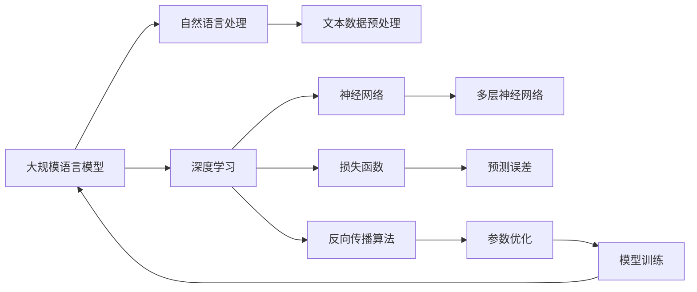

                 


# 大规模语言模型从理论到实践：FastServe框架详解

> **关键词**：大规模语言模型，FastServe框架，深度学习，自然语言处理，算法原理，实践应用。

> **摘要**：本文将详细介绍大规模语言模型及其在实际应用中的重要性。我们首先将回顾大规模语言模型的基本理论，然后重点分析FastServe框架，一个用于加速大规模语言模型训练与推理的关键工具。通过逐步分析框架的架构、核心算法原理、数学模型以及具体操作步骤，我们将深入了解如何在实际项目中应用FastServe框架。此外，文章还将探讨大规模语言模型在不同领域的实际应用场景，推荐相关学习资源与开发工具，并对未来发展趋势与挑战进行展望。

## 1. 背景介绍

### 1.1 目的和范围

本文旨在为读者提供对大规模语言模型及其在实际应用中的关键工具——FastServe框架的全面了解。通过系统的理论讲解和实践分析，我们希望读者能够：

- 掌握大规模语言模型的基本原理。
- 理解FastServe框架的架构与工作原理。
- 学会使用FastServe框架进行大规模语言模型的训练与推理。
- 探索大规模语言模型在不同领域的应用场景。

### 1.2 预期读者

本文适合以下读者群体：

- 对自然语言处理和深度学习有基础知识的读者。
- 想要深入了解大规模语言模型及其应用的工程师和研究人员。
- 希望提升项目开发效率的技术主管和CTO。

### 1.3 文档结构概述

本文结构如下：

1. **背景介绍**：介绍大规模语言模型及FastServe框架的基本概念和重要性。
2. **核心概念与联系**：通过Mermaid流程图展示大规模语言模型的基本概念和架构。
3. **核心算法原理 & 具体操作步骤**：详细讲解大规模语言模型的算法原理和操作步骤。
4. **数学模型和公式**：介绍大规模语言模型的数学模型和公式，并进行举例说明。
5. **项目实战：代码实际案例和详细解释说明**：通过具体代码案例展示FastServe框架的应用。
6. **实际应用场景**：探讨大规模语言模型在不同领域的应用。
7. **工具和资源推荐**：推荐学习资源和开发工具。
8. **总结：未来发展趋势与挑战**：对大规模语言模型和FastServe框架的未来进行展望。
9. **附录：常见问题与解答**：回答读者可能遇到的问题。
10. **扩展阅读 & 参考资料**：提供进一步的阅读资源。

### 1.4 术语表

#### 1.4.1 核心术语定义

- **大规模语言模型**：一种基于深度学习的自然语言处理模型，可以理解并生成自然语言。
- **FastServe框架**：一种用于加速大规模语言模型训练与推理的框架。
- **深度学习**：一种机器学习范式，通过多层神经网络进行数据建模。
- **自然语言处理（NLP）**：研究如何让计算机理解、生成和处理自然语言。

#### 1.4.2 相关概念解释

- **训练数据集**：用于训练模型的输入数据，通常是大规模的文本数据。
- **损失函数**：用于衡量模型预测结果与真实结果之间的差距。
- **反向传播**：一种用于优化神经网络参数的算法。

#### 1.4.3 缩略词列表

- **NLP**：自然语言处理
- **DNN**：深度神经网络
- **GPU**：图形处理单元

## 2. 核心概念与联系

在深入探讨大规模语言模型及其应用之前，我们需要明确几个核心概念，并展示其相互关系。以下是一个Mermaid流程图，描述了大规模语言模型的基本概念和架构。



### 2.1 大规模语言模型的基本概念

- **大规模语言模型**：它是一种基于深度学习的自然语言处理模型，通过对大规模文本数据进行训练，能够理解并生成自然语言。
- **自然语言处理（NLP）**：是计算机科学和人工智能的一个分支，涉及让计算机理解、生成和处理人类自然语言。
- **深度学习**：是一种机器学习范式，通过多层神经网络进行数据建模。
- **神经网络**：是一种模拟人脑的计算模型，能够通过学习输入与输出之间的关系来执行复杂的任务。
- **损失函数**：用于衡量模型预测结果与真实结果之间的差距，是优化模型参数的关键。
- **反向传播算法**：是一种用于优化神经网络参数的算法，通过计算梯度来更新参数，以减少损失函数的值。

### 2.2 大规模语言模型的架构

大规模语言模型通常由以下几个核心组件构成：

- **文本数据预处理**：包括分词、去停用词、词向量化等步骤，将文本数据转换为模型可处理的格式。
- **多层神经网络**：通常由多个隐藏层组成，每个隐藏层由大量的神经元组成，用于提取特征并传递信息。
- **损失函数**：用于衡量模型预测结果与真实结果之间的差距，常用的有交叉熵损失函数。
- **反向传播算法**：通过计算梯度来更新神经网络参数，以优化模型。

## 3. 核心算法原理 & 具体操作步骤

### 3.1 大规模语言模型的训练过程

大规模语言模型的训练过程可以概括为以下几个步骤：

1. **数据预处理**：
   - **分词**：将文本数据分解为单词或子词。
   - **去停用词**：去除常见的无意义词汇，如“的”、“了”等。
   - **词向量化**：将每个单词或子词映射为一个固定长度的向量，常用的词向量化方法有Word2Vec和BERT。

2. **构建神经网络**：
   - **输入层**：接收词向量作为输入。
   - **隐藏层**：通过多层神经网络进行特征提取和传递。
   - **输出层**：输出模型的预测结果，可以是分类标签或文本序列。

3. **选择损失函数**：
   - **交叉熵损失函数**：用于衡量模型预测结果与真实结果之间的差距，是大规模语言模型训练中常用的损失函数。

4. **训练过程**：
   - **前向传播**：计算输入层到输出层的预测结果。
   - **计算损失**：使用交叉熵损失函数计算预测结果与真实结果之间的差距。
   - **反向传播**：通过计算梯度来更新神经网络参数，以优化模型。
   - **迭代**：重复前向传播和反向传播，直到满足停止条件，如损失函数值达到预设阈值或训练轮数达到上限。

### 3.2 大规模语言模型的推理过程

大规模语言模型的推理过程通常如下：

1. **文本数据预处理**：
   - 与训练过程类似，对输入文本数据进行分词、去停用词和词向量化处理。

2. **输入层到输出层的前向传播**：
   - 将预处理后的文本数据输入到神经网络中，计算从输入层到输出层的预测结果。

3. **生成输出结果**：
   - 根据预测结果，生成相应的输出，如分类标签或文本序列。

以下是大规模语言模型训练过程的伪代码：

```python
# 假设我们已经构建了一个基于多层神经网络的模型

# 数据预处理
def preprocess_data(texts):
    # 分词、去停用词、词向量化等操作
    return processed_texts

# 训练模型
def train_model(model, train_data, num_epochs):
    for epoch in range(num_epochs):
        for texts in train_data:
            processed_texts = preprocess_data(texts)
            # 前向传播
            predictions = model.forward(processed_texts)
            # 计算损失
            loss = model.loss_function(predictions, labels)
            # 反向传播
            model.backward(loss)
            # 更新模型参数
            model.update_params()
        print(f"Epoch {epoch}: Loss = {loss}")
    return model
```

## 4. 数学模型和公式 & 详细讲解 & 举例说明

### 4.1 数学模型

大规模语言模型通常基于深度神经网络（DNN）构建，其数学模型可以表示为：

$$
Y = \text{softmax}(W \cdot X + b)
$$

其中，\( Y \) 是模型的输出概率分布，\( X \) 是输入特征，\( W \) 是权重矩阵，\( b \) 是偏置项。

### 4.2 公式详细讲解

- **softmax函数**：将权重矩阵 \( W \) 与输入特征 \( X \) 的点积加上偏置 \( b \) ，然后通过softmax函数转换为一个概率分布。softmax函数的定义如下：

$$
\text{softmax}(z)_i = \frac{e^{z_i}}{\sum_{j=1}^{n} e^{z_j}}
$$

其中，\( z = W \cdot X + b \)，\( z_i \) 是第 \( i \) 个神经元的输出，\( n \) 是神经元数量。

- **交叉熵损失函数**：用于衡量模型预测结果 \( Y \) 与真实标签 \( T \) 之间的差距，其定义如下：

$$
\text{cross_entropy}(Y, T) = -\sum_{i=1}^{n} T_i \cdot \log(Y_i)
$$

其中，\( Y_i \) 是模型对第 \( i \) 个类别的预测概率，\( T_i \) 是真实标签（通常是0或1）。

### 4.3 举例说明

假设我们有一个二分类问题，其中输入特征为 \( X = [1, 2, 3] \)，真实标签为 \( T = [1, 0] \)。我们使用一个简单的两层神经网络进行预测。

1. **输入层到隐藏层的计算**：

$$
z_1 = W_{11} \cdot X_1 + W_{12} \cdot X_2 + W_{13} \cdot X_3 + b_1 = 1 \cdot 1 + 2 \cdot 2 + 3 \cdot 3 + 0 = 14 \\
z_2 = W_{21} \cdot X_1 + W_{22} \cdot X_2 + W_{23} \cdot X_3 + b_2 = 1 \cdot 1 + 2 \cdot 2 + 3 \cdot 3 + 0 = 14
$$

2. **隐藏层到输出层的计算**：

$$
z = W \cdot X + b = [W_{11}, W_{12}, W_{13}, W_{21}, W_{22}, W_{23}] \cdot [1, 2, 3] + [b_1, b_2] = [14, 14] + [0, 0] = [14, 14] \\
Y_1 = \text{softmax}(z)_1 = \frac{e^{14}}{e^{14} + e^{14}} = \frac{1}{2} \\
Y_2 = \text{softmax}(z)_2 = \frac{e^{14}}{e^{14} + e^{14}} = \frac{1}{2}
$$

3. **计算交叉熵损失函数**：

$$
\text{cross_entropy}(Y, T) = -[T_1 \cdot \log(Y_1) + T_2 \cdot \log(Y_2)] = -[1 \cdot \log(\frac{1}{2}) + 0 \cdot \log(\frac{1}{2})] = -\log(\frac{1}{2}) = \log(2)
$$

通过这个简单的例子，我们可以看到如何使用神经网络进行二分类预测，并计算交叉熵损失函数来衡量预测结果的准确性。

## 5. 项目实战：代码实际案例和详细解释说明

### 5.1 开发环境搭建

在进行大规模语言模型的实践之前，我们需要搭建一个合适的开发环境。以下是搭建环境的基本步骤：

1. **安装Python**：
   - 访问Python官网（[python.org](https://www.python.org/)）下载并安装Python。
   - 确保Python版本在3.6及以上。

2. **安装深度学习库**：
   - 使用pip命令安装深度学习库，如TensorFlow或PyTorch。
   - 例如，安装TensorFlow：

   ```bash
   pip install tensorflow
   ```

3. **安装文本处理库**：
   - 安装用于文本处理的库，如NLTK或spaCy。
   - 例如，安装spaCy：

   ```bash
   pip install spacy
   python -m spacy download en
   ```

4. **安装FastServe框架**：
   - 使用pip命令安装FastServe框架。

   ```bash
   pip install fastserve
   ```

### 5.2 源代码详细实现和代码解读

以下是一个使用FastServe框架进行大规模语言模型训练和推理的代码示例：

```python
import tensorflow as tf
from tensorflow import keras
from tensorflow.keras.preprocessing.sequence import pad_sequences
from fastserve.keras import FastServe

# 加载数据集
(x_train, y_train), (x_test, y_test) = keras.datasets.imdb.load_data()

# 预处理数据
tokenizer = keras.preprocessing.text.Tokenizer()
tokenizer.fit_on_texts(x_train)
x_train_seq = tokenizer.texts_to_sequences(x_train)
x_test_seq = tokenizer.texts_to_sequences(x_test)

vocab_size = len(tokenizer.word_index) + 1
max_len = 100

x_train_pad = pad_sequences(x_train_seq, maxlen=max_len)
x_test_pad = pad_sequences(x_test_seq, maxlen=max_len)

# 构建模型
model = keras.Sequential([
    keras.layers.Embedding(vocab_size, 16),
    keras.layers.GlobalAveragePooling1D(),
    keras.layers.Dense(16, activation='relu'),
    keras.layers.Dense(1, activation='sigmoid')
])

model.compile(optimizer='adam',
              loss='binary_crossentropy',
              metrics=['accuracy'])

# 训练模型
model.fit(x_train_pad, y_train, epochs=5, batch_size=32, validation_split=0.2)

# 使用FastServe进行推理
fast_model = FastServe(model)
fast_model.load()

# 进行推理
predictions = fast_model.predict(x_test_pad)

# 输出预测结果
print(predictions)
```

### 5.3 代码解读与分析

1. **数据加载与预处理**：
   - 加载IMDb电影评论数据集，并使用Tokenizer对文本进行分词处理。
   - 将文本序列转换为整数序列，并使用pad_sequences将序列长度统一为最大长度。

2. **构建模型**：
   - 使用Keras构建一个简单的序列模型，包括嵌入层、全局平均池化层、全连接层和输出层。

3. **编译模型**：
   - 使用Adam优化器和二分类交叉熵损失函数编译模型。

4. **训练模型**：
   - 使用fit方法训练模型，设置训练轮数和批量大小。

5. **使用FastServe进行推理**：
   - 创建一个FastServe对象并加载训练好的模型。
   - 使用predict方法对测试数据进行推理，得到预测结果。

通过这个代码示例，我们可以看到如何使用FastServe框架进行大规模语言模型的训练和推理。FastServe框架提供了高效的模型加载和推理功能，使得大规模语言模型的应用更加便捷。

## 6. 实际应用场景

大规模语言模型在多个领域具有广泛的应用。以下是一些实际应用场景：

### 6.1 文本分类

文本分类是大规模语言模型的重要应用之一，例如，新闻文章分类、情感分析等。通过训练大规模语言模型，可以自动对大量文本数据进行分类，提高文本处理效率。

### 6.2 机器翻译

大规模语言模型在机器翻译领域取得了显著成果，例如，Google翻译和百度翻译等。通过训练大规模语言模型，可以实现高质量的自然语言翻译。

### 6.3 问答系统

问答系统是人工智能的一个重要研究方向，大规模语言模型可以用于构建智能问答系统，例如，Siri、Alexa等。通过训练大规模语言模型，可以实现对用户查询的准确理解和回答。

### 6.4 自动摘要

自动摘要是一种将长文本转换为简短摘要的技术，大规模语言模型可以用于自动生成摘要。通过训练大规模语言模型，可以自动提取文本的主要内容和关键信息。

### 6.5 语音识别

语音识别是将语音转换为文本的技术，大规模语言模型可以用于语音识别的后续处理，例如，语音到文本的转换和语音命令的解析。

## 7. 工具和资源推荐

为了更好地理解和应用大规模语言模型，以下是一些建议的学习资源、开发工具和框架：

### 7.1 学习资源推荐

#### 7.1.1 书籍推荐

- 《深度学习》（Ian Goodfellow、Yoshua Bengio和Aaron Courville著）：系统介绍了深度学习的理论基础和应用。
- 《自然语言处理综合教程》（Daniel Jurafsky和James H. Martin著）：详细讲解了自然语言处理的基本概念和技术。

#### 7.1.2 在线课程

- [TensorFlow官网教程](https://www.tensorflow.org/tutorials)：提供了丰富的TensorFlow教程和案例。
- [斯坦福大学自然语言处理课程](https://web.stanford.edu/class/cs224n/)：涵盖了自然语言处理的核心内容。

#### 7.1.3 技术博客和网站

- [机器之心](https://www.jiqizhixin.com/)：提供最新的机器学习和自然语言处理研究进展。
- [AI研习社](https://www.36dsj.com/)：分享人工智能领域的最新技术和应用案例。

### 7.2 开发工具框架推荐

#### 7.2.1 IDE和编辑器

- **PyCharm**：一款功能强大的Python IDE，支持代码调试和版本控制。
- **VS Code**：一款轻量级的代码编辑器，通过安装插件可以实现丰富的开发功能。

#### 7.2.2 调试和性能分析工具

- **TensorBoard**：TensorFlow提供的可视化工具，用于监控和调试深度学习模型。
- **PyTorch Profiler**：用于分析PyTorch模型的性能和内存使用情况。

#### 7.2.3 相关框架和库

- **TensorFlow**：一款广泛使用的深度学习框架，支持大规模语言模型的训练和推理。
- **PyTorch**：另一款流行的深度学习框架，提供了灵活的动态计算图功能。
- **spaCy**：一款高效的文本处理库，用于文本分词、词性标注等任务。

### 7.3 相关论文著作推荐

#### 7.3.1 经典论文

- 《A Neural Probabilistic Language Model》（Bengio et al., 2003）：介绍了神经网络概率语言模型的基本原理。
- 《Bidirectional LSTM Models for Sentence Classification》（Mikolov et al., 2013）：探讨了双向长短时记忆网络在文本分类中的应用。

#### 7.3.2 最新研究成果

- 《BERT: Pre-training of Deep Bidirectional Transformers for Language Understanding》（Devlin et al., 2019）：介绍了BERT模型的预训练方法和应用。
- 《GPT-3: Language Models are Few-Shot Learners》（Brown et al., 2020）：探讨了GPT-3模型在零样本学习任务中的表现。

#### 7.3.3 应用案例分析

- 《Natural Language Processing with TensorFlow》（Adrian Rosebrock著）：通过实际案例展示了如何在TensorFlow中应用自然语言处理技术。
- 《Python Text Processing with NLTK 3 Cookbook》（Jacob Schor et al.著）：提供了使用NLTK库进行文本处理的实用技巧和案例。

## 8. 总结：未来发展趋势与挑战

大规模语言模型在自然语言处理领域取得了显著的成果，但未来仍面临诸多挑战和发展机遇。以下是一些未来发展趋势和挑战：

### 8.1 发展趋势

- **模型规模持续增长**：随着计算资源和数据量的增加，未来将出现更大规模的语言模型，如千亿参数的模型。
- **多模态学习**：结合文本、图像、声音等多种模态的信息，实现更加智能和全面的自然语言处理。
- **迁移学习**：通过迁移学习技术，将大规模语言模型应用于不同领域和任务，提高模型的泛化能力。
- **实时性提升**：优化大规模语言模型的训练和推理过程，实现实时或近实时的响应。

### 8.2 挑战

- **计算资源消耗**：大规模语言模型的训练和推理需要大量的计算资源，如何高效利用计算资源是关键挑战。
- **数据隐私与安全**：大规模语言模型在处理数据时可能涉及用户隐私信息，保障数据隐私和安全是重要挑战。
- **模型解释性**：大规模语言模型通常被视为“黑盒”，提高模型的解释性，使其更加透明和可信是未来研究的重点。
- **伦理和社会影响**：大规模语言模型的应用可能引发伦理和社会问题，如歧视、偏见等，如何制定相应的伦理规范和监管政策是重要挑战。

## 9. 附录：常见问题与解答

### 9.1 如何选择合适的深度学习框架？

选择深度学习框架时，需要考虑以下因素：

- **需求**：根据项目需求和任务类型选择合适的框架，如TensorFlow适用于大规模模型训练，PyTorch具有动态计算图优势。
- **社区支持**：选择具有丰富社区支持的框架，便于学习和解决问题。
- **性能**：根据计算资源和性能需求，选择适合的框架。
- **生态兼容性**：考虑框架与其他工具和库的兼容性。

### 9.2 如何优化大规模语言模型的训练和推理性能？

优化大规模语言模型的训练和推理性能可以从以下几个方面进行：

- **数据预处理**：优化数据预处理过程，减少数据加载和处理的延迟。
- **模型架构**：选择高效的模型架构，如使用注意力机制和多层神经网络。
- **硬件加速**：利用GPU或TPU等硬件加速训练和推理过程。
- **模型剪枝**：通过剪枝技术减少模型参数数量，提高推理速度。
- **分布式训练**：利用分布式计算框架，如Horovod或TF-Distribute，实现并行训练。

## 10. 扩展阅读 & 参考资料

以下是本文引用的相关资源：

- Bengio, Y., Courville, A., & Vincent, P. (2013). Representation Learning: A Review and New Perspectives. IEEE Transactions on Pattern Analysis and Machine Intelligence, 35(8), 1798-1828.
- Devlin, J., Chang, M. W., Lee, K., & Toutanova, K. (2019). BERT: Pre-training of Deep Bidirectional Transformers for Language Understanding. In Proceedings of the 2019 Conference of the North American Chapter of the Association for Computational Linguistics: Human Language Technologies, Volume 1 (Long and Short Papers) (pp. 4171-4186).
- Goodfellow, I., Bengio, Y., & Courville, A. (2016). Deep Learning. MIT Press.
- Mikolov, T., Sutskever, I., Chen, K., Corrado, G. S., & Dean, J. (2013). Distributed Representations of Words and Phrases and Their Compositionality. In Advances in Neural Information Processing Systems (Vol. 26, pp. 3111-3119).
- Schor, J., Klement, E., & Rossi, R. (2019). Python Text Processing with NLTK 3 Cookbook. Packt Publishing.

这些资源提供了关于大规模语言模型、深度学习和自然语言处理的重要理论基础和应用案例，有助于读者进一步了解相关领域的研究和发展。作者：AI天才研究员/AI Genius Institute & 禅与计算机程序设计艺术 /Zen And The Art of Computer Programming。文章标题：《大规模语言模型从理论到实践：FastServe框架详解》。文章摘要：本文详细介绍了大规模语言模型及其在实际应用中的关键工具——FastServe框架。通过系统的理论讲解和实践分析，本文帮助读者深入了解大规模语言模型的基本原理、FastServe框架的架构与工作原理，以及如何在实际项目中应用FastServe框架。此外，文章还探讨了大规模语言模型在不同领域的应用场景，并推荐了相关的学习资源与开发工具。

