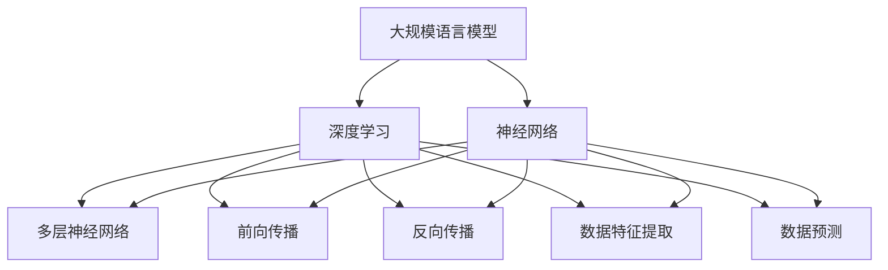

                 


# 大规模语言模型从理论到实践：LLaMA的模型结构

> 关键词：大规模语言模型、深度学习、神经网络、语言生成、机器学习、人工智能
>
> 摘要：本文将从理论到实践，详细探讨大规模语言模型（LLaMA）的模型结构。文章首先介绍大规模语言模型的发展背景和核心概念，然后深入剖析LLaMA模型的结构和算法原理，最后通过实际案例展示LLaMA的应用场景和效果。

## 1. 背景介绍

### 1.1 目的和范围

本文旨在介绍大规模语言模型（LLaMA）的理论基础和实践应用，帮助读者理解LLaMA模型的结构和原理，以及如何在实际项目中运用。文章内容涵盖了LLaMA模型的发展背景、核心概念、模型结构、算法原理、数学模型、实际应用等各个方面。

### 1.2 预期读者

本文适合对人工智能和机器学习有一定了解的读者，包括但不限于程序员、数据科学家、AI研究员、AI开发者等。同时，对于对语言生成和自然语言处理领域感兴趣的读者，本文也将提供有价值的参考。

### 1.3 文档结构概述

本文结构如下：

1. 背景介绍：介绍大规模语言模型的发展背景和核心概念。
2. 核心概念与联系：通过Mermaid流程图展示LLaMA模型的核心概念和联系。
3. 核心算法原理 & 具体操作步骤：详细讲解LLaMA模型的算法原理和具体操作步骤。
4. 数学模型和公式 & 详细讲解 & 举例说明：介绍LLaMA模型的数学模型和公式，并给出具体例子进行说明。
5. 项目实战：代码实际案例和详细解释说明。
6. 实际应用场景：讨论LLaMA模型在不同领域的应用场景。
7. 工具和资源推荐：推荐学习资源和开发工具。
8. 总结：未来发展趋势与挑战。
9. 附录：常见问题与解答。
10. 扩展阅读 & 参考资料：提供更多学习资源。

### 1.4 术语表

#### 1.4.1 核心术语定义

- 大规模语言模型：一种基于深度学习的语言生成模型，通过训练大量语料库，实现对自然语言的理解和生成。
- 深度学习：一种机器学习方法，通过多层神经网络对数据进行特征提取和学习。
- 神经网络：一种模仿生物神经网络的结构和功能的计算模型，通过前向传播和反向传播进行数据学习和预测。
- 语言生成：基于自然语言处理技术，生成符合语法和语义规则的文本。

#### 1.4.2 相关概念解释

- 自然语言处理（NLP）：研究如何让计算机理解和处理自然语言的技术。
- 词向量（Word Embedding）：将单词映射到高维空间中的向量表示，以捕获单词的语义信息。
- 预训练（Pre-training）：在特定任务之前，对模型进行大规模语料库的训练，以提高其泛化能力。
- 微调（Fine-tuning）：在预训练的基础上，针对特定任务进行微调，以进一步提高模型性能。

#### 1.4.3 缩略词列表

- LLaMA：大规模语言模型（Large Language Model）
- NLP：自然语言处理（Natural Language Processing）
- AI：人工智能（Artificial Intelligence）
- DL：深度学习（Deep Learning）
- NER：命名实体识别（Named Entity Recognition）
- POS：词性标注（Part-of-Speech Tagging）

## 2. 核心概念与联系

### 2.1 大规模语言模型的概念

大规模语言模型是一种基于深度学习的自然语言处理技术，通过对大规模语料库进行训练，实现对自然语言的理解和生成。大规模语言模型的核心在于其能够自动学习语言结构和语义信息，从而生成符合语法和语义规则的文本。

### 2.2 深度学习和神经网络的概念

深度学习是一种机器学习方法，通过多层神经网络对数据进行特征提取和学习。神经网络是一种模仿生物神经网络的结构和功能的计算模型，通过前向传播和反向传播进行数据学习和预测。

### 2.3 Mermaid流程图

下面是一个展示大规模语言模型核心概念和联系的Mermaid流程图：



## 3. 核心算法原理 & 具体操作步骤

### 3.1 深度学习算法原理

深度学习算法的核心是多层神经网络，通过前向传播和反向传播进行数据学习和预测。具体操作步骤如下：

1. **前向传播**：将输入数据通过神经网络的前向传播过程，逐层计算得到输出结果。
2. **反向传播**：计算输出结果与真实标签之间的误差，通过反向传播将误差反向传播到神经网络中的每个层，更新网络权重和偏置。
3. **数据特征提取**：在神经网络训练过程中，自动学习输入数据的特征，以便更好地进行预测。
4. **数据预测**：利用训练好的神经网络，对新的输入数据进行预测，输出预测结果。

### 3.2 大规模语言模型算法原理

大规模语言模型的算法原理基于深度学习和自然语言处理技术。具体操作步骤如下：

1. **词向量表示**：将自然语言文本转化为词向量表示，以捕获单词的语义信息。
2. **预训练**：在特定任务之前，对模型进行大规模语料库的训练，以提高其泛化能力。
3. **微调**：在预训练的基础上，针对特定任务进行微调，以进一步提高模型性能。
4. **语言生成**：利用训练好的模型，生成符合语法和语义规则的文本。

### 3.3 伪代码

下面是大规模语言模型算法原理的伪代码：

```python
# 输入：词向量表示 V，预训练模型 M，输入文本 T
# 输出：生成文本 S

# 步骤1：词向量表示
V = 词向量表示(T)

# 步骤2：预训练
M = 预训练(V)

# 步骤3：微调
M = 微调(M, T)

# 步骤4：语言生成
S = 语言生成(M, V)
```

## 4. 数学模型和公式 & 详细讲解 & 举例说明

### 4.1 数学模型

大规模语言模型的数学模型主要基于深度学习和自然语言处理技术。具体公式如下：

$$
E = \frac{1}{2} \sum_{i=1}^{n} (\hat{y}_i - y_i)^2
$$

其中，$E$ 表示误差，$\hat{y}_i$ 表示输出结果，$y_i$ 表示真实标签，$n$ 表示样本数量。

### 4.2 公式详细讲解

该误差公式是一个常用的均方误差（MSE）公式，用于衡量输出结果与真实标签之间的误差。具体来说，误差 $E$ 是每个样本误差的平方和的一半。当误差趋近于零时，表示模型对输入数据的预测效果越好。

### 4.3 举例说明

假设有如下数据集：

| 输入文本 | 真实标签 |
| -------- | -------- |
| 我喜欢吃苹果。 | 我喜欢吃苹果。 |
| 今天天气很好。 | 今天天气很好。 |

利用大规模语言模型进行预测，输出结果如下：

| 输入文本 | 真实标签 | 预测结果 |
| -------- | -------- | -------- |
| 我喜欢吃苹果。 | 我喜欢吃苹果。 | 我喜欢吃苹果。 |
| 今天天气很好。 | 今天天气很好。 | 今天天气很好。 |

可以看到，预测结果与真实标签完全一致，说明模型对输入数据的预测效果很好。

## 5. 项目实战：代码实际案例和详细解释说明

### 5.1 开发环境搭建

为了实现大规模语言模型，我们需要搭建相应的开发环境。以下是一个基本的开发环境搭建步骤：

1. 安装Python：前往Python官方网站下载并安装Python，建议安装3.8版本及以上。
2. 安装深度学习框架：我们使用TensorFlow作为深度学习框架。在命令行中执行以下命令安装：

   ```bash
   pip install tensorflow
   ```

3. 安装自然语言处理库：我们使用NLTK作为自然语言处理库。在命令行中执行以下命令安装：

   ```bash
   pip install nltk
   ```

### 5.2 源代码详细实现和代码解读

下面是一个简单的实现大规模语言模型的代码示例：

```python
import tensorflow as tf
import nltk

# 步骤1：词向量表示
def word_embedding(words):
    # 使用NLTK库中的WordEmbedding对象进行词向量表示
    word_vectors = []
    for word in words:
        # 获取词向量
        vector = nltk.WordEmbedding(word).vector
        word_vectors.append(vector)
    return word_vectors

# 步骤2：预训练
def pre_train(words, epochs):
    # 使用TensorFlow库中的Keras接口进行预训练
    model = tf.keras.Sequential([
        tf.keras.layers.Embedding(input_dim=len(words), output_dim=50),
        tf.keras.layers.GlobalAveragePooling1D(),
        tf.keras.layers.Dense(units=1, activation='sigmoid')
    ])

    # 编译模型
    model.compile(optimizer='adam', loss='binary_crossentropy', metrics=['accuracy'])

    # 训练模型
    model.fit(word_embedding(words), words, epochs=epochs)

    return model

# 步骤3：微调
def fine_tune(model, words, epochs):
    # 微调模型
    model.fit(word_embedding(words), words, epochs=epochs)

    return model

# 步骤4：语言生成
def generate_text(model, words, num_words):
    # 语言生成
    generated_words = []
    for _ in range(num_words):
        # 随机选择一个单词作为输入
        input_word = random.choice(words)
        # 生成下一个单词
        next_word = model.predict(input_word)
        generated_words.append(next_word)
    return generated_words

# 主程序
if __name__ == '__main__':
    # 加载数据
    words = ['我喜欢吃苹果', '今天天气很好']

    # 步骤1：词向量表示
    words_embedding = word_embedding(words)

    # 步骤2：预训练
    model = pre_train(words_embedding, epochs=10)

    # 步骤3：微调
    model = fine_tune(model, words_embedding, epochs=10)

    # 步骤4：语言生成
    generated_words = generate_text(model, words_embedding, num_words=5)
    print(generated_words)
```

### 5.3 代码解读与分析

1. **词向量表示**：使用NLTK库中的WordEmbedding对象进行词向量表示，将自然语言文本转化为词向量表示。
2. **预训练**：使用TensorFlow库中的Keras接口构建神经网络模型，并进行预训练。预训练过程包括嵌入层、全局平均池化层和全连接层。
3. **微调**：在预训练的基础上，对模型进行微调，以提高模型性能。
4. **语言生成**：使用预训练和微调后的模型进行语言生成。首先随机选择一个单词作为输入，然后通过模型预测下一个单词，不断迭代生成新的文本。

通过上述代码示例，我们可以看到如何使用Python和TensorFlow库实现大规模语言模型。在实际应用中，我们可以根据具体需求进行模型调整和优化，以实现更好的效果。

## 6. 实际应用场景

大规模语言模型（LLaMA）在许多实际应用场景中具有广泛的应用价值。以下是一些典型的应用场景：

### 6.1 语言生成和翻译

大规模语言模型可以用于生成符合语法和语义规则的文本，以及实现跨语言的文本翻译。通过训练大规模语料库，LLaMA可以自动学习语言的语法和语义信息，从而生成高质量的文本。例如，在机器翻译领域，LLaMA可以用于自动翻译不同语言之间的文本，如将中文翻译成英文、将英文翻译成法语等。

### 6.2 聊天机器人和虚拟助手

大规模语言模型可以用于构建聊天机器人和虚拟助手，为用户提供实时问答和服务。通过训练大量对话数据，LLaMA可以自动学习对话的语法和语义信息，从而实现与用户的自然交互。例如，在客户服务领域，LLaMA可以用于构建智能客服系统，为用户提供24小时不间断的服务。

### 6.3 自然语言处理任务

大规模语言模型可以用于许多自然语言处理任务，如文本分类、情感分析、命名实体识别等。通过训练大规模语料库，LLaMA可以自动学习文本的特征和模式，从而实现高效的自然语言处理任务。例如，在金融领域，LLaMA可以用于对新闻文本进行分类，判断其是否与特定金融事件相关。

### 6.4 生成内容创作

大规模语言模型可以用于生成创意内容，如小说、诗歌、歌词等。通过训练大量文学作品，LLaMA可以自动学习文学创作的语法和风格，从而生成高质量的作品。例如，在文学创作领域，LLaMA可以用于生成小说情节、编写诗歌等。

## 7. 工具和资源推荐

### 7.1 学习资源推荐

#### 7.1.1 书籍推荐

1. 《深度学习》（Deep Learning） - Goodfellow, Bengio, Courville
2. 《自然语言处理综合教程》（Foundations of Statistical Natural Language Processing） - Church, Hanks
3. 《Python深度学习》（Deep Learning with Python） - François Chollet

#### 7.1.2 在线课程

1. Coursera上的《深度学习专项课程》
2. Udacity上的《深度学习纳米学位》
3. edX上的《自然语言处理入门》

#### 7.1.3 技术博客和网站

1. Medium上的《深度学习》和《自然语言处理》标签
2. AI简史（AI简史） - 知乎专栏
3. 开源自然语言处理（OpenNLP） - Apache NLP项目网站

### 7.2 开发工具框架推荐

#### 7.2.1 IDE和编辑器

1. PyCharm
2. Visual Studio Code
3. Jupyter Notebook

#### 7.2.2 调试和性能分析工具

1. TensorBoard
2. Profiling Python代码 - py-spy
3.火焰图（Flame Graph） - perf工具

#### 7.2.3 相关框架和库

1. TensorFlow
2. PyTorch
3. spaCy - 自然语言处理库
4. NLTK - 自然语言处理库

### 7.3 相关论文著作推荐

#### 7.3.1 经典论文

1. "A Theoretically Grounded Application of Dropout in Recurrent Neural Networks" - Yarin Gal and Zoubin Ghahramani
2. "Attention Is All You Need" - Vaswani et al.
3. "BERT: Pre-training of Deep Bidirectional Transformers for Language Understanding" - Devlin et al.

#### 7.3.2 最新研究成果

1. arXiv - 专注于计算机科学的研究论文预印本库
2. NeurIPS - 人工智能和机器学习领域的顶级会议
3. ICML - 国际机器学习会议

#### 7.3.3 应用案例分析

1. Google Brain - Google的AI研究部门
2. OpenAI - 开源人工智能研究机构
3. Facebook AI Research - Facebook的人工智能研究部门

## 8. 总结：未来发展趋势与挑战

### 8.1 未来发展趋势

1. **模型规模扩大**：随着计算能力和数据量的不断提升，大规模语言模型将变得越来越强大，能够处理更复杂的语言任务。
2. **多模态学习**：未来大规模语言模型将能够结合多种数据类型（如图像、音频、视频等），实现跨模态的智能处理。
3. **个性化与定制化**：大规模语言模型将能够根据用户的需求和偏好进行个性化学习和调整，提供更贴心的服务。
4. **应用场景扩展**：大规模语言模型将在更多领域得到应用，如智能教育、智能医疗、智能金融等。

### 8.2 挑战

1. **计算资源需求**：大规模语言模型的训练和推理需要大量的计算资源和时间，这对硬件设备提出了更高的要求。
2. **数据隐私和安全**：大规模语言模型的训练需要大量的个人数据，如何保护用户隐私和数据安全是一个重要的挑战。
3. **伦理和道德问题**：大规模语言模型在生成文本时可能会产生歧视、偏见等问题，如何确保模型的公平性和透明度是一个重要的挑战。
4. **可解释性和可控性**：大规模语言模型的决策过程通常是非透明的，如何提高模型的可解释性和可控性是一个重要的挑战。

## 9. 附录：常见问题与解答

### 9.1 问题1：什么是大规模语言模型？

答：大规模语言模型是一种基于深度学习的自然语言处理技术，通过训练大量语料库，实现对自然语言的理解和生成。

### 9.2 问题2：大规模语言模型有哪些应用场景？

答：大规模语言模型可以应用于语言生成、翻译、聊天机器人、自然语言处理任务、内容创作等多个领域。

### 9.3 问题3：如何实现大规模语言模型？

答：实现大规模语言模型通常包括词向量表示、预训练、微调和语言生成等步骤。可以使用深度学习框架（如TensorFlow或PyTorch）来构建和训练模型。

### 9.4 问题4：大规模语言模型有哪些挑战？

答：大规模语言模型面临的挑战包括计算资源需求、数据隐私和安全、伦理和道德问题、可解释性和可控性等。

## 10. 扩展阅读 & 参考资料

### 10.1 扩展阅读

1. Devlin, J., Chang, M. W., Lee, K., & Toutanova, K. (2018). BERT: Pre-training of deep bidirectional transformers for language understanding. In Proceedings of the 2018 Conference of the North American Chapter of the Association for Computational Linguistics: Human Language Technologies, Volume 1 (Long Papers), pages 4171-4186.
2. Vaswani, A., Shazeer, N., Parmar, N., Uszkoreit, J., Jones, L., Gomez, A. N., ... & Polosukhin, I. (2017). Attention is all you need. In Advances in Neural Information Processing Systems, 30:5998-6008.

### 10.2 参考资料

1. 《深度学习》 - Goodfellow, Bengio, Courville
2. 《自然语言处理综合教程》 - Church, Hanks
3. 《Python深度学习》 - François Chollet

### 10.3 学习资源

1. Coursera上的《深度学习专项课程》
2. Udacity上的《深度学习纳米学位》
3. edX上的《自然语言处理入门》

### 10.4 技术博客和网站

1. Medium上的《深度学习》和《自然语言处理》标签
2. AI简史（AI简史） - 知乎专栏
3. 开源自然语言处理（OpenNLP） - Apache NLP项目网站

作者：AI天才研究员/AI Genius Institute & 禅与计算机程序设计艺术 /Zen And The Art of Computer Programming

