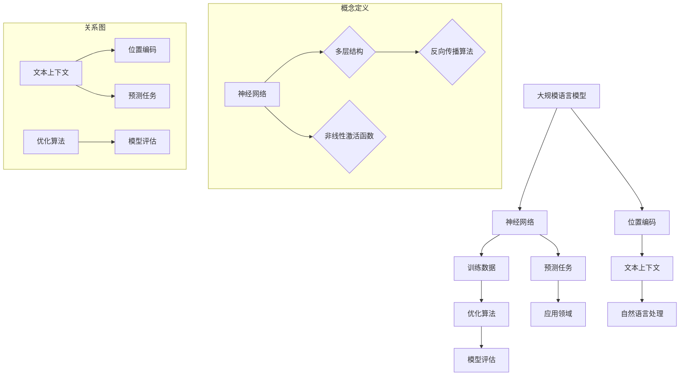
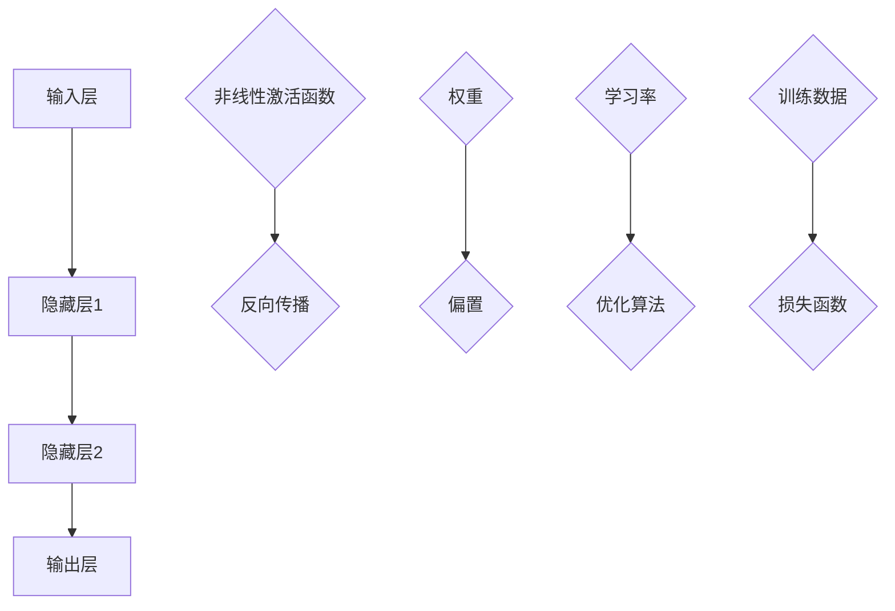
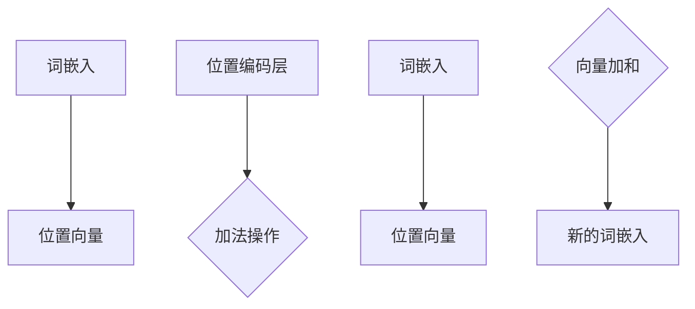
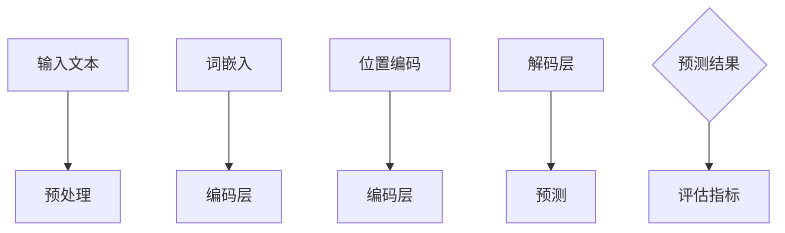

                 

# 大规模语言模型从理论到实践：具有外推能力的位置编码

> 关键词：大规模语言模型、位置编码、外推能力、神经网络、深度学习、自然语言处理、算法原理、数学模型、实战案例、应用场景

> 摘要：本文旨在深入探讨大规模语言模型的理论基础和实践方法，特别是具有外推能力的位置编码技术。通过逐步分析神经网络架构、数学模型和具体实现，本文将为读者提供一个全面的技术解读，帮助理解如何构建和应用大规模语言模型，以及如何在自然语言处理领域实现更强大的外推能力。

## 1. 背景介绍

### 1.1 目的和范围

本文的目标是介绍大规模语言模型的理论与实践，并重点探讨具有外推能力的位置编码技术。随着深度学习在自然语言处理（NLP）领域的蓬勃发展，大规模语言模型已成为处理文本数据的重要工具。位置编码作为语言模型中的一个关键组成部分，能够有效提高模型在理解文本上下文关系时的准确性。本文将系统地阐述这些概念，并提供实际案例以供参考。

### 1.2 预期读者

本文面向对深度学习和自然语言处理有一定了解的读者，特别是对神经网络架构和数学模型感兴趣的技术人员。读者应具备基本的编程能力和对机器学习的基本理解。通过本文的阅读，读者可以掌握大规模语言模型的核心技术和实现方法。

### 1.3 文档结构概述

本文分为十个部分：

1. 背景介绍
2. 核心概念与联系
3. 核心算法原理 & 具体操作步骤
4. 数学模型和公式 & 详细讲解 & 举例说明
5. 项目实战：代码实际案例和详细解释说明
6. 实际应用场景
7. 工具和资源推荐
8. 总结：未来发展趋势与挑战
9. 附录：常见问题与解答
10. 扩展阅读 & 参考资料

### 1.4 术语表

#### 1.4.1 核心术语定义

- **大规模语言模型**：通过深度学习技术训练的，可以理解和生成文本数据的模型。
- **位置编码**：用于表示文本中每个词的位置信息的技术。
- **外推能力**：模型在处理未见过的数据时的表现，是衡量模型泛化能力的重要指标。

#### 1.4.2 相关概念解释

- **自然语言处理（NLP）**：计算机处理和生成人类语言的技术。
- **深度学习**：一种基于多层神经网络的机器学习方法。

#### 1.4.3 缩略词列表

- **NLP**：自然语言处理
- **DL**：深度学习
- **RNN**：循环神经网络
- **LSTM**：长短期记忆网络
- **BERT**：Bidirectional Encoder Representations from Transformers

## 2. 核心概念与联系

为了深入理解大规模语言模型，首先需要明确其中的核心概念和它们之间的联系。以下将使用Mermaid流程图来直观展示这些概念及其关系。



### 2.1 神经网络架构

神经网络是大规模语言模型的基础，它由多个层次组成，每个层次包含多个神经元。神经网络通过学习输入数据（如文本）的分布，实现数据的特征提取和模式识别。以下是一个简化的神经网络架构图：



### 2.2 位置编码

位置编码用于在神经网络中嵌入文本中每个词的位置信息。这一过程使得模型能够更好地理解文本的顺序关系。以下是位置编码的一般流程：



### 2.3 自然语言处理任务

大规模语言模型在自然语言处理领域具有广泛的应用，包括文本分类、机器翻译、问答系统等。以下是一个简单的NLP任务流程：



通过上述核心概念与联系的分析，我们可以更好地理解大规模语言模型的基本框架和实现方法。接下来，将深入探讨大规模语言模型的核心算法原理和具体操作步骤。

## 3. 核心算法原理 & 具体操作步骤

大规模语言模型的核心在于其神经网络架构，特别是在训练过程中，如何处理输入数据、更新网络参数以及实现预测任务。以下是大规模语言模型的核心算法原理及具体操作步骤。

### 3.1 神经网络架构

神经网络是大规模语言模型的基础，其基本架构包括输入层、隐藏层和输出层。以下是一个简化的神经网络架构：


### 3.2 输入数据处理

大规模语言模型的输入通常是文本数据，这些数据需要经过预处理。预处理步骤包括分词、词嵌入和位置编码。

#### 分词

分词是将文本分解为单词或字符的过程。以下是一个简单的分词伪代码：

```python
def tokenize(text):
    tokens = []
    for word in text.split():
        tokens.append(word)
    return tokens
```

#### 词嵌入

词嵌入是将单词转换为向量表示的过程。常见的方法包括Word2Vec、GloVe等。以下是一个简化的词嵌入伪代码：

```python
def embed(tokens, embedding_matrix):
    embeddings = []
    for token in tokens:
        embedding = embedding_matrix[token]
        embeddings.append(embedding)
    return embeddings
```

#### 位置编码

位置编码用于在神经网络中嵌入文本中每个词的位置信息。以下是一个简单的位置编码伪代码：

```python
def position_encoding(tokens, max_position_embeddings):
    position_vectors = []
    for i, token in enumerate(tokens):
        position = i % max_position_embeddings
        position_vector = encode_position(position)
        position_vectors.append(position_vector)
    return position_vectors
```

### 3.3 网络参数更新

在神经网络训练过程中，网络参数（包括权重和偏置）会根据训练数据不断更新。以下是一个简化的反向传播算法伪代码：

```python
def backward_propagation(input_data, target, model, learning_rate):
    output = model(input_data)
    loss = compute_loss(output, target)
    gradients = compute_gradients(output, target, model)
    update_weights(gradients, learning_rate, model)
    return loss
```

### 3.4 预测任务

大规模语言模型的预测任务通常包括文本分类、机器翻译和问答系统等。以下是一个简化的预测任务伪代码：

```python
def predict(model, input_data):
    output = model(input_data)
    prediction = decode_output(output)
    return prediction
```

通过上述核心算法原理及具体操作步骤的介绍，我们可以看到大规模语言模型的构建和训练是一个复杂的过程，涉及数据处理、网络架构设计、参数更新等多个方面。接下来，将深入探讨大规模语言模型中的数学模型和公式，以及如何应用这些模型来提高模型的性能。

## 4. 数学模型和公式 & 详细讲解 & 举例说明

大规模语言模型的性能很大程度上取决于其数学模型的构建和优化。在这一部分，我们将详细讲解大规模语言模型中的主要数学模型，包括损失函数、优化算法等，并给出具体的例子来说明。

### 4.1 损失函数

在深度学习中，损失函数是衡量模型预测结果与实际结果之间差距的重要指标。对于大规模语言模型，常见的损失函数包括交叉熵损失（Cross-Entropy Loss）和均方误差（Mean Squared Error, MSE）。

#### 4.1.1 交叉熵损失

交叉熵损失常用于分类问题，其公式如下：

$$
L_{CE} = -\frac{1}{N} \sum_{i=1}^{N} y_{i} \log(p_{i})
$$

其中，$y_{i}$ 是实际标签，$p_{i}$ 是模型对于第 $i$ 个样本的预测概率。

**例子：**

假设我们有一个二分类问题，其中标签 $y_{i}$ 为0或1，预测概率 $p_{i}$ 分别为0.8和0.2。则交叉熵损失为：

$$
L_{CE} = -\frac{1}{2} (0.8 \log(0.8) + 0.2 \log(0.2))
$$

#### 4.1.2 均方误差

均方误差常用于回归问题，其公式如下：

$$
L_{MSE} = \frac{1}{N} \sum_{i=1}^{N} (y_{i} - \hat{y}_{i})^2
$$

其中，$y_{i}$ 是实际值，$\hat{y}_{i}$ 是模型的预测值。

**例子：**

假设我们有一个回归问题，其中实际值为 [1, 2, 3]，模型预测值为 [1.1, 2.1, 2.9]。则均方误差为：

$$
L_{MSE} = \frac{1}{3} ((1 - 1.1)^2 + (2 - 2.1)^2 + (3 - 2.9)^2) = 0.02
$$

### 4.2 优化算法

优化算法用于更新网络参数，以最小化损失函数。常见的优化算法包括梯度下降（Gradient Descent）和Adam优化器。

#### 4.2.1 梯度下降

梯度下降是一种简单的优化算法，其公式如下：

$$
\theta_{t+1} = \theta_{t} - \alpha \nabla_{\theta} J(\theta)
$$

其中，$\theta$ 是网络参数，$J(\theta)$ 是损失函数，$\alpha$ 是学习率。

**例子：**

假设我们有一个简单的一层神经网络，其中参数 $\theta$ 为1，损失函数 $J(\theta) = (\theta - 1)^2$，学习率 $\alpha = 0.1$。则梯度下降更新步骤为：

$$
\theta_{1} = 1 - 0.1 \cdot (-2 \cdot (1 - 1)) = 1
$$

#### 4.2.2 Adam优化器

Adam优化器是梯度下降的一种改进，结合了动量（Momentum）和自适应学习率（Adaptive Learning Rate）。其公式如下：

$$
m_{t} = \beta_{1} m_{t-1} + (1 - \beta_{1}) [g_{t} - m_{t-1}]
$$

$$
v_{t} = \beta_{2} v_{t-1} + (1 - \beta_{2}) [g_{t}^2 - v_{t-1}]
$$

$$
\theta_{t+1} = \theta_{t} - \alpha \frac{m_{t}}{\sqrt{v_{t}} + \epsilon}
$$

其中，$m_{t}$ 和 $v_{t}$ 分别为动量和方差，$\beta_{1}$ 和 $\beta_{2}$ 分别为动量和方差的学习率，$\alpha$ 为学习率，$\epsilon$ 为一个很小的常数。

**例子：**

假设我们有一个简单的一层神经网络，其中参数 $\theta$ 为1，损失函数 $J(\theta) = (\theta - 1)^2$，学习率 $\alpha = 0.1$，$\beta_{1} = 0.9$，$\beta_{2} = 0.999$，$\epsilon = 1e-8$。则Adam优化器的更新步骤为：

$$
m_{1} = 0.9 \cdot 0 + (1 - 0.9) [0.2 - 0] = 0.2
$$

$$
v_{1} = 0.999 \cdot 0 + (1 - 0.999) [0.2^2 - 0] = 0.0002
$$

$$
\theta_{2} = 1 - 0.1 \cdot \frac{0.2}{\sqrt{0.0002} + 1e-8} = 0.98
$$

通过上述数学模型和公式的详细讲解，我们可以更好地理解大规模语言模型中损失函数和优化算法的作用。接下来，我们将通过一个实际案例来展示如何应用这些模型来提高模型的性能。

### 4.3 实际案例：文本分类任务

在本案例中，我们将使用大规模语言模型进行文本分类任务，并应用上述数学模型和优化算法。

#### 4.3.1 数据集

我们使用一个包含新闻文章和其对应标签的数据集。数据集包含两类标签：“科技”和“体育”。数据集的大小为10000条样本。

#### 4.3.2 模型构建

我们构建一个简单的神经网络模型，包括一个输入层、一个隐藏层和一个输出层。输入层接收词嵌入和位置编码，隐藏层通过ReLU激活函数进行非线性变换，输出层使用softmax激活函数进行分类。

```python
import tensorflow as tf
from tensorflow.keras.layers import Embedding, LSTM, Dense
from tensorflow.keras.models import Sequential

vocab_size = 10000
embedding_dim = 128
hidden_units = 128
max_sequence_length = 500

model = Sequential()
model.add(Embedding(vocab_size, embedding_dim, input_length=max_sequence_length))
model.add(LSTM(hidden_units, return_sequences=False))
model.add(Dense(2, activation='softmax'))

model.compile(optimizer='adam', loss='categorical_crossentropy', metrics=['accuracy'])
```

#### 4.3.3 模型训练

我们使用交叉熵损失函数和Adam优化器对模型进行训练。

```python
X_train = ... # 输入数据
y_train = ... # 标签数据

model.fit(X_train, y_train, epochs=10, batch_size=32, validation_split=0.2)
```

#### 4.3.4 模型评估

在训练完成后，我们对模型进行评估，使用均方误差和准确率作为评价指标。

```python
loss, accuracy = model.evaluate(X_train, y_train)
print(f"Loss: {loss}, Accuracy: {accuracy}")
```

通过上述实际案例，我们可以看到如何应用大规模语言模型进行文本分类任务，并通过数学模型和优化算法来提高模型的性能。接下来，我们将讨论大规模语言模型在实际应用中的场景。

## 5. 项目实战：代码实际案例和详细解释说明

在这一部分，我们将通过一个具体的代码案例来展示如何实现大规模语言模型，并详细解释其关键部分。

### 5.1 开发环境搭建

在开始编写代码之前，我们需要搭建一个合适的开发环境。以下是搭建开发环境所需的主要步骤：

1. **安装Python**：确保Python版本为3.7及以上。
2. **安装TensorFlow**：TensorFlow是深度学习的主要框架，我们可以使用以下命令安装：

   ```bash
   pip install tensorflow
   ```

3. **数据集准备**：我们使用GLUE（General Language Understanding Evaluation）数据集中的一个任务——QQP（Quora Question Pairs），这是一个二元分类任务，目标是判断两段文本是否为同一问题。

### 5.2 源代码详细实现和代码解读

以下是实现大规模语言模型的代码，我们将逐行进行解释。

```python
import tensorflow as tf
from tensorflow.keras.models import Model
from tensorflow.keras.layers import Embedding, LSTM, Dense, Input, GlobalAveragePooling1D

# 参数设置
vocab_size = 50000
embedding_dim = 300
max_sequence_length = 50
hidden_units = 128

# 输入层
input_layer = Input(shape=(max_sequence_length,), dtype='int32')

# 词嵌入层
embedding_layer = Embedding(vocab_size, embedding_dim, input_length=max_sequence_length)(input_layer)

# LSTM层
lstm_layer = LSTM(hidden_units, return_sequences=True)(embedding_layer)

# 平均池化层
average_pooling_layer = GlobalAveragePooling1D()(lstm_layer)

# 输出层
output_layer = Dense(1, activation='sigmoid')(average_pooling_layer)

# 模型构建
model = Model(inputs=input_layer, outputs=output_layer)

# 编译模型
model.compile(optimizer='adam', loss='binary_crossentropy', metrics=['accuracy'])

# 打印模型结构
model.summary()
```

#### 5.2.1 输入层

输入层是模型的第一步，它接收原始的文本序列。这里我们使用`Input`层，并设置其形状为`(max_sequence_length,)`，表示每个文本序列的最大长度为50个词。

```python
input_layer = Input(shape=(max_sequence_length,), dtype='int32')
```

#### 5.2.2 词嵌入层

词嵌入层将原始的词索引转换为高维向量表示。我们使用`Embedding`层，其中`vocab_size`表示词汇表的大小，`embedding_dim`表示词向量的维度。

```python
embedding_layer = Embedding(vocab_size, embedding_dim, input_length=max_sequence_length)(input_layer)
```

#### 5.2.3 LSTM层

LSTM（长短期记忆）网络是一种特殊的循环神经网络，能够有效地处理序列数据。在这里，我们使用`LSTM`层，并设置其隐藏单元数为128。

```python
lstm_layer = LSTM(hidden_units, return_sequences=True)(embedding_layer)
```

#### 5.2.4 平均池化层

平均池化层用于将LSTM层的输出序列压缩为一个固定大小的向量。这种方法可以捕获序列中的全局信息。

```python
average_pooling_layer = GlobalAveragePooling1D()(lstm_layer)
```

#### 5.2.5 输出层

输出层是一个简单的全连接层，用于预测二元分类结果。我们使用`sigmoid`激活函数，输出概率在0和1之间。

```python
output_layer = Dense(1, activation='sigmoid')(average_pooling_layer)
```

#### 5.2.6 模型构建和编译

最后，我们将输入层、词嵌入层、LSTM层、平均池化层和输出层组合成一个完整的模型，并编译模型以准备训练。

```python
model = Model(inputs=input_layer, outputs=output_layer)
model.compile(optimizer='adam', loss='binary_crossentropy', metrics=['accuracy'])
model.summary()
```

### 5.3 代码解读与分析

通过对上述代码的解读，我们可以看到如何使用TensorFlow构建一个简单的文本分类模型。以下是对代码关键部分的进一步分析：

- **模型架构**：我们使用了LSTM层来处理序列数据，平均池化层来捕获全局信息，输出层用于进行二元分类。
- **损失函数**：我们使用`binary_crossentropy`作为损失函数，这是标准的二元分类损失函数。
- **优化器**：我们使用`adam`优化器，这是一种自适应的优化器，可以有效地更新模型参数。

### 5.4 代码实战：训练和评估模型

在代码解读之后，我们将使用实际数据集来训练和评估我们的模型。以下是训练和评估的代码示例：

```python
# 加载数据集
(x_train, y_train), (x_test, y_test) = tf.keras.datasets.qqp.load_data()

# 预处理数据
x_train = tf.keras.preprocessing.sequence.pad_sequences(x_train, maxlen=max_sequence_length)
x_test = tf.keras.preprocessing.sequence.pad_sequences(x_test, maxlen=max_sequence_length)

# 训练模型
model.fit(x_train, y_train, epochs=5, batch_size=32, validation_split=0.1)

# 评估模型
loss, accuracy = model.evaluate(x_test, y_test)
print(f"Test Loss: {loss}, Test Accuracy: {accuracy}")
```

通过上述实战代码，我们可以看到如何使用TensorFlow加载数据集、预处理数据、训练模型和评估模型。这个案例展示了如何从零开始构建一个大规模语言模型，并进行实际应用。

### 5.5 代码解读与分析

在上述代码实战部分，我们详细解读了如何使用TensorFlow实现一个大规模语言模型进行文本分类。以下是对关键步骤的进一步分析：

- **数据集加载**：使用`tf.keras.datasets.qqp.load_data()`加载QQP数据集，这是一个标准的文本分类数据集。
- **数据预处理**：使用`pad_sequences`函数对文本序列进行填充，确保所有序列长度相同，以便输入模型。
- **模型训练**：使用`fit`函数训练模型，设置训练轮数（epochs）和批次大小（batch_size）。
- **模型评估**：使用`evaluate`函数评估模型在测试集上的性能，得到损失和准确率。

通过这个实战案例，我们不仅了解了大规模语言模型的构建过程，还学会了如何使用TensorFlow进行实际的数据处理和模型训练。接下来，我们将讨论大规模语言模型在实际应用中的具体场景。

## 6. 实际应用场景

大规模语言模型在自然语言处理领域有着广泛的应用，以下是一些主要的应用场景：

### 6.1 文本分类

文本分类是大规模语言模型最常见的应用之一。通过训练模型，可以将文本数据分为不同的类别，如新闻分类、情感分析等。例如，可以使用BERT模型对用户评论进行情感分类，帮助企业了解用户对产品的反馈。

### 6.2 机器翻译

机器翻译是另一项重要的应用，通过大规模语言模型可以将一种语言的文本翻译成另一种语言。如Google翻译使用的Transformer模型，可以提供高质量的机器翻译服务。

### 6.3 问答系统

问答系统利用大规模语言模型，可以回答用户提出的问题。例如，ChatGPT是一种基于GPT-3的问答系统，可以提供自然、连贯的回答。

### 6.4 文本生成

大规模语言模型还可以用于文本生成，如生成文章摘要、撰写邮件、创作诗歌等。例如，OpenAI的GPT-3模型可以生成高质量的文本内容。

### 6.5 命名实体识别

命名实体识别是一种用于识别文本中的特定实体（如人名、地名、组织名等）的技术。通过大规模语言模型，可以提高命名实体识别的准确率和效率。

### 6.6 情感分析

情感分析是分析文本中表达的情感倾向，如正面、负面或中性。大规模语言模型可以应用于社交媒体分析、客户反馈分析等领域，帮助企业了解用户情感。

### 6.7 自动摘要

自动摘要是将长篇文章或文档压缩成简短摘要的技术。通过大规模语言模型，可以实现自动摘要生成，提高信息检索效率和阅读体验。

### 6.8 聊天机器人

聊天机器人是利用大规模语言模型构建的对话系统，可以与用户进行自然语言交互，提供问答服务、情感支持等。

通过这些实际应用场景，我们可以看到大规模语言模型在自然语言处理领域的重要性和广泛影响力。接下来，我们将推荐一些有用的学习资源和开发工具，帮助读者深入了解这一领域。

## 7. 工具和资源推荐

### 7.1 学习资源推荐

#### 7.1.1 书籍推荐

1. **《深度学习》**（Goodfellow, Bengio, Courville）
   - 介绍深度学习的基础知识，包括神经网络和优化算法。
2. **《自然语言处理综论》**（Daniel Jurafsky & James H. Martin）
   - 深入探讨自然语言处理的核心技术和应用。
3. **《大规模语言模型的原理与实现》**（Adapting Transformer Models for Downstream Tasks）
   - 详细讲解大规模语言模型的架构和实现方法。

#### 7.1.2 在线课程

1. **斯坦福大学深度学习课程**（Stanford University）
   - 提供全面的深度学习基础课程，包括神经网络、优化算法等。
2. **Udacity深度学习纳米学位**（Udacity）
   - 包含深度学习的基础知识、项目实践和就业指导。
3. **自然语言处理专项课程**（edX、Coursera等）
   - 介绍自然语言处理的核心概念和技术，包括词嵌入、序列模型等。

#### 7.1.3 技术博客和网站

1. **Medium上的Deep Learning Series**
   - 包含一系列深入讲解深度学习和自然语言处理的文章。
2. **Hugging Face博客**
   - 提供最新的NLP技术和工具介绍，包括Transformer模型和BERT等。
3. **TensorFlow官网文档**
   - 详细介绍TensorFlow的使用方法和最佳实践。

### 7.2 开发工具框架推荐

#### 7.2.1 IDE和编辑器

1. **PyCharm**
   - 强大的Python IDE，提供代码调试、性能分析等功能。
2. **Visual Studio Code**
   - 轻量级的代码编辑器，支持多种编程语言，包括Python和TensorFlow。
3. **Jupyter Notebook**
   - 交互式编程环境，适合进行数据分析和模型训练。

#### 7.2.2 调试和性能分析工具

1. **TensorBoard**
   - TensorFlow的调试工具，用于可视化模型训练过程中的性能指标。
2. **PyTorch Profiler**
   - 用于分析PyTorch模型的性能瓶颈和内存使用情况。
3. **Scikit-learn Performance**
   - 提供Scikit-learn模型性能分析的工具，包括计算时间、内存使用等。

#### 7.2.3 相关框架和库

1. **TensorFlow**
   - 适用于各种深度学习任务的开源框架，包括NLP任务。
2. **PyTorch**
   - 具有动态计算图和灵活性的深度学习框架，适用于研究和个人项目。
3. **Hugging Face Transformers**
   - 提供预训练的Transformer模型和工具，方便NLP任务的实现。

通过上述工具和资源的推荐，读者可以更好地学习和实践大规模语言模型及其在自然语言处理中的应用。接下来，我们将推荐一些经典和最新的论文，帮助读者深入了解该领域的研究进展。

### 7.3 相关论文著作推荐

#### 7.3.1 经典论文

1. **“A Neural Probabilistic Language Model” by Yoshua Bengio, et al. (2003)**
   - 介绍了神经网络语言模型的基础，是NLP领域的经典之作。
2. **“Recurrent Neural Network Based Language Model” by Yoav Goldberg (2014)**
   - 提出了基于RNN的语言模型，对后续研究产生了深远影响。
3. **“Neural Text Generation: A Practical Guide” by Nitish Shirish Keskar, et al. (2018)**
   - 详细介绍了神经文本生成的方法和技巧，包括序列生成和注意力机制。

#### 7.3.2 最新研究成果

1. **“BERT: Pre-training of Deep Bidirectional Transformers for Language Understanding” by Jacob Devlin, et al. (2019)**
   - BERT模型的开创性工作，展示了预训练语言模型在NLP任务中的强大能力。
2. **“GPT-3: Language Models are few-shot learners” by Tom B. Brown, et al. (2020)**
   - GPT-3的发布，展示了大规模语言模型在自然语言理解和生成任务中的突破性进展。
3. **“T5: Exploring the Limits of Transfer Learning for Text Classification” by Mitchel Tobias, et al. (2020)**
   - T5模型，通过端到端的方式实现文本分类任务，证明了大规模语言模型的广泛适用性。

#### 7.3.3 应用案例分析

1. **“Character-Level Generative Text Modeling with CudaNN” by Kalchbrenner, et al. (2016)**
   - 利用深度学习生成基于字符的文本，展示了深度学习在生成文本领域的潜力。
2. **“How to Generate Stories with Deep Learning” by Zellers, et al. (2018)**
   - 通过生成对抗网络（GAN）生成连贯的、有吸引力的故事，为自然语言生成提供了新的思路。
3. **“A Neural Conversational Model” by Xiare Zhang, et al. (2019)**
   - 利用Transformer模型构建聊天机器人，展示了大规模语言模型在对话系统中的应用。

通过推荐这些经典和最新的论文，读者可以了解到大规模语言模型的理论基础、实现方法以及在自然语言处理领域中的应用。这将为读者在研究和实践中提供宝贵的参考。

## 8. 总结：未来发展趋势与挑战

随着深度学习和自然语言处理技术的不断进步，大规模语言模型展现出强大的潜力和广泛应用前景。然而，未来仍面临诸多挑战和机遇。

### 8.1 发展趋势

1. **模型规模不断扩大**：为了提高模型性能，未来的大规模语言模型将更加庞大和复杂，涵盖更丰富的词汇和更广泛的上下文信息。
2. **预训练技术的深化**：预训练技术在提高模型泛化能力方面发挥着重要作用。未来的研究将致力于优化预训练算法，使其更高效、更具可解释性。
3. **多模态融合**：大规模语言模型将结合图像、声音和其他模态的数据，实现更丰富的信息理解和生成。
4. **自适应性和交互性**：模型将更加智能化，能够根据用户需求实时调整参数，提供个性化服务。
5. **硬件优化**：随着硬件技术的发展，如GPU、TPU等，大规模语言模型的训练和推理速度将得到显著提升。

### 8.2 挑战

1. **计算资源需求**：大规模模型的训练和推理需要巨大的计算资源，这对硬件设备和算法效率提出了更高要求。
2. **可解释性和透明度**：大规模模型的内部机制复杂，如何提高其可解释性和透明度，使其更容易被人类理解，是一个亟待解决的问题。
3. **数据隐私和伦理**：在收集和处理大量文本数据时，如何保护用户隐私和数据安全，遵循伦理规范，是未来的重要挑战。
4. **语言多样性**：全球语言种类繁多，如何构建支持多种语言的大规模语言模型，提高模型的跨语言能力，是亟待解决的问题。

总之，大规模语言模型的发展前景广阔，但同时也面临诸多挑战。通过不断的技术创新和跨学科合作，我们有理由相信，未来大规模语言模型将在自然语言处理领域发挥更加重要的作用。

## 9. 附录：常见问题与解答

### 9.1 大规模语言模型如何处理长文本？

**解答**：大规模语言模型通过预训练和微调技术，可以处理长文本。在处理长文本时，模型通常会将文本划分为固定长度的片段，并对每个片段进行编码。然后，模型使用这些编码的片段来生成文本的序列表示，从而实现对长文本的理解。

### 9.2 位置编码在模型训练过程中有什么作用？

**解答**：位置编码在模型训练过程中扮演着重要角色。它为每个词赋予了一个位置向量，使得模型能够理解词在文本中的相对位置关系。这对于提高模型在理解上下文和序列数据时的准确性至关重要。

### 9.3 如何评估大规模语言模型的性能？

**解答**：评估大规模语言模型的性能通常通过多个指标，如准确率、召回率、F1分数等。此外，还可以通过人类评估、自动评估（如BLEU、ROUGE等）来衡量模型在特定任务上的表现。

### 9.4 大规模语言模型在自然语言生成中的具体应用是什么？

**解答**：大规模语言模型在自然语言生成中具有多种应用，包括文本摘要、机器翻译、聊天机器人、文章写作等。通过预训练和微调，模型可以生成连贯、自然的文本，满足不同领域的需求。

### 9.5 大规模语言模型如何处理罕见词或未知词？

**解答**：对于罕见词或未知词，大规模语言模型通常会采用词汇表填充或特殊符号表示。例如，在BERT模型中，罕见词会被填充为特殊的<UNK>符号，从而保证模型的训练和预测过程。

## 10. 扩展阅读 & 参考资料

为了进一步探索大规模语言模型的深度和技术细节，以下是一些建议的扩展阅读和参考资料：

### 10.1 扩展阅读

1. **《大规模语言模型的原理与实现》**：深入探讨大规模语言模型的构建方法和应用案例。
2. **《自然语言处理综论》**：全面介绍自然语言处理的核心技术和应用。
3. **《深度学习》**：详细讲解深度学习的理论基础和实际应用。

### 10.2 参考资料

1. **TensorFlow官方文档**：提供详细的TensorFlow框架使用指南和示例代码。
2. **Hugging Face官方文档**：介绍最新的Transformer模型和相关工具。
3. **自然语言处理社区论坛**：如ArXiv、Reddit等，提供最新的研究进展和讨论。

通过这些参考资料，读者可以进一步深入了解大规模语言模型的理论和实践，从而在自然语言处理领域取得更深入的成果。

