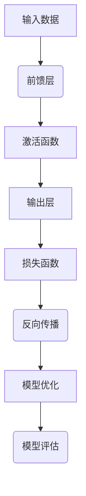
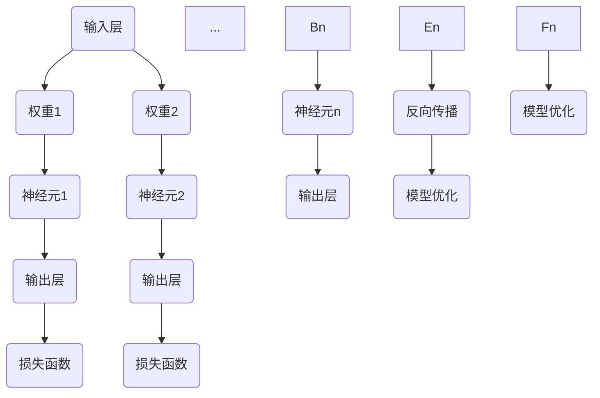

                 


# 大规模语言模型从理论到实践：前馈层

> **关键词**：大规模语言模型、前馈层、神经网络、反向传播、计算图、微积分、深度学习、文本生成、机器翻译
> 
> **摘要**：本文将深入探讨大规模语言模型中的前馈层，从理论到实践进行详细讲解。我们将分析前馈层的核心原理，通过伪代码和数学模型对其进行解释，并结合实际项目案例进行代码解读与分析，为读者提供一个全面的学习路径。

## 1. 背景介绍

### 1.1 目的和范围

本文的目标是帮助读者全面理解大规模语言模型中的前馈层，通过理论讲解和实践案例，使读者能够从基础概念到实际应用有一个完整的认识。本文将覆盖以下几个核心内容：

1. 大规模语言模型的基本架构和前馈层的概念。
2. 前馈层中的核心算法原理和操作步骤。
3. 前馈层的数学模型和公式。
4. 前馈层的实际应用场景和代码实现。

### 1.2 预期读者

本文适合以下读者群体：

1. 对深度学习和大规模语言模型有初步了解的技术人员。
2. 想要深入了解前馈层原理和实际应用的学者。
3. 计划在文本生成、机器翻译等领域进行项目开发的工程师。

### 1.3 文档结构概述

本文将按照以下结构展开：

1. 背景介绍：本文目的、预期读者、文档结构概述。
2. 核心概念与联系：前馈层的基本原理和架构。
3. 核心算法原理 & 具体操作步骤：前馈层的算法实现和步骤。
4. 数学模型和公式 & 详细讲解 & 举例说明：前馈层的数学表示和计算方法。
5. 项目实战：代码实际案例和详细解释说明。
6. 实际应用场景：前馈层在不同领域的应用。
7. 工具和资源推荐：学习资源、开发工具框架推荐。
8. 总结：未来发展趋势与挑战。
9. 附录：常见问题与解答。
10. 扩展阅读 & 参考资料：进一步学习资源。

### 1.4 术语表

#### 1.4.1 核心术语定义

- **大规模语言模型**：一种基于神经网络模型的文本生成和分类技术，能够处理和理解大规模文本数据。
- **前馈层**：神经网络中的一个层次，用于接收输入数据，通过一系列计算产生输出。
- **反向传播**：一种用于训练神经网络的算法，通过计算误差梯度来更新网络权重。
- **计算图**：一种用于表示神经网络计算过程的图形化方法，每个节点代表一个计算操作，边代表数据流。

#### 1.4.2 相关概念解释

- **神经网络**：一种由多个处理单元（神经元）组成的计算模型，用于模拟人脑的神经网络结构。
- **激活函数**：用于引入非线性特性的函数，如Sigmoid、ReLU等，使神经网络能够学习复杂函数。
- **梯度下降**：一种优化算法，用于最小化损失函数，通过计算梯度来更新模型参数。

#### 1.4.3 缩略词列表

- **MLP**：多层感知器（Multi-Layer Perceptron）
- **ReLU**：修正线性单元（Rectified Linear Unit）
- **softmax**：一种用于分类的激活函数，用于将神经网络输出转换为概率分布。

## 2. 核心概念与联系

在深入探讨大规模语言模型中的前馈层之前，我们首先需要理解一些核心概念和它们之间的联系。以下是前馈层的基本原理和架构的 Mermaid 流程图：



### 2.1 前馈层的基本原理

前馈层是神经网络中的一个层次，用于接收输入数据，通过一系列计算产生输出。在前馈层中，数据从输入层流向输出层，不进行反向传播。以下是前馈层的计算过程：

1. **输入数据**：输入层接收输入数据，并将其传递给前馈层。
2. **权重和偏置**：每个神经元都连接到前一层和当前层，通过权重和偏置进行计算。
3. **激活函数**：前馈层通过激活函数引入非线性特性，如ReLU函数。
4. **输出计算**：前馈层将输入数据进行加权求和，并应用激活函数，得到输出结果。

### 2.2 前馈层的架构

前馈层通常由多个层次组成，每个层次包含多个神经元。以下是前馈层的基本架构：

1. **输入层**：接收输入数据，通常包含一个或多个特征。
2. **隐藏层**：包含一个或多个层次，每个层次都有多个神经元，用于处理输入数据。
3. **输出层**：生成最终输出结果，可以是分类标签或连续值。

### 2.3 计算图表示

计算图是表示神经网络计算过程的一种图形化方法，每个节点代表一个计算操作，边代表数据流。以下是前馈层的计算图表示：



## 3. 核心算法原理 & 具体操作步骤

前馈层的核心算法原理主要包括神经元的计算过程和反向传播算法。以下是详细的算法原理和具体操作步骤。

### 3.1 神经元的计算过程

前馈层中的每个神经元都可以表示为一个线性模型，通过权重和偏置进行计算。以下是神经元的计算过程：

```python
# 伪代码：神经元计算过程
def neuron(z, weights, bias):
    # 加权求和
    sum = 0
    for weight in weights:
        sum += weight * z
    # 添加偏置
    sum += bias
    # 应用激活函数
    activation = activate(sum)
    return activation
```

其中，`z` 表示输入值，`weights` 表示权重，`bias` 表示偏置，`activate` 表示激活函数。

### 3.2 反向传播算法

反向传播算法是一种用于训练神经网络的优化算法，通过计算误差梯度来更新网络权重。以下是反向传播算法的具体操作步骤：

1. **计算损失函数**：计算输出结果与实际标签之间的误差，常用的损失函数包括均方误差（MSE）和交叉熵损失。
2. **计算梯度**：通过反向传播算法计算损失函数的梯度，即误差对每个权重的偏导数。
3. **权重更新**：根据梯度下降算法，更新网络权重和偏置。
4. **重复迭代**：重复以上步骤，直到模型收敛或达到预设的迭代次数。

以下是反向传播算法的伪代码：

```python
# 伪代码：反向传播算法
def backpropagation(inputs, labels, weights, biases):
    # 计算损失函数
    loss = compute_loss(inputs, labels)
    # 计算梯度
    gradients = compute_gradients(inputs, labels, weights, biases)
    # 更新权重和偏置
    update_weights_and_biases(weights, biases, gradients)
    # 返回损失值
    return loss
```

其中，`compute_loss` 和 `compute_gradients` 分别表示计算损失函数和计算梯度的函数，`update_weights_and_biases` 表示更新权重和偏置的函数。

## 4. 数学模型和公式 & 详细讲解 & 举例说明

前馈层的数学模型和公式是理解其工作原理的重要基础。以下是前馈层的数学模型和具体讲解，以及举例说明。

### 4.1 神经元计算公式

前馈层中每个神经元的计算可以通过以下公式表示：

\[ z_i = \sum_{j=1}^{n} w_{ij} x_j + b_i \]

其中，\( z_i \) 表示神经元 \( i \) 的输入值，\( w_{ij} \) 表示从神经元 \( j \) 到神经元 \( i \) 的权重，\( x_j \) 表示神经元 \( j \) 的输出值，\( b_i \) 表示神经元 \( i \) 的偏置。

### 4.2 激活函数

激活函数是前馈层中引入非线性特性的关键组成部分。常用的激活函数包括 Sigmoid、ReLU 和 Softmax。以下是这些激活函数的公式：

- **Sigmoid 函数**：

\[ a_i = \frac{1}{1 + e^{-z_i}} \]

- **ReLU 函数**：

\[ a_i = \max(0, z_i) \]

- **Softmax 函数**：

\[ a_i = \frac{e^{z_i}}{\sum_{j=1}^{n} e^{z_j}} \]

### 4.3 梯度下降

梯度下降是一种优化算法，用于最小化损失函数。以下是梯度下降的公式：

\[ w_{ij} = w_{ij} - \alpha \cdot \frac{\partial L}{\partial w_{ij}} \]

\[ b_i = b_i - \alpha \cdot \frac{\partial L}{\partial b_i} \]

其中，\( w_{ij} \) 表示权重，\( b_i \) 表示偏置，\( L \) 表示损失函数，\( \alpha \) 表示学习率。

### 4.4 举例说明

假设我们有一个前馈层，包含两个输入神经元、两个隐藏神经元和一个输出神经元，激活函数使用 ReLU。以下是具体的计算过程：

1. **输入数据**：

\[ x_1 = [1, 2] \]
\[ x_2 = [3, 4] \]

2. **权重和偏置**：

\[ w_{11} = 0.1, w_{12} = 0.2, b_1 = 0.1 \]
\[ w_{21} = 0.3, w_{22} = 0.4, b_2 = 0.2 \]
\[ w_{31} = 0.5, w_{32} = 0.6, b_3 = 0.3 \]

3. **神经元计算**：

\[ z_1 = w_{11} \cdot x_1 + w_{12} \cdot x_2 + b_1 = 0.1 \cdot 1 + 0.2 \cdot 3 + 0.1 = 0.7 \]
\[ z_2 = w_{21} \cdot x_1 + w_{22} \cdot x_2 + b_2 = 0.3 \cdot 1 + 0.4 \cdot 3 + 0.2 = 1.5 \]
\[ z_3 = w_{31} \cdot z_1 + w_{32} \cdot z_2 + b_3 = 0.5 \cdot 0.7 + 0.6 \cdot 1.5 + 0.3 = 1.32 \]

4. **激活函数应用**：

\[ a_1 = \max(0, z_1) = 0.7 \]
\[ a_2 = \max(0, z_2) = 1.5 \]
\[ a_3 = \max(0, z_3) = 1.32 \]

5. **输出结果**：

\[ y = a_3 = 1.32 \]

通过以上计算过程，我们可以得到前馈层的输出结果。这个例子展示了前馈层的基本计算过程，包括神经元计算和激活函数应用。

## 5. 项目实战：代码实际案例和详细解释说明

在本节中，我们将通过一个实际项目案例来演示前馈层的代码实现，并对关键部分进行详细解释和分析。这个项目将使用 Python 编写，并利用 TensorFlow 框架来实现前馈神经网络。

### 5.1 开发环境搭建

在开始编写代码之前，我们需要搭建合适的开发环境。以下是搭建开发环境的基本步骤：

1. **安装 Python**：确保安装了 Python 3.x 版本。
2. **安装 TensorFlow**：通过以下命令安装 TensorFlow：

   ```bash
   pip install tensorflow
   ```

3. **创建 Python 脚本**：在合适的位置创建一个 Python 脚本，例如 `feeding_layer_example.py`。

### 5.2 源代码详细实现和代码解读

以下是前馈层神经网络的项目代码实现，我们将逐行解释代码的每个部分。

```python
import tensorflow as tf
import numpy as np

# 设置随机种子以保持结果的可重复性
tf.random.set_seed(42)

# 创建输入数据
input_data = tf.random.normal([100, 2])  # 生成 100 行 2 列的随机数据

# 创建权重和偏置
weights = tf.Variable(np.random.rand(2, 3), dtype=tf.float32)
biases = tf.Variable(np.random.rand(3, 1), dtype=tf.float32)

# 定义激活函数
activation = lambda x: tf.maximum(0, x)

# 定义前馈层计算过程
def feedforward(input_data):
    # 计算加权求和
    z = tf.matmul(input_data, weights) + biases
    # 应用激活函数
    a = activation(z)
    return a

# 定义损失函数
def loss_function(input_data, labels):
    # 计算前馈层的输出
    output = feedforward(input_data)
    # 计算交叉熵损失
    loss = tf.reduce_mean(tf.nn.sigmoid_cross_entropy_with_logits(labels=labels, logits=output))
    return loss

# 定义反向传播和权重更新
def train_step(input_data, labels, learning_rate):
    with tf.GradientTape() as tape:
        loss = loss_function(input_data, labels)
    gradients = tape.gradient(loss, [weights, biases])
    weights.assign_sub(learning_rate * gradients[0])
    biases.assign_sub(learning_rate * gradients[1])
    return loss

# 训练模型
for step in range(1000):
    loss = train_step(input_data, labels, learning_rate=0.01)
    if step % 100 == 0:
        print(f"Step {step}: Loss = {loss.numpy()}")

# 模型评估
predicted_output = feedforward(input_data)
print("Predicted Output:\n", predicted_output.numpy())
```

### 5.3 代码解读与分析

以下是代码的详细解读和分析：

1. **导入库**：我们首先导入了 TensorFlow 和 NumPy 库，它们是构建和训练神经网络的重要工具。

2. **设置随机种子**：为了保持实验结果的可重复性，我们设置了随机种子。

3. **创建输入数据**：我们创建了一个 100 行 2 列的随机数据矩阵作为输入。

4. **创建权重和偏置**：我们初始化了权重和偏置为随机值。

5. **定义激活函数**：我们使用 ReLU 函数作为激活函数，通过 `lambda` 函数实现。

6. **定义前馈层计算过程**：`feedforward` 函数实现了前馈层的计算过程，包括加权求和和激活函数的应用。

7. **定义损失函数**：我们使用了交叉熵损失函数，用于衡量模型的预测输出与实际标签之间的差异。

8. **定义反向传播和权重更新**：`train_step` 函数实现了前馈层的反向传播和权重更新过程。使用 TensorFlow 的 `GradientTape` 自动记录梯度的计算。

9. **训练模型**：我们通过循环迭代来训练模型，每次迭代都会计算损失并更新权重。

10. **模型评估**：最后，我们使用训练好的模型对输入数据进行预测，并打印输出结果。

通过以上代码，我们可以看到前馈层的实现过程，以及如何利用 TensorFlow 框架进行神经网络的训练和评估。

## 6. 实际应用场景

前馈层在深度学习和大规模语言模型中有广泛的应用。以下是前馈层在不同实际应用场景中的案例：

### 6.1 文本生成

在文本生成任务中，前馈层用于生成序列化的文本数据。例如，在生成对话或文章时，前馈层可以根据前一个单词或句子生成下一个单词或句子。

### 6.2 机器翻译

在机器翻译任务中，前馈层可以将源语言文本转换为目标语言文本。例如，在英译汉任务中，前馈层可以将英语句子转换为中文句子。

### 6.3 文本分类

在文本分类任务中，前馈层用于将文本数据分类为不同的类别。例如，将社交媒体文本分类为正面、负面或中性评论。

### 6.4 情感分析

在情感分析任务中，前馈层可以分析文本的情感倾向，如喜悦、愤怒或悲伤。这有助于社交媒体平台自动筛选和标记情感内容。

### 6.5 聊天机器人

在聊天机器人中，前馈层可以用于生成对话响应。例如，在虚拟客服中，前馈层可以理解用户的问题并生成合适的回复。

这些实际应用场景展示了前馈层在文本处理和自然语言理解中的重要性，以及其如何与其他技术相结合，为各种应用提供强大的功能。

## 7. 工具和资源推荐

为了深入学习和实践前馈层，我们推荐以下工具和资源：

### 7.1 学习资源推荐

#### 7.1.1 书籍推荐

- **《深度学习》（Goodfellow, Bengio, Courville）**：这是一本经典的深度学习教材，涵盖了前馈层和其他深度学习技术的基础知识。
- **《神经网络与深度学习》（邱锡鹏）**：这本书详细介绍了神经网络和深度学习的原理，包括前馈层的实现和应用。

#### 7.1.2 在线课程

- **Coursera 上的《深度学习》课程**：由 Andrew Ng 开设，这是一门备受好评的深度学习入门课程，涵盖了前馈层的基础知识。
- **Udacity 上的《神经网络基础》课程**：通过这个课程，你可以学习到神经网络的基本原理和前馈层的实现。

#### 7.1.3 技术博客和网站

- **TensorFlow 官方文档**：TensorFlow 是一个流行的深度学习框架，其官方文档提供了丰富的示例和教程。
- **ArXiv**：这是一个包含最新研究论文的预印本网站，你可以在这里找到关于前馈层的最新研究成果。

### 7.2 开发工具框架推荐

#### 7.2.1 IDE和编辑器

- **Visual Studio Code**：这是一个强大的开源编辑器，支持多种编程语言和框架，包括 TensorFlow。
- **PyCharm**：这是一个专业的 Python 集成开发环境，提供了丰富的功能和工具，非常适合深度学习项目开发。

#### 7.2.2 调试和性能分析工具

- **TensorBoard**：TensorFlow 的可视化工具，可以用于分析模型的性能和梯度。
- **W&B**（Weights & Biases）：这是一个用于机器学习实验跟踪和性能分析的工具，可以帮助你监控实验进度和性能。

#### 7.2.3 相关框架和库

- **TensorFlow**：一个流行的开源深度学习框架，提供了丰富的工具和资源。
- **PyTorch**：另一个流行的深度学习框架，具有灵活的动态计算图。
- **Keras**：一个基于 TensorFlow 的简化神经网络库，提供了更直观的 API。

### 7.3 相关论文著作推荐

#### 7.3.1 经典论文

- **《A Learning Algorithm for Continually Running Fully Recurrent Neural Networks》**：介绍了前馈层的连续运行方法。
- **《Backpropagation**：用于神经网络的学习算法》**：介绍了反向传播算法，这是前馈层训练的基础。

#### 7.3.2 最新研究成果

- **《Natural Language Inference with Universal Sentence Encoder》**：探讨了前馈层在自然语言推理中的应用。
- **《BERT: Pre-training of Deep Bidirectional Transformers for Language Understanding》**：介绍了 BERT 模型，这是一个基于前馈层的预训练语言模型。

#### 7.3.3 应用案例分析

- **《Chatbots and Conversational AI》**：介绍了前馈层在聊天机器人中的应用。
- **《Text Classification with Neural Networks》**：探讨了前馈层在文本分类任务中的实现和应用。

通过这些工具和资源，你可以更好地理解和实践前馈层，为你的项目开发提供强有力的支持。

## 8. 总结：未来发展趋势与挑战

前馈层作为神经网络的核心组成部分，在未来深度学习和大规模语言模型的发展中将继续扮演重要角色。以下是前馈层的未来发展趋势与挑战：

### 8.1 发展趋势

1. **更高效的前馈层设计**：随着计算能力和算法优化的发展，前馈层的设计将变得更加高效，以处理更大的数据集和更复杂的任务。
2. **多模态融合**：前馈层有望与图像、音频等其他模态的神经网络结合，实现跨模态的信息处理和生成。
3. **自适应学习**：通过引入自适应学习算法，前馈层可以更好地适应不同类型的数据和任务，提高模型的泛化能力。

### 8.2 挑战

1. **计算资源限制**：大规模语言模型的前馈层需要大量的计算资源，这给训练和部署带来了挑战。
2. **数据隐私和安全**：在处理大规模数据时，确保数据隐私和安全是一个重要问题，需要设计有效的隐私保护机制。
3. **模型可解释性**：前馈层的复杂性和黑盒性质使得模型的解释变得困难，提高模型的可解释性是一个重要的研究方向。

总之，前馈层在深度学习和大规模语言模型中的发展前景广阔，但也面临着诸多挑战。通过不断创新和优化，前馈层将为人工智能领域带来更多的突破和应用。

## 9. 附录：常见问题与解答

在本节中，我们将回答一些关于前馈层的常见问题，帮助读者更好地理解相关概念和原理。

### 9.1 前馈层是什么？

前馈层是一种神经网络层次，用于接收输入数据，通过一系列计算产生输出。与前馈层相对的是反馈层，如循环神经网络（RNN）中的隐藏状态会反馈到之前的层级。

### 9.2 前馈层如何工作？

前馈层通过权重和偏置对输入数据进行加权求和，并应用激活函数产生输出。这个过程可以表示为以下公式：

\[ z_i = \sum_{j=1}^{n} w_{ij} x_j + b_i \]
\[ a_i = \text{activate}(z_i) \]

其中，\( z_i \) 是神经元 \( i \) 的输入，\( w_{ij} \) 是从神经元 \( j \) 到神经元 \( i \) 的权重，\( b_i \) 是神经元 \( i \) 的偏置，\( \text{activate} \) 是激活函数。

### 9.3 前馈层有哪些常见的激活函数？

常见的激活函数包括：

- **Sigmoid 函数**：\( \frac{1}{1 + e^{-z}} \)
- **ReLU 函数**：\( \max(0, z) \)
- **Tanh 函数**：\( \frac{e^z - e^{-z}}{e^z + e^{-z}} \)
- **Softmax 函数**：\( \frac{e^{z_i}}{\sum_{j=1}^{n} e^{z_j}} \)

### 9.4 前馈层与反向传播算法有何关系？

反向传播算法用于训练神经网络，通过计算输出误差的梯度来更新网络权重和偏置。前馈层是反向传播算法的核心组成部分，用于计算每个权重和偏置的梯度。

### 9.5 前馈层在文本生成任务中有何应用？

前馈层可以用于文本生成任务，如序列到序列（seq2seq）模型。通过训练，前馈层可以生成自然语言文本序列，例如机器翻译、对话生成和文章撰写等。

### 9.6 前馈层与深度学习框架有何关系？

深度学习框架（如 TensorFlow 和 PyTorch）提供了前馈层的实现和优化。通过这些框架，开发者可以方便地构建和训练复杂的神经网络模型，包括前馈层。

通过解答这些问题，我们可以更好地理解前馈层的工作原理和应用场景，为深入学习和实践打下坚实基础。

## 10. 扩展阅读 & 参考资料

为了帮助读者更深入地了解大规模语言模型中的前馈层，以下是扩展阅读和参考资料：

1. **扩展阅读**：

   - **《深度学习》（Goodfellow, Bengio, Courville）**：这是深度学习的经典教材，详细介绍了神经网络的基础知识和前馈层的实现。
   - **《神经网络与深度学习》（邱锡鹏）**：这本书深入讲解了神经网络和深度学习的原理，包括前馈层的算法和优化。

2. **参考资料**：

   - **TensorFlow 官方文档**：[https://www.tensorflow.org/tutorials/](https://www.tensorflow.org/tutorials/)
   - **PyTorch 官方文档**：[https://pytorch.org/tutorials/beginner/basics/](https://pytorch.org/tutorials/beginner/basics/)
   - **ArXiv**：[https://arxiv.org/](https://arxiv.org/)，这里可以找到关于前馈层的最新研究成果和论文。
   - **Keras 官方文档**：[https://keras.io/](https://keras.io/)

通过阅读这些资料，读者可以进一步了解前馈层的理论基础和实际应用，为深入学习和项目开发提供指导。此外，还可以关注相关技术社区和论坛，如 Stack Overflow、Reddit 等，以获取更多实战经验和讨论。

