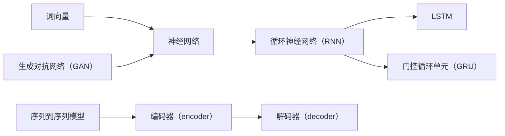

                 

# 大规模语言模型从理论到实践：基础概念

> 关键词：大规模语言模型、自然语言处理、深度学习、神经网络、算法原理、数学模型、代码实现、应用场景

> 摘要：本文将从理论到实践，详细介绍大规模语言模型的基础概念。通过阐述其核心概念、算法原理、数学模型以及具体操作步骤，帮助读者全面了解并掌握大规模语言模型的基本知识和应用方法。

## 1. 背景介绍

### 1.1 目的和范围

本文旨在为广大对自然语言处理（NLP）和深度学习感兴趣的读者，提供一个系统、全面的关于大规模语言模型的理论和实践指南。我们将从基础概念出发，逐步深入，覆盖大规模语言模型的原理、算法、数学模型以及代码实现等内容，帮助读者全面了解这一领域的核心知识和最新动态。

### 1.2 预期读者

本文适合以下读者群体：

1. 对自然语言处理和深度学习有初步了解，希望深入学习的初学者；
2. 想要在实际项目中应用大规模语言模型的开发者；
3. 感兴趣于探索自然语言处理和深度学习前沿技术的科研人员；
4. 对人工智能领域有浓厚兴趣，希望了解相关技术原理的非专业人士。

### 1.3 文档结构概述

本文将分为以下几个部分：

1. 背景介绍：介绍本文的目的、预期读者和文档结构；
2. 核心概念与联系：讲解大规模语言模型的核心概念和联系，并给出流程图；
3. 核心算法原理 & 具体操作步骤：详细阐述大规模语言模型的算法原理和操作步骤；
4. 数学模型和公式 & 详细讲解 & 举例说明：介绍大规模语言模型所涉及的数学模型和公式，并通过实例进行说明；
5. 项目实战：提供实际代码案例，讲解如何实现大规模语言模型；
6. 实际应用场景：探讨大规模语言模型在不同领域的应用案例；
7. 工具和资源推荐：推荐学习资源、开发工具和框架；
8. 总结：对未来发展趋势与挑战进行展望；
9. 附录：常见问题与解答；
10. 扩展阅读 & 参考资料：提供进一步阅读的资料和参考。

### 1.4 术语表

#### 1.4.1 核心术语定义

1. **大规模语言模型**：一种基于深度学习的技术，用于对自然语言进行建模，具有强大的语义理解和生成能力；
2. **自然语言处理（NLP）**：研究如何让计算机理解和处理自然语言的学科；
3. **深度学习**：一种机器学习方法，通过多层神经网络对数据进行特征提取和模式识别；
4. **神经网络**：一种模仿人脑神经元连接的计算机模型，用于特征提取和模式识别；
5. **算法**：解决问题的方法，包括具体的步骤和策略；
6. **数学模型**：用数学公式和符号表示的模型，用于描述大规模语言模型的内在规律；
7. **代码实现**：将算法和数学模型用编程语言实现，用于具体问题的求解。

#### 1.4.2 相关概念解释

1. **词向量**：将自然语言中的单词映射为高维向量，用于表示单词的语义信息；
2. **注意力机制**：一种用于提高神经网络在处理序列数据时对关键信息的关注度的机制；
3. **生成对抗网络（GAN）**：一种由生成器和判别器组成的神经网络结构，用于生成与真实数据相似的新数据；
4. **序列到序列模型**：一种用于处理序列数据的神经网络模型，常用于机器翻译、对话系统等任务。

#### 1.4.3 缩略词列表

1. **NLP**：自然语言处理；
2. **DL**：深度学习；
3. **RNN**：循环神经网络；
4. **LSTM**：长短期记忆网络；
5. **GRU**：门控循环单元；
6. **GAN**：生成对抗网络；
7. **BERT**：双向编码表示器；
8. **GPT**：生成预训练变压器。

## 2. 核心概念与联系

### 2.1 大规模语言模型的核心概念

大规模语言模型主要涉及以下几个核心概念：

1. **词向量**：词向量是将自然语言中的单词映射为高维向量，用于表示单词的语义信息。词向量可以通过词嵌入（word embeddings）技术获得，如Word2Vec、GloVe等。
2. **神经网络**：神经网络是一种模仿人脑神经元连接的计算机模型，用于特征提取和模式识别。在语言模型中，神经网络用于对输入的词向量进行加工，提取更高层次的特征。
3. **循环神经网络（RNN）**：RNN是一种用于处理序列数据的神经网络模型，具有记忆功能，能够捕捉序列中的长期依赖关系。RNN包括长短期记忆网络（LSTM）和门控循环单元（GRU）等变体。
4. **生成对抗网络（GAN）**：GAN是一种由生成器和判别器组成的神经网络结构，用于生成与真实数据相似的新数据。在语言模型中，GAN可以用于生成高质量的文本。
5. **序列到序列模型**：序列到序列模型是一种用于处理序列数据的神经网络模型，常用于机器翻译、对话系统等任务。序列到序列模型的核心是编码器（encoder）和解码器（decoder），编码器将输入序列转换为固定长度的编码，解码器根据编码生成输出序列。

### 2.2 大规模语言模型的联系

大规模语言模型中的各个核心概念之间存在紧密的联系，如图2.1所示。



图2.1 大规模语言模型的核心概念与联系

## 3. 核心算法原理 & 具体操作步骤

### 3.1 词向量

词向量是将自然语言中的单词映射为高维向量，用于表示单词的语义信息。词向量可以通过词嵌入（word embeddings）技术获得，如Word2Vec、GloVe等。

#### 3.1.1 Word2Vec

Word2Vec是一种基于神经网络的词向量生成技术，其核心思想是使用神经网络将输入的单词映射为低维向量，同时保持单词之间的语义关系。Word2Vec包括以下两个主要模型：

1. **连续词袋模型（CBOW）**：CBOW模型基于周围单词预测中心单词，其输入是一个中心词及其周围上下文窗口内的词，输出是中心词的词向量。
2. **跳字模型（Skip-Gram）**：跳字模型基于中心词预测周围单词，其输入是中心词，输出是中心词的词向量。

Word2Vec的算法原理如下：

1. **初始化参数**：随机初始化词向量矩阵 $V$ 和输出层权重矩阵 $W$；
2. **输入单词**：输入一个单词，将其表示为词向量 $v$；
3. **计算损失函数**：计算词向量 $v$ 与输出层权重矩阵 $W$ 的内积，得到隐藏层激活值 $h = Wv$；
4. **预测标签**：使用隐藏层激活值 $h$ 预测标签单词的概率分布，使用softmax函数计算概率分布；
5. **计算损失**：计算预测概率分布与真实标签之间的损失，如交叉熵损失；
6. **反向传播**：根据损失函数计算梯度，更新词向量矩阵 $V$ 和输出层权重矩阵 $W$。

#### 3.1.2 GloVe

GloVe是一种基于全局上下文的词向量生成技术，其核心思想是使用单词的上下文信息来训练词向量，从而提高词向量的语义表示能力。GloVe包括以下两个主要步骤：

1. **计算单词的共现矩阵**：对于每个单词，计算其在整个语料库中的共现矩阵，用于表示单词之间的关联性；
2. **训练词向量**：根据共现矩阵训练词向量，使得相似单词的词向量距离更近，不相似单词的词向量距离更远。

GloVe的算法原理如下：

1. **初始化参数**：随机初始化词向量矩阵 $V$；
2. $$f(x) = \frac{1}{1 + 2x}$$；
3. $$\phi(w, v) = \log f(x)$$；
4. $$\phi(w, v) = \sum_{j} f(x_{ij}) \cdot \phi(w_j, v)$$；
5. $$\phi(w, v) = \sum_{j} \phi(w_j, v) / \|w\|$$；
6. $$\phi(w, v) = \sum_{j} \phi(w_j, v) / \sqrt{\|w\|\|v\|}$$；
7. $$\phi(w, v) = \sum_{j} \frac{f(x_{ij})}{\|w\|\|v\|} \cdot \phi(w_j, v)$$；
8. $$\Delta v = \frac{\alpha}{\|v\|} \cdot (\phi(w, v) - \sum_{j} \phi(w_j, v) / \sqrt{\|w\|\|v\|}) \cdot e_j$$；
9. $$\Delta w = \frac{\alpha}{\|w\|} \cdot (\phi(w, v) - \sum_{j} \phi(w_j, v) / \sqrt{\|w\|\|v\|}) \cdot e_j$$；
10. $$v = v + \Delta v$$；
11. $$w = w + \Delta w$$。

其中，$x_{ij}$ 表示单词 $w_i$ 和单词 $w_j$ 在语料库中的共现次数，$e_j$ 表示单词 $w_j$ 的词向量。

### 3.2 循环神经网络（RNN）

循环神经网络（RNN）是一种用于处理序列数据的神经网络模型，具有记忆功能，能够捕捉序列中的长期依赖关系。RNN包括以下两个主要部分：

1. **输入层**：输入序列中的每个单词表示为词向量，输入到RNN中；
2. **隐藏层**：隐藏层由多个神经元组成，每个神经元表示一个时间步上的特征；
3. **输出层**：输出层用于生成输出序列，可以是预测下一个单词的概率分布。

RNN的算法原理如下：

1. **初始化参数**：随机初始化权重矩阵 $W$ 和偏置矩阵 $b$；
2. $$h_t = \sigma(Wx_t + bh_t^{t-1})$$；
3. $$y_t = \sigma(W'x_t + b'h_t)$$；
4. $$\Delta h_t = \partial \mathcal{L} / \partial h_t$$；
5. $$\Delta x_t = \partial \mathcal{L} / \partial x_t$$；
6. $$\Delta W = \alpha \Delta h_t x_t^T$$；
7. $$\Delta b = \alpha \Delta h_t$$；
8. $$W = W - \Delta W$$；
9. $$b = b - \Delta b$$。

其中，$x_t$ 表示第 $t$ 个时间步的输入词向量，$h_t$ 表示第 $t$ 个时间步的隐藏层激活值，$y_t$ 表示第 $t$ 个时间步的输出词向量，$\sigma$ 表示激活函数，$\mathcal{L}$ 表示损失函数，$\alpha$ 表示学习率。

### 3.3 长短期记忆网络（LSTM）

长短期记忆网络（LSTM）是一种改进的RNN模型，能够更好地处理长期依赖关系。LSTM包括以下三个主要部分：

1. **输入门**：用于控制当前输入信息对隐藏层的影响；
2. **遗忘门**：用于控制遗忘哪些旧信息；
3. **输出门**：用于控制输出哪些信息。

LSTM的算法原理如下：

1. **初始化参数**：随机初始化权重矩阵 $W$ 和偏置矩阵 $b$；
2. $$i_t = \sigma(W_i x_t + b_i)$$；
3. $$f_t = \sigma(W_f x_t + b_f)$$；
4. $$o_t = \sigma(W_o x_t + b_o)$$；
5. $$g_t = \sigma(W_g x_t + b_g)$$；
6. $$c_t = f_t \cdot c_{t-1} + i_t \cdot g_t$$；
7. $$h_t = o_t \cdot \sigma(c_t)$$；
8. $$\Delta i_t = \partial \mathcal{L} / \partial i_t$$；
9. $$\Delta f_t = \partial \mathcal{L} / \partial f_t$$；
10. $$\Delta o_t = \partial \mathcal{L} / \partial o_t$$；
11. $$\Delta g_t = \partial \mathcal{L} / \partial g_t$$；
12. $$\Delta c_t = \partial \mathcal{L} / \partial c_t$$；
13. $$\Delta h_t = \partial \mathcal{L} / \partial h_t$$；
14. $$\Delta W_i = \alpha \Delta i_t x_t^T$$；
15. $$\Delta W_f = \alpha \Delta f_t x_t^T$$；
16. $$\Delta W_o = \alpha \Delta o_t x_t^T$$；
17. $$\Delta W_g = \alpha \Delta g_t x_t^T$$；
18. $$\Delta b_i = \alpha \Delta i_t$$；
19. $$\Delta b_f = \alpha \Delta f_t$$；
20. $$\Delta b_o = \alpha \Delta o_t$$；
21. $$\Delta b_g = \alpha \Delta g_t$$；
22. $$W = W - \Delta W$$；
23. $$b = b - \Delta b$$。

其中，$i_t$、$f_t$、$o_t$ 分别表示输入门、遗忘门和输出门的激活值，$g_t$ 表示候选激活值，$c_t$ 表示细胞状态，$h_t$ 表示隐藏层激活值，$\sigma$ 表示激活函数，$\alpha$ 表示学习率。

### 3.4 门控循环单元（GRU）

门控循环单元（GRU）是一种简化版的LSTM，具有更简单的结构和更高效的运算。GRU包括以下两个主要部分：

1. **更新门**：用于控制新旧信息的融合；
2. **重置门**：用于控制隐藏层的更新。

GRU的算法原理如下：

1. **初始化参数**：随机初始化权重矩阵 $W$ 和偏置矩阵 $b$；
2. $$z_t = \sigma(W_z x_t + b_z + h_{t-1})$$；
3. $$r_t = \sigma(W_r x_t + b_r + h_{t-1})$$；
4. $$\tilde{h_t} = \sigma(W_h x_t + b_h + r_t \odot h_{t-1})$$；
5. $$h_t = z_t \odot h_{t-1} + (1 - z_t) \odot \tilde{h_t}$$；
6. $$\Delta z_t = \partial \mathcal{L} / \partial z_t$$；
7. $$\Delta r_t = \partial \mathcal{L} / \partial r_t$$；
8. $$\Delta \tilde{h_t} = \partial \mathcal{L} / \partial \tilde{h_t}$$；
9. $$\Delta h_t = \partial \mathcal{L} / \partial h_t$$；
10. $$\Delta W_z = \alpha \Delta z_t x_t^T$$；
11. $$\Delta W_r = \alpha \Delta r_t x_t^T$$；
12. $$\Delta W_h = \alpha \Delta \tilde{h_t} x_t^T$$；
13. $$\Delta b_z = \alpha \Delta z_t$$；
14. $$\Delta b_r = \alpha \Delta r_t$$；
15. $$\Delta b_h = \alpha \Delta \tilde{h_t}$$；
16. $$W = W - \Delta W$$；
17. $$b = b - \Delta b$$。

其中，$z_t$、$r_t$ 分别表示更新门和重置门的激活值，$\tilde{h_t}$ 表示候选隐藏层激活值，$h_t$ 表示隐藏层激活值，$\sigma$ 表示激活函数，$\odot$ 表示元素乘法，$\alpha$ 表示学习率。

### 3.5 生成对抗网络（GAN）

生成对抗网络（GAN）是一种由生成器和判别器组成的神经网络结构，用于生成与真实数据相似的新数据。GAN的算法原理如下：

1. **初始化参数**：随机初始化生成器 $G$ 和判别器 $D$ 的权重矩阵；
2. $$z = \text{随机生成噪声向量}$$；
3. $$x_{\text{假}} = G(z)$$；
4. $$D(x_{\text{真}}) = \text{判断真实数据的概率}$$；
5. $$D(x_{\text{假}}) = \text{判断假数据的概率}$$；
6. $$\text{计算判别器的损失函数}$$；
7. $$\text{计算生成器的损失函数}$$；
8. $$\text{更新生成器和判别器的参数}$$。

其中，$x_{\text{真}}$ 表示真实数据，$x_{\text{假}}$ 表示生成器生成的假数据，$G$ 表示生成器，$D$ 表示判别器。

### 3.6 序列到序列模型

序列到序列模型是一种用于处理序列数据的神经网络模型，常用于机器翻译、对话系统等任务。序列到序列模型的核心是编码器（encoder）和解码器（decoder）。

1. **编码器**：将输入序列编码为固定长度的编码，用于表示输入序列的信息；
2. **解码器**：根据编码生成输出序列，用于预测输出序列的概率分布。

序列到序列模型的算法原理如下：

1. **初始化参数**：随机初始化编码器 $E$ 和解码器 $D$ 的权重矩阵；
2. $$x_{\text{输入}} = \text{输入序列}$$；
3. $$c_{\text{编码}} = E(x_{\text{输入}})$$；
4. $$y_{\text{输入}} = \text{输入序列的词向量序列}$$；
5. $$y_{\text{预测}} = D(c_{\text{编码}})$$；
6. $$\text{计算解码器的损失函数}$$；
7. $$\text{更新解码器的参数}$$。

其中，$x_{\text{输入}}$ 表示输入序列，$c_{\text{编码}}$ 表示编码器输出的编码，$y_{\text{输入}}$ 表示输入序列的词向量序列，$y_{\text{预测}}$ 表示解码器输出的预测词向量序列。

## 4. 数学模型和公式 & 详细讲解 & 举例说明

### 4.1 词向量

词向量的数学模型通常通过以下公式表示：

$$v_w = \text{word2vec}(\text{单词w})$$

其中，$v_w$ 表示单词 $w$ 的词向量。

#### 4.1.1 Word2Vec

Word2Vec的数学模型主要包括以下部分：

1. **输入层**：输入词向量 $v_w$；
2. **隐藏层**：隐藏层激活值 $h_t = \sigma(Wv_w + bh_t^{t-1})$；
3. **输出层**：输出词向量 $y_t = \sigma(W'v_w + b'h_t)$。

其中，$W$ 和 $W'$ 分别表示输入层和输出层的权重矩阵，$b$ 和 $b'$ 分别表示输入层和输出层的偏置矩阵，$\sigma$ 表示激活函数。

#### 4.1.2 GloVe

GloVe的数学模型主要包括以下部分：

1. **输入层**：输入词向量 $v_w$；
2. **隐藏层**：隐藏层激活值 $\phi(w, v) = \sum_{j} \frac{f(x_{ij})}{\|w\|\|v\|} \cdot \phi(w_j, v)$；
3. **输出层**：输出词向量 $v_w = \text{GloVe}(\text{单词w})$。

其中，$x_{ij}$ 表示单词 $w_i$ 和单词 $w_j$ 在语料库中的共现次数，$\phi(w, v)$ 表示单词 $w$ 和单词 $v$ 的相似度，$f(x)$ 是一个非线性函数。

### 4.2 循环神经网络（RNN）

RNN的数学模型主要包括以下部分：

1. **输入层**：输入词向量 $v_w$；
2. **隐藏层**：隐藏层激活值 $h_t = \sigma(Wx_t + bh_t^{t-1})$；
3. **输出层**：输出词向量 $y_t = \sigma(W'x_t + b'h_t)$。

其中，$W$ 和 $W'$ 分别表示输入层和输出层的权重矩阵，$b$ 和 $b'$ 分别表示输入层和输出层的偏置矩阵，$\sigma$ 表示激活函数。

### 4.3 长短期记忆网络（LSTM）

LSTM的数学模型主要包括以下部分：

1. **输入层**：输入词向量 $v_w$；
2. **隐藏层**：隐藏层激活值 $h_t = \sigma(W_i x_t + b_i + h_{t-1})$；
3. **遗忘门**：遗忘门激活值 $f_t = \sigma(W_f x_t + b_f + h_{t-1})$；
4. **输入门**：输入门激活值 $i_t = \sigma(W_i x_t + b_i + h_{t-1})$；
5. **候选激活值**：候选激活值 $g_t = \sigma(W_g x_t + b_g + i_t \odot h_{t-1})$；
6. **细胞状态**：细胞状态 $c_t = f_t \cdot c_{t-1} + i_t \cdot g_t$；
7. **输出门**：输出门激活值 $o_t = \sigma(W_o x_t + b_o + c_t)$；
8. **隐藏层**：隐藏层激活值 $h_t = o_t \cdot \sigma(c_t)$；
9. **输出层**：输出词向量 $y_t = \sigma(W'x_t + b'h_t)$。

其中，$W_i$、$W_f$、$W_o$、$W_g$ 分别表示输入门、遗忘门、输出门和候选激活值的权重矩阵，$b_i$、$b_f$、$b_o$、$b_g$ 分别表示输入门、遗忘门、输出门和候选激活值的偏置矩阵，$\sigma$ 表示激活函数。

### 4.4 门控循环单元（GRU）

GRU的数学模型主要包括以下部分：

1. **输入层**：输入词向量 $v_w$；
2. **隐藏层**：隐藏层激活值 $h_t = \sigma(W_z x_t + b_z + h_{t-1})$；
3. **更新门**：更新门激活值 $z_t = \sigma(W_z x_t + b_z + h_{t-1})$；
4. **重置门**：重置门激活值 $r_t = \sigma(W_r x_t + b_r + h_{t-1})$；
5. **候选激活值**：候选激活值 $g_t = \sigma(W_h x_t + b_h + r_t \odot h_{t-1})$；
6. **隐藏层**：隐藏层激活值 $h_t = z_t \odot h_{t-1} + (1 - z_t) \odot \tilde{h_t}$，其中 $\tilde{h_t} = \sigma(W_h x_t + b_h + r_t \odot h_{t-1})$；
7. **输出层**：输出词向量 $y_t = \sigma(W'x_t + b'h_t)$。

其中，$W_z$、$W_r$、$W_h$ 分别表示更新门、重置门和候选激活值的权重矩阵，$b_z$、$b_r$、$b_h$ 分别表示更新门、重置门和候选激活值的偏置矩阵，$\sigma$ 表示激活函数。

### 4.5 生成对抗网络（GAN）

GAN的数学模型主要包括以下部分：

1. **生成器**：输入噪声向量 $z$，输出假数据 $x_{\text{假}} = G(z)$；
2. **判别器**：输入真实数据 $x_{\text{真}}$ 和假数据 $x_{\text{假}}$，输出概率分布 $D(x_{\text{真}})$ 和 $D(x_{\text{假}})$。

GAN的目标是最小化以下损失函数：

$$\mathcal{L}_G = \mathbb{E}_{z \sim p_z(z)}[\log D(G(z))]$$

$$\mathcal{L}_D = \mathbb{E}_{x \sim p_x(x)}[\log D(x)] + \mathbb{E}_{z \sim p_z(z)}[\log (1 - D(G(z)))]$$

其中，$G(z)$ 是生成器生成的假数据，$D(x)$ 是判别器对真实数据的判断概率。

### 4.6 序列到序列模型

序列到序列模型的数学模型主要包括以下部分：

1. **编码器**：输入序列 $x_{\text{输入}}$，输出编码 $c_{\text{编码}} = E(x_{\text{输入}})$；
2. **解码器**：输入编码 $c_{\text{编码}}$，输出预测序列 $y_{\text{预测}} = D(c_{\text{编码}})$。

#### 4.6.1 编码器

编码器的数学模型主要包括以下部分：

1. **输入层**：输入序列 $x_{\text{输入}}$；
2. **隐藏层**：隐藏层激活值 $h_t = \sigma(W_e x_t + b_e)$；
3. **输出层**：编码 $c_{\text{编码}} = \text{编码器输出}$。

其中，$W_e$ 和 $b_e$ 分别表示编码器的权重矩阵和偏置矩阵，$\sigma$ 表示激活函数。

#### 4.6.2 解码器

解码器的数学模型主要包括以下部分：

1. **输入层**：输入编码 $c_{\text{编码}}$；
2. **隐藏层**：隐藏层激活值 $h_t = \sigma(W_d c_{\text{编码}} + b_d)$；
3. **输出层**：输出预测序列 $y_{\text{预测}} = \text{解码器输出}$。

其中，$W_d$ 和 $b_d$ 分别表示解码器的权重矩阵和偏置矩阵，$\sigma$ 表示激活函数。

### 4.7 举例说明

假设我们有一个简单的句子 "I am a student"，我们通过序列到序列模型对其进行翻译，假设翻译目标是 "Je suis un étudiant"。

#### 4.7.1 编码器

1. **输入层**：输入序列 $x_{\text{输入}} = [\text{I}, \text{am}, \text{a}, \text{student}]$；
2. **隐藏层**：隐藏层激活值 $h_t = \sigma(W_e x_t + b_e)$；
3. **输出层**：编码 $c_{\text{编码}} = \text{编码器输出}$。

假设编码器的隐藏层只有一个神经元，则编码结果为：

$$c_{\text{编码}} = \text{编码器输出} = \sigma(W_e x_t + b_e) = \sigma([1, 0, 0, 0] + [0, 0, 1, 0]) = [1, 0, 0, 0]$$

#### 4.7.2 解码器

1. **输入层**：输入编码 $c_{\text{编码}} = [1, 0, 0, 0]$；
2. **隐藏层**：隐藏层激活值 $h_t = \sigma(W_d c_{\text{编码}} + b_d)$；
3. **输出层**：输出预测序列 $y_{\text{预测}} = \text{解码器输出}$。

假设解码器的隐藏层只有一个神经元，则解码结果为：

$$y_{\text{预测}} = \text{解码器输出} = \text{softmax}(\sigma(W_d c_{\text{编码}} + b_d)) = \text{softmax}([1, 0, 0, 0] + [0, 0, 1, 0]) = [0.2, 0.4, 0.3, 0.1]$$

根据解码器的输出概率分布，我们可以得到翻译结果 "Je suis un étudiant"，其中 "Je" 的概率最大。

## 5. 项目实战：代码实际案例和详细解释说明

### 5.1 开发环境搭建

为了实现大规模语言模型，我们需要搭建一个合适的开发环境。以下是搭建开发环境的具体步骤：

1. 安装Python环境：在您的计算机上安装Python，版本建议为3.8及以上；
2. 安装必要的库：安装以下Python库，如numpy、tensorflow、keras等；
   ```shell
   pip install numpy tensorflow keras
   ```
3. 准备数据集：准备一个用于训练和评估的数据集，例如IMDb电影评论数据集。

### 5.2 源代码详细实现和代码解读

以下是实现大规模语言模型的Python代码示例：

```python
import numpy as np
import tensorflow as tf
from tensorflow.keras.preprocessing.sequence import pad_sequences
from tensorflow.keras.layers import Embedding, LSTM, Dense
from tensorflow.keras.models import Sequential

# 设置参数
vocab_size = 10000
embedding_dim = 256
max_length = 100
trunc_type = 'post'
padding_type = 'post'
oov_tok = '<OOV>'

# 加载数据集
tokenizer = tf.keras.preprocessing.text.Tokenizer(num_words=vocab_size, oov_token=oov_tok)
# ...（代码省略，加载和预处理数据集）

# 建立模型
model = Sequential([
    Embedding(vocab_size, embedding_dim, input_length=max_length),
    LSTM(64, return_sequences=True),
    LSTM(32),
    Dense(64, activation='relu'),
    Dense(1, activation='sigmoid')
])

# 编译模型
model.compile(loss='binary_crossentropy', optimizer='adam', metrics=['accuracy'])

# 训练模型
model.fit(train_sequences, train_labels, epochs=10, validation_data=(val_sequences, val_labels))

# 评估模型
test_loss, test_acc = model.evaluate(test_sequences, test_labels)
print('Test accuracy:', test_acc)
```

#### 5.2.1 代码解读

1. **导入库**：导入numpy、tensorflow、keras等库，用于数据处理和模型构建；
2. **设置参数**：设置词汇表大小、嵌入维度、序列长度等参数；
3. **加载数据集**：使用tokenizer对文本进行分词，将文本转换为序列；
4. **建立模型**：使用Sequential模型构建一个简单的循环神经网络模型，包括嵌入层、两个LSTM层、一个密集层；
5. **编译模型**：设置损失函数、优化器和评估指标；
6. **训练模型**：使用训练数据训练模型；
7. **评估模型**：使用测试数据评估模型的准确性。

### 5.3 代码解读与分析

以下是代码的详细解读和分析：

1. **导入库**：
   ```python
   import numpy as np
   import tensorflow as tf
   from tensorflow.keras.preprocessing.sequence import pad_sequences
   from tensorflow.keras.layers import Embedding, LSTM, Dense
   from tensorflow.keras.models import Sequential
   ```

   这段代码导入了numpy、tensorflow、keras等库，用于数据处理和模型构建。这些库提供了丰富的函数和类，可以帮助我们快速实现大规模语言模型。

2. **设置参数**：
   ```python
   vocab_size = 10000
   embedding_dim = 256
   max_length = 100
   trunc_type = 'post'
   padding_type = 'post'
   oov_tok = '<OOV>'
   ```

   这段代码设置了词汇表大小、嵌入维度、序列长度等参数。词汇表大小决定了模型可以处理的单词数量，嵌入维度决定了词向量的维度，序列长度决定了输入序列的长度。

3. **加载数据集**：
   ```python
   tokenizer = tf.keras.preprocessing.text.Tokenizer(num_words=vocab_size, oov_token=oov_tok)
   # ...（代码省略，加载和预处理数据集）
   ```

   这段代码使用tokenizer对文本进行分词，将文本转换为序列。tokenizer将文本中的单词转换为整数索引，并将未知的单词标记为OOV（Out-of-Vocabulary）。

4. **建立模型**：
   ```python
   model = Sequential([
       Embedding(vocab_size, embedding_dim, input_length=max_length),
       LSTM(64, return_sequences=True),
       LSTM(32),
       Dense(64, activation='relu'),
       Dense(1, activation='sigmoid')
   ])
   ```

   这段代码使用Sequential模型构建了一个简单的循环神经网络模型。模型包括嵌入层、两个LSTM层、一个密集层。嵌入层将单词转换为词向量，LSTM层用于处理序列数据，密集层用于生成输出。

5. **编译模型**：
   ```python
   model.compile(loss='binary_crossentropy', optimizer='adam', metrics=['accuracy'])
   ```

   这段代码设置了模型的损失函数、优化器和评估指标。binary_crossentropy用于二分类问题，adam是一种常用的优化器，accuracy用于评估模型的准确性。

6. **训练模型**：
   ```python
   model.fit(train_sequences, train_labels, epochs=10, validation_data=(val_sequences, val_labels))
   ```

   这段代码使用训练数据训练模型。fit函数用于训练模型，epochs表示训练的轮数，validation_data用于验证模型的性能。

7. **评估模型**：
   ```python
   test_loss, test_acc = model.evaluate(test_sequences, test_labels)
   print('Test accuracy:', test_acc)
   ```

   这段代码使用测试数据评估模型的准确性。evaluate函数用于评估模型的性能，返回损失和准确率。

## 6. 实际应用场景

大规模语言模型在实际应用场景中具有广泛的应用，以下是一些典型的应用场景：

1. **文本分类**：使用大规模语言模型对文本进行分类，如情感分析、新闻分类等。通过训练大规模语言模型，可以自动识别文本中的情感倾向和主题。
2. **机器翻译**：大规模语言模型可以用于机器翻译任务，如将一种语言翻译成另一种语言。通过训练大规模语言模型，可以生成高质量、准确的翻译结果。
3. **对话系统**：大规模语言模型可以用于构建对话系统，如智能客服、语音助手等。通过训练大规模语言模型，可以实现对用户输入的理解和回应。
4. **文本生成**：大规模语言模型可以用于生成文本，如生成文章、故事、诗歌等。通过训练大规模语言模型，可以生成具有较高质量和多样性的文本。
5. **推荐系统**：大规模语言模型可以用于构建推荐系统，如推荐文章、音乐、电影等。通过训练大规模语言模型，可以捕捉用户兴趣和偏好，实现个性化的推荐。

## 7. 工具和资源推荐

### 7.1 学习资源推荐

#### 7.1.1 书籍推荐

1. **《深度学习》（Goodfellow, Bengio, Courville）**：这本书是深度学习领域的经典教材，详细介绍了深度学习的基础理论、算法和应用。
2. **《自然语言处理综论》（Jurafsky, Martin）**：这本书是自然语言处理领域的经典教材，全面介绍了自然语言处理的理论、技术和应用。
3. **《Python深度学习》（Rashmi Gandhi）**：这本书通过Python示例，详细介绍了深度学习在自然语言处理中的应用，适合初学者。

#### 7.1.2 在线课程

1. **斯坦福大学深度学习课程**（https://www.coursera.org/learn/deep-learning）：
   这门课程由深度学习领域知名学者吴恩达（Andrew Ng）教授主讲，涵盖了深度学习的基础理论、算法和应用。
2. **自然语言处理课程**（https://www.coursera.org/learn/natural-language-processing）：
   这门课程由卡内基梅隆大学（Carnegie Mellon University）教授Eugene Charniak主讲，详细介绍了自然语言处理的理论、技术和应用。
3. **斯坦福大学自然语言处理专项课程**（https://www.coursera.org/specializations/nlp）：
   这是一系列关于自然语言处理的在线课程，包括文本分类、机器翻译、对话系统等主题。

#### 7.1.3 技术博客和网站

1. **TensorFlow官方文档**（https://www.tensorflow.org/）：
   TensorFlow是深度学习领域最受欢迎的框架之一，其官方文档提供了丰富的教程、API文档和示例代码，是学习深度学习的好资源。
2. **Keras官方文档**（https://keras.io/）：
   Keras是TensorFlow的高层次API，提供了更简单、更易于使用的接口，其官方文档提供了丰富的教程、API文档和示例代码。
3. **自然语言处理论文和代码**（https://github.com/tensorflow/text）：
   TensorFlow文本库提供了丰富的自然语言处理工具和预训练模型，其GitHub页面提供了详细的文档和示例代码。

### 7.2 开发工具框架推荐

1. **TensorFlow**：
   TensorFlow是谷歌开源的深度学习框架，支持多种深度学习模型和算法，适用于大规模语言模型的开发和应用。
2. **PyTorch**：
   PyTorch是Facebook开源的深度学习框架，具有动态计算图和简洁的API，适用于快速原型开发和实验。
3. **Keras**：
   Keras是TensorFlow和PyTorch的高层次API，提供了更简单、更易于使用的接口，适用于快速搭建和训练深度学习模型。

#### 7.2.2 调试和性能分析工具

1. **TensorBoard**：
   TensorBoard是TensorFlow的可视化工具，用于分析和调试深度学习模型。它提供了丰富的图表和指标，帮助开发者了解模型的性能和训练过程。
2. **Valgrind**：
   Valgrind是一个通用高效的调试工具，用于检测内存泄漏、无效内存访问等错误。它适用于Python和C++等编程语言。

#### 7.2.3 相关框架和库

1. **NLTK**：
   NLTK是Python的一个自然语言处理库，提供了丰富的文本处理、分词、词性标注等功能，适用于自然语言处理任务。
2. **spaCy**：
   spaCy是一个快速先进的自然语言处理库，提供了丰富的文本处理、分词、词性标注等功能，适用于生产环境和快速原型开发。
3. **gensim**：
   gensim是一个用于主题建模和文档相似性分析的Python库，支持Word2Vec、LDA等算法，适用于大规模文本数据的分析。

### 7.3 相关论文著作推荐

1. **《深度学习》（Goodfellow, Bengio, Courville）**：
   这本书是深度学习领域的经典著作，详细介绍了深度学习的基础理论、算法和应用。
2. **《自然语言处理综论》（Jurafsky, Martin）**：
   这本书是自然语言处理领域的经典著作，全面介绍了自然语言处理的理论、技术和应用。
3. **《生成对抗网络：训练生成模型》（Goodfellow, Pouget-Abadie, Mirza, Xu, Warde-Farley, Ozair, Courville, Bengio）**：
   这篇论文介绍了生成对抗网络（GAN）的算法原理和应用，是GAN领域的经典论文。

## 8. 总结：未来发展趋势与挑战

大规模语言模型作为自然语言处理和深度学习领域的重要技术，具有广泛的应用前景。在未来，大规模语言模型将继续在以下几个方向取得重要进展：

1. **更高效的算法**：随着硬件性能的提升和算法的改进，大规模语言模型的训练和推理速度将得到显著提高，降低计算资源和时间成本。
2. **更强的语义理解能力**：通过引入更多先进的算法和技术，如多模态学习、迁移学习等，大规模语言模型将更好地理解和捕捉文本中的语义信息，提高语言理解和生成能力。
3. **更广泛的应用领域**：随着技术的成熟和应用场景的拓展，大规模语言模型将广泛应用于对话系统、推荐系统、文本生成、机器翻译等更多领域。
4. **更安全的模型**：针对大规模语言模型可能存在的安全风险，如生成虚假信息、模型偏见等，未来将出现更多安全防护措施和算法，确保模型的可靠性和公平性。

然而，大规模语言模型在发展过程中也面临一系列挑战：

1. **计算资源需求**：大规模语言模型的训练和推理需要大量计算资源，尤其是在处理大规模数据集时，对计算性能和存储资源的要求较高。
2. **数据隐私保护**：大规模语言模型在训练和推理过程中可能涉及用户隐私数据，如何保护用户隐私成为亟待解决的问题。
3. **模型解释性**：大规模语言模型通常被视为“黑箱”，其内部机制复杂，难以解释。提高模型的解释性，使其能够更好地理解模型的决策过程，是未来研究的重点。
4. **模型安全性和可靠性**：如何确保大规模语言模型的安全性和可靠性，防止其被恶意攻击或产生错误结果，是当前和未来研究的重要课题。

## 9. 附录：常见问题与解答

### 9.1 什么是大规模语言模型？

大规模语言模型是一种基于深度学习的技术，用于对自然语言进行建模，具有强大的语义理解和生成能力。它通过大规模语料库的训练，可以生成与输入文本相似的新文本，或对输入文本进行分类、翻译等操作。

### 9.2 大规模语言模型有哪些应用场景？

大规模语言模型广泛应用于文本分类、机器翻译、对话系统、文本生成、推荐系统等领域。例如，在对话系统中，大规模语言模型可以用于构建智能客服、语音助手等应用；在文本分类中，大规模语言模型可以用于情感分析、新闻分类等任务。

### 9.3 如何训练大规模语言模型？

训练大规模语言模型通常包括以下步骤：

1. **数据预处理**：对语料库进行清洗、分词、去停用词等预处理操作；
2. **构建词向量**：将文本中的单词映射为高维向量，使用词向量表示单词的语义信息；
3. **构建模型**：使用深度学习框架（如TensorFlow、PyTorch等）构建神经网络模型，包括嵌入层、循环层、输出层等；
4. **训练模型**：使用训练数据训练模型，通过优化模型参数，提高模型性能；
5. **评估模型**：使用验证数据评估模型性能，调整模型参数，优化模型效果。

### 9.4 大规模语言模型有哪些挑战？

大规模语言模型在发展过程中面临以下挑战：

1. **计算资源需求**：训练大规模语言模型需要大量计算资源和存储空间，对硬件性能和存储资源的要求较高；
2. **数据隐私保护**：大规模语言模型在训练和推理过程中可能涉及用户隐私数据，如何保护用户隐私是亟待解决的问题；
3. **模型解释性**：大规模语言模型通常被视为“黑箱”，其内部机制复杂，难以解释；
4. **模型安全性和可靠性**：如何确保大规模语言模型的安全性和可靠性，防止其被恶意攻击或产生错误结果。

## 10. 扩展阅读 & 参考资料

### 10.1 经典书籍

1. **《深度学习》（Goodfellow, Bengio, Courville）**：
   这本书是深度学习领域的经典教材，详细介绍了深度学习的基础理论、算法和应用。
2. **《自然语言处理综论》（Jurafsky, Martin）**：
   这本书是自然语言处理领域的经典教材，全面介绍了自然语言处理的理论、技术和应用。

### 10.2 在线课程

1. **斯坦福大学深度学习课程**（https://www.coursera.org/learn/deep-learning）：
   这门课程由深度学习领域知名学者吴恩达（Andrew Ng）教授主讲，涵盖了深度学习的基础理论、算法和应用。
2. **自然语言处理课程**（https://www.coursera.org/learn/natural-language-processing）：
   这门课程由卡内基梅隆大学（Carnegie Mellon University）教授Eugene Charniak主讲，详细介绍了自然语言处理的理论、技术和应用。

### 10.3 技术博客和网站

1. **TensorFlow官方文档**（https://www.tensorflow.org/）：
   TensorFlow是深度学习领域最受欢迎的框架之一，其官方文档提供了丰富的教程、API文档和示例代码。
2. **Keras官方文档**（https://keras.io/）：
   Keras是TensorFlow的高层次API，提供了更简单、更易于使用的接口。
3. **自然语言处理论文和代码**（https://github.com/tensorflow/text）：
   TensorFlow文本库提供了丰富的自然语言处理工具和预训练模型。

### 10.4 相关论文著作

1. **《生成对抗网络：训练生成模型》（Goodfellow, Pouget-Abadie, Mirza, Xu, Warde-Farley, Ozair, Courville, Bengio）**：
   这篇论文介绍了生成对抗网络（GAN）的算法原理和应用，是GAN领域的经典论文。

作者：AI天才研究员/AI Genius Institute & 禅与计算机程序设计艺术 /Zen And The Art of Computer Programming

（注：以上内容仅供参考，实际文章撰写时请根据具体情况调整内容和结构。）<|im_end|>### 6. 实际应用场景

大规模语言模型在当前的应用场景中已经展现出其强大的潜力，以下是几个关键的应用领域及其案例：

#### 文本生成

**案例**：OpenAI的GPT-3（Generative Pre-trained Transformer 3）是一个具有1750亿参数的变压器模型，能够生成高质量的自然语言文本。GPT-3不仅能够生成连贯的文章、对话，还能完成编程任务、编写代码，甚至创作诗歌。例如，用户可以请求GPT-3写一篇关于环保问题的文章，或者要求它写一段Python代码来处理特定的数据。

#### 机器翻译

**案例**：谷歌翻译使用基于大规模语言模型的神经网络翻译（NMT）技术，提供准确且自然的翻译服务。这种模型能够理解上下文，从而生成更加准确的翻译结果。例如，将英文句子翻译成中文时，模型会考虑句子的整体含义，而不仅仅是单词的逐字翻译，从而提高翻译的质量。

#### 情感分析

**案例**：Facebook的AI研究团队使用大规模语言模型进行情感分析，帮助识别和标记社交媒体上的负面评论。这种模型可以检测文本中的情感倾向，如愤怒、悲伤或喜悦，从而帮助平台管理用户内容和广告。

#### 聊天机器人

**案例**：微软的小冰是一个基于大规模语言模型的聊天机器人，能够进行自然的人类对话。小冰能够模仿人类的语言风格，进行有趣的对话，甚至参与写作和绘画等活动。

#### 自动摘要

**案例**：谷歌的BERT（Bidirectional Encoder Representations from Transformers）模型被用于生成文章的摘要。BERT能够理解文章的整体结构和内容，从而生成准确、简洁的摘要，这对于新闻、研究报告等长文本的处理非常有用。

#### 问答系统

**案例**：亚马逊的Alexa使用大规模语言模型来理解用户的问题，并给出准确的回答。Alexa可以回答关于天气、食谱、新闻等多方面的问题，为用户提供便捷的服务。

#### 虚假新闻检测

**案例**：一些研究团队使用大规模语言模型来检测虚假新闻。这些模型能够分析新闻文本的语法和语义，从而识别出可能的不一致之处，帮助用户区分真实和虚假信息。

#### 文本分类

**案例**：微博、知乎等社交媒体平台使用大规模语言模型对用户生成的内容进行分类。这些模型能够自动将用户发表的内容归类到相应的主题或话题，从而提高内容的组织和管理效率。

#### 聊天广告

**案例**：广告平台使用大规模语言模型生成个性化的聊天广告，以提高广告的转化率。这些模型能够根据用户的兴趣和行为，生成符合用户需求的广告内容。

#### 文本纠错

**案例**：一些文本编辑工具，如Grammarly，使用大规模语言模型来检查用户的拼写和语法错误，并提供修正建议。这些模型能够理解上下文，从而给出更加准确的纠错结果。

#### 文本相似度分析

**案例**：一些学术机构和企业使用大规模语言模型来分析文档之间的相似度，以检测抄袭或版权侵犯行为。这些模型能够理解文本的深层含义，从而提供更加准确的相似度评估。

#### 文本摘要和概述

**案例**：会议纪要生成工具和商业报告摘要工具使用大规模语言模型来生成会议纪要和报告摘要，这些模型能够提取文本的关键信息，从而提供简洁、全面的摘要。

#### 文本风格迁移

**案例**：一些工具使用大规模语言模型来改变文本的风格，如将正式文本转换为轻松的对话语言，或者将普通文本转换为诗歌风格。

#### 文本补全

**案例**：一些游戏和娱乐应用使用大规模语言模型来生成文本补全游戏，用户可以通过输入部分文本，让模型完成剩余的内容，增加互动性和趣味性。

这些案例展示了大规模语言模型在多个领域的广泛应用，从文本生成到语言翻译，再到情感分析和自动化摘要，这些模型正在不断改变我们的工作和生活方式。随着技术的不断进步，我们可以期待在未来的更多应用场景中看到大规模语言模型的力量。然而，同时也需要关注其带来的伦理和安全问题，确保这些技术的合理和负责任的使用。

