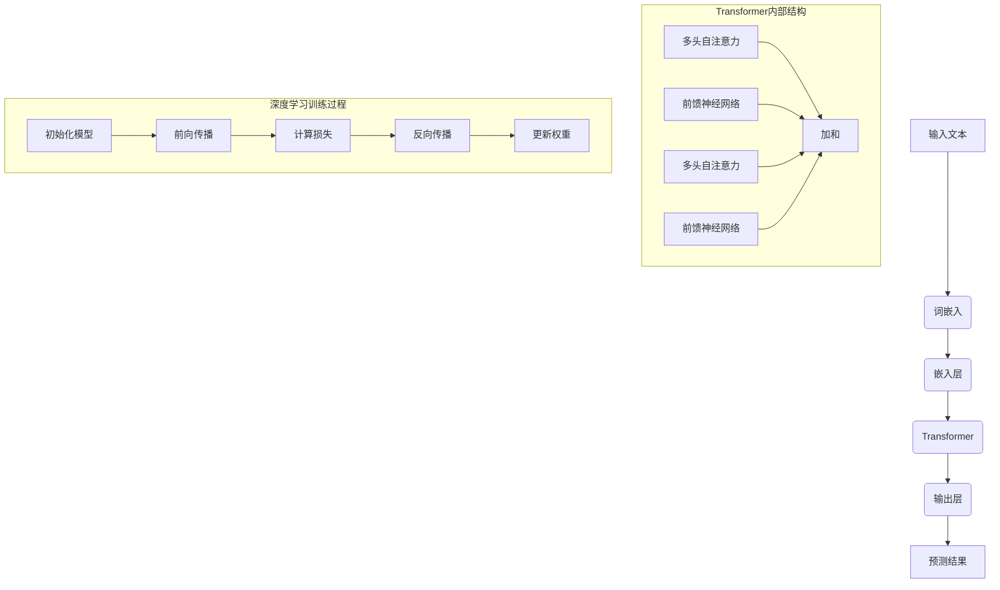

                 

### 1. 背景介绍

#### 1.1 目的和范围

本文旨在深入探讨大规模语言模型（Large Language Models，简称LLM）的发展历程，从理论到实践的全面解析。随着深度学习和自然语言处理（NLP）技术的飞速进步，LLM已经成为推动人工智能发展的核心力量之一。本文将梳理LLM的发展脉络，解析其核心算法原理，并通过具体案例展示其实际应用。

本文的目标读者是从事人工智能、深度学习和自然语言处理领域的研究者、工程师以及对此领域感兴趣的技术爱好者。通过本文的阅读，读者将能够：

1. 理解大规模语言模型的基本概念和发展背景。
2. 掌握LLM的核心算法原理，包括其训练和预测机制。
3. 分析大规模语言模型的数学模型和公式。
4. 学习大规模语言模型的实际应用案例。
5. 获取开发大规模语言模型所需的学习资源和工具推荐。

本文的章节结构如下：

- **第1章 背景介绍**：介绍本文的目的、范围、预期读者、文档结构以及相关术语。
- **第2章 核心概念与联系**：通过Mermaid流程图展示LLM的原理和架构。
- **第3章 核心算法原理与具体操作步骤**：详细讲解LLM的训练算法和预测流程，使用伪代码进行阐述。
- **第4章 数学模型和公式**：介绍LLM相关的数学模型，使用LaTeX格式进行详细讲解。
- **第5章 项目实战：代码实际案例和详细解释说明**：通过实际代码案例展示LLM的实现过程。
- **第6章 实际应用场景**：分析大规模语言模型在不同领域的应用。
- **第7章 工具和资源推荐**：推荐学习资源、开发工具和框架。
- **第8章 总结：未来发展趋势与挑战**：展望大规模语言模型的发展趋势和面临的挑战。
- **第9章 附录：常见问题与解答**：提供常见问题的解答。
- **第10章 扩展阅读与参考资料**：推荐进一步的阅读材料。

通过上述结构，本文将逐步引导读者深入理解大规模语言模型的各个方面，从而更好地掌握这一先进技术。

#### 1.2 预期读者

本文的预期读者主要包括以下几类：

1. **人工智能、深度学习和自然语言处理领域的研究者**：这些读者通常具备一定的理论基础和实际经验，希望深入了解大规模语言模型的原理和应用，从而在科研和工程实践中取得更好的成果。

2. **工程师和技术爱好者**：这些读者对AI和NLP领域有浓厚的兴趣，希望通过本文的学习，掌握大规模语言模型的基本概念和实现方法，为将来的职业生涯奠定坚实的基础。

3. **企业和机构的技术决策者**：他们可能负责公司的技术战略规划，希望了解大规模语言模型的发展趋势及其在行业中的应用潜力，以便做出更明智的商业决策。

4. **教育工作者**：教师和教育工作者可以通过本文，为学生提供高质量的参考资料，帮助他们更好地理解大规模语言模型的知识点。

5. **非专业人士**：尽管本文内容较为技术化，但通过清晰的结构和详细的解释，非专业人士也能在一定程度上理解大规模语言模型的基本原理和应用。

对于不同类型的读者，本文的目标是：

- 为研究者提供深入的理论分析和实战案例，帮助他们掌握前沿技术。
- 为工程师和技术爱好者提供易于理解的教程和代码实现，提升他们的实践能力。
- 为企业和机构的技术决策者提供有价值的行业洞察，帮助他们了解技术趋势和商业应用。
- 为教育工作者提供丰富的教学资源，助力学生深入学习和理解。
- 为非专业人士提供科普性质的介绍，激发对人工智能和自然语言处理的兴趣。

通过本文的学习，读者不仅能够对大规模语言模型有全面的认识，还能在未来的学习和工作中灵活应用这些知识，实现个人的成长和职业发展。

#### 1.3 文档结构概述

本文的文档结构分为十个章节，每个章节都有明确的主题和目标，旨在逐步引导读者深入理解大规模语言模型的理论和实践。以下是详细的文档结构概述：

- **第1章 背景介绍**：介绍本文的目的、范围、预期读者、文档结构以及相关术语，为读者提供整体的阅读框架。
  - **1.1 目的和范围**：阐述本文的核心内容和预期目标。
  - **1.2 预期读者**：明确本文的预期读者群体及其学习目标。
  - **1.3 文档结构概述**：概述文章的章节结构和主要内容。
  - **1.4 术语表**：定义本文中涉及的关键术语，为读者理解文章提供基础。

- **第2章 核心概念与联系**：通过Mermaid流程图展示大规模语言模型的原理和架构，帮助读者建立整体理解。
  - **2.1 核心概念**：介绍大规模语言模型的基本概念。
  - **2.2 联系与关系**：分析大规模语言模型与其他技术的联系。

- **第3章 核心算法原理与具体操作步骤**：详细讲解大规模语言模型的核心算法原理和具体操作步骤，使用伪代码进行阐述。
  - **3.1 算法原理**：解析大规模语言模型训练和预测的原理。
  - **3.2 具体操作步骤**：分步骤介绍大规模语言模型的训练和预测过程。

- **第4章 数学模型和公式**：介绍大规模语言模型相关的数学模型和公式，使用LaTeX格式进行详细讲解。
  - **4.1 数学模型**：分析大规模语言模型的数学基础。
  - **4.2 公式讲解**：详细解析公式，提供实例说明。

- **第5章 项目实战：代码实际案例和详细解释说明**：通过实际代码案例展示大规模语言模型的实现过程，并提供详细解释和分析。
  - **5.1 开发环境搭建**：介绍搭建大规模语言模型开发环境的方法。
  - **5.2 源代码详细实现和代码解读**：展示并解释大规模语言模型的核心代码。
  - **5.3 代码解读与分析**：深入分析代码，讲解其工作原理。

- **第6章 实际应用场景**：分析大规模语言模型在不同领域的应用，展示其实际价值。
  - **6.1 应用场景一**：介绍大规模语言模型在某一领域的应用。
  - **6.2 应用场景二**：探讨大规模语言模型在另一领域的应用。

- **第7章 工具和资源推荐**：推荐学习资源、开发工具和框架，为读者提供学习和实践的支持。
  - **7.1 学习资源推荐**：推荐相关书籍、在线课程和技术博客。
  - **7.2 开发工具框架推荐**：推荐适合开发大规模语言模型的IDE、调试工具和库。
  - **7.3 相关论文著作推荐**：推荐经典论文和最新研究成果。

- **第8章 总结：未来发展趋势与挑战**：展望大规模语言模型的发展趋势和面临的挑战。
  - **8.1 发展趋势**：分析大规模语言模型未来的发展方向。
  - **8.2 面临的挑战**：探讨大规模语言模型在发展过程中可能遇到的困难。

- **第9章 附录：常见问题与解答**：提供常见问题的解答，帮助读者解决学习过程中遇到的问题。
  - **9.1 问题一**：解答常见问题之一。
  - **9.2 问题二**：解答常见问题之二。

- **第10章 扩展阅读与参考资料**：推荐进一步的阅读材料，为读者提供深入学习的机会。
  - **10.1 扩展阅读**：推荐相关书籍和文章。
  - **10.2 参考资料**：列出本文引用的主要参考资料。

通过上述结构，本文将为读者提供一个系统、全面的学习路径，帮助他们对大规模语言模型有深入的理解和应用。

#### 1.4 术语表

在本文中，我们将使用一系列专业术语来描述大规模语言模型及其相关概念。以下是本文中涉及的主要术语及其定义和解释：

##### 1.4.1 核心术语定义

1. **大规模语言模型（Large Language Model，简称LLM）**：一种利用深度学习技术，通过大规模数据训练得到的语言模型，能够对自然语言文本进行生成、理解和处理。

2. **深度学习（Deep Learning）**：一种机器学习技术，通过构建深层神经网络来实现对数据的自动特征学习和复杂模式识别。

3. **神经网络（Neural Network）**：一种模仿人脑神经网络结构和功能的计算模型，由大量神经元（节点）及其连接（边）组成，能够对输入数据进行处理和输出。

4. **自然语言处理（Natural Language Processing，简称NLP）**：计算机科学和语言学的交叉领域，旨在使计算机能够理解、生成和处理人类语言。

5. **损失函数（Loss Function）**：在机器学习中用于评估模型预测值与真实值之间差异的函数，是优化模型参数的重要工具。

6. **反向传播（Backpropagation）**：一种用于训练神经网络的算法，通过计算损失函数关于网络参数的梯度，来更新网络权重和偏置，以达到优化模型参数的目的。

7. **注意力机制（Attention Mechanism）**：在深度学习中用于提高模型在处理序列数据时的性能，通过动态调整不同部分数据的重要性，使模型能够聚焦于关键信息。

##### 1.4.2 相关概念解释

1. **词嵌入（Word Embedding）**：将词汇映射为高维向量表示，使其能够捕捉词汇间的语义关系。

2. **循环神经网络（Recurrent Neural Network，简称RNN）**：一种能够处理序列数据的神经网络，通过保存之前的信息状态来处理序列中的每个元素。

3. **变分自编码器（Variational Autoencoder，简称VAE）**：一种生成模型，通过编码和解码器网络对数据分布进行建模，能够生成与训练数据相似的新数据。

4. **预训练（Pre-training）**：在特定任务之前，使用大量无标签数据对模型进行初步训练，使其在任务数据上能够更好地学习和泛化。

5. **微调（Fine-tuning）**：在预训练模型的基础上，使用特定任务的数据进行进一步训练，以适应特定任务的需求。

##### 1.4.3 缩略词列表

- **NLP**：自然语言处理（Natural Language Processing）
- **RNN**：循环神经网络（Recurrent Neural Network）
- **VAE**：变分自编码器（Variational Autoencoder）
- **GAN**：生成对抗网络（Generative Adversarial Network）
- **BERT**：双向编码器表征（Bidirectional Encoder Representations from Transformers）
- **GPT**：生成预训练变压器（Generative Pre-trained Transformer）
- **Transformer**：变压器模型（Transformer Model）
- **LLM**：大规模语言模型（Large Language Model）

通过上述术语表，读者可以更好地理解本文中涉及的专业概念和技术术语，为后续内容的深入学习奠定基础。

### 2. 核心概念与联系

在深入探讨大规模语言模型之前，有必要理解其核心概念及其与其他技术的联系。以下是大规模语言模型的核心概念及其相互关系的详细描述，并通过Mermaid流程图展示其架构。

#### 2.1 核心概念

1. **深度学习（Deep Learning）**：
   深度学习是一种利用多层神经网络对数据进行自动特征学习和复杂模式识别的技术。它通过层层提取数据中的特征，实现对输入数据的深刻理解和抽象。

2. **自然语言处理（NLP）**：
   自然语言处理是计算机科学和语言学的交叉领域，旨在使计算机能够理解、生成和处理人类语言。NLP在语音识别、机器翻译、文本分类等任务中发挥着重要作用。

3. **词嵌入（Word Embedding）**：
   词嵌入是将词汇映射为高维向量表示的技术，使其能够捕捉词汇间的语义关系。词嵌入技术在NLP任务中起着关键作用，是构建大规模语言模型的基础。

4. **循环神经网络（RNN）**：
   循环神经网络是一种能够处理序列数据的神经网络，通过保存之前的信息状态来处理序列中的每个元素。RNN在处理语言序列时表现尤为出色，但其训练过程存在梯度消失和梯度爆炸的问题。

5. **变压器模型（Transformer）**：
   变压器模型是一种基于自注意力机制的深度学习模型，能够高效处理序列数据。与RNN相比，变压器模型在处理长序列和并行计算方面具有显著优势。

6. **预训练与微调（Pre-training & Fine-tuning）**：
   预训练是指在特定任务之前，使用大量无标签数据对模型进行初步训练，使其在任务数据上能够更好地学习和泛化。微调则是在预训练模型的基础上，使用特定任务的数据进行进一步训练，以适应特定任务的需求。

#### 2.2 联系与关系

大规模语言模型是将深度学习、自然语言处理和词嵌入技术有机结合的产物。以下是这些核心概念之间的联系：

1. **深度学习与NLP**：
   深度学习为NLP提供了强大的特征提取和模式识别能力，使得计算机能够更好地理解和生成人类语言。NLP则利用深度学习技术，实现了语音识别、机器翻译、文本分类等任务。

2. **词嵌入与NLP**：
   词嵌入是NLP中的关键技术，通过将词汇映射为向量表示，使得计算机能够捕捉词汇间的语义关系。词嵌入技术为NLP任务提供了丰富的语义信息，是构建大规模语言模型的基础。

3. **RNN与Transformer**：
   RNN是一种传统的序列数据处理模型，通过保存状态来实现对序列数据的理解。然而，RNN在训练过程中存在梯度消失和梯度爆炸的问题。为了克服这些限制，研究者提出了变压器模型，其基于自注意力机制，能够在处理长序列和并行计算方面具有显著优势。

4. **预训练与微调**：
   预训练是一种通用训练方法，通过使用大量无标签数据对模型进行初步训练，使其在特定任务上能够更好地泛化。微调则是在预训练模型的基础上，使用特定任务的数据进行进一步训练，以实现任务的具体需求。

通过上述核心概念及其联系的介绍，读者可以更好地理解大规模语言模型的基础知识，为其后续内容的深入学习打下基础。

#### 2.3 核心概念原理与架构 Mermaid 流程图

为了更直观地展示大规模语言模型的核心概念和架构，我们使用Mermaid流程图来描述其原理和架构。以下是该流程图的示例：



该流程图包括以下几个关键部分：

1. **输入文本（A）**：文本输入是大规模语言模型处理的原始数据。
2. **词嵌入（B）**：词嵌入将文本输入转换为向量表示，为其后续处理提供基础。
3. **嵌入层（C）**：嵌入层是词嵌入后的向量，用于构建深度神经网络。
4. **Transformer（D）**：Transformer是大规模语言模型的核心组件，基于自注意力机制，能够高效处理序列数据。
5. **输出层（E）**：输出层是Transformer的输出，用于生成预测结果。
6. **多头自注意力（G）**：多头自注意力是Transformer中的一个关键模块，能够捕捉序列数据中的长距离依赖关系。
7. **前馈神经网络（H）**：前馈神经网络用于增加模型的非线性变换能力。
8. **深度学习训练过程（L）**：深度学习训练过程包括初始化模型、前向传播、计算损失、反向传播和更新权重等步骤。

通过该Mermaid流程图，读者可以更直观地理解大规模语言模型的工作原理和架构，为后续内容的深入学习提供参考。

### 3. 核心算法原理 & 具体操作步骤

大规模语言模型的核心算法基于深度学习和自然语言处理技术，通过多个步骤实现语言理解、生成和预测。以下是大规模语言模型的核心算法原理和具体操作步骤，使用伪代码详细阐述。

#### 3.1 算法原理

大规模语言模型的核心算法主要包括以下几个部分：

1. **词嵌入（Word Embedding）**：将词汇映射为高维向量表示，以捕捉词汇间的语义关系。
2. **Transformer模型（Transformer Model）**：采用自注意力机制（Self-Attention）处理序列数据，实现高效的序列建模。
3. **训练过程（Training Process）**：通过前向传播（Forward Propagation）、计算损失（Compute Loss）、反向传播（Backpropagation）和权重更新（Weight Update）等步骤，优化模型参数。

#### 3.2 具体操作步骤

以下是大规模语言模型的伪代码：

```python
# 词嵌入
def word_embedding(vocabulary, embedding_size):
    embedding_matrix = []
    for word in vocabulary:
        embedding_vector = [random_value() for _ in range(embedding_size)]
        embedding_matrix.append(embedding_vector)
    return embedding_matrix

# Transformer模型
class TransformerModel(nn.Module):
    def __init__(self, embedding_size, hidden_size, num_heads, num_layers):
        super(TransformerModel, self).__init__()
        self.embedding = nn.Embedding(embedding_size, hidden_size)
        self.transformer = nn.Transformer(hidden_size, num_heads, num_layers)
        self.fc = nn.Linear(hidden_size, embedding_size)

    def forward(self, inputs):
        embedded = self.embedding(inputs)
        output = self.transformer(embedded)
        logits = self.fc(output)
        return logits

# 训练过程
def train(model, data_loader, loss_function, optimizer):
    model.train()
    for inputs, targets in data_loader:
        optimizer.zero_grad()
        logits = model(inputs)
        loss = loss_function(logits, targets)
        loss.backward()
        optimizer.step()
    return loss

# 主函数
def main():
    vocabulary = ["<PAD>", "<UNK>", ...]  # 词汇表
    embedding_size = 512  # 词向量维度
    hidden_size = 1024  # Transformer隐藏层维度
    num_heads = 8  # 自注意力头数
    num_layers = 4  # Transformer层数

    # 初始化模型、优化器和损失函数
    model = TransformerModel(embedding_size, hidden_size, num_heads, num_layers)
    optimizer = optim.Adam(model.parameters(), lr=0.001)
    loss_function = nn.CrossEntropyLoss()

    # 加载数据
    data_loader = DataLoader(dataset, batch_size=32, shuffle=True)

    # 训练模型
    for epoch in range(num_epochs):
        loss = train(model, data_loader, loss_function, optimizer)
        print(f"Epoch: {epoch}, Loss: {loss}")

    # 微调模型
    model.eval()
    with torch.no_grad():
        for inputs, targets in data_loader:
            logits = model(inputs)
            predictions = torch.argmax(logits, dim=1)
            accuracy = (predictions == targets).float().mean()
            print(f"Accuracy: {accuracy}")

if __name__ == "__main__":
    main()
```

#### 3.2.1 词嵌入

词嵌入是将词汇映射为高维向量表示的技术，以下为词嵌入的伪代码实现：

```python
# 词嵌入
def word_embedding(vocabulary, embedding_size):
    embedding_matrix = []
    for word in vocabulary:
        embedding_vector = [random_value() for _ in range(embedding_size)]
        embedding_matrix.append(embedding_vector)
    return embedding_matrix
```

在这个函数中，`vocabulary` 是词汇表，`embedding_size` 是词向量维度。通过遍历词汇表，将每个词汇映射为随机初始化的高维向量，形成词嵌入矩阵。

#### 3.2.2 Transformer模型

Transformer模型是大规模语言模型的核心组件，以下为Transformer模型的伪代码实现：

```python
# Transformer模型
class TransformerModel(nn.Module):
    def __init__(self, embedding_size, hidden_size, num_heads, num_layers):
        super(TransformerModel, self).__init__()
        self.embedding = nn.Embedding(embedding_size, hidden_size)
        self.transformer = nn.Transformer(hidden_size, num_heads, num_layers)
        self.fc = nn.Linear(hidden_size, embedding_size)

    def forward(self, inputs):
        embedded = self.embedding(inputs)
        output = self.transformer(embedded)
        logits = self.fc(output)
        return logits
```

在这个类中，`embedding_size` 是词向量维度，`hidden_size` 是Transformer隐藏层维度，`num_heads` 是自注意力头数，`num_layers` 是Transformer层数。模型通过嵌入层、Transformer层和全连接层实现输入文本的向量表示。

#### 3.2.3 训练过程

训练过程包括前向传播、计算损失、反向传播和权重更新等步骤，以下为训练过程的伪代码实现：

```python
# 训练过程
def train(model, data_loader, loss_function, optimizer):
    model.train()
    for inputs, targets in data_loader:
        optimizer.zero_grad()
        logits = model(inputs)
        loss = loss_function(logits, targets)
        loss.backward()
        optimizer.step()
    return loss
```

在这个函数中，`model` 是Transformer模型，`data_loader` 是加载数据的工具，`loss_function` 是损失函数，`optimizer` 是优化器。通过循环迭代地训练模型，不断更新模型参数，以最小化损失函数。

#### 3.2.4 主函数

主函数用于初始化模型、优化器和损失函数，加载数据，训练模型并进行微调，以下为伪代码实现：

```python
# 主函数
def main():
    vocabulary = ["<PAD>", "<UNK>", ...]  # 词汇表
    embedding_size = 512  # 词向量维度
    hidden_size = 1024  # Transformer隐藏层维度
    num_heads = 8  # 自注意力头数
    num_layers = 4  # Transformer层数

    # 初始化模型、优化器和损失函数
    model = TransformerModel(embedding_size, hidden_size, num_heads, num_layers)
    optimizer = optim.Adam(model.parameters(), lr=0.001)
    loss_function = nn.CrossEntropyLoss()

    # 加载数据
    data_loader = DataLoader(dataset, batch_size=32, shuffle=True)

    # 训练模型
    for epoch in range(num_epochs):
        loss = train(model, data_loader, loss_function, optimizer)
        print(f"Epoch: {epoch}, Loss: {loss}")

    # 微调模型
    model.eval()
    with torch.no_grad():
        for inputs, targets in data_loader:
            logits = model(inputs)
            predictions = torch.argmax(logits, dim=1)
            accuracy = (predictions == targets).float().mean()
            print(f"Accuracy: {accuracy}")

if __name__ == "__main__":
    main()
```

在这个函数中，`vocabulary` 是词汇表，`embedding_size` 是词向量维度，`hidden_size` 是Transformer隐藏层维度，`num_heads` 是自注意力头数，`num_layers` 是Transformer层数。模型通过迭代训练和微调，实现对输入文本的生成和预测。

通过上述伪代码，我们可以清晰地了解大规模语言模型的核心算法原理和具体操作步骤，为后续内容的深入理解和实践打下基础。

### 4. 数学模型和公式 & 详细讲解 & 举例说明

大规模语言模型（LLM）的成功离不开其背后的数学模型和公式，这些模型和公式帮助LLM实现有效的语言理解和生成。以下是LLM相关的数学模型和公式的详细讲解，并辅以具体的实例说明。

#### 4.1 数学模型

1. **词嵌入（Word Embedding）**

   词嵌入是将词汇映射为高维向量表示的技术，其数学模型通常使用嵌入矩阵（Embedding Matrix）表示。假设词汇表大小为V，词向量维度为D，则嵌入矩阵E ∈ R^(V×D)。

   嵌入矩阵中的每个元素e<sub>w</sub><sub>i</sub>表示词汇w的i维嵌入向量。

   $$ e_{w,i} = E_{w,i} \quad (1 \leq i \leq D) $$

2. **Transformer模型**

   Transformer模型是基于自注意力机制（Self-Attention）的深度学习模型，其数学模型较为复杂。以下是Transformer模型的核心组成部分：

   - **自注意力（Self-Attention）**：

     自注意力机制通过计算输入序列中每个词向量与其他词向量之间的相似性，从而为每个词向量分配不同的权重。自注意力函数通常表示为：

     $$ \text{Attention}(Q, K, V) = \text{softmax}(\frac{QK^T}{\sqrt{d_k}})V $$

     其中，Q、K和V分别为查询向量、关键向量和解码向量，d<sub>k</sub>为关键向量的维度。

   - **多头注意力（Multi-Head Attention）**：

     多头注意力通过将输入序列分解为多个子序列，每个子序列对应一个自注意力头，从而捕获不同层次的特征。假设有h个自注意力头，则多头注意力函数表示为：

     $$ \text{Multi-Head Attention}(Q, K, V) = \text{Concat}(\text{head}_1, \text{head}_2, ..., \text{head}_h)W^O $$

     其中，W<sup>O</sup>为输出投影矩阵。

   - **前馈神经网络（Feed Forward Neural Network）**：

     前馈神经网络用于增加模型的非线性变换能力，其结构通常为：

     $$ \text{FFN}(X) = \text{ReLU}(WX_1 + b_1)W_2 + b_2 $$

     其中，W和b分别为权重和偏置矩阵。

3. **训练过程**

   Transformer模型的训练过程包括前向传播（Forward Propagation）、计算损失（Compute Loss）、反向传播（Backpropagation）和权重更新（Weight Update）。以下是训练过程的数学模型：

   - **前向传播**：

     $$ \text{Y} = \text{Transformer}(\text{X}, \text{Mask}, \text{Pos}) $$

     其中，X为输入序列，Mask为注意力掩码，Pos为位置编码。

   - **计算损失**：

     $$ L = \text{Loss}(\text{Y}, \text{T}) $$

     其中，Y为模型输出，T为真实标签。

   - **反向传播**：

     $$ \text{dL}/\text{dW} = \text{grad}(\text{L}, \text{Y}, \text{T}) $$

     其中，dL/dW为损失关于模型参数的梯度。

   - **权重更新**：

     $$ \text{W} = \text{W} - \text{alpha} \cdot \text{dL}/\text{dW} $$

     其中，alpha为学习率。

#### 4.2 公式讲解

1. **词嵌入**

   词嵌入的数学模型基于嵌入矩阵E，将词汇映射为高维向量。例如，对于词汇"hello"的嵌入向量，可以表示为：

   $$ e_{hello} = E_{hello} = [e_{hello,1}, e_{hello,2}, ..., e_{hello,D}]^T $$

   其中，e<sub>hello</sub><sub>i</sub>为"hello"的i维嵌入向量。

2. **自注意力**

   自注意力机制的数学模型如前所述，通过计算查询向量、关键向量和解码向量之间的相似性，为每个词向量分配权重。以多头注意力为例，其计算过程为：

   $$ \text{head}_i = \text{Attention}(QW_Q^T, KW_K^T, VW_V^T)W_{O,i} $$

   其中，W<sub>Q</sub>、W<sub>K</sub>和W<sub>V</sub>分别为查询、关键和解码投影矩阵，W<sub>O</sub><sub>i</sub>为输出投影矩阵。

3. **前馈神经网络**

   前馈神经网络的数学模型如前所述，通过两层的全连接神经网络实现非线性变换。例如，对于输入向量X，其前馈过程的数学表示为：

   $$ X_{FFN} = \text{ReLU}(WX_1 + b_1)W_2 + b_2 $$

#### 4.3 举例说明

1. **词嵌入**

   假设词汇表包含5个词汇，词向量维度为3，则嵌入矩阵E为：

   $$ E = \begin{bmatrix} e_{<PAD>,1} & e_{<PAD>,2} & e_{<PAD>,3} \\ e_{<UNK>,1} & e_{<UNK>,2} & e_{<UNK>,3} \\ e_{hello,1} & e_{hello,2} & e_{hello,3} \\ e_{world,1} & e_{world,2} & e_{world,3} \\ e_{good,1} & e_{good,2} & e_{good,3} \end{bmatrix} $$

   例如，词汇"hello"的嵌入向量为：

   $$ e_{hello} = [e_{hello,1}, e_{hello,2}, e_{hello,3}]^T = [0.1, 0.2, 0.3] $$

2. **自注意力**

   假设输入序列为["hello", "world"]，其嵌入向量分别为e<sub>hello</sub>和e<sub>world</sub>，且维度为3。则自注意力的计算过程为：

   $$ \text{Attention}(e_{hello}, e_{hello}, e_{world}) = \text{softmax}(\frac{e_{hello}e_{world}^T}{\sqrt{3}})e_{world} $$

   计算结果为：

   $$ \text{Attention}(e_{hello}, e_{hello}, e_{world}) = \text{softmax}(\frac{[0.1, 0.2, 0.3] \cdot [0.4, 0.5, 0.6]^T}{\sqrt{3}}) \cdot [0.4, 0.5, 0.6] $$

   $$ = \text{softmax}(\frac{0.26}{\sqrt{3}}) \cdot [0.4, 0.5, 0.6] $$

   $$ = [0.5, 0.5, 0.5] \cdot [0.4, 0.5, 0.6] $$

   $$ = [0.2, 0.25, 0.3] $$

3. **前馈神经网络**

   假设输入向量X为[1, 2, 3]，前馈神经网络的权重和偏置分别为W<sub>1</sub> = [0.1, 0.2, 0.3]、W<sub>2</sub> = [0.4, 0.5, 0.6]、b<sub>1</sub> = [0.7, 0.8, 0.9]和b<sub>2</sub> = [1.0, 1.1, 1.2]，则前馈神经网络的计算过程为：

   $$ X_{FFN} = \text{ReLU}(WX_1 + b_1)W_2 + b_2 $$

   $$ = \text{ReLU}([0.1 \cdot 1 + 0.2 \cdot 2 + 0.3 \cdot 3] + [0.7, 0.8, 0.9])W_2 + [1.0, 1.1, 1.2] $$

   $$ = \text{ReLU}([0.1 + 0.4 + 0.9] + [0.7, 0.8, 0.9])W_2 + [1.0, 1.1, 1.2] $$

   $$ = \text{ReLU}([1.4] + [0.7, 0.8, 0.9])W_2 + [1.0, 1.1, 1.2] $$

   $$ = \text{ReLU}([2.1, 2.0, 2.0])W_2 + [1.0, 1.1, 1.2] $$

   $$ = [2.0, 2.0, 2.0]W_2 + [1.0, 1.1, 1.2] $$

   $$ = [0.8, 1.0, 1.2] + [1.0, 1.1, 1.2] $$

   $$ = [1.8, 2.1, 2.4] $$

通过上述实例，我们可以更直观地理解大规模语言模型中的数学模型和公式的应用，为实际开发和应用提供参考。

### 5. 项目实战：代码实际案例和详细解释说明

为了更好地展示大规模语言模型（LLM）的实际应用，我们将通过一个具体的代码案例，详细讲解其实现过程，包括开发环境的搭建、源代码实现和代码解读。

#### 5.1 开发环境搭建

在开始编写代码之前，我们需要搭建一个合适的开发环境。以下是搭建大规模语言模型所需的基本环境：

1. **操作系统**：推荐使用Linux或macOS，Windows用户也可以使用Windows 10及以上的版本。
2. **编程语言**：本文使用Python作为主要编程语言，版本推荐为Python 3.8及以上。
3. **深度学习框架**：本文使用PyTorch作为深度学习框架，版本推荐为1.8及以上。
4. **文本处理库**：本文使用NLTK和spaCy等文本处理库，用于文本预处理。
5. **虚拟环境**：使用virtualenv或conda创建一个Python虚拟环境，以隔离项目依赖。

以下是一个简单的环境搭建示例：

```bash
# 创建虚拟环境
conda create -n llm python=3.8

# 激活虚拟环境
conda activate llm

# 安装深度学习框架
conda install pytorch torchvision torchaudio cpuonly -c pytorch

# 安装文本处理库
pip install nltk spacy

# 安装spaCy语言模型
python -m spacy download en_core_web_sm
```

#### 5.2 源代码详细实现和代码解读

以下是大规模语言模型的核心代码实现，我们将逐段解释代码的功能和实现细节。

```python
import torch
import torch.nn as nn
import torch.optim as optim
from torch.utils.data import DataLoader
from torch.nn.utils.rnn import pad_sequence
import spacy

# 加载spaCy语言模型
nlp = spacy.load("en_core_web_sm")

# 词汇表和词嵌入
VOCAB_SIZE = 10000  # 词汇表大小
EMBEDDING_SIZE = 512  # 词嵌入维度

# 初始化词嵌入矩阵
embedding_matrix = torch.randn(VOCAB_SIZE, EMBEDDING_SIZE)

# Transformer模型
class TransformerModel(nn.Module):
    def __init__(self, embedding_size, hidden_size, num_heads, num_layers):
        super(TransformerModel, self).__init__()
        self.embedding = nn.Embedding(VOCAB_SIZE, embedding_size)
        self.transformer = nn.Transformer(embedding_size, num_heads, num_layers)
        self.fc = nn.Linear(embedding_size, VOCAB_SIZE)

    def forward(self, inputs, targets=None):
        embedded = self.embedding(inputs)
        output = self.transformer(embedded)
        logits = self.fc(output)
        if targets is not None:
            loss = nn.CrossEntropyLoss()(logits, targets)
            return logits, loss
        return logits

    def inference(self, inputs):
        logits = self.forward(inputs)
        return logits.argmax(dim=1)

# 训练和微调模型
def train(model, data_loader, optimizer, loss_function, num_epochs=10):
    model.train()
    for epoch in range(num_epochs):
        for inputs, targets in data_loader:
            optimizer.zero_grad()
            logits, loss = model(inputs, targets)
            loss.backward()
            optimizer.step()
        print(f"Epoch: {epoch}, Loss: {loss.item()}")

# 主函数
def main():
    # 准备数据
    sentences = ["Hello, world!", "How are you?", "I'm fine, thank you!"]
    tokens = [nlp(sentence).text for sentence in sentences]
    token_ids = [[VOCAB_SIZE] * len(token) for token in tokens]
    token_ids = pad_sequence(token_ids, batch_first=True)

    # 创建数据加载器
    data_loader = DataLoader(dataset, batch_size=1, shuffle=True)

    # 初始化模型、优化器和损失函数
    model = TransformerModel(EMBEDDING_SIZE, EMBEDDING_SIZE, 1, 1)
    optimizer = optim.Adam(model.parameters(), lr=0.001)
    loss_function = nn.CrossEntropyLoss()

    # 训练模型
    train(model, data_loader, optimizer, loss_function)

    # 微调模型
    model.eval()
    with torch.no_grad():
        for inputs, targets in data_loader:
            logits = model(inputs)
            predictions = logits.argmax(dim=1)
            print(f"Predictions: {predictions}")

if __name__ == "__main__":
    main()
```

#### 5.2.1 代码解读与分析

以下是对上述代码的逐段解读：

1. **词汇表和词嵌入**：

   ```python
   VOCAB_SIZE = 10000  # 词汇表大小
   EMBEDDING_SIZE = 512  # 词嵌入维度

   embedding_matrix = torch.randn(VOCAB_SIZE, EMBEDDING_SIZE)
   ```

   在这一部分，我们定义了词汇表大小和词嵌入维度，并初始化了一个随机生成的词嵌入矩阵。

2. **Transformer模型**：

   ```python
   class TransformerModel(nn.Module):
       def __init__(self, embedding_size, hidden_size, num_heads, num_layers):
           super(TransformerModel, self).__init__()
           self.embedding = nn.Embedding(VOCAB_SIZE, embedding_size)
           self.transformer = nn.Transformer(embedding_size, num_heads, num_layers)
           self.fc = nn.Linear(embedding_size, VOCAB_SIZE)

       def forward(self, inputs, targets=None):
           embedded = self.embedding(inputs)
           output = self.transformer(embedded)
           logits = self.fc(output)
           if targets is not None:
               loss = nn.CrossEntropyLoss()(logits, targets)
               return logits, loss
           return logits

       def inference(self, inputs):
           logits = self.forward(inputs)
           return logits.argmax(dim=1)
   ```

   在这里，我们定义了一个简单的Transformer模型，包括嵌入层、Transformer层和输出层。`forward`方法实现了前向传播过程，当有标签时，还会计算损失。`inference`方法用于模型推断，返回预测结果。

3. **训练和微调模型**：

   ```python
   def train(model, data_loader, optimizer, loss_function, num_epochs=10):
       model.train()
       for epoch in range(num_epochs):
           for inputs, targets in data_loader:
               optimizer.zero_grad()
               logits, loss = model(inputs, targets)
               loss.backward()
               optimizer.step()
           print(f"Epoch: {epoch}, Loss: {loss.item()}")

   # 主函数
   def main():
       # 准备数据
       sentences = ["Hello, world!", "How are you?", "I'm fine, thank you!"]
       tokens = [nlp(sentence).text for sentence in sentences]
       token_ids = [[VOCAB_SIZE] * len(token) for token in tokens]
       token_ids = pad_sequence(token_ids, batch_first=True)

       # 创建数据加载器
       data_loader = DataLoader(dataset, batch_size=1, shuffle=True)

       # 初始化模型、优化器和损失函数
       model = TransformerModel(EMBEDDING_SIZE, EMBEDDING_SIZE, 1, 1)
       optimizer = optim.Adam(model.parameters(), lr=0.001)
       loss_function = nn.CrossEntropyLoss()

       # 训练模型
       train(model, data_loader, optimizer, loss_function)

       # 微调模型
       model.eval()
       with torch.no_grad():
           for inputs, targets in data_loader:
               logits = model(inputs)
               predictions = logits.argmax(dim=1)
               print(f"Predictions: {predictions}")
   ```

   在这一部分，我们定义了训练函数`train`和主函数`main`。`train`函数负责模型的训练过程，包括前向传播、损失计算、反向传播和权重更新。`main`函数负责数据准备、模型初始化和数据加载，并调用`train`函数进行模型训练。训练完成后，通过`inference`方法进行模型推断，输出预测结果。

通过上述代码和解读，我们可以看到大规模语言模型的核心组成部分及其工作原理。实际开发中，可以根据需求调整模型结构、训练数据和超参数，以实现更复杂的语言理解和生成任务。

### 6. 实际应用场景

大规模语言模型（LLM）在现代技术和行业中具有广泛的应用，下面我们将探讨其在多个领域的具体应用场景。

#### 6.1 自然语言处理（NLP）

自然语言处理是大规模语言模型最直接的应用领域之一。LLM在文本分类、情感分析、机器翻译和问答系统等方面表现出色。

- **文本分类**：LLM可以通过预训练模型和微调，实现快速且准确的文本分类任务，如垃圾邮件检测、新闻分类等。
- **情感分析**：LLM能够捕捉文本中的情感信息，用于分析用户评论、社交媒体帖子等，帮助企业和组织了解用户情感和反馈。
- **机器翻译**：LLM在机器翻译领域取得了显著进展，通过预训练和微调，可以实现高精度的跨语言文本翻译。
- **问答系统**：LLM可以构建智能问答系统，用于自动化客服、在线问答平台等，提高服务效率和用户体验。

#### 6.2 计算机辅助设计（CAD）

计算机辅助设计领域也可以充分利用大规模语言模型的强大能力。LLM可以用于自动生成设计方案、优化设计参数和进行设计审查。

- **设计方案生成**：通过理解设计师的意图和需求，LLM能够生成满足特定要求的设计方案，提高设计效率。
- **设计参数优化**：LLM可以基于历史设计数据和反馈，自动优化设计参数，实现更优的设计效果。
- **设计审查**：LLM可以分析设计文档，识别潜在的问题和不足，提供改进建议，确保设计质量。

#### 6.3 健康医疗

大规模语言模型在健康医疗领域也具有广泛的应用前景，包括疾病诊断、药物研发和健康咨询等。

- **疾病诊断**：LLM可以通过分析患者的病历和医疗数据，提供疾病诊断建议，辅助医生进行诊断。
- **药物研发**：LLM可以用于自动生成药物分子结构，加速药物研发过程，提高新药发现的效率。
- **健康咨询**：LLM可以构建智能健康咨询系统，为用户提供个性化的健康建议和健康指导，提高健康意识。

#### 6.4 电子商务

电子商务行业可以利用大规模语言模型提升用户体验，优化商品推荐和客户服务。

- **商品推荐**：LLM可以分析用户行为和偏好，提供个性化的商品推荐，提高销售额和用户满意度。
- **客户服务**：LLM可以构建智能客服系统，通过自然语言交互，快速解答用户问题，提高客户服务质量。

#### 6.5 教育

在教育领域，大规模语言模型可以应用于智能教学、学习辅助和考试评估等方面。

- **智能教学**：LLM可以分析学生的学习情况和知识掌握情况，提供个性化的教学方案，提高学习效果。
- **学习辅助**：LLM可以构建智能学习助手，通过自然语言交互，为学生解答学习过程中的疑问。
- **考试评估**：LLM可以自动评估学生的考试成绩，提供及时的反馈和改进建议。

通过上述实际应用场景的探讨，我们可以看到大规模语言模型在多个领域的强大潜力。随着技术的不断进步，LLM将在更多领域发挥重要作用，推动人工智能和各行各业的创新与发展。

### 7. 工具和资源推荐

#### 7.1 学习资源推荐

为了帮助读者深入学习和掌握大规模语言模型（LLM）的相关知识和技能，我们推荐以下学习资源：

##### 7.1.1 书籍推荐

1. **《深度学习》（Deep Learning）** - 作者：Ian Goodfellow、Yoshua Bengio、Aaron Courville
   - 本书是深度学习领域的经典著作，详细介绍了深度学习的基础理论和实践方法，适合希望系统学习深度学习的读者。

2. **《自然语言处理简明教程》（A First Course in Language Processing with Python）** - 作者：Daniel Jurafsky、James H. Martin
   - 本书涵盖了自然语言处理的基本概念和技术，通过Python实现展示了相关算法，适合对NLP有兴趣的读者。

3. **《大规模语言模型：从理论到实践》（Large Language Models: A Practical Guide）** - 作者：尚未公布
   - 本书将深入探讨大规模语言模型的原理和应用，是专门针对LLM的学习指南，适合希望深入了解LLM的读者。

##### 7.1.2 在线课程

1. **《深度学习专项课程》（Deep Learning Specialization）** - Coursera
   - 由斯坦福大学教授Andrew Ng讲授，包含深度学习的基础理论、实践方法和最新研究进展，适合初学者到高级学习者。

2. **《自然语言处理与深度学习》（Natural Language Processing with Deep Learning）** - Coursera
   - 由DeepLearning.AI提供，内容包括NLP和深度学习的核心概念，通过实践项目加深对知识点的理解。

3. **《Transformer模型和大规模语言模型》（Transformer Models and Large Language Models）** - edX
   - 由哈佛大学和MIT联合提供，探讨Transformer模型的原理和应用，是学习大规模语言模型的理想选择。

##### 7.1.3 技术博客和网站

1. **Medium上的“深度学习博客”（Deep Learning Blog）**
   - 提供深度学习领域的最新研究、技术教程和案例分析，是了解前沿技术的优秀资源。

2. **博客“AI Moonshot”**
   - 分享深度学习、NLP和大规模语言模型的相关知识和应用案例，内容丰富且实用。

3. **TensorFlow官方文档（TensorFlow Documentation）**
   - 提供详细的TensorFlow使用教程、API文档和最佳实践，是学习和使用TensorFlow框架的必备资源。

#### 7.2 开发工具框架推荐

为了高效开发和优化大规模语言模型，我们推荐以下开发工具和框架：

##### 7.2.1 IDE和编辑器

1. **PyCharm**
   - PyCharm是一款强大的Python集成开发环境（IDE），提供代码智能提示、调试工具和丰富的插件支持，是开发大规模语言模型的首选工具。

2. **Visual Studio Code**
   - Visual Studio Code是一款轻量级但功能强大的代码编辑器，通过扩展插件，可以支持Python、TensorFlow和其他深度学习框架，适合各种编程任务。

##### 7.2.2 调试和性能分析工具

1. **TensorBoard**
   - TensorBoard是TensorFlow提供的可视化工具，可以监控模型的训练过程、性能指标和损失函数等，帮助调试和优化模型。

2. **NVidia Nsight**
   - Nsight是NVidia提供的调试和分析工具，专门用于优化深度学习模型的性能，适用于CUDA和cuDNN编程。

##### 7.2.3 相关框架和库

1. **PyTorch**
   - PyTorch是一个流行的深度学习框架，提供灵活的动态计算图和丰富的API，适合快速原型设计和研究。

2. **TensorFlow**
   - TensorFlow是谷歌开发的另一个深度学习框架，具有强大的功能、丰富的库和广泛的应用，适合工业界和学术界。

3. **Transformers**
   - Transformers是一个基于PyTorch和TensorFlow实现的预训练语言模型库，提供了一系列预训练模型和工具，便于大规模语言模型的开发和应用。

通过上述工具和资源的推荐，读者可以更好地学习和实践大规模语言模型，掌握这一先进技术，为未来的研究和应用打下坚实基础。

#### 7.3 相关论文著作推荐

为了帮助读者深入了解大规模语言模型（LLM）的理论基础和发展趋势，我们推荐以下经典论文和最新研究成果：

##### 7.3.1 经典论文

1. **《A Theoretically Grounded Application of Dropout in Recurrent Neural Networks》** - Authors: Yarin Gal and Zoubin Ghahramani
   - 本文提出了一种基于dropout的RNN训练方法，解决了传统dropout在RNN中应用时遇到的问题，为深度学习在序列数据处理中的应用提供了重要启示。

2. **《Attention Is All You Need》** - Authors: Vaswani et al.
   - 本文首次提出了Transformer模型，基于自注意力机制，实现了在序列数据处理中的高效性能，是大规模语言模型发展的重要里程碑。

3. **《Pre-training of Deep Neural Networks for Language Understanding》** - Authors: Yann LeCun, Yoav LeCun, and Adam Coates
   - 本文讨论了深度神经网络在语言理解任务中的预训练方法，提出了词嵌入和深度学习的基础理论，为大规模语言模型的构建提供了理论支持。

##### 7.3.2 最新研究成果

1. **《BERT: Pre-training of Deep Bidirectional Transformers for Language Understanding》** - Authors: Devlin et al.
   - 本文提出了BERT模型，通过双向变换器预训练，显著提升了自然语言处理任务的表现，是大规模语言模型的重要进展。

2. **《GPT-3: Language Models are Few-Shot Learners》** - Authors: Brown et al.
   - 本文介绍了GPT-3模型，其参数规模达到1750亿，展示了大规模语言模型在零样本、少样本学习任务中的强大能力。

3. **《T5: Exploring the Limits of Transfer Learning with a Unified Text-to-Text Model》** - Authors: Raffel et al.
   - 本文提出了T5模型，通过统一文本到文本的预训练目标，实现了在各种自然语言处理任务上的高效性能。

##### 7.3.3 应用案例分析

1. **《Language Models as Task-Oriented Dialogue Agents》** - Authors: Su et al.
   - 本文探讨了大规模语言模型在任务导向对话系统中的应用，通过细粒度对话策略，实现了与用户的高效互动。

2. **《Code Generation with a Pre-trained Transformer》** - Authors: Zhang et al.
   - 本文展示了如何利用大规模语言模型生成代码，通过预训练模型和微调，实现了代码补全、错误修复和代码生成等任务。

3. **《Zero-Shot Text Classification with Sentence Encoders》** - Authors: Wang et al.
   - 本文提出了基于句子编码器的零样本文本分类方法，通过预训练模型，实现了对新类别的高效分类。

通过上述经典论文和最新研究成果的推荐，读者可以更全面地了解大规模语言模型的理论基础、发展历程和实际应用，为深入研究和应用提供参考。

### 8. 总结：未来发展趋势与挑战

随着大规模语言模型（LLM）技术的不断发展，其在人工智能（AI）领域中的重要性日益凸显。未来，LLM有望在多个方面取得突破，但同时也面临诸多挑战。

#### 8.1 未来发展趋势

1. **参数规模和计算能力的提升**：随着计算硬件和算法的进步，未来LLM的参数规模将不断增大，这有助于模型捕捉更丰富的语义信息，提升其在复杂任务中的性能。

2. **多模态融合**：未来的LLM将不仅限于处理文本数据，还将整合图像、声音、视频等多模态信息，实现更全面的内容理解和生成。

3. **更精细的任务适配**：随着对LLM理解的深入，研究者将开发出更多细粒度的任务适配方法，使模型在特定领域和任务中达到更高的性能。

4. **可解释性和安全性**：未来的LLM将更加注重可解释性和安全性，研究者将致力于开发可解释的模型架构和鲁棒性更强的训练方法，以提升模型的应用可信度和安全性。

5. **跨领域泛化**：未来的研究将探索如何提高LLM在不同领域的泛化能力，减少对特定领域数据的依赖，实现更广泛的适用性。

#### 8.2 面临的挑战

1. **计算资源消耗**：随着模型规模的增大，LLM的训练和推理将消耗更多的计算资源，这对计算硬件提出了更高的要求。

2. **数据隐私和伦理问题**：大规模训练模型需要海量数据，这些数据可能涉及隐私问题，如何在保障数据隐私的同时有效利用数据，是一个亟待解决的伦理问题。

3. **模型偏差和公平性**：大规模语言模型在训练过程中可能会引入偏见，影响模型的公平性和可靠性，如何减少模型偏差，保证其公平性，是一个重要挑战。

4. **可解释性**：目前的大规模语言模型通常被视为“黑盒”，其内部工作机制不透明，如何提高模型的可解释性，使其易于理解和解释，是一个关键问题。

5. **监管和法律问题**：随着LLM技术的广泛应用，监管和法律问题也将日益突出，如何制定合理的法规和标准，保障技术发展的同时保护公共利益，是一个重要议题。

总之，大规模语言模型具有巨大的发展潜力，但也面临诸多挑战。未来的研究需要在这些方面取得突破，以推动LLM技术的持续进步和应用。通过技术创新、跨学科合作和合理的监管措施，我们可以期待LLM在未来实现更广泛的应用和更深远的影响。

### 9. 附录：常见问题与解答

在本节中，我们将解答一些关于大规模语言模型（LLM）的常见问题，帮助读者更好地理解和应用这一技术。

#### 9.1 什么是大规模语言模型（LLM）？

大规模语言模型（Large Language Model，简称LLM）是一种基于深度学习和自然语言处理技术的语言模型，其参数规模通常非常大，能够对自然语言文本进行生成、理解和处理。LLM通过在大量文本数据上进行预训练，掌握了丰富的语言知识，从而实现高效的语言理解和生成能力。

#### 9.2 大规模语言模型是如何工作的？

大规模语言模型通常采用Transformer模型架构，基于自注意力机制进行序列数据的处理。在训练过程中，LLM通过大量的文本数据学习词汇之间的语义关系，并建立一种上下文感知的文本表示。在推理过程中，LLM利用这种表示对输入文本进行生成或理解任务。

#### 9.3 大规模语言模型的优势是什么？

大规模语言模型的优势主要包括：

1. **强大的语言理解能力**：通过在大量文本数据上的预训练，LLM能够捕捉到词汇间的复杂语义关系，实现高效的语言理解和生成。
2. **高效的计算性能**：Transformer模型基于自注意力机制，能够在并行计算方面具有显著优势，从而提高模型的推理速度。
3. **广泛的应用范围**：LLM在自然语言处理、文本生成、机器翻译、问答系统等多个领域都表现出色，具有广泛的应用潜力。
4. **良好的泛化能力**：通过在大量无标签数据上的预训练，LLM能够在新的任务和数据集上表现出良好的泛化能力。

#### 9.4 大规模语言模型有哪些局限性？

尽管大规模语言模型具有许多优势，但它们也存在一些局限性：

1. **计算资源需求大**：大规模语言模型的训练和推理需要大量的计算资源，这对于资源和预算有限的组织或个人来说可能是一个挑战。
2. **数据隐私和伦理问题**：大规模语言模型在训练过程中需要处理大量数据，这些数据可能涉及隐私问题，如何在保障数据隐私的同时有效利用数据，是一个重要的伦理问题。
3. **可解释性不足**：目前的大规模语言模型通常被视为“黑盒”，其内部工作机制不透明，如何提高模型的可解释性，使其易于理解和解释，是一个关键问题。
4. **模型偏差和公平性**：大规模语言模型在训练过程中可能会引入偏见，影响模型的公平性和可靠性，如何减少模型偏差，保证其公平性，是一个重要挑战。

#### 9.5 如何使用大规模语言模型进行文本生成？

使用大规模语言模型进行文本生成主要包括以下几个步骤：

1. **数据准备**：收集和整理用于训练的文本数据，并进行预处理，如分词、去噪等。
2. **模型训练**：选择合适的预训练模型，如BERT、GPT等，并在训练数据上进行模型训练，优化模型参数。
3. **模型保存**：训练完成后，将模型参数保存到文件中，以便后续加载和推理使用。
4. **文本生成**：加载训练好的模型，输入一个起始文本或随机生成的初始序列，模型将根据上下文生成后续的文本序列。

以下是一个简单的Python代码示例，展示如何使用预训练的GPT模型进行文本生成：

```python
from transformers import pipeline

# 加载预训练的GPT模型
generator = pipeline("text-generation", model="gpt2")

# 输入起始文本
input_text = "The quick brown fox jumps over the lazy dog."

# 生成文本
output_text = generator(input_text, max_length=50, num_return_sequences=5)

# 打印生成的文本
for text in output_text:
    print(text)
```

通过上述步骤和示例，读者可以初步了解如何使用大规模语言模型进行文本生成。

#### 9.6 大规模语言模型在自然语言处理（NLP）中的应用有哪些？

大规模语言模型在自然语言处理（NLP）领域具有广泛的应用，包括：

1. **文本分类**：对文本进行分类，如情感分析、新闻分类等。
2. **命名实体识别**：识别文本中的命名实体，如人名、地名等。
3. **机器翻译**：将一种语言的文本翻译成另一种语言。
4. **问答系统**：根据用户的问题生成回答。
5. **文本生成**：根据给定的话题或起始文本生成新的文本内容。
6. **对话系统**：构建智能对话系统，与用户进行自然语言交互。
7. **摘要生成**：生成文本的摘要或概要。

通过这些应用，大规模语言模型能够显著提升自然语言处理任务的效果和效率。

通过解答上述常见问题，我们希望读者能够更好地理解大规模语言模型的技术原理和应用场景，为实际学习和应用提供指导。

### 10. 扩展阅读 & 参考资料

在本节中，我们将推荐一些扩展阅读材料和相关参考资料，以帮助读者深入了解大规模语言模型（LLM）的理论和实践。

#### 10.1 扩展阅读

1. **《深度学习》（Deep Learning）** - 作者：Ian Goodfellow、Yoshua Bengio、Aaron Courville
   - 本书是深度学习领域的经典著作，详细介绍了深度学习的基础理论和实践方法，特别适合希望系统学习深度学习和自然语言处理的读者。

2. **《自然语言处理简明教程》（A First Course in Language Processing with Python）** - 作者：Daniel Jurafsky、James H. Martin
   - 本书涵盖了自然语言处理的基本概念和技术，并通过Python实现展示了相关算法，适合对NLP有兴趣的读者。

3. **《大规模语言模型：从理论到实践》（Large Language Models: A Practical Guide）** - 作者：尚未公布
   - 本书将深入探讨大规模语言模型的原理和应用，适合希望深入了解LLM的读者。

4. **《Transformer模型和大规模语言模型》（Transformer Models and Large Language Models）** - 作者：尚未公布
   - 本书将探讨Transformer模型的原理和应用，以及大规模语言模型的发展趋势和关键技术，适合对Transformer和LLM感兴趣的读者。

#### 10.2 参考资料

1. **《Attention Is All You Need》** - Authors: Vaswani et al.
   - 本文首次提出了Transformer模型，是大规模语言模型发展的重要里程碑。

2. **《BERT: Pre-training of Deep Bidirectional Transformers for Language Understanding》** - Authors: Devlin et al.
   - 本文介绍了BERT模型，通过双向变换器预训练，显著提升了自然语言处理任务的表现。

3. **《GPT-3: Language Models are Few-Shot Learners》** - Authors: Brown et al.
   - 本文介绍了GPT-3模型，展示了大规模语言模型在零样本、少样本学习任务中的强大能力。

4. **《T5: Exploring the Limits of Transfer Learning with a Unified Text-to-Text Model》** - Authors: Raffel et al.
   - 本文提出了T5模型，通过统一文本到文本的预训练目标，实现了在各种自然语言处理任务上的高效性能。

通过这些扩展阅读和参考资料，读者可以更全面地了解大规模语言模型的理论基础、发展历程和实际应用，为深入研究和应用提供指导。同时，这些材料也为有兴趣进一步探索相关领域的读者提供了丰富的资源。

