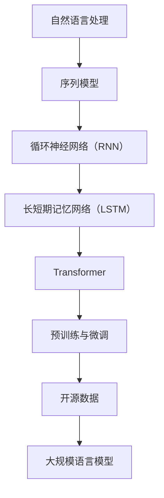

                 

# 大规模语言模型从理论到实践：开源数据

> 关键词：大规模语言模型、自然语言处理、深度学习、神经网络、开源数据、实践应用
> 
> 摘要：本文旨在深入探讨大规模语言模型的理论基础及其在实际应用中的实现过程，重点关注开源数据的收集与利用。我们将通过理论讲解、算法分析、实践案例等多个维度，系统性地介绍大规模语言模型从理论到实践的完整过程，为读者提供全面的技术参考。

## 1. 背景介绍

### 1.1 目的和范围

本文的目的是让读者全面了解大规模语言模型（Language Model）的基本概念、理论基础以及其在实际应用中的实现过程。本文将聚焦于以下几个方面：

1. **大规模语言模型的理论基础**：介绍大规模语言模型的起源、发展及其核心原理。
2. **开源数据的重要性**：探讨开源数据在语言模型训练中的应用，以及如何有效地利用这些数据。
3. **核心算法原理**：详细讲解大规模语言模型中的关键算法，如循环神经网络（RNN）、长短期记忆网络（LSTM）和Transformer等。
4. **数学模型和公式**：介绍大规模语言模型中的数学基础，包括概率分布、梯度下降算法等。
5. **项目实战**：通过实际代码案例，展示如何构建和训练大规模语言模型。
6. **实际应用场景**：探讨大规模语言模型在不同领域的应用，如自然语言生成、机器翻译、情感分析等。
7. **工具和资源推荐**：为读者推荐相关学习资源、开发工具和最新研究成果。

### 1.2 预期读者

本文主要面向以下读者群体：

1. **计算机科学和人工智能领域的科研人员**：希望了解大规模语言模型的基础知识及其应用。
2. **软件开发工程师**：希望掌握大规模语言模型的实际应用技巧。
3. **数据科学家**：希望深入了解大规模语言模型的训练和优化过程。
4. **对人工智能和自然语言处理感兴趣的学习者**：希望通过本文了解大规模语言模型的原理和应用。

### 1.3 文档结构概述

本文将按照以下结构展开：

1. **背景介绍**：介绍本文的目的、预期读者和文档结构。
2. **核心概念与联系**：通过Mermaid流程图展示大规模语言模型的原理和架构。
3. **核心算法原理 & 具体操作步骤**：使用伪代码详细讲解大规模语言模型的关键算法。
4. **数学模型和公式 & 详细讲解 & 举例说明**：介绍大规模语言模型中的数学基础和算法原理。
5. **项目实战：代码实际案例和详细解释说明**：通过实际代码案例展示大规模语言模型的实现过程。
6. **实际应用场景**：探讨大规模语言模型在不同领域的应用。
7. **工具和资源推荐**：为读者推荐学习资源和开发工具。
8. **总结：未来发展趋势与挑战**：总结大规模语言模型的发展趋势和面临的挑战。
9. **附录：常见问题与解答**：回答读者可能遇到的问题。
10. **扩展阅读 & 参考资料**：推荐相关阅读材料和最新研究成果。

### 1.4 术语表

#### 1.4.1 核心术语定义

- **大规模语言模型**：一种用于预测自然语言序列的统计模型。
- **自然语言处理（NLP）**：研究如何让计算机理解和生成自然语言的学科。
- **深度学习**：一种基于神经网络的学习方法，通过多层非线性变换提取特征。
- **循环神经网络（RNN）**：一种能够处理序列数据的神经网络。
- **长短期记忆网络（LSTM）**：一种改进的循环神经网络，能够有效处理长序列数据。
- **Transformer**：一种基于自注意力机制的深度学习模型，广泛应用于语言模型和机器翻译等领域。
- **开源数据**：指可以免费获取、自由使用的数据集，通常用于机器学习和自然语言处理领域。

#### 1.4.2 相关概念解释

- **预训练**：在特定任务上进行大规模预训练，以提高模型在目标任务上的性能。
- **微调**：在预训练模型的基础上，针对特定任务进行微调，以适应新的数据分布。
- **自注意力机制**：在Transformer模型中，用于计算序列中每个元素与其他元素之间的关系。
- **序列到序列（Seq2Seq）模型**：一种将序列映射到序列的模型，常用于机器翻译等领域。

#### 1.4.3 缩略词列表

- **NLP**：自然语言处理（Natural Language Processing）
- **RNN**：循环神经网络（Recurrent Neural Network）
- **LSTM**：长短期记忆网络（Long Short-Term Memory）
- **Transformer**：Transformer模型（基于自注意力机制的深度学习模型）
- **BERT**：Bidirectional Encoder Representations from Transformers，一种基于Transformer的双向编码器模型。
- **GPT**：Generative Pre-trained Transformer，一种生成预训练的Transformer模型。

## 2. 核心概念与联系

在探讨大规模语言模型之前，我们需要了解一些核心概念和它们之间的联系。以下是一个简化的Mermaid流程图，展示了这些概念和它们在大规模语言模型中的应用。



### 2.1 自然语言处理（NLP）

自然语言处理（NLP）是人工智能领域的一个重要分支，旨在使计算机理解和生成自然语言。NLP的核心目标包括文本分类、情感分析、命名实体识别、机器翻译等。

在NLP中，序列模型是一种重要的模型类型，因为它能够处理自然语言中的顺序依赖关系。序列模型包括循环神经网络（RNN）和其变体，如长短期记忆网络（LSTM）和门控循环单元（GRU）。

### 2.2 循环神经网络（RNN）

循环神经网络（RNN）是一种能够处理序列数据的神经网络。RNN的基本思想是利用上一个时间步的输出作为当前时间步的输入，从而实现序列信息的传递。然而，传统的RNN在处理长序列数据时存在梯度消失和梯度爆炸等问题。

### 2.3 长短期记忆网络（LSTM）

长短期记忆网络（LSTM）是RNN的一种变体，通过引入门控机制，解决了传统RNN在处理长序列数据时的问题。LSTM包括三个门控单元：遗忘门、输入门和输出门，分别用于控制信息的遗忘、输入和输出。

### 2.4 Transformer

Transformer是Google在2017年提出的一种基于自注意力机制的深度学习模型。Transformer摒弃了传统的循环结构，采用自注意力机制来处理序列数据，从而在许多NLP任务中取得了显著的性能提升。

### 2.5 预训练与微调

预训练是一种在大规模语料库上训练模型的方法，目的是提高模型在特定任务上的性能。预训练后，模型可以通过微调（Fine-tuning）适应特定任务的数据分布。微调过程通常在预训练模型的基础上进行，通过调整模型参数，使其在目标任务上达到更好的性能。

### 2.6 开源数据

开源数据是大规模语言模型训练的关键资源。开源数据集如维基百科、Common Crawl等，为语言模型的训练提供了丰富的数据来源。通过利用这些数据，我们可以构建出性能更优的语言模型。

### 2.7 大规模语言模型

大规模语言模型是一种能够预测自然语言序列的统计模型。通过结合预训练、微调和开源数据，我们可以构建出在不同领域具有广泛应用的语言模型，如自然语言生成、机器翻译、情感分析等。

## 3. 核心算法原理 & 具体操作步骤

在本节中，我们将详细讲解大规模语言模型中的核心算法原理，并使用伪代码展示具体的操作步骤。

### 3.1 循环神经网络（RNN）

循环神经网络（RNN）是一种能够处理序列数据的神经网络。RNN的基本原理是将上一个时间步的输出作为当前时间步的输入，从而实现序列信息的传递。

```python
# 伪代码：循环神经网络（RNN）
def RNN(input_sequence, hidden_state):
    # 输入序列和隐藏状态
    for t in range(len(input_sequence)):
        # 当前时间步的输入和隐藏状态
        input_t, hidden_t = input_sequence[t], hidden_state
        
        # 计算当前时间步的输出
        output_t = activation_function(W * [input_t, hidden_t])
        
        # 更新隐藏状态
        hidden_state = hidden_t
        
    return output_sequence
```

### 3.2 长短期记忆网络（LSTM）

长短期记忆网络（LSTM）是RNN的一种变体，通过引入门控机制，解决了传统RNN在处理长序列数据时的问题。LSTM包括三个门控单元：遗忘门、输入门和输出门，分别用于控制信息的遗忘、输入和输出。

```python
# 伪代码：长短期记忆网络（LSTM）
def LSTM(input_sequence, hidden_state):
    # 输入序列和隐藏状态
    for t in range(len(input_sequence)):
        # 当前时间步的输入和隐藏状态
        input_t, hidden_t = input_sequence[t], hidden_state
        
        # 计算遗忘门、输入门和输出门
        forget_gate = activation_function(W_f * [input_t, hidden_t])
        input_gate = activation_function(W_i * [input_t, hidden_t])
        output_gate = activation_function(W_o * [input_t, hidden_t])
        
        # 更新隐藏状态
        hidden_state = sigmoid(forget_gate) * hidden_t + sigmoid(input_gate) * activation_function(W_c * [input_t, hidden_t])
        
        # 计算输出
        output_t = sigmoid(output_gate) * activation_function(W_h * hidden_state)
        
    return output_sequence
```

### 3.3 Transformer

Transformer是一种基于自注意力机制的深度学习模型。在Transformer中，自注意力机制用于计算序列中每个元素与其他元素之间的关系。

```python
# 伪代码：Transformer
def Transformer(input_sequence):
    # 输入序列
    for t in range(len(input_sequence)):
        # 当前时间步的输入
        input_t = input_sequence[t]
        
        # 计算自注意力权重
        attention_weights = softmax(Q * [input_t, K])
        
        # 计算自注意力输出
        attention_output = (V * attention_weights) * K
        
        # 更新输入序列
        input_sequence[t] = attention_output
        
    return output_sequence
```

### 3.4 预训练与微调

预训练是一种在大规模语料库上训练模型的方法，目的是提高模型在特定任务上的性能。预训练后，模型可以通过微调（Fine-tuning）适应特定任务的数据分布。

```python
# 伪代码：预训练与微调
def pretrain(model, dataset):
    # 预训练模型
    for epoch in range(num_epochs):
        for data in dataset:
            # 训练模型
            model.train(data)
            
def fine_tune(model, dataset, num_epochs):
    # 微调模型
    for epoch in range(num_epochs):
        for data in dataset:
            # 训练模型
            model.train(data)
```

### 3.5 开源数据

开源数据是大规模语言模型训练的关键资源。通过利用开源数据，我们可以构建出性能更优的语言模型。

```python
# 伪代码：开源数据利用
def load_data():
    # 加载开源数据
    dataset = [load_data() for data in open("data.txt")]
    return dataset
```

## 4. 数学模型和公式 & 详细讲解 & 举例说明

在本节中，我们将介绍大规模语言模型中的关键数学模型和公式，并使用具体示例进行详细讲解。

### 4.1 概率分布

概率分布是大规模语言模型中的核心概念之一。在自然语言处理中，概率分布用于表示文本序列的概率。

#### 4.1.1 伯努利分布

伯努利分布是一种二元分布，通常用于表示文本序列中的二元事件。

$$ P(X=1) = p, \quad P(X=0) = 1-p $$

其中，$X$ 表示二元事件，$p$ 表示事件发生的概率。

#### 4.1.2 高斯分布

高斯分布是一种连续分布，常用于表示文本序列中的连续变量。

$$ f(x|\mu, \sigma^2) = \frac{1}{\sqrt{2\pi\sigma^2}} e^{-\frac{(x-\mu)^2}{2\sigma^2}} $$

其中，$x$ 表示连续变量，$\mu$ 和 $\sigma^2$ 分别表示均值和方差。

### 4.2 梯度下降算法

梯度下降算法是一种常用的优化算法，用于求解大规模语言模型中的最小化问题。

#### 4.2.1 一维梯度下降

一维梯度下降算法用于求解一元函数的最小值。

$$ x_{new} = x_{old} - \alpha \frac{df}{dx} $$

其中，$x_{old}$ 和 $x_{new}$ 分别表示当前迭代和下一个迭代，$\alpha$ 表示学习率。

#### 4.2.2 多元梯度下降

多元梯度下降算法用于求解多元函数的最小值。

$$ x_{new} = x_{old} - \alpha \nabla f(x_{old}) $$

其中，$\nabla f(x_{old})$ 表示函数在 $x_{old}$ 处的梯度。

### 4.3 自注意力机制

自注意力机制是Transformer模型中的核心组件，用于计算序列中每个元素与其他元素之间的关系。

#### 4.3.1 自注意力分数

自注意力分数用于表示序列中每个元素与其他元素之间的相关性。

$$ score_{ij} = Q_i^T K_j $$

其中，$Q_i$ 和 $K_j$ 分别表示查询向量和键向量。

#### 4.3.2 自注意力权重

自注意力权重用于表示序列中每个元素的重要性。

$$ weight_{ij} = \frac{exp(score_{ij})}{\sum_{k=1}^{K} exp(score_{ik})} $$

其中，$K$ 表示序列的长度。

#### 4.3.3 自注意力输出

自注意力输出用于表示序列中每个元素的处理结果。

$$ output_{i} = \sum_{j=1}^{K} weight_{ij} V_j $$

其中，$V_j$ 表示值向量。

### 4.4 举例说明

#### 4.4.1 伯努利分布举例

假设我们有一个二元事件 $X$，其中 $p=0.5$。我们需要计算 $X$ 取值为 1 的概率。

$$ P(X=1) = 0.5, \quad P(X=0) = 0.5 $$

#### 4.4.2 高斯分布举例

假设我们有一个连续变量 $X$，其中均值 $\mu=0$，方差 $\sigma^2=1$。我们需要计算 $X$ 取值在 $[-1, 1]$ 区间的概率。

$$ P(-1 \leq X \leq 1) = \int_{-1}^{1} \frac{1}{\sqrt{2\pi}} e^{-\frac{x^2}{2}} dx \approx 0.6827 $$

#### 4.4.3 梯度下降举例

假设我们有一个一元函数 $f(x) = x^2$，我们需要使用一维梯度下降算法求解其最小值。

$$ x_{new} = x_{old} - \alpha \frac{df}{dx} = x_{old} - 2x_{old} = -x_{old} $$

#### 4.4.4 自注意力机制举例

假设我们有一个序列 $[x_1, x_2, x_3]$，其中 $Q = [1, 0, 1]$，$K = [1, 1, 1]$，$V = [1, 2, 3]$。我们需要计算自注意力权重和输出。

$$ score_{11} = Q_1^T K_1 = 1, \quad score_{12} = Q_1^T K_2 = 0, \quad score_{13} = Q_1^T K_3 = 1 $$
$$ weight_{11} = \frac{exp(score_{11})}{\sum_{k=1}^{3} exp(score_{ik})} = \frac{e^1}{e^1 + e^0 + e^1} = \frac{1}{3} $$
$$ weight_{12} = \frac{exp(score_{12})}{\sum_{k=1}^{3} exp(score_{ik})} = \frac{e^0}{e^1 + e^0 + e^1} = \frac{1}{3} $$
$$ weight_{13} = \frac{exp(score_{13})}{\sum_{k=1}^{3} exp(score_{ik})} = \frac{e^1}{e^1 + e^0 + e^1} = \frac{1}{3} $$
$$ output_1 = weight_{11} V_1 + weight_{12} V_2 + weight_{13} V_3 = \frac{1}{3} \cdot 1 + \frac{1}{3} \cdot 2 + \frac{1}{3} \cdot 3 = 2 $$

## 5. 项目实战：代码实际案例和详细解释说明

在本节中，我们将通过一个实际案例，展示如何使用Python和TensorFlow构建和训练一个大规模语言模型。这个案例将包括以下步骤：

1. **开发环境搭建**：安装必要的软件和库。
2. **数据预处理**：收集和整理开源数据。
3. **模型构建**：使用TensorFlow构建大规模语言模型。
4. **模型训练**：训练模型，并在验证集上评估性能。
5. **模型部署**：将训练好的模型部署到实际应用中。

### 5.1 开发环境搭建

在开始项目之前，我们需要搭建一个开发环境。以下是搭建开发环境所需的步骤：

1. **安装Python**：确保安装了Python 3.6或更高版本。
2. **安装TensorFlow**：在终端中运行以下命令安装TensorFlow：

   ```bash
   pip install tensorflow
   ```

3. **安装其他依赖库**：根据项目需求，可能需要安装其他依赖库，如Numpy、Pandas等。在终端中运行以下命令安装这些库：

   ```bash
   pip install numpy pandas
   ```

### 5.2 数据预处理

在构建大规模语言模型之前，我们需要收集和整理开源数据。以下是一个简单的数据预处理流程：

1. **数据收集**：从互联网上收集大量文本数据，如维基百科、新闻文章、博客等。
2. **数据清洗**：去除数据中的噪声和无关信息，如HTML标签、特殊字符等。
3. **数据分词**：将文本数据分割成单词或子词，以便于模型处理。
4. **数据编码**：将单词或子词转换为整数编码，用于输入模型。

以下是一个简单的Python代码示例，用于数据预处理：

```python
import re
import numpy as np
from tensorflow.keras.preprocessing.text import Tokenizer
from tensorflow.keras.preprocessing.sequence import pad_sequences

# 加载数据
data = ["这是一段文本数据", "这是另一段文本数据"]

# 数据清洗
def clean_text(text):
    text = re.sub('<[^>]*>', '', text)  # 去除HTML标签
    text = re.sub('[^A-Za-z]', ' ', text)  # 去除特殊字符
    text = text.lower()  # 小写转换
    return text

# 数据分词
tokenizer = Tokenizer(char_level=True)
tokenizer.fit_on_texts([text for text in data])
sequences = tokenizer.texts_to_sequences([text for text in data])

# 数据编码
max_length = 10
padded_sequences = pad_sequences(sequences, maxlen=max_length)

print(padded_sequences)
```

### 5.3 模型构建

在构建大规模语言模型时，我们通常选择一个适合的神经网络架构。在本案例中，我们使用一个简单的循环神经网络（RNN）模型。以下是使用TensorFlow构建RNN模型的步骤：

1. **导入相关库**：

   ```python
   import tensorflow as tf
   from tensorflow.keras.models import Sequential
   from tensorflow.keras.layers import Embedding, SimpleRNN, Dense
   ```

2. **定义模型**：

   ```python
   model = Sequential()
   model.add(Embedding(input_dim=len(tokenizer.word_index) + 1, output_dim=50, input_length=max_length))
   model.add(SimpleRNN(units=50, activation='tanh'))
   model.add(Dense(units=max_length, activation='sigmoid'))
   ```

3. **编译模型**：

   ```python
   model.compile(optimizer='adam', loss='binary_crossentropy', metrics=['accuracy'])
   ```

4. **模型概览**：

   ```python
   model.summary()
   ```

### 5.4 模型训练

在训练模型时，我们使用一个训练集和一个验证集。以下是训练模型的步骤：

1. **划分数据集**：

   ```python
   train_size = int(len(padded_sequences) * 0.8)
   val_size = len(padded_sequences) - train_size
   train_sequences = padded_sequences[:train_size]
   val_sequences = padded_sequences[train_size:]
   ```

2. **训练模型**：

   ```python
   model.fit(train_sequences, train_sequences, epochs=10, batch_size=32, validation_data=(val_sequences, val_sequences))
   ```

### 5.5 模型部署

在模型训练完成后，我们可以将其部署到实际应用中。以下是部署模型的步骤：

1. **保存模型**：

   ```python
   model.save('language_model.h5')
   ```

2. **加载模型**：

   ```python
   loaded_model = tf.keras.models.load_model('language_model.h5')
   ```

3. **生成文本**：

   ```python
   def generate_text(model, tokenizer, seed_text, num_words):
       for _ in range(num_words):
           tokenized_text = tokenizer.texts_to_sequences([seed_text])
           padded_text = pad_sequences(tokenized_text, maxlen=max_length)
           prediction = model.predict(padded_text)
           predicted_word_index = np.argmax(prediction)
           seed_text += tokenizer.index_word[predicted_word_index]
       return seed_text

   seed_text = "这是一个简单的"
   generated_text = generate_text(loaded_model, tokenizer, seed_text, num_words=50)
   print(generated_text)
   ```

## 6. 实际应用场景

大规模语言模型在自然语言处理（NLP）领域具有广泛的应用。以下是一些实际应用场景：

### 6.1 自然语言生成

自然语言生成（NLG）是一种利用大规模语言模型生成自然语言文本的技术。这种技术在对话系统、新闻摘要、故事生成等领域具有广泛的应用。

### 6.2 机器翻译

机器翻译是一种将一种语言的文本翻译成另一种语言的技术。大规模语言模型在机器翻译中发挥着重要作用，特别是基于自注意力机制的Transformer模型在机器翻译任务中取得了显著的性能提升。

### 6.3 情感分析

情感分析是一种通过分析文本情感倾向的技术，用于了解用户对某个话题或产品的看法。大规模语言模型可以用于情感分析的预测和分类任务。

### 6.4 文本摘要

文本摘要是一种从原始文本中提取关键信息的技术。大规模语言模型可以帮助自动生成摘要，提高信息检索的效率和准确性。

### 6.5 对话系统

对话系统是一种与人类进行自然语言交互的系统，如聊天机器人、虚拟助手等。大规模语言模型可以用于构建智能对话系统，实现自然、流畅的对话体验。

### 6.6 命名实体识别

命名实体识别是一种从文本中识别出具有特定意义的实体（如人名、地名、组织名等）的技术。大规模语言模型可以用于命名实体识别任务，提高文本处理的准确性。

### 6.7 文本分类

文本分类是一种将文本分类到预定义的类别中的技术。大规模语言模型可以用于文本分类任务，如垃圾邮件检测、新闻分类等。

## 7. 工具和资源推荐

在本节中，我们将为读者推荐一些学习资源、开发工具和最新研究成果，以帮助读者深入了解大规模语言模型。

### 7.1 学习资源推荐

#### 7.1.1 书籍推荐

1. 《深度学习》（Ian Goodfellow, Yoshua Bengio, Aaron Courville）
   - 本书全面介绍了深度学习的理论、算法和应用，是深度学习领域的经典教材。
2. 《自然语言处理综论》（Daniel Jurafsky, James H. Martin）
   - 本书涵盖了自然语言处理的核心概念、方法和应用，适合自然语言处理初学者和专业人士。
3. 《深度学习自然语言处理》（Zhiyuan Liu, Xiaodong Liu）
   - 本书详细介绍了深度学习在自然语言处理中的应用，包括文本分类、机器翻译、情感分析等。

#### 7.1.2 在线课程

1. Coursera上的《自然语言处理与深度学习》
   - 本课程由斯坦福大学提供，涵盖了自然语言处理的基础知识、深度学习算法及其应用。
2. Udacity的《深度学习工程师纳米学位》
   - 本课程包括深度学习、神经网络、自然语言处理等领域的多个项目，适合深度学习爱好者。
3. edX上的《机器学习与深度学习》
   - 本课程由微软研究院提供，介绍了机器学习和深度学习的基础知识及其在自然语言处理中的应用。

#### 7.1.3 技术博客和网站

1. [ArXiv](https://arxiv.org/)
   - ArXiv是一个预印本论文库，涵盖多个领域的最新研究成果，特别是深度学习和自然语言处理领域。
2. [TensorFlow官网](https://www.tensorflow.org/)
   - TensorFlow是一个开源的深度学习框架，提供了丰富的教程、文档和API，适合深度学习和自然语言处理开发者。
3. [自然语言处理博客](https://nlp-secrets.com/)
   - NLP Secrets博客提供了大量有关自然语言处理和深度学习的教程、实践和技巧。

### 7.2 开发工具框架推荐

#### 7.2.1 IDE和编辑器

1. PyCharm
   - PyCharm是一款强大的Python集成开发环境，提供了丰富的功能和插件，适合深度学习和自然语言处理开发。
2. Jupyter Notebook
   - Jupyter Notebook是一种交互式开发环境，适合快速原型设计和数据分析，特别适合自然语言处理项目。

#### 7.2.2 调试和性能分析工具

1. TensorBoard
   - TensorBoard是TensorFlow提供的可视化工具，用于分析模型训练过程中的损失、准确率等性能指标。
2. PerfMap
   - PerfMap是一款深度学习性能分析工具，可以实时监测模型训练过程中的性能瓶颈。

#### 7.2.3 相关框架和库

1. TensorFlow
   - TensorFlow是一个开源的深度学习框架，提供了丰富的API和工具，适合构建和训练大规模语言模型。
2. PyTorch
   - PyTorch是一个开源的深度学习框架，提供了灵活的动态计算图，适合研究者和开发者。
3. spaCy
   - spaCy是一个高效的NLP库，提供了丰富的语言处理工具，如分词、词性标注、命名实体识别等。

### 7.3 相关论文著作推荐

#### 7.3.1 经典论文

1. "A Neural Model of Contextualized Word Embeddings"
   - 这篇论文介绍了Word2Vec算法，提出了将词向量与上下文信息结合的方法。
2. "Long Short-Term Memory"
   - 这篇论文提出了长短期记忆网络（LSTM），解决了传统RNN在处理长序列数据时的问题。
3. "Attention Is All You Need"
   - 这篇论文提出了Transformer模型，引入了自注意力机制，在许多NLP任务中取得了显著的性能提升。

#### 7.3.2 最新研究成果

1. "BERT: Pre-training of Deep Bidirectional Transformers for Language Understanding"
   - 这篇论文提出了BERT模型，基于Transformer模型进行了双向预训练，广泛应用于自然语言处理任务。
2. "GPT-3: Language Models are Few-Shot Learners"
   - 这篇论文介绍了GPT-3模型，通过大量预训练数据，实现了零样本和少样本学习的能力。
3. "T5: Pre-training Large Models for Text Classification"
   - 这篇论文提出了T5模型，通过大规模预训练和微调，实现了高性能的文本分类任务。

#### 7.3.3 应用案例分析

1. "Transformers in Translation: A Practical Guide"
   - 本文详细介绍了Transformer模型在机器翻译中的应用，包括模型架构、训练和优化策略。
2. "Generating Stories with Large-scale Language Models"
   - 本文探讨了大规模语言模型在故事生成中的应用，展示了如何利用预训练模型生成有趣的故事。
3. "Deep Learning for Text Classification"
   - 本文总结了深度学习在文本分类任务中的应用，介绍了多种模型架构和优化方法。

## 8. 总结：未来发展趋势与挑战

大规模语言模型在自然语言处理领域取得了显著的进展，但仍然面临许多挑战。以下是对未来发展趋势和挑战的总结：

### 8.1 未来发展趋势

1. **预训练和微调技术的进步**：随着计算资源和数据量的不断增加，预训练和微调技术将得到进一步优化，提高模型在各个任务上的性能。
2. **跨模态学习**：未来的研究将关注如何将大规模语言模型与其他模态（如图像、声音）相结合，实现更全面的信息理解和处理。
3. **小样本学习**：通过引入新的模型结构和优化方法，未来的研究将致力于提高模型在少样本数据上的泛化能力。
4. **可解释性和安全性**：随着模型复杂性的增加，如何提高模型的可解释性和安全性将成为研究的重要方向。

### 8.2 面临的挑战

1. **计算资源需求**：大规模语言模型的训练需要大量的计算资源和时间，如何优化计算效率和提高资源利用率是当前的一大挑战。
2. **数据隐私和安全性**：大规模语言模型的训练和应用过程中涉及大量个人数据，如何保护用户隐私和数据安全是亟待解决的问题。
3. **模型可解释性**：当前的大规模语言模型往往被视为“黑箱”，如何提高模型的可解释性，使非专业人士能够理解和信任模型是未来的重要挑战。
4. **伦理和公平性**：随着大规模语言模型在现实世界的应用，如何确保模型的伦理和公平性，避免偏见和歧视是亟待解决的问题。

## 9. 附录：常见问题与解答

### 9.1 什么是大规模语言模型？

大规模语言模型是一种用于预测自然语言序列的统计模型，通常基于深度学习和神经网络技术。它通过对大量文本数据的学习，能够理解语言的语义和结构，从而在各种NLP任务中发挥作用。

### 9.2 如何训练大规模语言模型？

训练大规模语言模型通常包括以下几个步骤：

1. **数据收集**：收集大量高质量的文本数据。
2. **数据预处理**：对数据进行清洗、分词、编码等预处理操作。
3. **模型构建**：设计合适的神经网络架构，如RNN、LSTM或Transformer。
4. **模型训练**：使用预训练算法（如随机梯度下降）训练模型，优化模型参数。
5. **模型评估**：在验证集上评估模型性能，调整模型参数以达到更好的性能。

### 9.3 大规模语言模型有哪些应用？

大规模语言模型在自然语言处理领域具有广泛的应用，包括：

1. **自然语言生成**：如自动写作、对话系统、故事生成等。
2. **机器翻译**：如将一种语言翻译成另一种语言。
3. **情感分析**：如分析用户对产品的评价、情感倾向等。
4. **文本摘要**：如从长篇文章中提取关键信息生成摘要。
5. **对话系统**：如构建聊天机器人、虚拟助手等。

### 9.4 如何提高大规模语言模型的性能？

提高大规模语言模型性能的方法包括：

1. **增加训练数据**：收集更多高质量的文本数据用于训练。
2. **优化模型架构**：设计更高效的神经网络架构，如Transformer。
3. **增加训练时间**：使用更长时间的训练，优化模型参数。
4. **数据增强**：通过数据增强技术（如数据清洗、数据变换等）提高数据的多样性和丰富性。
5. **模型融合**：结合多个模型进行融合，提高模型的预测性能。

## 10. 扩展阅读 & 参考资料

为了更好地理解和掌握大规模语言模型，以下是推荐的扩展阅读和参考资料：

1. **《大规模语言模型：理论与实践》**：本书详细介绍了大规模语言模型的理论基础、实现方法和应用案例，适合深度学习和自然语言处理初学者。
2. **《自然语言处理基础教程》**：本书涵盖了自然语言处理的核心概念、方法和应用，适合自然语言处理领域的研究者和开发者。
3. **《深度学习自然语言处理实战》**：本书通过实际案例展示了如何使用深度学习技术解决自然语言处理任务，适合有实践经验的研究者和开发者。
4. **[自然语言处理博客](https://nlp-secrets.com/)**：该博客提供了大量有关自然语言处理和深度学习的教程、实践和技巧，适合深度学习和自然语言处理爱好者。
5. **[TensorFlow官网](https://www.tensorflow.org/)**：TensorFlow是开源的深度学习框架，提供了丰富的教程、文档和API，适合深度学习和自然语言处理开发者。
6. **[ArXiv](https://arxiv.org/)**：ArXiv是预印本论文库，涵盖多个领域的最新研究成果，特别是深度学习和自然语言处理领域。

