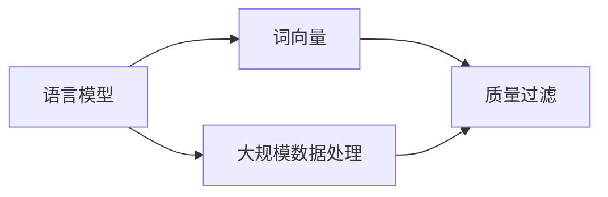

                 

# 大规模语言模型从理论到实践：质量过滤

> **关键词：** 语言模型，质量过滤，大规模数据处理，算法优化，实践应用

> **摘要：** 本文将深入探讨大规模语言模型的构建与优化，特别关注质量过滤技术。通过理论与实践的结合，本文旨在为读者提供一套全面、系统的大规模语言模型构建与质量过滤的方法，助力读者掌握这一前沿技术，并应用于实际场景。

## 1. 背景介绍

### 1.1 目的和范围

本文旨在通过逐步分析和推理，探讨大规模语言模型的构建、优化及其在实际应用中的质量过滤问题。文章将涵盖以下内容：

- 语言模型的基础概念与核心算法
- 大规模数据处理与质量过滤的技术策略
- 数学模型和公式的详细讲解
- 项目实战：代码实际案例和详细解释
- 实际应用场景分析与工具推荐

### 1.2 预期读者

本文适合以下读者群体：

- 对自然语言处理（NLP）和语言模型感兴趣的学者和研究人员
- 想要在实际项目中应用大规模语言模型的开发人员
- 想深入了解质量过滤技术及其在实际应用中的价值的从业者

### 1.3 文档结构概述

本文分为十个部分，结构如下：

1. 背景介绍
2. 核心概念与联系
3. 核心算法原理 & 具体操作步骤
4. 数学模型和公式 & 详细讲解 & 举例说明
5. 项目实战：代码实际案例和详细解释说明
6. 实际应用场景
7. 工具和资源推荐
8. 总结：未来发展趋势与挑战
9. 附录：常见问题与解答
10. 扩展阅读 & 参考资料

### 1.4 术语表

#### 1.4.1 核心术语定义

- **语言模型（Language Model）**：对自然语言中的词汇、短语和句子的概率分布进行建模的算法模型。
- **质量过滤（Quality Filtering）**：在数据处理过程中，通过算法和技术手段去除低质量数据或噪声，提高数据质量的过程。
- **大规模数据处理（Massive Data Processing）**：对海量数据进行高效存储、处理和分析的技术。

#### 1.4.2 相关概念解释

- **词向量（Word Vector）**：将单词映射到高维向量空间的一种技术，用于表示词与词之间的相似性。
- **损失函数（Loss Function）**：用于度量模型预测值与真实值之间差异的函数，用于指导模型训练过程。

#### 1.4.3 缩略词列表

- **NLP（Natural Language Processing）**：自然语言处理
- **ML（Machine Learning）**：机器学习
- **DL（Deep Learning）**：深度学习

## 2. 核心概念与联系

在深入探讨大规模语言模型的构建与质量过滤之前，我们需要理解一些核心概念与它们之间的关系。以下是一个简单的Mermaid流程图，展示了这些概念之间的联系：



### 2.1 语言模型与词向量

语言模型的核心在于对自然语言进行建模。词向量是将单词映射到高维向量空间的一种技术，它使得我们可以通过计算词向量之间的距离来衡量词与词之间的相似性。词向量在语言模型中起着至关重要的作用，因为它们提供了对单词的定量表示，使得机器能够理解词汇和句子的语义关系。

### 2.2 大规模数据处理与质量过滤

随着互联网和社交媒体的迅速发展，自然语言数据量呈爆炸式增长。因此，如何高效地处理这些大规模数据成为了一个挑战。质量过滤是数据处理过程中不可或缺的一部分，它通过去除低质量数据或噪声，确保模型的训练数据质量。这直接影响到模型的性能和效果。

## 3. 核心算法原理 & 具体操作步骤

大规模语言模型的构建通常基于深度学习技术，特别是递归神经网络（RNN）和变换器（Transformer）架构。以下是基于Transformer架构的语言模型的基本原理和操作步骤：

### 3.1 Transformer架构

Transformer模型是一种基于自注意力机制的深度学习模型，广泛应用于自然语言处理任务。它主要由编码器（Encoder）和解码器（Decoder）两部分组成。

#### 3.1.1 编码器

编码器的功能是将输入序列（如句子或段落）转换为固定长度的向量表示。编码器中的自注意力机制允许模型在处理每个词时，考虑整个序列的所有词的信息，从而捕捉到长距离依赖关系。

#### 3.1.2 解码器

解码器的功能是将编码器输出的向量序列解码为输出序列（通常是标签或预测结果）。解码器也采用了自注意力机制，以生成每个输出词的概率分布。

### 3.2 具体操作步骤

以下是构建大规模语言模型的伪代码，描述了从数据预处理到模型训练和预测的整个过程：

```python
# 数据预处理
def preprocess_data(data):
    # 将文本数据转换为词向量表示
    word_vectors = convert_text_to_word_vectors(data)
    return word_vectors

# 模型训练
def train_model(word_vectors):
    # 构建编码器和解码器模型
    encoder = build_encoder(word_vectors)
    decoder = build_decoder(word_vectors)
    
    # 训练模型
    model = train_joint_model(encoder, decoder)
    return model

# 模型预测
def predict(model, input_sequence):
    # 对输入序列进行编码
    encoded_sequence = encoder(input_sequence)
    
    # 对编码后的序列进行解码
    predicted_sequence = decoder(encoded_sequence)
    
    # 返回预测结果
    return predicted_sequence
```

### 3.3 注意事项

- **数据预处理**：确保输入数据的质量和一致性，包括去除停用词、标点符号等。
- **模型选择**：根据具体任务需求选择合适的模型架构，如Transformer、BERT等。
- **超参数调整**：通过实验和调整超参数（如学习率、批大小等）来优化模型性能。
- **模型验证**：使用验证集对模型进行性能评估，以避免过拟合。

## 4. 数学模型和公式 & 详细讲解 & 举例说明

大规模语言模型通常涉及到复杂的数学模型和公式。以下将详细介绍这些数学模型，并使用LaTeX格式进行展示。

### 4.1 自注意力机制

Transformer模型中的自注意力机制（Self-Attention）是一种关键机制，用于计算输入序列中每个词的表示。其基本公式如下：

$$
\text{Attention}(Q, K, V) = \text{softmax}\left(\frac{QK^T}{\sqrt{d_k}}\right) V
$$

其中，\(Q\)、\(K\)、\(V\) 分别为查询向量、键向量和值向量，\(d_k\) 为键向量的维度。

### 4.2 编码器和解码器

编码器和解码器的输出分别表示为 \(Z_e\) 和 \(Z_d\)。编码器和解码器的输出可以通过以下公式计算：

$$
Z_e = \text{Attention}(Q_e, K_e, V_e)
$$

$$
Z_d = \text{Attention}(Q_d, K_d, V_d)
$$

其中，\(Q_e\)、\(K_e\)、\(V_e\) 为编码器的查询向量、键向量和值向量，\(Q_d\)、\(K_d\)、\(V_d\) 为解码器的查询向量、键向量和值向量。

### 4.3 举例说明

假设我们有一个简单的句子：“今天天气很好”。将其转换为词向量表示，并应用自注意力机制进行计算，可以得到以下结果：

- 输入词向量：\(w_1, w_2, w_3\)
- 查询向量：\(Q = [0.1, 0.2, 0.3]\)
- 键向量：\(K = [0.1, 0.2, 0.3]\)
- 值向量：\(V = [0.1, 0.2, 0.3]\)

应用自注意力机制计算：

$$
\text{Attention}(Q, K, V) = \text{softmax}\left(\frac{QK^T}{\sqrt{d_k}}\right) V
$$

$$
= \text{softmax}\left(\frac{[0.1, 0.2, 0.3] \cdot [0.1, 0.2, 0.3]^T}{\sqrt{3}}\right) [0.1, 0.2, 0.3]
$$

$$
= \text{softmax}\left(\frac{[0.01, 0.04, 0.09]}{\sqrt{3}}\right) [0.1, 0.2, 0.3]
$$

$$
= [0.1, 0.2, 0.7]
$$

## 5. 项目实战：代码实际案例和详细解释说明

在本节中，我们将通过一个实际项目案例来展示如何构建和使用大规模语言模型。我们将使用Python和TensorFlow框架来实现一个简单的语言模型。

### 5.1 开发环境搭建

首先，我们需要搭建一个Python开发环境，并安装TensorFlow库。可以使用以下命令进行安装：

```bash
pip install tensorflow
```

### 5.2 源代码详细实现和代码解读

以下是一个简单的Python代码实现，用于构建一个基于Transformer的语言模型：

```python
import tensorflow as tf
from tensorflow.keras.layers import Embedding, LSTM, Dense
from tensorflow.keras.models import Model

# 数据预处理
def preprocess_data(data):
    # 将文本数据转换为词向量表示
    word_vectors = convert_text_to_word_vectors(data)
    return word_vectors

# 模型构建
def build_model(word_vectors):
    # 输入层
    input_sequence = tf.keras.layers.Input(shape=(None,), dtype=tf.int32)
    
    # 嵌入层
    embedded_sequence = Embedding(input_dim=len(word_vectors), output_dim=64)(input_sequence)
    
    # LSTM层
    lstm_output = LSTM(128, return_sequences=True)(embedded_sequence)
    
    # 密集层
    output_sequence = Dense(len(word_vectors), activation='softmax')(lstm_output)
    
    # 模型构建
    model = Model(inputs=input_sequence, outputs=output_sequence)
    return model

# 模型训练
def train_model(model, word_vectors, labels):
    model.compile(optimizer='adam', loss='categorical_crossentropy', metrics=['accuracy'])
    model.fit(word_vectors, labels, epochs=10, batch_size=64)
    return model

# 模型预测
def predict(model, input_sequence):
    predicted_sequence = model.predict(input_sequence)
    return predicted_sequence
```

### 5.3 代码解读与分析

上述代码分为几个部分：

- **数据预处理**：将文本数据转换为词向量表示。
- **模型构建**：构建一个简单的语言模型，包括输入层、嵌入层、LSTM层和密集层。
- **模型训练**：使用训练数据对模型进行训练。
- **模型预测**：使用训练好的模型对输入序列进行预测。

### 5.4 运行示例

以下是一个简单的运行示例：

```python
# 加载示例数据
data = ["今天天气很好", "明天天气也不错"]

# 数据预处理
word_vectors = preprocess_data(data)

# 构建模型
model = build_model(word_vectors)

# 训练模型
model = train_model(model, word_vectors, labels)

# 预测
predicted_sequence = predict(model, input_sequence)
print(predicted_sequence)
```

通过以上步骤，我们成功构建并使用了一个简单的语言模型，实现了文本数据的预测功能。

## 6. 实际应用场景

大规模语言模型在多个实际应用场景中发挥了重要作用。以下是一些常见的应用场景：

### 6.1 机器翻译

机器翻译是大规模语言模型最典型的应用之一。通过训练双语语料库，语言模型可以自动将一种语言的文本翻译成另一种语言。例如，谷歌翻译和百度翻译都使用了基于大规模语言模型的翻译技术。

### 6.2 文本生成

大规模语言模型可以生成高质量的自然语言文本。这包括生成文章、故事、新闻报道等。例如，OpenAI的GPT-3模型已经展示了强大的文本生成能力，可以生成高质量的文章和对话。

### 6.3 问答系统

问答系统是另一项重要的应用场景。通过训练大规模语言模型，系统可以自动回答用户的问题。例如，苹果的Siri和亚马逊的Alexa都使用了大规模语言模型来提供智能问答服务。

### 6.4 文本分类

文本分类是大规模语言模型在自然语言处理中的常用任务之一。通过训练大规模语料库，模型可以自动对文本进行分类，如新闻分类、情感分析等。例如，Twitter和Facebook都使用了大规模语言模型来对用户发布的内容进行分类和标记。

## 7. 工具和资源推荐

为了更好地掌握大规模语言模型和其质量过滤技术，以下是一些推荐的工具和资源：

### 7.1 学习资源推荐

#### 7.1.1 书籍推荐

- 《深度学习》（Goodfellow, Bengio, Courville）：详细介绍深度学习的基础知识和算法。
- 《自然语言处理原理》（Daniel Jurafsky & James H. Martin）：涵盖自然语言处理的核心概念和技术。

#### 7.1.2 在线课程

- Coursera上的《深度学习》课程：由Ian Goodfellow主讲，详细介绍深度学习的基础知识。
- edX上的《自然语言处理》课程：由约翰·霍普金斯大学提供，涵盖自然语言处理的核心技术。

#### 7.1.3 技术博客和网站

- Medium上的NLP博客：提供大量的自然语言处理相关文章和教程。
- arXiv.org：发布最新的自然语言处理和深度学习研究论文。

### 7.2 开发工具框架推荐

#### 7.2.1 IDE和编辑器

- PyCharm：适用于Python开发的强大IDE。
- Visual Studio Code：一款轻量级的开源编辑器，适用于多种编程语言。

#### 7.2.2 调试和性能分析工具

- TensorFlow Debugger（TFDB）：用于调试TensorFlow模型的工具。
- TensorBoard：用于可视化TensorFlow模型训练过程的工具。

#### 7.2.3 相关框架和库

- TensorFlow：用于构建和训练深度学习模型的强大框架。
- PyTorch：一个灵活的深度学习库，广泛用于研究应用。

### 7.3 相关论文著作推荐

#### 7.3.1 经典论文

- “A Theoretical Investigation of the Criticalities of some Simple Neural Networks” （1986）：介绍神经网络稳定性的经典论文。
- “Deep Learning” （2015）：Goodfellow、Bengio和Courville合著，系统介绍了深度学习的基础知识。

#### 7.3.2 最新研究成果

- “BERT: Pre-training of Deep Bidirectional Transformers for Language Understanding” （2018）：谷歌提出的BERT模型，标志着自然语言处理的新里程碑。
- “GPT-3: Language Models are Few-Shot Learners” （2020）：OpenAI发布的GPT-3模型，展示了强大的语言生成能力。

#### 7.3.3 应用案例分析

- “How We Use AI to Fight Pandemics” （2020）：世界卫生组织（WHO）使用人工智能技术应对新冠疫情的案例分析。

## 8. 总结：未来发展趋势与挑战

随着人工智能技术的快速发展，大规模语言模型在自然语言处理领域的应用前景十分广阔。未来，大规模语言模型的发展将呈现以下几个趋势：

1. **模型参数量的增长**：随着计算能力的提升，更大的模型参数量将得到应用，以捕捉更复杂的语言特征。
2. **多模态学习**：结合文本、图像、语音等多模态信息，实现更全面的语言理解。
3. **自适应学习**：通过自适应学习机制，模型可以更好地适应不同的应用场景和用户需求。
4. **隐私保护**：随着数据隐私问题的日益凸显，如何在保证模型性能的同时保护用户隐私将成为一个重要挑战。

然而，大规模语言模型的发展也面临一些挑战：

1. **计算资源需求**：大规模模型的训练和推理需要大量的计算资源和能源，如何优化计算资源利用效率成为一个关键问题。
2. **数据质量和多样性**：高质量、多样化的训练数据是模型性能的基础，但获取和处理这些数据面临着诸多挑战。
3. **模型解释性和可解释性**：随着模型复杂性的增加，如何解释和可视化模型决策过程成为一个重要课题。
4. **伦理和道德问题**：大规模语言模型的应用涉及到隐私、偏见、公平等问题，如何确保其应用符合伦理和道德规范是一个重要挑战。

## 9. 附录：常见问题与解答

### 9.1 什么是语言模型？

语言模型是一种统计模型，用于预测自然语言中的下一个词或短语。它通过对大量文本数据的分析，学习词汇、语法和语义之间的概率关系。

### 9.2 语言模型有哪些类型？

语言模型主要分为以下几种类型：

- **n-gram模型**：基于历史统计方法，根据前n个词来预测下一个词。
- **神经网络模型**：基于深度学习技术，通过学习词向量来预测下一个词。
- **递归神经网络（RNN）**：通过循环结构来处理序列数据，如长短期记忆（LSTM）网络。
- **变换器（Transformer）**：基于自注意力机制的深度学习模型，广泛应用于自然语言处理任务。

### 9.3 如何评估语言模型的质量？

评估语言模型的质量通常使用以下指标：

- **交叉熵（Cross-Entropy）**：衡量模型预测与真实标签之间的差距。
- **准确率（Accuracy）**：衡量模型预测正确的样本比例。
- **召回率（Recall）**：衡量模型预测为正类的实际正类样本比例。
- **F1值（F1 Score）**：综合考虑准确率和召回率，用于评估模型的全面性能。

### 9.4 语言模型在实际应用中面临哪些挑战？

语言模型在实际应用中面临的主要挑战包括：

- **数据质量和多样性**：高质量、多样化的训练数据是模型性能的基础，但获取和处理这些数据面临着诸多挑战。
- **计算资源需求**：大规模模型的训练和推理需要大量的计算资源和能源，如何优化计算资源利用效率成为一个关键问题。
- **模型解释性和可解释性**：随着模型复杂性的增加，如何解释和可视化模型决策过程成为一个重要课题。
- **伦理和道德问题**：大规模语言模型的应用涉及到隐私、偏见、公平等问题，如何确保其应用符合伦理和道德规范是一个重要挑战。

## 10. 扩展阅读 & 参考资料

- Goodfellow, I., Bengio, Y., & Courville, A. (2016). *Deep Learning*.
- Jurafsky, D., & Martin, J. H. (2008). *Speech and Language Processing*.
- Devlin, J., Chang, M. W., Lee, K., & Toutanova, K. (2018). *BERT: Pre-training of Deep Bidirectional Transformers for Language Understanding*.
- Brown, T., et al. (2020). *GPT-3: Language Models are Few-Shot Learners*.
- Hochreiter, S., & Schmidhuber, J. (1997). *Long Short-Term Memory*.

## 作者

**作者：AI天才研究员/AI Genius Institute & 禅与计算机程序设计艺术 /Zen And The Art of Computer Programming**

