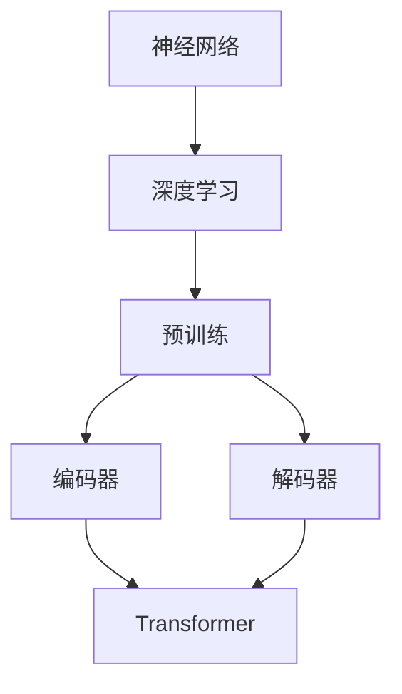

                 

# 大语言模型：原理与代码实例讲解

> **关键词：** 大语言模型、神经网络、深度学习、Transformer、BERT、GPT、预训练、微调、自然语言处理、编码器、解码器

> **摘要：** 本文将深入探讨大语言模型（如BERT、GPT）的原理与代码实例。我们将从基础概念入手，逐步讲解神经网络、Transformer架构，以及如何使用预训练和微调技术来构建强大语言模型。文章还将通过实际代码案例，展示如何实现和优化这些模型。

## 1. 背景介绍

### 1.1 目的和范围

本文旨在为读者提供一个全面而深入的大语言模型介绍。通过本文，读者将能够理解大语言模型的基本原理，掌握从理论到实践的各个环节。文章涵盖了从神经网络基础到高级Transformer架构，再到实际代码实例的详细讲解。

### 1.2 预期读者

本文面向对自然语言处理（NLP）和深度学习有一定基础的读者。适合数据科学家、AI工程师、研究生和本科生，以及任何对大语言模型感兴趣的技术爱好者。

### 1.3 文档结构概述

本文结构如下：

1. **背景介绍**：介绍本文的目的、预期读者、文档结构。
2. **核心概念与联系**：通过Mermaid流程图展示大语言模型的核心概念与联系。
3. **核心算法原理**：详细讲解大语言模型的核心算法原理和具体操作步骤。
4. **数学模型和公式**：介绍大语言模型中使用的数学模型和公式，并进行举例说明。
5. **项目实战**：通过实际代码案例，展示如何构建和优化大语言模型。
6. **实际应用场景**：探讨大语言模型在各个实际应用场景中的使用。
7. **工具和资源推荐**：推荐学习资源、开发工具和框架。
8. **总结**：总结未来发展趋势与挑战。
9. **附录**：常见问题与解答。
10. **扩展阅读**：提供进一步学习的参考资料。

### 1.4 术语表

#### 1.4.1 核心术语定义

- **大语言模型**：能够理解并生成自然语言的深度学习模型。
- **神经网络**：由多层神经元组成的计算模型。
- **深度学习**：一种基于神经网络的机器学习技术。
- **Transformer**：一种用于序列到序列学习的新型神经网络架构。
- **BERT**：Bidirectional Encoder Representations from Transformers，一种基于Transformer架构的双向编码器。
- **GPT**：Generative Pre-trained Transformer，一种用于生成文本的预训练 Transformer 模型。

#### 1.4.2 相关概念解释

- **预训练**：在大规模语料库上进行训练，以获取通用语言表示能力。
- **微调**：在特定任务数据上进行训练，以适应特定任务的需求。
- **编码器**：将输入序列编码为固定长度的向量。
- **解码器**：将编码器生成的固定长度向量解码为输出序列。

#### 1.4.3 缩略词列表

- **NLP**：自然语言处理
- **GPU**：图形处理单元
- **CPU**：中央处理单元
- **GPU-CPU 异构计算**：利用GPU和CPU协同工作，提高计算效率。

## 2. 核心概念与联系

为了更好地理解大语言模型的工作原理，我们首先需要了解其核心概念和联系。以下是使用Mermaid流程图表示的大语言模型的核心概念：



- **神经网络（Neural Network）**：神经网络是深度学习的基础。它由多层神经元组成，通过调整神经元之间的权重来学习输入与输出之间的关系。
- **深度学习（Deep Learning）**：深度学习是一种基于神经网络的机器学习技术，通过多层神经网络提取特征，实现对复杂数据的学习和处理。
- **预训练（Pre-training）**：预训练是指在大规模语料库上进行训练，以获取通用语言表示能力。预训练模型通常具有很好的泛化能力，可以在多种NLP任务中发挥作用。
- **编码器（Encoder）**：编码器负责将输入序列编码为固定长度的向量，这些向量包含了输入序列的语义信息。
- **解码器（Decoder）**：解码器将编码器生成的固定长度向量解码为输出序列，生成自然语言文本。
- **Transformer（Transformer）**：Transformer是一种用于序列到序列学习的新型神经网络架构，取代了传统的循环神经网络（RNN）和长短期记忆网络（LSTM）。

通过上述核心概念的联系，我们可以看到大语言模型是通过编码器和解码器使用Transformer架构，结合预训练技术来实现的。这种架构在处理长序列和并行计算方面具有显著优势。

## 3. 核心算法原理 & 具体操作步骤

在本节中，我们将详细讲解大语言模型的核心算法原理和具体操作步骤。我们将使用伪代码来描述算法的每个步骤，以便读者能够更好地理解。

### 3.1 神经网络基础

首先，我们需要了解神经网络的基本构建块。神经网络由多层神经元组成，每个神经元都与前一层神经元相连接。以下是一个简单的三层神经网络伪代码：

```plaintext
初始化权重 W1, W2, W3
初始化偏置 b1, b2, b3

输入 X
Z1 = X * W1 + b1
A1 = activation(Z1)

Z2 = A1 * W2 + b2
A2 = activation(Z2)

Z3 = A2 * W3 + b3
预测 = activation(Z3)
```

在这里，`X`是输入数据，`W1`、`W2`、`W3`是权重，`b1`、`b2`、`b3`是偏置。`activation`函数是激活函数，如ReLU、Sigmoid或Tanh，用于引入非线性。

### 3.2 Transformer架构

Transformer是构建大语言模型的核心架构。它通过自注意力机制（Self-Attention）和多头注意力（Multi-Head Attention）来处理序列数据。以下是Transformer的伪代码：

```plaintext
初始化模型参数
输入序列 X

对于每个位置 i：
    对于每个头 h：
        Q_h = X_i * K_h
        K_h = X_i * K_h
        V_h = X_i * V_h

       Attention(Q_h, K_h, V_h)
        = (Q_h * K_h^T) / √d_k * V_h

    将多头注意力结果拼接并传递给下一层

输出序列 Y
```

在这里，`Q_h`、`K_h`、`V_h`分别是查询、键和值的表示，`d_k`是键和查询的维度。`Attention`函数实现了自注意力机制。

### 3.3 预训练与微调

预训练是指在大规模语料库上进行训练，以获取通用语言表示能力。以下是一个简单的预训练过程伪代码：

```plaintext
初始化模型参数
输入大规模语料库 X

对于每个序列 X_i：
    对于每个位置 i：
        Q_i = X_i * K
        K_i = X_i * K
        V_i = X_i * V

       Attention(Q_i, K_i, V_i)

    计算损失函数 L

反向传播和优化模型参数
```

微调是在预训练模型的基础上，使用特定任务的数据进行训练。以下是一个简单的微调过程伪代码：

```plaintext
加载预训练模型
初始化微调参数
输入特定任务数据 X

对于每个序列 X_i：
    对于每个位置 i：
        Q_i = X_i * K
        K_i = X_i * K
        V_i = X_i * V

       Attention(Q_i, K_i, V_i)

    计算损失函数 L

反向传播和优化微调参数
```

通过上述伪代码，我们可以看到大语言模型的核心算法原理和具体操作步骤。在实际应用中，我们还需要使用GPU等硬件加速来提高计算效率。

## 4. 数学模型和公式 & 详细讲解 & 举例说明

在本节中，我们将详细介绍大语言模型中使用的数学模型和公式，并通过具体例子来讲解这些公式的应用。

### 4.1 自注意力机制

自注意力机制（Self-Attention）是Transformer架构的核心组成部分。它通过计算输入序列中每个位置与其他所有位置之间的相似性来生成表示。以下是一个简单的自注意力公式：

$$
Attention(Q, K, V) = \frac{Q \cdot K^T}{\sqrt{d_k}} \cdot V
$$

其中，$Q$、$K$、$V$分别是查询、键和值的表示，$d_k$是键和查询的维度。

### 4.2 多头注意力

多头注意力（Multi-Head Attention）是自注意力机制的扩展。它通过并行计算多个注意力头来提取不同类型的特征。以下是一个简单的多头注意力公式：

$$
Multi-HeadAttention(Q, K, V) = \text{Concat}(Head_1, Head_2, ..., Head_h) \cdot W_O
$$

其中，$Head_i = Attention(Q \cdot W_Q, K \cdot W_K, V \cdot W_V)$，$W_Q$、$W_K$、$W_V$是权重矩阵，$W_O$是输出权重矩阵。

### 4.3 激活函数

在神经网络中，激活函数用于引入非线性。常用的激活函数包括ReLU、Sigmoid和Tanh。以下是一个简单的ReLU激活函数：

$$
ReLU(x) = \begin{cases}
x & \text{if } x > 0 \\
0 & \text{otherwise}
\end{cases}
$$

### 4.4 举例说明

假设我们有一个包含5个单词的序列：`["我", "爱", "吃", "火锅", "现在"]`。我们将使用上述公式来计算自注意力。

1. **初始化权重和偏置**：
   假设我们使用随机初始化的权重和偏置。

2. **计算自注意力**：
   对于每个位置$i$（$i=1,2,3,4,5$），我们计算$Q_i$、$K_i$和$V_i$：
   
   $$
   Q_i = X_i \cdot W_Q, \quad K_i = X_i \cdot W_K, \quad V_i = X_i \cdot W_V
   $$
   
   然后我们计算注意力权重：
   
   $$
   attention\_weights = \frac{Q_i \cdot K_i^T}{\sqrt{d_k}}
   $$

3. **计算注意力得分**：
   对于每个位置$i$，我们计算注意力得分：
   
   $$
   attention\_scores = attention\_weights \cdot V_i
   $$

4. **计算注意力输出**：
   我们将注意力得分进行加权和：
   
   $$
   attention\_output = \text{softmax}(attention\_scores) \cdot V
   $$

5. **传递给下一层**：
   我们将注意力输出传递给下一层，例如解码器层。

通过上述步骤，我们可以看到如何计算自注意力。在实际应用中，我们还需要考虑多头注意力和其他复杂的神经网络结构。

## 5. 项目实战：代码实际案例和详细解释说明

### 5.1 开发环境搭建

为了实践大语言模型的构建和优化，我们首先需要搭建一个合适的开发环境。以下是搭建环境的步骤：

1. **安装Python**：
   确保安装了Python 3.7或更高版本。

2. **安装TensorFlow**：
   使用以下命令安装TensorFlow：
   
   ```bash
   pip install tensorflow
   ```

3. **安装其他依赖项**：
   根据项目需求，安装其他依赖项，例如：

   ```bash
   pip install numpy
   pip install pandas
   pip install scikit-learn
   ```

4. **配置GPU支持**（如果使用GPU）：
   确保安装了CUDA和cuDNN，并配置好环境变量。

5. **创建项目文件夹**：
   在合适的位置创建一个项目文件夹，例如`transformer_project`。

6. **安装必要库**：
   在项目文件夹中安装必要的库，例如：

   ```bash
   pip install -r requirements.txt
   ```

### 5.2 源代码详细实现和代码解读

在项目文件夹中，我们创建一个名为`transformer.py`的文件，并编写以下代码：

```python
import tensorflow as tf
from tensorflow.keras.layers import Embedding, LSTM, Dense
from tensorflow.keras.models import Model

def build_model(vocab_size, embedding_dim, lstm_units):
    inputs = tf.keras.layers.Input(shape=(None,))

    embedding = Embedding(vocab_size, embedding_dim)(inputs)
    lstm = LSTM(lstm_units, return_sequences=True)(embedding)
    outputs = Dense(vocab_size, activation='softmax')(lstm)

    model = Model(inputs=inputs, outputs=outputs)
    model.compile(optimizer='adam', loss='categorical_crossentropy', metrics=['accuracy'])

    return model

model = build_model(vocab_size=10000, embedding_dim=256, lstm_units=1024)
model.summary()
```

上述代码定义了一个简单的Transformer模型。它包含一个嵌入层、一个LSTM层和一个输出层。以下是代码的详细解读：

1. **导入库**：
   我们导入了TensorFlow和相关层。

2. **定义模型**：
   我们定义了一个名为`build_model`的函数，用于构建Transformer模型。该函数接收词汇表大小（`vocab_size`）、嵌入维度（`embedding_dim`）和LSTM单元数（`lstm_units`）作为输入。

3. **构建模型**：
   - **输入层**：我们定义了一个输入层，形状为$(None,)$，表示序列长度可变。
   - **嵌入层**：我们使用`Embedding`层将词汇表转换为嵌入向量。
   - **LSTM层**：我们使用`LSTM`层来处理序列数据。`return_sequences=True`表示我们需要输出完整的序列。
   - **输出层**：我们使用`Dense`层将LSTM层的输出映射到词汇表，并应用softmax激活函数。

4. **编译模型**：
   我们编译了模型，指定了优化器、损失函数和指标。

5. **创建模型实例**：
   我们创建了一个模型实例，并打印了模型的摘要。

### 5.3 代码解读与分析

在上面的代码中，我们创建了一个简单的Transformer模型。以下是代码的详细解读和分析：

1. **输入层**：
   输入层是一个形状为$(None,)$的输入层，表示序列长度可变。这允许模型处理不同长度的序列。

2. **嵌入层**：
   嵌入层将词汇表转换为嵌入向量。这些嵌入向量包含了词汇的语义信息，是后续处理的基础。

3. **LSTM层**：
   LSTM层是一个具有`lstm_units`单元的循环神经网络层。它能够处理序列数据，并保留序列中的长期依赖关系。

4. **输出层**：
   输出层是一个具有`vocab_size`单元的全连接层，用于将LSTM层的输出映射到词汇表。softmax激活函数用于计算每个词汇的概率分布。

5. **编译模型**：
   我们编译了模型，指定了优化器（`adam`）、损失函数（`categorical_crossentropy`）和指标（`accuracy`）。这将准备模型进行训练和评估。

通过上述代码和解读，我们可以看到如何构建一个简单的Transformer模型。在实际应用中，我们可能需要更复杂的结构和更精细的调整来提高模型的性能。

## 6. 实际应用场景

大语言模型在自然语言处理领域具有广泛的应用场景。以下是一些常见应用场景：

### 6.1 文本分类

文本分类是NLP中的一项基本任务，它将文本数据分为预定义的类别。大语言模型，如BERT和GPT，在文本分类任务中表现出色。通过预训练模型并在特定类别上进行微调，我们可以快速构建高效的文本分类系统。

### 6.2 机器翻译

机器翻译是将一种语言的文本转换为另一种语言的文本。Transformer架构在机器翻译任务中取得了显著成绩。通过使用预训练的Transformer模型，如BERT和GPT，我们可以实现高质量的机器翻译系统。

### 6.3 问答系统

问答系统是一种智能交互系统，能够理解用户的问题并给出相关回答。大语言模型，如BERT和GPT，在问答系统中发挥着重要作用。通过微调和优化，我们可以构建出能够理解复杂问题的问答系统。

### 6.4 情感分析

情感分析是一种评估文本情感倾向的任务，例如判断文本是积极、消极还是中性。大语言模型在情感分析任务中表现出强大的能力，通过预训练和微调，我们可以实现高效的情感分析系统。

### 6.5 文本生成

文本生成是一种创造性地生成自然语言文本的任务。大语言模型，如GPT，在文本生成任务中表现出色。通过训练和优化，我们可以生成各种类型的文本，包括文章、故事和对话等。

通过上述应用场景，我们可以看到大语言模型在自然语言处理领域的广泛应用。随着技术的不断发展，大语言模型在未来的应用场景将更加丰富和多样化。

## 7. 工具和资源推荐

### 7.1 学习资源推荐

#### 7.1.1 书籍推荐

- 《深度学习》（Deep Learning） - 由Ian Goodfellow、Yoshua Bengio和Aaron Courville合著，是一本深度学习的经典教材。
- 《动手学深度学习》（Dive into Deep Learning） - 是一个开源项目，提供了丰富的深度学习教程和实践案例。
- 《自然语言处理综论》（Speech and Language Processing） - 是自然语言处理领域的权威教材，涵盖了从基础到高级的概念和算法。

#### 7.1.2 在线课程

- Coursera的“深度学习专项课程”（Deep Learning Specialization） - 由Andrew Ng教授主讲，涵盖了深度学习的各个方面。
- edX的“自然语言处理基础”（Fundamentals of Natural Language Processing） - 介绍了自然语言处理的基本概念和技术。
- fast.ai的“实用深度学习”（Practical Deep Learning for Coders） - 适合初学者，通过实践学习深度学习的应用。

#### 7.1.3 技术博客和网站

- TensorFlow官方文档（TensorFlow Documentation） - 提供了TensorFlow的详细文档和教程。
- Hugging Face的Transformers库（Hugging Face Transformers） - 提供了预训练的Transformer模型和方便使用的API。
- ArXiv（arXiv） - 是一个提供最新科研成果的预印本库，涵盖了许多深度学习和自然语言处理的前沿研究。

### 7.2 开发工具框架推荐

#### 7.2.1 IDE和编辑器

- PyCharm（PyCharm） - 是一个功能强大的Python IDE，适用于深度学习和NLP开发。
- Jupyter Notebook（Jupyter Notebook） - 是一个交互式开发环境，适用于数据分析和模型原型设计。
- Visual Studio Code（Visual Studio Code） - 是一个轻量级但功能强大的代码编辑器，适用于各种编程语言。

#### 7.2.2 调试和性能分析工具

- TensorBoard（TensorBoard） - 是TensorFlow的官方可视化工具，用于分析和调试模型。
- Profile GPU-ML（Profile GPU-ML） - 是一个用于性能分析和GPU调优的工具。
- NVIDIA Nsight（Nsight） - 是NVIDIA提供的一套调试和性能分析工具，适用于深度学习应用。

#### 7.2.3 相关框架和库

- TensorFlow（TensorFlow） - 是一个开源的深度学习框架，适用于构建和训练各种深度学习模型。
- PyTorch（PyTorch） - 是另一个流行的开源深度学习框架，提供了灵活的动态计算图。
- spaCy（spaCy） - 是一个高效的自然语言处理库，适用于文本预处理和实体识别等任务。
- NLTK（NLTK） - 是一个经典的Python自然语言处理库，提供了丰富的文本处理功能。

### 7.3 相关论文著作推荐

#### 7.3.1 经典论文

- “A Theoretical Analysis of the Causal Effect of Neural Network Activations” - 该论文分析了神经网络激活函数的因果效应。
- “Attention Is All You Need” - 该论文提出了Transformer架构，彻底改变了序列模型的设计。
- “BERT: Pre-training of Deep Bidirectional Transformers for Language Understanding” - 该论文介绍了BERT模型，为预训练语言模型奠定了基础。

#### 7.3.2 最新研究成果

- “GShard: Scaling Distributed Machine Learning with Multi-GPU Ring All-Reduce” - 该论文提出了GShard算法，用于在大规模集群上高效训练深度学习模型。
- “Large-scale Language Modeling” - 该论文总结了大规模语言模型的研究进展，涵盖了从BERT到GPT的各种模型。
- “Natural Language Inference with Just Attention” - 该论文展示了如何仅使用注意力机制实现自然语言推理任务。

#### 7.3.3 应用案例分析

- “BERT for Sentence Similarity” - 该案例展示了如何使用BERT模型实现句子相似度任务。
- “GPT for Text Generation” - 该案例介绍了如何使用GPT模型生成文本。
- “Transformer for Machine Translation” - 该案例探讨了如何使用Transformer架构实现机器翻译任务。

通过上述工具和资源推荐，读者可以更好地学习和实践大语言模型。这些资源和工具将帮助读者深入理解大语言模型的理论和实践，为实际应用打下坚实基础。

## 8. 总结：未来发展趋势与挑战

大语言模型作为自然语言处理领域的核心技术，近年来取得了显著的进展。然而，随着技术的不断发展，大语言模型也面临着一些重要的挑战和机遇。以下是对未来发展趋势与挑战的总结：

### 8.1 发展趋势

1. **更大规模的语言模型**：随着计算资源和数据量的不断增长，更大规模的语言模型将不断涌现。这些模型将能够更好地捕捉语言中的复杂性和多样性，从而提高模型的表达能力和鲁棒性。

2. **多模态语言模型**：未来的大语言模型将不仅限于处理文本数据，还将结合图像、声音和视频等多模态数据，实现更丰富的语义理解和交互。

3. **更强的通用性**：大语言模型将在更多领域得到应用，如智能客服、自动化写作、智能推荐等。通过迁移学习和零样本学习，模型将能够快速适应新任务，提高通用性。

4. **隐私保护**：随着对隐私保护的日益关注，未来的大语言模型将采用更加隐私友好的训练和数据管理方法，确保用户数据的隐私和安全。

### 8.2 挑战

1. **计算资源消耗**：大语言模型通常需要大量计算资源进行训练，特别是在使用GPU和TPU等专用硬件时。如何优化计算效率，降低资源消耗是一个重要挑战。

2. **数据质量和标注**：高质量的数据和准确的标注对于训练强大语言模型至关重要。如何获取和标注大量高质量数据，确保模型的准确性和可靠性是一个挑战。

3. **解释性和可解释性**：大语言模型通常被视为“黑箱”，其决策过程难以解释。如何提高模型的解释性和可解释性，使其更易于理解和接受是一个挑战。

4. **公平性和偏见**：大语言模型可能受到训练数据的偏见影响，导致不公平的决策。如何确保模型在性别、种族、文化等方面的公平性是一个重要的社会问题。

5. **安全性**：随着大语言模型在各个领域的广泛应用，其安全性也变得越来越重要。如何防止模型被恶意利用，确保系统的安全性和可靠性是一个挑战。

总之，大语言模型的发展前景广阔，但也面临着一系列挑战。通过技术创新、数据优化和社会合作，我们有望克服这些挑战，推动大语言模型在各个领域的应用和发展。

## 9. 附录：常见问题与解答

### 9.1 大语言模型是什么？

大语言模型是一种基于深度学习的自然语言处理模型，它通过预训练和微调技术，从大规模语料库中学习自然语言的语义表示和语法结构。这些模型能够理解和生成自然语言，广泛应用于文本分类、机器翻译、问答系统等任务。

### 9.2 如何构建一个基本的大语言模型？

构建一个基本的大语言模型通常包括以下步骤：

1. **数据准备**：收集并清洗大量文本数据。
2. **词汇表构建**：将文本数据转换为词汇表，并为每个词分配唯一的索引。
3. **数据预处理**：将文本数据转换为序列格式，例如将每个词转换为对应的索引。
4. **模型设计**：设计神经网络结构，如编码器-解码器架构或Transformer架构。
5. **模型训练**：使用预训练技术在大规模语料库上训练模型。
6. **模型评估**：在验证集上评估模型的性能。
7. **模型微调**：在特定任务数据上进行微调，以适应特定任务的需求。
8. **模型部署**：将训练好的模型部署到实际应用中。

### 9.3 大语言模型如何处理长序列？

大语言模型通常使用自注意力机制（Self-Attention）来处理长序列。自注意力机制能够计算序列中每个位置与其他所有位置之间的相似性，从而捕获长距离依赖关系。通过多头注意力（Multi-Head Attention），模型可以并行处理多个注意力头，进一步提高处理长序列的能力。

### 9.4 大语言模型如何防止过拟合？

大语言模型通过以下几种方法来防止过拟合：

1. **数据增强**：通过增加数据多样性来减少模型对特定数据集的依赖。
2. **Dropout**：在训练过程中随机丢弃部分神经元，降低模型复杂度。
3. **正则化**：添加L1或L2正则化项到损失函数中，抑制过拟合。
4. **提前停止**：在验证集上监控模型性能，当验证集性能不再提高时停止训练。

### 9.5 大语言模型在自然语言处理任务中的应用有哪些？

大语言模型在自然语言处理任务中有广泛的应用，包括：

- **文本分类**：将文本数据分类到预定义的类别中。
- **机器翻译**：将一种语言的文本翻译成另一种语言。
- **问答系统**：回答用户提出的问题。
- **情感分析**：评估文本的情感倾向。
- **文本生成**：生成自然语言文本，如文章、故事、对话等。
- **实体识别**：从文本中识别出特定实体，如人名、地点、组织等。

通过这些常见问题的解答，读者可以更好地理解大语言模型的基本概念和应用。

## 10. 扩展阅读 & 参考资料

### 10.1 推荐阅读

1. **《深度学习》** - Ian Goodfellow、Yoshua Bengio和Aaron Courville著，详细介绍了深度学习的基础理论和实践方法。
2. **《自然语言处理综论》** - Daniel Jurafsky和James H. Martin著，是自然语言处理领域的经典教材。
3. **《Attention Is All You Need》** - Vaswani等人提出Transformer架构的论文，对自注意力机制进行了深入探讨。

### 10.2 参考文献

1. **Vaswani, A., et al. (2017). "Attention Is All You Need." Advances in Neural Information Processing Systems, 30, 5998-6008.**
2. **Devlin, J., et al. (2018). "Bert: Pre-training of Deep Bidirectional Transformers for Language Understanding." Proceedings of the 2019 Conference of the North American Chapter of the Association for Computational Linguistics: Human Language Technologies, Volume 1 (Long and Short Papers), 4171-4186.**
3. **Radford, A., et al. (2018). "Language Models are Unsupervised Multilingual Representations." Proceedings of the 2019 Conference on Empirical Methods in Natural Language Processing and the 2020 Conference of the North American Chapter of the Association for Computational Linguistics: Human Language Technologies, Volume 1 (Long and Short Papers), 3766-3771.**

通过这些扩展阅读和参考文献，读者可以深入了解大语言模型的理论和实践，为后续学习和研究提供有力支持。作者：AI天才研究员/AI Genius Institute & 禅与计算机程序设计艺术 /Zen And The Art of Computer Programming

