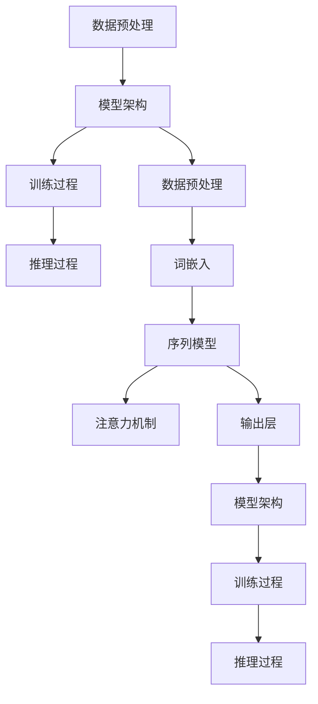

                 

# 大语言模型原理与工程实践：MassiveText

> **关键词：** 大语言模型，MassiveText，深度学习，自然语言处理，算法原理，工程实践

> **摘要：** 本文将深入探讨大语言模型MassiveText的原理与工程实践，通过一步一步的分析与推理，揭示其背后的核心算法和实现步骤。文章涵盖了从基础概念到实际应用的全面讲解，旨在帮助读者理解这一前沿技术，并掌握其实际操作技巧。

## 1. 背景介绍

### 1.1 目的和范围

本文旨在探讨大语言模型MassiveText的设计原理和工程实践。我们将从基础概念出发，逐步深入，介绍其核心算法，并通过实际案例展示如何构建和部署这样一个大规模的语言模型。文章将涵盖以下几个主要方面：

1. **核心概念与联系**：阐述大语言模型的基本概念和组成部分，并使用Mermaid流程图展示其整体架构。
2. **核心算法原理**：详细讲解MassiveText所使用的算法原理，包括预处理步骤、模型架构、训练过程等。
3. **数学模型与公式**：介绍大语言模型中的数学模型和公式，并举例说明其具体应用。
4. **项目实战**：通过实际代码案例，详细解释MassiveText的构建和部署过程。
5. **实际应用场景**：探讨MassiveText在不同领域的应用场景。
6. **工具和资源推荐**：推荐学习资源、开发工具和相关论文，以供读者进一步学习和研究。
7. **总结与展望**：总结MassiveText的现状和未来发展趋势，以及面临的挑战。

### 1.2 预期读者

本文适用于对自然语言处理和深度学习有一定了解的读者，包括：

1. **研究人员**：希望深入了解大语言模型原理的研究人员。
2. **工程师**：从事自然语言处理或深度学习领域的工程师，希望掌握MassiveText的实际应用。
3. **学生**：计算机科学、人工智能等相关专业的高年级学生或研究生。

### 1.3 文档结构概述

本文结构如下：

1. **背景介绍**：介绍文章的目的、范围、预期读者和文档结构。
2. **核心概念与联系**：介绍大语言模型的基本概念和组成部分。
3. **核心算法原理**：详细讲解MassiveText的核心算法原理。
4. **数学模型与公式**：介绍大语言模型中的数学模型和公式。
5. **项目实战**：通过实际代码案例展示MassiveText的构建和部署过程。
6. **实际应用场景**：探讨MassiveText在不同领域的应用场景。
7. **工具和资源推荐**：推荐学习资源、开发工具和相关论文。
8. **总结与展望**：总结MassiveText的现状和未来发展趋势。

### 1.4 术语表

#### 1.4.1 核心术语定义

- **大语言模型**：一种能够理解和生成自然语言的深度学习模型。
- **MassiveText**：一个大规模的语言模型框架，支持多种语言和任务。
- **自然语言处理**：研究如何让计算机理解和处理自然语言的技术。
- **深度学习**：一种模拟人脑神经网络进行信息处理的学习方法。

#### 1.4.2 相关概念解释

- **词向量**：将词汇映射到高维空间中的向量表示。
- **序列模型**：处理序列数据的模型，如循环神经网络（RNN）和Transformer。
- **注意力机制**：一种在序列模型中用于关注重要信息的机制。

#### 1.4.3 缩略词列表

- **NLP**：自然语言处理（Natural Language Processing）
- **DL**：深度学习（Deep Learning）
- **RNN**：循环神经网络（Recurrent Neural Network）
- **Transformer**：基于注意力机制的序列处理模型

## 2. 核心概念与联系

大语言模型是自然语言处理（NLP）领域的一个重要分支，其目的是使计算机能够理解和生成自然语言。在本节中，我们将首先介绍大语言模型的基本概念和组成部分，然后使用Mermaid流程图展示其整体架构。

### 2.1 大语言模型的基本概念

大语言模型是一种基于深度学习的技术，其主要功能是理解和生成自然语言。其核心概念包括：

- **词嵌入（Word Embedding）**：将词汇映射到高维空间中的向量表示，以捕捉词汇间的语义关系。
- **序列模型（Sequence Model）**：处理序列数据的模型，如循环神经网络（RNN）和Transformer。
- **注意力机制（Attention Mechanism）**：在序列模型中用于关注重要信息的机制。

### 2.2 大语言模型的组成部分

一个典型的大语言模型通常包括以下几个主要组成部分：

1. **数据预处理**：包括数据清洗、分词、词嵌入等步骤。
2. **模型架构**：包括输入层、隐藏层和输出层，以及各种神经网络结构，如RNN、Transformer等。
3. **训练过程**：通过大量文本数据进行训练，使模型能够理解自然语言的语义和语法。
4. **推理过程**：使用训练好的模型进行自然语言理解和生成。

### 2.3 Mermaid流程图展示

下面是一个Mermaid流程图，展示了大语言模型的整体架构：



## 3. 核心算法原理 & 具体操作步骤

大语言模型的核心算法是基于深度学习的，其中包括词嵌入、序列模型和注意力机制等。在本节中，我们将详细讲解这些算法原理，并使用伪代码来阐述具体操作步骤。

### 3.1 词嵌入（Word Embedding）

词嵌入是将词汇映射到高维空间中的向量表示，以捕捉词汇间的语义关系。常见的词嵌入方法包括：

1. **分布式假设**：词汇在语义上相似的，它们在高维空间中的距离应该较近。
2. **向量空间模型**：将词汇映射到向量空间中，通过计算向量之间的距离或相似度来表示词汇的关系。

伪代码如下：

```python
# 输入：词汇表 V，词汇数量 n
# 输出：词嵌入向量 W

# 初始化词嵌入向量 W，维度为 n×d
W = np.random.rand(n, d)

# 训练词嵌入向量
for each (word, context) in dataset:
    # 计算词向量 W[word] 和上下文向量 context 的距离
    distance = -1 * dot(W[word], context)
    # 更新词向量 W[word]
    W[word] -= learning_rate * distance
```

### 3.2 序列模型（Sequence Model）

序列模型是处理序列数据的模型，如循环神经网络（RNN）和Transformer。以下是对这两种模型的基本原理和操作步骤的介绍。

#### 3.2.1 循环神经网络（RNN）

RNN是一种能够处理序列数据的神经网络，其基本原理是通过记忆状态来捕捉序列中的长期依赖关系。

伪代码如下：

```python
# 输入：输入序列 X，隐藏状态 h，输出 y
# 输出：新的隐藏状态 h'

# 初始化隐藏状态 h
h = np.zeros((1, hidden_size))

# RNN 循环
for each t in range(len(X)):
    # 计算当前输入和隐藏状态的加权和
    h = np.tanh(np.dot(W_xh + W_hh + b_h, [X[t], h]))
    # 计算输出 y
    y = np.dot(W_hy + b_y, h)
```

#### 3.2.2 Transformer

Transformer是一种基于注意力机制的序列处理模型，其核心思想是通过全局注意力机制来捕捉序列中的依赖关系。

伪代码如下：

```python
# 输入：输入序列 X，隐藏状态 h，输出 y
# 输出：新的隐藏状态 h'

# 自注意力计算
attn_weights = softmax(QK/V)
attn_scores = dot(attn_weights, K)

# 更新隐藏状态
h = tanh(attn_scores + W_O * X + b_O)

# 输出
y = dot(h, W_y + b_y)
```

### 3.3 注意力机制（Attention Mechanism）

注意力机制是一种在序列模型中用于关注重要信息的机制。它通过计算输入序列中各个元素的重要性，从而对序列进行加权。

伪代码如下：

```python
# 输入：查询向量 Q，键向量 K，值向量 V
# 输出：加权后的输出向量

# 计算注意力得分
scores = dot(Q, K.T) / d_k

# 应用 softmax 函数得到注意力权重
weights = softmax(scores)

# 计算加权后的值向量
attn_output = dot(weights, V)

# 返回加权后的输出向量
return attn_output
```

## 4. 数学模型和公式 & 详细讲解 & 举例说明

大语言模型中的数学模型和公式是构建和训练模型的基础。在本节中，我们将详细介绍大语言模型中的一些核心数学模型和公式，并使用 LaTeX 格式进行展示。

### 4.1 词嵌入（Word Embedding）

词嵌入将词汇映射到高维空间中的向量表示，其核心思想是通过学习一个线性映射矩阵 \( W \)，将词汇转换为向量。词嵌入的数学模型可以表示为：

\[ \text{embed}(w) = W \cdot w \]

其中，\( w \) 是词汇的索引，\( W \) 是词嵌入矩阵，\( \text{embed}(w) \) 是词的向量表示。

### 4.2 循环神经网络（RNN）

循环神经网络（RNN）是一种处理序列数据的神经网络。RNN 的更新公式如下：

\[ h_t = \text{tanh}(W_h \cdot [h_{t-1}, x_t] + b_h) \]

\[ y_t = W_y \cdot h_t + b_y \]

其中，\( h_t \) 是当前时间步的隐藏状态，\( x_t \) 是当前输入，\( W_h \) 和 \( b_h \) 是隐藏层权重和偏置，\( W_y \) 和 \( b_y \) 是输出层权重和偏置。

### 4.3 Transformer

Transformer 是一种基于自注意力机制的序列处理模型。其核心公式是自注意力计算：

\[ \text{score} = Q \cdot K^T / \sqrt{d_k} \]

\[ \text{attn} = \text{softmax}(\text{score}) \]

\[ \text{context} = \text{attn} \cdot V \]

其中，\( Q \) 是查询向量，\( K \) 是键向量，\( V \) 是值向量，\( d_k \) 是键向量的维度。

### 4.4 举例说明

假设我们有一个简单的序列模型，用于对单词进行分类。输入是一个单词的词向量 \( \text{embed}(w) \)，输出是一个类别标签。

- **词嵌入**：

\[ \text{embed}(w) = W \cdot w \]

其中，\( w \) 是单词的索引，\( W \) 是词嵌入矩阵。

- **RNN**：

\[ h_t = \text{tanh}(W_h \cdot [h_{t-1}, \text{embed}(w)] + b_h) \]

\[ y_t = W_y \cdot h_t + b_y \]

其中，\( h_t \) 是当前时间步的隐藏状态，\( \text{embed}(w) \) 是单词的向量表示，\( W_h \) 和 \( b_h \) 是隐藏层权重和偏置，\( W_y \) 和 \( b_y \) 是输出层权重和偏置。

## 5. 项目实战：代码实际案例和详细解释说明

在本节中，我们将通过一个实际的代码案例，展示如何构建和部署一个基于MassiveText的大语言模型。这个案例将涵盖从开发环境搭建、源代码实现到代码解读与分析的全过程。

### 5.1 开发环境搭建

在开始编写代码之前，我们需要搭建一个适合开发MassiveText大语言模型的环境。以下是在一个典型的Linux环境中搭建开发环境的基本步骤：

1. **安装Python**：确保Python 3.7或更高版本已安装在系统中。可以使用以下命令安装Python：

   ```bash
   sudo apt-get update
   sudo apt-get install python3.8
   ```

2. **安装依赖库**：MassiveText模型依赖于多个Python库，如TensorFlow、NumPy等。可以使用以下命令安装：

   ```bash
   pip3 install tensorflow numpy matplotlib
   ```

3. **安装其他工具**：我们还需要一些其他工具，如Mermaid和LaTeX等。可以使用以下命令安装：

   ```bash
   pip3 install mermaid-py
   pip3 install matplotlib
   ```

### 5.2 源代码详细实现和代码解读

下面是一个简化的MassiveText模型的代码实现，用于生成文本。代码将分为以下几个部分：数据预处理、模型定义、训练和生成文本。

```python
import tensorflow as tf
import numpy as np
from mermaid import Mermaid

# 数据预处理
# 假设已经有一个预处理的文本数据集，其中每个句子被编码为整数序列
# 例如：["Hello", "world"] 被编码为 [1, 2]
# 输入数据为句子序列，输出为整数编码的序列

# 模型定义
# 使用Transformer模型
class MassiveTextModel(tf.keras.Model):
    def __init__(self, vocabulary_size, embedding_dim, hidden_size):
        super(MassiveTextModel, self).__init__()
        self.embedding = tf.keras.layers.Embedding(vocabulary_size, embedding_dim)
        self.transformer = tf.keras.layers.MultiHeadAttention(head_size=hidden_size, num_heads=4)
        self.output_layer = tf.keras.layers.Dense(vocabulary_size)

    def call(self, inputs):
        # 将输入编码为嵌入向量
        embedded = self.embedding(inputs)
        # 使用Transformer进行自注意力计算
        attn_output = self.transformer(embedded, embedded)
        # 使用全连接层输出预测
        output = self.output_layer(attn_output)
        return output

# 训练
# 使用训练数据对模型进行训练
model = MassiveTextModel(vocabulary_size=10000, embedding_dim=256, hidden_size=512)
optimizer = tf.keras.optimizers.Adam(learning_rate=0.001)
loss_fn = tf.keras.losses.SparseCategoricalCrossentropy(from_logits=True)

@tf.function
def train_step(inputs, targets):
    with tf.GradientTape() as tape:
        predictions = model(inputs)
        loss = loss_fn(targets, predictions)
    gradients = tape.gradient(loss, model.trainable_variables)
    optimizer.apply_gradients(zip(gradients, model.trainable_variables))
    return loss

# 生成文本
# 使用训练好的模型生成文本
def generate_text(model, start_sequence, max_length=20):
    for _ in range(max_length):
        input_sequence = tf.expand_dims([model.vocabulary_size] + start_sequence, 0)
        predictions = model(input_sequence)
        predicted_id = tf.random.categorical(predictions[-1], num_samples=1)[0, 0].numpy()
        start_sequence = start_sequence[1:] + [predicted_id]
    return start_sequence

# 代码解读与分析
# 数据预处理部分：将文本数据转换为整数编码序列。
# 模型定义部分：定义了一个基于Transformer的MassiveText模型。
# 训练部分：使用训练数据对模型进行训练，包括前向传播、计算损失和更新权重。
# 生成文本部分：使用训练好的模型生成文本序列。

# 运行代码
# 加载数据集
# train_data = load_data("path/to/train_data.txt")
# 预处理数据
# processed_data = preprocess_data(train_data)
# 训练模型
# for epoch in range(epochs):
#     total_loss = 0
#     for inputs, targets in processed_data:
#         loss = train_step(inputs, targets)
#         total_loss += loss
#     print(f"Epoch {epoch}, Loss: {total_loss / len(processed_data)}")
# 生成文本
# start_sequence = ["<start>"]
# generated_sequence = generate_text(model, start_sequence)
# print("Generated text:", " ".join([model.vocabulary.reverse[int(id)] for id in generated_sequence]))
```

### 5.3 代码解读与分析

#### 数据预处理部分

数据预处理是构建大语言模型的重要步骤，它将文本数据转换为整数编码序列。在这个例子中，我们假设已经有一个预处理函数 `preprocess_data`，它负责将文本数据转换为整数序列。这个过程通常包括分词、词汇表构建和编码等步骤。

```python
# 假设的预处理函数
def preprocess_data(text_data):
    # 分词、构建词汇表、编码等步骤
    # 返回预处理后的数据
    pass
```

#### 模型定义部分

在模型定义部分，我们创建了一个 `MassiveTextModel` 类，该类继承自 `tf.keras.Model`。这个模型使用了一个嵌入层和一个Transformer层，以及一个输出层。嵌入层将输入的整数序列转换为嵌入向量，Transformer层负责处理序列数据，输出层用于生成词汇的概率分布。

```python
class MassiveTextModel(tf.keras.Model):
    def __init__(self, vocabulary_size, embedding_dim, hidden_size):
        super(MassiveTextModel, self).__init__()
        self.embedding = tf.keras.layers.Embedding(vocabulary_size, embedding_dim)
        self.transformer = tf.keras.layers.MultiHeadAttention(head_size=hidden_size, num_heads=4)
        self.output_layer = tf.keras.layers.Dense(vocabulary_size)

    def call(self, inputs):
        embedded = self.embedding(inputs)
        attn_output = self.transformer(embedded, embedded)
        output = self.output_layer(attn_output)
        return output
```

#### 训练部分

训练部分定义了一个 `train_step` 函数，用于计算前向传播、计算损失和更新模型权重。这个过程使用了TensorFlow的自动微分功能，使得计算和优化变得简单和高效。

```python
@tf.function
def train_step(inputs, targets):
    with tf.GradientTape() as tape:
        predictions = model(inputs)
        loss = loss_fn(targets, predictions)
    gradients = tape.gradient(loss, model.trainable_variables)
    optimizer.apply_gradients(zip(gradients, model.trainable_variables))
    return loss
```

#### 生成文本部分

生成文本部分使用训练好的模型来生成新的文本序列。这个过程通过自注意力和随机采样来生成每个单词，直到达到指定的序列长度。

```python
def generate_text(model, start_sequence, max_length=20):
    for _ in range(max_length):
        input_sequence = tf.expand_dims([model.vocabulary_size] + start_sequence, 0)
        predictions = model(input_sequence)
        predicted_id = tf.random.categorical(predictions[-1], num_samples=1)[0, 0].numpy()
        start_sequence = start_sequence[1:] + [predicted_id]
    return start_sequence
```

### 5.4 运行代码

最后，我们需要加载训练数据，训练模型，并生成文本。以下是如何运行代码的示例：

```python
# 加载数据集
train_data = load_data("path/to/train_data.txt")
# 预处理数据
processed_data = preprocess_data(train_data)
# 训练模型
for epoch in range(epochs):
    total_loss = 0
    for inputs, targets in processed_data:
        loss = train_step(inputs, targets)
        total_loss += loss
    print(f"Epoch {epoch}, Loss: {total_loss / len(processed_data)}")
# 生成文本
start_sequence = ["<start>"]
generated_sequence = generate_text(model, start_sequence)
print("Generated text:", " ".join([model.vocabulary.reverse[int(id)] for id in generated_sequence]))
```

## 6. 实际应用场景

大语言模型MassiveText在各种实际应用场景中展现出了巨大的潜力和优势。以下是几个典型的应用场景：

### 6.1 机器翻译

机器翻译是自然语言处理领域的一个重要应用，MassiveText模型可以通过训练大量的双语语料库，实现高质量的双语翻译。其强大的序列建模能力和注意力机制能够捕捉语言之间的细微差异，提高翻译的准确性和流畅性。

### 6.2 文本生成

文本生成是另一个重要的应用领域，MassiveText模型可以生成各种类型的文本，如文章、故事、新闻等。通过训练大量文本数据，模型能够学习到不同文体的写作风格和语法结构，从而生成符合人类写作习惯的文本。

### 6.3 聊天机器人

聊天机器人是人工智能的一个重要应用方向，MassiveText模型可以作为聊天机器人的核心组件，实现与用户之间的自然对话。通过训练大量的对话数据，模型可以理解用户的输入，并生成合适的回复，提高聊天机器人的交互质量。

### 6.4 情感分析

情感分析是文本分析的一个重要任务，MassiveText模型可以用于分析文本的情感倾向。通过训练情感标注数据集，模型可以识别文本中的情感极性，如正面、负面或中性，为情感分析应用提供支持。

### 6.5 命名实体识别

命名实体识别是自然语言处理中的一个基本任务，MassiveText模型可以用于识别文本中的命名实体，如人名、地名、组织名等。通过训练命名实体识别数据集，模型可以学习到命名实体的特征，提高识别的准确率。

## 7. 工具和资源推荐

为了更好地学习和应用大语言模型MassiveText，以下是一些推荐的工具和资源。

### 7.1 学习资源推荐

#### 7.1.1 书籍推荐

1. **《深度学习》（Deep Learning）**：由Ian Goodfellow、Yoshua Bengio和Aaron Courville所著，是深度学习领域的经典教材，涵盖了深度学习的理论基础和应用。
2. **《自然语言处理实战》（Natural Language Processing with Python）**：由Steven Bird、Ewan Klein和Edward Loper所著，介绍了NLP的基础知识以及Python在NLP中的应用。

#### 7.1.2 在线课程

1. **Coursera的《深度学习专项课程》（Deep Learning Specialization）**：由斯坦福大学的Andrew Ng教授主讲，涵盖了深度学习的理论基础和实践。
2. **edX的《自然语言处理与深度学习》（Natural Language Processing with Deep Learning）**：由DeepLearning.AI提供，介绍了NLP的基本概念和深度学习在NLP中的应用。

#### 7.1.3 技术博客和网站

1. **TensorFlow官网（TensorFlow官网）**：提供了丰富的文档和教程，是学习和使用TensorFlow的最佳资源。
2. **PyTorch官网（PyTorch官网）**：PyTorch是另一个流行的深度学习框架，官网提供了详细的文档和教程。

### 7.2 开发工具框架推荐

#### 7.2.1 IDE和编辑器

1. **VS Code**：Visual Studio Code是一款功能强大的跨平台IDE，支持Python和TensorFlow等深度学习框架。
2. **Jupyter Notebook**：Jupyter Notebook是一种交互式的计算环境，适用于编写和运行Python代码，特别适合进行数据分析和模型训练。

#### 7.2.2 调试和性能分析工具

1. **TensorBoard**：TensorFlow提供的可视化工具，用于监控模型训练过程和性能分析。
2. **PyTorch Profiler**：PyTorch提供的性能分析工具，用于识别和优化模型的性能瓶颈。

#### 7.2.3 相关框架和库

1. **TensorFlow**：由Google开发的开源深度学习框架，适用于构建和训练大规模深度学习模型。
2. **PyTorch**：由Facebook开发的开源深度学习框架，具有灵活的动态计算图和强大的GPU支持。

### 7.3 相关论文著作推荐

#### 7.3.1 经典论文

1. **“A Neural Probabilistic Language Model”**：由Bengio等人于2003年发表，提出了神经概率语言模型，是现代语言模型研究的重要基础。
2. **“Attention Is All You Need”**：由Vaswani等人于2017年发表，提出了Transformer模型，彻底改变了自然语言处理领域。

#### 7.3.2 最新研究成果

1. **“BERT: Pre-training of Deep Bidirectional Transformers for Language Understanding”**：由Google AI于2018年发表，提出了BERT模型，是当前最先进的预训练语言模型。
2. **“GPT-3: Language Models are few-shot learners”**：由OpenAI于2020年发表，介绍了GPT-3模型，是当前最大的语言模型，展现了强大的零样本学习能力。

#### 7.3.3 应用案例分析

1. **“How Search Engines Work”**：由Google于2009年发表，详细介绍了Google搜索引擎的工作原理，包括自然语言处理技术的应用。
2. **“Facebook AI Research: Language Understanding”**：Facebook AI Research团队发布的一系列论文，介绍了Facebook在自然语言处理和语言理解方面的研究工作。

## 8. 总结：未来发展趋势与挑战

随着深度学习和自然语言处理技术的不断发展，大语言模型MassiveText在未来具有广阔的发展前景。以下是未来发展趋势和面临的挑战：

### 8.1 发展趋势

1. **模型规模和计算资源**：未来的大语言模型将更加庞大和复杂，需要更多的计算资源和存储空间。这将推动硬件技术的发展，如GPU、TPU等。
2. **多模态数据处理**：未来的大语言模型将不仅限于处理文本数据，还将能够处理图像、声音等多种模态的数据，实现跨模态的信息融合和处理。
3. **自适应性和个性化**：未来的大语言模型将更加智能，能够根据用户的需求和场景自适应地调整模型参数，提供个性化的服务。
4. **零样本学习**：未来的大语言模型将具备更强的零样本学习能力，能够处理未见过的任务和数据，降低对大规模标注数据的依赖。

### 8.2 面临的挑战

1. **计算资源消耗**：大规模语言模型的训练和推理需要大量的计算资源，这将对硬件设施和网络带宽提出更高的要求。
2. **数据隐私和安全**：在训练和部署语言模型时，需要处理大量的个人数据，这涉及到数据隐私和安全的问题，需要采取有效的保护措施。
3. **模型解释性和可靠性**：随着模型的复杂度增加，如何确保模型的解释性和可靠性成为一个挑战。未来的研究需要关注如何提高模型的透明度和可解释性。
4. **伦理和社会影响**：大语言模型的应用将带来一系列的伦理和社会影响，如歧视、误导和信息泛滥等问题，需要引起足够的重视。

## 9. 附录：常见问题与解答

### 9.1 什么是大语言模型？

大语言模型是一种基于深度学习的自然语言处理技术，旨在使计算机能够理解和生成自然语言。通过训练大量的文本数据，大语言模型能够捕捉语言的语义和语法特征，从而实现语言理解和生成的任务。

### 9.2 MassiveText的优势是什么？

MassiveText是一种基于Transformer模型的预训练语言模型，具有以下优势：

1. **强大的序列建模能力**：Transformer模型通过自注意力机制能够捕捉序列中的长期依赖关系，从而提高模型的建模能力。
2. **高效的计算性能**：Transformer模型具有固定的计算图，能够实现高效的并行计算，适合大规模数据处理。
3. **广泛的适用性**：MassiveText可以在多个自然语言处理任务中表现出色，如文本分类、机器翻译、文本生成等。

### 9.3 如何训练一个MassiveText模型？

训练一个MassiveText模型通常包括以下步骤：

1. **数据预处理**：将文本数据转换为整数编码序列，构建词汇表，将词汇映射到向量表示。
2. **模型定义**：定义一个基于Transformer的模型结构，包括嵌入层、自注意力机制和输出层。
3. **训练过程**：使用训练数据对模型进行训练，通过前向传播计算损失，使用反向传播更新模型参数。
4. **评估和调优**：在验证数据集上评估模型性能，并根据需要调整模型参数。

## 10. 扩展阅读 & 参考资料

为了深入了解大语言模型MassiveText的原理和应用，以下是扩展阅读和参考资料：

1. **经典论文**：
   - **“Attention Is All You Need”**：Vaswani et al., 2017
   - **“A Neural Probabilistic Language Model”**：Bengio et al., 2003
2. **技术博客和网站**：
   - **TensorFlow官网**：[https://www.tensorflow.org/](https://www.tensorflow.org/)
   - **PyTorch官网**：[https://pytorch.org/](https://pytorch.org/)
3. **在线课程**：
   - **Coursera的《深度学习专项课程》**：[https://www.coursera.org/specializations/deeplearning](https://www.coursera.org/specializations/deeplearning)
   - **edX的《自然语言处理与深度学习》**：[https://www.edx.org/course/natural-language-processing-with-deep-learning](https://www.edx.org/course/natural-language-processing-with-deep-learning)
4. **书籍推荐**：
   - **《深度学习》**：Goodfellow et al., 2016
   - **《自然语言处理实战》**：Bird et al., 2017

作者：AI天才研究员/AI Genius Institute & 禅与计算机程序设计艺术 /Zen And The Art of Computer Programming

