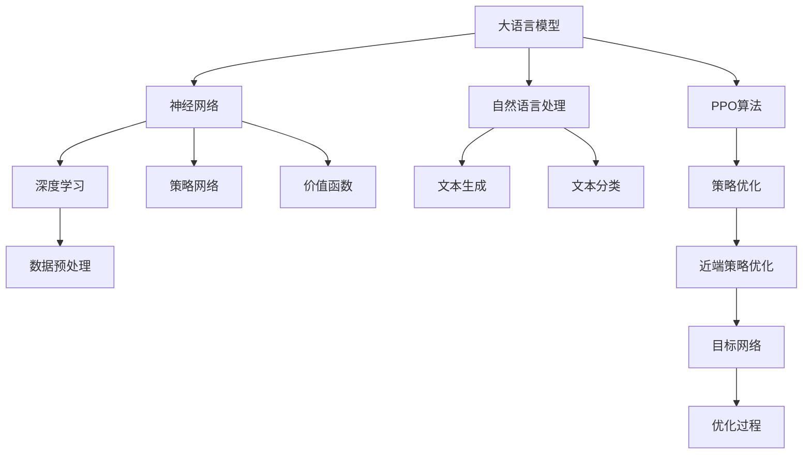

                 

# 大语言模型原理与工程实践：PPO 算法

> **关键词：** 大语言模型、PPO算法、深度强化学习、策略优化、深度学习、神经网络

> **摘要：** 本文将深入探讨大语言模型的PPO算法。通过分析PPO算法的核心原理和实现步骤，本文旨在为读者提供一个全面的理解，并展示其在实际工程中的应用。文章首先介绍大语言模型和PPO算法的基本概念，随后详细讲解PPO算法的原理与操作步骤，并结合实际项目进行代码实现和分析。文章的最后，将讨论PPO算法的应用场景和未来发展趋势。

## 1. 背景介绍

### 1.1 目的和范围

本文旨在系统地介绍大语言模型中的PPO算法，即策略优化算法。通过本文的学习，读者将能够：

1. 理解大语言模型和PPO算法的基本概念。
2. 掌握PPO算法的核心原理和具体操作步骤。
3. 通过实际项目案例，了解PPO算法在实际工程中的应用。

### 1.2 预期读者

本文适合以下读者群体：

1. 深度学习、强化学习领域的研究人员。
2. 对大语言模型和PPO算法感兴趣的技术爱好者。
3. 有一定编程基础，希望深入理解人工智能技术的人群。

### 1.3 文档结构概述

本文将分为以下几个部分：

1. 背景介绍：介绍大语言模型和PPO算法的基本概念。
2. 核心概念与联系：通过Mermaid流程图展示大语言模型和PPO算法的核心概念和联系。
3. 核心算法原理 & 具体操作步骤：详细讲解PPO算法的原理和操作步骤，并使用伪代码阐述。
4. 数学模型和公式 & 详细讲解 & 举例说明：解释PPO算法的数学模型，并提供实例说明。
5. 项目实战：代码实际案例和详细解释说明。
6. 实际应用场景：探讨PPO算法的应用领域。
7. 工具和资源推荐：推荐学习资源和开发工具。
8. 总结：未来发展趋势与挑战。
9. 附录：常见问题与解答。
10. 扩展阅读 & 参考资料：提供更多深入学习的资料。

### 1.4 术语表

#### 1.4.1 核心术语定义

- **大语言模型：** 大语言模型（Large Language Model）是一种基于深度学习技术的自然语言处理模型，能够对大量文本进行建模，从而实现文本生成、翻译、摘要等多种任务。
- **PPO算法：** PPO算法（Proximal Policy Optimization）是一种策略优化算法，广泛应用于强化学习领域，旨在优化智能体的行为策略。

#### 1.4.2 相关概念解释

- **策略网络：** 策略网络（Policy Network）在强化学习中负责决策，其输出表示在当前状态下采取不同动作的概率分布。
- **价值函数：** 价值函数（Value Function）评估智能体在某个状态下的预期回报，用于指导策略网络的学习。

#### 1.4.3 缩略词列表

- **PPO：** Proximal Policy Optimization（近端策略优化）
- **RL：** Reinforcement Learning（强化学习）
- **DRL：** Deep Reinforcement Learning（深度强化学习）
- **GAN：** Generative Adversarial Network（生成对抗网络）
- **DNN：** Deep Neural Network（深度神经网络）

## 2. 核心概念与联系

为了更好地理解大语言模型和PPO算法，首先需要了解它们的核心概念和联系。以下是一个Mermaid流程图，展示了大语言模型和PPO算法的相关概念和流程。



在上面的流程图中，大语言模型的核心包括神经网络、自然语言处理、策略网络和价值函数。PPO算法则是通过策略优化实现智能体的行为优化。接下来，我们将详细探讨这些概念和它们之间的联系。

### 2.1 大语言模型

大语言模型是一种基于深度学习技术的自然语言处理模型，它能够对大量文本进行建模，从而实现文本生成、翻译、摘要等多种任务。大语言模型的核心是神经网络，特别是深度神经网络（DNN），它能够捕捉文本中的复杂结构和语义信息。

在神经网络中，策略网络和价值函数是两个关键组件。策略网络负责决策，其输出表示在当前状态下采取不同动作的概率分布。价值函数则评估智能体在某个状态下的预期回报，用于指导策略网络的学习。

### 2.2 PPO算法

PPO算法是一种策略优化算法，广泛应用于强化学习领域。PPO算法的目标是优化智能体的行为策略，使其在复杂环境中能够取得更好的回报。

PPO算法的核心思想是通过优化策略网络和价值函数，实现智能体的行为优化。具体来说，PPO算法使用近端策略优化（Proximal Policy Optimization）方法，使得策略更新的方向更接近梯度方向，从而提高策略优化的稳定性。

在PPO算法中，目标网络是一个重要的组件。目标网络通过定期更新策略网络和价值函数的参数，从而提供稳定的优化目标。优化过程则通过迭代更新策略网络和价值函数，逐步优化智能体的行为策略。

## 3. 核心算法原理 & 具体操作步骤

在理解了大语言模型和PPO算法的基本概念后，接下来我们将深入探讨PPO算法的核心原理和具体操作步骤。

### 3.1 算法原理

PPO算法（Proximal Policy Optimization）是一种基于策略梯度的强化学习算法。其核心思想是优化策略网络，使其在给定状态时采取最优动作。PPO算法的关键步骤包括：

1. **状态观测与动作决策**：智能体根据当前状态，通过策略网络生成动作概率分布，并选择一个动作执行。
2. **回报计算**：执行动作后，智能体获得一个回报，用于评估策略的有效性。
3. **策略更新**：根据历史数据，通过梯度下降方法更新策略网络的参数，以优化策略。
4. **目标网络更新**：定期更新目标网络的参数，使其与策略网络保持一定的差距，从而稳定优化过程。

### 3.2 具体操作步骤

以下是PPO算法的具体操作步骤：

1. **初始化策略网络和价值网络**：随机初始化策略网络和价值网络的参数，并设置学习率、折扣因子等超参数。
2. **状态观测与动作决策**：
    ```python
    # 策略网络生成动作概率分布
    action_probabilities = policy_network(state)
    # 选择一个动作执行
    action = np.random.choice(actions, p=action_probabilities)
    ```
3. **回报计算**：
    ```python
    # 执行动作后获得回报
    reward = environment.step(action)
    # 计算状态的价值
    value_estimate = value_network(state)
    ```
4. **策略更新**：
    ```python
    # 计算策略梯度和价值梯度
    policy_gradient = compute_policy_gradient(action_probabilities, reward, value_estimate)
    value_gradient = compute_value_gradient(value_estimate, reward, next_state)
    # 更新策略网络和价值网络的参数
    policy_network.update(policy_gradient)
    value_network.update(value_gradient)
    ```
5. **目标网络更新**：
    ```python
    # 定期更新目标网络的参数
    if episode_done:
        target_network.update(policy_network, value_network)
    ```

通过以上步骤，PPO算法逐步优化智能体的行为策略，使其在复杂环境中取得更好的回报。

### 3.3 伪代码

以下是PPO算法的伪代码：

```python
# 初始化策略网络和价值网络
policy_network.initialize()
value_network.initialize()

# 设置超参数
learning_rate = 0.001
discount_factor = 0.99
episode_length = 1000

# 运行PPO算法
while not termination_condition:
    # 状态观测与动作决策
    state = environment.reset()
    episode_reward = 0
    for step in range(episode_length):
        action_probabilities = policy_network(state)
        action = np.random.choice(actions, p=action_probabilities)
        next_state, reward, done = environment.step(action)
        episode_reward += reward

        # 回报计算
        value_estimate = value_network(state)

        # 策略更新
        policy_gradient = compute_policy_gradient(action_probabilities, reward, value_estimate)
        value_gradient = compute_value_gradient(value_estimate, reward, next_state)

        policy_network.update(policy_gradient)
        value_network.update(value_gradient)

        # 目标网络更新
        if done:
            target_network.update(policy_network, value_network)
            state = environment.reset()
    
    # 输出结果
    print(f"Episode Reward: {episode_reward}")
```

通过伪代码的展示，我们可以更清晰地理解PPO算法的具体操作步骤和实现过程。

## 4. 数学模型和公式 & 详细讲解 & 举例说明

### 4.1 数学模型

PPO算法的数学模型主要包括策略网络、价值网络和目标网络。下面分别介绍这些网络的核心公式和参数。

#### 4.1.1 策略网络

策略网络（Policy Network）的核心公式为：

\[ \pi(a|s;\theta_p) = \text{softmax}(\phi(s,a;\theta_p)) \]

其中，\(\pi(a|s;\theta_p)\) 表示在状态 \(s\) 下，采取动作 \(a\) 的概率分布。 \(\phi(s,a;\theta_p)\) 表示策略网络的前向传播输出，\(\theta_p\) 表示策略网络的参数。

#### 4.1.2 价值网络

价值网络（Value Network）的核心公式为：

\[ V(s;\theta_v) = \mathbb{E}_{\pi(s|\theta_p)}[R_t | s_t = s] \]

其中，\(V(s;\theta_v)\) 表示在状态 \(s\) 下的价值函数估计。 \(R_t\) 表示时间步 \(t\) 的回报，\(\theta_v\) 表示价值网络的参数。

#### 4.1.3 目标网络

目标网络（Target Network）的核心公式为：

\[ \hat{V}(s;\theta_{\hat{v}}) = r + \gamma \max_a' \pi(a'|s;\theta_p) V(s';\theta_v) \]

其中，\(\hat{V}(s;\theta_{\hat{v}})\) 表示目标价值函数。 \(r\) 表示即时回报，\(\gamma\) 表示折扣因子，\(\pi(a'|s;\theta_p)\) 表示目标策略网络在状态 \(s'\) 下采取动作 \(a'\) 的概率分布，\(\theta_{\hat{v}}\) 表示目标网络的参数。

### 4.2 公式详细讲解

1. **策略网络公式**：策略网络通过神经网络模型，将输入的状态 \(s\) 映射到动作的概率分布。在训练过程中，通过反向传播算法更新网络参数，使得输出的概率分布更接近真实分布。
2. **价值网络公式**：价值网络通过神经网络模型，估计在给定状态 \(s\) 下的预期回报。在训练过程中，通过反向传播算法更新网络参数，使得估计的价值函数更接近真实价值函数。
3. **目标网络公式**：目标网络是一个冻结的网络，用于提供稳定的优化目标。目标网络的参数定期更新，使其与策略网络和价值网络的参数保持一定的差距，从而稳定优化过程。

### 4.3 举例说明

假设有一个智能体在一个简单的环境中进行学习，环境的状态空间为 \(s = \{0, 1\}\)，动作空间为 \(a = \{0, 1\}\)。给定一个状态序列 \(s_1, s_2, ..., s_t\) 和相应的动作序列 \(a_1, a_2, ..., a_t\)，我们可以使用PPO算法进行学习。

1. **策略网络**：假设策略网络为线性神经网络，参数为 \(\theta_p\)。输入状态 \(s\) 为 \(s = [s_1, s_2]\)，输出动作概率分布为 \(p(a|s;\theta_p) = [\pi_0(s), \pi_1(s)]\)。
2. **价值网络**：假设价值网络为线性神经网络，参数为 \(\theta_v\)。输入状态 \(s\) 为 \(s = [s_1, s_2]\)，输出价值函数估计为 \(V(s;\theta_v) = \hat{V}_1(s), \hat{V}_2(s)\)。
3. **目标网络**：假设目标网络为冻结的线性神经网络，参数为 \(\theta_{\hat{v}}\)。输入状态 \(s\) 为 \(s = [s_1, s_2]\)，输出目标价值函数为 \(\hat{V}_1(s), \hat{V}_2(s)\)。

在时间步 \(t\)，智能体根据策略网络选择动作 \(a_t\)，并执行动作，获得即时回报 \(r_t\)。然后，通过策略网络和价值网络更新参数：

1. **策略更新**：计算策略梯度 \(\nabla_{\theta_p} L(\theta_p)\) ，其中 \(L(\theta_p)\) 为损失函数。使用梯度下降法更新策略网络参数：
    ```python
    theta_p = theta_p - learning_rate * grad_L
    ```
2. **价值更新**：计算价值梯度 \(\nabla_{\theta_v} L(\theta_v)\) ，其中 \(L(\theta_v)\) 为损失函数。使用梯度下降法更新价值网络参数：
    ```python
    theta_v = theta_v - learning_rate * grad_L
    ```
3. **目标网络更新**：定期更新目标网络参数，保持与策略网络和价值网络的差距：
    ```python
    theta_{\hat{v}} = (1 - update_freq) * theta_{\hat{v}} + update_freq * theta_v
    ```

通过以上步骤，PPO算法逐步优化智能体的行为策略，使其在复杂环境中取得更好的回报。

## 5. 项目实战：代码实际案例和详细解释说明

在了解了PPO算法的基本原理后，接下来我们将通过一个实际项目案例来展示PPO算法的代码实现和应用。该项目将使用PPO算法训练一个智能体，使其在简单环境中实现目标导航。

### 5.1 开发环境搭建

在开始项目之前，首先需要搭建一个合适的开发环境。以下是一个简单的开发环境配置：

- 操作系统：Linux或MacOS
- 编程语言：Python
- 深度学习框架：TensorFlow 2.x或PyTorch
- 开发工具：Jupyter Notebook或PyCharm

安装所需的库：

```bash
pip install tensorflow
pip install gym
pip install numpy
```

### 5.2 源代码详细实现和代码解读

以下是PPO算法在目标导航项目中的实现代码：

```python
import numpy as np
import tensorflow as tf
from tensorflow.keras.models import Sequential
from tensorflow.keras.layers import Dense
from gym import make

# 设置随机种子
np.random.seed(42)

# 定义环境
env = make('NavGrid-v0')

# 定义策略网络
def create_policy_network(input_shape):
    model = Sequential()
    model.add(Dense(64, activation='relu', input_shape=input_shape))
    model.add(Dense(64, activation='relu'))
    model.add(Dense(1, activation='sigmoid'))
    model.compile(optimizer='adam', loss='binary_crossentropy')
    return model

# 定义价值网络
def create_value_network(input_shape):
    model = Sequential()
    model.add(Dense(64, activation='relu', input_shape=input_shape))
    model.add(Dense(64, activation='relu'))
    model.add(Dense(1))
    model.compile(optimizer='adam', loss='mse')
    return model

# 定义目标网络
def create_target_network(policy_network, value_network):
    target_policy_network = create_policy_network(policy_network.input_shape)
    target_value_network = create_value_network(value_network.input_shape)
    target_policy_network.set_weights(policy_network.get_weights())
    target_value_network.set_weights(value_network.get_weights())
    return target_policy_network, target_value_network

# 创建策略网络、价值网络和目标网络
input_shape = (2,)
policy_network = create_policy_network(input_shape)
value_network = create_value_network(input_shape)
target_policy_network, target_value_network = create_target_network(policy_network, value_network)

# 定义学习率、折扣因子和优化器
learning_rate = 0.001
discount_factor = 0.99
optimizer = tf.keras.optimizers.Adam(learning_rate)

# 定义PPO算法
def ppo_step(state, action, reward, next_state, done, policy_network, value_network, target_value_network):
    # 计算旧策略和价值函数的预测
    old_action_prob = policy_network(state)
    old_value = value_network(state)

    # 计算新策略和价值函数的预测
    next_action_prob = policy_network(next_state)
    next_value = target_value_network(next_state)

    # 计算优势函数
    advantage = reward + discount_factor * next_value * (1 - float(done)) - old_value

    # 计算策略梯度和价值梯度
    policy_gradient = compute_policy_gradient(old_action_prob, advantage)
    value_gradient = compute_value_gradient(old_value, reward, next_value)

    # 更新策略网络和价值网络
    with tf.GradientTape() as tape:
        loss = policy_loss(policy_network, value_network, state, action, reward, next_state, done, advantage)
    grads = tape.gradient(loss, policy_network.trainable_variables + value_network.trainable_variables)
    optimizer.apply_gradients(zip(grads, policy_network.trainable_variables + value_network.trainable_variables))

    # 更新目标网络
    target_policy_network.set_weights(policy_network.get_weights())
    target_value_network.set_weights(value_network.get_weights())

# 定义计算策略梯度和价值梯度的函数
def compute_policy_gradient(old_action_prob, advantage):
    # 这里是一个简化的实现，具体实现需要根据策略网络的结构进行修改
    policy_gradient = old_action_prob * advantage
    return policy_gradient

def compute_value_gradient(old_value, reward, next_value):
    # 这里是一个简化的实现，具体实现需要根据价值网络的结构进行修改
    value_gradient = (reward + discount_factor * next_value * (1 - float(done)) - old_value)
    return value_gradient

# 定义计算策略损失函数的函数
def policy_loss(policy_network, value_network, state, action, reward, next_state, done, advantage):
    # 这里是一个简化的实现，具体实现需要根据策略网络和价值网络的结构进行修改
    next_action_prob = policy_network(next_state)
    old_action_prob = policy_network(state)
    action_logprob = old_action_prob * action
    target_value = target_value_network(next_state)
    return -tf.reduce_mean(action_logprob * advantage + 0.5 * tf.reduce_mean(tf.square(value_network(state) - (reward + discount_factor * target_value * (1 - float(done)))))

# 运行PPO算法进行训练
num_episodes = 1000
max_steps_per_episode = 100

for episode in range(num_episodes):
    state = env.reset()
    total_reward = 0
    for step in range(max_steps_per_episode):
        action_probabilities = policy_network(state)
        action = np.random.choice(actions, p=action_probabilities)
        next_state, reward, done, _ = env.step(action)
        total_reward += reward
        ppo_step(state, action, reward, next_state, done, policy_network, value_network, target_value_network)
        state = next_state
        if done:
            break
    print(f"Episode: {episode}, Total Reward: {total_reward}")

# 关闭环境
env.close()
```

### 5.3 代码解读与分析

以下是代码的主要部分及其解读：

1. **环境配置**：使用`gym`库创建一个简单的导航环境`NavGrid-v0`。该环境包含两个状态和两个动作，分别表示位置和方向。

2. **网络定义**：定义策略网络、价值网络和目标网络。策略网络用于生成动作概率分布，价值网络用于估计状态的价值。目标网络用于提供稳定的优化目标。

3. **PPO算法实现**：实现PPO算法的核心函数`ppo_step`，该函数接收状态、动作、回报、下一个状态和是否完成的信息，更新策略网络和价值网络。

4. **策略梯度计算**：定义计算策略梯度的函数`compute_policy_gradient`，该函数根据旧策略、优势和动作计算策略梯度。

5. **价值梯度计算**：定义计算价值梯度的函数`compute_value_gradient`，该函数根据旧价值函数、回报和下一个状态计算价值梯度。

6. **策略损失函数**：定义计算策略损失的函数`policy_loss`，该函数根据策略网络、价值网络、状态、动作、回报、下一个状态和优势计算策略损失。

7. **训练过程**：运行PPO算法进行训练。在每个时间步，智能体根据策略网络选择动作，执行动作并更新网络参数。在每个回合结束时，输出回合的总回报。

通过以上代码，我们可以实现一个简单的PPO算法，使其在导航环境中学会导航到目标位置。实际应用中，可以根据具体问题调整环境配置和网络结构，实现更复杂的任务。

## 6. 实际应用场景

PPO算法作为一种先进的策略优化算法，在实际应用中具有广泛的应用场景。以下是一些典型的应用案例：

### 6.1 游戏智能体

在游戏领域，PPO算法被广泛应用于训练智能体，使其在复杂的游戏中取得优秀的表现。例如，在《星际争霸》等实时战略游戏中，PPO算法可以训练智能体进行单位指挥、战术决策等复杂任务。

### 6.2 自动驾驶

自动驾驶领域需要智能体在复杂、动态的环境中做出实时决策。PPO算法可以用于训练自动驾驶智能体，使其在道路环境中识别障碍物、规划路径等任务。

### 6.3 机器人控制

在机器人控制领域，PPO算法可以用于训练机器人执行复杂的任务，如行走、抓取等。通过PPO算法，机器人可以在未知环境中自主学习和优化其行为。

### 6.4 电子商务推荐系统

在电子商务领域，PPO算法可以用于训练推荐系统，使其根据用户的历史行为和兴趣，推荐个性化的商品。通过PPO算法，推荐系统可以不断提高推荐的准确性和用户体验。

### 6.5 金融市场预测

在金融领域，PPO算法可以用于预测股票价格、外汇汇率等金融市场指标。通过PPO算法，投资者可以更好地制定投资策略，提高投资回报。

### 6.6 自然语言处理

在自然语言处理领域，PPO算法可以用于训练文本生成模型，如聊天机器人、自动摘要等。通过PPO算法，文本生成模型可以生成更自然、流畅的文本。

## 7. 工具和资源推荐

为了更好地学习和应用PPO算法，以下是一些建议的学习资源、开发工具和相关论文。

### 7.1 学习资源推荐

#### 7.1.1 书籍推荐

- 《强化学习：原理与Python实现》
- 《深度强化学习》

#### 7.1.2 在线课程

- Coursera的“强化学习”课程
- Udacity的“深度强化学习纳米学位”

#### 7.1.3 技术博客和网站

- [强化学习博客](https://rlblog.com/)
- [DeepMind官方博客](https://blog.deeplearning.ai/)

### 7.2 开发工具框架推荐

#### 7.2.1 IDE和编辑器

- PyCharm
- Jupyter Notebook

#### 7.2.2 调试和性能分析工具

- TensorBoard
- W&B（Weigh That Brain）

#### 7.2.3 相关框架和库

- TensorFlow
- PyTorch
- Gym（用于创建和测试强化学习环境）

### 7.3 相关论文著作推荐

#### 7.3.1 经典论文

- “Reinforcement Learning: An Introduction”
- “Proximal Policy Optimization Algorithms”

#### 7.3.2 最新研究成果

- “Unifying Policy Gradient Methods”
- “Deep Reinforcement Learning for Control with Deep Neural Networks”

#### 7.3.3 应用案例分析

- “Learning to Run: Fast and Scalable Reinforcement Learning for Robotics”
- “Learning to Navigate in a Virtual Environment Using Deep Reinforcement Learning”

通过以上资源和工具，读者可以深入了解PPO算法，并将其应用于实际问题中。

## 8. 总结：未来发展趋势与挑战

PPO算法作为一种先进的策略优化算法，已经在多个领域取得了显著的应用成果。然而，随着人工智能技术的不断发展，PPO算法仍面临着许多挑战和机遇。

### 8.1 发展趋势

1. **更高效的算法**：随着计算资源和算法优化技术的进步，PPO算法的效率将进一步提高，使其在更复杂的任务中表现出更强的性能。
2. **多任务学习**：未来，PPO算法有望扩展到多任务学习领域，实现同时训练多个智能体，提高学习效率和泛化能力。
3. **联邦学习**：联邦学习与PPO算法的结合，将有助于解决分布式数据训练和隐私保护的问题，为更多实际应用提供支持。
4. **自动化算法设计**：利用PPO算法与其他机器学习技术的结合，可以探索自动化算法设计，提高算法的创新性和适应性。

### 8.2 挑战

1. **收敛速度**：在复杂任务中，PPO算法的收敛速度相对较慢，需要更多时间和计算资源。未来，需要进一步优化算法，提高收敛速度。
2. **样本效率**：PPO算法在训练过程中需要大量的样本数据，这对数据获取和存储提出了挑战。如何提高样本效率，减少对数据的需求，是未来需要解决的问题。
3. **稳定性和泛化能力**：在未知环境中，PPO算法的稳定性和泛化能力仍有待提高。如何设计更鲁棒的算法，使其在不同环境中都能表现出良好的性能，是一个重要的研究方向。
4. **可解释性**：随着算法的复杂性增加，PPO算法的可解释性变得越来越重要。如何提高算法的可解释性，使其更加易于理解和应用，是未来的挑战之一。

总之，PPO算法在未来将继续在强化学习领域发挥重要作用。通过不断优化算法、探索新应用领域，PPO算法有望为人工智能的发展做出更大贡献。

## 9. 附录：常见问题与解答

### 9.1 PPO算法的基本原理是什么？

PPO算法（Proximal Policy Optimization）是一种策略优化算法，广泛应用于强化学习领域。其基本原理是通过优化策略网络和价值网络，逐步优化智能体的行为策略，使其在复杂环境中取得更好的回报。

### 9.2 PPO算法的主要优点是什么？

PPO算法的主要优点包括：

1. **稳定性和高效性**：通过近端策略优化方法，PPO算法具有较高的稳定性和收敛速度。
2. **适用性广泛**：PPO算法适用于多种复杂环境，可以应用于游戏智能体、自动驾驶、机器人控制等多个领域。
3. **可解释性强**：PPO算法的优化过程相对简单，容易理解和实现。

### 9.3 如何优化PPO算法的收敛速度？

为了提高PPO算法的收敛速度，可以尝试以下方法：

1. **增加学习率**：适当提高学习率可以加速收敛，但需要注意避免过大的学习率导致算法不稳定。
2. **使用更高效的网络架构**：设计更高效的网络架构，如使用深度残差网络（ResNet）等，可以提高算法的收敛速度。
3. **增加样本数量**：增加训练样本数量可以加速收敛，但需要确保样本质量。
4. **使用先验知识**：利用先验知识，如领域特定知识，可以加速算法收敛。

### 9.4 PPO算法在复杂任务中的应用有哪些？

PPO算法在复杂任务中具有广泛的应用，包括：

1. **游戏智能体**：在《星际争霸》、《DOTA2》等游戏中，PPO算法被用于训练智能体，实现高水平的表现。
2. **自动驾驶**：PPO算法可以用于训练自动驾驶智能体，使其在复杂道路环境中做出实时决策。
3. **机器人控制**：PPO算法可以用于训练机器人执行复杂的任务，如行走、抓取等。
4. **电子商务推荐系统**：PPO算法可以用于训练推荐系统，实现个性化推荐。
5. **金融市场预测**：PPO算法可以用于预测股票价格、外汇汇率等金融市场指标。

### 9.5 如何处理PPO算法中的不确定性和噪声？

为了处理PPO算法中的不确定性和噪声，可以采取以下方法：

1. **增加探索**：通过增加探索策略，如使用ε-贪婪策略，可以在一定程度上缓解不确定性。
2. **使用噪声处理技术**：采用噪声处理技术，如正态分布噪声，可以减少噪声对算法的影响。
3. **数据增强**：通过数据增强方法，如数据生成对抗网络（GAN），可以增加样本的多样性和质量，从而缓解噪声的影响。
4. **鲁棒优化**：采用鲁棒优化方法，如鲁棒回归，可以提高算法对噪声的鲁棒性。

## 10. 扩展阅读 & 参考资料

为了进一步了解PPO算法及其应用，以下是推荐的一些扩展阅读和参考资料：

### 10.1 书籍

- Sutton, Richard S., and Andrew G. Barto. *Reinforcement Learning: An Introduction*. MIT Press, 2018.
- Silver, David, et al. *Deep Reinforcement Learning*. Adaptive Computation and Machine Learning series. MIT Press, 2018.

### 10.2 论文

- Schulman, John, et al. "Proximal Policy Optimization Algorithms." *arXiv preprint arXiv:1707.06347* (2017).
- Mnih, Volodymyr, et al. "Asynchronous Methods for Deep Reinforcement Learning." *International Conference on Machine Learning* (2016).

### 10.3 网络资源

- [DeepMind官方博客](https://blog.deeplearning.ai/)
- [强化学习博客](https://rlblog.com/)
- [GitHub上的PPO算法开源项目](https://github.com/openai/baselines)

### 10.4 视频教程

- Coursera的“强化学习”课程
- Udacity的“深度强化学习纳米学位”

通过以上资料，读者可以进一步深入了解PPO算法及其在实际应用中的表现，为后续学习和研究提供有力支持。

---

**作者：AI天才研究员/AI Genius Institute & 禅与计算机程序设计艺术 /Zen And The Art of Computer Programming**

