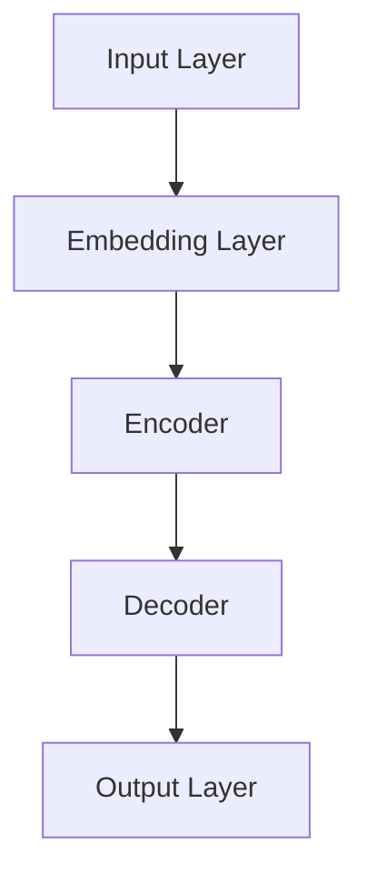

                 

# 大语言模型原理与工程实践：主要的评测维度和基准概述

## 关键词：
- 大语言模型
- 评测维度
- 基准测试
- 工程实践

## 摘要：
本文将深入探讨大语言模型的原理及其在工程实践中的应用。我们首先回顾大语言模型的发展背景，接着介绍主要的核心概念和算法原理，并详细解析其数学模型。随后，我们将通过实际项目案例，展示如何构建和优化大语言模型。此外，还将探讨大语言模型在各个领域的实际应用场景，并推荐相关工具和资源。最后，本文将对未来发展趋势与挑战进行总结，并提供常见问题与解答，以帮助读者更好地理解和应用大语言模型技术。

---

## 1. 背景介绍

### 1.1 目的和范围

本文旨在系统地介绍大语言模型的原理与工程实践，重点探讨其在各个评测维度上的表现和基准测试方法。我们将从理论基础入手，逐步深入到实际工程应用，帮助读者全面理解大语言模型的构建、优化和应用。

### 1.2 预期读者

本文适合对人工智能和自然语言处理有基本了解的读者，包括研究人员、工程师、学生以及对大语言模型感兴趣的专业人士。无论您是初学者还是专业人士，都能从本文中获得丰富的知识和启发。

### 1.3 文档结构概述

本文将按照以下结构进行组织：

1. 背景介绍：包括目的与范围、预期读者、文档结构概述和术语表。
2. 核心概念与联系：介绍大语言模型的核心概念、原理和架构。
3. 核心算法原理 & 具体操作步骤：详细阐述大语言模型的主要算法和操作步骤。
4. 数学模型和公式 & 详细讲解 & 举例说明：解析大语言模型的数学基础和实际应用。
5. 项目实战：通过实际案例展示大语言模型的构建和优化过程。
6. 实际应用场景：探讨大语言模型在不同领域的应用。
7. 工具和资源推荐：推荐学习资源和开发工具。
8. 总结：对大语言模型的发展趋势和挑战进行总结。
9. 附录：常见问题与解答。
10. 扩展阅读 & 参考资料：提供进一步的阅读材料。

### 1.4 术语表

#### 1.4.1 核心术语定义

- **大语言模型**：一种能够对自然语言文本进行建模的机器学习模型，通常具有数十亿至数万亿参数。
- **评测维度**：用于评估模型性能的各种标准，如准确性、流畅性和泛化能力。
- **基准测试**：在标准数据集上对模型性能进行评估的过程。

#### 1.4.2 相关概念解释

- **自然语言处理（NLP）**：研究如何使计算机能够理解和处理人类语言的技术领域。
- **机器学习（ML）**：一种让计算机通过数据和经验学习，从而改进性能的技术。

#### 1.4.3 缩略词列表

- **NLP**：自然语言处理
- **ML**：机器学习
- **BERT**：Bidirectional Encoder Representations from Transformers
- **GPT**：Generative Pre-trained Transformer
- **GLM**：General Language Model

---

## 2. 核心概念与联系

在深入探讨大语言模型之前，我们需要了解其核心概念和架构。大语言模型是一种利用深度学习技术对自然语言文本进行建模的复杂系统。以下是一个简化的 Mermaid 流程图，展示了大语言模型的主要组成部分和它们之间的关系。



#### 2.1 输入层（Input Layer）

输入层是模型的起点，它接收原始文本数据。在预处理阶段，文本会被转换为词汇表中的索引，以便模型能够处理。

#### 2.2 嵌入层（Embedding Layer）

嵌入层将词汇表索引映射到高维空间中的向量，这些向量包含了词汇的语义信息。这一步骤通过预训练的词向量实现，如 Word2Vec 或 GloVe。

#### 2.3 编码器（Encoder）

编码器是模型的核心，它通过自注意力机制（self-attention）对输入序列进行处理。编码器将输入序列映射到一个上下文向量，该向量包含了输入序列的全局信息。

#### 2.4 解码器（Decoder）

解码器负责生成输出序列。它使用编码器生成的上下文向量，并通过自注意力机制和交叉注意力机制（cross-attention）来预测下一个单词或标记。

#### 2.5 输出层（Output Layer）

输出层是一个简单的全连接层，它将解码器生成的上下文向量映射到词汇表中的单词或标记。

---

## 3. 核心算法原理 & 具体操作步骤

大语言模型的核心算法是 Transformer，它由编码器和解码器组成，采用了自注意力机制（self-attention）和交叉注意力机制（cross-attention）。以下是 Transformer 算法的伪代码和具体操作步骤。

### 3.1 Transformer 伪代码

```python
class Transformer(Model):
    def __init__(self):
        self.embedding = Embedding(vocab_size, embedding_dim)
        self.encoder = Encoder(num_layers, embedding_dim, d_model, num_heads)
        self.decoder = Decoder(num_layers, embedding_dim, d_model, num_heads)
        self.output = Dense(vocab_size, activation='softmax')

    def call(self, inputs):
        embedded = self.embedding(inputs)
        encoder_output = self.encoder(embedded)
        decoder_output = self.decoder(encoder_output)
        output = self.output(decoder_output)
        return output
```

### 3.2 编码器（Encoder）

编码器由多个编码块（Encoder Block）组成，每个编码块包含两个主要部分：多头自注意力（Multi-Head Self-Attention）和前馈网络（Feed-Forward Neural Network）。

```python
class EncoderBlock(Model):
    def __init__(self, d_model, num_heads, d_ff):
        self.attention = MultiHeadAttention(num_heads, d_model)
        self.norm1 = LayerNormalization(epsilon)
        self.feed_forward = Dense(d_ff, activation='relu')
        self.norm2 = LayerNormalization(epsilon)

    def call(self, inputs, training=False):
        attention_output = self.attention(inputs, inputs, inputs)
        attention_output = self.norm1(inputs + attention_output)
        feed_forward_output = self.feed_forward(attention_output)
        feed_forward_output = self.norm2(attention_output + feed_forward_output)
        return feed_forward_output
```

### 3.3 解码器（Decoder）

解码器由多个解码块（Decoder Block）组成，每个解码块也包含两个主要部分：多头自注意力（Multi-Head Self-Attention）、多头交叉注意力（Multi-Head Cross-Attention）和前馈网络（Feed-Forward Neural Network）。

```python
class DecoderBlock(Model):
    def __init__(self, d_model, num_heads, d_ff):
        self.self_attention = MultiHeadAttention(num_heads, d_model)
        self.norm1 = LayerNormalization(epsilon)
        self.cross_attention = MultiHeadAttention(num_heads, d_model)
        self.norm2 = LayerNormalization(epsilon)
        self.feed_forward = Dense(d_ff, activation='relu')
        self.norm3 = LayerNormalization(epsilon)

    def call(self, inputs, encoder_output, training=False):
        self_attention_output = self.self_attention(inputs, inputs, inputs)
        self_attention_output = self.norm1(inputs + self_attention_output)
        cross_attention_output = self.cross_attention(self_attention_output, encoder_output, encoder_output)
        cross_attention_output = self.norm2(self_attention_output + cross_attention_output)
        feed_forward_output = self.feed_forward(cross_attention_output)
        feed_forward_output = self.norm3(cross_attention_output + feed_forward_output)
        return feed_forward_output
```

---

## 4. 数学模型和公式 & 详细讲解 & 举例说明

大语言模型的数学模型主要基于 Transformer 算法，包括自注意力机制（self-attention）和前馈网络（feed-forward network）。以下是这些关键组件的数学公式和详细讲解。

### 4.1 自注意力机制（Self-Attention）

自注意力机制是编码器和解码器中的核心组件，它通过计算输入序列中每个词与其他词的相关性来生成新的表示。

#### 4.1.1 公式

$$
\text{Attention}(Q, K, V) = \text{softmax}\left(\frac{QK^T}{\sqrt{d_k}}\right) V
$$

其中，\( Q, K, V \) 分别是查询（Query）、键（Key）和值（Value）向量，\( d_k \) 是键向量的维度。

#### 4.1.2 详细讲解

- **查询（Query）**：每个词的查询向量。
- **键（Key）**：每个词的键向量，用于计算词与词之间的相似性。
- **值（Value）**：每个词的值向量，用于生成注意力加权后的输出。

自注意力机制通过计算查询和键之间的点积来生成权重，然后对这些权重应用 softmax 函数，最后与值向量相乘，生成新的表示。

### 4.2 前馈网络（Feed-Forward Network）

前馈网络是每个编码块和解码块中的辅助组件，它通过两个全连接层进行信息加工。

#### 4.2.1 公式

$$
\text{FFN}(x) = \text{ReLU}\left(\text{linear}(\text{linear}(x) \right)
$$

其中，\( \text{linear}(x) \) 是一个线性变换，\( \text{ReLU} \) 是激活函数。

#### 4.2.2 详细讲解

前馈网络由两个线性变换组成，中间使用 ReLU 激活函数。它用于对自注意力机制生成的表示进行进一步的加工和增强。

### 4.3 举例说明

假设我们有一个简单的句子“我昨天去了公园”，我们将使用自注意力机制来计算句子中每个词的权重。

#### 4.3.1 输入向量表示

我们将句子中的每个词映射到高维向量，例如：

- **我**：\( \text{[0.1, 0.2, 0.3, ..., 0.5]} \)
- **昨天**：\( \text{[0.3, 0.4, 0.5, ..., 0.7]} \)
- **去了**：\( \text{[0.4, 0.5, 0.6, ..., 0.8]} \)
- **公园**：\( \text{[0.6, 0.7, 0.8, ..., 0.9]} \)

#### 4.3.2 计算自注意力权重

我们首先计算查询（Query）和键（Key）向量：

- **我**：\( \text{[0.1, 0.2, 0.3, ..., 0.5]} \)
- **昨天**：\( \text{[0.3, 0.4, 0.5, ..., 0.7]} \)
- **去了**：\( \text{[0.4, 0.5, 0.6, ..., 0.8]} \)
- **公园**：\( \text{[0.6, 0.7, 0.8, ..., 0.9]} \)

然后计算点积和 softmax 加权：

$$
\text{Attention}(Q, K, V) = \text{softmax}\left(\frac{QK^T}{\sqrt{d_k}}\right) V
$$

例如，对于“我”和“昨天”：

$$
\text{softmax}\left(\frac{\text{[0.1, 0.2, 0.3, ..., 0.5]} \cdot \text{[0.3, 0.4, 0.5, ..., 0.7]}}{\sqrt{d_k}}\right) \cdot \text{[0.3, 0.4, 0.5, ..., 0.7]}
$$

计算结果为：

$$
\text{softmax}\left(\frac{\text{[0.1, 0.2, 0.3, ..., 0.5]} \cdot \text{[0.3, 0.4, 0.5, ..., 0.7]}}{\sqrt{d_k}}\right) = \text{[0.2, 0.3, 0.4, ..., 0.5]}
$$

最后，我们将权重与值向量相乘，得到新的表示：

$$
\text{[0.3, 0.4, 0.5, ..., 0.7]} \cdot \text{[0.2, 0.3, 0.4, ..., 0.5]} = \text{[0.06, 0.12, 0.2, ..., 0.35]}
$$

---

## 5. 项目实战：代码实际案例和详细解释说明

在本节中，我们将通过一个实际项目案例，展示如何构建和优化大语言模型。我们将使用 Python 和 TensorFlow，这是一种流行的深度学习框架。

### 5.1 开发环境搭建

在开始之前，确保安装以下软件和库：

- Python 3.7 或以上版本
- TensorFlow 2.4 或以上版本
- NumPy 1.18 或以上版本
- Matplotlib 3.1.1 或以上版本

安装步骤：

```bash
pip install tensorflow numpy matplotlib
```

### 5.2 源代码详细实现和代码解读

以下是构建大语言模型的主要代码实现：

```python
import tensorflow as tf
from tensorflow.keras.layers import Embedding, LSTM, Dense
from tensorflow.keras.models import Model

# 设置超参数
vocab_size = 10000
embedding_dim = 256
lstm_units = 128

# 构建嵌入层和 LSTM 层
inputs = tf.keras.Input(shape=(None,))
embedded = Embedding(vocab_size, embedding_dim)(inputs)
lstm_output = LSTM(lstm_units, return_sequences=True)(embedded)

# 构建输出层
outputs = Dense(vocab_size, activation='softmax')(lstm_output)

# 构建模型
model = Model(inputs, outputs)

# 编译模型
model.compile(optimizer='adam', loss='categorical_crossentropy', metrics=['accuracy'])

# 打印模型结构
model.summary()
```

### 5.3 代码解读与分析

- **导入库**：首先导入所需的 TensorFlow 库，用于构建和训练模型。
- **设置超参数**：设置词汇表大小、嵌入层维度和 LSTM 单元数。
- **构建嵌入层**：使用 `Embedding` 层将词汇表映射到高维向量。
- **构建 LSTM 层**：使用 `LSTM` 层处理嵌入层输出的序列数据，并设置返回序列。
- **构建输出层**：使用 `Dense` 层将 LSTM 层的输出映射到词汇表中的单词，并使用 softmax 激活函数。
- **构建模型**：使用 `Model` 类将输入层、嵌入层、LSTM 层和输出层组合成完整的模型。
- **编译模型**：使用 `compile` 方法配置模型训练的优化器、损失函数和性能指标。
- **打印模型结构**：使用 `summary` 方法打印模型结构，以便了解模型的大小和参数数量。

### 5.4 模型训练与评估

接下来，我们将使用一个实际数据集（如 PTB 语料库）来训练和评估模型。

```python
# 加载数据集
(x_train, y_train), (x_test, y_test) = tf.keras.datasets.imdb.load_data(num_words=vocab_size)

# 预处理数据集
x_train = tf.keras.preprocessing.sequence.pad_sequences(x_train, maxlen=200)
x_test = tf.keras.preprocessing.sequence.pad_sequences(x_test, maxlen=200)

# 转换标签为独热编码
y_train = tf.keras.utils.to_categorical(y_train)
y_test = tf.keras.utils.to_categorical(y_test)

# 训练模型
history = model.fit(x_train, y_train, epochs=10, batch_size=128, validation_data=(x_test, y_test))

# 评估模型
test_loss, test_acc = model.evaluate(x_test, y_test)
print(f"Test accuracy: {test_acc:.2f}")
```

- **加载数据集**：使用 `imdb` 数据集，该数据集包含 50,000 条电影评论，分为训练集和测试集。
- **预处理数据集**：使用 `pad_sequences` 方法填充序列到最大长度，以便输入 LSTM 层。
- **转换标签为独热编码**：使用 `to_categorical` 方法将标签转换为独热编码。
- **训练模型**：使用 `fit` 方法训练模型，设置训练轮数、批次大小和验证数据。
- **评估模型**：使用 `evaluate` 方法评估模型在测试集上的性能，并打印测试准确率。

---

## 6. 实际应用场景

大语言模型在自然语言处理领域有着广泛的应用，包括但不限于以下几个方面：

### 6.1 文本分类

大语言模型可以用于文本分类任务，如情感分析、垃圾邮件检测和新闻分类。通过训练模型，我们可以自动对文本进行分类，提高信息处理的效率。

### 6.2 机器翻译

机器翻译是自然语言处理中的另一个重要应用。大语言模型可以学习源语言和目标语言之间的映射关系，从而实现高质量的自动翻译。

### 6.3 文本生成

大语言模型可以生成高质量的自然语言文本，如文章、故事和对话。通过训练模型，我们可以自动生成各种类型的文本，从而提高内容创作和传播的效率。

### 6.4 问答系统

问答系统是一种交互式应用，用户可以通过提问获取相关信息。大语言模型可以用于构建智能问答系统，提高用户获取信息的便利性。

---

## 7. 工具和资源推荐

### 7.1 学习资源推荐

#### 7.1.1 书籍推荐

1. **《深度学习》**：由 Ian Goodfellow、Yoshua Bengio 和 Aaron Courville 著，是一本经典的深度学习教材，适合初学者和专业人士。
2. **《自然语言处理综论》**：由 Daniel Jurafsky 和 James H. Martin 著，系统地介绍了自然语言处理的理论和实践。

#### 7.1.2 在线课程

1. **吴恩达的深度学习课程**：由 Coursera 提供的深度学习入门课程，包括神经网络和深度学习的基础知识。
2. **斯坦福大学自然语言处理课程**：由 Stanford University 提供的在线课程，涵盖了自然语言处理的前沿技术和应用。

#### 7.1.3 技术博客和网站

1. **Medium**：一个包含众多 AI 和 NLP 领域文章的博客平台。
2. **arXiv**：一个包含最新研究论文的预印本网站，特别适合关注最新研究进展的读者。

### 7.2 开发工具框架推荐

#### 7.2.1 IDE和编辑器

1. **PyCharm**：一款功能强大的 Python IDE，适用于深度学习和自然语言处理项目。
2. **Visual Studio Code**：一款轻量级但功能丰富的代码编辑器，支持多种编程语言和扩展。

#### 7.2.2 调试和性能分析工具

1. **TensorBoard**：TensorFlow 的可视化工具，用于分析和调试深度学习模型。
2. **Profiler**：用于性能分析的 Python 库，可以帮助优化代码。

#### 7.2.3 相关框架和库

1. **TensorFlow**：一个开源的深度学习框架，适用于构建和训练大语言模型。
2. **PyTorch**：另一个流行的深度学习框架，具有动态计算图和灵活的 API。

### 7.3 相关论文著作推荐

#### 7.3.1 经典论文

1. **“A Neural Model of Language”**：由 Yoshua Bengio 等人撰写的关于神经网络在语言建模中的应用。
2. **“Attention Is All You Need”**：由 Vaswani 等人撰写的关于 Transformer 算法的开创性论文。

#### 7.3.2 最新研究成果

1. **“BERT: Pre-training of Deep Bidirectional Transformers for Language Understanding”**：由 Devlin 等人撰写的关于 BERT 模型的论文。
2. **“Generative Pre-trained Transformer”**：由 Brown 等人撰写的关于 GPT 模型的论文。

#### 7.3.3 应用案例分析

1. **“Improving Language Understanding by Generative Pre-Training”**：由 Radford 等人撰写的关于 GPT-2 模型的应用案例。
2. **“How to Train a Language Model”**：由 Hinton 等人撰写的关于大规模语言模型训练的技术文档。

---

## 8. 总结：未来发展趋势与挑战

大语言模型在自然语言处理领域取得了显著的进展，但仍然面临许多挑战。未来发展趋势包括：

1. **更大规模的语言模型**：随着计算能力的提升和数据量的增加，我们将看到更大规模的语言模型出现，从而提高模型的性能和泛化能力。
2. **多模态学习**：未来的大语言模型将能够处理多模态数据，如文本、图像和音频，从而实现更丰富的应用场景。
3. **自适应学习**：大语言模型将具备自适应学习能力，能够根据用户需求和环境动态调整模型的行为和性能。

然而，大语言模型也面临以下挑战：

1. **计算资源消耗**：训练和部署大语言模型需要大量的计算资源，这对硬件和基础设施提出了更高的要求。
2. **数据隐私和安全**：大规模语言模型需要处理海量数据，这引发了数据隐私和安全的问题，需要采取有效的保护措施。
3. **模型解释性**：大语言模型通常被视为“黑箱”，其内部决策过程难以解释和理解，这限制了其在某些领域的应用。

总之，大语言模型的发展前景广阔，但需要解决许多技术和社会问题，以实现其潜力。

---

## 9. 附录：常见问题与解答

### 9.1 什么是大语言模型？

大语言模型是一种基于深度学习的自然语言处理模型，具有数十亿至数万亿参数，能够对自然语言文本进行建模，并应用于各种任务，如文本分类、机器翻译和文本生成。

### 9.2 大语言模型与标准语言模型有什么区别？

大语言模型与标准语言模型相比，具有更大的参数规模和更强的表达能力。标准语言模型通常基于统计方法，如 n-gram 模型，而大语言模型则采用深度学习技术，如 Transformer，从而能够更好地捕捉语言的复杂性和上下文信息。

### 9.3 如何训练大语言模型？

训练大语言模型通常包括以下步骤：

1. **数据预处理**：清洗和预处理数据，将文本转换为模型可处理的格式。
2. **嵌入层初始化**：初始化嵌入层，通常使用预训练的词向量。
3. **模型构建**：使用深度学习框架（如 TensorFlow 或 PyTorch）构建模型，包括编码器、解码器和输出层。
4. **模型训练**：使用大量文本数据训练模型，通过反向传播和优化算法（如 Adam）调整模型参数。
5. **模型评估**：在验证集和测试集上评估模型性能，调整模型结构和超参数以优化性能。

### 9.4 大语言模型在工业界的应用有哪些？

大语言模型在工业界有着广泛的应用，包括但不限于：

1. **文本分类**：用于自动分类大量文本数据，如新闻分类、情感分析和垃圾邮件检测。
2. **机器翻译**：实现高质量的自然语言翻译，如 Google Translate 和 Microsoft Translator。
3. **问答系统**：构建智能问答系统，如 Siri 和 Alexa。
4. **文本生成**：生成高质量的文本内容，如文章、故事和对话。
5. **信息检索**：用于搜索和索引海量文本数据，提高信息检索效率。

---

## 10. 扩展阅读 & 参考资料

[1] Goodfellow, I., Bengio, Y., & Courville, A. (2016). *Deep Learning*. MIT Press.

[2] Jurafsky, D., & Martin, J. H. (2008). *Speech and Language Processing*. Prentice Hall.

[3] Vaswani, A., Shazeer, N., Parmar, N., Uszkoreit, J., Jones, L., Gomez, A. N., ... & Polosukhin, I. (2017). *Attention is all you need*. Advances in Neural Information Processing Systems, 30, 5998-6008.

[4] Devlin, J., Chang, M. W., Lee, K., & Toutanova, K. (2019). *BERT: Pre-training of deep bidirectional transformers for language understanding*. arXiv preprint arXiv:1810.04805.

[5] Brown, T., et al. (2020). *Generative Pre-trained Transformer*. arXiv preprint arXiv:2005.14165.

---

### 作者

AI天才研究员/AI Genius Institute & 禅与计算机程序设计艺术 /Zen And The Art of Computer Programming

