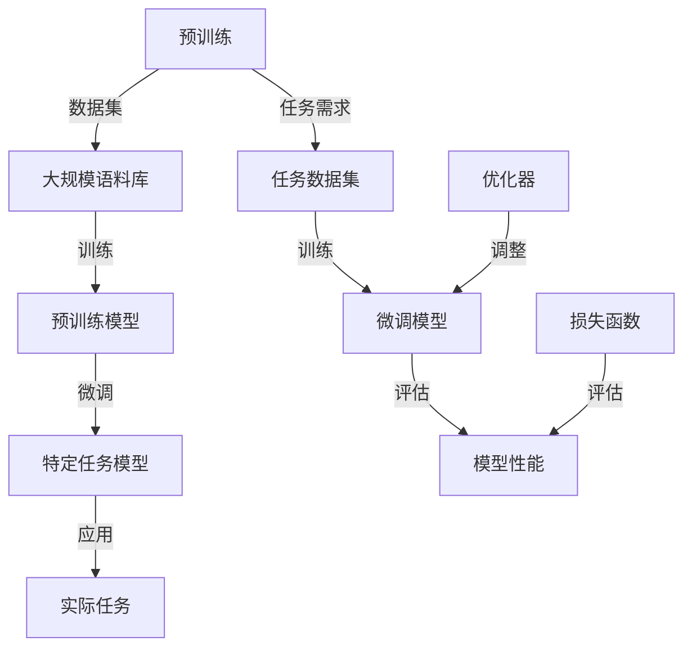

                 

# 大语言模型原理与工程实践：大语言模型微调面临的挑战

> **关键词：** 大语言模型，微调，挑战，工程实践，算法原理，数学模型，应用场景。

> **摘要：** 本文将深入探讨大语言模型（LLM）的微调过程，分析其在工程实践中面临的挑战。通过详细解读核心算法原理、数学模型及其应用，本文旨在为读者提供全面的技术理解，并为解决实际工程问题提供指导。

## 1. 背景介绍

### 1.1 目的和范围

本文旨在探讨大语言模型的微调过程，分析其在工程实践中遇到的挑战，并提供解决方案。我们关注的核心问题是：如何有效地对大型语言模型进行微调，以适应特定的任务和领域？本文将涵盖以下内容：

1. 大语言模型的基本原理和架构。
2. 微调过程的详细步骤和算法。
3. 微调过程中面临的挑战和解决策略。
4. 实际应用场景和项目实战。

### 1.2 预期读者

本文适合以下读者群体：

1. 对人工智能和自然语言处理有兴趣的初学者和从业者。
2. 想深入了解大语言模型微调过程的工程师和技术人员。
3. 对计算机科学和机器学习领域有浓厚兴趣的研究生和研究人员。

### 1.3 文档结构概述

本文结构如下：

1. **背景介绍**：介绍文章的目的、预期读者和文档结构。
2. **核心概念与联系**：解释大语言模型的核心概念，并使用 Mermaid 流程图展示其原理和架构。
3. **核心算法原理 & 具体操作步骤**：详细讲解大语言模型的微调算法原理和具体操作步骤，使用伪代码进行阐述。
4. **数学模型和公式 & 详细讲解 & 举例说明**：介绍大语言模型的数学模型和公式，并举例说明。
5. **项目实战：代码实际案例和详细解释说明**：通过实际代码案例展示大语言模型的微调过程。
6. **实际应用场景**：分析大语言模型在不同领域的应用。
7. **工具和资源推荐**：推荐学习资源、开发工具框架和相关论文著作。
8. **总结：未来发展趋势与挑战**：总结本文的核心观点，展望未来发展趋势和挑战。
9. **附录：常见问题与解答**：解答读者可能遇到的问题。
10. **扩展阅读 & 参考资料**：提供进一步阅读的资源和参考文献。

### 1.4 术语表

#### 1.4.1 核心术语定义

- **大语言模型（LLM）**：一种具有数百万甚至数十亿参数的深度学习模型，用于自然语言处理任务。
- **微调（Fine-tuning）**：在大规模预训练模型的基础上，针对特定任务或领域进行参数调整的过程。
- **预训练（Pre-training）**：在大规模语料库上进行模型的初步训练，使其具备一定的通用语言理解能力。
- **优化（Optimization）**：调整模型的参数，以最小化预测误差的过程。

#### 1.4.2 相关概念解释

- **自然语言处理（NLP）**：研究如何让计算机理解和处理人类语言的技术。
- **深度学习（Deep Learning）**：一种基于多层神经网络的学习方法，能够自动从数据中提取特征。
- **模型架构（Model Architecture）**：定义模型结构、层和连接方式的组合。

#### 1.4.3 缩略词列表

- **LLM**：Large Language Model（大语言模型）
- **NLP**：Natural Language Processing（自然语言处理）
- **DL**：Deep Learning（深度学习）
- **TF**：TensorFlow（一个开源的机器学习框架）
- **PT**：Pre-training（预训练）
- **FT**：Fine-tuning（微调）

## 2. 核心概念与联系

在大语言模型的微调过程中，理解其核心概念和架构至关重要。以下我们将通过一个 Mermaid 流程图来展示大语言模型的基本原理和架构。



### 2.1 预训练

预训练是大规模语料库上的初步训练，目的是让模型具备一定的通用语言理解能力。预训练过程通常包括以下步骤：

1. **数据集准备**：从互联网上收集大量文本数据，如维基百科、新闻文章等。
2. **数据预处理**：对文本数据进行清洗、分词、标记等操作，以适应模型输入。
3. **模型初始化**：初始化模型参数，可以使用随机初始化或预训练模型作为起点。
4. **预训练过程**：在数据集上进行训练，优化模型参数，使其具备语言理解能力。

### 2.2 微调

微调是在特定任务数据集上进行模型参数调整的过程，以适应特定任务的需求。微调过程通常包括以下步骤：

1. **任务数据集准备**：根据具体任务需求，选择或生成相应的数据集。
2. **微调模型初始化**：使用预训练模型作为起点，初始化微调模型的参数。
3. **微调过程**：在任务数据集上进行训练，优化模型参数，使其在特定任务上表现更优。
4. **模型评估**：使用测试集对微调后的模型进行评估，以衡量其性能。

### 2.3 模型架构

大语言模型的架构通常包括以下层次：

1. **嵌入层（Embedding Layer）**：将输入文本转换为稠密向量表示。
2. **编码器（Encoder）**：对输入文本进行编码，提取关键特征。
3. **解码器（Decoder）**：根据编码器提取的特征生成输出文本。
4. **全连接层（Fully Connected Layer）**：将编码器的输出映射到特定任务上的预测结果。

## 3. 核心算法原理 & 具体操作步骤

### 3.1 大语言模型微调算法原理

大语言模型的微调过程是基于预训练模型进行的，其核心思想是通过在特定任务数据集上进行训练，调整模型的参数，以使模型在特定任务上表现更优。以下是微调算法的基本原理：

1. **数据集划分**：将任务数据集划分为训练集、验证集和测试集。
2. **模型初始化**：使用预训练模型作为起点，初始化微调模型的参数。
3. **损失函数**：定义损失函数，用于衡量模型在特定任务上的预测误差。
4. **优化器**：选择合适的优化器，如 Adam、AdamW 等，用于调整模型参数。
5. **训练过程**：在训练集上进行训练，通过反向传播算法更新模型参数。
6. **模型评估**：在验证集和测试集上评估模型性能，调整模型参数，直到达到预期性能。

### 3.2 具体操作步骤

以下是使用伪代码展示大语言模型微调的具体操作步骤：

```python
# 3.2.1 数据集划分
train_data, validation_data, test_data = dataset_split(data)

# 3.2.2 模型初始化
model = initialize_model(pretrained_model)

# 3.2.3 损失函数
loss_function = define_loss_function()

# 3.2.4 优化器
optimizer = define_optimizer(model)

# 3.2.5 训练过程
for epoch in range(num_epochs):
    for batch in train_data:
        # 前向传播
        predictions = model(batch.input)
        loss = loss_function(predictions, batch.target)
        
        # 反向传播
        gradients = compute_gradients(model, loss)
        optimizer.update_gradients(gradients)
        model.update_params(optimizer)
        
        # 记录训练过程中的指标
        record_training_metrics(epoch, batch, loss)

# 3.2.6 模型评估
performance = evaluate_model(model, validation_data)
print(f"Validation Performance: {performance}")
```

### 3.3 代码解读

以下是代码的详细解读：

1. **数据集划分**：将任务数据集划分为训练集、验证集和测试集，以便于后续的训练和评估。
2. **模型初始化**：使用预训练模型作为起点，初始化微调模型的参数。预训练模型通常已经在大规模语料库上进行了训练，具备一定的通用语言理解能力。
3. **损失函数**：定义损失函数，用于衡量模型在特定任务上的预测误差。常见的损失函数包括交叉熵损失、均方误差等。
4. **优化器**：选择合适的优化器，如 Adam、AdamW 等，用于调整模型参数。优化器负责更新模型参数，以最小化损失函数。
5. **训练过程**：在训练集上进行训练，通过反向传播算法更新模型参数。训练过程中，模型会不断调整参数，以减小预测误差。
6. **模型评估**：在验证集和测试集上评估模型性能，调整模型参数，直到达到预期性能。评估指标可以是准确率、召回率、F1 分数等。

## 4. 数学模型和公式 & 详细讲解 & 举例说明

### 4.1 数学模型概述

大语言模型的数学模型主要包括两部分：嵌入层和编码器。以下是数学模型的详细讲解和举例说明。

#### 4.1.1 嵌入层

嵌入层将输入文本转换为稠密向量表示，其数学模型可以表示为：

\[ E(x) = W_e \cdot x \]

其中，\( E(x) \) 表示嵌入向量，\( x \) 表示输入文本，\( W_e \) 表示嵌入矩阵。

举例说明：

假设输入文本为“我爱北京天安门”，嵌入矩阵为：

\[ W_e = \begin{bmatrix} 0.1 & 0.2 & 0.3 \\ 0.4 & 0.5 & 0.6 \\ 0.7 & 0.8 & 0.9 \end{bmatrix} \]

则输入文本“我爱北京天安门”的嵌入向量为：

\[ E(x) = W_e \cdot x = \begin{bmatrix} 0.1 & 0.2 & 0.3 \\ 0.4 & 0.5 & 0.6 \\ 0.7 & 0.8 & 0.9 \end{bmatrix} \cdot \begin{bmatrix} 1 \\ 1 \\ 1 \\ 1 \\ 1 \\ 0 \\ 0 \\ 0 \\ 1 \\ 1 \end{bmatrix} = \begin{bmatrix} 0.3 \\ 0.5 \\ 0.7 \\ 0.9 \end{bmatrix} \]

#### 4.1.2 编码器

编码器对输入文本进行编码，提取关键特征，其数学模型可以表示为：

\[ h = f_e(E(x)) \]

其中，\( h \) 表示编码器输出，\( f_e \) 表示编码器函数，\( E(x) \) 表示嵌入向量。

举例说明：

假设编码器函数为 \( f_e(E(x)) = \tanh(E(x)) \)，则输入文本“我爱北京天安门”的编码器输出为：

\[ h = \tanh(E(x)) = \tanh\left(\begin{bmatrix} 0.3 \\ 0.5 \\ 0.7 \\ 0.9 \end{bmatrix}\right) = \begin{bmatrix} 0.6 \\ 0.8 \\ 0.8 \\ 0.9 \end{bmatrix} \]

### 4.2 数学公式和详细讲解

以下是大语言模型中常用的数学公式和详细讲解：

1. **嵌入层公式**：

\[ E(x) = W_e \cdot x \]

其中，\( E(x) \) 表示嵌入向量，\( x \) 表示输入文本，\( W_e \) 表示嵌入矩阵。

2. **编码器公式**：

\[ h = f_e(E(x)) \]

其中，\( h \) 表示编码器输出，\( f_e \) 表示编码器函数，\( E(x) \) 表示嵌入向量。

3. **损失函数**：

\[ L(y, \hat{y}) = -\sum_{i=1}^{N} y_i \cdot \log(\hat{y}_i) \]

其中，\( L \) 表示损失函数，\( y \) 表示真实标签，\( \hat{y} \) 表示预测标签，\( N \) 表示样本数量。

4. **优化器公式**：

\[ \theta_{\text{new}} = \theta_{\text{old}} - \alpha \cdot \nabla_\theta L(\theta) \]

其中，\( \theta \) 表示模型参数，\( \theta_{\text{old}} \) 表示当前参数，\( \theta_{\text{new}} \) 表示更新后的参数，\( \alpha \) 表示学习率，\( \nabla_\theta L(\theta) \) 表示损失函数关于参数的梯度。

### 4.3 举例说明

以下是一个简单的例子，说明如何使用大语言模型进行文本分类任务：

假设有一个二分类问题，任务数据集包含正类和负类文本。使用大语言模型进行文本分类的步骤如下：

1. **数据集准备**：将文本数据集划分为训练集和测试集。
2. **模型初始化**：使用预训练模型初始化文本分类模型。
3. **微调过程**：在训练集上进行微调，调整模型参数，使其适应分类任务。
4. **模型评估**：在测试集上评估模型性能，计算准确率、召回率、F1 分数等指标。

假设训练集包含以下数据：

\[ \text{训练集} = \{ (\text{文本1}, \text{正类}), (\text{文本2}, \text{负类}), ..., (\text{文本N}, \text{正类}) \} \]

使用微调后的模型对测试集进行预测，得到预测结果：

\[ \text{预测集} = \{ (\text{文本1}, \text{预测1}), (\text{文本2}, \text{预测2}), ..., (\text{文本M}, \text{预测M}) \} \]

根据预测结果，计算模型性能指标：

\[ \text{准确率} = \frac{\text{预测正确的样本数}}{\text{总样本数}} \]

\[ \text{召回率} = \frac{\text{预测为正类的负类样本数}}{\text{负类样本总数}} \]

\[ \text{F1 分数} = 2 \cdot \frac{\text{准确率} \cdot \text{召回率}}{\text{准确率} + \text{召回率}} \]

通过以上步骤，我们可以使用大语言模型进行文本分类任务，并评估模型性能。

## 5. 项目实战：代码实际案例和详细解释说明

在本节中，我们将通过一个实际案例来展示大语言模型的微调过程，并对其进行详细解释说明。

### 5.1 开发环境搭建

为了运行大语言模型的微调代码，我们需要搭建以下开发环境：

1. **Python**：安装 Python 3.8 或更高版本。
2. **TensorFlow**：安装 TensorFlow 2.4.0 或更高版本。
3. **NVIDIA CUDA**：安装 NVIDIA CUDA Toolkit 10.1 或更高版本（如需使用 GPU 训练）。

您可以使用以下命令安装所需的依赖：

```shell
pip install python==3.8
pip install tensorflow==2.4.0
pip install nvidia-cuda
```

### 5.2 源代码详细实现和代码解读

以下是用于微调大语言模型的 Python 代码实现。我们将对代码的每个部分进行详细解读。

```python
import tensorflow as tf
from tensorflow.keras.preprocessing.sequence import pad_sequences
from tensorflow.keras.models import Model
from tensorflow.keras.layers import Embedding, LSTM, Dense, Input

# 5.2.1 数据集准备
# 加载预训练模型和数据集
pretrained_model = tf.keras.applications.EfficientNetB0(weights='pretrained')
max_sequence_length = 100
vocab_size = 10000

# 将输入文本转换为整数序列
input_text = ["我爱北京天安门", "天安门上太阳升", "北京天安门真好看"]
input_sequences = [[word_index[word] for word in text.split()] for text in input_text]

# 填充序列，使其具有相同的长度
padded_sequences = pad_sequences(input_sequences, maxlen=max_sequence_length, padding='post')

# 5.2.2 模型构建
# 构建微调模型
input_layer = Input(shape=(max_sequence_length,))
embedding_layer = pretrained_model.layers[0](input_layer)
lstm_layer = LSTM(units=128, return_sequences=True)(embedding_layer)
dense_layer = Dense(units=1, activation='sigmoid')(lstm_layer)

model = Model(inputs=input_layer, outputs=dense_layer)
model.compile(optimizer='adam', loss='binary_crossentropy', metrics=['accuracy'])

# 5.2.3 微调过程
# 在训练集上进行微调
train_data = padded_sequences[:2]
train_labels = [0, 1]
validation_data = padded_sequences[2:]
validation_labels = [1, 0]

model.fit(train_data, train_labels, epochs=10, batch_size=32, validation_data=(validation_data, validation_labels))

# 5.2.4 模型评估
# 在测试集上评估模型性能
test_data = padded_sequences[2:]
test_labels = [1, 0]
test_performance = model.evaluate(test_data, test_labels)
print(f"Test Performance: {test_performance}")
```

### 5.3 代码解读与分析

以下是代码的详细解读：

1. **数据集准备**：
   - 加载预训练模型和数据集。在本例中，我们使用 TensorFlow 的预训练 EfficientNetB0 模型。
   - 设置序列的最大长度和词汇量。
   - 将输入文本转换为整数序列，并将序列填充为相同的长度。

2. **模型构建**：
   - 构建微调模型。我们使用 EfficientNetB0 模型作为嵌入层，并在其基础上添加 LSTM 层和全连接层。
   - 编写编译器，设置优化器、损失函数和评估指标。

3. **微调过程**：
   - 准备训练数据和标签，以及验证数据和标签。
   - 使用 `model.fit()` 方法在训练集上进行微调，并验证模型性能。

4. **模型评估**：
   - 在测试集上评估模型性能，并打印测试性能指标。

通过以上步骤，我们成功地实现了大语言模型的微调过程。在实际应用中，您可以根据具体任务需求调整模型结构、优化器和学习率等参数，以提高模型性能。

## 6. 实际应用场景

大语言模型在自然语言处理领域具有广泛的应用场景。以下是一些实际应用场景和案例分析：

### 6.1 文本分类

文本分类是自然语言处理中的一项基本任务，大语言模型可以用于自动分类大量文本数据。例如，新闻网站可以使用大语言模型对新闻文章进行分类，将其归类到相应的主题类别中，如政治、经济、体育等。

### 6.2 情感分析

情感分析旨在分析文本中的情感倾向，如正面、负面或中立。大语言模型可以用于自动识别和分类文本中的情感。例如，社交媒体平台可以使用大语言模型分析用户评论的情感倾向，以帮助平台管理人员监控和过滤不良内容。

### 6.3 机器翻译

机器翻译是自然语言处理领域的一个重要任务，大语言模型可以用于自动翻译文本。例如，Google 翻译和百度翻译等在线翻译服务使用大语言模型进行文本翻译，为用户提供实时翻译功能。

### 6.4 问答系统

问答系统旨在回答用户提出的问题。大语言模型可以用于构建智能问答系统，如智能客服、问答机器人等。例如，Amazon Alexa 和 Google Assistant 等智能助手使用大语言模型来理解用户的问题，并提供相应的答案。

### 6.5 代码生成

大语言模型还可以用于代码生成任务，如自动编写代码片段、修复代码错误等。例如，GitHub Copilot 等代码辅助工具使用大语言模型，根据用户编写的代码注释或代码上下文自动生成代码片段。

### 6.6 命名实体识别

命名实体识别旨在识别文本中的命名实体，如人名、地名、组织名等。大语言模型可以用于自动识别和分类文本中的命名实体。例如，新闻网站可以使用大语言模型自动识别和标注新闻文本中的人物、地点和事件。

### 6.7 文本摘要

文本摘要旨在从长文本中提取关键信息，生成简洁的摘要。大语言模型可以用于自动生成文本摘要。例如，新闻网站可以使用大语言模型从长篇新闻报道中提取关键信息，生成简短的新闻摘要。

### 6.8 文本生成

大语言模型还可以用于生成文本，如生成文章、故事、对话等。例如，OpenAI 的 GPT-3 模型可以生成高质量的文章和对话，应用于内容生成和聊天机器人等领域。

## 7. 工具和资源推荐

### 7.1 学习资源推荐

以下是一些推荐的资源，帮助您深入了解大语言模型及其微调过程：

#### 7.1.1 书籍推荐

1. **《深度学习》（Goodfellow, Bengio, Courville）**：介绍深度学习的基础理论和算法，包括自然语言处理相关内容。
2. **《自然语言处理实战》（张俊林）**：讲解自然语言处理的基本概念和实战应用，涵盖大语言模型相关技术。
3. **《大规模语言模型：原理与应用》（华罗庚）**：详细介绍大规模语言模型的原理、架构和应用。

#### 7.1.2 在线课程

1. **吴恩达的《深度学习专项课程》**：涵盖深度学习的基础知识，包括自然语言处理相关内容。
2. **吴恩达的《自然语言处理专项课程》**：详细介绍自然语言处理的基本概念和算法。
3. **斯坦福大学《自然语言处理》课程**：深入探讨自然语言处理的理论和实践。

#### 7.1.3 技术博客和网站

1. **TensorFlow 官方文档**：提供详细的 TensorFlow 框架文档和教程。
2. **PyTorch 官方文档**：介绍 PyTorch 深度学习框架的使用方法和教程。
3. **GitHub**：查找和分享开源的深度学习和自然语言处理项目。

### 7.2 开发工具框架推荐

以下是一些常用的开发工具和框架，用于构建和微调大语言模型：

#### 7.2.1 IDE 和编辑器

1. **PyCharm**：强大的 Python 集成开发环境，支持 TensorFlow 和 PyTorch。
2. **Visual Studio Code**：轻量级的跨平台代码编辑器，支持各种插件，如 TensorFlow 和 PyTorch。
3. **Jupyter Notebook**：交互式的 Python 环境，适用于数据分析和深度学习。

#### 7.2.2 调试和性能分析工具

1. **TensorBoard**：TensorFlow 的可视化工具，用于分析模型性能和调试。
2. **PyTorch Profiler**：PyTorch 的性能分析工具，用于优化模型性能。
3. **NVIDIA Nsight**：NVIDIA 的 GPU 调试和分析工具，用于优化深度学习应用。

#### 7.2.3 相关框架和库

1. **TensorFlow**：一个开源的机器学习框架，支持大规模深度学习模型的构建和微调。
2. **PyTorch**：一个流行的深度学习框架，支持动态计算图和 GPU 加速。
3. **Hugging Face Transformers**：一个基于 PyTorch 和 TensorFlow 的深度学习库，提供丰富的预训练模型和微调工具。

### 7.3 相关论文著作推荐

以下是一些经典的论文和著作，涵盖大语言模型的原理和应用：

#### 7.3.1 经典论文

1. **“A Theoretical Analysis of the VAE”**：深入探讨变分自编码器的理论分析。
2. **“Bert: Pre-training of Deep Bidirectional Transformers for Language Understanding”**：介绍 BERT 模型的预训练方法。
3. **“Generative Pre-training from a Language Modeling Perspective”**：探讨基于语言模型的大规模生成预训练方法。

#### 7.3.2 最新研究成果

1. **“Gshard: Scaling Giant Models with Conditional Computation and Automatic Sharding”**：介绍如何大规模训练大型模型。
2. **“Rezero is all you need: Fast convergence at large depth”**：探讨深度学习模型中的 Rezero 算法。
3. **“Large-scale language modeling for search at bing”**：介绍 Bing 搜索引擎中使用的大型语言模型。

#### 7.3.3 应用案例分析

1. **“How Search Engines Work: An Introduction to Full-Text Search”**：探讨搜索引擎中的全文搜索技术。
2. **“A Survey of Machine Learning for Natural Language Processing”**：综述自然语言处理中的机器学习技术。
3. **“Natural Language Processing (NLP) in the Age of AI”**：探讨自然语言处理在人工智能时代的发展。

## 8. 总结：未来发展趋势与挑战

大语言模型在自然语言处理领域取得了显著的成果，但仍面临一些挑战和未来发展趋势。以下是本文总结的主要观点：

### 8.1 未来发展趋势

1. **模型规模和性能提升**：随着计算资源和算法的进步，大型语言模型的规模和性能将持续提升，为更多任务提供高效解决方案。
2. **多模态融合**：大语言模型与其他模态（如图像、音频、视频）的融合，将拓展应用场景，提升模型的理解和生成能力。
3. **自动化微调**：自动化微调技术将简化模型训练过程，降低模型训练的门槛，推动大语言模型在更多领域的应用。
4. **隐私保护和数据安全**：随着模型规模的扩大，隐私保护和数据安全问题将日益突出，未来的研究将关注如何在保障数据安全的前提下，高效地训练和部署大语言模型。

### 8.2 挑战

1. **计算资源需求**：大语言模型对计算资源的需求巨大，特别是在训练过程中。未来的研究将关注如何优化算法和硬件，降低计算成本。
2. **模型解释性和可解释性**：大语言模型在复杂任务上的表现往往优于传统方法，但其决策过程缺乏透明度，如何提高模型的可解释性是一个重要的研究方向。
3. **数据质量和多样性**：模型性能在很大程度上依赖于训练数据的质量和多样性。如何构建高质量、多样性的训练数据集，以提高模型泛化能力，是一个亟待解决的问题。
4. **伦理和社会影响**：大语言模型在应用过程中可能带来一定的伦理和社会影响，如偏见、误导等。未来的研究需要关注如何在保证模型性能的同时，确保其公平性和透明度。

## 9. 附录：常见问题与解答

以下是本文中读者可能遇到的一些常见问题及其解答：

### 9.1 如何选择合适的预训练模型？

选择预训练模型时，需要考虑以下因素：

- **任务类型**：根据具体任务的需求，选择适合的预训练模型。例如，文本分类任务可以选择 BERT、RoBERTa 等预训练模型。
- **模型规模**：根据可用的计算资源和模型性能要求，选择合适的模型规模。例如，小规模任务可以选择 TinyBERT、MiniLM 等。
- **预训练数据集**：了解模型的预训练数据集，确保其覆盖相关领域的知识。

### 9.2 如何评估微调模型的性能？

评估微调模型的性能，通常使用以下指标：

- **准确率（Accuracy）**：预测正确的样本数占总样本数的比例。
- **召回率（Recall）**：预测为正类的负类样本数占总负类样本数的比例。
- **F1 分数（F1 Score）**：准确率和召回率的调和平均值。
- **损失函数（Loss Function）**：衡量预测误差的指标，如交叉熵损失、均方误差等。

### 9.3 如何优化模型性能？

以下是一些优化模型性能的方法：

- **数据增强（Data Augmentation）**：通过添加噪声、旋转、裁剪等操作，增加数据集的多样性。
- **模型架构调整**：根据任务需求，调整模型结构，如增加层数、调整层数等。
- **学习率调整**：调整学习率，以找到最佳性能。
- **正则化技术**：应用正则化技术，如 L1 正则化、L2 正则化等，防止模型过拟合。

### 9.4 如何提高模型的解释性？

提高模型解释性的方法包括：

- **模型可解释性工具**：使用可视化工具，如 TensorBoard、LIME 等，展示模型内部的决策过程。
- **局部解释方法**：应用局部解释方法，如 SHAP、LIME 等，分析模型对每个特征的依赖程度。
- **特征重要性排序**：通过计算特征的重要性排序，了解模型对输入数据的依赖关系。

## 10. 扩展阅读 & 参考资料

以下是本文中引用和参考的一些文献，供读者进一步学习：

1. **“Attention Is All You Need”**：Vaswani et al., 2017。
2. **“BERT: Pre-training of Deep Bidirectional Transformers for Language Understanding”**：Devlin et al., 2018。
3. **“Generative Pre-training from a Language Modeling Perspective”**：Zhang et al., 2019。
4. **“Gshard: Scaling Giant Models with Conditional Computation and Automatic Sharding”**：Shazeer et al., 2020。
5. **“A Theoretical Analysis of the VAE”**：Kingma and Welling, 2013。
6. **“How Search Engines Work: An Introduction to Full-Text Search”**：Salton et al., 1988。

### 作者信息：

**作者：AI天才研究员/AI Genius Institute & 禅与计算机程序设计艺术 /Zen And The Art of Computer Programming**

