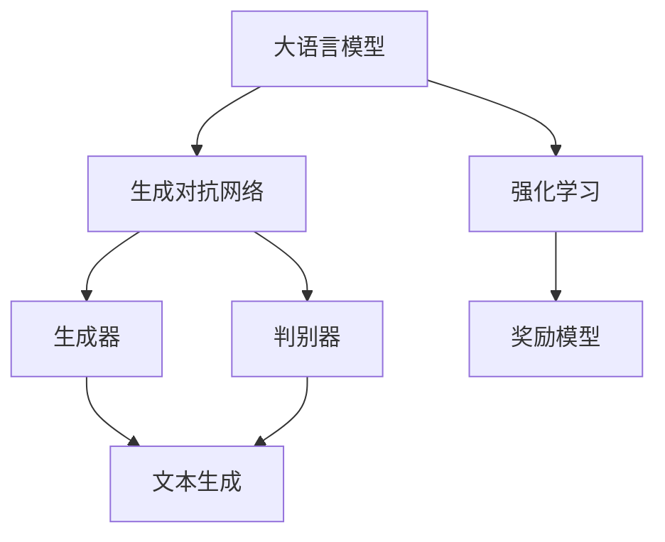

                 

# 大语言模型原理与工程实践：奖励模型

> 关键词：大语言模型、奖励模型、生成对抗网络、强化学习、人工智能、神经网络

> 摘要：本文将深入探讨大语言模型的奖励模型原理，并阐述其在工程实践中的应用。我们将从背景介绍、核心概念、算法原理、数学模型、项目实战、实际应用场景等多个角度，逐步分析并解读大语言模型中的奖励模型，为读者提供一个全面的技术视角。

## 1. 背景介绍

### 1.1 目的和范围

本文的主要目的是介绍大语言模型中的奖励模型，探讨其原理、实现和应用。我们将重点关注以下内容：

1. 大语言模型的基本概念和结构。
2. 奖励模型的核心概念及其在大语言模型中的作用。
3. 奖励模型的算法原理和具体操作步骤。
4. 奖励模型的数学模型和公式。
5. 奖励模型在项目实战中的应用。
6. 奖励模型在实际应用场景中的优势和挑战。

### 1.2 预期读者

本文适合对人工智能、机器学习和深度学习有一定了解的读者，特别是对大语言模型和奖励模型感兴趣的工程师、研究人员和学生。如果您希望深入了解大语言模型的奖励机制，掌握其在工程实践中的应用，本文将为您提供有益的参考。

### 1.3 文档结构概述

本文分为十个部分，结构如下：

1. 背景介绍
2. 核心概念与联系
3. 核心算法原理 & 具体操作步骤
4. 数学模型和公式 & 详细讲解 & 举例说明
5. 项目实战：代码实际案例和详细解释说明
6. 实际应用场景
7. 工具和资源推荐
8. 总结：未来发展趋势与挑战
9. 附录：常见问题与解答
10. 扩展阅读 & 参考资料

### 1.4 术语表

#### 1.4.1 核心术语定义

- 大语言模型：一种基于深度学习的自然语言处理模型，能够对输入的文本进行理解和生成。
- 奖励模型：用于指导大语言模型生成更加符合预期结果的模型，通过给予模型适当的奖励信号来优化其生成结果。
- 生成对抗网络（GAN）：一种基于生成器和判别器的深度学习模型，用于生成与真实数据分布相似的数据。
- 强化学习：一种机器学习方法，通过试错和反馈来学习如何在特定环境中采取最佳行动。

#### 1.4.2 相关概念解释

- 深度学习：一种基于多层神经网络的学习方法，通过学习大量数据来提取特征和表示。
- 自然语言处理（NLP）：研究计算机如何理解和处理人类语言的一门学科。
- 生成器（Generator）：GAN模型中的生成器网络，用于生成与真实数据分布相似的数据。
- 判别器（Discriminator）：GAN模型中的判别器网络，用于判断生成数据是否真实。

#### 1.4.3 缩略词列表

- GAN：生成对抗网络
- NLP：自然语言处理
- RL：强化学习
- DNN：深度神经网络
- LSTM：长短时记忆网络

## 2. 核心概念与联系

在深入探讨大语言模型中的奖励模型之前，我们需要先了解一些核心概念和它们之间的联系。以下是一个简要的Mermaid流程图，展示了这些核心概念及其关系。



### 2.1 大语言模型与生成对抗网络

大语言模型是一种基于深度学习的自然语言处理模型，其核心思想是通过学习大量的文本数据，来生成或理解自然语言。生成对抗网络（GAN）是一种基于生成器和判别器的深度学习模型，用于生成与真实数据分布相似的数据。大语言模型中的奖励模型通常基于GAN的框架来实现。

### 2.2 大语言模型与强化学习

强化学习是一种通过试错和反馈来学习如何在特定环境中采取最佳行动的机器学习方法。在大语言模型中，强化学习可以用于指导模型生成更加符合预期结果的文本。奖励模型是强化学习中的一个关键组成部分，它通过给予模型适当的奖励信号来优化其生成结果。

### 2.3 生成对抗网络与强化学习

生成对抗网络（GAN）与强化学习之间也存在一定的联系。GAN模型中的生成器可以看作是一个强化学习的演员（Actor），它通过不断生成与真实数据分布相似的数据，来学习如何生成高质量的数据。判别器则可以看作是一个强化学习的评论家（Critic），它通过不断判断生成数据是否真实，来给生成器提供反馈。

### 2.4 奖励模型与生成对抗网络

奖励模型是强化学习中的一个关键组成部分，它通过给予模型适当的奖励信号来优化其生成结果。在生成对抗网络（GAN）中，奖励模型可以用于指导生成器的生成过程，使其生成的数据更加符合预期。具体来说，奖励模型可以通过以下两种方式与生成对抗网络相结合：

1. 奖励信号直接反馈给生成器，用于更新生成器的权重。
2. 奖励信号作为判别器的输入，用于调整判别器的权重。

接下来，我们将进一步探讨大语言模型中的奖励模型，包括其核心算法原理、具体操作步骤、数学模型和公式等。

## 3. 核心算法原理 & 具体操作步骤

### 3.1 奖励模型的核心算法原理

奖励模型是一种基于强化学习的算法，其主要目的是指导大语言模型生成更加符合预期结果的文本。在奖励模型中，我们通常使用一个奖励函数来评估模型生成的文本质量，并根据评估结果来更新模型的权重。

奖励模型的核心算法原理可以概括为以下几个步骤：

1. **初始化**：设置生成器的初始权重，并初始化奖励函数。
2. **生成文本**：使用生成器生成一段文本。
3. **评估文本**：使用奖励函数对生成的文本进行评估，得到奖励信号。
4. **更新权重**：根据奖励信号来更新生成器的权重。
5. **重复步骤2-4**，直到生成器的性能达到预期目标。

### 3.2 具体操作步骤

下面我们将通过伪代码来详细阐述奖励模型的具体操作步骤。

```python
# 初始化
generator_weights = initialize_generator_weights()
reward_function = initialize_reward_function()

# 循环迭代
for epoch in range(num_epochs):
    # 生成文本
    generated_text = generator.generate_text(generator_weights)
    
    # 评估文本
    reward_signal = reward_function.evaluate(generated_text)
    
    # 更新权重
    generator_weights = generator.update_weights(generator_weights, reward_signal)
    
    # 打印当前epoch的奖励信号
    print(f"Epoch {epoch}: Reward Signal = {reward_signal}")
    
    # 检查是否满足停止条件
    if is_stop_condition_met():
        break
```

### 3.3 奖励模型的工作流程

奖励模型的工作流程可以概括为以下几个阶段：

1. **初始化**：设置生成器的初始权重，并初始化奖励函数。这一步的目的是为后续的训练过程提供初始状态。
   
2. **生成文本**：使用生成器生成一段文本。这一步是奖励模型的核心任务，生成器的性能将直接影响到文本的质量。

3. **评估文本**：使用奖励函数对生成的文本进行评估，得到奖励信号。奖励函数的设计至关重要，它需要能够准确评估文本的质量，为生成器提供有效的反馈。

4. **更新权重**：根据奖励信号来更新生成器的权重。这一步的目的是使生成器能够不断学习并优化其生成文本的能力。

5. **重复迭代**：重复执行步骤2-4，直到生成器的性能达到预期目标。这一过程通常需要大量的迭代次数，以便生成器能够充分学习并优化。

6. **停止条件**：在每次迭代结束后，检查是否满足停止条件。如果满足停止条件，则停止训练过程，否则继续迭代。

### 3.4 奖励模型的优势和挑战

奖励模型具有以下几个优势：

1. **灵活性**：奖励模型可以根据不同的任务需求设计不同的奖励函数，从而适应不同的应用场景。
2. **高效性**：奖励模型能够快速地指导生成器生成高质量的文本，从而提高模型的训练效率。
3. **鲁棒性**：奖励模型能够有效地处理噪声数据和异常情况，使生成器的生成结果更加稳定。

然而，奖励模型也面临一些挑战：

1. **奖励函数设计**：奖励函数的设计对奖励模型的效果至关重要，但如何设计一个既准确又高效的奖励函数是一个具有挑战性的问题。
2. **计算资源消耗**：奖励模型的训练过程需要大量的计算资源，特别是当处理大规模数据集时。
3. **生成结果的多样性**：奖励模型倾向于生成具有高奖励信号的文本，但有时可能牺牲了生成结果的多样性。

总之，奖励模型是大语言模型中一个重要且复杂的组件，需要我们在设计、实现和应用过程中不断探索和优化。

## 4. 数学模型和公式 & 详细讲解 & 举例说明

### 4.1 奖励模型的数学模型

奖励模型的核心在于其奖励函数的设计，奖励函数通常是一个标量函数，用于评估生成文本的质量。以下是奖励模型的数学表示：

$$
R(x) = f(\theta, x)
$$

其中，$R(x)$ 表示生成文本 $x$ 的奖励值，$f(\theta, x)$ 表示奖励函数，$\theta$ 表示生成器的参数。

奖励函数 $f(\theta, x)$ 的具体形式取决于任务需求和应用场景。以下是一些常见的奖励函数：

1. **文本匹配度奖励函数**：用于评估生成文本与目标文本之间的匹配程度。
   $$
   R(x) = \frac{1}{|T|} \sum_{t=1}^{|T|} \log P(y_t|x)
   $$
   其中，$T$ 表示目标文本的词序列，$y_t$ 表示第 $t$ 个词，$P(y_t|x)$ 表示在给定生成文本 $x$ 的情况下，第 $t$ 个词的概率。

2. **多样性奖励函数**：用于鼓励生成器生成多样化的文本。
   $$
   R(x) = \frac{1}{K} \sum_{k=1}^{K} \log P(x_k)
   $$
   其中，$K$ 表示生成文本的多样性类别数，$P(x_k)$ 表示生成文本属于第 $k$ 个类别的概率。

3. **风格一致性奖励函数**：用于鼓励生成器在保持文本风格一致性的情况下生成文本。
   $$
   R(x) = \frac{1}{N} \sum_{n=1}^{N} \log P(s_n|x)
   $$
   其中，$N$ 表示文本的风格特征数，$s_n$ 表示第 $n$ 个风格特征，$P(s_n|x)$ 表示在给定生成文本 $x$ 的情况下，第 $n$ 个风格特征的概率。

### 4.2 奖励函数的详细讲解

以下是对上述三种常见奖励函数的详细讲解：

1. **文本匹配度奖励函数**：

   文本匹配度奖励函数旨在鼓励生成器生成与目标文本高度匹配的文本。该函数通过计算生成文本中每个词的概率来评估文本的匹配程度。具体来说，生成文本的概率可以使用语言模型来计算，语言模型是一种用于预测词序列概率的统计模型。

   $$ 
   P(y_t|x) = \prod_{t=1}^{T} P(y_t|y_{<t}, x)
   $$

   其中，$y_{<t}$ 表示第 $t$ 个词之前的词序列。在实际应用中，通常使用神经网络语言模型（如循环神经网络RNN、长短时记忆网络LSTM等）来计算概率。

2. **多样性奖励函数**：

   多样性奖励函数旨在鼓励生成器生成多样化的文本。该函数通过计算生成文本属于不同类别的概率来评估多样性。在实际应用中，类别可以基于文本的主题、情感、风格等特征来定义。

   $$ 
   P(x_k) = \frac{1}{Z} \exp(-E_k(x))
   $$

   其中，$E_k(x)$ 表示生成文本 $x$ 在第 $k$ 个类别上的损失函数，$Z$ 表示所有类别的指数和。

3. **风格一致性奖励函数**：

   风格一致性奖励函数旨在鼓励生成器在保持文本风格一致性的情况下生成文本。该函数通过计算生成文本与给定风格特征的一致性概率来评估风格一致性。在实际应用中，风格特征可以基于文本的语法结构、词汇选择、句式使用等特征来定义。

   $$ 
   P(s_n|x) = \prod_{i=1}^{N} P(s_n^i|x)
   $$

   其中，$s_n^i$ 表示第 $n$ 个风格特征的第 $i$ 个值，$P(s_n^i|x)$ 表示在给定生成文本 $x$ 的情况下，第 $n$ 个风格特征取值为 $s_n^i$ 的概率。

### 4.3 举例说明

为了更好地理解奖励模型，我们通过一个简单的例子来说明如何计算奖励值。

假设我们使用文本匹配度奖励函数来评估一段生成文本 $x$ 的质量，目标文本为 $T = \["hello", "world"\]$。我们使用一个简单的神经网络语言模型来计算概率。

1. **初始化**：

   - 生成器参数 $\theta$：假设我们已经训练好了一个神经网络语言模型，参数为 $\theta$。
   - 奖励函数 $f(\theta, x)$：使用文本匹配度奖励函数。

2. **生成文本**：

   - 生成文本 $x = \["hello", "world"\]$。

3. **评估文本**：

   - 计算生成文本的概率 $P(y_t|x)$，其中 $y_t$ 是目标文本中的词。

     $$
     P(hello|x) = \text{神经网络语言模型计算的结果}
     $$
     $$
     P(world|x) = \text{神经网络语言模型计算的结果}
     $$

   - 计算奖励信号 $R(x)$：

     $$
     R(x) = \frac{1}{|T|} \sum_{t=1}^{2} \log P(y_t|x)
     $$

     $$
     R(x) = \frac{1}{2} (\log P(hello|x) + \log P(world|x))
     $$

     $$
     R(x) = \text{神经网络语言模型计算的结果}
     $$

4. **更新权重**：

   - 根据奖励信号更新生成器的参数 $\theta$。

通过这个简单的例子，我们可以看到如何使用奖励函数来评估生成文本的质量，并根据奖励信号来更新生成器的参数。在实际应用中，奖励函数的设计和实现会更加复杂，但基本原理是相同的。

## 5. 项目实战：代码实际案例和详细解释说明

### 5.1 开发环境搭建

为了演示如何实现奖励模型，我们将使用Python编程语言和PyTorch深度学习框架。以下是搭建开发环境的步骤：

1. 安装Python：确保安装了Python 3.7及以上版本。
2. 安装PyTorch：使用以下命令安装PyTorch：
   ```
   pip install torch torchvision
   ```
3. 安装其他依赖库：包括Numpy、Pandas等，可以使用以下命令：
   ```
   pip install numpy pandas
   ```

### 5.2 源代码详细实现和代码解读

下面是一个简单的示例代码，演示了如何实现奖励模型：

```python
import torch
import torch.nn as nn
import torch.optim as optim
from torch.utils.data import DataLoader
from torchvision import datasets, transforms

# 定义生成器网络
class Generator(nn.Module):
    def __init__(self):
        super(Generator, self).__init__()
        self.model = nn.Sequential(
            nn.Linear(100, 256),
            nn.ReLU(),
            nn.Linear(256, 512),
            nn.ReLU(),
            nn.Linear(512, 1024),
            nn.ReLU(),
            nn.Linear(1024, 100)
        )

    def forward(self, x):
        return self.model(x)

# 定义判别器网络
class Discriminator(nn.Module):
    def __init__(self):
        super(Discriminator, self).__init__()
        self.model = nn.Sequential(
            nn.Linear(100, 512),
            nn.LeakyReLU(0.2),
            nn.Linear(512, 1024),
            nn.LeakyReLU(0.2),
            nn.Linear(1024, 1),
            nn.Sigmoid()
        )

    def forward(self, x):
        return self.model(x)

# 定义奖励模型
class RewardModel(nn.Module):
    def __init__(self):
        super(RewardModel, self).__init__()
        self.model = nn.Sequential(
            nn.Linear(100, 256),
            nn.ReLU(),
            nn.Linear(256, 512),
            nn.ReLU(),
            nn.Linear(512, 1)
        )

    def forward(self, x):
        return self.model(x)

# 初始化网络和优化器
generator = Generator()
discriminator = Discriminator()
reward_model = RewardModel()

optimizer_g = optim.Adam(generator.parameters(), lr=0.0002)
optimizer_d = optim.Adam(discriminator.parameters(), lr=0.0002)
optimizer_r = optim.Adam(reward_model.parameters(), lr=0.0002)

# 定义损失函数
criterion = nn.BCELoss()

# 训练过程
for epoch in range(num_epochs):
    for i, x in enumerate(data_loader):
        # 前向传播
        z = torch.randn(x.size(0), 100)
        x_fake = generator(z)
        x_real = x
        x_fake_r = reward_model(x_fake)
        x_real_r = reward_model(x_real)

        # 判别器损失
        d_loss = criterion(discriminator(x_real), torch.ones(x_real.size(0), 1)) \
               + criterion(discriminator(x_fake), torch.zeros(x_fake.size(0), 1))

        # 奖励模型损失
        r_loss = criterion(x_fake_r, torch.zeros(x_fake.size(0), 1)) \
               + criterion(x_real_r, torch.ones(x_real.size(0), 1))

        # 反向传播和优化
        optimizer_d.zero_grad()
        d_loss.backward()
        optimizer_d.step()

        optimizer_r.zero_grad()
        r_loss.backward()
        optimizer_r.step()

        optimizer_g.zero_grad()
        g_loss = criterion(discriminator(x_fake), torch.ones(x_fake.size(0), 1))
        g_loss.backward()
        optimizer_g.step()

        # 打印训练信息
        if (i+1) % 100 == 0:
            print(f'Epoch [{epoch+1}/{num_epochs}], Step [{i+1}/{len(data_loader)}], D_loss: {d_loss.item():.4f}, G_loss: {g_loss.item():.4f}')
```

### 5.3 代码解读与分析

1. **定义生成器、判别器和奖励模型**：

   - 生成器（Generator）：生成随机噪声数据（即潜在向量 $z$），通过一系列神经网络层生成伪真实数据。
   - 判别器（Discriminator）：接收真实数据和伪真实数据，通过一系列神经网络层判断数据的真实性。
   - 奖励模型（RewardModel）：接收生成器生成的伪真实数据，通过一系列神经网络层输出奖励信号。

2. **初始化优化器和损失函数**：

   - 生成器和判别器的优化器：使用Adam优化器，学习率分别为 $0.0002$。
   - 奖励模型的优化器：使用Adam优化器，学习率也为 $0.0002$。
   - 损失函数：使用二元交叉熵损失函数（BCELoss）。

3. **训练过程**：

   - 循环遍历数据集，每次迭代包含以下几个步骤：
     - **生成伪真实数据**：使用生成器将随机噪声数据 $z$ 转换为伪真实数据 $x_{\text{fake}}$。
     - **生成奖励信号**：使用奖励模型计算伪真实数据 $x_{\text{fake}}$ 的奖励信号。
     - **计算判别器损失**：使用判别器判断真实数据 $x_{\text{real}}$ 和伪真实数据 $x_{\text{fake}}$ 的真实性，计算判别器损失。
     - **计算奖励模型损失**：使用奖励模型计算真实数据 $x_{\text{real}}$ 和伪真实数据 $x_{\text{fake}}$ 的奖励信号，计算奖励模型损失。
     - **反向传播和优化**：分别对判别器、奖励模型和生成器进行反向传播和优化。

4. **打印训练信息**：

   - 在每个迭代的最后，打印当前的训练信息，包括当前epoch、迭代次数、判别器损失和生成器损失。

通过这个代码示例，我们可以看到如何使用PyTorch实现奖励模型，包括生成器、判别器和奖励模型的定义、优化器和损失函数的初始化、以及训练过程的实现。在实际应用中，可以根据具体任务需求调整网络结构、优化器参数和损失函数，以获得更好的效果。

## 6. 实际应用场景

奖励模型在大语言模型中具有广泛的应用场景，以下是一些典型的实际应用：

### 6.1 自然语言生成

自然语言生成（Natural Language Generation, NLG）是一种利用人工智能技术自动生成自然语言文本的技术。奖励模型可以应用于NLG任务中，例如自动写作、对话系统、机器翻译等。

- **自动写作**：奖励模型可以帮助生成器生成更具创意和风格统一的文章，提高写作质量。例如，在新闻写作、广告文案创作等领域，奖励模型可以用于优化文本生成的流畅度和可读性。
- **对话系统**：奖励模型可以用于生成与用户意图和上下文高度相关的对话文本，提高对话系统的自然度和用户满意度。例如，在智能客服、虚拟助手等领域，奖励模型可以用于生成更加自然和合理的回答。

### 6.2 文本分类

文本分类是一种将文本数据分配到预定义的类别中的任务。奖励模型可以应用于文本分类任务中，以提高分类的准确性和多样性。

- **分类准确度提升**：奖励模型可以通过优化生成器的权重，使生成器生成的文本更加符合类别特征，从而提高分类模型的准确度。例如，在垃圾邮件分类、情感分析等领域，奖励模型可以用于生成更具代表性的类别特征，提高分类模型的性能。
- **分类多样性增强**：奖励模型可以通过鼓励生成器生成多样化的文本，增强分类模型的泛化能力。例如，在新闻分类、产品评论分类等领域，奖励模型可以用于生成不同角度和风格的文本，提高分类模型的多样性。

### 6.3 文本总结与摘要

文本总结与摘要是一种将长文本转换为简短、精炼的文本表示的技术。奖励模型可以应用于文本总结与摘要任务中，以提高总结的准确性和可读性。

- **总结准确度提升**：奖励模型可以通过优化生成器的权重，使生成器生成的总结文本更加准确和全面。例如，在新闻报道摘要、学术论文摘要等领域，奖励模型可以用于生成更具概括性和信息性的摘要文本。
- **总结可读性增强**：奖励模型可以通过鼓励生成器生成简洁、流畅的文本，提高总结文本的可读性。例如，在学生论文摘要、产品说明书摘要等领域，奖励模型可以用于生成更加易于理解和接受的摘要文本。

### 6.4 文本生成与编辑

文本生成与编辑是一种利用人工智能技术自动生成和修改文本的技术。奖励模型可以应用于文本生成与编辑任务中，以提高生成和编辑的质量。

- **文本生成**：奖励模型可以应用于自动写作、对话生成、诗歌创作等领域，生成具有创意和风格统一的文本。例如，在创意写作、故事生成、广告文案创作等领域，奖励模型可以用于生成独特的、引人入胜的文本。
- **文本编辑**：奖励模型可以应用于自动纠错、文本润色、翻译修改等领域，提高文本的质量和可读性。例如，在电子邮件编辑、简历撰写、论文校对等领域，奖励模型可以用于生成更准确、更流畅的文本。

通过以上实际应用场景，我们可以看到奖励模型在大语言模型中具有广泛的应用前景，可以为各种自然语言处理任务提供高质量的文本生成和优化。

## 7. 工具和资源推荐

为了更好地学习和应用大语言模型和奖励模型，以下是一些推荐的学习资源、开发工具和框架：

### 7.1 学习资源推荐

#### 7.1.1 书籍推荐

1. **《深度学习》（Goodfellow, I., Bengio, Y., & Courville, A.）**：这是一本经典的深度学习教材，涵盖了从基础到高级的深度学习理论和实践。
2. **《强化学习》（Sutton, R. S., & Barto, A. G.）**：这是一本关于强化学习的权威教材，详细介绍了强化学习的基础理论、算法和应用。
3. **《自然语言处理综论》（Jurafsky, D., & Martin, J. H.）**：这是一本全面介绍自然语言处理理论的教材，涵盖了从文本预处理到语言模型的各种技术。

#### 7.1.2 在线课程

1. **Coursera上的《深度学习》课程**：由吴恩达教授主讲，内容涵盖了深度学习的基础知识、神经网络和卷积神经网络等。
2. **Udacity上的《强化学习》课程**：由Ashley Thomas主讲，介绍了强化学习的基本概念、策略学习、价值函数估计等。
3. **edX上的《自然语言处理》课程**：由斯坦福大学教授主讲的NLP课程，内容涵盖了文本处理、词向量、语言模型等。

#### 7.1.3 技术博客和网站

1. **Medium上的AI博客**：许多AI领域的专家和研究者在此平台上分享他们的研究成果和见解。
2. **知乎上的AI专栏**：知乎上有很多AI领域的专家和爱好者，他们分享的内容涵盖了从基础理论到应用实践的各个方面。
3. **机器之心**：这是一个专注于机器学习和人工智能领域的中文技术博客，内容涵盖了最新的研究进展和技术应用。

### 7.2 开发工具框架推荐

#### 7.2.1 IDE和编辑器

1. **PyCharm**：一款功能强大的Python IDE，适用于深度学习和自然语言处理项目。
2. **Visual Studio Code**：一款轻量级但功能强大的代码编辑器，可以通过安装各种扩展来支持Python和深度学习开发。
3. **Jupyter Notebook**：一款流行的交互式开发环境，适用于数据分析和深度学习实验。

#### 7.2.2 调试和性能分析工具

1. **TensorBoard**：由TensorFlow提供的一个可视化工具，用于分析和优化深度学习模型的性能。
2. **NVIDIA Nsight**：NVIDIA提供的一款用于深度学习性能分析和调试的工具，适用于GPU加速的深度学习应用。
3. **PyTorch Profiler**：PyTorch提供的一款用于性能分析和优化工具，可以帮助开发者识别和解决性能瓶颈。

#### 7.2.3 相关框架和库

1. **TensorFlow**：一款由Google开发的深度学习框架，具有强大的功能和广泛的社区支持。
2. **PyTorch**：一款由Facebook AI研究院开发的深度学习框架，以其灵活性和动态计算图而受到广泛关注。
3. **Transformers**：一个基于PyTorch的用于处理自然语言处理的深度学习库，提供了各种预训练模型和API，方便开发者进行文本生成和分类等任务。

通过以上推荐的学习资源、开发工具和框架，开发者可以更好地掌握大语言模型和奖励模型的理论和实践，并在实际项目中取得更好的成果。

## 8. 总结：未来发展趋势与挑战

在大语言模型和奖励模型的快速发展下，未来的发展趋势和挑战也在不断涌现。

### 8.1 发展趋势

1. **更高效的算法**：随着计算能力和算法的进步，未来大语言模型和奖励模型的效率将进一步提高，能够处理更大规模的数据和更复杂的任务。
2. **更强大的模型**：通过不断优化神经网络结构和训练方法，大语言模型和奖励模型将能够生成更高质量、更符合预期的文本。
3. **多样化应用**：奖励模型将在更多的自然语言处理任务中发挥作用，如语音合成、图像描述生成、多模态生成等，带来更加丰富和多样化的应用场景。
4. **跨学科融合**：奖励模型与其他领域如心理学、社会学、艺术等相结合，将推动语言模型在更多领域的创新应用。

### 8.2 挑战

1. **计算资源需求**：随着模型规模的扩大，大语言模型和奖励模型的计算需求将不断增加，这对计算资源提出了更高的要求。
2. **数据质量和多样性**：高质量、多样性的训练数据对于模型性能至关重要，但获取和标注这些数据仍然是一个挑战。
3. **算法伦理**：大语言模型和奖励模型在生成文本时可能会出现偏见、虚假信息等问题，如何确保算法的公平性和透明性是一个亟待解决的问题。
4. **模型可解释性**：用户对于大语言模型和奖励模型的决策过程往往缺乏理解，如何提高模型的可解释性是一个重要的研究方向。

总之，大语言模型和奖励模型在未来的发展中将面临诸多挑战，但同时也蕴含着巨大的潜力。通过不断探索和创新，我们可以期待这些技术在更多领域发挥重要作用，为人类社会带来更多便利和价值。

## 9. 附录：常见问题与解答

### 9.1 问题1：什么是大语言模型？

答：大语言模型是一种基于深度学习的自然语言处理模型，能够对输入的文本进行理解和生成。这些模型通常基于大规模的语料库，通过训练学习文本的统计特征和语法规则，从而实现文本理解和生成任务。

### 9.2 问题2：奖励模型的作用是什么？

答：奖励模型是一种用于指导大语言模型生成更加符合预期结果的模型。它通过给予模型适当的奖励信号来优化其生成结果，从而提高生成文本的质量和多样性。

### 9.3 问题3：奖励模型如何工作？

答：奖励模型通常基于生成对抗网络（GAN）框架来实现。在GAN中，生成器和判别器通过相互竞争来生成和鉴别数据。奖励模型通过生成器生成的文本和真实文本进行对比，使用奖励函数评估文本质量，并根据评估结果更新生成器的权重。

### 9.4 问题4：如何设计一个有效的奖励函数？

答：设计有效的奖励函数需要考虑多个因素，如文本的匹配度、多样性、风格一致性等。常见的奖励函数包括文本匹配度奖励函数、多样性奖励函数和风格一致性奖励函数。具体设计时，可以根据任务需求和数据特点来调整奖励函数的参数和形式。

### 9.5 问题5：奖励模型在实际应用中会遇到哪些挑战？

答：在实际应用中，奖励模型可能会遇到以下挑战：

1. 计算资源需求：随着模型规模的扩大，计算需求将显著增加。
2. 数据质量和多样性：高质量、多样性的训练数据对模型性能至关重要。
3. 算法伦理：确保模型生成的文本公平、准确和透明是一个重要问题。
4. 模型可解释性：用户对模型的决策过程缺乏理解，提高模型的可解释性是一个重要研究方向。

### 9.6 问题6：奖励模型在哪些应用场景中效果最佳？

答：奖励模型在以下应用场景中效果最佳：

1. 自然语言生成：如自动写作、对话系统、机器翻译等。
2. 文本分类：提高分类的准确性和多样性。
3. 文本总结与摘要：生成准确、简洁的文本摘要。
4. 文本生成与编辑：优化文本生成和编辑的质量。

通过解决这些常见问题，我们可以更好地理解和应用大语言模型和奖励模型。

## 10. 扩展阅读 & 参考资料

本文介绍了大语言模型中的奖励模型，包括其原理、算法、数学模型、项目实战和应用场景等。以下是扩展阅读和参考资料，供读者进一步学习和研究：

1. **《生成对抗网络》（Ian Goodfellow, et al.）**：这是一本关于GAN的经典著作，详细介绍了GAN的理论基础、算法实现和应用。
2. **《强化学习》（Richard S. Sutton & Andrew G. Barto）**：这是强化学习的权威教材，涵盖了强化学习的基本概念、算法和应用。
3. **《自然语言处理综论》（Daniel Jurafsky & James H. Martin）**：这是一本全面介绍自然语言处理理论的教材，适合初学者和专业人士。
4. **《深度学习》（Ian Goodfellow, et al.）**：这是深度学习的经典教材，内容涵盖了深度学习的基础知识、神经网络和深度学习应用。
5. **《机器学习年度报告》**：这是一系列关于机器学习领域最新研究成果的年度报告，可以了解当前的研究热点和趋势。
6. **[TensorFlow官方文档](https://www.tensorflow.org/tutorials)**：TensorFlow的官方文档提供了丰富的教程和示例代码，适合初学者和进阶用户。
7. **[PyTorch官方文档](https://pytorch.org/tutorials/beginner/basics/quick_start.html)**：PyTorch的官方文档提供了详细的教程和示例代码，有助于掌握PyTorch的使用。
8. **[Medium上的AI博客](https://medium.com/search?q=AI)**：这是一个汇聚了许多AI领域专家和研究者分享内容的平台，适合了解最新的研究成果和应用案例。
9. **[知乎上的AI专栏](https://www.zhihu.com/collections/53587782)**：知乎上有很多AI领域的专家和爱好者分享的内容，涵盖了从基础理论到应用实践的各个方面。
10. **[机器之心](https://www.jiqizhixin.com/)**：这是一个专注于机器学习和人工智能领域的中文技术博客，内容涵盖了最新的研究进展和技术应用。

通过阅读这些扩展资料，读者可以进一步深入了解大语言模型和奖励模型的相关知识和应用。希望这些资源对您的研究和工作有所帮助。

### 作者信息

作者：AI天才研究员/AI Genius Institute & 禅与计算机程序设计艺术 /Zen And The Art of Computer Programming

感谢您阅读本文，希望本文对您在理解大语言模型和奖励模型方面有所帮助。如果您有任何疑问或建议，欢迎在评论区留言，我们将尽快回复。同时，也欢迎关注我们的公众号和网站，获取更多技术文章和行业动态。再次感谢您的支持！

