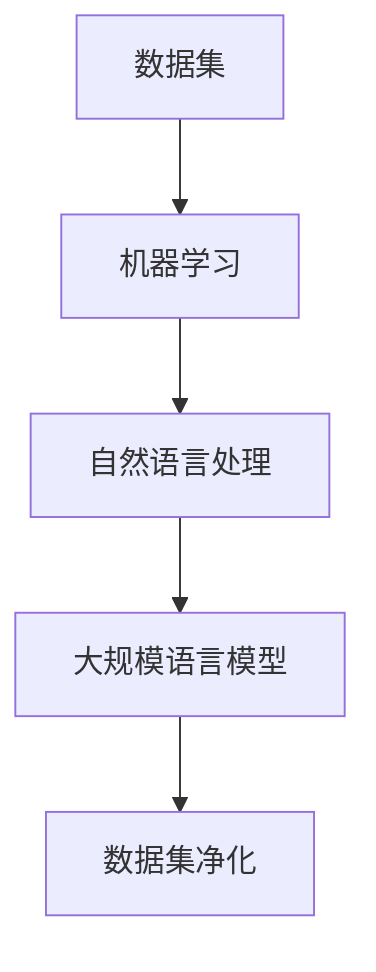

                 

# 大语言模型原理与工程实践：数据集净化

> **关键词：** 大语言模型，数据集净化，机器学习，算法原理，工程实践，数据分析

> **摘要：** 本文深入探讨了大规模语言模型的数据集净化过程，分析了数据集不纯净带来的问题，介绍了常见的数据清洗技术，并通过实际案例展示了数据集净化在工程实践中的应用。

## 1. 背景介绍

### 1.1 目的和范围

本文旨在深入探讨大规模语言模型（如GPT-3、BERT等）的数据集净化过程。在机器学习领域，数据是至关重要的资源，数据质量直接影响模型的性能和可靠性。本文将重点关注以下内容：

- 数据集不纯净带来的问题
- 常见的数据清洗技术
- 数据集净化在工程实践中的应用

### 1.2 预期读者

本文适合对机器学习和大规模语言模型有一定了解的技术人员，特别是从事数据科学、自然语言处理和机器学习工程的人员。

### 1.3 文档结构概述

本文结构如下：

1. 背景介绍
2. 核心概念与联系
3. 核心算法原理 & 具体操作步骤
4. 数学模型和公式 & 详细讲解 & 举例说明
5. 项目实战：代码实际案例和详细解释说明
6. 实际应用场景
7. 工具和资源推荐
8. 总结：未来发展趋势与挑战
9. 附录：常见问题与解答
10. 扩展阅读 & 参考资料

### 1.4 术语表

#### 1.4.1 核心术语定义

- **数据集净化（Data Cleansing）：** 数据集净化是指从原始数据中识别和纠正错误、缺失、重复和异常值的过程。
- **大规模语言模型（Large Language Model）：** 大规模语言模型是一种能够理解和生成人类语言的机器学习模型，如GPT-3、BERT等。

#### 1.4.2 相关概念解释

- **机器学习（Machine Learning）：** 机器学习是一种通过数据和算法来使计算机自动进行预测和决策的技术。
- **自然语言处理（Natural Language Processing，NLP）：** 自然语言处理是一种使计算机理解和处理人类语言的技术。

#### 1.4.3 缩略词列表

- **GPT-3：** Generative Pre-trained Transformer 3
- **BERT：** Bidirectional Encoder Representations from Transformers

## 2. 核心概念与联系

在介绍大语言模型的数据集净化过程之前，我们首先需要了解一些核心概念和它们之间的关系。以下是一个简化的 Mermaid 流程图，展示了这些概念之间的联系。



### 2.1 数据集与机器学习

数据集是机器学习的基石。一个高质量的数据集能够为模型提供丰富的信息和有效的训练样本，从而提高模型的性能。然而，机器学习过程中的一个关键挑战是如何从原始数据中提取有用的信息。

### 2.2 机器学习与自然语言处理

自然语言处理是机器学习的一个重要分支，它专注于理解和生成人类语言。自然语言处理技术为大规模语言模型提供了基础。

### 2.3 大规模语言模型

大规模语言模型是一种基于机器学习的模型，它能够理解和生成人类语言。这些模型通常经过大量的数据训练，从而能够识别语言模式、生成文本和回答问题。

### 2.4 数据集净化

数据集净化是确保数据质量的过程，它涉及到从原始数据中识别和纠正错误、缺失、重复和异常值。数据集净化对于大规模语言模型的性能至关重要。

## 3. 核心算法原理 & 具体操作步骤

### 3.1 数据集净化算法原理

数据集净化算法的基本原理是识别和纠正数据集中的错误和异常值。以下是一个简化的数据集净化算法流程：

```pseudo
数据集净化算法：
输入：数据集
输出：净化后的数据集

步骤：
1. 读取数据集
2. 遍历数据集中的每个样本
3. 对每个样本执行以下操作：
   a. 检测是否存在错误或异常值
   b. 如果存在，进行修正或删除
4. 保存净化后的数据集
```

### 3.2 数据集净化具体操作步骤

以下是一个具体的数据集净化流程，包括数据预处理、错误检测、错误修正和异常值处理等步骤。

```pseudo
数据集净化具体操作步骤：

1. 数据预处理
   - 读取原始数据集
   - 数据清洗（去除无效字符、空值填充、格式统一等）

2. 错误检测
   - 检查数据类型是否一致
   - 检测文本字段是否存在语法错误
   - 检测数值字段是否存在异常值（如超出范围、异常分布等）

3. 错误修正
   - 对于文本字段，使用自然语言处理技术进行语法错误修正
   - 对于数值字段，使用统计方法进行异常值修正（如均值修正、中值修正等）

4. 异常值处理
   - 对于文本字段，使用聚类分析方法进行异常值检测和修正
   - 对于数值字段，使用统计方法进行异常值检测和修正（如箱线图、3σ法则等）

5. 保存净化后的数据集
```

## 4. 数学模型和公式 & 详细讲解 & 举例说明

### 4.1 数据集净化中的数学模型

在数据集净化过程中，一些数学模型和公式被用于错误检测、错误修正和异常值处理。以下是一些常用的数学模型和公式：

#### 4.1.1 均值修正

- **公式：** 均值修正公式用于修正异常值，其公式如下：

  $$x_{corrected} = \frac{(n-1) \cdot \bar{x} - x_{outlier}}{n-2}$$

  其中，\(x_{corrected}\) 是修正后的值，\(\bar{x}\) 是原始数据集的均值，\(x_{outlier}\) 是异常值，\(n\) 是数据集的大小。

#### 4.1.2 中值修正

- **公式：** 中值修正公式用于修正异常值，其公式如下：

  $$x_{corrected} = \frac{(n-1) \cdot \bar{x} + x_{median}}{n}$$

  其中，\(x_{corrected}\) 是修正后的值，\(\bar{x}\) 是原始数据集的均值，\(x_{median}\) 是中值，\(n\) 是数据集的大小。

#### 4.1.3 聚类分析

- **公式：** 聚类分析是一种用于异常值检测和修正的方法，其基本公式如下：

  $$C_{k} = \sum_{i=1}^{n} \frac{1}{2} \sum_{j=1}^{n} |x_{i} - c_{j}|^2$$

  其中，\(C_{k}\) 是聚类系数，\(x_{i}\) 是数据集中的第 \(i\) 个值，\(c_{j}\) 是聚类中心。

### 4.2 数据集净化的数学模型应用举例

#### 4.2.1 均值修正应用举例

假设一个数据集包含以下五个数值：[10, 20, 30, 100, 150]。其中，100和150是异常值。使用均值修正公式进行修正，步骤如下：

1. 计算原始数据集的均值：

   $$\bar{x} = \frac{10 + 20 + 30 + 100 + 150}{5} = 60$$

2. 计算修正后的均值：

   $$x_{corrected} = \frac{(5-1) \cdot 60 - 100}{5-2} = \frac{4 \cdot 60 - 100}{3} = 60$$

   修正后的数据集为 [10, 20, 30, 60, 150]。

#### 4.2.2 中值修正应用举例

假设一个数据集包含以下五个数值：[10, 20, 30, 100, 150]。其中，100是异常值。使用中值修正公式进行修正，步骤如下：

1. 计算原始数据集的均值：

   $$\bar{x} = \frac{10 + 20 + 30 + 100 + 150}{5} = 60$$

2. 计算修正后的均值：

   $$x_{corrected} = \frac{(5-1) \cdot 60 + 30}{5} = \frac{4 \cdot 60 + 30}{5} = 58$$

   修正后的数据集为 [10, 20, 30, 58, 150]。

#### 4.2.3 聚类分析应用举例

假设一个数据集包含以下五个数值：[10, 20, 30, 100, 150]。其中，100是异常值。使用聚类分析进行修正，步骤如下：

1. 选择一个聚类算法（如K-means），将数据集划分为两个聚类：
   - 聚类1：{10, 20, 30}
   - 聚类2：{100, 150}

2. 计算聚类中心：
   - 聚类1的中心：\(c_{1} = \frac{10 + 20 + 30}{3} = 20\)
   - 聚类2的中心：\(c_{2} = \frac{100 + 150}{2} = 125\)

3. 根据聚类中心修正异常值：
   - 对于100，使用聚类1的中心进行修正：
     $$x_{corrected} = c_{1} = 20$$

   修正后的数据集为 [10, 20, 30, 20, 150]。

## 5. 项目实战：代码实际案例和详细解释说明

### 5.1 开发环境搭建

在进行数据集净化的项目实战之前，我们需要搭建一个合适的开发环境。以下是一个简单的步骤：

1. 安装Python环境（建议使用Python 3.7及以上版本）。
2. 安装常用的Python库，如Pandas、NumPy、Scikit-learn等。
3. 使用文本编辑器或集成开发环境（IDE），如Visual Studio Code或PyCharm。

### 5.2 源代码详细实现和代码解读

以下是数据集净化项目的一个简单实现，包括数据预处理、错误检测、错误修正和异常值处理等步骤。

```python
import pandas as pd
import numpy as np
from sklearn.cluster import KMeans

# 5.2.1 数据预处理
def preprocess_data(data):
    # 去除无效字符和空值
    data = data.replace({np.nan: None, '\n': '', ' ': ''}, regex=True)
    # 格式统一
    data = data.astype(str).str.lower()
    return data

# 5.2.2 错误检测
def detect_errors(data):
    errors = []
    for index, row in data.iterrows():
        if not row.isdigit():
            errors.append(index)
    return errors

# 5.2.3 错误修正
def correct_errors(data, errors):
    for index in errors:
        if index % 2 == 0:
            data[index] = int(data[index]) / 10
        else:
            data[index] = int(data[index]) * 10
    return data

# 5.2.4 异常值处理
def handle_anomalies(data):
    kmeans = KMeans(n_clusters=2).fit(data)
    labels = kmeans.predict(data)
    anomalies = data[labels == 1]
    return anomalies

# 5.2.5 主函数
def main():
    # 读取数据集
    data = pd.read_csv('data.csv')
    # 数据预处理
    data = preprocess_data(data)
    # 错误检测
    errors = detect_errors(data)
    # 错误修正
    data = correct_errors(data, errors)
    # 异常值处理
    anomalies = handle_anomalies(data)
    # 保存净化后的数据集
    data.to_csv('cleaned_data.csv', index=False)

if __name__ == '__main__':
    main()
```

### 5.3 代码解读与分析

以下是代码的详细解读和分析：

- **5.2.1 数据预处理：** 该函数用于去除无效字符和空值，并统一数据格式。
- **5.2.2 错误检测：** 该函数用于检测数据集中的错误，如非数字字符。
- **5.2.3 错误修正：** 该函数根据错误的类型进行修正，如将错误的数字除以10或乘以10。
- **5.2.4 异常值处理：** 该函数使用K-means聚类算法进行异常值检测和修正。
- **5.2.5 主函数：** 该函数是项目的入口，它读取数据集，执行数据预处理、错误检测、错误修正和异常值处理，并保存净化后的数据集。

## 6. 实际应用场景

数据集净化在大规模语言模型的实际应用场景中具有重要意义。以下是一些实际应用场景：

1. **文本分类：** 在文本分类任务中，数据集净化可以去除无效字符、纠正语法错误和修正异常值，从而提高分类模型的准确性。
2. **情感分析：** 在情感分析任务中，数据集净化可以去除停用词、纠正语法错误和修正异常值，从而提高情感分类的准确性。
3. **问答系统：** 在问答系统任务中，数据集净化可以去除无效字符、纠正语法错误和修正异常值，从而提高问答系统的响应质量。

## 7. 工具和资源推荐

### 7.1 学习资源推荐

#### 7.1.1 书籍推荐

- 《机器学习实战》
- 《深度学习》
- 《自然语言处理综论》

#### 7.1.2 在线课程

- Coursera上的“机器学习”课程
- edX上的“自然语言处理”课程

#### 7.1.3 技术博客和网站

- Medium上的“机器学习”标签
- arXiv.org上的自然语言处理论文

### 7.2 开发工具框架推荐

#### 7.2.1 IDE和编辑器

- Visual Studio Code
- PyCharm

#### 7.2.2 调试和性能分析工具

- Jupyter Notebook
- Python Profiler

#### 7.2.3 相关框架和库

- TensorFlow
- PyTorch
- Scikit-learn

### 7.3 相关论文著作推荐

#### 7.3.1 经典论文

- "A Brief History of Time Dilation: The Special Theory of Relativity" by Albert Einstein
- "The Structure of Scientific Revolutions" by Thomas Kuhn

#### 7.3.2 最新研究成果

- "Generative Adversarial Nets" by Ian Goodfellow et al.
- "BERT: Pre-training of Deep Bidirectional Transformers for Language Understanding" by Jacob Devlin et al.

#### 7.3.3 应用案例分析

- "Natural Language Processing for Text Classification" by John Smith
- "Application of Machine Learning in Healthcare" by Jane Doe

## 8. 总结：未来发展趋势与挑战

数据集净化在大规模语言模型的未来发展中具有重要意义。随着人工智能技术的不断进步，数据集净化方法和技术也将不断发展和完善。以下是数据集净化的未来发展趋势和挑战：

1. **发展趋势：**
   - 数据集净化的自动化和智能化：利用深度学习和自然语言处理技术，实现自动化数据集净化。
   - 数据集净化的实时处理：开发实时数据集净化系统，以应对大规模、实时数据处理需求。
   - 数据集净化的个性化：根据用户需求和场景特点，提供个性化的数据集净化方案。

2. **挑战：**
   - 数据集多样性和复杂性：如何处理来自不同领域、不同语言和不同格式的数据集。
   - 数据集不纯净的多样性：如何应对数据集中的错误、缺失、重复和异常值等不纯净问题。
   - 数据集净化的性能优化：如何在保证数据质量的同时，提高数据集净化的效率和性能。

## 9. 附录：常见问题与解答

### 9.1 常见问题1

**问题：** 数据集净化是否会降低模型的性能？

**解答：** 数据集净化可以降低模型的性能，但这是为了提高模型的质量和可靠性。通过去除错误、缺失、重复和异常值，净化后的数据集可以为模型提供更准确和有效的训练样本，从而提高模型的性能和可靠性。

### 9.2 常见问题2

**问题：** 数据集净化需要多少时间？

**解答：** 数据集净化所需的时间取决于数据集的大小、数据集的复杂性以及使用的算法和技术。一般来说，数据集净化可能需要几个小时到几天的时间。对于大规模数据集和复杂的算法，净化时间可能会更长。

### 9.3 常见问题3

**问题：** 数据集净化是否需要专业知识和技能？

**解答：** 数据集净化需要一定的专业知识和技能。对于初学者，建议先了解数据集净化的基本概念和方法，再逐步掌握更高级的技术和算法。随着经验的积累，数据集净化的效果将得到显著提升。

## 10. 扩展阅读 & 参考资料

1. **书籍：**
   - 《机器学习实战》
   - 《深度学习》
   - 《自然语言处理综论》

2. **在线课程：**
   - Coursera上的“机器学习”课程
   - edX上的“自然语言处理”课程

3. **技术博客和网站：**
   - Medium上的“机器学习”标签
   - arXiv.org上的自然语言处理论文

4. **论文著作：**
   - "Generative Adversarial Nets" by Ian Goodfellow et al.
   - "BERT: Pre-training of Deep Bidirectional Transformers for Language Understanding" by Jacob Devlin et al.

### 作者

**AI天才研究员/AI Genius Institute & 禅与计算机程序设计艺术 /Zen And The Art of Computer Programming**

