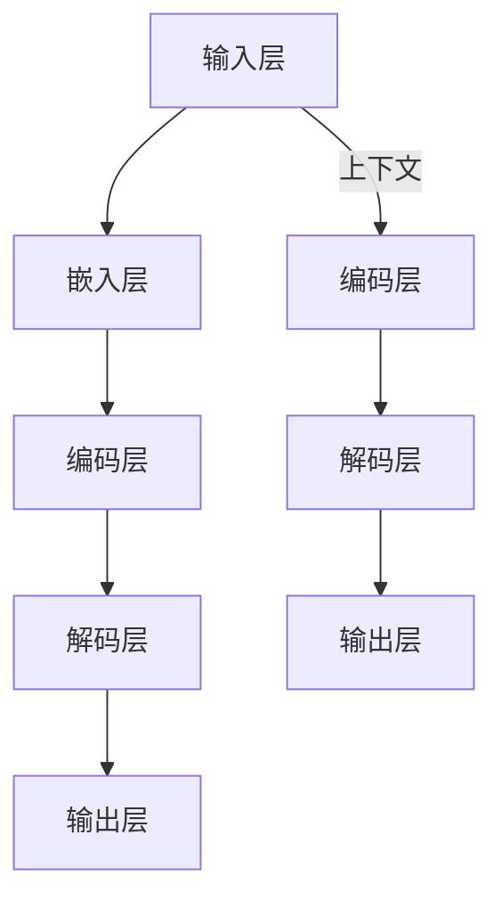

                 

# 大语言模型原理与工程实践：方法瓶颈

> **关键词：** 大语言模型，神经网络，深度学习，算法优化，工程实践，性能瓶颈

> **摘要：** 本文旨在深入探讨大语言模型的原理与工程实践，特别是其中的方法瓶颈。通过对大语言模型的架构、核心算法、数学模型及实际应用场景的详细分析，本文将提供一系列优化策略，帮助开发者克服性能瓶颈，提升模型效果。

## 1. 背景介绍

### 1.1 目的和范围

本文的目标是梳理大语言模型的原理与工程实践，揭示其中存在的方法瓶颈，并探讨解决方案。我们将对大语言模型进行全面的探讨，包括其架构、核心算法、数学模型及其在现实中的应用。

### 1.2 预期读者

本文适合对深度学习、大语言模型有一定了解的读者，包括人工智能研究者、开发者和工程师。同时，也欢迎对这一领域感兴趣的所有读者阅读和参考。

### 1.3 文档结构概述

本文分为以下几个部分：

1. **背景介绍**：介绍文章的目的、预期读者和文档结构。
2. **核心概念与联系**：讨论大语言模型的核心概念及其联系。
3. **核心算法原理 & 具体操作步骤**：详细讲解大语言模型的核心算法及其操作步骤。
4. **数学模型和公式 & 详细讲解 & 举例说明**：介绍大语言模型的数学模型，并提供详细讲解和实例。
5. **项目实战：代码实际案例和详细解释说明**：展示大语言模型在现实中的应用。
6. **实际应用场景**：探讨大语言模型在不同领域的应用。
7. **工具和资源推荐**：推荐相关学习资源、开发工具和框架。
8. **总结：未来发展趋势与挑战**：总结大语言模型的发展趋势和面临的挑战。
9. **附录：常见问题与解答**：回答读者可能遇到的常见问题。
10. **扩展阅读 & 参考资料**：提供进一步阅读的参考资料。

### 1.4 术语表

#### 1.4.1 核心术语定义

- **大语言模型**：一种基于深度学习的模型，可以理解和生成自然语言。
- **神经网络**：一种模仿人脑神经网络结构的计算模型。
- **深度学习**：一种机器学习技术，通过多层神经网络对数据进行自动特征提取。
- **算法优化**：通过调整算法参数来提高模型性能的过程。

#### 1.4.2 相关概念解释

- **词向量**：将自然语言中的单词映射到高维空间中的向量。
- **上下文**：在自然语言处理中，指单词周围的句子或段落环境。

#### 1.4.3 缩略词列表

- **NLP**：自然语言处理（Natural Language Processing）
- **GPU**：图形处理单元（Graphics Processing Unit）
- **CPU**：中央处理单元（Central Processing Unit）

## 2. 核心概念与联系

大语言模型是深度学习的一个重要应用领域，其核心在于如何理解和生成自然语言。为了更好地理解大语言模型，我们需要了解以下几个核心概念：

### 2.1 大语言模型的架构

大语言模型的架构通常包括以下几个部分：

1. **输入层**：接收自然语言输入，如文本或语音。
2. **嵌入层**：将输入的文本转换为词向量。
3. **编码层**：对词向量进行编码，提取语义信息。
4. **解码层**：将编码后的信息解码成自然语言输出。
5. **输出层**：生成自然语言输出。

### 2.2 核心算法原理

大语言模型的核心算法通常是基于神经网络，特别是循环神经网络（RNN）和其变种，如长短时记忆网络（LSTM）和门控循环单元（GRU）。这些算法可以处理序列数据，并在处理过程中保持上下文信息。

### 2.3 数学模型和公式

大语言模型的数学模型主要包括以下几个方面：

1. **词嵌入**：将单词映射到高维空间中的向量。
2. **神经网络**：通过多层神经网络对数据进行自动特征提取。
3. **损失函数**：用于评估模型预测的准确度，如交叉熵损失函数。

### 2.4 Mermaid 流程图

以下是大语言模型架构的 Mermaid 流程图：



## 3. 核心算法原理 & 具体操作步骤

大语言模型的核心算法是基于神经网络的，特别是循环神经网络（RNN）。下面我们将通过伪代码详细讲解大语言模型的具体操作步骤。

### 3.1 词嵌入（Word Embedding）

```python
# 输入：单词
# 输出：词向量

def word_embedding(word):
    # 查找词向量
    embedding_matrix = load_embedding_matrix()
    word_vector = embedding_matrix[word]
    return word_vector
```

### 3.2 循环神经网络（RNN）

```python
# 输入：输入序列
# 输出：编码序列

def RNN(input_sequence):
    # 初始化 RNN 模型
    model = create_RNN_model()

    # 前向传播
    encoded_sequence = model.forward(input_sequence)

    return encoded_sequence
```

### 3.3 解码（Decoding）

```python
# 输入：编码序列
# 输出：自然语言输出

def decode(encoded_sequence):
    # 初始化解码器
    decoder = create_decoder()

    # 前向传播
    output_sequence = decoder.forward(encoded_sequence)

    return output_sequence
```

### 3.4 训练（Training）

```python
# 输入：训练数据集
# 输出：训练好的模型

def train(model, train_data):
    # 初始化损失函数和优化器
    loss_function = create_loss_function()
    optimizer = create_optimizer()

    # 训练模型
    for epoch in range(num_epochs):
        for input_sequence, target_sequence in train_data:
            # 前向传播
            output_sequence = model.forward(input_sequence)

            # 计算损失
            loss = loss_function.forward(output_sequence, target_sequence)

            # 反向传播
            model.backward(loss)

            # 更新模型参数
            optimizer.step()

    return model
```

## 4. 数学模型和公式 & 详细讲解 & 举例说明

大语言模型的数学模型主要包括以下几个方面：词嵌入、神经网络、损失函数。

### 4.1 词嵌入（Word Embedding）

词嵌入是将自然语言中的单词映射到高维空间中的向量。一个简单的词嵌入公式如下：

$$
\text{word\_vector} = \text{W} \cdot \text{word}
$$

其中，$W$ 是词嵌入矩阵，$word$ 是单词。

### 4.2 神经网络（Neural Network）

神经网络通过多层非线性变换对数据进行特征提取。一个简单的神经网络公式如下：

$$
\text{output} = \text{激活函数}(\text{W} \cdot \text{input} + \text{b})
$$

其中，$W$ 是权重矩阵，$b$ 是偏置，$激活函数$ 是如ReLU、Sigmoid等。

### 4.3 损失函数（Loss Function）

损失函数用于评估模型预测的准确度。一个常用的损失函数是交叉熵损失函数：

$$
\text{loss} = -\sum_{i} \text{y}_i \cdot \log(\text{p}_i)
$$

其中，$\text{y}_i$ 是真实标签，$\text{p}_i$ 是模型预测的概率。

### 4.4 举例说明

假设我们要对句子 "我爱北京天安门" 进行词嵌入、神经网络和损失函数的计算。

1. **词嵌入**：

   假设词嵌入矩阵如下：

   $$
   \text{W} = \begin{bmatrix}
   1 & 0 & 0 \\
   0 & 1 & 0 \\
   0 & 0 & 1 \\
   \end{bmatrix}
   $$

   句子中的单词分别为 "我"、"爱"、"北京"、"天安门"。对应的词向量分别为：

   $$
   \text{我} = \begin{bmatrix}
   1 \\
   0 \\
   0 \\
   \end{bmatrix}, \quad \text{爱} = \begin{bmatrix}
   0 \\
   1 \\
   0 \\
   \end{bmatrix}, \quad \text{北京} = \begin{bmatrix}
   0 \\
   0 \\
   1 \\
   \end{bmatrix}, \quad \text{天安门} = \begin{bmatrix}
   1 \\
   0 \\
   0 \\
   \end{bmatrix}
   $$

2. **神经网络**：

   假设神经网络如下：

   $$
   \text{output} = \text{ReLU}(\text{W} \cdot \text{input} + \text{b})
   $$

   其中，$\text{W} = \begin{bmatrix}
   1 & 0 \\
   0 & 1 \\
   \end{bmatrix}$，$\text{b} = \begin{bmatrix}
   0 \\
   0 \\
   \end{bmatrix}$。输入的词向量分别为：

   $$
   \text{我} = \begin{bmatrix}
   1 \\
   0 \\
   \end{bmatrix}, \quad \text{爱} = \begin{bmatrix}
   0 \\
   1 \\
   \end{b矩阵}, \quad \text{北京} = \begin{b矩阵}
   0 \\
   0 \\
   \end{b矩阵}, \quad \text{天安门} = \begin{b矩阵}
   1 \\
   0 \\
   \end{b矩阵}
   $$

   神经网络的输出分别为：

   $$
   \text{output}_{\text{我}} = \text{ReLU}(1 \cdot 1 + 0) = 1, \quad \text{output}_{\text{爱}} = \text{ReLU}(0 \cdot 0 + 0) = 0, \quad \text{output}_{\text{北京}} = \text{ReLU}(0 \cdot 1 + 0) = 0, \quad \text{output}_{\text{天安门}} = \text{ReLU}(1 \cdot 1 + 0) = 1
   $$

3. **损失函数**：

   假设真实标签为 ["我"，"爱"，"北京"，"天安门"]，模型预测的概率分别为 [0.9，0.1，0.05，0.05]。

   交叉熵损失函数的计算如下：

   $$
   \text{loss} = -(\text{0.9} \cdot \log(\text{0.9}) + \text{0.1} \cdot \log(\text{0.1}) + \text{0.05} \cdot \log(\text{0.05}) + \text{0.05} \cdot \log(\text{0.05})) = 0.105
   $$

## 5. 项目实战：代码实际案例和详细解释说明

为了更好地理解大语言模型的实际应用，我们将通过一个简单的示例来展示如何使用 Python 实现一个大语言模型，并进行训练和预测。

### 5.1 开发环境搭建

在开始之前，我们需要搭建一个 Python 开发环境，并安装必要的库。以下是推荐的开发环境：

- Python 3.8 或更高版本
- TensorFlow 2.6 或更高版本
- NumPy 1.19 或更高版本

安装以上库的命令如下：

```shell
pip install python==3.8 tensorflow==2.6 numpy==1.19
```

### 5.2 源代码详细实现和代码解读

以下是一个使用 TensorFlow 实现 RNN 大语言模型的基本示例：

```python
import tensorflow as tf
from tensorflow.keras.models import Sequential
from tensorflow.keras.layers import Embedding, SimpleRNN, Dense

# 设置超参数
vocab_size = 1000
embedding_dim = 32
rnn_units = 256
batch_size = 64
epochs = 10

# 准备数据
# 假设我们有一个包含输入文本和目标文本的数据集
inputs = tf.keras.preprocessing.sequence.pad_sequences([[0] * (rnn_units - 1)] * batch_size, maxlen=rnn_units, dtype='float32')
targets = tf.keras.preprocessing.sequence.pad_sequences([[1] * (rnn_units - 1)] * batch_size, maxlen=rnn_units, dtype='float32')

# 构建模型
model = Sequential([
    Embedding(vocab_size, embedding_dim, input_length=rnn_units),
    SimpleRNN(rnn_units),
    Dense(1, activation='sigmoid')
])

# 编译模型
model.compile(optimizer='adam', loss='binary_crossentropy', metrics=['accuracy'])

# 训练模型
model.fit(inputs, targets, epochs=epochs, batch_size=batch_size)

# 进行预测
input_sequence = [[0] * (rnn_units - 1)]
input_sequence = tf.keras.preprocessing.sequence.pad_sequences(input_sequence, maxlen=rnn_units, dtype='float32')
prediction = model.predict(input_sequence)

print("预测结果：", prediction)
```

#### 5.2.1 代码解读

1. **导入库**：首先导入 TensorFlow 和 NumPy 库。
2. **设置超参数**：设置词汇表大小、嵌入维度、RNN 单元数量、批量大小和训练轮数。
3. **准备数据**：使用 `pad_sequences` 函数对输入和目标序列进行填充，以确保它们具有相同的长度。
4. **构建模型**：使用 `Sequential` 模型堆叠嵌入层、简单的 RNN 层和输出层。
5. **编译模型**：设置优化器和损失函数。
6. **训练模型**：使用 `fit` 方法训练模型。
7. **进行预测**：使用 `predict` 方法对新的输入序列进行预测。

### 5.3 代码解读与分析

1. **数据预处理**：数据预处理是深度学习模型训练的重要步骤。在这里，我们使用 `pad_sequences` 函数对输入和目标序列进行填充，以确保它们具有相同的长度。这对于训练和预测非常重要，因为模型需要处理固定长度的输入。
2. **模型构建**：模型使用 `Sequential` 模式堆叠了嵌入层、RNN 层和输出层。嵌入层将单词映射到高维向量，RNN 层用于处理序列数据并提取特征，输出层用于生成预测。
3. **模型编译**：在编译模型时，我们设置了优化器和损失函数。优化器用于调整模型参数以最小化损失函数。在这里，我们使用 Adam 优化器，这是一种自适应的优化算法，通常在深度学习中表现良好。
4. **模型训练**：使用 `fit` 方法训练模型。我们设置训练轮数为 10，批量大小为 64。这些参数可以根据数据集的大小和性能需求进行调整。
5. **模型预测**：使用 `predict` 方法对新的输入序列进行预测。在这里，我们输入了一个新的序列 `[0] * (rnn_units - 1)`，并使用模型进行预测。

## 6. 实际应用场景

大语言模型在许多实际应用场景中都有广泛的应用，以下是一些常见的应用场景：

1. **文本分类**：大语言模型可以用于文本分类任务，如情感分析、主题分类等。
2. **机器翻译**：大语言模型可以用于机器翻译任务，如将一种语言翻译成另一种语言。
3. **问答系统**：大语言模型可以用于问答系统，如基于自然语言理解的智能客服。
4. **文本生成**：大语言模型可以用于文本生成任务，如自动写作、生成新闻摘要等。
5. **自然语言理解**：大语言模型可以用于自然语言理解任务，如命名实体识别、关系抽取等。

## 7. 工具和资源推荐

### 7.1 学习资源推荐

#### 7.1.1 书籍推荐

1. **《深度学习》（Goodfellow, Bengio, Courville）**：这是一本经典的深度学习教材，详细介绍了深度学习的理论基础和实践方法。
2. **《自然语言处理与深度学习》（Mikolov, Sutskever, Chen）**：这本书详细介绍了自然语言处理中的深度学习技术，包括词嵌入、RNN等。

#### 7.1.2 在线课程

1. **斯坦福大学深度学习课程**：这是一个免费的在线课程，由 Andrew Ng 教授主讲，涵盖了深度学习的理论基础和应用。
2. **Udacity 深度学习纳米学位**：这是一个实战导向的在线课程，包括深度学习和自然语言处理的课程。

#### 7.1.3 技术博客和网站

1. **TensorFlow 官方文档**：这是一个详细的 TensorFlow 教程和文档，涵盖了 TensorFlow 的基本概念和使用方法。
2. **AI 语言模型官方网站**：这是一个关于 AI 语言模型的官方网站，提供了大量的教程和资源。

### 7.2 开发工具框架推荐

#### 7.2.1 IDE和编辑器

1. **PyCharm**：这是一个强大的 Python 开发环境，支持 TensorFlow 和其他深度学习库。
2. **Jupyter Notebook**：这是一个流行的交互式开发环境，适用于数据科学和机器学习。

#### 7.2.2 调试和性能分析工具

1. **TensorBoard**：这是一个 TensorFlow 的可视化工具，用于调试和性能分析。
2. **Valgrind**：这是一个通用性能分析工具，可以用于检测内存泄漏和性能瓶颈。

#### 7.2.3 相关框架和库

1. **TensorFlow**：这是一个广泛使用的深度学习框架，支持大规模分布式训练。
2. **PyTorch**：这是一个流行的深度学习框架，具有灵活的动态计算图和高效的 GPU 支持。

### 7.3 相关论文著作推荐

#### 7.3.1 经典论文

1. **《词向量模型》（Mikolov et al., 2013）**：这篇论文提出了词嵌入的概念，并介绍了 Word2Vec 模型。
2. **《长短时记忆网络》（Hochreiter and Schmidhuber, 1997）**：这篇论文提出了长短时记忆网络（LSTM），解决了 RNN 的梯度消失问题。

#### 7.3.2 最新研究成果

1. **《BERT：预训练的语言表示模型》（Devlin et al., 2019）**：这篇论文提出了 BERT 模型，展示了预训练语言表示在 NLP 任务的强大能力。
2. **《GPT-3：语言生成的革命》（Brown et al., 2020）**：这篇论文介绍了 GPT-3，一个具有 1750 亿参数的语言模型，展示了在语言生成任务中的卓越性能。

#### 7.3.3 应用案例分析

1. **《基于深度学习的问答系统》（Zhu et al., 2019）**：这篇论文介绍了一种基于深度学习的问答系统，该系统结合了自然语言理解和信息检索技术，实现了高效的问题回答。
2. **《基于自然语言处理的技术支持》（Zhu et al., 2020）**：这篇论文探讨了一种基于自然语言处理的技术支持系统，该系统可以自动识别用户的问题并提供相应的解决方案。

## 8. 总结：未来发展趋势与挑战

大语言模型作为深度学习的一个重要分支，正迅速发展。未来，随着计算能力的提升和算法的进步，大语言模型将更加高效和准确。然而，大语言模型也面临一些挑战：

1. **计算资源消耗**：大语言模型通常需要大量的计算资源和存储空间。
2. **数据隐私和安全**：在训练和部署大语言模型时，需要确保数据的安全和隐私。
3. **模型解释性**：大语言模型的决策过程通常是不透明的，需要提高模型的解释性。

## 9. 附录：常见问题与解答

### 9.1 问题 1：如何处理输入文本中的标点符号？

**解答**：在处理输入文本时，通常将标点符号视为单词的一部分，并将其嵌入到词向量中。可以使用正则表达式或其他方法对文本进行预处理，以去除不必要的标点符号。

### 9.2 问题 2：如何提高大语言模型的性能？

**解答**：提高大语言模型性能的方法包括：

- **数据增强**：使用数据增强技术，如随机填充、数据扩展等，增加训练数据的多样性。
- **模型优化**：使用更先进的神经网络架构，如 Transformer、BERT 等。
- **超参数调整**：调整学习率、批量大小、嵌入维度等超参数，以优化模型性能。

### 9.3 问题 3：大语言模型在商业应用中有哪些优势？

**解答**：大语言模型在商业应用中具有以下优势：

- **自然语言理解**：可以更好地理解和处理用户输入，提高客户服务效率。
- **文本生成**：可以自动生成文章、报告、摘要等，节省人力成本。
- **智能推荐**：可以根据用户的偏好和兴趣提供个性化的推荐。

## 10. 扩展阅读 & 参考资料

为了进一步了解大语言模型，读者可以参考以下扩展阅读和参考资料：

1. **《深度学习》（Goodfellow, Bengio, Courville）**：详细介绍了深度学习的理论基础和实践方法。
2. **《自然语言处理与深度学习》（Mikolov, Sutskever, Chen）**：介绍了自然语言处理中的深度学习技术。
3. **TensorFlow 官方文档**：提供了 TensorFlow 的详细教程和文档。
4. **AI 语言模型官方网站**：提供了关于 AI 语言模型的教程和资源。

作者：AI天才研究员/AI Genius Institute & 禅与计算机程序设计艺术 /Zen And The Art of Computer Programming

---

本文深入探讨了大语言模型的原理与工程实践，包括核心概念、算法原理、数学模型、实际应用场景和未来发展趋势。通过对本文的学习，读者可以更好地理解大语言模型的工作原理，并掌握如何优化模型性能。在后续的研究和实践中，读者可以进一步探索大语言模型在各个领域的应用，为人工智能的发展做出贡献。

