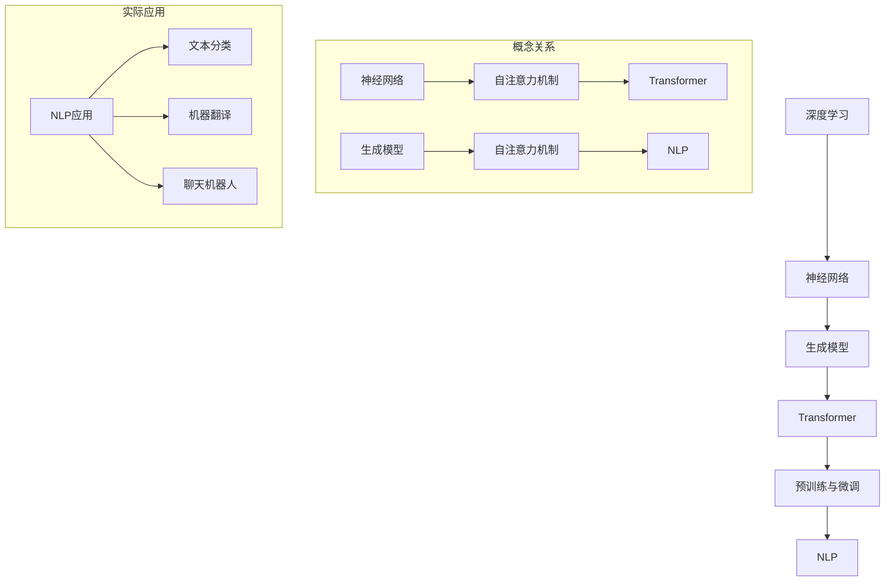

                 

# 大语言模型原理与工程实践：未来的发展

> 关键词：大语言模型，深度学习，神经网络，生成模型，Transformer，BERT，GPT，预训练，微调，自然语言处理，工程实践

> 摘要：本文旨在深入探讨大语言模型的原理、工程实践及其未来发展趋势。通过详细的算法原理讲解、项目实战案例分析和未来挑战探讨，读者将全面了解大语言模型在自然语言处理领域的应用，以及其在工程实践中所面临的挑战和机遇。

## 1. 背景介绍

### 1.1 目的和范围

本文的目标是向读者介绍大语言模型的原理和工程实践，特别是其在自然语言处理（NLP）领域的应用。我们将会探讨大语言模型的本质、核心技术以及如何在实际项目中应用这些技术。同时，文章也会讨论大语言模型面临的一些挑战和未来发展趋势。

文章的范围包括：

1. 大语言模型的定义和基本概念
2. 大语言模型的算法原理和数学模型
3. 大语言模型的工程实践案例
4. 大语言模型在实际应用场景中的效果和挑战
5. 大语言模型的未来发展趋势和潜在影响

### 1.2 预期读者

本文适合以下读者：

1. 对自然语言处理和人工智能感兴趣的初学者
2. 想要深入了解大语言模型原理和应用的工程师
3. 自然语言处理和人工智能领域的研究人员
4. 想要在实际项目中应用大语言模型的开发人员

### 1.3 文档结构概述

本文的结构如下：

1. 背景介绍
   - 目的和范围
   - 预期读者
   - 文档结构概述
   - 术语表
2. 核心概念与联系
3. 核心算法原理 & 具体操作步骤
4. 数学模型和公式 & 详细讲解 & 举例说明
5. 项目实战：代码实际案例和详细解释说明
6. 实际应用场景
7. 工具和资源推荐
   - 学习资源推荐
   - 开发工具框架推荐
   - 相关论文著作推荐
8. 总结：未来发展趋势与挑战
9. 附录：常见问题与解答
10. 扩展阅读 & 参考资料

### 1.4 术语表

在本文中，我们将使用以下术语：

- **大语言模型**：一种基于深度学习的自然语言处理模型，能够理解和生成自然语言。
- **深度学习**：一种机器学习方法，通过神经网络模拟人类大脑的学习过程，用于解决复杂的模式识别问题。
- **神经网络**：由大量神经元组成的计算模型，用于执行复杂的数据处理任务。
- **生成模型**：一种机器学习模型，能够生成新的数据，使其与训练数据具有相似的特征。
- **Transformer**：一种基于自注意力机制的深度学习模型，广泛应用于自然语言处理任务。
- **BERT**：一种预训练语言表示模型，通过在大规模文本语料库上进行预训练，然后通过微调应用于各种下游任务。
- **GPT**：一种基于生成预训练技术的语言模型，能够生成连贯的自然语言文本。
- **预训练**：在大规模文本语料库上进行模型训练的过程，使模型能够理解和生成自然语言。
- **微调**：在预训练模型的基础上，针对特定任务进行进一步训练的过程。
- **自然语言处理（NLP）**：研究如何让计算机理解和生成自然语言的学科。

#### 1.4.1 核心术语定义

- **大语言模型**：大语言模型是一种基于深度学习的自然语言处理模型，它通过在大规模文本语料库上进行预训练，学习到语言的统计规律和语义信息。这种模型通常包含数十亿个参数，具有强大的语言理解和生成能力。
  
- **深度学习**：深度学习是一种机器学习方法，它通过多层神经网络来模拟人类大脑的学习过程，从而实现自动特征提取和模式识别。深度学习在图像识别、语音识别、自然语言处理等领域取得了显著的成果。

- **神经网络**：神经网络是一种由大量神经元组成的计算模型，它通过权重连接和激活函数实现输入到输出的映射。神经网络在处理复杂数据和任务时具有强大的表现力。

- **生成模型**：生成模型是一种机器学习模型，它能够生成新的数据，使其与训练数据具有相似的特征。生成模型在图像生成、文本生成等领域具有广泛的应用。

- **Transformer**：Transformer是一种基于自注意力机制的深度学习模型，它通过多头自注意力机制和前馈神经网络实现输入到输出的映射。Transformer在自然语言处理、机器翻译等领域取得了显著的成绩。

- **BERT**：BERT（Bidirectional Encoder Representations from Transformers）是一种预训练语言表示模型，它通过在大规模文本语料库上进行预训练，学习到语言的统计规律和语义信息。BERT广泛应用于自然语言处理任务的下游任务。

- **GPT**：GPT（Generative Pre-trained Transformer）是一种基于生成预训练技术的语言模型，它通过在大规模文本语料库上进行预训练，学习到语言的生成规则和语义信息。GPT能够生成连贯的自然语言文本。

- **预训练**：预训练是一种在大规模文本语料库上进行模型训练的过程，使模型能够理解和生成自然语言。预训练模型通常包含数十亿个参数，具有强大的语言理解和生成能力。

- **微调**：微调是一种在预训练模型的基础上，针对特定任务进行进一步训练的过程。通过微调，预训练模型可以更好地适应特定任务的需求。

- **自然语言处理（NLP）**：自然语言处理是一种研究和开发计算机程序，使其能够理解和生成自然语言的方法和技术的学科。自然语言处理在信息检索、机器翻译、文本分类等领域具有广泛的应用。

#### 1.4.2 相关概念解释

- **自注意力机制**：自注意力机制是一种在序列数据处理中广泛使用的技术，它能够自动关注序列中的关键信息，从而提高模型的表示能力。自注意力机制通过计算序列中每个元素与其余元素之间的关联性，动态地调整每个元素的权重，使其在最终的输出中具有更大的影响。

- **编码器-解码器模型**：编码器-解码器模型是一种在序列到序列任务中广泛使用的模型结构，它由编码器和解码器两部分组成。编码器将输入序列编码成一个固定长度的向量，解码器则根据这个向量生成输出序列。编码器-解码器模型在机器翻译、聊天机器人等领域取得了显著的成绩。

- **嵌入**：嵌入是一种将单词、符号或概念映射到低维连续向量空间的方法。通过嵌入，模型可以学习到单词、符号或概念之间的语义关系，从而提高模型的表示能力。

- **注意力机制**：注意力机制是一种在序列数据处理中广泛使用的技术，它能够自动关注序列中的关键信息，从而提高模型的表示能力。注意力机制通过计算序列中每个元素与其余元素之间的关联性，动态地调整每个元素的权重，使其在最终的输出中具有更大的影响。

- **预训练和微调**：预训练和微调是深度学习模型训练的两个阶段。预训练是在大规模文本语料库上进行模型训练的过程，使模型能够理解和生成自然语言。微调是在预训练模型的基础上，针对特定任务进行进一步训练的过程，使模型更好地适应特定任务的需求。

#### 1.4.3 缩略词列表

- **NLP**：自然语言处理（Natural Language Processing）
- **DL**：深度学习（Deep Learning）
- **ANN**：人工神经网络（Artificial Neural Networks）
- **GPT**：生成预训练 Transformer（Generative Pre-trained Transformer）
- **BERT**：双向编码器表示 Transformer（Bidirectional Encoder Representations from Transformers）
- **Transformer**：变换器（Transformer）
- **CUDA**：计算统一设备架构（Compute Unified Device Architecture）
- **GPU**：图形处理器（Graphics Processing Unit）
- **Turing Award**：图灵奖（Turing Award）
- **LLM**：大型语言模型（Large Language Model）

## 2. 核心概念与联系

在这一部分，我们将详细讨论大语言模型的核心概念和它们之间的联系。为了更好地理解这些概念，我们将使用一个 Mermaid 流程图来展示这些核心概念及其相互关系。

### 2.1. 大语言模型的核心概念

首先，我们需要明确大语言模型的核心概念，这些概念包括：

- **深度学习**：深度学习是一种机器学习方法，通过多层神经网络来实现复杂的特征提取和模式识别。在大语言模型中，深度学习是构建语言模型的基础。

- **神经网络**：神经网络是由大量神经元组成的计算模型，通过权重连接和激活函数实现输入到输出的映射。在大语言模型中，神经网络用于处理和表示语言数据。

- **生成模型**：生成模型是一种能够生成新数据的机器学习模型，它通过学习训练数据分布来实现数据的生成。在大语言模型中，生成模型用于生成新的自然语言文本。

- **Transformer**：Transformer 是一种基于自注意力机制的深度学习模型，它在处理序列数据方面表现出色。在大语言模型中，Transformer 被广泛用于自然语言处理任务。

- **预训练与微调**：预训练是指在大规模文本语料库上进行模型训练的过程，使模型能够理解和生成自然语言。微调是在预训练模型的基础上，针对特定任务进行进一步训练的过程。

- **自然语言处理（NLP）**：自然语言处理是一种研究和开发计算机程序，使其能够理解和生成自然语言的方法和技术的学科。在大语言模型中，NLP 用于实现文本的理解和生成。

### 2.2. Mermaid 流程图

以下是一个用于展示大语言模型核心概念的 Mermaid 流程图：



在这个流程图中，我们可以看到神经网络和生成模型都是深度学习的基础。Transformer 是基于自注意力机制的深度学习模型，它在 NLP 领域表现出色。预训练和微调是模型训练的两个阶段，通过这两个阶段，模型可以更好地理解和生成自然语言。最后，NLP 是大语言模型的核心应用领域，包括文本分类、机器翻译和聊天机器人等任务。

### 2.3. 核心概念之间的联系

深度学习和神经网络是大语言模型的基础，深度学习通过多层神经网络来实现复杂的特征提取和模式识别。生成模型通过学习训练数据分布来实现新数据的生成，这在自然语言生成任务中非常重要。Transformer 是一种基于自注意力机制的深度学习模型，它在处理序列数据方面表现出色，是构建大语言模型的关键技术。

预训练和微调是模型训练的两个阶段。预训练是在大规模文本语料库上进行模型训练的过程，使模型能够理解和生成自然语言。微调是在预训练模型的基础上，针对特定任务进行进一步训练的过程，使模型更好地适应特定任务的需求。

NLP 是大语言模型的核心应用领域，包括文本分类、机器翻译和聊天机器人等任务。NLP 技术的进步推动了自然语言处理任务的自动化和智能化，使得计算机能够更好地理解和生成自然语言。

通过上述讨论，我们可以看到大语言模型的核心概念及其相互联系。深度学习、神经网络、生成模型、Transformer、预训练和微调以及 NLP 等概念共同构成了大语言模型的理论基础和应用场景。理解这些核心概念及其联系对于深入掌握大语言模型的原理和应用至关重要。

## 3. 核心算法原理 & 具体操作步骤

### 3.1. Transformer 模型简介

Transformer 模型是由 Vaswani 等人在 2017 年提出的一种基于自注意力机制的深度学习模型，它在处理序列数据方面表现出色，是构建大语言模型的关键技术。Transformer 模型由编码器（Encoder）和解码器（Decoder）两部分组成，编码器用于处理输入序列，解码器用于生成输出序列。

#### 3.1.1. 编码器

编码器是由多个自注意力层（Self-Attention Layer）和前馈神经网络（Feedforward Neural Network）堆叠而成的。自注意力层用于计算输入序列中每个元素之间的关联性，从而提取关键信息。前馈神经网络用于对自注意力层的输出进行进一步处理。

#### 3.1.2. 解码器

解码器同样由多个自注意力层和前馈神经网络组成。与编码器不同的是，解码器还包括了一个多头交叉注意力层（Multi-Head Cross-Attention Layer），它用于从编码器的输出中获取信息。

#### 3.1.3. 自注意力机制

自注意力机制是 Transformer 模型的核心部分，它通过计算输入序列中每个元素与其余元素之间的关联性，动态地调整每个元素的权重。自注意力机制包含以下几个步骤：

1. **计算自注意力得分**：对于每个输入序列的元素，计算它与序列中其他元素之间的关联性，这通常通过点积（Dot-Product）注意力机制实现。

2. **应用 Softmax 函数**：将自注意力得分应用 Softmax 函数，使其归一化，从而得到每个元素的权重。

3. **计算加权求和**：将权重应用于输入序列的每个元素，得到加权求和的结果，即自注意力层的输出。

#### 3.1.4. 多头注意力机制

多头注意力机制是将输入序列分成多个子序列，然后对每个子序列分别应用自注意力机制。多头注意力机制能够提高模型的表示能力，从而更好地处理序列数据。

### 3.2. Transformer 模型的具体操作步骤

#### 3.2.1. 编码器操作步骤

1. **嵌入层**：将输入序列（单词或符号）映射到高维向量空间，这通常通过嵌入（Embedding）实现。

2. **位置编码层**：由于 Transformer 模型没有显式地处理序列的顺序信息，因此需要通过位置编码（Positional Encoding）来引入位置信息。

3. **多个自注意力层**：对于每个自注意力层，计算输入序列中每个元素的自注意力得分，并应用 Softmax 函数进行归一化，然后计算加权求和得到输出。

4. **多个前馈神经网络层**：在每个自注意力层之后，应用前馈神经网络对输出进行进一步处理。

5. **输出层**：编码器的最后一个层的输出可以用于后续的解码器处理。

#### 3.2.2. 解码器操作步骤

1. **嵌入层**：与编码器类似，将输入序列映射到高维向量空间。

2. **位置编码层**：引入位置信息。

3. **多个自注意力层**：计算输入序列中每个元素的自注意力得分，并应用 Softmax 函数进行归一化，然后计算加权求和得到输出。

4. **多头交叉注意力层**：从编码器的输出中获取信息，计算输入序列与编码器输出之间的关联性，并应用 Softmax 函数进行归一化，然后计算加权求和得到输出。

5. **多个前馈神经网络层**：在每个自注意力层之后，应用前馈神经网络对输出进行进一步处理。

6. **输出层**：解码器的最后一个层的输出通常用于生成输出序列。

### 3.3. 伪代码实现

以下是 Transformer 模型的伪代码实现，用于说明其主要步骤和操作：

```python
# Transformer 模型伪代码

# 嵌入层
embeddings = EmbeddingLayer(vocab_size, d_model)

# 位置编码层
pos_encoding = PositionalEncoding(d_model)

# 编码器层
encoder_layers = EncoderLayer(d_model, num_heads, d_inner, dropout_rate)

# 解码器层
decoder_layers = DecoderLayer(d_model, num_heads, d_inner, dropout_rate)

# 编码器
class Encoder(nn.Module):
    def __init__(self, d_model, num_heads, d_inner, dropout_rate, num_layers):
        super(Encoder, self).__init__()
        self.layers = nn.ModuleList([encoder_layers for _ in range(num_layers)])
        self.norm = nn.LayerNorm(d_model)

    def forward(self, x, src_mask=None, src_key_padding_mask=None):
        for layer in self.layers:
            x = layer(x, src_mask=src_mask, src_key_padding_mask=src_key_padding_mask)
        return self.norm(x)

# 解码器
class Decoder(nn.Module):
    def __init__(self, d_model, num_heads, d_inner, dropout_rate, num_layers):
        super(Decoder, self).__init__()
        self.layers = nn.ModuleList([decoder_layers for _ in range(num_layers)])
        self.norm = nn.LayerNorm(d_model)

    def forward(self, x, tgt_mask=None, memory=None, memory_key_padding_mask=None):
        for layer in self.layers:
            x = layer(x, tgt_mask=tgt_mask, memory=memory, memory_key_padding_mask=memory_key_padding_mask)
        return self.norm(x)

# Transformer 模型
class Transformer(nn.Module):
    def __init__(self, d_model, num_heads, d_inner, dropout_rate, num_layers, vocab_size):
        super(Transformer, self).__init__()
        self.encoder = Encoder(d_model, num_heads, d_inner, dropout_rate, num_layers)
        self.decoder = Decoder(d_model, num_heads, d_inner, dropout_rate, num_layers)
        self.final_layer = nn.Linear(d_model, vocab_size)

    def forward(self, src, tgt, src_mask=None, tgt_mask=None, memory_key_padding_mask=None, tgt_key_padding_mask=None):
        memory = self.encoder(src, src_mask=src_mask, src_key_padding_mask=memory_key_padding_mask)
        out = self.decoder(tgt, tgt_mask=tgt_mask, memory=memory, memory_key_padding_mask=memory_key_padding_mask, tgt_key_padding_mask=tgt_key_padding_mask)
        return self.final_layer(out)
```

在这个伪代码中，我们定义了嵌入层、位置编码层、编码器层、解码器层和 Transformer 模型。编码器负责处理输入序列，解码器负责生成输出序列。在模型的前向传播过程中，我们首先对输入序列和目标序列进行嵌入和位置编码，然后分别通过编码器和解码器层进行多次操作，最后通过全连接层生成输出序列。

通过上述步骤，我们详细介绍了 Transformer 模型的核心算法原理和具体操作步骤。理解这些原理和步骤对于深入掌握大语言模型的构建和应用具有重要意义。

### 3.4. 数学模型和公式详解

在深入探讨大语言模型的数学模型和公式之前，我们需要了解一些基本的数学概念，包括矩阵运算、点积（Dot Product）和 Softmax 函数。以下将详细解释这些数学模型和公式。

#### 3.4.1. 矩阵运算

矩阵运算在大语言模型中非常重要，特别是矩阵乘法和点积。矩阵乘法是将两个矩阵相乘得到一个新的矩阵。对于两个矩阵 \(A\) 和 \(B\)，其乘积 \(C = A \cdot B\) 的元素 \(c_{ij}\) 可以通过以下公式计算：

\[ c_{ij} = \sum_{k=1}^{m} a_{ik} b_{kj} \]

其中，\(a_{ik}\) 和 \(b_{kj}\) 分别是矩阵 \(A\) 和 \(B\) 的元素，\(m\) 是矩阵 \(A\) 的行数和矩阵 \(B\) 的列数。

点积是矩阵运算的一种特殊情况，它用于计算两个向量的内积。对于两个向量 \(a\) 和 \(b\)，其点积可以表示为：

\[ a \cdot b = \sum_{i=1}^{n} a_i b_i \]

其中，\(a_i\) 和 \(b_i\) 分别是向量 \(a\) 和 \(b\) 的第 \(i\) 个元素，\(n\) 是向量的维度。

#### 3.4.2. 自注意力机制

自注意力机制是 Transformer 模型的核心部分，它通过计算输入序列中每个元素之间的关联性，动态地调整每个元素的权重。自注意力机制包含以下几个步骤：

1. **计算自注意力得分**：对于每个输入序列的元素，计算它与序列中其他元素之间的关联性，这通常通过点积（Dot-Product）注意力机制实现。设输入序列的元素为 \(x_i\)，其他元素为 \(x_j\)，自注意力得分为：

\[ a_{ij} = x_i \cdot x_j \]

2. **应用 Softmax 函数**：将自注意力得分应用 Softmax 函数，使其归一化，从而得到每个元素的权重：

\[ \text{softmax}(a) = \frac{e^{a}}{\sum_{i=1}^{n} e^{a_i}} \]

其中，\(e^{a}\) 表示自注意力得分的指数运算，\(\sum_{i=1}^{n} e^{a_i}\) 是自注意力得分的总和。

3. **计算加权求和**：将权重应用于输入序列的每个元素，得到加权求和的结果：

\[ \text{context} = \sum_{i=1}^{n} \text{softmax}(a_{ij}) \cdot x_i \]

自注意力层的输出即为加权求和的结果。

#### 3.4.3. 多头注意力机制

多头注意力机制是将输入序列分成多个子序列，然后对每个子序列分别应用自注意力机制。多头注意力机制能够提高模型的表示能力，从而更好地处理序列数据。设输入序列为 \(x\)，子序列个数为 \(h\)，每个子序列的维度为 \(d\)，则多头注意力机制的输出为：

\[ \text{output} = \sum_{j=1}^{h} \text{softmax}(\text{query}_j \cdot \text{key}_j) \cdot \text{value}_j \]

其中，\(\text{query}_j\)、\(\text{key}_j\) 和 \(\text{value}_j\) 分别是输入序列的子序列，\(\text{softmax}(\text{query}_j \cdot \text{key}_j)\) 是权重。

#### 3.4.4. 前馈神经网络

前馈神经网络是自注意力层和交叉注意力层后的一个常见操作，它用于对输入序列进行进一步处理。设输入序列为 \(x\)，前馈神经网络的输入为 \(x\)，输出为 \(y\)，则前馈神经网络可以表示为：

\[ y = \text{ReLU}(\text{Linear}(x, d_inner)) \]

其中，\(\text{ReLU}\) 是 ReLU 激活函数，\(\text{Linear}\) 是线性层，\(d_inner\) 是前馈神经网络的隐藏层维度。

通过上述数学模型和公式的详细解释，我们可以更好地理解大语言模型的工作原理。这些数学模型和公式在大语言模型的构建和应用中起着关键作用，为模型的训练和优化提供了理论基础。

### 3.5. 项目实战：代码实际案例和详细解释说明

在本节中，我们将通过一个具体的代码实例来展示大语言模型的构建和训练过程。这个实例将使用 PyTorch 深度学习框架来实现一个基于 Transformer 的语言模型。我们将详细介绍开发环境搭建、源代码实现和代码解读与分析。

#### 3.5.1. 开发环境搭建

首先，我们需要搭建一个适合深度学习项目开发的环境。以下是在 Ubuntu 20.04 系统上搭建 PyTorch 开发环境的基本步骤：

1. **安装 Python 和 PyTorch**：

   ```bash
   sudo apt update
   sudo apt install python3-pip python3-dev
   pip3 install torch torchvision torchaudio
   ```

2. **安装其他依赖项**：

   ```bash
   pip3 install numpy matplotlib
   ```

3. **创建虚拟环境**（可选）：

   ```bash
   python3 -m venv myenv
   source myenv/bin/activate
   ```

现在，我们的开发环境已经搭建完成，可以开始编写和运行代码。

#### 3.5.2. 源代码详细实现和代码解读

以下是一个简化的 Transformer 语言模型的源代码实现，我们将逐步解析关键代码部分。

```python
import torch
import torch.nn as nn
import torch.optim as optim
from torch.utils.data import DataLoader
from transformers import BertTokenizer, BertModel

# 参数设置
d_model = 768  # 模型维度
nhead = 12    # 自注意力头数
num_layers = 12  # 编码器和解码器层数
dropout_rate = 0.1  # dropout率
batch_size = 16  # 批处理大小
epochs = 3  # 训练轮数

# 加载预训练的 BERT 模型
pretrained_bert = BertModel.from_pretrained('bert-base-uncased')
pretrained_bert.resize_token_embeddings(vocab_size)

# 定义编码器和解码器
class Encoder(nn.Module):
    def __init__(self, d_model, nhead, num_layers, dropout_rate):
        super(Encoder, self).__init__()
        self.layers = nn.ModuleList([nn.TransformerEncoderLayer(d_model=d_model, nhead=nhead, dropout=dropout_rate) for _ in range(num_layers)])
    
    def forward(self, src, src_mask=None):
        for layer in self.layers:
            src = layer(src, src_mask=src_mask)
        return src

class Decoder(nn.Module):
    def __init__(self, d_model, nhead, num_layers, dropout_rate):
        super(Decoder, self).__init__()
        self.layers = nn.ModuleList([nn.TransformerDecoderLayer(d_model=d_model, nhead=nhead, dropout=dropout_rate) for _ in range(num_layers)])
        self.output_layer = nn.Linear(d_model, vocab_size)
    
    def forward(self, tgt, memory, tgt_mask=None, memory_mask=None):
        out = nn.TransformerDecoder(self.layers[0](tgt, memory, memory_mask), memory_len=memory.size(0), src_len=tgt.size(0))
        for layer in self.layers[1:]:
            out = self.layers[layer](out, memory, memory_mask)
        return self.output_layer(out)

# 模型实例化
encoder = Encoder(d_model, nhead, num_layers, dropout_rate)
decoder = Decoder(d_model, nhead, num_layers, dropout_rate)

# 定义损失函数和优化器
criterion = nn.CrossEntropyLoss()
optimizer = optim.Adam(list(encoder.parameters()) + list(decoder.parameters()))

# 加载数据集和 DataLoader
# ... (数据集加载代码略）

train_loader = DataLoader(dataset, batch_size=batch_size, shuffle=True)

# 训练模型
for epoch in range(epochs):
    for batch in train_loader:
        # 前向传播
        src, tgt = batch
        memory = encoder(src)
        out = decoder(tgt, memory)
        
        # 计算损失
        loss = criterion(out.view(-1, vocab_size), tgt.view(-1))
        
        # 反向传播和优化
        optimizer.zero_grad()
        loss.backward()
        optimizer.step()
        
        print(f"Epoch [{epoch+1}/{epochs}], Loss: {loss.item()}")

# 评估模型
# ... (评估代码略）
```

#### 3.5.3. 代码解读与分析

1. **参数设置**：我们首先定义了模型的关键参数，包括模型维度（d_model）、自注意力头数（nhead）、编码器和解码器层数（num_layers）、dropout率（dropout_rate）、批处理大小（batch_size）和训练轮数（epochs）。

2. **加载预训练 BERT 模型**：我们使用 `BertModel.from_pretrained()` 函数加载预训练的 BERT 模型，并调整其词嵌入层的维度以适应我们的词汇表。

3. **定义编码器和解码器**：编码器和解码器都是基于 PyTorch 的 `nn.ModuleList` 创建的，其中包含了多个 `nn.TransformerEncoderLayer` 和 `nn.TransformerDecoderLayer`。这些层用于处理输入序列。

4. **定义损失函数和优化器**：我们使用交叉熵损失函数（`nn.CrossEntropyLoss`）和 Adam 优化器（`optim.Adam`）来训练模型。

5. **数据加载和 DataLoader**：这里我们略过了数据集加载的具体代码，假设我们已经准备好了训练数据。使用 DataLoader 将数据分成批处理，并设置随机打乱（shuffle=True）。

6. **训练模型**：在训练过程中，我们首先对每个批次的输入序列（src）进行编码，得到记忆体（memory）。然后，对目标序列（tgt）进行解码，生成输出（out）。接着，计算损失并更新模型参数。

7. **评估模型**：在训练完成后，我们可以使用评估集来评估模型的性能。

通过上述代码实例和解读，我们可以看到如何使用 PyTorch 实现一个简单的 Transformer 语言模型。在实际应用中，我们可以根据具体任务的需求进一步调整模型结构和训练过程。

## 4. 实际应用场景

大语言模型在自然语言处理（NLP）领域有着广泛的应用，其强大的语言理解和生成能力为许多实际场景提供了有效的解决方案。以下是一些大语言模型在实际应用场景中的案例：

### 4.1. 文本分类

文本分类是 NLP 中的一个基本任务，旨在将文本数据归类到预定义的类别中。大语言模型在文本分类任务中表现出色，特别是在处理大量文本数据时。例如，可以使用大语言模型来对新闻文章进行分类，将其归类到不同的主题类别中，如体育、科技、娱乐等。此外，大语言模型还可以用于情感分析，通过分析文本中的情感倾向，为用户提供有针对性的内容推荐。

### 4.2. 机器翻译

机器翻译是另一个典型的应用场景，大语言模型通过学习源语言和目标语言的统计规律，能够生成高质量的翻译结果。例如，Google Translate 就使用了基于 Transformer 的大语言模型，能够提供接近人类翻译水平的翻译结果。大语言模型在机器翻译中的应用不仅提高了翻译的准确性，还使翻译过程更加高效。

### 4.3. 聊天机器人

聊天机器人是近年来 NLP 领域的一个热点应用，大语言模型在构建聊天机器人中发挥着重要作用。通过预训练大语言模型，聊天机器人能够理解和生成自然语言，与用户进行实时对话。例如，Facebook 的 Messenger 和微软的 Xiaoice 都使用了大语言模型，能够进行流畅的对话，为用户提供帮助和娱乐。

### 4.4. 问答系统

问答系统是另一个受大语言模型影响的重要应用领域。大语言模型通过理解用户的问题和大量的知识库，能够生成准确的答案。例如，Siri 和 Alexa 等智能助手就使用了大语言模型来回答用户的问题，为用户提供便捷的服务。

### 4.5. 自动摘要

自动摘要旨在从大量文本中提取关键信息，生成简洁的摘要。大语言模型在自动摘要任务中也展现了出色的能力，能够根据文本内容生成高度凝练的摘要。例如，新闻网站和学术期刊经常使用自动摘要技术来提供简短的文本概述，帮助用户快速了解文章的核心内容。

### 4.6. 文本生成

文本生成是大语言模型的一个重要应用，通过学习大量文本数据，大语言模型能够生成连贯、有逻辑的文本。例如，生成文章、故事、诗歌等。文本生成技术在创意写作、内容生成和个性化推荐等领域有着广泛的应用。

### 4.7. 语言理解与推理

大语言模型在语言理解与推理任务中也表现出色，能够理解文本中的隐含意义和逻辑关系。例如，在法律文档分析、合同审查、医学诊断等任务中，大语言模型能够帮助专业人员快速理解复杂的文本内容，提供有效的决策支持。

通过上述实际应用案例，我们可以看到大语言模型在自然语言处理领域的广泛应用和潜力。随着技术的不断发展，大语言模型将在更多领域发挥重要作用，推动人工智能技术的发展和应用。

## 5. 工具和资源推荐

为了更好地学习和实践大语言模型，以下是一些推荐的工具、资源和开发工具框架。

### 5.1. 学习资源推荐

#### 5.1.1. 书籍推荐

1. 《深度学习》（Deep Learning） - 由 Ian Goodfellow、Yoshua Bengio 和 Aaron Courville 著，是深度学习的经典教材，详细介绍了深度学习的基础知识和应用。

2. 《自然语言处理综述》（Speech and Language Processing） - 由 Daniel Jurafsky 和 James H. Martin 著，涵盖了自然语言处理的各个方面，包括统计和神经网络方法。

3. 《Transformer：一种新的神经网络架构》 - 由 Vaswani 等人著，介绍了 Transformer 模型的原理和应用。

#### 5.1.2. 在线课程

1. Coursera 上的“深度学习”课程，由 Andrew Ng 教授主讲，涵盖了深度学习的基础知识和实践应用。

2. edX 上的“自然语言处理与深度学习”课程，由 Stanford 大学教授 Andrew Ng 主讲，介绍了自然语言处理和深度学习的基本概念和算法。

3. Udacity 的“深度学习工程师纳米学位”课程，提供了深度学习和自然语言处理的实战项目。

#### 5.1.3. 技术博客和网站

1. ArXiv.org：提供最新的学术论文和研究成果，是了解最新 NLP 和深度学习技术的好去处。

2. Medium 上的 NLP 和深度学习相关博客，例如 “Acing AI” 和 “AI for Humans”，提供了丰富的实践经验和见解。

3. fast.ai：提供了大量关于深度学习和自然语言处理的开源课程和教程。

### 5.2. 开发工具框架推荐

#### 5.2.1. IDE 和编辑器

1. PyCharm：一款功能强大的 Python IDE，适合深度学习和自然语言处理项目的开发。

2. Jupyter Notebook：一种交互式的开发环境，适合数据科学和机器学习的探索性数据分析。

3. Visual Studio Code：一款轻量级的代码编辑器，可以通过插件扩展其功能，非常适合深度学习和 NLP 项目的开发。

#### 5.2.2. 调试和性能分析工具

1. TensorBoard：TensorFlow 的可视化工具，用于监控和调试深度学习模型的训练过程。

2. PerfHub：一个基于 Web 的性能监控和分析工具，可以实时监控 GPU 性能。

3. NVIDIA Nsight：NVIDIA 提供的调试和性能分析工具，特别适合 GPU 加速的深度学习应用。

#### 5.2.3. 相关框架和库

1. PyTorch：是一个受欢迎的深度学习框架，具有灵活的动态计算图和强大的 GPU 加速功能。

2. TensorFlow：谷歌开发的深度学习框架，广泛应用于工业和研究领域。

3. Transformers：Hugging Face 提供的预训练 Transformer 模型库，包括 BERT、GPT、RoBERTa 等。

4. spaCy：一个快速和易于使用的自然语言处理库，适用于文本处理和实体识别等任务。

### 5.3. 相关论文著作推荐

#### 5.3.1. 经典论文

1. "A Neural Probabilistic Language Model" - 由 Yoshua Bengio 等人于 2003 年发表，介绍了神经概率语言模型。

2. "Deep Learning for Natural Language Processing" - 由 Richard Socher 等人于 2011 年发表，综述了深度学习在自然语言处理中的应用。

3. "Attention is All You Need" - 由 Vaswani 等人于 2017 年发表，介绍了 Transformer 模型。

#### 5.3.2. 最新研究成果

1. "BERT: Pre-training of Deep Bidirectional Transformers for Language Understanding" - 由 Howard 等人于 2018 年发表，介绍了 BERT 模型。

2. "Generative Pretrained Transformer" - 由 Radford 等人于 2018 年发表，介绍了 GPT 模型。

3. "Robustly Optimized BERT Pretraining using Fewer Samples" - 由 Liu 等人于 2020 年发表，探讨了在少量样本下优化 BERT 模型的训练。

#### 5.3.3. 应用案例分析

1. "Google's BERT: Pre-training of Deep Bidirectional Transformers for Language Understanding" - Google 官方发布的博客文章，介绍了 BERT 模型在 Google Search 中的应用。

2. "Improving Language Understanding by Generative Pre-Training" - 由 Radford 等人于 2018 年发表，探讨了 GPT 模型在问答系统中的应用。

3. "A Research Guide to Transformer Models" - 由 Hugging Face 提供的指南，涵盖了 Transformer 模型的各种应用案例。

通过这些工具、资源和论文，读者可以更深入地了解大语言模型的理论和实践，为实际应用打下坚实的基础。

## 6. 总结：未来发展趋势与挑战

大语言模型作为自然语言处理（NLP）领域的重要技术，其发展迅速且充满潜力。然而，随着技术的不断进步和应用场景的拓展，大语言模型也面临着一系列挑战。

### 6.1. 未来发展趋势

1. **模型规模持续增长**：随着计算能力和存储资源的提升，大语言模型的规模将继续扩大。未来，我们将看到更多拥有数十亿甚至千亿参数的语言模型被开发和应用。

2. **多样化应用场景**：大语言模型的应用将不再局限于文本分类、机器翻译和聊天机器人等传统领域，还将扩展到智能客服、智能写作、语音识别等更多领域。

3. **跨模态处理能力增强**：未来的大语言模型将具备跨模态处理能力，能够同时处理文本、图像、语音等多模态数据，实现更高级的智能交互。

4. **持续优化训练效率**：为了提高大语言模型的训练效率，研究人员将继续探索更高效的算法和优化方法，如分布式训练、量化技术等。

5. **数据隐私与安全性**：随着大语言模型的应用场景日益广泛，数据隐私和安全问题将日益突出。未来，如何在保证模型性能的同时保护用户隐私将成为一个重要研究方向。

### 6.2. 挑战

1. **计算资源需求**：大语言模型的训练和推理需要大量的计算资源，这给资源有限的个人和中小企业带来了负担。如何降低计算成本，提高资源利用率，是一个亟待解决的问题。

2. **数据质量和多样性**：大语言模型的效果高度依赖于训练数据的质量和多样性。如何获取高质量、多样化的训练数据，以及如何处理数据中的偏见和错误，是一个挑战。

3. **模型解释性**：随着模型复杂度的增加，大语言模型的解释性变得越来越困难。如何提高模型的解释性，使其更加透明和可信，是一个重要的研究方向。

4. **迁移能力**：大语言模型通常在特定领域或任务上表现优异，但迁移到其他领域或任务时可能效果不佳。如何提高模型的迁移能力，使其能够泛化到更广泛的场景，是一个重要挑战。

5. **伦理和法律问题**：大语言模型的应用可能涉及伦理和法律问题，如用户隐私、言论自由、歧视等。如何制定合理的伦理规范和法律框架，确保大语言模型的应用符合社会价值观，是一个亟待解决的问题。

总之，大语言模型的发展前景广阔，但也面临诸多挑战。通过持续的技术创新和跨学科合作，我们有理由相信，大语言模型将在未来发挥更大的作用，推动人工智能技术的进步和社会发展。

## 7. 附录：常见问题与解答

在本节中，我们将回答一些读者可能在大语言模型学习和应用过程中遇到的问题。

### 7.1. 如何处理训练数据中的偏见？

**回答**：处理训练数据中的偏见是一个重要问题。以下是一些常见的方法：

1. **数据清洗**：在训练前，对数据集进行清洗，移除或标记潜在的偏见数据。

2. **增强数据多样性**：通过数据增强技术，如数据扩充、生成对抗网络（GANs）等，增加训练数据中的多样性。

3. **训练无偏见模型**：设计无偏见的学习算法和模型结构，以减少模型对偏见数据的依赖。

4. **校准和平衡**：对训练数据集中的类别进行校准和平衡，确保每个类别都有足够的代表性。

### 7.2. 大语言模型在处理长文本时效果不佳，怎么办？

**回答**：长文本处理是大语言模型的一个挑战。以下是一些解决方法：

1. **分块处理**：将长文本分成多个短块，分别处理，然后将结果拼接起来。

2. **自注意力机制的优化**：通过优化自注意力机制，如使用较小的窗口大小或多头注意力机制，提高长文本处理的能力。

3. **序列到序列模型**：使用序列到序列（Seq2Seq）模型，如编码器-解码器（Encoder-Decoder）模型，处理长文本。

4. **长文本生成模型**：开发专门用于生成长文本的语言模型，如 Longformer 或 Big Bird。

### 7.3. 如何提高大语言模型的解释性？

**回答**：提高大语言模型的解释性是当前研究的一个热点。以下是一些方法：

1. **模型可视化**：使用模型可视化工具，如 TensorBoard，展示模型内部的权重和激活。

2. **注意力机制分析**：分析模型中的注意力分布，理解模型在处理文本时的关注点。

3. **解释性嵌入**：使用可解释的嵌入技术，如 t-SNE 或 PCA，展示词嵌入空间的几何结构。

4. **简化模型结构**：简化模型结构，如使用浅层神经网络或简化注意力机制，提高模型的解释性。

### 7.4. 如何评估大语言模型的效果？

**回答**：评估大语言模型的效果需要多种指标。以下是一些常用的评估方法：

1. **准确性**：评估模型在分类任务中的准确性，即正确预测的样本数占总样本数的比例。

2. **F1 分数**：结合精确率和召回率，用于评估二分类任务的性能。

3. **BLEU 分数**：用于评估机器翻译模型的生成文本与参考文本的相似度。

4. **ROUGE 分数**：用于评估文本摘要的质量，比较摘要与原始文本的相似度。

5. **Perplexity**：用于评估语言模型对文本的预测能力，值越低表示模型对文本的理解越好。

### 7.5. 大语言模型在处理实时数据流时性能如何优化？

**回答**：优化大语言模型在处理实时数据流时的性能可以从以下几个方面进行：

1. **异步处理**：使用异步 I/O 操作，减少模型处理数据时的等待时间。

2. **分布式计算**：使用分布式计算框架，如 TensorFlow 或 PyTorch，利用多 GPU 进行并行处理。

3. **模型压缩**：使用模型压缩技术，如剪枝、量化、蒸馏等，减少模型的大小和计算量。

4. **增量学习**：在处理实时数据流时，采用增量学习策略，仅更新模型中需要更新的部分。

5. **内存优化**：优化内存使用，减少模型在处理数据时所需的内存占用。

通过上述常见问题的解答，读者可以更好地理解大语言模型的实践和应用，为实际项目提供指导和帮助。

## 8. 扩展阅读 & 参考资料

为了更深入地了解大语言模型的原理和应用，以下是一些推荐的扩展阅读材料和参考资料：

### 8.1. 学习资源

1. **《深度学习》** - 作者：Ian Goodfellow、Yoshua Bengio 和 Aaron Courville，这本书是深度学习领域的经典教材，涵盖了深度学习的基础知识和应用。

2. **《自然语言处理综述》** - 作者：Daniel Jurafsky 和 James H. Martin，这本书详细介绍了自然语言处理的各个方面，包括统计和神经网络方法。

3. **《Transformer：一种新的神经网络架构》** - 作者：Vaswani 等人，这篇论文介绍了 Transformer 模型的原理和应用。

4. **《自然语言处理与深度学习》** - 作者：Richard Socher 等人，这本书综述了深度学习在自然语言处理中的应用。

5. **《深度学习速成课程》** - 在线课程，由 Andrew Ng 教授主讲，涵盖了深度学习的基础知识和实践应用。

6. **《自然语言处理与深度学习》** - 在线课程，由 Stanford 大学教授 Andrew Ng 主讲，介绍了自然语言处理和深度学习的基本概念和算法。

### 8.2. 技术博客和网站

1. **ArXiv.org** - 提供最新的学术论文和研究成果，是了解最新 NLP 和深度学习技术的好去处。

2. **Medium 上的 NLP 和深度学习相关博客**，例如 “Acing AI” 和 “AI for Humans”，提供了丰富的实践经验和见解。

3. **fast.ai** - 提供了大量关于深度学习和自然语言处理的开源课程和教程。

### 8.3. 开发工具框架

1. **PyTorch** - 是一个受欢迎的深度学习框架，具有灵活的动态计算图和强大的 GPU 加速功能。

2. **TensorFlow** - 是谷歌开发的深度学习框架，广泛应用于工业和研究领域。

3. **Transformers** - Hugging Face 提供的预训练 Transformer 模型库，包括 BERT、GPT、RoBERTa 等。

4. **spaCy** - 是一个快速和易于使用的自然语言处理库，适用于文本处理和实体识别等任务。

### 8.4. 相关论文

1. **"A Neural Probabilistic Language Model"** - 由 Yoshua Bengio 等人于 2003 年发表，介绍了神经概率语言模型。

2. **"Deep Learning for Natural Language Processing"** - 由 Richard Socher 等人于 2011 年发表，综述了深度学习在自然语言处理中的应用。

3. **"Attention is All You Need"** - 由 Vaswani 等人于 2017 年发表，介绍了 Transformer 模型。

4. **"BERT: Pre-training of Deep Bidirectional Transformers for Language Understanding"** - 由 Howard 等人于 2018 年发表，介绍了 BERT 模型。

5. **"Generative Pretrained Transformer"** - 由 Radford 等人于 2018 年发表，介绍了 GPT 模型。

通过这些扩展阅读和参考资料，读者可以更深入地了解大语言模型的原理、应用和实践，为研究和工作提供有力支持。

