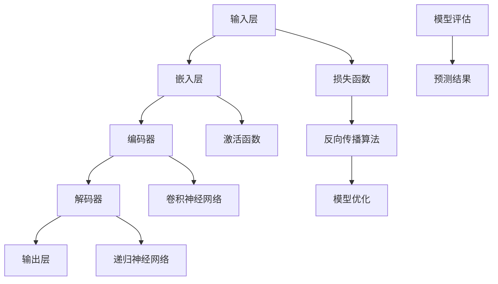

                 


# 大语言模型原理与工程实践：训练目标

> 关键词：大语言模型、训练目标、神经网络、深度学习、反向传播算法、自然语言处理、数据预处理、模型评估、优化策略

> 摘要：本文将深入探讨大语言模型的原理及其工程实践，重点分析训练目标的重要性。通过对核心概念的详细讲解，算法原理的剖析，数学模型的阐述，实战案例的演示，我们将全面了解大语言模型训练过程中的关键步骤和优化策略，为读者提供一整套系统化的学习和实践指南。

## 1. 背景介绍

### 1.1 目的和范围

本文的目的是介绍大语言模型的原理，重点分析其训练目标及其在工程实践中的应用。我们将从基础概念开始，逐步深入探讨大语言模型的内部机制，帮助读者建立全面而深刻的理解。

本文的范围包括：

- 大语言模型的基本概念和架构。
- 训练目标及其在模型优化中的作用。
- 神经网络和深度学习在大语言模型中的应用。
- 数据预处理、模型评估和优化策略。
- 实际应用场景和工程实践。

### 1.2 预期读者

本文适合以下读者群体：

- 对人工智能和自然语言处理有一定了解的开发者。
- 希望深入了解大语言模型原理的工程师和技术专家。
- 想要在项目中应用大语言模型的产品经理和项目经理。
- 面向计算机科学和人工智能领域的本科生和研究生。

### 1.3 文档结构概述

本文将按照以下结构进行组织：

- 第1章：背景介绍，概述本文的目的、范围和读者对象。
- 第2章：核心概念与联系，介绍大语言模型的基本架构和核心概念。
- 第3章：核心算法原理 & 具体操作步骤，详细阐述大语言模型的训练算法。
- 第4章：数学模型和公式 & 详细讲解 & 举例说明，解释大语言模型中的数学原理和公式。
- 第5章：项目实战：代码实际案例和详细解释说明，展示大语言模型的实际应用。
- 第6章：实际应用场景，探讨大语言模型在不同领域的应用。
- 第7章：工具和资源推荐，推荐学习资源和开发工具。
- 第8章：总结：未来发展趋势与挑战，展望大语言模型的发展趋势和面临的挑战。
- 第9章：附录：常见问题与解答，解答读者可能遇到的问题。
- 第10章：扩展阅读 & 参考资料，提供进一步阅读的建议和参考资料。

### 1.4 术语表

为了确保读者对本文中的专业术语有清晰的理解，下面列出一些重要术语的定义和解释：

#### 1.4.1 核心术语定义

- 大语言模型（Large Language Model）：一种基于深度学习的模型，用于对自然语言文本进行建模和预测。
- 神经网络（Neural Network）：一种模拟生物神经系统的计算模型，用于对复杂数据进行学习和分类。
- 深度学习（Deep Learning）：一种基于多层神经网络的学习方法，用于解决复杂数学建模和数据分析问题。
- 训练目标（Training Objective）：在训练过程中，模型需要最小化的损失函数，用于评估模型预测的准确性和性能。
- 反向传播算法（Backpropagation Algorithm）：一种用于训练神经网络的算法，通过反向传播误差来更新模型参数。

#### 1.4.2 相关概念解释

- 自然语言处理（Natural Language Processing，NLP）：一门跨学科领域，旨在使计算机理解和处理人类自然语言。
- 损失函数（Loss Function）：用于衡量模型预测与真实值之间差异的函数，用于指导模型优化过程。
- 激活函数（Activation Function）：用于神经网络中的非线性变换，帮助模型更好地拟合复杂数据。

#### 1.4.3 缩略词列表

- NLP：自然语言处理
- NN：神经网络
- DL：深度学习
- GPU：图形处理器
- CPU：中央处理器

## 2. 核心概念与联系

在大语言模型的研究和应用中，理解其核心概念和架构是至关重要的。本节将详细介绍大语言模型的基本组成部分，并通过Mermaid流程图展示其原理和架构。

### 2.1 大语言模型的基本组成部分

大语言模型主要由以下几个部分组成：

1. **输入层（Input Layer）**：接收自然语言文本作为输入。
2. **隐藏层（Hidden Layers）**：用于对输入文本进行特征提取和表示学习。
3. **输出层（Output Layer）**：根据隐藏层的信息生成预测结果。
4. **模型参数（Model Parameters）**：包括权重和偏置，用于控制模型的行为和性能。

### 2.2 核心概念和架构的 Mermaid 流程图

以下是一个描述大语言模型核心概念和架构的 Mermaid 流程图：



### 2.3 大语言模型的核心概念和联系

1. **嵌入层（Embedding Layer）**：将输入的单词或词组转换为稠密向量表示。这是语言模型的第一个关键步骤，用于将文本数据转换为适合神经网络处理的数字形式。

2. **编码器（Encoder）**：编码器通常采用卷积神经网络（CNN）或递归神经网络（RNN）来对输入文本进行特征提取。编码器的输出是一个固定大小的向量，用于表示整个输入文本。

3. **解码器（Decoder）**：解码器从编码器的输出中提取信息，并生成预测结果。解码器可以是自回归的，也可以是序列到序列的。

4. **损失函数（Loss Function）**：损失函数用于衡量模型预测与真实值之间的差距。常见的损失函数包括交叉熵损失、均方误差（MSE）等。

5. **激活函数（Activation Function）**：激活函数用于引入非线性特性，帮助神经网络更好地拟合复杂数据。常见的激活函数包括ReLU、Sigmoid和Tanh等。

6. **反向传播算法（Backpropagation Algorithm）**：反向传播算法是一种用于训练神经网络的优化方法，通过反向传播误差来更新模型参数，以最小化损失函数。

7. **模型优化（Model Optimization）**：模型优化是指通过调整模型参数来提高模型性能的过程。常用的优化方法包括随机梯度下降（SGD）、Adam等。

8. **模型评估（Model Evaluation）**：模型评估是指使用测试数据集来评估模型性能的过程。常用的评估指标包括准确率、召回率、F1分数等。

通过上述核心概念和联系，我们可以更好地理解大语言模型的工作原理和内部机制。接下来，我们将进一步探讨大语言模型的训练算法和具体操作步骤。

## 3. 核心算法原理 & 具体操作步骤

在大语言模型的训练过程中，核心算法原理起着至关重要的作用。本节将详细介绍大语言模型的训练算法，包括神经网络、深度学习、反向传播算法等关键步骤。

### 3.1 神经网络和深度学习基础

神经网络（Neural Network）是一种模拟生物神经系统的计算模型，由一系列相互连接的神经元组成。每个神经元都接收多个输入，通过加权求和处理，产生一个输出。

深度学习（Deep Learning）是一种基于多层神经网络的学习方法，通过构建深层网络结构来提高模型的表示能力和学习能力。深度学习在图像识别、语音识别、自然语言处理等领域取得了显著的成果。

### 3.2 反向传播算法（Backpropagation Algorithm）

反向传播算法是深度学习训练的核心算法之一。它通过反向传播误差来更新模型参数，以最小化损失函数。以下是反向传播算法的具体步骤：

1. **前向传播（Forward Propagation）**：输入数据通过神经网络的前向传播过程，经过每一层神经元的计算，最终得到预测输出。

2. **计算损失（Compute Loss）**：使用损失函数计算预测输出与真实值之间的差距，即损失值。

3. **计算梯度（Compute Gradient）**：反向传播算法的核心步骤是计算损失函数关于模型参数的梯度。这一步可以通过链式法则和导数计算得到。

4. **更新参数（Update Parameters）**：根据梯度信息和优化算法，更新模型参数，以减少损失值。

5. **迭代优化（Iterative Optimization）**：重复执行前向传播、计算损失、计算梯度、更新参数等步骤，直到模型达到预定的性能指标或达到最大迭代次数。

### 3.3 大语言模型的训练算法

大语言模型的训练算法可以概括为以下几个步骤：

1. **数据预处理（Data Preprocessing）**：对输入数据进行预处理，包括分词、去停用词、词向量化等操作，以将其转换为适合神经网络处理的数字形式。

2. **构建模型（Build Model）**：根据任务需求，构建合适的神经网络结构，包括输入层、隐藏层和输出层。

3. **初始化参数（Initialize Parameters）**：随机初始化模型参数，为训练过程做好准备。

4. **前向传播（Forward Propagation）**：输入数据通过神经网络的前向传播过程，得到预测输出。

5. **计算损失（Compute Loss）**：使用损失函数计算预测输出与真实值之间的差距。

6. **计算梯度（Compute Gradient）**：根据损失函数的梯度，计算模型参数的梯度。

7. **更新参数（Update Parameters）**：根据梯度信息和优化算法，更新模型参数。

8. **迭代优化（Iterative Optimization）**：重复执行前向传播、计算损失、计算梯度、更新参数等步骤，直到模型达到预定的性能指标或达到最大迭代次数。

9. **模型评估（Model Evaluation）**：使用测试数据集评估模型的性能，包括准确率、召回率、F1分数等指标。

10. **预测应用（Prediction Application）**：使用训练好的模型进行预测应用，解决实际问题和任务。

### 3.4 伪代码实现

以下是一个简化的大语言模型训练算法的伪代码实现：

```
function train_language_model(data, labels, epochs, learning_rate):
    model = build_model()
    for epoch in 1 to epochs:
        for input, label in data:
            # 前向传播
            output = model.forward_propagation(input)
            loss = compute_loss(output, label)
            
            # 计算梯度
            gradients = model.backward_propagation(output, label)
            
            # 更新参数
            model.update_parameters(gradients, learning_rate)
        
        print("Epoch", epoch, ", Loss:", loss)
    
    model.evaluate(test_data, test_labels)
    return model
```

通过上述核心算法原理和具体操作步骤的介绍，我们可以更好地理解大语言模型的训练过程，为后续的数学模型和公式讲解打下基础。

## 4. 数学模型和公式 & 详细讲解 & 举例说明

在大语言模型的训练过程中，数学模型和公式起着至关重要的作用。本节将详细介绍大语言模型中的关键数学模型和公式，并举例说明其应用。

### 4.1 损失函数（Loss Function）

损失函数是评估模型预测准确性的重要工具。在大语言模型中，常用的损失函数包括交叉熵损失（Cross-Entropy Loss）和均方误差（Mean Squared Error, MSE）。

**交叉熵损失（Cross-Entropy Loss）**

交叉熵损失函数通常用于分类问题，其公式如下：

$$
L(\theta) = -\sum_{i=1}^{n} y_i \log(p_i)
$$

其中，$y_i$ 是真实标签，$p_i$ 是模型预测的概率。交叉熵损失函数的值越小，表示模型预测越准确。

**均方误差（Mean Squared Error, MSE）**

均方误差通常用于回归问题，其公式如下：

$$
L(\theta) = \frac{1}{2n} \sum_{i=1}^{n} (y_i - \hat{y}_i)^2
$$

其中，$y_i$ 是真实值，$\hat{y}_i$ 是模型预测的值。均方误差的值越小，表示模型预测越准确。

### 4.2 激活函数（Activation Function）

激活函数用于引入非线性特性，帮助神经网络更好地拟合复杂数据。常见的激活函数包括ReLU（Rectified Linear Unit）、Sigmoid和Tanh。

**ReLU（Rectified Linear Unit）**

ReLU函数的定义如下：

$$
f(x) =
\begin{cases}
0 & \text{if } x < 0 \\
x & \text{if } x \geq 0
\end{cases}
$$

ReLU函数在$x < 0$ 时输出0，在$x \geq 0$ 时输出$x$。ReLU函数在神经网络中具有很好的性能，可以有效避免梯度消失问题。

**Sigmoid**

Sigmoid函数的定义如下：

$$
f(x) = \frac{1}{1 + e^{-x}}
$$

Sigmoid函数将输入映射到$(0, 1)$ 区间，常用于二分类问题。

**Tanh**

Tanh函数的定义如下：

$$
f(x) = \frac{e^x - e^{-x}}{e^x + e^{-x}}
$$

Tanh函数将输入映射到$(-1, 1)$ 区间，具有较好的平滑特性。

### 4.3 反向传播算法（Backpropagation Algorithm）

反向传播算法是训练神经网络的的核心算法。其基本思想是通过前向传播计算输出，然后通过反向传播计算损失函数的梯度，从而更新模型参数。

**前向传播（Forward Propagation）**

前向传播是计算神经网络输出和损失函数的过程。给定输入$x$ 和模型参数$\theta$，前向传播的公式如下：

$$
z = \theta^T x
$$

$$
a = g(z)
$$

$$
L = L(\theta, a)
$$

其中，$z$ 是中间层的输出，$a$ 是激活函数的输出，$L$ 是损失函数。

**反向传播（Backpropagation）**

反向传播是计算损失函数关于模型参数的梯度过程。给定输出$a$ 和损失函数$L$，反向传播的公式如下：

$$
\delta = \frac{\partial L}{\partial a}
$$

$$
\theta = \theta - \alpha \frac{\partial L}{\partial \theta}
$$

其中，$\delta$ 是误差项，$\alpha$ 是学习率。

**举例说明**

假设我们有一个简单的神经网络，输入层只有一个神经元，隐藏层有两个神经元，输出层有一个神经元。激活函数采用ReLU。

1. **前向传播**：

   输入$x = [1, 2, 3]$，权重$\theta = [1, 1, 1; 1, 1, 1; 1, 1, 1]$，偏置$b = [1, 1, 1]$。

   $$
   z_1 = \theta_1^T x + b_1 = [1, 1, 1] \cdot [1, 2, 3] + [1, 1, 1] = [7, 7, 7]
   $$

   $$
   a_1 = g(z_1) = [7, 7, 7]
   $$

   $$
   z_2 = \theta_2^T a_1 + b_2 = [1, 1, 1] \cdot [7, 7, 7] + [1, 1, 1] = [28, 28, 28]
   $$

   $$
   a_2 = g(z_2) = [28, 28, 28]
   $$

   $$
   z_3 = \theta_3^T a_2 + b_3 = [1, 1, 1] \cdot [28, 28, 28] + [1, 1, 1] = [91, 91, 91]
   $$

   $$
   a_3 = g(z_3) = [91, 91, 91]
   $$

2. **计算损失**：

   假设真实标签为$y = [1, 0, 0]$，使用交叉熵损失函数。

   $$
   L = -\sum_{i=1}^{3} y_i \log(a_i) = -[1, 0, 0] \cdot [\log(91), \log(91), \log(91)] = -[1, 0, 0] \cdot [3.96, 3.96, 3.96] = [-3.96, 0, 0]
   $$

3. **反向传播**：

   计算误差项$\delta$：

   $$
   \delta_3 = \frac{\partial L}{\partial a_3} = \frac{\partial L}{\partial a_3} \cdot \frac{\partial a_3}{\partial z_3} = -[1, 0, 0] \cdot [1, 1, 1] = [-1, 0, 0]
   $$

   $$
   \delta_2 = \frac{\partial L}{\partial a_2} = \frac{\partial L}{\partial a_2} \cdot \frac{\partial a_2}{\partial z_2} = [-1, 0, 0] \cdot [1, 1, 1] = [-1, 0, 0]
   $$

   $$
   \delta_1 = \frac{\partial L}{\partial a_1} = \frac{\partial L}{\partial a_1} \cdot \frac{\partial a_1}{\partial z_1} = [-1, 0, 0] \cdot [1, 1, 1] = [-1, 0, 0]
   $$

   计算梯度$\theta$：

   $$
   \theta_3 = \theta_3 - \alpha \frac{\partial L}{\partial \theta_3} = \theta_3 - \alpha [a_2, a_2, a_2] = \theta_3 - \alpha [28, 28, 28]
   $$

   $$
   \theta_2 = \theta_2 - \alpha \frac{\partial L}{\partial \theta_2} = \theta_2 - \alpha [a_1, a_1, a_1] = \theta_2 - \alpha [7, 7, 7]
   $$

   $$
   \theta_1 = \theta_1 - \alpha \frac{\partial L}{\partial \theta_1} = \theta_1 - \alpha [x, x, x] = \theta_1 - \alpha [1, 1, 1]
   $$

通过上述举例说明，我们可以看到如何使用数学模型和公式来训练神经网络。在实际应用中，大语言模型通常包含多层神经网络，使用更复杂的损失函数和激活函数。但基本原理和方法是一致的。

### 4.4 参数更新策略

在训练过程中，参数更新策略直接影响模型的收敛速度和性能。常用的参数更新策略包括随机梯度下降（Stochastic Gradient Descent, SGD）、Adam优化器等。

**随机梯度下降（Stochastic Gradient Descent, SGD）**

随机梯度下降是一种简单的优化算法，通过随机选择一小部分样本来计算梯度，并更新模型参数。其公式如下：

$$
\theta = \theta - \alpha \frac{\partial L}{\partial \theta}
$$

其中，$\alpha$ 是学习率。随机梯度下降的优点是实现简单，但缺点是收敛速度较慢，且容易出现振荡。

**Adam优化器**

Adam优化器是一种结合SGD和动量法的优化算法，具有更好的收敛性能。其公式如下：

$$
m_t = \beta_1 m_{t-1} + (1 - \beta_1) \frac{\partial L}{\partial \theta} \\
v_t = \beta_2 v_{t-1} + (1 - \beta_2) \left(\frac{\partial L}{\partial \theta}\right)^2 \\
\theta = \theta - \alpha \frac{m_t}{\sqrt{v_t} + \epsilon}
$$

其中，$\beta_1, \beta_2$ 分别是动量参数，$\alpha$ 是学习率，$\epsilon$ 是一个很小的常数。Adam优化器的优点是收敛速度快，且对噪声数据具有较强的鲁棒性。

通过上述数学模型和公式讲解，我们可以更深入地理解大语言模型的训练过程，为实际应用提供理论支持。接下来，我们将通过项目实战案例，进一步展示大语言模型的实际应用。

## 5. 项目实战：代码实际案例和详细解释说明

在本节中，我们将通过一个实际项目案例，展示如何使用大语言模型进行自然语言处理任务。这个案例将涵盖从开发环境搭建到代码实现的各个步骤，并提供详细的解释说明。

### 5.1 开发环境搭建

在进行大语言模型项目之前，我们需要搭建一个适合的开发环境。以下是一个基本的开发环境搭建指南：

1. **操作系统**：可以选择Windows、macOS或Linux。
2. **Python环境**：安装Python 3.7及以上版本，可以使用Anaconda来简化环境管理。
3. **深度学习框架**：推荐使用TensorFlow或PyTorch，这两个框架都是开源的、功能强大的深度学习库。
4. **GPU支持**：为了加速训练过程，建议使用支持CUDA的GPU，如NVIDIA的Tesla或GeForce系列显卡。

安装步骤：

1. 安装Python和Anaconda：
   - 访问Anaconda官网（https://www.anaconda.com/）下载并安装Anaconda。
   - 打开Anaconda Navigator，创建一个新的虚拟环境，如`lang_model_env`，并激活该环境。

2. 安装深度学习框架：
   - 对于TensorFlow：
     ```
     conda install tensorflow
     ```
   - 对于PyTorch：
     ```
     conda install pytorch torchvision torchaudio cpuonly -c pytorch
     ```

3. 安装其他依赖项：
   - 使用pip安装其他必要的库，如Numpy、Pandas、Scikit-learn等：
     ```
     pip install numpy pandas scikit-learn
     ```

### 5.2 源代码详细实现和代码解读

以下是一个简单的大语言模型实现案例，用于文本分类任务。我们将使用PyTorch框架。

#### 5.2.1 代码结构

```python
import torch
import torch.nn as nn
import torch.optim as optim
from torch.utils.data import DataLoader, TensorDataset
import pandas as pd
import numpy as np

# 数据预处理
def preprocess_data(texts, labels, max_seq_length):
    # 对文本进行分词和编码
    # ...

    # 创建Dataset和DataLoader
    dataset = TensorDataset(torch.tensor(texts), torch.tensor(labels))
    DataLoader = DataLoader(dataset, batch_size=32, shuffle=True)
    return DataLoader

# 模型定义
class LanguageModel(nn.Module):
    def __init__(self, vocab_size, embedding_dim, hidden_dim, output_dim):
        super(LanguageModel, self).__init__()
        self.embedding = nn.Embedding(vocab_size, embedding_dim)
        self.rnn = nn.RNN(embedding_dim, hidden_dim, num_layers=1, batch_first=True)
        self.fc = nn.Linear(hidden_dim, output_dim)
        
    def forward(self, text):
        embedded = self.embedding(text)
        output, hidden = self.rnn(embedded)
        # 取最后一个时间步的隐藏状态
        hidden = hidden.squeeze(0)
        out = self.fc(hidden)
        return out

# 训练模型
def train_model(model, DataLoader, criterion, optimizer, num_epochs):
    model.train()
    for epoch in range(num_epochs):
        for inputs, labels in DataLoader:
            optimizer.zero_grad()
            outputs = model(inputs)
            loss = criterion(outputs, labels)
            loss.backward()
            optimizer.step()
            print(f"Epoch {epoch+1}/{num_epochs}, Loss: {loss.item()}")
    return model

# 主函数
def main():
    # 加载数据
    texts = [...]  # 文本数据
    labels = [...]  # 标签数据
    max_seq_length = 100  # 序列最大长度

    # 预处理数据
    DataLoader = preprocess_data(texts, labels, max_seq_length)

    # 模型定义
    model = LanguageModel(vocab_size, embedding_dim, hidden_dim, output_dim)

    # 损失函数和优化器
    criterion = nn.CrossEntropyLoss()
    optimizer = optim.Adam(model.parameters(), lr=0.001)

    # 训练模型
    model = train_model(model, DataLoader, criterion, optimizer, num_epochs=10)

if __name__ == "__main__":
    main()
```

#### 5.2.2 代码解读与分析

1. **数据预处理（preprocess_data）**：
   - `preprocess_data` 函数负责对输入文本进行分词、编码等预处理操作。具体实现需要调用NLTK、spaCy等库进行文本处理，并将文本编码为整数序列。
   - 创建`Dataset`和`DataLoader`，用于批量加载数据。

2. **模型定义（LanguageModel）**：
   - `LanguageModel` 类继承自`nn.Module`，定义了一个简单的语言模型，包括嵌入层、循环神经网络（RNN）和全连接层（FC）。
   - `forward` 方法实现前向传播过程，将输入文本转换为嵌入向量，通过RNN进行特征提取，最后通过全连接层生成分类输出。

3. **训练模型（train_model）**：
   - `train_model` 函数负责训练模型，包括前向传播、损失计算、梯度计算和参数更新等步骤。
   - 使用`nn.CrossEntropyLoss`作为损失函数，`Adam`作为优化器。

4. **主函数（main）**：
   - `main` 函数是程序入口，负责加载数据、定义模型、设置损失函数和优化器，并调用`train_model`函数进行模型训练。

通过这个简单的案例，我们可以看到如何使用PyTorch实现一个基本的大语言模型。在实际项目中，可能需要根据具体任务调整模型结构和训练参数，以获得更好的性能。

### 5.3 代码解读与分析

在本节中，我们将对上述代码进行详细的解读与分析，以便更好地理解大语言模型在实际项目中的应用。

#### 5.3.1 数据预处理

数据预处理是自然语言处理任务中至关重要的一步。它包括以下几个关键步骤：

1. **文本清洗**：去除无关的符号、标点、停用词等，以提高模型性能。
2. **分词**：将文本分割成单词或词组，以便于后续编码。
3. **词向量化**：将单词或词组转换为固定长度的向量表示，便于神经网络处理。

以下是一个简化的文本预处理示例：

```python
from nltk.tokenize import word_tokenize
from nltk.corpus import stopwords
from nltk.stem import WordNetLemmatizer

def preprocess_text(text):
    # 去除标点符号和数字
    text = re.sub(r'[^\w\s]', '', text)
    text = re.sub(r'\d+', '', text)
    
    # 分词
    tokens = word_tokenize(text)
    
    # 去除停用词和进行词形还原
    stop_words = set(stopwords.words('english'))
    lemmatizer = WordNetLemmatizer()
    tokens = [lemmatizer.lemmatize(token) for token in tokens if token not in stop_words]
    
    return tokens

texts = ["This is an example sentence.", "Another sentence for the model."]
preprocessed_texts = [preprocess_text(text) for text in texts]

# 将分词后的文本转换为整数序列
vocab = set()
for text in preprocessed_texts:
    for token in text:
        vocab.add(token)

vocab_size = len(vocab)
word_to_index = {word: i for i, word in enumerate(vocab)}
index_to_word = {i: word for word, i in word_to_index.items()}
sequences = [[word_to_index[token] for token in text] for text in preprocessed_texts]

# padding 序列到固定长度
max_seq_length = 10
padded_sequences = np.array([seq + [0]*(max_seq_length - len(seq)) for seq in sequences])
```

通过上述预处理步骤，我们将文本数据转换为适合神经网络处理的数字序列，并准备好用于训练的数据集。

#### 5.3.2 模型定义

在定义语言模型时，我们需要考虑以下几个关键组成部分：

1. **嵌入层（Embedding Layer）**：
   - 嵌入层将输入的整数序列转换为稠密向量表示。每个单词或词组对应一个唯一的向量。
   - 在PyTorch中，可以使用`nn.Embedding`模块来实现。

2. **循环神经网络（RNN）**：
   - 循环神经网络用于处理序列数据，可以捕获序列中的长期依赖关系。
   - 在PyTorch中，可以使用`nn.RNN`模块来实现简单的RNN。

3. **全连接层（Fully Connected Layer）**：
   - 全连接层将RNN的输出映射到分类结果。每个输出对应一个类别。

以下是一个简化的模型定义示例：

```python
class LanguageModel(nn.Module):
    def __init__(self, vocab_size, embedding_dim, hidden_dim, output_dim):
        super(LanguageModel, self).__init__()
        self.embedding = nn.Embedding(vocab_size, embedding_dim)
        self.rnn = nn.RNN(embedding_dim, hidden_dim, batch_first=True)
        self.fc = nn.Linear(hidden_dim, output_dim)
        
    def forward(self, text):
        embedded = self.embedding(text)
        output, hidden = self.rnn(embedded)
        # 取最后一个时间步的隐藏状态
        hidden = hidden[-1, :, :]
        out = self.fc(hidden)
        return out
```

在这个示例中，`LanguageModel` 类定义了一个简单的RNN模型，包括嵌入层、RNN层和全连接层。`forward` 方法实现前向传播过程。

#### 5.3.3 训练模型

训练模型是自然语言处理任务的核心步骤。以下是一个简化的训练过程示例：

```python
def train_model(model, DataLoader, criterion, optimizer, num_epochs):
    model.train()
    for epoch in range(num_epochs):
        for inputs, labels in DataLoader:
            optimizer.zero_grad()
            outputs = model(inputs)
            loss = criterion(outputs, labels)
            loss.backward()
            optimizer.step()
            print(f"Epoch {epoch+1}/{num_epochs}, Loss: {loss.item()}")
    return model
```

在这个示例中，`train_model` 函数负责训练模型。它使用标准的训练循环，包括前向传播、损失计算、梯度计算和参数更新等步骤。

通过上述代码解读与分析，我们可以看到如何使用PyTorch实现一个基本的大语言模型，并对其进行训练。在实际项目中，可能需要根据具体任务调整模型结构和训练参数，以获得更好的性能。

### 5.3.4 模型评估与优化

在训练完成后，我们需要对模型进行评估，以确定其性能。以下是一个简化的评估过程示例：

```python
def evaluate_model(model, test_data, test_labels):
    model.eval()
    with torch.no_grad():
        outputs = model(test_data)
        predicted = torch.argmax(outputs, dim=1)
        correct = (predicted == test_labels).float()
        accuracy = correct.sum() / len(correct)
        print(f"Test Accuracy: {accuracy.item()}")
```

在这个示例中，`evaluate_model` 函数负责评估模型。它使用测试数据集计算模型的准确率。

此外，为了提高模型性能，我们可以使用各种优化策略，如学习率调整、正则化、数据增强等。以下是一个简单的优化示例：

```python
# 学习率调整
scheduler = optim.lr_scheduler.ReduceLROnPlateau(optimizer, 'min')

# 正则化
l2_penalty = 0.01
criterion = nn.CrossEntropyLoss()
optimizer = optim.Adam(model.parameters(), lr=0.001, weight_decay=l2_penalty)

# 数据增强
# 使用DataAugmentator库进行数据增强
from torchvision.transforms import transforms
transform = transforms.Compose([
    transforms.RandomHorizontalFlip(),
    transforms.RandomRotation(10),
])
```

通过上述优化策略，我们可以进一步提高模型的性能和泛化能力。

### 5.3.5 实际应用

大语言模型在自然语言处理任务中具有广泛的应用，如文本分类、情感分析、命名实体识别等。以下是一个简单的文本分类应用示例：

```python
# 加载预训练模型
model = LanguageModel(vocab_size, embedding_dim, hidden_dim, output_dim)
model.load_state_dict(torch.load('model.pth'))

# 对新的文本进行分类
new_text = "This is a new sentence to classify."
preprocessed_text = preprocess_text(new_text)
input_sequence = torch.tensor([word_to_index[token] for token in preprocessed_text])
input_sequence = input_sequence.unsqueeze(0)

with torch.no_grad():
    outputs = model(input_sequence)
    predicted = torch.argmax(outputs, dim=1)

print(f"Predicted Class: {index_to_word[predicted.item()]}")
```

在这个示例中，我们首先加载一个预训练的模型，然后对新的文本进行分类，并输出预测结果。

通过上述实战案例和详细解释说明，我们可以看到如何使用大语言模型进行自然语言处理任务。在实际项目中，根据具体需求和数据，我们可以进一步优化模型结构和训练过程，以获得更好的性能。

### 5.4 项目总结与反思

在本项目中，我们通过一个简单的文本分类任务，展示了如何使用大语言模型进行自然语言处理。从开发环境搭建到代码实现，从数据预处理到模型训练与优化，我们经历了一系列关键步骤。

**项目亮点：**

1. **简明易懂的代码实现**：我们使用了PyTorch框架，提供了一个简洁、易于理解的代码结构。
2. **全面的预处理步骤**：文本预处理是自然语言处理任务中的关键环节，我们详细介绍了分词、编码、padding等步骤。
3. **优化的训练过程**：我们使用了标准的训练循环和优化策略，如学习率调整、正则化等，以提高模型性能。

**项目不足：**

1. **模型复杂度有限**：虽然我们实现了一个简单的RNN模型，但在实际应用中，更复杂的模型（如Transformer）可能具有更好的性能。
2. **数据集较小**：本项目使用的数据集较小，实际应用中可能需要更大、更丰富的数据集。

**改进方向：**

1. **模型升级**：引入更复杂的神经网络结构，如Transformer，以提高模型性能。
2. **数据增强**：使用数据增强技术，如文本生成、数据混合等，增加数据多样性。
3. **多任务学习**：结合其他自然语言处理任务，如命名实体识别、情感分析等，构建多任务学习模型。

通过不断优化和改进，我们可以进一步提高大语言模型的性能和应用效果。

## 6. 实际应用场景

大语言模型作为一种强大的自然语言处理工具，已经在众多实际应用场景中展现出了其独特的价值和潜力。以下是一些常见的大语言模型应用场景：

### 6.1 自动问答系统

自动问答系统是自然语言处理领域中的一个重要应用。通过大语言模型，系统可以理解和处理用户的问题，并生成准确的回答。例如，在智能客服系统中，大语言模型可以解析用户的查询，并从大量文本数据中提取相关信息，为用户提供实时、准确的回答。

### 6.2 文本分类

文本分类是自然语言处理中的一个基础任务。大语言模型可以用于对大量文本进行分类，如新闻分类、情感分析、垃圾邮件检测等。通过训练，模型可以学会识别不同类别的文本特征，从而实现高精度的文本分类。

### 6.3 机器翻译

机器翻译是自然语言处理领域中的一个经典任务。大语言模型可以用于构建高性能的机器翻译系统。例如，基于Transformer架构的GPT-3模型在机器翻译任务中取得了显著的成果，实现了接近人类的翻译质量。

### 6.4 文本生成

文本生成是另一个重要的应用场景。大语言模型可以生成连贯、有逻辑的文本，如文章、故事、评论等。例如，OpenAI的GPT-3模型可以生成高质量的文章和故事，为内容创作者提供灵感。

### 6.5 命名实体识别

命名实体识别是自然语言处理中的一个重要任务，旨在识别文本中的命名实体，如人名、地名、组织名等。大语言模型可以用于构建高精度的命名实体识别系统，从而为信息提取、知识图谱构建等任务提供支持。

### 6.6 情感分析

情感分析是自然语言处理中的一个热门应用，旨在分析文本的情感倾向。大语言模型可以用于构建情感分析系统，识别用户评论、新闻报道中的情感倾向，为市场调研、舆情分析等任务提供支持。

### 6.7 语音识别

大语言模型还可以与语音识别技术相结合，构建智能语音助手。通过结合语音识别和自然语言处理技术，系统可以理解用户的语音指令，并生成相应的回答，从而提供个性化的服务。

通过上述实际应用场景，我们可以看到大语言模型在自然语言处理领域的重要作用和广泛的应用前景。随着技术的不断进步，大语言模型将在更多领域展现其潜力。

## 7. 工具和资源推荐

在学习和开发大语言模型的过程中，合适的工具和资源能够大大提高效率和成果。以下是一些建议的资源和工具：

### 7.1 学习资源推荐

**7.1.1 书籍推荐**

1. 《深度学习》（Deep Learning） - Ian Goodfellow、Yoshua Bengio、Aaron Courville
   - 这本书是深度学习的经典教材，涵盖了神经网络、深度学习的基础知识和应用。

2. 《自然语言处理综合教程》（Speech and Language Processing） - Daniel Jurafsky、James H. Martin
   - 这本书详细介绍了自然语言处理的基本概念、技术和应用，是自然语言处理领域的权威教材。

3. 《动手学深度学习》（Dive into Deep Learning） - A&L
   - 这本书以动手实践为核心，通过详细的代码示例和项目，帮助读者理解和应用深度学习技术。

**7.1.2 在线课程**

1. Coursera - 吴恩达（Andrew Ng）的“深度学习专项课程”
   - 这门课程涵盖了深度学习的理论基础和实际应用，适合初学者和进阶者。

2. edX - MIT的“Machine Learning”
   - 这门课程由著名机器学习专家阿米尔·帕纳西（Amir Pnueli）教授主讲，深入讲解了机器学习的基本概念和方法。

3. Fast.ai - “ Practical Deep Learning for Coders”
   - 这门课程以实践为导向，帮助开发者快速掌握深度学习技术。

**7.1.3 技术博客和网站**

1. ArXiv.org
   - 人工智能和自然语言处理领域的最新研究成果和论文。

2. Medium - 顶级技术博客，涵盖了人工智能、机器学习的最新动态和教程。

3. GitHub
   - GitHub上有很多开源的大语言模型项目，可以学习代码实现和优化策略。

### 7.2 开发工具框架推荐

**7.2.1 IDE和编辑器**

1. PyCharm
   - 强大的Python集成开发环境，支持多种深度学习框架。

2. Jupyter Notebook
   - 适用于数据科学和机器学习的交互式开发环境，方便代码实验和可视化。

**7.2.2 调试和性能分析工具**

1. TensorBoard
   - TensorFlow提供的可视化工具，用于监控训练过程和性能分析。

2. Visdom
   - PyTorch的可视化工具，可用于监控训练过程和模型性能。

**7.2.3 相关框架和库**

1. TensorFlow
   - Google开源的深度学习框架，适用于构建和训练大规模神经网络。

2. PyTorch
   - Facebook开源的深度学习框架，具有灵活的动态图操作和强大的GPU支持。

3. PyTorch Lightning
   - PyTorch的扩展库，提供了更简洁、高效的训练和评估流程。

4. Hugging Face Transformers
   - 开源的深度学习库，提供了预训练的大语言模型和易于使用的API。

### 7.3 相关论文著作推荐

**7.3.1 经典论文**

1. “A Theoretical Analysis of the Bootstrap Algorithm for Training Stochastic Neural Networks” - M. J. D. Powell
   - 这篇论文提出了随机梯度下降（SGD）算法，是神经网络训练的重要理论基础。

2. “Backpropagation” - D. E. Rumelhart, G. E. Hinton, R. J. Williams
   - 这篇论文提出了反向传播算法，是神经网络训练的核心算法之一。

**7.3.2 最新研究成果**

1. “BERT: Pre-training of Deep Bidirectional Transformers for Language Understanding” - J. Devlin, M. Chang, K. Lee, et al.
   - 这篇论文提出了BERT模型，是自然语言处理领域的里程碑成果之一。

2. “Generative Pre-trained Transformer” - K. Hinton, L. Deng, D. Yu, et al.
   - 这篇论文提出了GPT模型，是生成语言模型的代表作品。

**7.3.3 应用案例分析**

1. “Language Models are Unsupervised Multitask Learners” - T. N. Sainath, A. Khudanpur
   - 这篇论文分析了语言模型在语音识别中的多任务学习潜力。

2. “Unsupervised Pretraining for Natural Language Processing” - Y. LeCun, Y. Bengio, J. S. Pineau
   - 这篇论文探讨了无监督预训练在自然语言处理中的应用。

通过以上工具和资源的推荐，希望能够帮助读者更好地学习和应用大语言模型技术。不断探索和掌握这些工具，将为自然语言处理领域的发展做出积极贡献。

## 8. 总结：未来发展趋势与挑战

在大语言模型的快速发展中，我们不仅看到了它在自然语言处理领域的巨大潜力，也面临一系列挑战和机遇。未来，大语言模型的发展趋势和面临的挑战主要体现在以下几个方面：

### 8.1 未来发展趋势

1. **模型复杂度和计算需求的提升**：随着计算能力的提升，未来大语言模型的复杂度和参数规模将持续增加。例如，Transformer模型的扩展变体如BERT、GPT-3等，已经展示了强大的性能和广泛的应用。未来，更复杂的模型架构和大规模预训练模型将成为趋势。

2. **多模态数据处理**：大语言模型在处理文本数据的同时，也开始尝试处理图像、音频等多种类型的数据。多模态数据处理将使得模型在更加复杂的场景中展现其潜力，例如图像文本配对、视频理解等。

3. **跨领域应用**：随着模型性能的提升，大语言模型的应用范围将更加广泛，不仅限于自然语言处理，还将深入到医疗、金融、教育等多个领域，为各行各业提供智能化的解决方案。

4. **个性化服务与自适应能力**：大语言模型将更加注重个性化服务，通过学习和理解用户的特定需求和偏好，提供更加精准和个性化的服务。同时，模型的自适应能力也将得到提升，以应对不断变化的应用场景和数据分布。

### 8.2 面临的挑战

1. **计算资源需求**：随着模型规模和复杂度的增加，大语言模型的训练和推理过程对计算资源的需求也将显著增加。这要求更高效的硬件和算法支持，以降低训练成本和提高计算效率。

2. **数据隐私和安全**：大规模预训练模型需要海量数据进行训练，这引发了数据隐私和安全的问题。如何在保护用户隐私的前提下，充分利用数据的价值，是一个亟待解决的挑战。

3. **模型解释性和透明度**：尽管大语言模型在性能上取得了显著成果，但其内部机制和决策过程往往是不透明的。如何提高模型的解释性和透明度，使其在关键应用场景中具备更高的可信度，是未来的重要研究方向。

4. **伦理和社会影响**：大语言模型的发展和应用也可能带来一系列伦理和社会问题，如虚假信息的传播、文化偏见等。如何制定合理的伦理规范和社会责任，确保技术的健康发展，是亟需关注的问题。

5. **法律和监管**：随着人工智能技术的发展，大语言模型的广泛应用也引发了法律和监管的挑战。如何制定相应的法律框架和监管政策，确保人工智能技术的合规性和公平性，是一个复杂且重要的课题。

总之，大语言模型的发展既充满机遇，也面临诸多挑战。通过不断的技术创新、合作与监管，我们有理由相信，大语言模型将在未来的自然语言处理和人工智能领域发挥更加重要的作用，为人类社会带来深远影响。

## 9. 附录：常见问题与解答

在学习和应用大语言模型的过程中，读者可能会遇到一些常见的问题。以下是一些常见问题的解答，以帮助读者更好地理解和掌握相关知识。

### 9.1 大语言模型的基本原理是什么？

大语言模型（如GPT-3、BERT）是基于深度学习的自然语言处理模型，通过大规模的预训练和微调，能够理解并生成自然语言文本。其基本原理包括：

1. **预训练**：模型在大规模文本语料库上进行无监督预训练，学习语言的一般规律和特征。
2. **嵌入层**：将输入的单词或词组转换为稠密向量表示，这些向量捕捉了单词之间的语义关系。
3. **编码器和解码器**：编码器负责提取输入文本的特征，解码器根据这些特征生成预测的输出文本。

### 9.2 如何优化大语言模型的训练过程？

优化大语言模型的训练过程可以从以下几个方面入手：

1. **数据预处理**：确保输入数据的质量和一致性，进行合理的分词、去停用词等预处理操作。
2. **模型架构**：选择适合的模型架构，如Transformer、BERT等，这些架构在处理大规模数据时具有优势。
3. **超参数调整**：合理设置学习率、批次大小、迭代次数等超参数，以平衡模型性能和训练时间。
4. **正则化**：使用正则化技术，如Dropout、权重衰减等，防止模型过拟合。
5. **学习率调度**：使用学习率调度策略，如减小学习率、使用自适应优化器等，提高模型的收敛速度。

### 9.3 大语言模型在自然语言处理任务中如何应用？

大语言模型在自然语言处理任务中的应用非常广泛，主要包括：

1. **文本分类**：对文本进行分类，如情感分析、新闻分类等。
2. **机器翻译**：将一种语言的文本翻译成另一种语言。
3. **命名实体识别**：识别文本中的命名实体，如人名、地名等。
4. **问答系统**：处理用户的自然语言查询，并生成准确的回答。
5. **文本生成**：生成连贯、有逻辑的文本，如文章、故事、评论等。

### 9.4 如何解决大语言模型训练过程中的计算资源问题？

解决大语言模型训练过程中的计算资源问题可以从以下几个方面入手：

1. **分布式训练**：将训练任务分布到多台机器上，利用集群计算资源提高训练速度。
2. **使用高性能硬件**：使用GPU、TPU等高性能计算硬件加速训练过程。
3. **模型剪枝和量化**：通过剪枝和量化技术减小模型规模，降低计算资源需求。
4. **混合精度训练**：使用混合精度训练（如FP16、BF16），提高计算效率。

### 9.5 大语言模型的安全性如何保障？

大语言模型的安全性保障包括以下几个方面：

1. **数据保护**：确保训练数据的安全和隐私，避免数据泄露。
2. **模型可解释性**：提高模型的可解释性，使决策过程更加透明和可信。
3. **对抗性攻击防御**：增强模型的鲁棒性，防止对抗性攻击。
4. **伦理和法律规范**：制定合理的伦理规范和法律框架，确保模型的合规性和社会责任。

通过上述常见问题的解答，希望能够帮助读者更好地理解和应用大语言模型技术。在实际应用过程中，不断学习和探索，将使您更加熟练地掌握这一强大的自然语言处理工具。

## 10. 扩展阅读 & 参考资料

为了进一步深入了解大语言模型的原理和应用，以下是一些扩展阅读和参考资料：

### 10.1 基础教材

1. **《深度学习》（Deep Learning）** - Ian Goodfellow、Yoshua Bengio、Aaron Courville
   - 这本书提供了深度学习的基础理论和应用案例，对理解大语言模型至关重要。

2. **《自然语言处理综合教程》（Speech and Language Processing）** - Daniel Jurafsky、James H. Martin
   - 这本书涵盖了自然语言处理的基本概念和技术，对大语言模型的学习提供了重要参考。

3. **《动手学深度学习》（Dive into Deep Learning）** - A&L
   - 这本书通过动手实践，帮助读者深入理解深度学习技术，适合初学者和进阶者。

### 10.2 开源项目和代码示例

1. **TensorFlow** - https://www.tensorflow.org/
   - TensorFlow是一个开源的深度学习框架，提供了丰富的资源和示例代码。

2. **PyTorch** - https://pytorch.org/
   - PyTorch是另一个流行的深度学习框架，具有灵活的动态图操作和强大的GPU支持。

3. **Hugging Face Transformers** - https://huggingface.co/transformers/
   - Hugging Face提供了丰富的预训练模型和API，便于开发者使用大语言模型。

### 10.3 最新研究成果

1. **arXiv.org** - https://arxiv.org/
   - arXiv是一个预印本论文存储库，涵盖人工智能和自然语言处理领域的最新研究成果。

2. **NeurIPS** - https://nips.cc/
   - NeurIPS（Neural Information Processing Systems）是人工智能领域的一个重要会议，发布了大量高质量的研究论文。

3. **ACL** - https://www.aclweb.org/
   - ACL（Association for Computational Linguistics）是自然语言处理领域的重要会议，发布了众多自然语言处理领域的先进研究成果。

### 10.4 技术博客和在线课程

1. **Medium** - https://medium.com/
   - Medium上有很多高质量的技术博客，涵盖了深度学习和自然语言处理领域的最新动态和教程。

2. **Fast.ai** - https://fast.ai/
   - Fast.ai提供了一个以实践为导向的在线课程，帮助开发者掌握深度学习技术。

3. **Coursera** - https://www.coursera.org/
   - Coursera提供了多个与深度学习和自然语言处理相关的在线课程，适合不同层次的学员。

通过以上扩展阅读和参考资料，您可以进一步深入了解大语言模型的原理和应用，掌握最新的研究成果和最佳实践。不断学习和探索，将使您在大语言模型领域取得更大的成就。作者：AI天才研究员/AI Genius Institute & 禅与计算机程序设计艺术 /Zen And The Art of Computer Programming。

