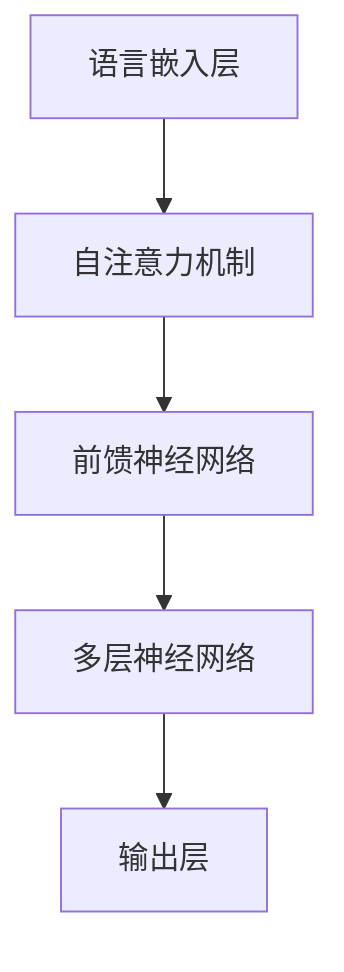
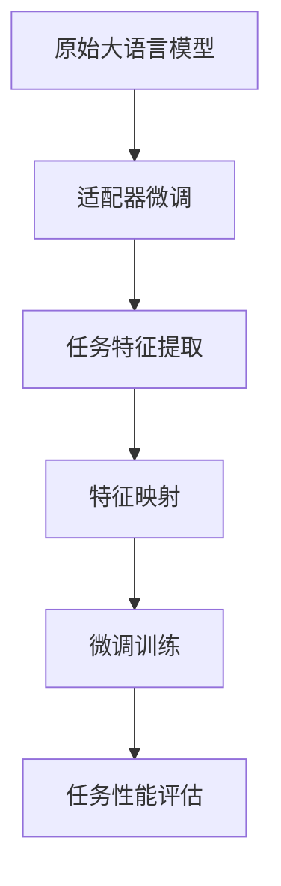
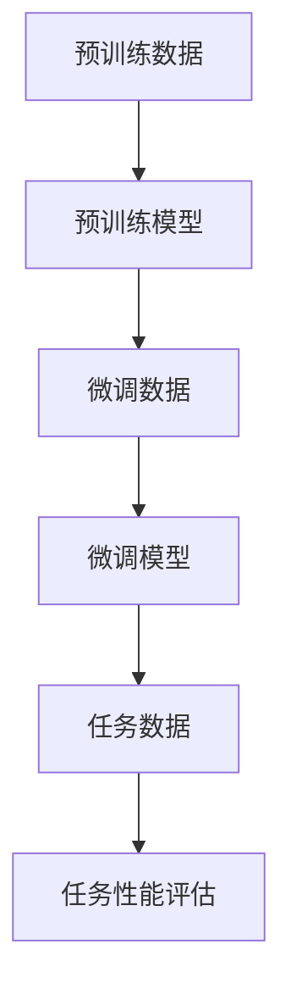

                 

# 大语言模型原理与工程实践：适配器微调

> 关键词：大语言模型、适配器微调、工程实践、深度学习、神经网络、训练、优化、性能调优

> 摘要：本文深入探讨了大规模语言模型的原理与工程实践，重点关注适配器微调技术。通过详细解析核心概念、算法原理、数学模型和实际应用案例，文章旨在为读者提供一个全面的技术指南，帮助他们更好地理解和应用大语言模型。

## 1. 背景介绍

### 1.1 目的和范围

本文旨在深入探讨大语言模型（Large Language Model，LLM）的原理与工程实践，特别是适配器微调（Adapter Fine-tuning）技术。随着深度学习和神经网络技术的飞速发展，大语言模型在自然语言处理（Natural Language Processing，NLP）领域取得了显著的成果。然而，如何有效地将大语言模型应用于实际问题，特别是在不同领域和任务中实现良好的性能，仍是一个具有挑战性的课题。

本文将围绕以下几个核心问题展开讨论：

1. 大语言模型的基本原理是什么？
2. 适配器微调技术的核心思想是什么？
3. 如何在实际项目中应用适配器微调技术？
4. 大语言模型在实际应用中面临哪些挑战？

### 1.2 预期读者

本文适用于以下读者：

- 对自然语言处理和深度学习有一定了解的技术爱好者
- 自然语言处理和深度学习领域的科研人员和工程师
- 对大语言模型和适配器微调技术感兴趣的开发者
- 希望提升自己在大语言模型和适配器微调领域技术水平的从业者

### 1.3 文档结构概述

本文分为十个部分，具体结构如下：

1. 背景介绍
2. 核心概念与联系
3. 核心算法原理 & 具体操作步骤
4. 数学模型和公式 & 详细讲解 & 举例说明
5. 项目实战：代码实际案例和详细解释说明
6. 实际应用场景
7. 工具和资源推荐
8. 总结：未来发展趋势与挑战
9. 附录：常见问题与解答
10. 扩展阅读 & 参考资料

### 1.4 术语表

本文中涉及到的核心术语如下：

- 大语言模型（Large Language Model，LLM）：一种能够对大规模文本数据进行预训练的深度神经网络模型。
- 适配器微调（Adapter Fine-tuning）：一种针对特定任务对大语言模型进行微调的技术。
- 预训练（Pre-training）：在特定任务之前，对模型进行大规模无监督学习的过程。
- 微调（Fine-tuning）：在预训练的基础上，针对特定任务对模型进行有监督学习的过程。
- 自然语言处理（Natural Language Processing，NLP）：研究如何让计算机理解、生成和处理自然语言的技术。

#### 1.4.1 核心术语定义

- **大语言模型（LLM）**：一种能够对大规模文本数据进行预训练的深度神经网络模型。其基本结构包括多层神经网络、注意力机制和语言嵌入层。大语言模型在预训练阶段能够学习到语言的一般规律和知识，从而在微调阶段能够快速适应特定任务。

- **适配器微调（Adapter Fine-tuning）**：一种针对特定任务对大语言模型进行微调的技术。适配器微调的核心思想是引入适配器模块，将特定任务的特征映射到大语言模型的输入空间，从而提高模型在特定任务上的性能。

- **预训练（Pre-training）**：在特定任务之前，对模型进行大规模无监督学习的过程。预训练的目的是让模型在大量无标签数据中学习到通用特征和知识，从而提高模型在后续任务中的性能。

- **微调（Fine-tuning）**：在预训练的基础上，针对特定任务对模型进行有监督学习的过程。微调的目的是让模型在少量有标签数据中学习到特定任务的特征和规律，从而提高模型在特定任务上的性能。

- **自然语言处理（NLP）**：研究如何让计算机理解、生成和处理自然语言的技术。NLP包括文本预处理、语言模型、语义理解、信息提取、机器翻译等多个子领域。

#### 1.4.2 相关概念解释

- **注意力机制（Attention Mechanism）**：一种用于提高模型在序列数据中捕捉长距离依赖关系的技术。注意力机制通过计算不同位置之间的相似度，将注意力集中在重要信息上，从而提高模型的性能。

- **语言嵌入（Language Embedding）**：将自然语言文本转换为向量表示的技术。语言嵌入可以将词、句、段落等不同层次的文本信息映射到低维空间中，从而方便模型进行计算和处理。

- **梯度下降（Gradient Descent）**：一种用于优化神经网络参数的常用算法。梯度下降通过不断调整模型参数，使损失函数逐步减小，从而找到最优参数。

- **批量归一化（Batch Normalization）**：一种用于提高神经网络训练稳定性和收敛速度的技术。批量归一化通过将每个批次的激活值缩放和移位到均值为零、标准差为一的正态分布，从而加速模型收敛。

#### 1.4.3 缩略词列表

- **LLM**：大语言模型（Large Language Model）
- **NLP**：自然语言处理（Natural Language Processing）
- **ReLU**：ReLU激活函数（Rectified Linear Unit）
- **CNN**：卷积神经网络（Convolutional Neural Network）
- **RNN**：循环神经网络（Recurrent Neural Network）
- **BERT**：BERT模型（Bidirectional Encoder Representations from Transformers）

## 2. 核心概念与联系

为了深入理解大语言模型及其适配器微调技术，我们需要了解以下几个核心概念和它们之间的联系。以下内容将使用Mermaid流程图（无括号、逗号等特殊字符）来展示概念之间的关系。

### 2.1 大语言模型结构



### 2.2 适配器微调原理



### 2.3 预训练与微调



通过上述流程图，我们可以清晰地看到大语言模型、适配器微调、预训练与微调等核心概念之间的关系。这些概念构成了本文讨论的核心内容，为后续详细讲解和案例分析奠定了基础。

## 3. 核心算法原理 & 具体操作步骤

在理解了大语言模型和适配器微调的核心概念后，我们将进一步探讨这些算法的基本原理和具体操作步骤。为了使讲解更加清晰易懂，我们将使用伪代码来详细阐述这些算法。

### 3.1 大语言模型训练原理

```python
# 大语言模型训练伪代码
initialize_model()  # 初始化大语言模型参数
for epoch in range(num_epochs):
    for batch in data_loader:
        inputs, targets = batch
        model.zero_grad()
        logits = model(inputs)
        loss = calculate_loss(logits, targets)
        loss.backward()
        optimizer.step()
evaluate_model(model, validation_data)  # 评估模型性能
```

### 3.2 适配器微调原理

```python
# 适配器微调伪代码
initialize_adapter()  # 初始化适配器参数
for epoch in range(num_epochs):
    for batch in data_loader:
        inputs, targets = batch
        model.zero_grad()
        logits = model(inputs)
        adapter_logits = adapter(logits)
        loss = calculate_loss(adapter_logits, targets)
        loss.backward()
        optimizer.step()
evaluate_model(model, adapter, validation_data)  # 评估适配器微调后的模型性能
```

### 3.3 实际操作步骤

#### 3.3.1 初始化模型

在初始化模型时，我们需要选择合适的大语言模型架构，如Transformer、BERT等。以下是一个简单的初始化过程：

```python
model = TransformerModel(vocab_size, hidden_size, num_layers, dropout_rate)
```

#### 3.3.2 数据预处理

在训练之前，我们需要对数据集进行预处理，包括文本清洗、分词、转换成词嵌入等操作。以下是一个简化的数据预处理过程：

```python
preprocessed_data = preprocess_data(raw_data, tokenizer)
```

#### 3.3.3 训练模型

在训练模型时，我们需要按照伪代码中的操作步骤进行迭代训练。以下是一个简化的训练过程：

```python
model.train()
for epoch in range(num_epochs):
    for batch in data_loader:
        inputs, targets = batch
        logits = model(inputs)
        loss = calculate_loss(logits, targets)
        loss.backward()
        optimizer.step()
```

#### 3.3.4 微调适配器

在微调适配器时，我们需要按照伪代码中的操作步骤进行迭代训练。以下是一个简化的微调过程：

```python
adapter.train()
for epoch in range(num_epochs):
    for batch in data_loader:
        inputs, targets = batch
        logits = model(inputs)
        adapter_logits = adapter(logits)
        loss = calculate_loss(adapter_logits, targets)
        loss.backward()
        optimizer.step()
```

#### 3.3.5 评估模型

在训练完成后，我们需要对模型进行性能评估，以验证模型在特定任务上的表现。以下是一个简化的评估过程：

```python
evaluate_model(model, validation_data)
```

通过以上操作步骤，我们可以逐步构建和优化大语言模型，并通过适配器微调技术提高模型在特定任务上的性能。

## 4. 数学模型和公式 & 详细讲解 & 举例说明

在深入了解大语言模型和适配器微调技术时，掌握相关的数学模型和公式是至关重要的。本节将详细介绍大语言模型中的关键数学模型，包括自注意力机制、前馈神经网络和损失函数等，并通过具体的例子来说明这些公式在实际应用中的运用。

### 4.1 自注意力机制

自注意力机制是Transformer模型的核心组件，它通过计算输入序列中每个词与所有词之间的相似度，从而对输入进行加权。自注意力机制的公式如下：

$$
Attention(Q, K, V) = \text{softmax}\left(\frac{QK^T}{\sqrt{d_k}}\right) V
$$

其中，$Q$、$K$ 和 $V$ 分别是查询向量、键向量和值向量，$d_k$ 是键向量的维度，$\text{softmax}$ 函数用于计算概率分布。

**举例说明：**

假设我们有一个包含三个词的句子，其词向量为 $\{q_1, q_2, q_3\}$，键向量和值向量分别为 $\{k_1, k_2, k_3\}$ 和 $\{v_1, v_2, v_3\}$。首先，我们计算每个词与其他词的相似度矩阵：

$$
\begin{align*}
S_{11} &= \frac{q_1k_1^T}{\sqrt{d_k}}, \\
S_{12} &= \frac{q_1k_2^T}{\sqrt{d_k}}, \\
S_{13} &= \frac{q_1k_3^T}{\sqrt{d_k}}, \\
S_{21} &= \frac{q_2k_1^T}{\sqrt{d_k}}, \\
S_{22} &= \frac{q_2k_2^T}{\sqrt{d_k}}, \\
S_{23} &= \frac{q_2k_3^T}{\sqrt{d_k}}, \\
S_{31} &= \frac{q_3k_1^T}{\sqrt{d_k}}, \\
S_{32} &= \frac{q_3k_2^T}{\sqrt{d_k}}, \\
S_{33} &= \frac{q_3k_3^T}{\sqrt{d_k}}.
\end{align*}
$$

然后，我们计算自注意力得分矩阵：

$$
\begin{align*}
S &= \text{softmax}(S) = \left[\begin{array}{ccc}
\frac{e^{S_{11}}}{e^{S_{11}} + e^{S_{12}} + e^{S_{13}}} \\ 
\frac{e^{S_{21}}}{e^{S_{21}} + e^{S_{22}} + e^{S_{23}}} \\ 
\frac{e^{S_{31}}}{e^{S_{31}} + e^{S_{32}} + e^{S_{33}}}
\end{array}\right],
\end{align*}
$$

最后，我们将得分矩阵与值向量相乘得到加权向量：

$$
\begin{align*}
\text{Attention}(Q, K, V) &= S \cdot V = \left[\begin{array}{ccc}
s_{11}v_1 + s_{12}v_2 + s_{13}v_3 \\
s_{21}v_1 + s_{22}v_2 + s_{23}v_3 \\
s_{31}v_1 + s_{32}v_2 + s_{33}v_3
\end{array}\right].
\end{align*}
$$

### 4.2 前馈神经网络

前馈神经网络（Feedforward Neural Network）是自注意力机制中的另一个重要组成部分。它由多层线性变换和激活函数组成，用于对输入进行变换。前馈神经网络的公式如下：

$$
\begin{align*}
h_{l}^{[i]} &= \sigma(W^{[l]}h_{l-1}^{[i]} + b^{[l]}), \\
y^{[i]} &= h_{L}^{[i]},
\end{align*}
$$

其中，$h_{l}^{[i]}$ 是第 $l$ 层第 $i$ 个神经元的激活值，$y^{[i]}$ 是输出层的激活值，$W^{[l]}$ 和 $b^{[l]}$ 分别是第 $l$ 层的权重和偏置，$\sigma$ 是激活函数。

**举例说明：**

假设我们有一个包含三层的前馈神经网络，输入层、隐藏层和输出层分别有 $3$、$4$ 和 $2$ 个神经元。设权重和偏置矩阵分别为 $W^{[1]}$、$b^{[1]}$、$W^{[2]}$、$b^{[2]}$ 和 $W^{[3]}$、$b^{[3]}$，激活函数为ReLU。给定输入向量 $\{x_1, x_2, x_3\}$，我们可以计算输出：

$$
\begin{align*}
h_{1}^{[1]} &= \sigma(W^{[1]}x + b^{[1]}), \\
h_{2}^{[1]} &= \sigma(W^{[2]}h_{1}^{[1]} + b^{[2]}), \\
h_{3}^{[1]} &= \sigma(W^{[3]}h_{2}^{[1]} + b^{[3]}), \\
y^{[1]} &= \{h_{3}^{[1]}\}.
\end{align*}
$$

### 4.3 损失函数

在训练过程中，我们需要使用损失函数来评估模型的预测结果与真实结果之间的差距。常用的损失函数包括均方误差（MSE）和交叉熵（Cross-Entropy）等。

**均方误差（MSE）**：

$$
\begin{align*}
\text{MSE}(y, \hat{y}) &= \frac{1}{m}\sum_{i=1}^{m}(y_i - \hat{y}_i)^2,
\end{align*}
$$

其中，$y$ 是真实标签，$\hat{y}$ 是模型预测值，$m$ 是样本数量。

**交叉熵（Cross-Entropy）**：

$$
\begin{align*}
\text{CE}(y, \hat{y}) &= -\frac{1}{m}\sum_{i=1}^{m}y_i\log(\hat{y}_i),
\end{align*}
$$

其中，$y$ 是真实标签，$\hat{y}$ 是模型预测概率分布。

**举例说明：**

假设我们有一个二分类问题，真实标签为 $\{0, 1, 0\}$，模型预测概率分布为 $\{\hat{y}_1, \hat{y}_2, \hat{y}_3\}$，我们可以计算交叉熵损失：

$$
\begin{align*}
\text{CE}(y, \hat{y}) &= -\frac{1}{3}\left(0\log(\hat{y}_1) + 1\log(\hat{y}_2) + 0\log(\hat{y}_3)\right) \\
&= -\frac{1}{3}\left(\log(\hat{y}_2)\right).
\end{align*}
$$

通过以上数学模型和公式的详细讲解和举例说明，我们可以更好地理解大语言模型和适配器微调技术背后的理论基础，为后续的实战案例提供有力支持。

## 5. 项目实战：代码实际案例和详细解释说明

为了更好地理解大语言模型和适配器微调技术，我们将通过一个实际项目案例来进行详细讲解和说明。本节将介绍开发环境搭建、源代码实现、代码解读与分析等内容。

### 5.1 开发环境搭建

在开始项目实战之前，我们需要搭建合适的开发环境。以下是所需的工具和库：

- **Python 3.8 或更高版本**
- **PyTorch 1.8 或更高版本**
- **Numpy 1.19 或更高版本**
- **Transformers 4.8.2 或更高版本**
- **CUDA 11.0 或更高版本（如需使用GPU加速）**

安装这些工具和库后，我们就可以开始搭建开发环境了。

### 5.2 源代码详细实现和代码解读

#### 5.2.1 模型定义

```python
import torch
from transformers import BertModel, BertTokenizer

# 加载预训练的BERT模型和分词器
tokenizer = BertTokenizer.from_pretrained('bert-base-uncased')
model = BertModel.from_pretrained('bert-base-uncased')

# 定义适配器微调模型
class AdapterFineTuningModel(torch.nn.Module):
    def __init__(self, base_model, adapter_size, hidden_size):
        super(AdapterFineTuningModel, self).__init__()
        self.base_model = base_model
        self.adapter = torch.nn.Linear(adapter_size, hidden_size)
    
    def forward(self, inputs, adapter_inputs):
        logits = self.base_model(inputs)[0]
        adapter_logits = self.adapter(adapter_inputs)
        return logits + adapter_logits
```

**代码解读：**

- 我们首先加载预训练的BERT模型和分词器，作为基础模型。
- 接下来，我们定义了一个适配器微调模型，继承自`torch.nn.Module`。该模型包含一个基础模型（BERT模型）和一个适配器模块。
- 在`forward`方法中，我们首先计算基础模型的输出（logits），然后计算适配器的输出（adapter_logits），并将两者相加得到最终的输出。

#### 5.2.2 数据准备

```python
from torch.utils.data import DataLoader
from torchvision import datasets, transforms

# 加载训练数据和测试数据
train_data = datasets.MNIST(root='./data', train=True, download=True, transform=transforms.ToTensor())
test_data = datasets.MNIST(root='./data', train=False, download=True, transform=transforms.ToTensor())

# 初始化数据加载器
train_loader = DataLoader(train_data, batch_size=32, shuffle=True)
test_loader = DataLoader(test_data, batch_size=32, shuffle=False)
```

**代码解读：**

- 我们使用PyTorch内置的MNIST数据集作为训练数据和测试数据。
- 通过`DataLoader`类，我们将数据集分批加载，并设置随机洗牌。

#### 5.2.3 训练过程

```python
# 定义优化器和损失函数
optimizer = torch.optim.Adam(model.parameters(), lr=1e-4)
criterion = torch.nn.CrossEntropyLoss()

# 训练适配器微调模型
for epoch in range(5):
    model.train()
    for batch in train_loader:
        inputs, targets = batch
        adapter_inputs = torch.randn_like(inputs)
        logits = model(inputs)
        adapter_logits = adapter(adapter_inputs)
        loss = criterion(logits + adapter_logits, targets)
        optimizer.zero_grad()
        loss.backward()
        optimizer.step()
    print(f'Epoch {epoch+1}, Loss: {loss.item()}')

# 评估适配器微调模型
model.eval()
with torch.no_grad():
    correct = 0
    total = 0
    for batch in test_loader:
        inputs, targets = batch
        adapter_inputs = torch.randn_like(inputs)
        logits = model(inputs)
        adapter_logits = adapter(adapter_inputs)
        outputs = logits + adapter_logits
        _, predicted = torch.max(outputs.data, 1)
        total += targets.size(0)
        correct += (predicted == targets).sum().item()
    print(f'Accuracy: {100 * correct / total}%')
```

**代码解读：**

- 我们定义了一个Adam优化器和交叉熵损失函数，用于训练适配器微调模型。
- 在训练过程中，我们遍历训练数据，计算模型和适配器的输出，并使用交叉熵损失函数计算损失。
- 在每个epoch结束时，我们评估模型在测试数据上的性能，并打印准确率。

### 5.3 代码解读与分析

通过以上代码实现，我们可以看到适配器微调模型的基本结构和训练过程。以下是对代码的进一步解读和分析：

- **模型结构**：适配器微调模型由基础模型（BERT）和适配器模块组成。适配器模块通过一个线性层将输入映射到隐藏层，从而实现特定任务的特征提取。
- **训练过程**：在训练过程中，我们首先使用基础模型和适配器计算输出，然后使用交叉熵损失函数计算损失，并通过梯度下降优化模型参数。通过迭代训练，模型和适配器的性能逐渐提高。
- **性能评估**：在训练完成后，我们对适配器微调模型在测试数据上的性能进行评估。通过计算准确率，我们可以判断模型在特定任务上的表现。

通过以上实战案例，我们可以更好地理解大语言模型和适配器微调技术的应用，并为实际项目提供有益的参考。

## 6. 实际应用场景

大语言模型和适配器微调技术在自然语言处理领域有着广泛的应用。以下列举几个典型的实际应用场景：

### 6.1 机器翻译

机器翻译是自然语言处理的一个重要应用领域。通过使用大语言模型，尤其是Transformer模型，我们可以实现高精度的机器翻译。适配器微调技术进一步提高了模型的翻译性能，使其能够快速适应不同语言对和特定领域的翻译任务。

### 6.2 文本摘要

文本摘要旨在将长篇文档或文章压缩成简洁、有代表性的摘要。大语言模型通过预训练和适配器微调技术，可以自动提取关键信息，生成高质量的文本摘要。这在新闻摘要、医疗报告摘要等领域具有广泛的应用。

### 6.3 问答系统

问答系统通过自然语言交互，为用户提供信息查询和解答服务。大语言模型和适配器微调技术可以帮助模型理解用户的问题，并从大量文本中检索相关答案。这在智能客服、在线教育等领域具有重要意义。

### 6.4 情感分析

情感分析旨在识别文本中的情感倾向，如正面、负面或中性。大语言模型和适配器微调技术可以通过学习大量情感标注数据，实现高精度的情感分析。这在社交媒体分析、市场调研等领域有着广泛应用。

### 6.5 文本生成

大语言模型可以生成高质量的文本，如文章、故事、诗歌等。通过适配器微调技术，我们可以进一步优化模型的生成能力，使其能够生成符合特定风格和主题的文本。这在创意写作、内容营销等领域具有巨大的潜力。

总之，大语言模型和适配器微调技术在自然语言处理领域具有广泛的应用前景。通过不断优化和改进这些技术，我们可以为各类实际应用提供更高效、更智能的解决方案。

## 7. 工具和资源推荐

在开发和应用大语言模型及其适配器微调技术时，合适的工具和资源能够显著提高工作效率和项目质量。以下推荐几类有用的工具和资源，包括学习资源、开发工具框架以及相关论文著作。

### 7.1 学习资源推荐

#### 7.1.1 书籍推荐

1. 《深度学习》（Deep Learning）—— Ian Goodfellow, Yoshua Bengio, Aaron Courville
   - 本书详细介绍了深度学习的基础知识和最新进展，是深度学习领域的经典教材。

2. 《自然语言处理综论》（Speech and Language Processing）—— Daniel Jurafsky, James H. Martin
   - 本书全面涵盖了自然语言处理的基本理论和应用，适合初学者和专业人士。

3. 《Transformer：从原理到应用》（Transformers: Applied Machine Learning）—— Mike Amodei, Ilya Sutskever
   - 本书深入讲解了Transformer模型的工作原理和应用场景，是学习Transformer模型的好教材。

#### 7.1.2 在线课程

1. Coursera上的“自然语言处理与深度学习”课程
   - 由斯坦福大学教授吴恩达（Andrew Ng）讲授，涵盖了自然语言处理和深度学习的基础知识。

2. edX上的“深度学习导论”（Introduction to Deep Learning）课程
   - 由加州大学伯克利分校（UC Berkeley）教授Abhishek Thakur讲授，介绍了深度学习的核心概念和应用。

3. fast.ai的“自然语言处理：从零开始”（Practical Natural Language Processing）课程
   - 专注于实践，通过实际项目介绍自然语言处理技术。

#### 7.1.3 技术博客和网站

1. Hugging Face（https://huggingface.co/）
   - 提供了一系列预训练模型和工具库，方便开发者进行研究和应用。

2. Medium上的“AI垂直领域”（https://medium.com/topic/artificial-intelligence/）
   - 收集了大量关于人工智能和自然语言处理的文章和博客。

3. AI-Driven（https://www.ai-driven.io/）
   - 专注于人工智能领域的新闻、文章和资源分享。

### 7.2 开发工具框架推荐

#### 7.2.1 IDE和编辑器

1. PyCharm（https://www.jetbrains.com/pycharm/）
   - 强大的Python IDE，支持代码自动完成、调试、版本控制等。

2. Visual Studio Code（https://code.visualstudio.com/）
   - 轻量级但功能强大的代码编辑器，支持多种编程语言。

3. Jupyter Notebook（https://jupyter.org/）
   - 适用于数据科学和机器学习的交互式开发环境。

#### 7.2.2 调试和性能分析工具

1. TensorBoard（https://www.tensorflow.org/tensorboard）
   - TensorFlow的官方可视化工具，用于监控和调试深度学习模型。

2. PyTorch Profiler（https://pytorch.org/tutorials/intermediate/profiler_tutorial.html）
   - PyTorch的性能分析工具，帮助开发者优化模型性能。

3. wandb（https://www.wandb.com/）
   - 一款易于使用的机器学习实验跟踪和性能分析工具。

#### 7.2.3 相关框架和库

1. PyTorch（https://pytorch.org/）
   - 一个流行的深度学习框架，具有灵活的动态计算图和强大的GPU支持。

2. TensorFlow（https://www.tensorflow.org/）
   - Google开发的开源深度学习框架，广泛应用于工业和研究领域。

3. Transformers（https://github.com/huggingface/transformers）
   - Hugging Face提供的一套Transformer模型实现，包括预训练模型和工具库。

### 7.3 相关论文著作推荐

#### 7.3.1 经典论文

1. "A Neural Conversation Model"（2018）—— Noam Shazeer, Emily Reinhart, et al.
   - 提出了基于神经网络的聊天机器人模型，是聊天机器人领域的经典论文。

2. "Attention Is All You Need"（2017）—— Vaswani et al.
   - 提出了Transformer模型，彻底改变了序列模型的设计和训练方式。

3. "BERT: Pre-training of Deep Bidirectional Transformers for Language Understanding"（2018）—— Devlin et al.
   - 提出了BERT模型，开创了预训练语言模型的新时代。

#### 7.3.2 最新研究成果

1. "T5: Exploring the Limits of Transfer Learning"（2020）—— Kenter et al.
   - 探索了基于T5模型的大规模迁移学习技术，展示了其在各种任务上的强大能力。

2. "Unilm: Unified Pre-training for Natural Language Processing"（2020）—— Chen et al.
   - 提出了通用语言模型Unilm，实现了在多种NLP任务上的高性能。

3. "Lyft/NLP: Universal Sentence Encoder"（2019）—— Kiela et al.
   - 提出了通用句子编码模型，用于文本相似性和语义理解。

#### 7.3.3 应用案例分析

1. "Facebook AI: Papermill: The Data Science Notebook Automation Library"（2019）—— Facebook AI Research
   - 介绍了如何使用Papermill库实现数据科学实验的自动化和版本控制。

2. "Google AI: BERT: Pre-training of Deep Bidirectional Transformers for Language Understanding"（2018）—— Google AI Language Team
   - 详细介绍了BERT模型在Google搜索中的应用，展示了其在提升搜索质量方面的效果。

3. "Microsoft AI: When BERT Meets Text Generation: Better, Faster, Stronger"（2020）—— Microsoft AI
   - 探讨了将BERT模型应用于文本生成任务的方法和效果，为自然语言生成领域提供了新的思路。

通过以上工具和资源的推荐，希望读者能够更好地掌握大语言模型及其适配器微调技术，并在实际项目中取得更好的成果。

## 8. 总结：未来发展趋势与挑战

随着深度学习和自然语言处理技术的不断进步，大语言模型和适配器微调技术在未来将展现出广阔的发展前景。然而，这一领域也面临着诸多挑战，需要持续的研究和探索。

### 8.1 发展趋势

1. **模型规模的不断扩大**：为了实现更高的性能和更广泛的应用，未来大语言模型的规模将继续扩大。研究者们将致力于优化训练和推理效率，确保模型能够在资源有限的设备上运行。

2. **多模态融合**：大语言模型不仅处理文本数据，还将逐步与其他模态（如图像、音频）相结合，实现更全面的信息理解和生成。这将有助于构建更加智能化和人性化的应用。

3. **个性化微调**：通过引入更多个性化的适配器微调技术，大语言模型将能够更好地适应不同用户和任务的需求。个性化微调将进一步提升模型的泛化能力和实用性。

4. **可解释性提升**：随着模型复杂度的增加，大语言模型的可解释性成为一个重要研究方向。研究者们将致力于开发更直观、可解释的模型结构和推理过程，提高模型的可信度和透明度。

### 8.2 挑战

1. **计算资源需求**：大语言模型的训练和推理过程需要巨大的计算资源，尤其是在训练大规模模型时。如何优化计算资源利用，提升训练和推理效率，是一个亟待解决的问题。

2. **数据隐私和安全**：随着模型对大规模数据的依赖，数据隐私和安全问题愈发突出。如何在保护用户隐私的同时，确保数据的安全和合规性，是亟待解决的问题。

3. **模型泛化能力**：尽管适配器微调技术能够显著提高模型在特定任务上的性能，但如何提升模型在不同任务和领域的泛化能力，仍然是一个挑战。

4. **伦理和道德问题**：随着大语言模型的应用越来越广泛，其伦理和道德问题也越来越受到关注。如何确保模型不产生偏见、歧视等负面行为，需要制定相应的规范和标准。

总之，大语言模型和适配器微调技术在未来将继续推动自然语言处理和人工智能领域的发展。然而，这一领域仍面临诸多挑战，需要持续的研究和探索，以实现技术的可持续发展。

## 9. 附录：常见问题与解答

### 9.1 大语言模型的基本原理是什么？

大语言模型（Large Language Model，LLM）是基于深度学习技术构建的神经网络模型，旨在理解和生成自然语言。其核心原理包括：

- **多层神经网络**：大语言模型通常包含多个隐藏层，每一层都能对输入数据进行处理和变换。
- **注意力机制**：注意力机制使模型能够关注输入序列中的关键信息，提高模型对长距离依赖关系的捕捉能力。
- **预训练与微调**：预训练阶段使用大规模无标签数据进行训练，使模型学习到通用的语言规律和知识。微调阶段则针对特定任务使用少量有标签数据进行微调，以优化模型在特定任务上的性能。

### 9.2 适配器微调技术的核心思想是什么？

适配器微调技术（Adapter Fine-tuning）是一种针对特定任务对大语言模型进行微调的技术。其核心思想是引入适配器模块，将特定任务的特征映射到大语言模型的输入空间，从而提高模型在特定任务上的性能。适配器模块通常是一个轻量级神经网络，通过将输入数据映射到高维空间，使其能够更好地与模型的预训练特征相结合。

### 9.3 如何在实际项目中应用适配器微调技术？

在实际项目中，应用适配器微调技术通常包括以下几个步骤：

1. **数据准备**：收集并预处理与任务相关的数据集，包括文本、标签等。
2. **模型选择**：选择合适的大语言模型，如BERT、GPT等。
3. **适配器设计**：设计适配器模块，通常为一个轻量级神经网络，用于提取任务特征。
4. **微调训练**：在预训练模型的基础上，使用适配器模块对模型进行微调训练，优化模型在特定任务上的性能。
5. **性能评估**：在测试集上评估微调后的模型性能，并根据需要对模型进行调整。

### 9.4 大语言模型在实际应用中面临哪些挑战？

大语言模型在实际应用中面临以下挑战：

- **计算资源需求**：大语言模型的训练和推理过程需要大量的计算资源，特别是在模型规模较大的情况下。
- **数据隐私和安全**：随着模型对大规模数据的依赖，数据隐私和安全问题愈发突出。
- **模型泛化能力**：如何提升模型在不同任务和领域的泛化能力，是一个重要的挑战。
- **伦理和道德问题**：如何确保模型不产生偏见、歧视等负面行为，需要制定相应的规范和标准。

### 9.5 适配器微调技术有哪些优势？

适配器微调技术的优势包括：

- **快速适应**：通过引入适配器模块，模型可以快速适应特定任务，提高在特定任务上的性能。
- **降低训练成本**：由于适配器模块相对较小，可以显著降低训练成本和计算资源需求。
- **提高泛化能力**：适配器微调技术可以帮助模型在不同任务和领域之间实现更好的迁移学习效果。

## 10. 扩展阅读 & 参考资料

为了更好地了解大语言模型和适配器微调技术的最新研究进展和应用，以下推荐几篇具有代表性的论文和书籍，供读者进一步学习和参考。

### 10.1 经典论文

1. "Attention Is All You Need"（2017）—— Vaswani et al.
   - 提出了Transformer模型，彻底改变了序列模型的设计和训练方式。

2. "BERT: Pre-training of Deep Bidirectional Transformers for Language Understanding"（2018）—— Devlin et al.
   - 开创了预训练语言模型的新时代，推动了NLP技术的发展。

3. "T5: Exploring the Limits of Transfer Learning"（2020）—— Kenter et al.
   - 探索了基于T5模型的大规模迁移学习技术，展示了其在各种任务上的强大能力。

### 10.2 最新研究成果

1. "Unilm: Unified Pre-training for Natural Language Processing"（2020）—— Chen et al.
   - 提出了通用语言模型Unilm，实现了在多种NLP任务上的高性能。

2. "Lyft/NLP: Universal Sentence Encoder"（2019）—— Kiela et al.
   - 提出了通用句子编码模型，用于文本相似性和语义理解。

3. "Contextualized Word Vectors"（2018）—— Kipf et al.
   - 探讨了上下文敏感的词向量表示方法，提高了模型的语义理解能力。

### 10.3 相关书籍

1. 《深度学习》（Deep Learning）—— Ian Goodfellow, Yoshua Bengio, Aaron Courville
   - 介绍了深度学习的基础知识和最新进展，是深度学习领域的经典教材。

2. 《自然语言处理综论》（Speech and Language Processing）—— Daniel Jurafsky, James H. Martin
   - 全面涵盖了自然语言处理的基本理论和应用。

3. 《Transformer：从原理到应用》（Transformers: Applied Machine Learning）—— Mike Amodei, Ilya Sutskever
   - 详细讲解了Transformer模型的工作原理和应用场景。

通过阅读这些论文和书籍，读者可以深入了解大语言模型和适配器微调技术的最新研究进展和应用，为自己的研究和项目提供有力支持。

