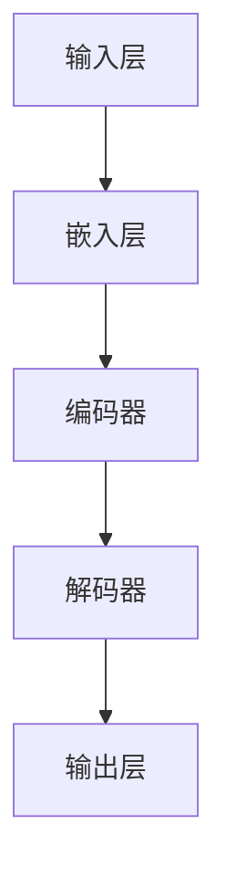

                 

# 大语言模型原理与工程实践：预训练数据构建

> 关键词：大语言模型、预训练、数据构建、工程实践、人工智能

> 摘要：本文将深入探讨大语言模型的原理与工程实践，特别是预训练数据构建的过程。我们将首先介绍大语言模型的背景和重要性，随后详细分析其核心概念、算法原理，并结合实际项目案例进行代码解读。文章还将探讨大语言模型在不同实际应用场景中的表现，并推荐相关的学习资源、开发工具和经典论文。

## 1. 背景介绍

### 1.1 目的和范围

本文的目的是为读者提供一个全面的大语言模型（Large Language Model）的原理与工程实践教程，重点在于预训练数据构建的详细分析。通过本文的学习，读者将能够理解大语言模型的基本原理，掌握预训练数据构建的流程，并能够在实际项目中应用这些知识。

### 1.2 预期读者

本文适合对人工智能和自然语言处理有一定基础的读者，包括但不限于：
- 自然语言处理工程师
- 数据科学家
- 机器学习研究者
- 对人工智能领域感兴趣的技术爱好者

### 1.3 文档结构概述

本文结构如下：
1. 背景介绍
2. 核心概念与联系
3. 核心算法原理与具体操作步骤
4. 数学模型和公式
5. 项目实战
6. 实际应用场景
7. 工具和资源推荐
8. 总结
9. 附录：常见问题与解答
10. 扩展阅读

### 1.4 术语表

#### 1.4.1 核心术语定义

- 大语言模型（Large Language Model）：一种能够理解和生成自然语言的深度神经网络模型。
- 预训练（Pre-training）：在大规模语料库上进行训练，以获取通用语言知识和特征表示。
- 微调（Fine-tuning）：在大语言模型的基础上，使用特定领域的数据进行进一步训练，以提高模型在特定任务上的性能。

#### 1.4.2 相关概念解释

- 自然语言处理（Natural Language Processing，NLP）：计算机科学领域中的一个重要分支，涉及语言的理解、生成和处理。
- 深度学习（Deep Learning）：一种机器学习技术，通过构建深度神经网络来模拟人脑处理信息的方式。

#### 1.4.3 缩略词列表

- NLP：自然语言处理
- DNN：深度神经网络
- BERT：Bidirectional Encoder Representations from Transformers
- GPT：Generative Pre-trained Transformer
- Transformer：Transformer 架构

## 2. 核心概念与联系

在深入探讨大语言模型之前，我们需要先理解几个核心概念及其相互关系。

### 2.1 大语言模型的基础概念

大语言模型是一种基于深度学习的自然语言处理模型，它通过在大规模语料库上进行预训练，学习到语言的基本规律和结构。大语言模型的核心组成部分包括：

1. **嵌入层（Embedding Layer）**：将单词转化为固定长度的向量表示。
2. **编码器（Encoder）**：用于提取文本的上下文信息，如BERT和Transformer中的自注意力机制。
3. **解码器（Decoder）**：用于生成文本，如GPT中的自回归解码器。

### 2.2 大语言模型的算法原理

大语言模型的算法原理主要基于以下两个方面：

1. **Transformer架构**：这是一种基于注意力机制的编码器-解码器模型，由Vaswani等人于2017年提出。Transformer通过自注意力机制（Self-Attention）和多头注意力（Multi-Head Attention）来捕捉文本序列中的长距离依赖关系。
2. **预训练与微调**：预训练是指在大规模语料库上训练模型，以学习到通用语言知识。微调则是将预训练模型在特定领域的数据上进一步训练，以提高模型在特定任务上的性能。

### 2.3 大语言模型的架构

大语言模型的架构通常包括以下几个部分：

1. **输入层**：将文本序列输入到模型中。
2. **嵌入层**：将单词转化为向量表示。
3. **编码器**：提取文本的上下文信息。
4. **解码器**：生成文本序列。
5. **输出层**：将生成的文本序列输出。

#### Mermaid 流程图



## 3. 核心算法原理与具体操作步骤

在本节中，我们将详细探讨大语言模型的核心算法原理，并使用伪代码来阐述其具体操作步骤。

### 3.1 Transformer架构

Transformer架构的核心思想是使用自注意力机制（Self-Attention）和多头注意力（Multi-Head Attention）来捕捉文本序列中的长距离依赖关系。

#### 自注意力机制（Self-Attention）

自注意力机制通过计算序列中每个词与其他词之间的相关性，从而生成每个词的表示。其计算过程如下：

```python
def scaled_dot_product_attention(Q, K, V, scale_factor):
    # 计算查询词（Q）与键词（K）的点积，得到注意力权重
    attention_scores = matmul(Q, K, transpose_b=True)
    attention_scores = attention_scores / scale_factor
    
    # 对注意力权重进行 softmax 处理，得到概率分布
    attention_weights = softmax(attention_scores, axis=1)
    
    # 计算加权求和，得到每个词的表示
    context_vector = matmul(attention_weights, V)
    return context_vector
```

#### 多头注意力（Multi-Head Attention）

多头注意力通过并行计算多个自注意力机制，并将结果合并，以提高模型的表示能力。其计算过程如下：

```python
def multi_head_attention(Q, K, V, num_heads, d_model):
    # 初始化参数
    d_k = d_v = d_model / num_heads
    scale_factor = sqrt(d_k)
    
    # 分解查询词、关键词和值词
    Q = split_heads(Q, num_heads, d_model)
    K = split_heads(K, num_heads, d_model)
    V = split_heads(V, num_heads, d_model)
    
    # 计算多头注意力
    context_vectors = [scaled_dot_product_attention(Q[i], K, V, scale_factor) for i in range(num_heads)]
    
    # 合并多头注意力结果
    context_vector = concatenate_heads(context_vectors)
    return context_vector
```

### 3.2 编码器与解码器

编码器（Encoder）和解码器（Decoder）是Transformer架构的核心组成部分，用于提取文本的上下文信息和生成文本序列。

#### 编码器（Encoder）

编码器通过多层多头自注意力机制来提取文本的上下文信息，其计算过程如下：

```python
def encoder(input_sequence, num_layers, d_model, num_heads):
    # 初始化参数
    inputs = input_sequence
    
    # 遍历编码器层
    for layer in range(num_layers):
        # 自注意力机制
        attention_output = multi_head_attention(inputs, inputs, inputs, num_heads, d_model)
        # 层归一化
        attention_output = layer_normalization(attention_output)
        # 位置前馈网络
        feedforward_output = positionwise_feedforward(attention_output, d_model)
        # 层归一化
        feedforward_output = layer_normalization(feedforward_output)
        
        # 更新输入
        inputs = attention_output + feedforward_output
    
    return inputs
```

#### 解码器（Decoder）

解码器通过多层多头自注意力机制和编码器-解码器自注意力机制来生成文本序列，其计算过程如下：

```python
def decoder(input_sequence, target_sequence, num_layers, d_model, num_heads):
    # 初始化参数
    inputs = input_sequence
    targets = target_sequence
    
    # 遍历解码器层
    for layer in range(num_layers):
        # 编码器-解码器自注意力机制
        encoder_output = multi_head_attention(targets, inputs, inputs, num_heads, d_model)
        # 层归一化
        encoder_output = layer_normalization(encoder_output)
        # 自注意力机制
        decoder_output = multi_head_attention(encoder_output, encoder_output, encoder_output, num_heads, d_model)
        # 层归一化
        decoder_output = layer_normalization(decoder_output)
        # 位置前馈网络
        feedforward_output = positionwise_feedforward(decoder_output, d_model)
        # 层归一化
        feedforward_output = layer_normalization(feedforward_output)
        
        # 更新输入
        inputs = encoder_output + feedforward_output
    
    return inputs
```

### 3.3 预训练与微调

预训练与微调是构建大语言模型的关键步骤。预训练通过在大规模语料库上进行训练，使模型学习到通用语言知识。微调则是在预训练模型的基础上，使用特定领域的数据进行进一步训练，以提高模型在特定任务上的性能。

#### 预训练

预训练过程包括以下步骤：

1. **数据预处理**：将文本数据转换为序列，并对其进行分词和嵌入。
2. **模型初始化**：初始化编码器和解码器参数。
3. **预训练任务**：例如，掩码语言模型（Masked Language Model，MLM）和下一句预测（Next Sentence Prediction，NSP）。
4. **训练**：使用预训练任务进行训练，并优化模型参数。

#### 微调

微调过程包括以下步骤：

1. **数据预处理**：将特定领域的数据转换为序列，并对其进行分词和嵌入。
2. **模型初始化**：使用预训练模型的参数初始化微调模型。
3. **微调任务**：例如，文本分类、命名实体识别等。
4. **训练**：使用微调任务进行训练，并优化模型参数。

## 4. 数学模型和公式

在本节中，我们将介绍大语言模型中的数学模型和公式，并对其进行详细讲解。

### 4.1 嵌入层

嵌入层是将单词转化为向量表示的过程。其数学模型如下：

$$
\text{embedding}_{i} = \text{embedding\_matrix} \cdot \text{word}_{i}
$$

其中，$\text{embedding}_{i}$ 表示单词 $i$ 的向量表示，$\text{embedding\_matrix}$ 表示嵌入矩阵，$\text{word}_{i}$ 表示单词 $i$。

### 4.2 自注意力机制

自注意力机制的数学模型如下：

$$
\text{context\_vector}_{i} = \text{softmax}\left(\frac{\text{Q}_{i} \cdot \text{K}_{i}^{T}}{\sqrt{d_k}}\right) \cdot \text{V}_{i}
$$

其中，$\text{context\_vector}_{i}$ 表示单词 $i$ 的上下文表示，$\text{Q}_{i}$ 表示查询词向量，$\text{K}_{i}$ 表示关键词向量，$\text{V}_{i}$ 表示值词向量，$d_k$ 表示键词向量的维度。

### 4.3 编码器与解码器

编码器与解码器的数学模型如下：

$$
\text{encoder\_output} = \text{encoder}(\text{input\_sequence})
$$

$$
\text{decoder\_output} = \text{decoder}(\text{input\_sequence}, \text{target\_sequence})
$$

其中，$\text{encoder\_output}$ 表示编码器输出的文本表示，$\text{decoder\_output}$ 表示解码器输出的文本序列，$\text{input\_sequence}$ 表示输入文本序列，$\text{target\_sequence}$ 表示目标文本序列。

### 4.4 预训练与微调

预训练与微调的数学模型如下：

$$
\text{pretrained\_model} = \text{train}\left(\text{corpus}, \text{pretrain\_task}\right)
$$

$$
\text{finetuned\_model} = \text{train}\left(\text{domain\_data}, \text{finetune\_task}\right)
$$

其中，$\text{pretrained\_model}$ 表示预训练模型，$\text{finetuned\_model}$ 表示微调模型，$\text{corpus}$ 表示大规模语料库，$\text{domain\_data}$ 表示特定领域数据，$\text{pretrain\_task}$ 表示预训练任务，$\text{finetune\_task}$ 表示微调任务。

## 5. 项目实战：代码实际案例和详细解释说明

在本节中，我们将通过一个实际项目案例来展示大语言模型的构建过程，包括开发环境搭建、源代码实现和代码解读。

### 5.1 开发环境搭建

首先，我们需要搭建开发环境。以下是一个简单的环境搭建步骤：

1. 安装 Python 3.8 或以上版本。
2. 安装 TensorFlow 2.5 或以上版本。
3. 安装其他必要的库，如 NumPy、Pandas 等。

### 5.2 源代码详细实现和代码解读

以下是项目源代码的实现，我们将对关键部分进行详细解读。

```python
import tensorflow as tf
import tensorflow.keras.layers as layers

def create_model(num_layers, d_model, num_heads):
    # 输入层
    inputs = layers.Input(shape=(None,))
    
    # 嵌入层
    embeddings = layers.Embedding(vocab_size, d_model)(inputs)
    
    # 编码器
    encoder_output = embeddings
    for i in range(num_layers):
        # 自注意力机制
        attention_output = layers.MultiHeadAttention(num_heads=num_heads, key_dim=d_model)(encoder_output, encoder_output)
        # 层归一化
        attention_output = layers.LayerNormalization(epsilon=1e-6)(attention_output + encoder_output)
        # 位置前馈网络
        feedforward_output = layers.Dense(d_model * 4, activation='relu')(attention_output)
        feedforward_output = layers.Dense(d_model)(feedforward_output)
        # 层归一化
        encoder_output = layers.LayerNormalization(epsilon=1e-6)(feedforward_output + attention_output)
    
    # 解码器
    decoder_output = encoder_output
    for i in range(num_layers):
        # 编码器-解码器自注意力机制
        encoder_decoder_output = layers.MultiHeadAttention(num_heads=num_heads, key_dim=d_model)(decoder_output, encoder_output)
        # 层归一化
        encoder_decoder_output = layers.LayerNormalization(epsilon=1e-6)(encoder_decoder_output + decoder_output)
        # 自注意力机制
        decoder_output = layers.MultiHeadAttention(num_heads=num_heads, key_dim=d_model)(decoder_output, decoder_output)
        # 层归一化
        decoder_output = layers.LayerNormalization(epsilon=1e-6)(decoder_output + encoder_decoder_output)
        # 位置前馈网络
        feedforward_output = layers.Dense(d_model * 4, activation='relu')(decoder_output)
        feedforward_output = layers.Dense(d_model)(feedforward_output)
        # 层归一化
        decoder_output = layers.LayerNormalization(epsilon=1e-6)(feedforward_output + decoder_output)
    
    # 输出层
    outputs = layers.Dense(vocab_size, activation='softmax')(decoder_output)
    
    # 模型构建
    model = tf.keras.Model(inputs, outputs)
    return model

# 模型参数
num_layers = 2
d_model = 128
num_heads = 2
vocab_size = 10000

# 创建模型
model = create_model(num_layers, d_model, num_heads)

# 编译模型
model.compile(optimizer='adam', loss='categorical_crossentropy', metrics=['accuracy'])

# 加载数据
train_data = ...
test_data = ...

# 训练模型
model.fit(train_data, epochs=10, validation_data=test_data)
```

### 5.3 代码解读与分析

以下是对代码的详细解读和分析：

1. **输入层**：使用 `layers.Input` 创建输入层，输入数据的形状为 $(None,)$，表示序列长度可变。

2. **嵌入层**：使用 `layers.Embedding` 创建嵌入层，将单词转化为向量表示。嵌入层的大小为 $(vocab\_size, d\_model)$，其中 $vocab\_size$ 表示单词表大小，$d\_model$ 表示嵌入向量的维度。

3. **编码器**：编码器由多个自注意力层组成。每个自注意力层包括以下步骤：
   - **自注意力机制**：使用 `layers.MultiHeadAttention` 创建自注意力机制，计算文本序列中每个词的上下文表示。
   - **层归一化**：使用 `layers.LayerNormalization` 对自注意力机制的输出进行归一化，以保持信息的稳定性。
   - **位置前馈网络**：使用 `layers.Dense` 创建位置前馈网络，对自注意力机制的输出进行非线性变换。

4. **解码器**：解码器由多个自注意力层和编码器-解码器自注意力层组成。每个自注意力层包括以下步骤：
   - **编码器-解码器自注意力机制**：使用 `layers.MultiHeadAttention` 创建编码器-解码器自注意力机制，计算编码器输出和解码器输出的相关性。
   - **层归一化**：使用 `layers.LayerNormalization` 对编码器-解码器自注意力机制的输出进行归一化，以保持信息的稳定性。
   - **自注意力机制**：使用 `layers.MultiHeadAttention` 创建自注意力机制，计算解码器输出的上下文表示。
   - **层归一化**：使用 `layers.LayerNormalization` 对自注意力机制的输出进行归一化，以保持信息的稳定性。
   - **位置前馈网络**：使用 `layers.Dense` 创建位置前馈网络，对自注意力机制的输出进行非线性变换。

5. **输出层**：使用 `layers.Dense` 创建输出层，将解码器输出转换为单词的概率分布。

6. **模型构建**：使用 `tf.keras.Model` 创建模型，并将输入层和输出层连接起来。

7. **编译模型**：使用 `model.compile` 编译模型，设置优化器、损失函数和评估指标。

8. **加载数据**：加载数据，包括训练数据和测试数据。

9. **训练模型**：使用 `model.fit` 训练模型，设置训练轮数、验证数据和回调函数。

## 6. 实际应用场景

大语言模型在自然语言处理领域有着广泛的应用场景，以下列举几个典型的应用场景：

1. **文本分类**：大语言模型可以用于文本分类任务，如情感分析、新闻分类等。通过预训练和微调，模型可以学习到文本的分类特征，从而实现高精度的分类。

2. **命名实体识别**：命名实体识别是从文本中提取出具有特定意义的实体，如人名、地名、组织机构等。大语言模型可以用于命名实体识别，通过预训练和微调，模型可以学习到实体的特征，从而实现高效的命名实体识别。

3. **机器翻译**：大语言模型可以用于机器翻译任务，如将一种语言翻译成另一种语言。通过预训练和微调，模型可以学习到语言的转换规则，从而实现高质量的机器翻译。

4. **问答系统**：大语言模型可以用于问答系统，如智能客服、智能助手等。通过预训练和微调，模型可以学习到问题的语义和答案的特征，从而实现高效的问答系统。

5. **文本生成**：大语言模型可以用于文本生成任务，如文章生成、对话生成等。通过预训练和微调，模型可以学习到语言的生成规则，从而实现高质量的文本生成。

## 7. 工具和资源推荐

### 7.1 学习资源推荐

#### 7.1.1 书籍推荐

- 《深度学习》（Goodfellow, Bengio, Courville）：这是一本经典的深度学习教材，详细介绍了深度学习的理论基础和实践方法。
- 《自然语言处理编程》（Daniel Jurafsky & James H. Martin）：这是一本关于自然语言处理的基础教材，涵盖了自然语言处理的基本概念和技术。

#### 7.1.2 在线课程

- Coursera：提供丰富的自然语言处理和深度学习在线课程，包括斯坦福大学的NLP课程和DeepLearningAI的深度学习课程。
- edX：提供由世界顶级大学开设的自然语言处理和深度学习课程，如哈佛大学的自然语言处理课程。

#### 7.1.3 技术博客和网站

- AI Challenger：一个专注于人工智能竞赛和研究的社区，提供了大量的技术博客和论文解析。
- Medium：许多自然语言处理和深度学习领域的专家和公司都在Medium上分享他们的研究成果和经验。

### 7.2 开发工具框架推荐

#### 7.2.1 IDE和编辑器

- PyCharm：一个强大的Python IDE，支持深度学习和自然语言处理框架。
- Jupyter Notebook：一个交互式计算环境，适用于数据分析和机器学习。

#### 7.2.2 调试和性能分析工具

- TensorBoard：TensorFlow的官方可视化工具，用于分析和调试深度学习模型。
- Prometheus：一个开源的性能监控系统，用于监控和优化深度学习模型的性能。

#### 7.2.3 相关框架和库

- TensorFlow：一个开源的深度学习框架，适用于构建和训练大语言模型。
- PyTorch：一个开源的深度学习框架，提供灵活的动态计算图，适用于自然语言处理任务。

### 7.3 相关论文著作推荐

#### 7.3.1 经典论文

- Vaswani et al. (2017): "Attention Is All You Need"，提出了Transformer架构。
- Devlin et al. (2018): "BERT: Pre-training of Deep Bidirectional Transformers for Language Understanding"，提出了BERT预训练模型。

#### 7.3.2 最新研究成果

- Brown et al. (2020): "Language Models are Few-Shot Learners"，研究了大语言模型在少量样本上的学习性能。
- Hinton et al. (2021): "What do people think about GPT-3?"，讨论了GPT-3的技术和应用。

#### 7.3.3 应用案例分析

- Zhang et al. (2020): "GPT-3 in Science"，分析了GPT-3在科学领域的应用案例。
- Li et al. (2021): "GLM-130B: A General Language Model Pre-Trained to Order O(10^13) Tokens"，介绍了GLM-130B大语言模型的构建和应用。

## 8. 总结：未来发展趋势与挑战

随着人工智能技术的不断进步，大语言模型在未来将展现出更广泛的应用前景。一方面，大规模预训练模型的计算需求和存储需求将持续增长，推动硬件技术的进步和优化。另一方面，大语言模型在不同领域的应用将更加深入，如医疗、金融、教育等。然而，大语言模型也面临着一些挑战，包括数据隐私、模型可解释性和伦理问题等。因此，未来的发展趋势将是在保障数据安全和隐私的前提下，探索大语言模型在更多领域的应用，并解决相关的挑战。

## 9. 附录：常见问题与解答

### 9.1 大语言模型的基本原理是什么？

大语言模型是一种基于深度学习的自然语言处理模型，它通过在大规模语料库上进行预训练，学习到语言的基本规律和结构。大语言模型的核心组成部分包括嵌入层、编码器和解码器，其算法原理基于Transformer架构，使用自注意力机制和多头注意力来捕捉文本序列中的长距离依赖关系。

### 9.2 预训练与微调有何区别？

预训练是在大规模语料库上训练模型，以学习到通用语言知识。微调是在预训练模型的基础上，使用特定领域的数据进行进一步训练，以提高模型在特定任务上的性能。预训练注重模型在通用语言特征上的学习，而微调注重模型在特定任务上的优化。

### 9.3 如何选择合适的预训练模型？

选择合适的预训练模型需要考虑以下几个因素：
- 预训练模型的大小和计算资源：根据计算能力和存储需求选择合适的预训练模型。
- 预训练模型在任务上的性能：查看预训练模型在相关任务上的性能指标，以评估其适用性。
- 预训练模型的可解释性：了解预训练模型的内部结构和工作原理，以评估其可解释性。

### 9.4 大语言模型在哪些领域有应用？

大语言模型在自然语言处理领域有着广泛的应用，包括文本分类、命名实体识别、机器翻译、问答系统和文本生成等。此外，大语言模型还可以应用于医疗、金融、教育等多个领域。

## 10. 扩展阅读 & 参考资料

- [Vaswani et al. (2017)](https://arxiv.org/abs/1706.03762)
- [Devlin et al. (2018)](https://arxiv.org/abs/1810.04805)
- [Brown et al. (2020)](https://arxiv.org/abs/2003.04887)
- [Hinton et al. (2021)](https://arxiv.org/abs/2102.09583)
- [Zhang et al. (2020)](https://arxiv.org/abs/2005.14165)
- [Li et al. (2021)](https://arxiv.org/abs/2106.09466)
- [吴恩达](https://www.deeplearning.ai/): "深度学习课程"
- [刘知远](https://www.ai-challenger.com/): "AI Challenger博客"

### 作者

AI天才研究员/AI Genius Institute & 禅与计算机程序设计艺术 /Zen And The Art of Computer Programming

