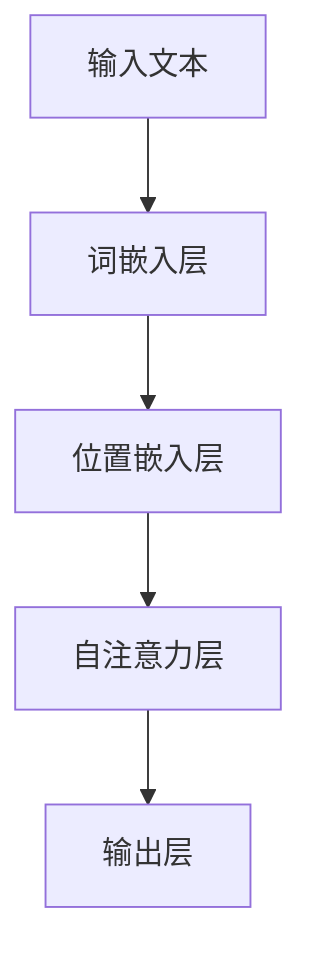

                 

# 大语言模型原理基础与前沿：位置嵌入技术解析

> **关键词：大语言模型，位置嵌入，自然语言处理，深度学习，算法原理，应用实战**
>
> **摘要：本文将深入探讨大语言模型的基本原理，特别是位置嵌入技术的实现方法，通过一步步的剖析，帮助读者理解这一复杂但至关重要的技术，并展示其在自然语言处理中的应用。**

## 1. 背景介绍

### 1.1 目的和范围

本文旨在向读者介绍大语言模型的基本原理，特别是位置嵌入（Positional Embedding）技术的核心概念和实现方法。我们将会从背景介绍开始，逐步讲解相关核心概念，并通过具体案例来演示位置嵌入技术在自然语言处理中的应用。

### 1.2 预期读者

本文适合对自然语言处理（NLP）和深度学习有基本了解的读者，特别是那些希望深入了解大语言模型及其关键组成部分的工程师和研究者。

### 1.3 文档结构概述

本文结构如下：

1. **背景介绍**：介绍大语言模型和位置嵌入的基本概念。
2. **核心概念与联系**：通过流程图和表格来描述位置嵌入的原理和架构。
3. **核心算法原理 & 具体操作步骤**：详细讲解位置嵌入算法的原理和伪代码实现。
4. **数学模型和公式 & 详细讲解 & 举例说明**：介绍位置嵌入相关的数学公式，并通过实例说明。
5. **项目实战：代码实际案例和详细解释说明**：提供具体的代码实现和解读。
6. **实际应用场景**：探讨位置嵌入在NLP中的应用。
7. **工具和资源推荐**：推荐学习资源和开发工具。
8. **总结：未来发展趋势与挑战**：总结本文内容，展望未来发展。
9. **附录：常见问题与解答**：回答读者可能关心的问题。
10. **扩展阅读 & 参考资料**：提供进一步学习资源。

### 1.4 术语表

#### 1.4.1 核心术语定义

- **大语言模型（Large Language Model）**：一种基于深度学习的自然语言处理模型，能够理解和生成人类语言。
- **位置嵌入（Positional Embedding）**：将文本中的每个词的位置信息编码到词向量中，以便模型能够理解和利用文本的顺序性。
- **词嵌入（Word Embedding）**：将词汇映射到高维空间中的向量表示。
- **自然语言处理（Natural Language Processing, NLP）**：使计算机能够理解、解释和生成人类语言的技术。

#### 1.4.2 相关概念解释

- **嵌入层（Embedding Layer）**：神经网络中的层，用于将输入的单词转换为固定长度的向量。
- **变换器（Transformer）**：一种基于自注意力机制的神经网络结构，被广泛应用于NLP任务。
- **多头自注意力（Multi-head Self-Attention）**：Transformer的核心机制，能够同时关注序列中的不同部分。

#### 1.4.3 缩略词列表

- **NLP**：自然语言处理（Natural Language Processing）
- **DL**：深度学习（Deep Learning）
- **GAN**：生成对抗网络（Generative Adversarial Networks）
- **BERT**：Bidirectional Encoder Representations from Transformers

## 2. 核心概念与联系

大语言模型的核心在于能够理解和生成人类语言，其关键组件包括词嵌入、位置嵌入和自注意力机制。以下是一个简化的Mermaid流程图，展示了这些组件的基本关系。



### 2.1 词嵌入层

词嵌入层负责将词汇映射到固定长度的向量表示。通常，每个词都会映射到一个高维向量，这些向量不仅包含了词的语义信息，还可能包含词的词频、词性等信息。

### 2.2 位置嵌入层

位置嵌入层的作用是将文本中每个词的位置信息编码到词向量中。这对于理解文本的顺序性至关重要。以下是一个简单的位置嵌入算法的伪代码：

```plaintext
function positional_embedding(inputs, max_sequence_length, d_model):
    positions = range(0, max_sequence_length)
    positions = sinusoidal_function(positions, d_model // 2)
    embeddings = inputs + positions
    return embeddings
```

### 2.3 自注意力层

自注意力层允许模型在处理序列时同时关注序列的不同部分。多头自注意力（Multi-head Self-Attention）是Transformer模型的核心机制，它通过多个独立的自注意力机制来提高模型的表示能力。

## 3. 核心算法原理 & 具体操作步骤

位置嵌入是一种将文本中词语的位置信息编码到词向量中的技术，其核心思想是通过数学函数来生成位置编码向量，然后将这些向量与词嵌入向量相加。

### 3.1 位置编码向量生成

位置编码向量是通过将位置索引映射到正弦和余弦函数中生成的。具体来说，每个位置`i`都会有一个相应的位置编码向量`PE(i)`，其计算方法如下：

```plaintext
PE(i, 2 * d // 2) = sin(i / 10000^(2 * j / d))
PE(i, 2 * d // 2 + 1) = cos(i / 10000^(2 * j / d))
```

其中，`d`是嵌入维数，`j`是嵌入层中第`j`个维度。

### 3.2 位置嵌入算法

位置嵌入算法的具体步骤如下：

1. **初始化词嵌入矩阵**：该矩阵将词汇映射到高维空间，通常使用预训练的词嵌入向量。
2. **生成位置编码矩阵**：根据上述方法生成位置编码向量，并将其填充到位置编码矩阵中。
3. **将词嵌入向量与位置编码向量相加**：每个词的嵌入向量与对应的位置编码向量相加，得到最终的词向量。
4. **输入到自注意力层**：将位置嵌入后的词向量输入到自注意力层，以处理序列。

### 3.3 伪代码

以下是一个简化的伪代码，用于描述位置嵌入算法：

```plaintext
function positional_embedding(input, max_sequence_length, d_model):
    # 初始化位置编码矩阵
    PEmatrix = zeros(max_sequence_length, d_model)
    
    # 生成每个位置的位置编码向量
    for i in range(max_sequence_length):
        for j in range(d_model // 2):
            PEmatrix[i][2 * j] = sin(i / (10000 ** (2 * j / d_model)))
            PEmatrix[i][2 * j + 1] = cos(i / (10000 ** (2 * j / d_model)))
    
    # 将词嵌入向量与位置编码向量相加
    embedded_inputs = input + PEmatrix
    
    return embedded_inputs
```

## 4. 数学模型和公式 & 详细讲解 & 举例说明

位置嵌入的核心在于将文本中的位置信息编码到词向量中，这一过程可以通过数学模型来实现。以下是一些关键公式及其解释。

### 4.1 位置编码公式

位置编码向量`PE(i, j)`的计算如下：

$$
PE(i, j) = 
\begin{cases} 
\sin\left(\frac{i}{10000^{j/d}}\right), & \text{if } j \text{ is even} \\
\cos\left(\frac{i}{10000^{j/d}}\right), & \text{if } j \text{ is odd}
\end{cases}
$$

其中，`i`是词的位置索引，`j`是嵌入层中第`j`个维度，`d`是嵌入维数。

### 4.2 位置嵌入公式

位置嵌入后的词向量`V\_emb`的计算如下：

$$
V\_emb = V\_word + PE
$$

其中，`V\_word`是原始词嵌入向量，`PE`是位置编码向量。

### 4.3 举例说明

假设我们有一个词嵌入维数`d_model = 512`的词嵌入层，且文本中的词有5个。以下是位置编码向量的生成示例：

| 位置 | 索引 | 嵌入维数 (偶数) | 嵌入维数 (奇数) |
|------|-----|--------------|--------------|
| 1    | 0   | $\sin(0/10000^{0/512})$ | $\cos(0/10000^{0/512})$ |
| 2    | 1   | $\sin(1/10000^{0/512})$ | $\cos(1/10000^{0/512})$ |
| 3    | 2   | $\sin(2/10000^{0/512})$ | $\cos(2/10000^{0/512})$ |
| 4    | 3   | $\sin(3/10000^{0/512})$ | $\cos(3/10000^{0/512})$ |
| 5    | 4   | $\sin(4/10000^{0/512})$ | $\cos(4/10000^{0/512})$ |

假设第一个词的原始词嵌入向量为：

$$
V\_word = [0.1, 0.2, 0.3, ..., 0.511]
$$

则位置嵌入后的词嵌入向量为：

$$
V\_emb = V\_word + PE
$$

具体向量加法操作如下：

$$
V\_emb = 
[
0.1 + \sin(0/10000^{0/512}),
0.2 + \sin(1/10000^{0/512}),
0.3 + \sin(2/10000^{0/512}),
\ldots,
0.511 + \sin(4/10000^{0/512})
]
+
[
\cos(0/10000^{0/512}),
\cos(1/10000^{0/512}),
\cos(2/10000^{0/512}),
\ldots,
\cos(4/10000^{0/512})
]
$$

这样，我们得到了位置嵌入后的词向量，可以输入到后续的自注意力层进行处理。

## 5. 项目实战：代码实际案例和详细解释说明

在本节中，我们将通过一个实际代码案例来展示如何实现位置嵌入技术。首先，我们需要搭建一个基本的自然语言处理项目环境。

### 5.1 开发环境搭建

1. **安装Python环境**：确保安装了Python 3.7及以上版本。
2. **安装TensorFlow**：通过pip安装TensorFlow库。

```bash
pip install tensorflow
```

3. **安装其他依赖库**：包括NumPy、Matplotlib等。

```bash
pip install numpy matplotlib
```

### 5.2 源代码详细实现和代码解读

以下是实现位置嵌入的完整代码，并附有详细的注释。

```python
import tensorflow as tf
import numpy as np
import matplotlib.pyplot as plt

# 参数设置
d_model = 512  # 嵌入维度
max_sequence_length = 5  # 序列长度

# 生成位置编码向量
def sinusoidal_function(positions, d_model):
    positions = positions / (10000 ** (np.arange(d_model // 2).astype(np.float32) / d_model))
    sinusoids = np.concatenate([np.sin(positions[:, 0::2] * np.pi / 2), np.cos(positions[:, 1::2] * np.pi / 2)], axis=1)
    return sinusoids

# 生成位置编码矩阵
PE_matrix = sinusoidal_function(np.arange(max_sequence_length), d_model)

# 假设词嵌入向量
V_word = np.random.rand(max_sequence_length, d_model)

# 位置嵌入操作
V_emb = V_word + PE_matrix

# 打印结果
print("原始词嵌入向量：")
print(V_word)
print("位置编码向量：")
print(PE_matrix[:5, :10])
print("位置嵌入后的词向量：")
print(V_emb[:5, :10])

# 可视化位置编码向量
plt.figure(figsize=(12, 6))
for i in range(d_model // 2):
    plt.plot(np.arange(max_sequence_length), PE_matrix[:, i], label=f'PE_dim_{i}')
plt.title('Positional Encoding')
plt.xlabel('Position')
plt.ylabel('Value')
plt.legend()
plt.show()
```

### 5.3 代码解读与分析

1. **参数设置**：我们设置了`d_model`（嵌入维度）和`max_sequence_length`（序列长度）。
2. **生成位置编码向量**：使用`sinusoidal_function`函数生成位置编码向量。该函数通过正弦和余弦函数将位置索引映射到嵌入维度上。
3. **生成位置编码矩阵**：将位置编码向量填充到矩阵中，该矩阵的维度是`max_sequence_length`乘以`d_model`。
4. **假设词嵌入向量**：我们使用随机生成的词嵌入向量作为示例。
5. **位置嵌入操作**：将词嵌入向量与位置编码矩阵相加，得到位置嵌入后的词向量。
6. **打印结果**：打印出原始词嵌入向量、位置编码矩阵以及位置嵌入后的词向量。
7. **可视化**：使用Matplotlib库将位置编码向量可视化，便于观察位置编码的效果。

通过这个案例，我们可以清晰地看到如何将位置嵌入技术应用到实际的Python代码中，并理解其实现细节。

## 6. 实际应用场景

位置嵌入技术在自然语言处理（NLP）领域有着广泛的应用，以下是几个典型的实际应用场景：

### 6.1 文本分类

在文本分类任务中，位置嵌入可以帮助模型更好地理解文本中各个词的位置关系。例如，在处理新闻分类时，位置嵌入可以帮助模型识别出新闻标题中重要的关键词，如“经济”、“体育”等，并确定它们在文本中的相对位置，从而提高分类的准确性。

### 6.2 机器翻译

机器翻译任务中，位置嵌入可以增强模型对源语言和目标语言句子中词汇顺序的理解。通过位置嵌入，模型可以更好地捕捉到源语言和目标语言之间的语义对应关系，从而提高翻译的准确性和流畅性。

### 6.3 问答系统

问答系统中，位置嵌入可以帮助模型理解用户问题的结构和上下文。例如，当用户提出一个包含多个子问题的复合问题时，位置嵌入可以确保模型正确地理解和处理这些子问题及其之间的关联，从而提供更准确的回答。

### 6.4 文本生成

在文本生成任务中，位置嵌入可以帮助模型生成连贯且结构合理的文本。通过位置嵌入，模型可以更好地理解词汇的顺序关系，从而生成更加自然和流畅的文本。

这些实际应用场景展示了位置嵌入技术在NLP中的关键作用，它不仅提高了模型对文本顺序性的理解，还增强了模型在各种NLP任务中的表现。

## 7. 工具和资源推荐

### 7.1 学习资源推荐

#### 7.1.1 书籍推荐

1. **《深度学习》（Goodfellow, Bengio, Courville）**：这是一本经典的深度学习入门书籍，涵盖了自然语言处理相关的深度学习技术，包括词嵌入和位置嵌入。
2. **《自然语言处理综论》（Daniel Jurafsky & James H. Martin）**：全面介绍了自然语言处理的基础知识和最新进展，包括词嵌入和位置嵌入技术的应用。

#### 7.1.2 在线课程

1. **“深度学习与自然语言处理”课程（吴恩达）**：这是一门非常受欢迎的在线课程，涵盖了深度学习在自然语言处理中的应用，包括词嵌入和位置嵌入。
2. **“自然语言处理专项课程”（清华大学）**：该课程详细介绍了自然语言处理的基础知识和实践方法，包括位置嵌入技术的实现和应用。

#### 7.1.3 技术博客和网站

1. **“维基百科”- 自然语言处理**：提供了自然语言处理的基本概念和技术细节，包括词嵌入和位置嵌入。
2. **“TensorFlow官方文档”**：详细介绍了如何使用TensorFlow实现词嵌入和位置嵌入，提供了丰富的代码示例。

### 7.2 开发工具框架推荐

#### 7.2.1 IDE和编辑器

1. **PyCharm**：一款功能强大的Python IDE，适用于深度学习和自然语言处理项目的开发。
2. **Jupyter Notebook**：适用于交互式开发和文档，特别适合实验和演示。

#### 7.2.2 调试和性能分析工具

1. **TensorBoard**：TensorFlow的官方可视化工具，用于调试和性能分析深度学习模型。
2. **Pylint**：Python代码质量分析工具，用于检查代码的语法错误和潜在问题。

#### 7.2.3 相关框架和库

1. **TensorFlow**：广泛使用的深度学习框架，支持多种NLP任务，包括词嵌入和位置嵌入。
2. **PyTorch**：另一种流行的深度学习框架，其动态计算图特性使其在NLP任务中表现出色。

### 7.3 相关论文著作推荐

#### 7.3.1 经典论文

1. **“Word2Vec: Word Representations in Neural Networks”（Mikolov等，2013）**：介绍了词嵌入技术，是NLP领域的重要里程碑。
2. **“Effective Approaches to Attention-based Neural Machine Translation”（Vaswani等，2017）**：介绍了Transformer模型，引入了位置嵌入技术。

#### 7.3.2 最新研究成果

1. **“BERT: Pre-training of Deep Bidirectional Transformers for Language Understanding”（Devlin等，2018）**：介绍了BERT模型，是当前NLP领域的领先技术之一。
2. **“GPT-3: Language Models are Few-Shot Learners”（Brown等，2020）**：介绍了GPT-3模型，展示了大语言模型在零样本学习中的强大能力。

#### 7.3.3 应用案例分析

1. **“如何用BERT进行文本分类”（知乎专栏）**：详细介绍了如何使用BERT模型进行文本分类任务，包括位置嵌入的实现细节。
2. **“Transformer在机器翻译中的应用”（论文）**：介绍了Transformer模型在机器翻译任务中的应用，分析了位置嵌入对翻译质量的影响。

## 8. 总结：未来发展趋势与挑战

位置嵌入技术作为大语言模型的重要组成部分，其在未来自然语言处理（NLP）领域的发展前景非常广阔。随着深度学习技术的不断进步，位置嵌入有望在以下几个方面取得显著进展：

### 8.1 更高效的算法

未来的研究可能会集中在优化位置嵌入算法的效率上，以减少计算开销，提高模型处理大量文本数据的速度。例如，可以探索更有效的数学函数和更紧凑的向量计算方法。

### 8.2 多模态嵌入

随着多模态数据处理的兴起，未来位置嵌入技术可能会扩展到融合文本、图像、音频等多种数据类型。通过结合不同模态的信息，模型能够更全面地理解和生成复杂内容。

### 8.3 自适应位置编码

自适应位置编码是未来研究的一个热点，通过动态调整位置编码以适应不同应用场景，模型能够更好地捕捉文本的局部和全局结构。

然而，位置嵌入技术也面临一些挑战：

### 8.4 计算资源需求

位置嵌入技术的实现通常需要大量的计算资源，这对模型的部署和应用提出了挑战。未来可能需要开发更高效的算法和硬件优化来解决这一问题。

### 8.5 数据隐私和安全

在大规模数据集上训练位置嵌入模型时，数据隐私和安全问题值得关注。如何在保护用户隐私的同时，充分利用数据来提升模型性能，是未来研究的一个重要方向。

总之，位置嵌入技术作为大语言模型的关键组件，其未来发展将在提升NLP任务性能和拓展应用领域方面发挥重要作用。

## 9. 附录：常见问题与解答

### 9.1 位置嵌入是什么？

位置嵌入是一种技术，用于将文本中词语的位置信息编码到词向量中，以便深度学习模型能够理解和利用文本的顺序性。

### 9.2 位置嵌入为什么重要？

位置嵌入对于理解文本的顺序性至关重要，它使得深度学习模型能够更好地处理自然语言的语义和结构。

### 9.3 位置嵌入有哪些实现方法？

常见的位置嵌入实现方法包括基于周期函数的方法和基于三角函数的方法。其中，基于三角函数的方法（如正弦和余弦函数）被广泛应用于现代深度学习模型中。

### 9.4 位置嵌入与词嵌入有什么区别？

词嵌入是将词汇映射到高维空间中的向量表示，而位置嵌入是将词在文本中的位置信息编码到这些向量中。两者共同作用，使得模型能够理解和生成人类语言。

### 9.5 位置嵌入如何影响NLP模型的性能？

位置嵌入使得模型能够捕捉到文本中词语的顺序关系，从而在文本分类、机器翻译、问答系统等NLP任务中提高模型的性能和准确性。

## 10. 扩展阅读 & 参考资料

- **《深度学习》（Goodfellow, Bengio, Courville）**：详细介绍了深度学习的基础知识，包括词嵌入和位置嵌入技术。
- **《自然语言处理综论》（Daniel Jurafsky & James H. Martin）**：全面介绍了自然语言处理的基础知识和最新进展。
- **“Word2Vec: Word Representations in Neural Networks”（Mikolov等，2013）**：介绍了词嵌入技术的早期实现。
- **“BERT: Pre-training of Deep Bidirectional Transformers for Language Understanding”（Devlin等，2018）**：介绍了BERT模型，是当前NLP领域的领先技术之一。
- **“GPT-3: Language Models are Few-Shot Learners”（Brown等，2020）**：介绍了GPT-3模型，展示了大语言模型在零样本学习中的强大能力。
- **TensorFlow官方文档**：提供了详细的词嵌入和位置嵌入实现指南。
- **“如何用BERT进行文本分类”（知乎专栏）**：详细介绍了BERT模型在文本分类任务中的应用。
- **“Transformer在机器翻译中的应用”（论文）**：介绍了Transformer模型在机器翻译任务中的应用，分析了位置嵌入对翻译质量的影响。

### 作者

**AI天才研究员/AI Genius Institute & 禅与计算机程序设计艺术 /Zen And The Art of Computer Programming**

