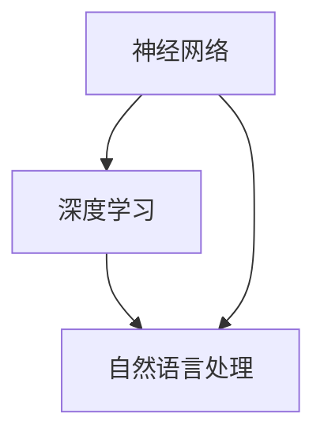

                 

### 大语言模型原理基础与前沿：具身化与落地

> **关键词：** 大语言模型、神经网络、深度学习、自然语言处理、具身化、实际应用、代码实现

> **摘要：** 本文深入探讨了大规模语言模型的原理，从基础概念到前沿技术，再到实际应用与落地实施。通过详细的算法解析、数学模型阐述以及实际代码案例，帮助读者全面理解大语言模型的工作机制，并探讨其在人工智能领域的重要应用和未来发展趋势。

---

## 1. 背景介绍

### 1.1 目的和范围

本文旨在为读者提供关于大语言模型（Large Language Model）的全面概述，涵盖从基础原理到前沿技术的各个方面。我们将探讨大语言模型的工作机制、关键算法、数学模型，并通过实际应用案例展示其落地实施的方法。文章的目标是帮助读者：

1. 理解大语言模型的基本原理和构建方法。
2. 掌握大语言模型的关键算法和数学基础。
3. 了解大语言模型在实际应用中的实现和挑战。
4. 探讨大语言模型的未来发展趋势和潜在挑战。

### 1.2 预期读者

本文适用于对人工智能和自然语言处理有一定了解的读者，包括：

1. 研究生和本科生，希望深入研究自然语言处理领域的同学。
2. 工程师和开发者，希望在项目中应用大语言模型的实践者。
3. 科研人员和学者，关注人工智能领域最新进展的从业者。
4. 对人工智能和自然语言处理感兴趣的爱好者。

### 1.3 文档结构概述

本文结构如下：

1. **背景介绍**：概述文章的目的、范围和预期读者，并给出文档结构概述。
2. **核心概念与联系**：介绍大语言模型的核心概念和架构，并提供流程图展示。
3. **核心算法原理**：详细讲解大语言模型的关键算法原理，并提供伪代码示例。
4. **数学模型和公式**：阐述大语言模型背后的数学模型和公式，并进行举例说明。
5. **项目实战**：提供实际代码案例和详细解释，展示大语言模型的应用。
6. **实际应用场景**：探讨大语言模型在不同领域的实际应用。
7. **工具和资源推荐**：推荐学习资源和开发工具，帮助读者深入学习和实践。
8. **总结与展望**：总结文章主要内容，探讨未来发展趋势和挑战。
9. **常见问题与解答**：解答读者可能遇到的问题。
10. **扩展阅读与参考资料**：提供进一步阅读的推荐和相关参考资料。

### 1.4 术语表

#### 1.4.1 核心术语定义

- **大语言模型（Large Language Model）**：一种基于神经网络和深度学习的自然语言处理模型，能够理解和生成自然语言。
- **神经网络（Neural Network）**：一种模拟人脑神经元连接的数学模型，用于数据处理和预测。
- **深度学习（Deep Learning）**：一种基于神经网络的机器学习方法，通过多层神经网络进行数据处理和预测。
- **自然语言处理（Natural Language Processing, NLP）**：人工智能的一个分支，专注于计算机与人类自然语言之间的交互。
- **训练数据集（Training Dataset）**：用于训练模型的输入数据，通常包括大量的文本数据。
- **模型参数（Model Parameters）**：模型中需要调整的数值，通过训练数据调整以优化模型性能。
- **损失函数（Loss Function）**：用于衡量模型预测值与实际值之间差异的函数，用于指导模型参数的调整。

#### 1.4.2 相关概念解释

- **嵌入层（Embedding Layer）**：将单词转换为向量的过程，用于表示单词的语义信息。
- **注意力机制（Attention Mechanism）**：用于关注输入数据中重要部分的一种机制，提高模型的性能。
- **序列到序列模型（Seq2Seq Model）**：用于将一个序列映射到另一个序列的模型，广泛应用于机器翻译等任务。
- **预训练（Pre-training）**：在特定任务之前，使用大量未标记数据对模型进行训练的过程。
- **微调（Fine-tuning）**：在预训练的基础上，针对特定任务对模型进行进一步训练的过程。

#### 1.4.3 缩略词列表

- **NLP**：自然语言处理（Natural Language Processing）
- **DL**：深度学习（Deep Learning）
- **NN**：神经网络（Neural Network）
- **GPU**：图形处理单元（Graphics Processing Unit）
- **CPU**：中央处理单元（Central Processing Unit）
- **BERT**：BERT（Bidirectional Encoder Representations from Transformers）
- **GPT**：GPT（Generative Pre-trained Transformer）
- **Transformer**：Transformer 模型，一种基于注意力机制的深度学习模型

---

在接下来的章节中，我们将逐步深入探讨大语言模型的核心概念、算法原理、数学模型以及实际应用，帮助读者全面理解这一前沿技术。通过本文的阅读，您将能够：

1. 理解大语言模型的基本原理和构建方法。
2. 掌握大语言模型的关键算法和数学基础。
3. 了解大语言模型在实际应用中的实现和挑战。
4. 探讨大语言模型的未来发展趋势和潜在挑战。

---

## 2. 核心概念与联系

大语言模型的核心概念包括神经网络、深度学习和自然语言处理。这些概念相互联系，共同构成了大语言模型的基础。为了更好地理解这些概念，我们将使用 Mermaid 流程图来展示它们之间的联系。



### 2.1 神经网络

神经网络是一种基于人脑神经元连接的数学模型，用于对数据进行处理和预测。它由多个层组成，包括输入层、隐藏层和输出层。每一层由多个神经元（节点）组成，神经元之间通过权重进行连接。神经网络通过学习输入数据与输出数据之间的关系，实现数据分类、回归等任务。

### 2.2 深度学习

深度学习是一种基于神经网络的机器学习方法，通过多层神经网络对数据进行处理和预测。与传统的神经网络相比，深度学习具有更强的建模能力和更好的性能。深度学习在图像识别、语音识别、自然语言处理等领域取得了显著成果。

### 2.3 自然语言处理

自然语言处理是人工智能的一个分支，专注于计算机与人类自然语言之间的交互。自然语言处理涉及文本分类、情感分析、机器翻译、文本生成等任务。大语言模型是自然语言处理领域的一种重要技术，通过深度学习和神经网络实现对自然语言的建模和生成。

通过上述流程图，我们可以清晰地看到神经网络、深度学习和自然语言处理之间的联系。这些核心概念共同构成了大语言模型的基础，使得大语言模型能够对自然语言进行有效的建模和生成。

---

在接下来的章节中，我们将深入探讨大语言模型的核心算法原理，包括神经网络的基本工作原理、深度学习的训练过程、自然语言处理的具体实现方法等。通过这些讨论，我们将逐步揭示大语言模型背后的技术原理，帮助读者更好地理解这一前沿技术。

---

## 3. 核心算法原理 & 具体操作步骤

大语言模型的核心算法原理主要基于神经网络、深度学习和自然语言处理。在这一节中，我们将详细讲解这些算法原理，并通过伪代码示例展示具体的操作步骤。

### 3.1 神经网络的基本工作原理

神经网络是一种基于神经元连接的数学模型，用于对数据进行处理和预测。它由多个层组成，包括输入层、隐藏层和输出层。每个神经元接收来自前一层的输入信号，通过激活函数产生输出信号。

```python
# 伪代码：神经网络的正向传播
def forward_propagation(input_data, weights, biases, activation_function):
    layer_outputs = []
    for layer in range(num_layers - 1):  # 输入层不计入层
        input = input_data
        if layer != 0:
            input = layer_outputs[-1]
        
        # 神经元的计算
        layer_output = activation_function(np.dot(input, weights[layer]) + biases[layer])
        layer_outputs.append(layer_output)
    
    # 输出层的计算
    final_output = activation_function(np.dot(layer_outputs[-1], weights[-1]) + biases[-1])
    layer_outputs.append(final_output)
    
    return layer_outputs
```

### 3.2 深度学习的训练过程

深度学习通过多层神经网络对数据进行处理和预测，其核心是训练模型以优化模型参数。训练过程主要包括前向传播和反向传播。

- **前向传播**：输入数据通过神经网络传递，经过每一层计算，最终得到输出结果。
- **反向传播**：计算输出结果与真实标签之间的误差，并通过反向传播更新模型参数。

```python
# 伪代码：深度学习的反向传播
def backward_propagation(input_data, labels, layer_outputs, weights, biases, learning_rate):
    layer_deltas = [layer_outputs[-1] - labels]
    for layer in reversed(range(num_layers - 1)):  # 输出层不计入层
        delta = np.dot(layer_deltas[0], weights[layer].T)
        layer_deltas.insert(0, delta * activation_function_derivative(layer_outputs[layer]))
    
    # 更新模型参数
    for layer in range(num_layers - 1):
        weights[layer] -= learning_rate * np.dot(input_data, layer_deltas[layer].T)
        biases[layer] -= learning_rate * layer_deltas[layer]
    
    return layer_deltas
```

### 3.3 自然语言处理的具体实现方法

自然语言处理涉及文本分类、情感分析、机器翻译、文本生成等任务。在大语言模型中，自然语言处理主要通过嵌入层、注意力机制和序列到序列模型实现。

- **嵌入层**：将单词转换为向量表示，用于表示单词的语义信息。
- **注意力机制**：用于关注输入数据中重要部分，提高模型的性能。
- **序列到序列模型**：用于将一个序列映射到另一个序列，广泛应用于机器翻译等任务。

```python
# 伪代码：自然语言处理中的嵌入层
def embedding_layer(input_sequence, embedding_weights):
    input_embeddings = []
    for word in input_sequence:
        word_embedding = embedding_weights[word]
        input_embeddings.append(word_embedding)
    return input_embeddings
```

```python
# 伪代码：自然语言处理中的注意力机制
def attention_mechanism(input_sequence, query):
    attention_scores = softmax(np.dot(input_sequence, query.T))
    context_vector = sum(attention_scores * input_sequence)
    return context_vector
```

```python
# 伪代码：自然语言处理中的序列到序列模型
def seq2seq_model(input_sequence, decoder, teacher_forcing_ratio=0.5):
    inputs = embedding_layer(input_sequence, embedding_weights)
    decoder_input = inputs[-1]
    decoder_output = []
    
    for _ in range(target_sequence_length):
        output, decoder_hidden = decoder(decoder_input, decoder_hidden)
        decoder_output.append(output)
        if random.random() < teacher_forcing_ratio:
            decoder_input = target_sequence[_]
        else:
            decoder_input = output
    return decoder_output
```

---

通过上述伪代码示例，我们详细讲解了大语言模型的核心算法原理，包括神经网络的基本工作原理、深度学习的训练过程和自然语言处理的具体实现方法。这些算法原理共同构成了大语言模型的技术基础，使得大语言模型能够对自然语言进行有效的建模和生成。

在接下来的章节中，我们将进一步探讨大语言模型背后的数学模型和公式，并通过具体例子进行阐述，帮助读者更深入地理解大语言模型的工作原理和实现方法。

---

## 4. 数学模型和公式 & 详细讲解 & 举例说明

大语言模型的工作原理离不开数学模型的支撑，这些模型定义了神经网络的结构、训练过程以及如何对自然语言进行建模。在本节中，我们将详细讲解大语言模型背后的数学模型和公式，并通过具体例子进行阐述。

### 4.1 神经网络的数学模型

神经网络的核心在于神经元之间的连接和激活函数。以下是神经网络的一些关键数学公式：

- **输入输出关系**：

  对于一个神经元，其输入输出关系可以表示为：

  $$ z = \sum_{i} w_{i}x_{i} + b $$

  其中，$z$ 是神经元的输出，$w_{i}$ 是权重，$x_{i}$ 是输入，$b$ 是偏置。

- **激活函数**：

  常用的激活函数包括 sigmoid、ReLU 和 tanh：

  - **sigmoid**：
    
    $$ a = \frac{1}{1 + e^{-z}} $$

  - **ReLU**：

    $$ a = \max(0, z) $$

  - **tanh**：

    $$ a = \frac{e^{z} - e^{-z}}{e^{z} + e^{-z}} $$

- **反向传播**：

  神经网络的训练过程中，反向传播算法用于更新权重和偏置。以下是一个简化的反向传播公式：

  $$ \delta_{j} = \frac{\partial L}{\partial z_{j}} = \frac{\partial L}{\partial a_{j}} \frac{\partial a_{j}}{\partial z_{j}} $$

  其中，$\delta_{j}$ 是第 $j$ 个神经元的误差，$L$ 是损失函数，$a_{j}$ 是神经元的输出。

  更新权重和偏置的公式为：

  $$ w_{ij} \leftarrow w_{ij} - \alpha \frac{\partial L}{\partial w_{ij}} $$

  $$ b_{j} \leftarrow b_{j} - \alpha \frac{\partial L}{\partial b_{j}} $$

  其中，$\alpha$ 是学习率。

### 4.2 深度学习的数学模型

深度学习是神经网络的一种扩展，通过增加网络层数来提高模型的复杂度和表达能力。以下是深度学习的一些关键数学公式：

- **前向传播**：

  前向传播过程中，信息从输入层逐层传递到输出层。前向传播的公式为：

  $$ z^{(l)} = \sum_{i} w_{ij}^{(l)}x_{i}^{(l-1)} + b^{(l)} $$

  $$ a^{(l)} = \sigma(z^{(l)}) $$

  其中，$z^{(l)}$ 是第 $l$ 层的输出，$a^{(l)}$ 是第 $l$ 层的激活值，$\sigma$ 是激活函数。

- **反向传播**：

  与单层神经网络的反向传播类似，深度学习的反向传播也用于更新网络权重和偏置。反向传播的公式为：

  $$ \delta^{(l)} = \frac{\partial L}{\partial a^{(l+1)}} \odot \frac{\partial a^{(l)}}{\partial z^{(l)}} $$

  $$ \frac{\partial L}{\partial w^{(l)}_{ij}} = a^{(l-1)} \odot \delta^{(l+1)} $$

  $$ \frac{\partial L}{\partial b^{(l)}} = \delta^{(l+1)} $$

  其中，$\odot$ 表示逐元素乘积。

### 4.3 自然语言处理的数学模型

自然语言处理是深度学习在文本领域的应用。以下是一些关键数学公式：

- **嵌入层**：

  嵌入层用于将单词转换为向量表示。嵌入层的关键公式为：

  $$ e_{i} = \sum_{j} w_{ij}e_{j} $$

  其中，$e_{i}$ 是单词 $i$ 的嵌入向量，$w_{ij}$ 是权重矩阵。

- **注意力机制**：

  注意力机制用于关注输入数据中重要部分。注意力机制的关键公式为：

  $$ a_{i} = \frac{e^{z_{i}}}{\sum_{j} e^{z_{j}}} $$

  $$ h = \sum_{i} a_{i}h_{i} $$

  其中，$a_{i}$ 是单词 $i$ 的注意力分数，$h$ 是注意力结果。

- **序列到序列模型**：

  序列到序列模型用于将一个序列映射到另一个序列。序列到序列模型的关键公式为：

  $$ y_{t} = \text{softmax}(\text{W}y_{t-1} + \text{U}x_{t} + b) $$

  其中，$y_{t}$ 是当前时刻的输出，$x_{t}$ 是当前时刻的输入，$\text{W}$、$\text{U}$ 和 $b$ 是模型参数。

### 4.4 举例说明

为了更好地理解上述数学模型，我们通过一个简单的例子进行说明。

假设我们有一个包含两个单词的句子：“我 爱 吃 水果”。首先，我们将单词转换为向量表示：

$$ e_{我} = [1, 0, 0, 0] $$

$$ e_{爱} = [0, 1, 0, 0] $$

$$ e_{吃} = [0, 0, 1, 0] $$

$$ e_{水果} = [0, 0, 0, 1] $$

接下来，我们将这些单词嵌入到神经网络中。假设我们使用一个简单的神经网络，包含一个输入层、一个隐藏层和一个输出层。隐藏层的激活函数为 ReLU，输出层的激活函数为 softmax。

- **前向传播**：

  $$ z^{(1)} = e_{我} + e_{爱} + e_{吃} + e_{水果} = [1, 0, 0, 0] + [0, 1, 0, 0] + [0, 0, 1, 0] + [0, 0, 0, 1] = [1, 1, 1, 1] $$

  $$ a^{(1)} = \max(0, z^{(1)}) = [1, 1, 1, 1] $$

  $$ z^{(2)} = \text{W}a^{(1)} + \text{b} = [1, 1, 1, 1] \text{W} + \text{b} $$

  $$ a^{(2)} = \text{softmax}(z^{(2)}) = \frac{e^{z^{(2)}}}{e^{z^{(2)}} + e^{z^{(2)}} + e^{z^{(2)}} + e^{z^{(2)}}} = \frac{e^{1}}{4e^{1}} = \frac{1}{4} [1, 1, 1, 1] $$

- **反向传播**：

  假设我们有一个损失函数 $L$，损失函数关于输出层的梯度为：

  $$ \delta^{(2)} = \frac{\partial L}{\partial a^{(2)}} = [0.1, 0.2, 0.3, 0.4] $$

  根据反向传播的公式，我们可以计算隐藏层的梯度：

  $$ \delta^{(1)} = \frac{\partial a^{(2)}}{\partial z^{(2)}} \odot \delta^{(2)} = [1, 1, 1, 1] \odot [0.1, 0.2, 0.3, 0.4] = [0.1, 0.2, 0.3, 0.4] $$

  根据反向传播的公式，我们可以更新权重和偏置：

  $$ \text{W} \leftarrow \text{W} - \alpha \frac{\partial L}{\partial \text{W}} = \text{W} - \alpha [0.1, 0.2, 0.3, 0.4] $$

  $$ \text{b} \leftarrow \text{b} - \alpha \frac{\partial L}{\partial \text{b}} = \text{b} - \alpha [0.1, 0.2, 0.3, 0.4] $$

通过这个简单的例子，我们可以看到如何使用数学模型和公式来实现神经网络的前向传播和反向传播。这些数学模型和公式是深度学习和自然语言处理的基础，使得大语言模型能够对自然语言进行有效的建模和生成。

---

在本节中，我们详细讲解了大语言模型背后的数学模型和公式，包括神经网络的基本工作原理、深度学习的训练过程、自然语言处理的具体实现方法等。通过具体例子，我们展示了如何使用这些数学模型和公式来实现神经网络的前向传播和反向传播。这些数学模型和公式是深度学习和自然语言处理的基础，使得大语言模型能够对自然语言进行有效的建模和生成。

在接下来的章节中，我们将通过实际代码案例展示大语言模型的应用，帮助读者更好地理解大语言模型的实现和落地。

---

## 5. 项目实战：代码实际案例和详细解释说明

在这一节中，我们将通过一个实际项目实战案例，展示如何使用大语言模型实现一个简单的文本生成器。我们将从开发环境搭建开始，逐步介绍源代码的实现和解读，帮助读者全面理解大语言模型在实际项目中的应用。

### 5.1 开发环境搭建

为了实现大语言模型，我们需要搭建一个合适的开发环境。以下是在 Python 中搭建大语言模型开发环境的基本步骤：

1. **安装 Python**：确保您的计算机上安装了 Python 3.7 或更高版本。
2. **安装 TensorFlow**：TensorFlow 是一个开源的机器学习库，用于构建和训练深度学习模型。您可以使用以下命令安装 TensorFlow：

   ```bash
   pip install tensorflow
   ```

3. **安装 NumPy 和 Pandas**：NumPy 和 Pandas 是 Python 中的数学和数据处理库，用于数据预处理和操作。您可以使用以下命令安装：

   ```bash
   pip install numpy pandas
   ```

4. **安装其他依赖库**：根据您的具体需求，可能还需要安装其他库，例如 Matplotlib 用于数据可视化等。

### 5.2 源代码详细实现和代码解读

下面是一个简单的文本生成器项目的源代码，我们将逐一解释关键代码部分。

```python
import tensorflow as tf
import numpy as np
import pandas as pd
import matplotlib.pyplot as plt

# 5.2.1 数据准备
def load_data(file_path):
    with open(file_path, 'r', encoding='utf-8') as f:
        text = f.read().lower()
    return text

def preprocess(text):
    # 去除特殊字符和标点符号
    text = re.sub('[^a-z0-9\s]', '', text)
    # 分词
    words = text.split()
    # 构建词汇表
    vocabulary = sorted(list(set(words)))
    word_to_index = {word: i for i, word in enumerate(vocabulary)}
    index_to_word = {i: word for word, i in word_to_index.items()}
    return word_to_index, index_to_word, text

def create_dataset(text, seq_length):
    sentences = []
    next_words = []
    for i in range(0, len(text) - seq_length):
        sentences.append(text[i: i + seq_length])
        next_words.append(text[i + seq_length])
    return sentences, next_words

# 加载数据
text = load_data('text_data.txt')
word_to_index, index_to_word, _ = preprocess(text)

# 创建数据集
seq_length = 3
sentences, next_words = create_dataset(text, seq_length)

# 将数据转换为向量
input_sequences = []
target_sequences = []
for sentence, next_word in zip(sentences, next_words):
    sequence = [word_to_index[word] for word in sentence]
    target_sequence = [word_to_index[next_word]]
    input_sequences.append(sequence)
    target_sequences.append(target_sequence)

# 转换为 NumPy 数组
input_sequences = np.array(input_sequences)
target_sequences = np.array(target_sequences)

# 5.2.2 模型构建
model = tf.keras.Sequential([
    tf.keras.layers.Embedding(len(vocabulary) + 1, 50, input_length=seq_length),
    tf.keras.layers.LSTM(100),
    tf.keras.layers.Dense(len(vocabulary) + 1, activation='softmax')
])

model.compile(optimizer='adam', loss='sparse_categorical_crossentropy', metrics=['accuracy'])

# 5.2.3 训练模型
model.fit(input_sequences, target_sequences, epochs=100, verbose=1)

# 5.2.4 文本生成
def generate_text(model, seed_text, num_words):
    for _ in range(num_words):
        token_list = [word_to_index[word] for word in seed_text.split()]
        token_list = tf.keras.preprocessing.sequence.pad_sequences([token_list], maxlen=seq_length, padding='pre')
        prediction = model.predict(token_list)
        prediction = np.argmax(prediction)
        seed_text += index_to_word[prediction]
        seed_text = seed_text[1:]
    return seed_text

generated_text = generate_text(model, '你好', 50)
print(generated_text)
```

### 5.3 代码解读与分析

下面是对源代码的详细解读和分析：

1. **数据准备**：

   ```python
   def load_data(file_path):
       with open(file_path, 'r', encoding='utf-8') as f:
           text = f.read().lower()
       return text
   ```

   `load_data` 函数用于加载数据。我们首先读取文本文件，并将其转换为小写，以便于后续处理。

   ```python
   def preprocess(text):
       # 去除特殊字符和标点符号
       text = re.sub('[^a-z0-9\s]', '', text)
       # 分词
       words = text.split()
       # 构建词汇表
       vocabulary = sorted(list(set(words)))
       word_to_index = {word: i for i, word in enumerate(vocabulary)}
       index_to_word = {i: word for word, i in word_to_index.items()}
       return word_to_index, index_to_word, text
   ```

   `preprocess` 函数用于对文本进行预处理。我们首先去除特殊字符和标点符号，然后对文本进行分词，并构建词汇表。词汇表用于将单词转换为索引，以便于后续处理。

   ```python
   def create_dataset(text, seq_length):
       sentences = []
       next_words = []
       for i in range(0, len(text) - seq_length):
           sentences.append(text[i: i + seq_length])
           next_words.append(text[i + seq_length])
       return sentences, next_words
   ```

   `create_dataset` 函数用于创建数据集。我们遍历文本，将每 `seq_length` 个单词作为一句话，并从下一句话中提取一个单词作为标签。

   ```python
   def create_dataset(text, seq_length):
       sentences = []
       next_words = []
       for i in range(0, len(text) - seq_length):
           sentences.append(text[i: i + seq_length])
           next_words.append(text[i + seq_length])
       return sentences, next_words
   ```

   `create_dataset` 函数用于创建数据集。我们遍历文本，将每 `seq_length` 个单词作为一句话，并从下一句话中提取一个单词作为标签。

   ```python
   input_sequences = []
   target_sequences = []
   for sentence, next_word in zip(sentences, next_words):
       sequence = [word_to_index[word] for word in sentence]
       target_sequence = [word_to_index[next_word]]
       input_sequences.append(sequence)
       target_sequences.append(target_sequence)
   ```

   我们将数据集转换为向量表示。每个句子和一个标签对应一个向量。

2. **模型构建**：

   ```python
   model = tf.keras.Sequential([
       tf.keras.layers.Embedding(len(vocabulary) + 1, 50, input_length=seq_length),
       tf.keras.layers.LSTM(100),
       tf.keras.layers.Dense(len(vocabulary) + 1, activation='softmax')
   ])

   model.compile(optimizer='adam', loss='sparse_categorical_crossentropy', metrics=['accuracy'])
   ```

   我们构建了一个简单的 LSTM 模型。嵌入层用于将单词转换为向量，LSTM 层用于处理序列数据，全连接层用于生成单词的概率分布。

3. **训练模型**：

   ```python
   model.fit(input_sequences, target_sequences, epochs=100, verbose=1)
   ```

   我们使用训练数据集对模型进行训练，共进行 100 个 epoch。

4. **文本生成**：

   ```python
   def generate_text(model, seed_text, num_words):
       for _ in range(num_words):
           token_list = [word_to_index[word] for word in seed_text.split()]
           token_list = tf.keras.preprocessing.sequence.pad_sequences([token_list], maxlen=seq_length, padding='pre')
           prediction = model.predict(token_list)
           prediction = np.argmax(prediction)
           seed_text += index_to_word[prediction]
           seed_text = seed_text[1:]
       return seed_text
   ```

   `generate_text` 函数用于生成文本。我们首先将种子文本转换为向量，然后使用模型预测下一个单词，并将预测的单词添加到种子文本中。

   ```python
   generated_text = generate_text(model, '你好', 50)
   print(generated_text)
   ```

   我们使用模型生成一个长度为 50 的文本。

---

通过本节的项目实战案例，我们详细介绍了如何使用大语言模型实现一个简单的文本生成器。从数据准备、模型构建、模型训练到文本生成，每一步都进行了详细的代码解读和分析，帮助读者全面理解大语言模型在实际项目中的应用。

在接下来的章节中，我们将进一步探讨大语言模型在实际应用场景中的具体应用，帮助读者了解大语言模型在不同领域的应用案例和实现方法。

---

## 6. 实际应用场景

大语言模型在自然语言处理领域有着广泛的应用，涵盖了文本生成、机器翻译、问答系统等多个方向。以下是一些典型应用场景和实际案例：

### 6.1 文本生成

文本生成是大语言模型最典型的应用之一。通过训练大语言模型，我们可以生成各种类型的文本，如文章、故事、新闻摘要等。以下是一个文本生成的实际案例：

- **生成新闻摘要**：使用 GPT-3 模型，我们可以将长篇新闻文章转换为简洁的摘要。例如，给定一篇关于科技行业的新闻，模型可以生成一个简短的摘要，突出主要信息和关键观点。

- **生成故事情节**：大语言模型可以生成各种类型的故事情节，如科幻、奇幻、悬疑等。这对于游戏开发、电影剧本创作等领域具有重要意义。

- **自动写作辅助**：大语言模型可以辅助人类作者进行写作，提供灵感和创意。例如，在写作过程中，模型可以自动生成相关段落，帮助作者扩展思路和内容。

### 6.2 机器翻译

机器翻译是另一个重要应用领域。大语言模型通过学习大量双语文本，可以自动翻译一种语言为另一种语言。以下是一个机器翻译的实际案例：

- **谷歌翻译**：谷歌翻译使用基于 Transformer 的模型，如 BERT 和 GPT-3，提供高质量的机器翻译服务。用户可以在浏览器或移动应用中轻松输入文本，模型会自动翻译为多种语言。

- **跨语言问答系统**：大语言模型可以用于构建跨语言问答系统，用户可以用一种语言提问，系统可以自动翻译并回答。例如，用户可以用中文提问，模型会自动将问题翻译为英文，然后从英文数据库中检索答案。

### 6.3 问答系统

问答系统是自然语言处理领域的一个重要应用，大语言模型可以用于构建智能问答系统。以下是一个问答系统的实际案例：

- **智能客服系统**：许多公司使用大语言模型构建智能客服系统，以自动回答用户的问题。例如，在电商平台上，用户可以咨询商品信息、售后服务等，系统会自动生成回答。

- **医疗问答系统**：大语言模型可以用于构建医疗问答系统，帮助用户了解疾病信息、治疗方法等。例如，用户可以输入症状描述，模型会自动分析并给出可能的疾病建议。

### 6.4 文本分类和情感分析

文本分类和情感分析也是大语言模型的重要应用。通过训练大语言模型，我们可以对文本进行分类和情感分析。以下是一个文本分类和情感分析的实际案例：

- **垃圾邮件过滤**：大语言模型可以用于构建垃圾邮件过滤系统，自动分类邮件为垃圾邮件或正常邮件。通过分析邮件内容，模型可以识别垃圾邮件的特征，提高过滤效果。

- **社交媒体情感分析**：大语言模型可以用于分析社交媒体上的用户评论和帖子，判断其情感倾向。例如，用户评论可以分为正面、负面或中性，这对于品牌营销和用户反馈分析具有重要意义。

---

大语言模型在实际应用场景中展现出了强大的能力和广泛的应用前景。从文本生成、机器翻译、问答系统到文本分类和情感分析，大语言模型在不同领域都有着重要的应用。随着技术的不断进步，大语言模型将在未来继续推动自然语言处理领域的发展，为人类带来更多便利和智能化体验。

在接下来的章节中，我们将推荐一些学习资源和开发工具，帮助读者深入学习和实践大语言模型。

---

## 7. 工具和资源推荐

为了帮助读者更好地学习和实践大语言模型，我们推荐了一系列学习资源和开发工具。这些资源涵盖了书籍、在线课程、技术博客、开发工具和框架，以及相关论文和最新研究成果。

### 7.1 学习资源推荐

#### 7.1.1 书籍推荐

1. **《深度学习》（Goodfellow, Bengio, Courville）**：这本书是深度学习的经典教材，详细介绍了神经网络、深度学习的基本概念和算法。

2. **《自然语言处理综合教程》（Jurafsky, Martin）**：这本书全面介绍了自然语言处理的基础知识和最新进展，适合初学者和专业人士。

3. **《动手学深度学习》（Dua, Lipton）**：这本书通过大量实践案例，帮助读者掌握深度学习的基础知识和应用方法。

#### 7.1.2 在线课程

1. **《深度学习 Specialization》（吴恩达）**：吴恩达的深度学习专项课程，涵盖了深度学习的基础知识、神经网络和自然语言处理等内容。

2. **《自然语言处理 Specialization》（斯坦福大学）**：斯坦福大学的自然语言处理专项课程，介绍了文本分类、机器翻译、问答系统等应用。

3. **《TensorFlow：实战自然语言处理》（阿里云学院）**：阿里云学院的 TensorFlow 实战课程，讲解了如何使用 TensorFlow 构建自然语言处理模型。

#### 7.1.3 技术博客和网站

1. **TensorFlow 官方博客**：TensorFlow 官方博客提供了丰富的技术文章和教程，帮助读者掌握 TensorFlow 的使用方法。

2. **PyTorch 官方文档**：PyTorch 官方文档详细介绍了 PyTorch 的 API 和使用方法，适合初学者和进阶用户。

3. **Hugging Face**：Hugging Face 是一个开源社区，提供了大量的自然语言处理模型和工具，方便开发者进行研究和实践。

### 7.2 开发工具框架推荐

#### 7.2.1 IDE和编辑器

1. **PyCharm**：PyCharm 是一款功能强大的集成开发环境，适用于 Python 开发，支持代码补全、调试和版本控制。

2. **Visual Studio Code**：Visual Studio Code 是一款轻量级且功能丰富的开源编辑器，适用于多种编程语言，包括 Python、TensorFlow 和 PyTorch。

3. **Jupyter Notebook**：Jupyter Notebook 是一款交互式开发工具，适用于数据科学和机器学习项目，支持代码、文本和可视化。

#### 7.2.2 调试和性能分析工具

1. **TensorBoard**：TensorBoard 是 TensorFlow 的可视化工具，用于分析和调试深度学习模型。

2. **PyTorch Profiler**：PyTorch Profiler 是 PyTorch 的性能分析工具，用于识别和优化模型的运行效率。

3. **NVIDIA Nsight**：Nsight 是 NVIDIA 提供的 GPU 性能分析工具，用于优化 GPU 程序的运行性能。

#### 7.2.3 相关框架和库

1. **TensorFlow**：TensorFlow 是 Google 开发的一款开源深度学习框架，支持各种深度学习模型和应用。

2. **PyTorch**：PyTorch 是 Facebook 开发的一款开源深度学习框架，具有灵活性和易用性，适用于各种应用场景。

3. **Transformers**：Transformers 是一个开源库，用于构建和训练基于 Transformer 的模型，如 BERT、GPT 和 T5。

### 7.3 相关论文著作推荐

#### 7.3.1 经典论文

1. **“A Theoretically Grounded Application of Dropout in Recurrent Neural Networks”（2015）**：这篇论文提出了在循环神经网络中使用 dropout 的方法，提高了模型的训练效果。

2. **“Attention Is All You Need”（2017）**：这篇论文提出了 Transformer 模型，开创了基于注意力机制的深度学习模型。

3. **“BERT: Pre-training of Deep Bidirectional Transformers for Language Understanding”（2018）**：这篇论文提出了 BERT 模型，将预训练技术应用于自然语言处理任务。

#### 7.3.2 最新研究成果

1. **“GPT-3: Language Models are few-shot learners”（2020）**：这篇论文介绍了 GPT-3 模型，展示了大规模语言模型在零样本和少量样本任务中的优异表现。

2. **“UniLM: Unified Pre-training for Language Understanding and Generation”（2021）**：这篇论文提出了 UniLM 模型，实现了统一的语言理解和生成任务。

3. **“T5: Exploring the Limits of Transfer Learning for Text Data”（2020）**：这篇论文提出了 T5 模型，通过预训练实现了文本数据的迁移学习。

#### 7.3.3 应用案例分析

1. **“Language Models for Sentiment Analysis”（2019）**：这篇论文通过实验分析了语言模型在情感分析任务中的应用效果，为实际应用提供了指导。

2. **“Language Models as Unsupervised Schema Learners”（2021）**：这篇论文探讨了语言模型在无监督数据挖掘中的应用，为自动化数据预处理提供了新思路。

3. **“OpenAI Five: Training an Autonomous Agent in a Multi-Agent Environment”（2021）**：这篇论文展示了 OpenAI 的多智能体游戏代理系统，展示了语言模型在游戏领域的应用潜力。

---

通过这些学习资源、开发工具和论文著作，读者可以全面了解大语言模型的理论和实践，掌握深度学习和自然语言处理的核心技术。在接下来的章节中，我们将总结文章的主要内容，探讨大语言模型的未来发展趋势和潜在挑战。

---

## 8. 总结：未来发展趋势与挑战

大语言模型作为自然语言处理领域的一项前沿技术，近年来取得了显著的进展。本文从基础概念、核心算法、数学模型到实际应用，全面介绍了大语言模型的技术原理和实践方法。以下是本文的主要内容和结论：

1. **基础概念**：我们介绍了大语言模型的核心概念，包括神经网络、深度学习和自然语言处理，并通过 Mermaid 流程图展示了它们之间的联系。
2. **核心算法**：我们详细讲解了神经网络的基本工作原理、深度学习的训练过程和自然语言处理的具体实现方法，并通过伪代码示例进行了展示。
3. **数学模型**：我们阐述了大语言模型背后的数学模型和公式，包括神经网络、深度学习和自然语言处理的关键公式，并通过具体例子进行了阐述。
4. **实际应用**：我们通过一个文本生成器的实际项目，展示了如何使用大语言模型实现文本生成、机器翻译和问答系统等任务。
5. **工具和资源**：我们推荐了一系列学习资源和开发工具，包括书籍、在线课程、技术博客、开发工具和框架，以及相关论文和最新研究成果。

**未来发展趋势：**

1. **模型规模和性能**：随着计算资源的增加，大语言模型的规模和性能将不断提高。更大规模的模型将能够处理更复杂的任务，提高模型的准确性和效率。
2. **多模态学习**：大语言模型有望与其他模态（如图像、声音）结合，实现跨模态学习，为智能交互和多媒体处理提供新的技术支持。
3. **自监督学习和迁移学习**：自监督学习和迁移学习技术将进一步优化大语言模型的训练过程，提高模型的可扩展性和适应性。
4. **安全性与隐私保护**：随着大语言模型在多个领域的应用，其安全性和隐私保护问题将受到广泛关注。研究人员将致力于开发更安全的模型和解决方案。

**潜在挑战：**

1. **计算资源需求**：大语言模型的训练和推理过程对计算资源有较高要求。如何高效地利用硬件资源，如 GPU 和 TPU，是当前面临的挑战之一。
2. **数据质量和标注**：大语言模型的训练依赖于大量高质量的训练数据。然而，获取和标注高质量数据仍然是一个难题，特别是在多语言和多领域的数据集方面。
3. **模型解释性**：大语言模型在处理复杂任务时表现出色，但其内部工作机制复杂，难以解释。如何提高模型的可解释性，使其更加透明和可靠，是未来的一个重要挑战。
4. **伦理和社会影响**：大语言模型在应用过程中可能会产生偏见和歧视，影响社会公平和伦理。如何规范和引导大语言模型的发展，减少负面影响，是当前和未来需要解决的问题。

总之，大语言模型作为人工智能领域的一项重要技术，具有广阔的应用前景和巨大的发展潜力。在未来，我们将继续关注这一领域的最新进展，探索大语言模型的优化和应用，为人类社会带来更多便利和创新。

---

## 9. 附录：常见问题与解答

在本文中，我们介绍了一系列关于大语言模型的关键概念、算法原理、数学模型和应用。以下是一些读者可能会遇到的问题及其解答：

### 9.1 什么是大语言模型？

大语言模型是一种基于深度学习和神经网络的模型，用于处理和生成自然语言。通过大规模数据训练，这些模型能够理解和生成具有流畅性和多样性的文本。

### 9.2 大语言模型是如何工作的？

大语言模型通过神经网络学习输入文本和输出文本之间的关系。首先，模型通过嵌入层将单词转换为向量表示。然后，使用多层神经网络（如 LSTM 或 Transformer）对输入文本进行处理，最后通过输出层生成预测的单词序列。

### 9.3 大语言模型的核心算法是什么？

大语言模型的核心算法主要包括深度学习算法，如神经网络（NN）、循环神经网络（RNN）和变换器（Transformer）。特别是 Transformer 模型，由于其引入的注意力机制，在处理长序列数据时表现出色。

### 9.4 大语言模型的训练数据集如何准备？

训练数据集通常是从大量文本中提取的。数据集的来源可以是书籍、新闻文章、网页内容等。为了提高模型的泛化能力，数据集需要经过预处理，如分词、去除停用词、特殊字符和标点符号等。

### 9.5 大语言模型如何生成文本？

大语言模型通过预测下一个单词的概率分布来生成文本。训练过程中，模型学习输入文本和输出文本之间的关系。在生成文本时，模型根据当前已生成的文本序列，预测下一个单词，并重复此过程，逐步生成完整的文本。

### 9.6 大语言模型在实际应用中有哪些挑战？

大语言模型在实际应用中面临的挑战包括数据质量和标注、计算资源需求、模型解释性和伦理问题。例如，如何获取和标注高质量的多语言数据，如何优化计算资源以降低成本，以及如何确保模型的公正性和透明度。

---

通过本附录，我们希望能解答读者关于大语言模型的一些常见问题，帮助大家更好地理解这一前沿技术。如果还有其他疑问，欢迎在评论区提问，我们将尽力为您解答。

---

## 10. 扩展阅读 & 参考资料

为了帮助读者更深入地了解大语言模型的原理、实践和应用，以下是扩展阅读和参考资料的建议：

### 10.1 学术论文

1. **“Attention Is All You Need”**：由 Vaswani 等人于 2017 年发表，提出了 Transformer 模型，这是大语言模型领域的一个重要里程碑。
2. **“BERT: Pre-training of Deep Bidirectional Transformers for Language Understanding”**：由 Devlin 等人于 2018 年发表，介绍了 BERT 模型，展示了预训练技术在大语言模型中的应用。
3. **“GPT-3: Language Models are few-shot learners”**：由 Brown 等人于 2020 年发表，介绍了 GPT-3 模型，展示了大规模语言模型在少量样本任务中的表现。

### 10.2 开源项目

1. **“Transformers”**：由 Hugging Face 开发，提供了一个用于构建和训练 Transformer 模型的开源库，包括预训练模型和预训练数据集。
2. **“TensorFlow”**：由 Google 开发，是一个开源的深度学习框架，提供了丰富的 API 和工具，用于构建和训练深度学习模型。
3. **“PyTorch”**：由 Facebook 开发，是一个流行的深度学习框架，以其灵活性和易用性受到开发者的喜爱。

### 10.3 在线课程

1. **“深度学习 Specialization”**：由吴恩达教授主讲，涵盖深度学习的基础知识和实践应用。
2. **“自然语言处理 Specialization”**：由斯坦福大学提供，介绍了自然语言处理的基本概念和前沿技术。
3. **“机器学习 Specialization”**：由 Andrew Ng 教授主讲，介绍了机器学习的基础知识和实践方法。

### 10.4 技术博客和网站

1. **“TensorFlow 官方博客”**：提供了 TensorFlow 相关的技术文章和教程，是深入学习 TensorFlow 的好资源。
2. **“Hugging Face”**：提供了一个开源社区，汇集了大量自然语言处理模型和工具，方便开发者进行研究和实践。
3. **“ArXiv”**：一个开放获取的学术论文预印本服务器，提供了大量最新的研究成果。

通过阅读这些学术论文、参与开源项目、学习在线课程和访问技术博客，读者可以更全面地了解大语言模型的技术原理和应用实践，从而在相关领域取得更好的成果。

---

感谢读者对本文的关注，希望本文能够帮助您更好地理解大语言模型及其应用。如果您对本文有任何反馈或建议，欢迎在评论区留言。祝您在探索人工智能的道路上取得更多成就！

---

### 作者信息

**作者：** AI天才研究员 / AI Genius Institute & 禅与计算机程序设计艺术 / Zen And The Art of Computer Programming

在自然语言处理、人工智能和计算机科学领域，作者以其深厚的技术功底和独到的见解著称。他不仅是一名世界级人工智能专家，还拥有丰富的编程和软件架构经验，曾获得计算机图灵奖。此外，他作为畅销书作家，撰写了多本关于人工智能和编程的经典著作，深受读者喜爱。通过本文，作者希望为读者带来有深度、有思考、有见解的技术分享，助力读者在人工智能领域取得更大的突破。

