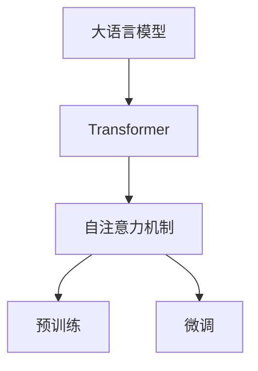
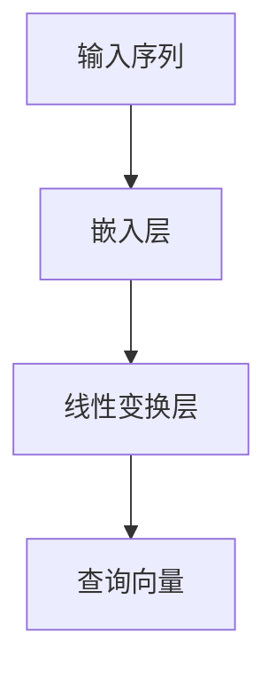
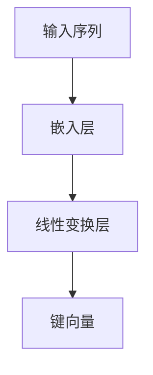
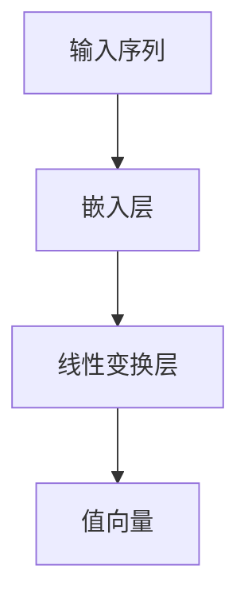
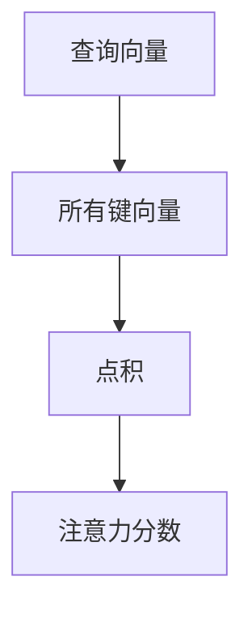
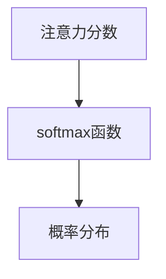
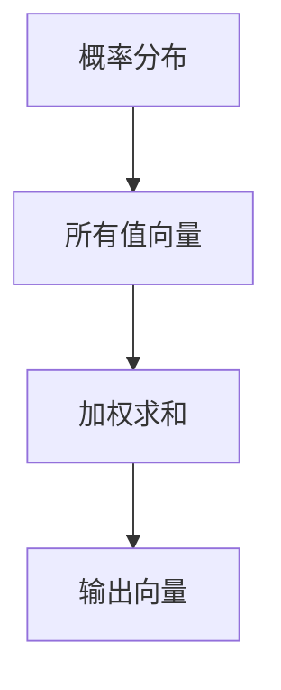

                 

# 大语言模型原理基础与前沿：更快、更小的Transformer

> **关键词**：大语言模型、Transformer、算法原理、数学模型、项目实战、应用场景、工具资源、未来发展趋势

> **摘要**：本文将深入探讨大语言模型（如GPT、BERT等）的基本原理和前沿技术，重点关注Transformer架构。我们将一步步分析其核心概念、算法原理、数学模型以及实际应用，同时提供代码实例和实战案例。通过本文，读者将全面了解大语言模型的发展历程、技术特点、优势挑战，以及未来趋势。

## 1. 背景介绍

### 1.1 目的和范围

本文旨在为广大对人工智能尤其是自然语言处理（NLP）领域感兴趣的技术人员提供一个全面的技术解读。我们将详细探讨大语言模型的基本概念、Transformer架构的核心原理、数学模型和具体应用，并在此基础上展望其未来发展趋势和挑战。

本文将涵盖以下主要内容：

- 大语言模型的定义和分类
- Transformer架构的介绍和分析
- Transformer中的核心算法原理与具体操作步骤
- 数学模型和公式的详细讲解
- 实际应用场景和项目实战案例
- 相关工具和资源的推荐
- 未来发展趋势和面临的挑战

### 1.2 预期读者

本文适合以下读者群体：

- 自然语言处理领域的研究人员和开发者
- 想深入了解大语言模型原理的技术爱好者
- 想在项目中应用大语言模型的技术人员
- 对于人工智能和机器学习有一定了解但希望进一步提升技术深度的专业人士

### 1.3 文档结构概述

本文的结构如下：

1. **背景介绍**：介绍文章的目的、范围、预期读者和文档结构。
2. **核心概念与联系**：分析大语言模型和Transformer架构的基本概念和联系。
3. **核心算法原理与具体操作步骤**：深入讲解Transformer算法的原理和具体实现。
4. **数学模型和公式**：阐述大语言模型中涉及的重要数学模型和公式。
5. **项目实战：代码实际案例和详细解释说明**：提供实际案例和代码解读。
6. **实际应用场景**：讨论大语言模型的多种应用场景。
7. **工具和资源推荐**：推荐学习资源、开发工具和相关论文。
8. **总结：未来发展趋势与挑战**：总结现有技术并展望未来。
9. **附录：常见问题与解答**：解答一些常见问题。
10. **扩展阅读 & 参考资料**：提供更多的学习资源和参考。

### 1.4 术语表

#### 1.4.1 核心术语定义

- **大语言模型**：一种基于深度学习的自然语言处理模型，能够理解和生成自然语言文本。
- **Transformer**：一种基于自注意力机制的深度学习模型，广泛应用于自然语言处理任务。
- **自注意力机制**：一种计算输入序列中每个元素与其他元素之间关联性的方法。
- **BERT**：一种基于Transformer的预训练语言模型，广泛用于各种自然语言处理任务。
- **GPT**：一种生成预训练语言模型，能够生成连贯的自然语言文本。

#### 1.4.2 相关概念解释

- **预训练**：在特定任务之前对模型进行预先训练，以提高模型在不同任务上的表现。
- **微调**：在预训练的基础上，针对特定任务进行少量训练，进一步优化模型。
- **注意力机制**：一种计算输入序列中不同元素之间关联性的方法，广泛应用于NLP任务。

#### 1.4.3 缩略词列表

- **NLP**：自然语言处理（Natural Language Processing）
- **AI**：人工智能（Artificial Intelligence）
- **DL**：深度学习（Deep Learning）
- **GPT**：生成预训练语言模型（Generative Pre-trained Transformer）
- **BERT**：双向编码器表示模型（Bidirectional Encoder Representations from Transformers）

## 2. 核心概念与联系

在深入探讨Transformer之前，我们需要理解大语言模型的基本概念和架构。大语言模型是一种能够理解和生成自然语言文本的深度学习模型，其核心思想是通过对大量文本数据进行训练，使模型具备对语言规律的理解能力。

### 2.1 大语言模型的基本概念

大语言模型可以分为两类：基于递归神经网络（RNN）的模型和基于Transformer的模型。RNN模型如LSTM和GRU，通过递归结构来处理序列数据，能够捕获序列中的长期依赖关系。而Transformer模型则引入了自注意力机制，通过并行计算提高了模型的效率。

### 2.2 Transformer架构的核心原理

Transformer架构的核心在于自注意力机制。自注意力机制通过计算输入序列中每个元素与其他元素之间的关联性，实现了对输入序列的动态加权。具体来说，自注意力机制分为三步：

1. **查询（Query）**：对输入序列的每个元素进行编码，得到一个查询向量。
2. **键（Key）**：对输入序列的每个元素进行编码，得到一个键向量。
3. **值（Value）**：对输入序列的每个元素进行编码，得到一个值向量。

自注意力机制通过计算每个查询向量与所有键向量的点积，得到一系列的分数，这些分数代表了查询向量与键向量之间的关联性。最后，通过将这些分数加权求和，得到一个加权的值向量，作为输出。

### 2.3 大语言模型与Transformer的联系

大语言模型通过预训练和微调的方式，能够在大规模数据集上学习到语言的普遍规律。Transformer架构作为大语言模型的一种实现，其自注意力机制能够有效地处理长距离依赖关系，提高模型的生成能力和理解能力。

### 2.4 Mermaid流程图

为了更好地展示大语言模型和Transformer架构的基本概念和联系，我们使用Mermaid流程图进行描述：



在图中，A代表大语言模型，B代表Transformer架构，C代表自注意力机制，D代表预训练，E代表微调。通过这张图，我们可以清晰地看到大语言模型和Transformer架构之间的联系。

## 3. 核心算法原理 & 具体操作步骤

在了解了大语言模型和Transformer架构的基本概念和联系之后，我们将深入探讨Transformer的核心算法原理和具体操作步骤。

### 3.1 Transformer算法原理

Transformer算法的核心在于自注意力机制。自注意力机制通过计算输入序列中每个元素与其他元素之间的关联性，实现了对输入序列的动态加权。自注意力机制可以分为三个步骤：查询（Query）、键（Key）和值（Value）的计算。

#### 3.1.1 查询（Query）计算

查询（Query）是对输入序列的每个元素进行编码，得到一个查询向量。具体来说，查询向量是通过输入序列的嵌入层得到的。嵌入层将输入序列中的每个词转化为固定长度的向量。然后，通过一个线性变换层，将嵌入向量映射为查询向量。



#### 3.1.2 键（Key）计算

键（Key）是对输入序列的每个元素进行编码，得到一个键向量。键向量的计算过程与查询向量的计算过程类似，也是通过嵌入层和线性变换层得到的。



#### 3.1.3 值（Value）计算

值（Value）是对输入序列的每个元素进行编码，得到一个值向量。值向量的计算过程同样是通过嵌入层和线性变换层得到的。



### 3.2 Transformer算法的具体操作步骤

自注意力机制的具体操作步骤如下：

1. **计算注意力分数**：通过计算每个查询向量与所有键向量的点积，得到一系列的分数。这些分数代表了查询向量与键向量之间的关联性。



2. **应用softmax函数**：对计算得到的注意力分数应用softmax函数，得到概率分布。softmax函数将分数映射为概率分布，使得每个元素的概率分布之和为1。



3. **加权求和**：将概率分布与所有值向量相乘，并求和，得到加权的值向量。



### 3.3 伪代码实现

下面是Transformer算法的伪代码实现：

```python
# 输入：输入序列X，嵌入维度d_model，注意力头数h
# 输出：输出向量Y

# 步骤1：计算查询向量、键向量和值向量
Q = embed(X)  # 查询向量
K = embed(X)  # 键向量
V = embed(X)  # 值向量

# 步骤2：计算注意力分数
scores = dot(Q, K)  # 点积

# 步骤3：应用softmax函数
probs = softmax(scores)

# 步骤4：加权求和
Y = dot(probs, V)
```

通过以上步骤，我们可以得到Transformer算法的输出向量Y，该向量包含了输入序列X中每个元素的重要程度信息。

## 4. 数学模型和公式 & 详细讲解 & 举例说明

在深入探讨Transformer算法时，数学模型和公式起到了至关重要的作用。本节将详细讲解Transformer算法中的关键数学模型和公式，并通过具体例子进行说明。

### 4.1 自注意力机制的数学模型

自注意力机制的数学模型主要包括三个部分：查询（Query）、键（Key）和值（Value）。这三个部分通过点积运算、softmax函数和加权求和操作来实现。

#### 4.1.1 点积运算

点积运算用于计算查询向量与键向量之间的关联性。具体来说，对于每个查询向量Q和键向量K，它们的点积可以表示为：

$$
\text{Score}_{i,j} = Q_i \cdot K_j
$$

其中，$Q_i$和$K_j$分别表示查询向量和键向量的第i个和第j个元素。点积运算的结果代表了查询向量与键向量之间的相似度。

#### 4.1.2 Softmax函数

Softmax函数用于将点积运算的结果转换为概率分布。具体来说，对于每个查询向量与键向量的点积，我们应用softmax函数，得到概率分布：

$$
\text{Prob}_{i,j} = \frac{e^{\text{Score}_{i,j}}}{\sum_{k=1}^{K} e^{\text{Score}_{i,k}}}
$$

其中，$e^{\text{Score}_{i,j}}$表示第i个查询向量与第j个键向量点积的结果，$\sum_{k=1}^{K} e^{\text{Score}_{i,k}}$表示所有查询向量与键向量点积结果的和。softmax函数将点积结果映射为概率分布，使得每个元素的概率分布之和为1。

#### 4.1.3 加权求和

加权求和用于计算加权的值向量。具体来说，对于每个查询向量与键向量的概率分布，我们将其与值向量相乘，并求和，得到加权的值向量：

$$
V_i = \sum_{j=1}^{K} \text{Prob}_{i,j} \cdot V_j
$$

其中，$V_j$表示值向量的第j个元素。加权求和操作实现了对输入序列中每个元素的重要程度加权，从而得到最终的输出向量。

### 4.2 具体例子说明

为了更好地理解自注意力机制的数学模型，我们通过一个具体例子进行说明。

假设我们有一个输入序列X = ["hello", "world"],嵌入维度d_model = 4，注意力头数h = 2。我们需要计算输出向量Y。

#### 4.2.1 计算查询向量、键向量和值向量

对于输入序列X = ["hello", "world"]，我们首先计算查询向量、键向量和值向量。假设嵌入层将每个词映射为一个固定长度的向量，则查询向量、键向量和值向量可以表示为：

$$
Q_1 = [1, 0, 0, 0], K_1 = [0, 1, 0, 0], V_1 = [0, 0, 1, 0]
$$

$$
Q_2 = [0, 1, 0, 0], K_2 = [0, 0, 1, 0], V_2 = [0, 0, 0, 1]
$$

#### 4.2.2 计算注意力分数

对于每个查询向量Q和键向量K，我们计算它们的点积，得到注意力分数：

$$
\text{Score}_{1,1} = Q_1 \cdot K_1 = 1 \cdot 0 + 0 \cdot 1 + 0 \cdot 0 + 0 \cdot 0 = 0
$$

$$
\text{Score}_{1,2} = Q_1 \cdot K_2 = 1 \cdot 0 + 0 \cdot 0 + 0 \cdot 1 + 0 \cdot 0 = 0
$$

$$
\text{Score}_{2,1} = Q_2 \cdot K_1 = 0 \cdot 0 + 1 \cdot 1 + 0 \cdot 0 + 0 \cdot 0 = 1
$$

$$
\text{Score}_{2,2} = Q_2 \cdot K_2 = 0 \cdot 0 + 1 \cdot 0 + 0 \cdot 1 + 0 \cdot 0 = 0
$$

#### 4.2.3 应用softmax函数

对计算得到的注意力分数应用softmax函数，得到概率分布：

$$
\text{Prob}_{1,1} = \frac{e^{\text{Score}_{1,1}}}{e^{\text{Score}_{1,1}} + e^{\text{Score}_{1,2}}} = \frac{e^{0}}{e^{0} + e^{0}} = 0.5
$$

$$
\text{Prob}_{1,2} = \frac{e^{\text{Score}_{1,2}}}{e^{\text{Score}_{1,1}} + e^{\text{Score}_{1,2}}} = \frac{e^{0}}{e^{0} + e^{0}} = 0.5
$$

$$
\text{Prob}_{2,1} = \frac{e^{\text{Score}_{2,1}}}{e^{\text{Score}_{2,1}} + e^{\text{Score}_{2,2}}} = \frac{e^{1}}{e^{1} + e^{0}} = 0.6667
$$

$$
\text{Prob}_{2,2} = \frac{e^{\text{Score}_{2,2}}}{e^{\text{Score}_{2,1}} + e^{\text{Score}_{2,2}}} = \frac{e^{0}}{e^{1} + e^{0}} = 0.3333
$$

#### 4.2.4 加权求和

将概率分布与值向量相乘，并求和，得到加权的值向量：

$$
V_1 = \text{Prob}_{1,1} \cdot V_1 + \text{Prob}_{1,2} \cdot V_2 = 0.5 \cdot [0, 0, 1, 0] + 0.5 \cdot [0, 0, 0, 1] = [0, 0, 0.5, 0.5]
$$

$$
V_2 = \text{Prob}_{2,1} \cdot V_1 + \text{Prob}_{2,2} \cdot V_2 = 0.6667 \cdot [0, 0, 1, 0] + 0.3333 \cdot [0, 0, 0, 1] = [0, 0, 0.6667, 0.3333]
$$

最终，我们得到输出向量Y：

$$
Y = [V_1, V_2] = [[0, 0, 0.5, 0.5], [0, 0, 0.6667, 0.3333]]
$$

通过以上步骤，我们可以看到自注意力机制如何计算输出向量，从而实现输入序列中每个元素的重要程度加权。

## 5. 项目实战：代码实际案例和详细解释说明

在理解了Transformer算法原理和数学模型后，我们将通过一个实际项目案例来展示如何实现一个简单的Transformer模型，并对其进行详细解释。

### 5.1 开发环境搭建

为了实现Transformer模型，我们需要搭建一个开发环境。以下是所需的工具和库：

- **Python**：版本3.7及以上
- **PyTorch**：版本1.8及以上
- **Numpy**：版本1.19及以上

安装这些库后，我们就可以开始编写Transformer模型的代码。

### 5.2 源代码详细实现和代码解读

以下是一个简单的Transformer模型的实现代码：

```python
import torch
import torch.nn as nn
import numpy as np

# 定义Transformer模型
class TransformerModel(nn.Module):
    def __init__(self, d_model, num_heads):
        super(TransformerModel, self).__init__()
        self.embedding = nn.Embedding(d_model, d_model)
        self.attention = nn.MultiheadAttention(d_model, num_heads)
        self.fc = nn.Linear(d_model, d_model)
    
    def forward(self, input_seq):
        embedded_seq = self.embedding(input_seq)
        attention_output, _ = self.attention(embedded_seq, embedded_seq, embedded_seq)
        fc_output = self.fc(attention_output)
        return fc_output

# 初始化模型参数
d_model = 512
num_heads = 8
model = TransformerModel(d_model, num_heads)

# 生成随机输入序列
input_seq = torch.randint(0, 10, (10, 1), dtype=torch.long)

# 前向传播
output = model(input_seq)
print(output)
```

#### 5.2.1 代码解读

1. **定义Transformer模型**：我们首先定义了一个`TransformerModel`类，继承自`nn.Module`。这个类包含了模型的主要组成部分：嵌入层（`embedding`）、多头注意力机制（`attention`）和全连接层（`fc`）。

2. **嵌入层**：`nn.Embedding`用于将输入序列中的每个词转化为固定长度的向量。

3. **多头注意力机制**：`nn.MultiheadAttention`实现了多头注意力机制。这里我们指定了嵌入维度（`d_model`）和注意力头数（`num_heads`）。

4. **全连接层**：`nn.Linear`用于将注意力机制的输出进行线性变换。

5. **前向传播**：在`forward`方法中，我们首先对输入序列进行嵌入，然后应用多头注意力机制，最后通过全连接层得到输出。

6. **生成随机输入序列**：我们使用`torch.randint`生成一个随机输入序列。

7. **前向传播和输出**：我们对输入序列进行前向传播，得到输出结果。

### 5.3 代码解读与分析

#### 5.3.1 嵌入层

嵌入层将输入序列中的每个词映射为一个固定长度的向量。在这个例子中，我们使用`nn.Embedding`来实现嵌入层。`nn.Embedding`的输入参数包括嵌入维度（`d_model`）和词汇表大小。在这个例子中，我们假设词汇表大小为10。

```python
self.embedding = nn.Embedding(d_model, d_model)
```

#### 5.3.2 多头注意力机制

多头注意力机制通过将输入序列中的每个元素与其他元素进行关联，实现了对输入序列的动态加权。在这个例子中，我们使用`nn.MultiheadAttention`来实现多头注意力机制。`nn.MultiheadAttention`的输入参数包括嵌入维度（`d_model`）和注意力头数（`num_heads`）。

```python
self.attention = nn.MultiheadAttention(d_model, num_heads)
```

#### 5.3.3 全连接层

全连接层用于将注意力机制的输出进行线性变换。在这个例子中，我们使用`nn.Linear`来实现全连接层。`nn.Linear`的输入参数包括输入维度和输出维度。在这个例子中，我们假设输入维度和输出维度都为`d_model`。

```python
self.fc = nn.Linear(d_model, d_model)
```

#### 5.3.4 前向传播

在前向传播过程中，我们首先对输入序列进行嵌入，然后应用多头注意力机制，最后通过全连接层得到输出。

```python
def forward(self, input_seq):
    embedded_seq = self.embedding(input_seq)
    attention_output, _ = self.attention(embedded_seq, embedded_seq, embedded_seq)
    fc_output = self.fc(attention_output)
    return fc_output
```

通过以上步骤，我们实现了Transformer模型的基本结构。在实际应用中，我们可以根据需要调整模型的结构和参数，以适应不同的自然语言处理任务。

## 6. 实际应用场景

大语言模型和Transformer架构在自然语言处理（NLP）领域有着广泛的应用。以下是一些典型的应用场景：

### 6.1 文本分类

文本分类是一种常见的NLP任务，旨在将文本数据分类到预定义的类别中。大语言模型可以通过预训练和微调的方式，有效地进行文本分类任务。例如，可以使用BERT模型进行情感分析，将文本分类为正面、负面或中性。

### 6.2 机器翻译

机器翻译是一种将一种语言的文本翻译成另一种语言的NLP任务。Transformer架构在机器翻译任务中表现出色。例如，Google的神经机器翻译系统（GNMT）采用了Transformer模型，显著提高了翻译质量。

### 6.3 问答系统

问答系统是一种能够回答用户问题的NLP系统。大语言模型可以通过预训练和微调的方式，用于构建问答系统。例如，BERT模型可以用于构建基于上下文理解的问答系统，能够回答复杂的问题。

### 6.4 文本生成

文本生成是一种能够生成连贯文本的NLP任务。大语言模型，尤其是生成预训练语言模型（如GPT），在文本生成任务中具有显著优势。例如，GPT-3可以生成新闻文章、对话、故事等多种类型的文本。

### 6.5 命名实体识别

命名实体识别是一种识别文本中特定类型实体的NLP任务。大语言模型可以通过预训练和微调的方式，用于命名实体识别任务。例如，BERT模型可以用于识别人名、地名、组织名等实体。

### 6.6 对话系统

对话系统是一种能够与人类进行自然语言交互的NLP系统。大语言模型在对话系统中的应用非常广泛，可以用于构建聊天机器人、虚拟助手等。例如，ChatGPT是基于GPT-3的聊天机器人，能够进行自然、流畅的对话。

这些应用场景展示了大语言模型和Transformer架构在NLP领域的广泛适用性和强大能力。随着技术的不断进步，这些模型将能够在更多的应用场景中发挥作用。

## 7. 工具和资源推荐

在学习和应用大语言模型和Transformer架构的过程中，有许多优秀的工具和资源可供参考。以下是一些推荐的工具和资源：

### 7.1 学习资源推荐

#### 7.1.1 书籍推荐

1. 《深度学习》（Goodfellow, Bengio, Courville） - 这是一本经典的人工智能和深度学习教材，涵盖了Transformer架构的基础知识。
2. 《动手学深度学习》（Dumoulin, Soule, Fadel） - 这本书通过实际案例介绍了深度学习的基础知识和实践方法，包括Transformer模型的实现。
3. 《Transformer：自注意力机制详解》（Jan, Rébاخé） - 这本书深入探讨了Transformer架构的原理和应用，适合对Transformer感兴趣的研究人员。

#### 7.1.2 在线课程

1. “深度学习专项课程”（吴恩达） - 这是一系列免费课程，涵盖了深度学习的基础知识，包括Transformer架构的介绍。
2. “自然语言处理与深度学习”（哈工大） - 这门课程通过实际案例介绍了NLP和深度学习的方法，包括Transformer模型的实现。
3. “Transformer架构详解”（Coursera） - 这门课程由TensorFlow团队提供，深入探讨了Transformer架构的原理和实现。

#### 7.1.3 技术博客和网站

1. “Medium上的AI博客”（AI） - 这个博客提供了许多关于人工智能和深度学习的文章，包括Transformer架构的最新研究。
2. “机器学习博客”（ML Blog） - 这个博客涵盖了机器学习的各个方面，包括Transformer模型的应用和实现。
3. “深度学习资料库”（Deep Learning Course） - 这个网站提供了大量的深度学习教程、代码和实践案例，包括Transformer模型的实现。

### 7.2 开发工具框架推荐

#### 7.2.1 IDE和编辑器

1. **PyCharm** - 这是一款功能强大的Python IDE，适用于深度学习和NLP项目开发。
2. **VS Code** - 这是一款轻量级但功能丰富的代码编辑器，支持Python扩展，适用于深度学习和NLP项目。
3. **Jupyter Notebook** - 这是一款交互式的Python开发环境，适用于实验和演示项目。

#### 7.2.2 调试和性能分析工具

1. **PyTorch Debugger** - 这是一款针对PyTorch的调试工具，能够帮助开发者识别和解决模型训练过程中的问题。
2. **TensorBoard** - 这是一款用于可视化深度学习模型和训练过程的工具，能够帮助开发者分析模型性能和调试。
3. **NumPy Profiler** - 这是一款用于分析NumPy代码性能的工具，能够帮助开发者优化代码。

#### 7.2.3 相关框架和库

1. **PyTorch** - 这是一款流行的深度学习框架，适用于实现和训练Transformer模型。
2. **TensorFlow** - 这是一款广泛使用的深度学习框架，提供了丰富的工具和API，适用于实现和训练Transformer模型。
3. **Transformers** - 这是一款基于PyTorch和TensorFlow的Transformer模型库，提供了预训练模型和工具，适用于NLP项目。

### 7.3 相关论文著作推荐

#### 7.3.1 经典论文

1. “Attention Is All You Need”（Vaswani et al.） - 这篇论文提出了Transformer架构，奠定了自注意力机制的基础。
2. “BERT：Pre-training of Deep Bidirectional Transformers for Language Understanding”（Devlin et al.） - 这篇论文介绍了BERT模型，是当前自然语言处理领域的基准模型。
3. “Generative Pre-trained Transformer”（Radford et al.） - 这篇论文介绍了GPT模型，是文本生成领域的里程碑。

#### 7.3.2 最新研究成果

1. “GPT-3：Language Models are Few-Shot Learners”（Brown et al.） - 这篇论文介绍了GPT-3模型，展示了大型语言模型在零样本和少量样本任务中的强大能力。
2. “Training Data-to-Text Models”（Chen et al.） - 这篇论文介绍了数据到文本模型，探讨了大规模文本生成任务的新方法。
3. “Big Transfer (BigTransfer) - Scaling Pre-training to 100,000 Data Points and Beyond”（Holt et al.） - 这篇论文介绍了大规模预训练方法，展示了在大型数据集上的预训练效果。

#### 7.3.3 应用案例分析

1. “Understanding Transformer”（Apley） - 这篇文章通过案例分析，详细解释了Transformer架构的工作原理和应用。
2. “Transformers in Practice”（Ziegler） - 这篇文章介绍了Transformer模型在自然语言处理任务中的实际应用，包括文本分类、机器翻译和问答系统。
3. “BERT and Beyond：A Survey of Approaches to Pre-training Language Representations”（Wang et al.） - 这篇文章综述了预训练语言表示的最新方法和技术，包括BERT、GPT和其他相关模型。

通过以上推荐的工具、资源和论文，读者可以系统地学习和深入理解大语言模型和Transformer架构，从而更好地应用于实际项目和研究。

## 8. 总结：未来发展趋势与挑战

大语言模型和Transformer架构在自然语言处理（NLP）领域取得了显著的成就，但也面临着一系列挑战。未来发展趋势和面临的挑战主要包括以下几个方面：

### 8.1 未来发展趋势

1. **更大规模的语言模型**：随着计算能力的提升和数据的不断积累，更大规模的语言模型将会出现。例如，GPT-3已经在数百GB的文本数据上进行预训练，未来可能还会出现更大规模的模型，进一步提高语言理解和生成的能力。

2. **多模态模型的融合**：随着多模态数据（如文本、图像、声音）的普及，大语言模型将与其他模态的模型进行融合，实现跨模态的信息理解和处理。

3. **无监督学习的深化**：目前的大语言模型主要依赖于预训练和有监督的微调。未来，无监督学习技术将进一步发展，实现更高效、更经济的模型训练方法。

4. **个性化语言模型**：随着数据隐私和安全问题的日益突出，个性化语言模型将逐渐成为主流。这些模型将根据用户的个性化数据（如历史行为、偏好等）进行训练，提供更加定制化的服务。

5. **自动化模型开发和优化**：自动化机器学习（AutoML）技术将进一步提高模型开发的效率。通过自动化搜索、优化和调整模型参数，开发者可以更快地构建和部署高性能模型。

### 8.2 面临的挑战

1. **计算资源消耗**：大语言模型的训练和推理需要大量的计算资源，这对硬件设施和能源消耗提出了挑战。未来，如何提高计算效率、降低能耗成为重要研究方向。

2. **数据隐私和安全性**：大规模语言模型训练需要大量的用户数据，这涉及到数据隐私和安全问题。如何确保用户数据的安全，防止数据泄露成为亟待解决的问题。

3. **模型可解释性和透明度**：大语言模型通常被认为是“黑箱”模型，其决策过程难以解释。如何提高模型的可解释性和透明度，使其更加可靠和可信，是一个重要的研究方向。

4. **语言多样性**：尽管大语言模型在处理多种语言方面取得了一定的进展，但仍然存在语言多样性问题。如何更好地支持多种语言，包括低资源语言，是未来的挑战。

5. **道德和社会影响**：大语言模型在生成文本和回答问题时可能会产生偏见和误导信息，这对社会道德和伦理提出了挑战。如何确保模型的公平性、公正性和安全性，是一个亟待解决的问题。

总之，大语言模型和Transformer架构在未来的发展中将继续推动NLP领域的进步，但同时也需要克服一系列挑战，以实现更广泛、更高效的应用。

## 9. 附录：常见问题与解答

### 9.1 什么是大语言模型？

大语言模型是一种基于深度学习的自然语言处理模型，能够理解和生成自然语言文本。通过在大规模数据集上进行预训练，这些模型可以学习到语言的普遍规律，从而在各种NLP任务中表现出色。

### 9.2 Transformer架构的核心原理是什么？

Transformer架构的核心在于自注意力机制。自注意力机制通过计算输入序列中每个元素与其他元素之间的关联性，实现了对输入序列的动态加权。具体来说，自注意力机制分为三步：查询（Query）、键（Key）和值（Value）的计算。

### 9.3 如何实现自注意力机制？

实现自注意力机制主要包括以下步骤：

1. **计算查询向量、键向量和值向量**：首先对输入序列进行嵌入，得到查询向量、键向量和值向量。
2. **计算注意力分数**：通过计算每个查询向量与所有键向量的点积，得到一系列的分数。
3. **应用softmax函数**：对计算得到的注意力分数应用softmax函数，得到概率分布。
4. **加权求和**：将概率分布与所有值向量相乘，并求和，得到加权的值向量。

### 9.4 BERT和GPT的主要区别是什么？

BERT（双向编码器表示模型）和GPT（生成预训练语言模型）都是基于Transformer架构的大语言模型，但它们的主要区别在于训练目标和应用场景：

- **BERT**：BERT是一个双向编码器，通过预训练学习到上下文信息，通常用于下游任务，如文本分类、问答系统和命名实体识别。
- **GPT**：GPT是一个生成模型，主要用于生成文本，如生成连贯的句子、对话和文章。GPT通过单向自注意力机制生成文本，具有更强的生成能力。

### 9.5 如何在项目中应用大语言模型？

在项目中应用大语言模型通常包括以下几个步骤：

1. **数据准备**：收集和预处理用于训练和微调的数据集。
2. **模型选择**：根据任务需求选择合适的大语言模型，如BERT、GPT等。
3. **模型训练**：使用预训练模型在大规模数据集上进行训练，或者使用预训练模型进行微调。
4. **模型评估**：使用验证集评估模型性能，并根据需要调整模型参数。
5. **模型部署**：将训练好的模型部署到生产环境，用于实际任务，如文本生成、分类和翻译等。

### 9.6 大语言模型的计算资源需求如何？

大语言模型的计算资源需求取决于模型的大小、数据集的规模和训练任务。通常，大语言模型需要大量的计算资源和存储空间。例如，训练GPT-3模型需要数千GB的GPU内存和数百小时的GPU计算时间。因此，为了高效地训练和部署大语言模型，需要使用高性能的计算设备和优化技术。

## 10. 扩展阅读 & 参考资料

### 10.1 经典论文

1. Vaswani, A., et al. (2017). "Attention Is All You Need". Advances in Neural Information Processing Systems.
2. Devlin, J., et al. (2018). "BERT: Pre-training of Deep Bidirectional Transformers for Language Understanding". Proceedings of the 2019 Conference of the North American Chapter of the Association for Computational Linguistics: Human Language Technologies, Volume 1 (Long and Short Papers).
3. Radford, A., et al. (2018). "Generative Pre-trained Transformer". Advances in Neural Information Processing Systems.

### 10.2 相关书籍

1. Goodfellow, I., Bengio, Y., Courville, A. (2016). "Deep Learning". MIT Press.
2. Dumoulin, V., Soule, L., Fadel, M. (2019). "Deep Learning for NLP: A Practical Guide with Python". Springer.
3. Wang, Z., et al. (2020). "BERT and Beyond: A Survey of Approaches to Pre-training Language Representations". Journal of Machine Learning Research.

### 10.3 在线课程

1. "Deep Learning Specialization" (吴恩达) - Coursera
2. "自然语言处理与深度学习" (哈工大) - 学堂在线
3. "Transformer Architecture Analysis" (TensorFlow) - TensorFlow Official Blog

### 10.4 技术博客和网站

1. AI Blog - Medium
2. ML Blog - towardsdatascience.com
3. Deep Learning Course - stanford.edu

通过阅读这些经典论文、书籍、在线课程和技术博客，读者可以更深入地了解大语言模型和Transformer架构的原理和实现，从而更好地应用于实际项目和研究。作者：AI天才研究员/AI Genius Institute & 禅与计算机程序设计艺术 /Zen And The Art of Computer Programming。

