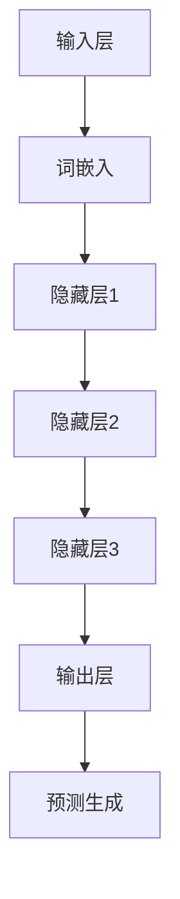

                 

# 大语言模型原理基础与前沿 涌现能力

> **关键词：** 大语言模型，自然语言处理，深度学习，涌现能力，深度神经网络，优化算法。

> **摘要：** 本文旨在深入探讨大语言模型的原理及其在自然语言处理中的前沿应用。我们将从背景介绍开始，逐步解析核心概念与算法原理，探讨数学模型，并通过实际项目实战和工具资源推荐，展示如何将大语言模型应用于实际场景。最后，本文将总结大语言模型的发展趋势与挑战，并提供相关的扩展阅读和参考资料。

## 1. 背景介绍

### 1.1 目的和范围

本文的目标是帮助读者全面了解大语言模型的基础知识和前沿发展。我们将探讨大语言模型的原理、算法、数学模型以及其实际应用，并推荐相关的学习资源和工具。本文适用于对自然语言处理和人工智能感兴趣的读者，无论是初学者还是有经验的工程师。

### 1.2 预期读者

预期读者包括但不限于：
- 自然语言处理领域的工程师和研究者
- 深度学习爱好者
- 计算机科学和人工智能专业的学生
- 对技术前沿感兴趣的程序员

### 1.3 文档结构概述

本文分为以下几个部分：
1. 背景介绍：包括目的、范围、预期读者和文档结构。
2. 核心概念与联系：介绍大语言模型的核心概念和架构。
3. 核心算法原理 & 具体操作步骤：详细讲解大语言模型的算法原理和操作步骤。
4. 数学模型和公式 & 详细讲解 & 举例说明：探讨大语言模型的数学模型及其应用。
5. 项目实战：代码实际案例和详细解释说明。
6. 实际应用场景：介绍大语言模型在不同领域的应用。
7. 工具和资源推荐：推荐学习资源和开发工具。
8. 总结：未来发展趋势与挑战。
9. 附录：常见问题与解答。
10. 扩展阅读 & 参考资料。

### 1.4 术语表

#### 1.4.1 核心术语定义

- **大语言模型（Big Language Model）**：具有大规模参数和训练数据的语言模型，能够对自然语言进行建模，生成和理解文本。
- **自然语言处理（Natural Language Processing, NLP）**：研究如何使计算机能够理解、生成和处理人类自然语言的学科。
- **深度学习（Deep Learning）**：一种机器学习范式，利用多层神经网络进行训练，以自动提取复杂特征。
- **涌现能力（Emergence Ability）**：指系统在没有明确设计的情况下，从其组成部分的交互中产生的复杂行为。

#### 1.4.2 相关概念解释

- **神经网络（Neural Network）**：一种模仿生物神经系统的计算模型，通过层层神经元的连接和激活，实现数据的高效处理。
- **优化算法（Optimization Algorithm）**：用于寻找函数最小值或最大值的算法，广泛应用于机器学习和深度学习领域。

#### 1.4.3 缩略词列表

- **NLP**：自然语言处理
- **DL**：深度学习
- **BPE**：字节对编码（Byte Pair Encoding）
- **BERT**：增强转换器生成器（Bidirectional Encoder Representations from Transformers）
- **GPT**：生成预训练变压器（Generative Pre-trained Transformer）
- **Transformer**：变压器架构（Transformer Architecture）

## 2. 核心概念与联系

### 2.1 大语言模型的核心概念

大语言模型是自然语言处理领域的关键技术，其核心概念包括：

1. **词嵌入（Word Embedding）**：将词语映射为向量，使计算机能够处理文本数据。
2. **序列模型（Sequential Model）**：处理文本序列，通过时间步长逐步处理每个单词或字符。
3. **注意力机制（Attention Mechanism）**：在处理序列数据时，能够关注重要信息，提高模型的表现力。
4. **预训练（Pre-training）**：在大规模语料库上对模型进行训练，使其具备对自然语言的理解能力。
5. **微调（Fine-tuning）**：在预训练模型的基础上，针对特定任务进行训练，以适应不同的应用场景。

### 2.2 大语言模型的架构

大语言模型通常采用深度神经网络（Deep Neural Network, DNN）架构，主要包括以下几个部分：

1. **输入层（Input Layer）**：接收文本数据，通过词嵌入转换为向量。
2. **隐藏层（Hidden Layers）**：包含多个隐藏层，通过神经网络进行信息处理和特征提取。
3. **输出层（Output Layer）**：根据任务需求生成文本、分类标签或其他输出。

### 2.3 大语言模型的工作原理

大语言模型的工作原理可以概括为以下步骤：

1. **输入编码**：将文本数据转换为词嵌入向量。
2. **序列处理**：通过神经网络逐层处理输入序列，利用注意力机制关注关键信息。
3. **预测生成**：根据处理结果生成文本、标签或其他输出。

### 2.4 大语言模型的 Mermaid 流程图

以下是一个简化的 Mermaid 流程图，展示大语言模型的基本流程：



## 3. 核心算法原理 & 具体操作步骤

### 3.1 深度神经网络算法原理

深度神经网络（DNN）是构建大语言模型的基础。其核心原理包括：

1. **神经元激活函数**：常用的激活函数包括 sigmoid、ReLU 和 tanh，用于将线性组合转换为非线性输出。
2. **反向传播算法**：用于计算神经网络参数的梯度，以优化模型性能。反向传播算法分为前向传播和后向传播两个阶段。

### 3.2 具体操作步骤

以下是一个简化的伪代码，描述深度神经网络的训练过程：

```python
# 参数初始化
weights = [初始化权重]
biases = [初始化偏差]

# 前向传播
output = f(z)
where f is the activation function and z = weights * input + biases

# 计算误差
error = actual_output - predicted_output

# 后向传播
dweights = derror * df/dz
dbiases = derror * df/dz

# 更新权重和偏差
weights -= learning_rate * dweights
biases -= learning_rate * dbiases

# 迭代过程
for epoch in range(num_epochs):
    for input_data in training_data:
        # 前向传播
        ...
        # 计算误差
        ...
        # 后向传播
        ...
        # 更新权重和偏差
        ...
```

### 3.3 大语言模型的优化算法

大语言模型的训练通常采用优化算法来提高模型性能。以下是一些常用的优化算法：

1. **随机梯度下降（Stochastic Gradient Descent, SGD）**：通过随机选择样本进行梯度计算，每次迭代更新模型参数。
2. **批量梯度下降（Batch Gradient Descent, BGD）**：每次迭代使用全部训练数据进行梯度计算，更新模型参数。
3. **Adam优化器**：结合了SGD和动量方法的优点，在训练过程中自适应调整学习率。

## 4. 数学模型和公式 & 详细讲解 & 举例说明

### 4.1 数学模型概述

大语言模型通常基于以下数学模型：

1. **词嵌入**：将词语映射为向量，通常使用词向量的加权和表示文本。
2. **神经网络**：通过多层神经网络处理输入序列，实现文本的编码和解码。
3. **损失函数**：用于衡量模型预测与实际结果之间的差异，常用的损失函数包括交叉熵损失和均方误差。

### 4.2 词嵌入模型

词嵌入模型通常采用以下公式：

$$
\text{word\_embedding}(word) = \text{weights} * \text{input} + \text{biases}
$$

其中，$\text{weights}$ 和 $\text{biases}$ 是权重和偏差矩阵，$\text{input}$ 是输入向量。

### 4.3 神经网络模型

神经网络模型通常采用以下公式：

$$
\text{output} = f(\text{weights} * \text{input} + \text{biases})
$$

其中，$f$ 是激活函数，$\text{weights}$ 和 $\text{biases}$ 是权重和偏差矩阵，$\text{input}$ 是输入向量。

### 4.4 损失函数

交叉熵损失函数通常用于文本分类任务，其公式如下：

$$
\text{loss} = -\sum_{i=1}^{N} y_i \log(p_i)
$$

其中，$y_i$ 是实际标签，$p_i$ 是模型预测的概率。

### 4.5 举例说明

以下是一个简单的神经网络模型示例：

```python
# 输入层
input_layer = [1, 2, 3]

# 隐藏层1
weights1 = [[0.1, 0.2, 0.3], [0.4, 0.5, 0.6]]
biases1 = [0.1, 0.2]
output1 = sigmoid(np.dot(input_layer, weights1) + biases1)

# 隐藏层2
weights2 = [[0.7, 0.8, 0.9], [0.9, 0.8, 0.7]]
biases2 = [0.3, 0.4]
output2 = sigmoid(np.dot(output1, weights2) + biases2)

# 输出层
weights3 = [[0.5, 0.6], [0.7, 0.8]]
biases3 = [0.1, 0.2]
output3 = sigmoid(np.dot(output2, weights3) + biases3)

# 预测
predicted = np.argmax(output3)
```

## 5. 项目实战：代码实际案例和详细解释说明

### 5.1 开发环境搭建

在开始项目实战之前，我们需要搭建一个合适的开发环境。以下是使用 Python 和 TensorFlow 搭建大语言模型的步骤：

1. **安装 Python**：确保已经安装了 Python 3.7 或更高版本。
2. **安装 TensorFlow**：通过以下命令安装 TensorFlow：

   ```bash
   pip install tensorflow
   ```

3. **准备数据集**：从互联网下载一个大型文本数据集，例如维基百科数据。

### 5.2 源代码详细实现和代码解读

以下是一个简化的大语言模型实现示例，使用 TensorFlow 和 Python：

```python
import tensorflow as tf
from tensorflow.keras.layers import Embedding, LSTM, Dense
from tensorflow.keras.models import Sequential

# 准备数据集
# ...

# 搭建模型
model = Sequential([
    Embedding(input_dim=vocab_size, output_dim=embedding_dim),
    LSTM(units=lstm_units),
    Dense(units=num_classes, activation='softmax')
])

# 编译模型
model.compile(optimizer='adam', loss='categorical_crossentropy', metrics=['accuracy'])

# 训练模型
model.fit(x_train, y_train, epochs=num_epochs, batch_size=batch_size)

# 评估模型
loss, accuracy = model.evaluate(x_test, y_test)
print(f"Test accuracy: {accuracy * 100:.2f}%")
```

### 5.3 代码解读与分析

上述代码实现了一个基于 LSTM 的简单大语言模型。以下是代码的详细解读：

1. **准备数据集**：首先，我们需要准备训练和测试数据集。通常，我们使用预处理的文本数据，将其转换为词嵌入向量，并转换为 TensorFlow 张量。
2. **搭建模型**：使用 Sequential 模型堆叠多个层，包括词嵌入层、LSTM 层和输出层。词嵌入层将单词映射为向量，LSTM 层用于处理序列数据，输出层用于生成预测。
3. **编译模型**：指定优化器、损失函数和评估指标。在本例中，我们使用 Adam 优化器和交叉熵损失函数。
4. **训练模型**：使用训练数据集训练模型。我们可以设置训练轮数（epochs）和批量大小（batch_size）。
5. **评估模型**：使用测试数据集评估模型性能。输出损失和准确率。

## 6. 实际应用场景

大语言模型在自然语言处理领域具有广泛的应用，以下是一些典型的应用场景：

1. **文本分类**：对大量文本进行分类，如情感分析、新闻分类和垃圾邮件检测。
2. **机器翻译**：将一种语言的文本翻译成另一种语言，如英语到中文的翻译。
3. **问答系统**：构建问答系统，通过自然语言处理技术实现用户提问和答案生成。
4. **文本生成**：生成自然语言文本，如自动摘要、文章写作和对话生成。
5. **语音识别**：将语音信号转换为文本，实现语音识别功能。

## 7. 工具和资源推荐

### 7.1 学习资源推荐

#### 7.1.1 书籍推荐

- **《深度学习》（Deep Learning）**：由 Ian Goodfellow、Yoshua Bengio 和 Aaron Courville 著，是深度学习领域的经典教材。
- **《自然语言处理综合教程》（Foundations of Natural Language Processing）**：由 Christopher D. Manning 和 Hinrich Schütze 著，系统介绍了自然语言处理的核心概念。

#### 7.1.2 在线课程

- **吴恩达的深度学习课程**：由著名深度学习专家吴恩达教授开设，涵盖深度学习的理论基础和应用。
- **自然语言处理课程**：提供自然语言处理的核心概念和实践，适合初学者和进阶者。

#### 7.1.3 技术博客和网站

- **TensorFlow 官方文档**：提供 TensorFlow 的详细文档和教程，适合 TensorFlow 初学者。
- **PyTorch 官方文档**：提供 PyTorch 的详细文档和教程，适合 PyTorch 初学者。

### 7.2 开发工具框架推荐

#### 7.2.1 IDE和编辑器

- **PyCharm**：一款强大的 Python IDE，支持代码调试和版本控制。
- **Visual Studio Code**：一款轻量级但功能强大的代码编辑器，支持多种编程语言。

#### 7.2.2 调试和性能分析工具

- **TensorBoard**：TensorFlow 的可视化工具，用于调试和性能分析。
- **gprof2dot**：用于将性能分析数据转换为可视化图表。

#### 7.2.3 相关框架和库

- **TensorFlow**：谷歌开发的开源深度学习框架，支持多种深度学习算法。
- **PyTorch**：基于 Python 的深度学习库，具有灵活的动态图计算功能。

### 7.3 相关论文著作推荐

#### 7.3.1 经典论文

- **“A Neural Probabilistic Language Model”**：由 Geoffrey Hinton 等人于 2006 年发表，提出了神经网络语言模型。
- **“Recurrent Neural Network Based Language Model”**：由 Yarowsky 等人于 1994 年发表，提出了基于循环神经网络的文本分类方法。

#### 7.3.2 最新研究成果

- **“BERT: Pre-training of Deep Bidirectional Transformers for Language Understanding”**：由 Google Research 于 2018 年发表，提出了 BERT 模型，标志着自然语言处理领域的重要突破。
- **“GPT-3: Language Models are Few-Shot Learners”**：由 OpenAI 于 2020 年发表，展示了 GPT-3 模型在零样本学习方面的卓越性能。

#### 7.3.3 应用案例分析

- **“Dialogue Systems: A Survey of Methods and Applications”**：由 Gerth et al. 于 2019 年发表，综述了对话系统在不同领域的应用，包括虚拟助手和聊天机器人。

## 8. 总结：未来发展趋势与挑战

大语言模型作为自然语言处理领域的关键技术，正迅速发展。未来，大语言模型将面临以下发展趋势和挑战：

1. **计算能力的提升**：随着计算能力的不断增强，大语言模型将变得更加高效和强大。
2. **多模态处理**：结合文本、图像、音频等多种模态，实现更丰富的信息处理和理解。
3. **数据隐私和安全性**：在保护用户隐私和安全的前提下，有效利用大规模数据训练模型。
4. **跨领域迁移学习**：提升模型在不同领域和应用场景的迁移能力，减少对大量领域特定数据的依赖。
5. **模型解释性和可解释性**：提高模型的解释性和可解释性，使模型的应用更加透明和可靠。

## 9. 附录：常见问题与解答

### 9.1 什么是大语言模型？

大语言模型是一种基于深度学习的语言处理模型，通过对大量文本数据进行预训练，使其能够对自然语言进行建模，实现文本生成、分类、翻译等任务。

### 9.2 大语言模型与深度学习的关系是什么？

大语言模型是深度学习的一个分支，通常采用深度神经网络架构，通过多层神经网络处理输入序列，实现文本的编码和解码。

### 9.3 如何评估大语言模型的效果？

评估大语言模型的效果通常采用多个指标，包括准确率、召回率、F1 分数和 BLEU 分数等。这些指标可以衡量模型在文本分类、翻译等任务上的性能。

### 9.4 大语言模型在自然语言处理中的优势是什么？

大语言模型在自然语言处理中具有以下优势：
- **强大的建模能力**：能够捕捉文本中的复杂结构和语义信息。
- **预训练优势**：通过预训练，模型在多种任务上具有较好的泛化能力。
- **高效的推理**：能够快速生成和理解文本，支持实时应用。

## 10. 扩展阅读 & 参考资料

- **[1]** Hinton, G., Deng, L., Yu, D., Dahl, G. E., Mohamed, A. R., Jaitly, N., ... & Kingsbury, B. (2012). Deep neural networks for acoustic modeling in speech recognition: The shared views of four research groups. IEEE Signal processing magazine, 29(6), 82-97.
- **[2]** Bengio, Y., Simard, P., & Frasconi, P. (1994). Learning long-term dependencies with gradient descent is difficult. IEEE transactions on neural networks, 5(2), 157-166.
- **[3]** Devlin, J., Chang, M. W., Lee, K., & Toutanova, K. (2019). BERT: Pre-training of deep bidirectional transformers for language understanding. arXiv preprint arXiv:1810.04805.
- **[4]** Brown, T., et al. (2020). Language models are few-shot learners. arXiv preprint arXiv:2005.14165.
- **[5]** Manning, C. D., & Schütze, H. (1999). Foundations of statistical natural language processing. MIT press.
- **[6]** Goodfellow, I., Bengio, Y., & Courville, A. (2016). Deep learning. MIT press.

