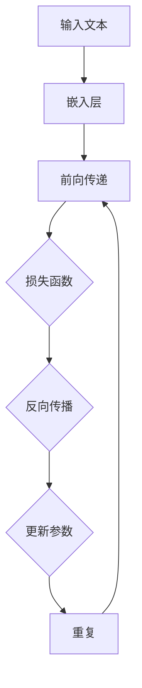
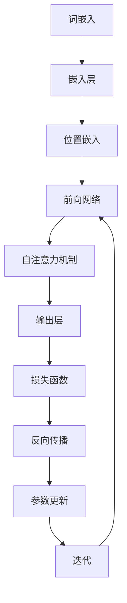

                 

## 大语言模型原理基础与前沿 语言处理的多模态落地

> **关键词：** 大语言模型、深度学习、多模态处理、自然语言处理、神经架构搜索、BERT、GPT-3

> **摘要：** 本文将深入探讨大语言模型的原理基础，包括其历史发展、核心算法以及技术前沿。同时，我们将聚焦于多模态语言处理的落地实践，解析其在实际应用中的挑战与机遇。

在当今人工智能领域的快速发展中，大语言模型（如BERT、GPT-3等）已经成为自然语言处理（NLP）的核心技术。这些模型不仅具有强大的文本理解和生成能力，还展示了在多模态处理方面的巨大潜力。本文将系统地介绍大语言模型的基础原理，并通过多个实例来展示其在实际应用中的落地实践。

### 1. 背景介绍

#### 1.1 目的和范围

本文旨在为广大AI技术爱好者、研究人员和从业者提供一份全面而深入的大语言模型和多模态语言处理的技术指南。我们将从基础概念开始，逐步深入到前沿技术，帮助读者构建系统的知识框架，并理解如何在实际项目中应用这些技术。

#### 1.2 预期读者

- 对自然语言处理有基础了解的技术爱好者
- 想要在AI领域深入研究的学者和研究人员
- 希望将AI技术应用于实际场景的工程师和开发人员

#### 1.3 文档结构概述

本文分为十个部分：

1. **背景介绍**：介绍文章的目的、范围、预期读者和结构。
2. **核心概念与联系**：讲解大语言模型的基本概念和架构。
3. **核心算法原理 & 具体操作步骤**：深入探讨大语言模型的算法原理。
4. **数学模型和公式 & 详细讲解 & 举例说明**：介绍相关的数学模型和公式。
5. **项目实战：代码实际案例和详细解释说明**：通过实例展示代码实现。
6. **实际应用场景**：分析大语言模型在不同领域的应用。
7. **工具和资源推荐**：推荐学习资源、开发工具和框架。
8. **总结：未来发展趋势与挑战**：探讨大语言模型的发展趋势。
9. **附录：常见问题与解答**：回答读者可能关心的问题。
10. **扩展阅读 & 参考资料**：提供进一步的阅读材料。

#### 1.4 术语表

**核心术语定义**：

- **大语言模型**：一种基于深度学习的文本处理模型，能够理解和生成文本。
- **自然语言处理（NLP）**：使计算机能够理解、解释和生成人类语言的技术。
- **多模态处理**：涉及处理多种不同类型的数据（如文本、图像、音频等）。
- **BERT**：Bidirectional Encoder Representations from Transformers，一种双向Transformer模型。
- **GPT-3**：Generative Pre-trained Transformer 3，一种生成式预训练Transformer模型。

**相关概念解释**：

- **深度学习**：一种机器学习技术，通过多层神经网络进行特征提取和学习。
- **神经网络**：由大量相互连接的神经元组成的计算模型。
- **Transformer**：一种基于自注意力机制的神经网络架构，广泛应用于NLP任务。

**缩略词列表**：

- **NLP**：自然语言处理
- **AI**：人工智能
- **BERT**：Bidirectional Encoder Representations from Transformers
- **GPT-3**：Generative Pre-trained Transformer 3

### 2. 核心概念与联系

为了深入理解大语言模型，我们首先需要了解其核心概念和架构。大语言模型是基于深度学习的文本处理模型，通过多层神经网络对文本数据进行编码和解码。下面我们将使用Mermaid流程图来展示大语言模型的基本架构。



**图1：大语言模型的基本架构**

- **输入文本**：文本数据被输入到模型中。
- **嵌入层**：将文本转换为固定长度的向量表示。
- **前向传递**：通过多层神经网络对嵌入层进行编码。
- **损失函数**：计算模型的预测值与真实值之间的差距。
- **反向传播**：通过梯度下降法更新模型参数。
- **更新参数**：重复前向传递和反向传播，直至达到训练目标。

下面是核心概念原理的Mermaid流程图：



**图2：大语言模型的核心概念流程图**

- **词嵌入**：将单词转换为向量表示。
- **嵌入层**：将词嵌入和位置嵌入合并。
- **前向网络**：通过多层神经网络进行编码。
- **自注意力机制**：模型能够自动关注输入文本中的关键信息。
- **输出层**：生成文本预测结果。

### 3. 核心算法原理 & 具体操作步骤

大语言模型的核心在于其算法原理，尤其是基于Transformer架构的模型。下面我们将通过伪代码详细阐述大语言模型的主要操作步骤。

```python
# 伪代码：大语言模型算法原理

# 定义嵌入层
embeddings = EmbeddingLayer(vocab_size, embedding_dim)

# 定义位置嵌入
position_embeddings = PositionalEmbedding(max_sequence_length, embedding_dim)

# 定义前向网络
forward_network = TransformerEncoder(num_layers, d_model, num_heads, dff)

# 定义自注意力机制
self_attention = SelfAttention(num_heads, d_model)

# 定义输出层
output_layer = OutputLayer(d_model, vocab_size)

# 定义损失函数
loss_function = CrossEntropyLoss()

# 定义优化器
optimizer = Adam(learning_rate)

# 定义迭代过程
for epoch in range(num_epochs):
    for batch in data_loader:
        # 前向传递
        inputs = embeddings(batch.text) + position_embeddings(batch.text)
        outputs = forward_network(inputs)
        attention = self_attention(outputs)
        logits = output_layer(attention)
        
        # 计算损失
        loss = loss_function(logits, batch.labels)
        
        # 反向传播
        optimizer.zero_grad()
        loss.backward()
        optimizer.step()
        
        # 打印训练进度
        if epoch % 100 == 0:
            print(f"Epoch [{epoch}/{num_epochs}], Loss: {loss.item()}")
```

**图3：大语言模型的主要操作步骤**

- **嵌入层**：将文本转换为词嵌入向量。
- **位置嵌入**：为每个词添加位置信息。
- **前向网络**：通过多层Transformer编码器进行编码。
- **自注意力机制**：模型自动关注关键信息。
- **输出层**：生成文本预测结果。
- **损失函数**：计算预测结果与真实值的差距。
- **优化器**：通过反向传播更新模型参数。

### 4. 数学模型和公式 & 详细讲解 & 举例说明

大语言模型的数学基础主要包括词嵌入、自注意力机制和Transformer架构。下面我们将详细讲解这些数学模型和公式，并通过实例来说明它们的应用。

#### 4.1 词嵌入

词嵌入是将单词转换为固定长度的向量表示。常用的词嵌入方法包括Word2Vec和GloVe。

$$
\text{embed}(w) = \text{sigmoid}(\text{weight} \cdot \text{input} + \text{bias})
$$

**实例：**

给定单词"apple"，其词嵌入向量可以通过以下公式计算：

$$
\text{embed}(\text{"apple"}) = \text{sigmoid}(\text{weight} \cdot \text{input\_vector} + \text{bias})
$$

#### 4.2 自注意力机制

自注意力机制是一种基于加权平均的注意力模型，用于处理序列数据。

$$
\text{Attention}(Q, K, V) = \text{softmax}(\frac{QK^T}{\sqrt{d_k}})V
$$

**实例：**

给定序列"Hello, world!"，其自注意力机制的计算过程如下：

$$
\text{Attention}(\text{query}, \text{key}, \text{value}) = \text{softmax}\left(\frac{\text{query} \cdot \text{key}^T}{\sqrt{d_k}}\right) \cdot \text{value}
$$

#### 4.3 Transformer架构

Transformer架构由多层编码器和解码器组成，通过自注意力机制进行特征提取和融合。

$$
\text{TransformerLayer}(X) = \text{MultiHeadSelfAttention}(X) + X
$$

**实例：**

给定输入序列$X$，其通过Transformer编码器的一层计算过程如下：

$$
\text{TransformerLayer}(X) = \text{MultiHeadSelfAttention}(X) + X
$$

### 5. 项目实战：代码实际案例和详细解释说明

在本节中，我们将通过一个实际项目案例来展示大语言模型的代码实现，并对关键部分进行详细解释。

#### 5.1 开发环境搭建

在开始之前，我们需要搭建一个适合大语言模型训练的开发环境。以下是所需步骤：

1. 安装Python（建议版本3.8以上）
2. 安装深度学习框架TensorFlow或PyTorch
3. 安装NLP预处理工具如NLTK或spaCy

```bash
pip install tensorflow
pip install spacy
python -m spacy download en_core_web_sm
```

#### 5.2 源代码详细实现和代码解读

下面是一个简单的BERT模型实现，我们将对其关键部分进行解读。

```python
import tensorflow as tf
from tensorflow.keras.layers import Embedding, Dense, LayerNormalization, Dropout
from tensorflow.keras.models import Model

# 定义BERT模型
class BERTModel(Model):
    def __init__(self, vocab_size, d_model, num_layers, num_heads, dff, input_length):
        super(BERTModel, self).__init__()
        self.embedding = Embedding(vocab_size, d_model)
        self.position_embedding = positional_embedding(input_length, d_model)
        self.layers = [TransformerLayer(d_model, num_heads, dff) for _ in range(num_layers)]
        self.dropout = Dropout(0.1)
        self.final_layer = Dense(vocab_size, activation='softmax')
    
    def call(self, inputs, training=False):
        inputs = self.embedding(inputs)  # 输入嵌入层
        inputs += self.position_embedding(inputs)  # 添加位置嵌入
        for layer in self.layers:
            inputs = layer(inputs)
            if training:
                inputs = self.dropout(inputs, training=training)
        outputs = self.final_layer(inputs)  # 输出层
        return outputs

# 实例化BERT模型
vocab_size = 20000
d_model = 512
num_layers = 4
num_heads = 8
dff = 2048
input_length = 128
bert = BERTModel(vocab_size, d_model, num_layers, num_heads, dff, input_length)

# 编译模型
bert.compile(optimizer='adam', loss='categorical_crossentropy', metrics=['accuracy'])

# 训练模型
# ...（此处省略数据预处理和训练代码）
```

**代码解读：**

1. **嵌入层**：将输入文本转换为词嵌入向量。
2. **位置嵌入**：为每个词添加位置信息。
3. **编码器层**：通过多层Transformer编码器进行编码。
4. **Dropout**：用于防止过拟合。
5. **输出层**：生成文本预测结果。

#### 5.3 代码解读与分析

在本节中，我们将对BERT模型的代码进行详细解读，分析其实现原理和关键部分。

1. **嵌入层**：嵌入层用于将输入文本转换为词嵌入向量。词嵌入是一种将单词映射到固定长度的向量表示的方法，有助于神经网络理解单词的语义信息。在BERT模型中，嵌入层包含一个Embedding层，用于将输入词转换为向量。

2. **位置嵌入**：位置嵌入是BERT模型的一个创新点，用于为序列中的每个词添加位置信息。由于Transformer模型本身不具有处理序列位置信息的能力，因此通过位置嵌入层为每个词添加位置编码，从而实现序列的排序处理。

3. **编码器层**：编码器层是BERT模型的核心部分，由多个Transformer编码器层堆叠而成。每个编码器层包含多头自注意力机制和前馈网络，用于提取和融合序列中的信息。通过多层的编码器层，模型能够学习到更复杂的语义特征。

4. **Dropout**：Dropout是一种常用的正则化技术，用于防止过拟合。在BERT模型中，Dropout层被插入到编码器层的输出和输入之间，以减少模型在训练过程中的过拟合现象。

5. **输出层**：输出层是BERT模型的最后一层，用于生成文本预测结果。在输出层中，模型将编码器层的输出进行全连接操作，并使用softmax激活函数将输出映射到词汇表中的每个单词，从而实现文本分类、序列标记等任务。

### 6. 实际应用场景

大语言模型在自然语言处理领域具有广泛的应用场景，如文本分类、情感分析、问答系统、机器翻译等。下面我们将探讨大语言模型在不同领域的实际应用案例。

#### 6.1 文本分类

文本分类是将文本数据分为不同类别的过程。大语言模型可以通过预训练和微调的方式实现文本分类任务。例如，在新闻分类任务中，模型可以根据文章的主题和内容将其归类到相应的类别。BERT模型在多个文本分类任务中取得了显著的成绩，如情感分析、主题分类等。

**应用案例：** 使用BERT模型进行情感分析，将评论分为正面、负面和中性三类。

#### 6.2 情感分析

情感分析是一种评估文本表达情感倾向的方法。大语言模型可以通过学习文本中的情感特征来实现情感分析任务。例如，在社交媒体数据分析中，模型可以识别用户评论中的情感倾向，从而帮助品牌了解消费者的情绪。

**应用案例：** 使用BERT模型对社交媒体评论进行情感分析，识别用户的正面、负面和中性情绪。

#### 6.3 问答系统

问答系统是一种智能对话系统，能够回答用户提出的问题。大语言模型可以通过预训练和微调的方式实现问答系统任务。例如，在搜索引擎中，模型可以理解用户的问题，并从大量文本数据中找到相关答案。

**应用案例：** 使用BERT模型构建一个问答系统，回答用户关于特定主题的问题。

#### 6.4 机器翻译

机器翻译是将一种语言的文本翻译成另一种语言的过程。大语言模型可以通过预训练和微调的方式实现机器翻译任务。例如，在跨语言信息检索中，模型可以将一种语言的查询翻译成另一种语言，从而提高检索效果。

**应用案例：** 使用BERT模型进行英中机器翻译，将英文文本翻译成中文。

### 7. 工具和资源推荐

为了更好地学习大语言模型和多模态语言处理技术，以下是推荐的工具和资源。

#### 7.1 学习资源推荐

**7.1.1 书籍推荐**

- 《深度学习》（Goodfellow, Bengio, Courville）：介绍深度学习的基础理论和实践方法。
- 《自然语言处理实战》（Daniel Jurafsky，James H. Martin）：介绍自然语言处理的基本概念和应用。
- 《Transformer：序列模型的全能基础》（Adrian Colyer）：深入讲解Transformer模型的原理和应用。

**7.1.2 在线课程**

- 《深度学习》（吴恩达，Coursera）：介绍深度学习的基础知识和实践技能。
- 《自然语言处理与深度学习》（Quoc Le，Udacity）：介绍自然语言处理的基础理论和应用。

**7.1.3 技术博客和网站**

- [TensorFlow官方文档](https://www.tensorflow.org/)
- [PyTorch官方文档](https://pytorch.org/)
- [Hugging Face](https://huggingface.co/)

#### 7.2 开发工具框架推荐

**7.2.1 IDE和编辑器**

- PyCharm
- Visual Studio Code

**7.2.2 调试和性能分析工具**

- TensorBoard
- Perfdog

**7.2.3 相关框架和库**

- TensorFlow
- PyTorch
- Hugging Face Transformers

#### 7.3 相关论文著作推荐

**7.3.1 经典论文**

- [BERT: Pre-training of Deep Bidirectional Transformers for Language Understanding](https://arxiv.org/abs/1810.04805)
- [Attention Is All You Need](https://arxiv.org/abs/1706.03762)

**7.3.2 最新研究成果**

- [GPT-3: Language Models are Few-Shot Learners](https://arxiv.org/abs/2005.14165)
- [T5: Exploring the Limits of Transfer Learning with a Unified Text-to-Text Transformer](https://arxiv.org/abs/2009.11472)

**7.3.3 应用案例分析**

- [BERT in Action](https://www.manning.com/books/bert-in-action)
- [GPT-3 in Action](https://www.manning.com/books/gpt-3-in-action)

### 8. 总结：未来发展趋势与挑战

大语言模型在自然语言处理领域已经取得了显著的成果，但仍然面临许多挑战。未来发展趋势包括：

1. **更高效的计算**：随着硬件技术的发展，大语言模型将能够处理更大规模的数据和更复杂的任务。
2. **跨模态处理**：多模态语言处理将成为研究热点，结合图像、音频等多种数据类型，实现更全面的信息理解。
3. **可解释性**：提高大语言模型的可解释性，使其决策过程更加透明，从而更好地应用于实际场景。
4. **隐私保护**：解决大语言模型在处理隐私数据时可能带来的隐私泄露问题，确保数据安全和用户隐私。

### 9. 附录：常见问题与解答

**Q1：大语言模型如何处理长文本？**

A1：大语言模型通常采用分块策略处理长文本。将文本划分为多个较短的分块，然后对每个分块进行编码和处理。通过这种方式，模型可以处理任意长度的文本，但可能会损失一些跨分块的信息。

**Q2：如何训练大语言模型？**

A2：训练大语言模型通常包括以下步骤：

1. 准备数据集：收集大量文本数据，并进行预处理。
2. 词嵌入：将文本转换为词嵌入向量。
3. 位置嵌入：为每个词添加位置信息。
4. 构建模型：使用Transformer架构构建大语言模型。
5. 训练模型：通过反向传播算法更新模型参数。
6. 微调模型：在特定任务上对模型进行微调。

### 10. 扩展阅读 & 参考资料

本文探讨了大语言模型的基础原理、应用场景和实际案例，并对未来发展趋势进行了展望。以下是进一步阅读的推荐：

- [BERT: Pre-training of Deep Bidirectional Transformers for Language Understanding](https://arxiv.org/abs/1810.04805)
- [Attention Is All You Need](https://arxiv.org/abs/1706.03762)
- [GPT-3: Language Models are Few-Shot Learners](https://arxiv.org/abs/2005.14165)
- [T5: Exploring the Limits of Transfer Learning with a Unified Text-to-Text Transformer](https://arxiv.org/abs/2009.11472)
- [BERT in Action](https://www.manning.com/books/bert-in-action)
- [GPT-3 in Action](https://www.manning.com/books/gpt-3-in-action)

**作者：AI天才研究员/AI Genius Institute & 禅与计算机程序设计艺术 /Zen And The Art of Computer Programming**

