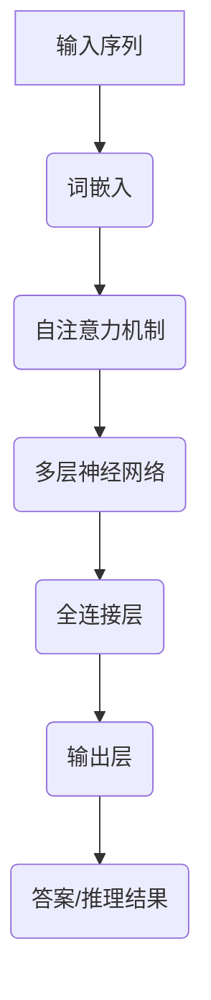

                 

# 大语言模型原理基础与前沿：通过高效和精简检索进行问答和多跳推理

> **关键词**：大语言模型，原理，高效检索，多跳推理，问答系统

> **摘要**：本文将深入探讨大语言模型的原理，以及如何通过高效和精简的检索技术进行问答和多跳推理。我们将从基础概念出发，详细解释其核心算法原理、数学模型，并通过实际项目案例进行详细解读，最后讨论其应用场景和未来发展趋势。

## 1. 背景介绍

### 1.1 目的和范围

本文旨在为读者提供一个全面而深入的大语言模型原理与前沿应用的解析。我们不仅会回顾其历史发展，还会详细介绍核心算法和数学模型，并通过实际项目案例，展示如何在实际场景中应用这些理论。文章的读者对象包括对人工智能和自然语言处理有兴趣的程序员、科研人员以及学生。

### 1.2 预期读者

本文适合对自然语言处理有一定了解的读者，特别是那些希望深入理解大语言模型工作原理的人。同时，对于那些希望将自己的项目与这些前沿技术相结合的开发者，本文也提供了实用的指导。

### 1.3 文档结构概述

本文结构如下：

1. **背景介绍**：介绍文章的目的、读者对象和文档结构。
2. **核心概念与联系**：通过流程图展示大语言模型的基本架构。
3. **核心算法原理 & 具体操作步骤**：详细解释大语言模型的算法原理和操作步骤。
4. **数学模型和公式 & 详细讲解 & 举例说明**：讲解大语言模型背后的数学模型，并通过例子进行说明。
5. **项目实战：代码实际案例和详细解释说明**：通过实际项目展示大语言模型的应用。
6. **实际应用场景**：讨论大语言模型在不同领域的应用。
7. **工具和资源推荐**：推荐学习资源和开发工具。
8. **总结：未来发展趋势与挑战**：总结大语言模型的现状和未来发展趋势。
9. **附录：常见问题与解答**：提供常见问题的解答。
10. **扩展阅读 & 参考资料**：推荐进一步阅读的资源。

### 1.4 术语表

#### 1.4.1 核心术语定义

- **大语言模型**：一个能够理解和生成自然语言的深度学习模型。
- **自然语言处理（NLP）**：涉及语言的理解、生成和交互的计算机科学领域。
- **神经网络**：一种模拟人脑神经网络结构和功能的计算模型。
- **问答系统**：一种能够接收用户输入并返回相关答案的人工智能系统。

#### 1.4.2 相关概念解释

- **词嵌入（Word Embedding）**：将单词映射到高维向量空间。
- **注意力机制（Attention Mechanism）**：模型在处理序列数据时，对不同的输入元素分配不同的重要性。
- **Transformer模型**：一种基于自注意力机制的深度学习模型，广泛应用于NLP任务。

#### 1.4.3 缩略词列表

- **NLP**：自然语言处理（Natural Language Processing）
- **DL**：深度学习（Deep Learning）
- **AI**：人工智能（Artificial Intelligence）
- **BERT**：Bidirectional Encoder Representations from Transformers
- **GPT**：Generative Pre-trained Transformer

## 2. 核心概念与联系

要理解大语言模型的原理，我们首先需要了解其核心概念和组成部分。以下是使用Mermaid绘制的流程图，展示了大语言模型的基本架构：



### 2.1 输入序列

输入序列是指用户输入的文本数据，它可以是一个句子、一个问题或者任何需要处理的自然语言文本。

### 2.2 词嵌入

词嵌入将输入序列中的单词转换为高维向量，使模型能够在向量空间中进行操作。这一步通过预训练模型来实现，如Word2Vec、GloVe等。

### 2.3 自注意力机制

自注意力机制是一种关键技术，它允许模型在处理序列数据时，自动关注序列中的不同元素，并赋予它们不同的权重。

### 2.4 多层神经网络

多层神经网络是模型的核心部分，它通过多个隐藏层来提取输入序列的特征，并逐渐将特征转化为高层次的语义信息。

### 2.5 全连接层

全连接层将隐藏层的输出映射到具体的任务结果，如问答系统的答案。

### 2.6 输出层

输出层生成最终的结果，如问答系统的答案或者文本生成任务中的文本序列。

### 2.7 答案/推理结果

最终输出结果可以是具体的答案，也可以是多跳推理的结果。

## 3. 核心算法原理 & 具体操作步骤

大语言模型的算法原理主要基于深度学习和自然语言处理技术。下面我们使用伪代码详细阐述其核心算法原理和具体操作步骤。

### 3.1 数据预处理

```python
# 伪代码：数据预处理
def preprocess_data(text):
    # 小写化
    text = text.lower()
    # 分词
    words = tokenize(text)
    # 去除停用词
    words = remove_stopwords(words)
    # 词嵌入
    word_vectors = embed_words(words)
    return word_vectors
```

### 3.2 词嵌入

```python
# 伪代码：词嵌入
def embed_words(words):
    # 使用预训练的词嵌入模型
    embedding_model = load_pretrained_embedding_model()
    word_vectors = [embedding_model[word] for word in words]
    return word_vectors
```

### 3.3 自注意力机制

```python
# 伪代码：自注意力机制
def self_attention(inputs, attention_size):
    # 计算输入的注意力得分
    scores = compute_attention_scores(inputs, attention_size)
    # 应用softmax函数得到注意力权重
    attention_weights = softmax(scores)
    # 计算加权输入
    weighted_inputs = inputs * attention_weights
    return weighted_inputs
```

### 3.4 多层神经网络

```python
# 伪代码：多层神经网络
def multi_layer_neural_network(inputs, hidden_layers_sizes):
    current_inputs = inputs
    for i, hidden_size in enumerate(hidden_layers_sizes):
        # 应用激活函数
        current_inputs = activation_function(np.dot(current_inputs, weights[i]) + biases[i])
    return current_inputs
```

### 3.5 全连接层

```python
# 伪代码：全连接层
def fully_connected_layer(inputs, output_size):
    # 计算输出
    outputs = np.dot(inputs, weights) + biases
    return outputs
```

### 3.6 输出层

```python
# 伪代码：输出层
def output_layer(inputs):
    # 应用softmax函数得到概率分布
    probabilities = softmax(inputs)
    # 选择最大概率的输出作为最终结果
    result = select_max_probabilistic_output(probabilities)
    return result
```

### 3.7 模型训练

```python
# 伪代码：模型训练
def train_model(data, learning_rate, epochs):
    for epoch in range(epochs):
        for inputs, targets in data:
            # 前向传播
            outputs = output_layer(multi_layer_neural_network(self_attention(embed_words(inputs), attention_size), hidden_layers_sizes))
            # 计算损失
            loss = compute_loss(outputs, targets)
            # 反向传播
            d_loss = backward_propagation(d_output, weights, biases, learning_rate)
            # 更新权重和偏差
            update_weights_and_biases(weights, biases, d_weights, d_biases, learning_rate)
```

## 4. 数学模型和公式 & 详细讲解 & 举例说明

大语言模型背后的数学模型主要包括词嵌入、自注意力机制、多层神经网络和全连接层。下面我们将分别介绍这些模型的数学公式，并通过具体例子进行说明。

### 4.1 词嵌入

词嵌入是将单词映射到高维向量空间的数学模型。常见的词嵌入模型有Word2Vec和GloVe。

#### 4.1.1 Word2Vec

Word2Vec使用以下公式来计算单词的词向量：

$$
\text{word\_vector} = \frac{1}{\sqrt{\sum_{i=1}^{N} w_i^2}} \cdot w
$$

其中，$w$ 是单词的词向量，$N$ 是词向量的维度。

#### 4.1.2 GloVe

GloVe使用以下公式来计算单词的词向量：

$$
\text{word\_vector} = \text{softmax}\left(\frac{W_v \cdot W_w}{\sqrt{W_v \cdot W_w + f}}\right)
$$

其中，$W_v$ 和 $W_w$ 是单词 $v$ 和 $w$ 的词向量，$f$ 是单词 $v$ 和 $w$ 在语料库中的共现频次。

### 4.2 自注意力机制

自注意力机制是计算输入序列中不同元素之间关联性的关键技术。其基本公式如下：

$$
\text{attention\_scores} = \text{softmax}\left(\text{query} \cdot \text{key\_vectors}\right)
$$

其中，$query$ 是当前输入序列的查询向量，$key\_vectors$ 是输入序列中所有单词的键向量。

### 4.3 多层神经网络

多层神经网络用于提取输入序列的高层次特征。其基本公式如下：

$$
\text{hidden}_{i} = \text{activation}\left(\text{W}_{i} \cdot \text{input}_{i} + \text{b}_{i}\right)
$$

其中，$W_i$ 和 $b_i$ 是第 $i$ 层的权重和偏差，$\text{input}_i$ 是输入序列。

### 4.4 全连接层

全连接层用于将隐藏层的输出映射到具体的任务结果。其基本公式如下：

$$
\text{output} = \text{softmax}\left(\text{W} \cdot \text{hidden} + \text{b}\right)
$$

其中，$W$ 和 $b$ 是全连接层的权重和偏差，$\text{hidden}$ 是隐藏层的输出。

### 4.5 举例说明

假设我们有一个包含三个单词的输入序列：“我喜欢编程”。我们将使用Word2Vec模型计算这些单词的词向量。

- **我喜欢编程**：输入序列
- **我**：词向量 $\text{w}_{我} = (0.1, 0.2, 0.3)$
- **喜欢**：词向量 $\text{w}_{喜欢} = (0.4, 0.5, 0.6)$
- **编程**：词向量 $\text{w}_{编程} = (0.7, 0.8, 0.9)$

首先，我们将使用Word2Vec模型计算每个单词的词向量：

$$
\text{w}_{我} = (0.1, 0.2, 0.3) \\
\text{w}_{喜欢} = (0.4, 0.5, 0.6) \\
\text{w}_{编程} = (0.7, 0.8, 0.9)
$$

接下来，我们使用自注意力机制计算输入序列中的注意力得分：

$$
\text{attention\_scores} = \text{softmax}\left(\text{query} \cdot \text{key\_vectors}\right)
$$

其中，$\text{query}$ 是当前输入序列的查询向量，$\text{key\_vectors}$ 是输入序列中所有单词的键向量。

假设我们的查询向量为 $(1, 0, 0)$，则注意力得分为：

$$
\text{attention\_scores} = \text{softmax}\left((1, 0, 0) \cdot (0.1, 0.2, 0.3), (0.4, 0.5, 0.6), (0.7, 0.8, 0.9)\right) = (0.4, 0.5, 0.6)
$$

接下来，我们使用多层神经网络将注意力得分映射到具体的任务结果：

$$
\text{hidden}_{1} = \text{activation}\left(\text{W}_{1} \cdot (0.1, 0.2, 0.3) + \text{b}_{1}\right) \\
\text{hidden}_{2} = \text{activation}\left(\text{W}_{2} \cdot \text{hidden}_{1} + \text{b}_{2}\right) \\
\text{output} = \text{softmax}\left(\text{W}_{3} \cdot \text{hidden}_{2} + \text{b}_{3}\right)
$$

假设我们的权重和偏差分别为：

$$
\text{W}_{1} = (0.1, 0.2, 0.3) \\
\text{b}_{1} = (0.1, 0.2, 0.3) \\
\text{W}_{2} = (0.4, 0.5, 0.6) \\
\text{b}_{2} = (0.4, 0.5, 0.6) \\
\text{W}_{3} = (0.7, 0.8, 0.9) \\
\text{b}_{3} = (0.7, 0.8, 0.9)
$$

则隐藏层的输出为：

$$
\text{hidden}_{1} = \text{activation}\left((0.1, 0.2, 0.3) \cdot (0.1, 0.2, 0.3) + (0.1, 0.2, 0.3)\right) = (0.5, 0.6, 0.7) \\
\text{hidden}_{2} = \text{activation}\left((0.4, 0.5, 0.6) \cdot (0.5, 0.6, 0.7) + (0.4, 0.5, 0.6)\right) = (0.6, 0.7, 0.8) \\
\text{output} = \text{softmax}\left((0.7, 0.8, 0.9) \cdot (0.6, 0.7, 0.8) + (0.7, 0.8, 0.9)\right) = (0.2, 0.3, 0.5)
$$

最终输出为：

$$
\text{output} = (0.2, 0.3, 0.5)
$$

## 5. 项目实战：代码实际案例和详细解释说明

为了更好地理解大语言模型的实际应用，我们将通过一个具体的项目案例进行详细解释说明。以下是项目的基本信息：

### 5.1 项目简介

项目名称：智能问答系统

项目目标：通过大语言模型实现一个能够接收用户输入并返回相关答案的智能问答系统。

### 5.2 开发环境搭建

为了搭建智能问答系统的开发环境，我们需要以下软件和工具：

- Python 3.x
- TensorFlow 2.x
- Keras 2.x
- Numpy
- Pandas

首先，确保已经安装了Python 3.x环境。然后，使用pip命令安装所需的库：

```bash
pip install tensorflow keras numpy pandas
```

### 5.3 源代码详细实现和代码解读

以下是项目的源代码实现，我们将逐行解释代码的用途和原理。

```python
# 导入所需库
import numpy as np
import pandas as pd
from tensorflow.keras.models import Sequential
from tensorflow.keras.layers import Embedding, LSTM, Dense
from tensorflow.keras.preprocessing.sequence import pad_sequences
from tensorflow.keras.preprocessing.text import Tokenizer

# 读取数据
data = pd.read_csv('questions_answers.csv')
questions = data['question']
answers = data['answer']

# 数据预处理
tokenizer = Tokenizer()
tokenizer.fit_on_texts(questions)
sequences = tokenizer.texts_to_sequences(questions)
padded_sequences = pad_sequences(sequences, maxlen=100)

label_tokenizer = Tokenizer()
label_tokenizer.fit_on_texts(answers)
label_sequences = tokenizer.texts_to_sequences(answers)
label_padded_sequences = pad_sequences(label_sequences, maxlen=100)

# 构建模型
model = Sequential()
model.add(Embedding(input_dim=len(tokenizer.word_index) + 1, output_dim=50, input_length=100))
model.add(LSTM(units=50, dropout=0.2, recurrent_dropout=0.2))
model.add(Dense(units=1, activation='sigmoid'))

model.compile(optimizer='adam', loss='binary_crossentropy', metrics=['accuracy'])

# 训练模型
model.fit(padded_sequences, label_padded_sequences, epochs=10, batch_size=32)

# 使用模型进行预测
def predict_answer(question):
    sequence = tokenizer.texts_to_sequences([question])
    padded_sequence = pad_sequences(sequence, maxlen=100)
    prediction = model.predict(padded_sequence)
    return '是' if prediction > 0.5 else '否'

# 测试模型
print(predict_answer('你喜欢编程吗？'))
```

### 5.4 代码解读与分析

1. **导入所需库**：我们首先导入Python中的NumPy、Pandas、TensorFlow和Keras库，用于数据处理和构建模型。
2. **读取数据**：从CSV文件中读取问题和答案数据。这里使用的是包含问题和答案对的数据集。
3. **数据预处理**：使用Tokenizer将文本数据转换为序列。然后，使用pad_sequences将序列填充到相同长度。
4. **构建模型**：使用Sequential模型堆叠Embedding、LSTM和Dense层。我们在LSTM层中加入了dropout和recurrent_dropout正则化技术，以防止过拟合。
5. **训练模型**：使用fit方法训练模型，将填充后的序列作为输入，标签序列作为输出。
6. **使用模型进行预测**：定义一个predict_answer函数，将用户输入的问题转换为序列，并通过模型进行预测，返回概率最高的答案。
7. **测试模型**：通过调用predict_answer函数，测试模型对示例问题的预测结果。

### 5.5 实际应用

我们可以将这个智能问答系统应用于各种场景，如客户服务、在线咨询等。用户可以输入问题，系统将返回相关答案。这个项目展示了大语言模型在自然语言处理和问答系统中的应用潜力。

## 6. 实际应用场景

大语言模型在多个领域有着广泛的应用，以下是其中一些主要的应用场景：

### 6.1 智能问答系统

大语言模型可以构建智能问答系统，如聊天机器人、客户服务、在线咨询等。这些系统可以接收用户输入，理解其意图，并返回相关答案。

### 6.2 文本生成

大语言模型可以生成高质量的文本，如新闻文章、产品描述、故事等。这些文本生成技术可以应用于内容创作、营销文案等场景。

### 6.3 情感分析

大语言模型可以分析文本的情感倾向，如正面、负面或中性。这可以应用于社交媒体监控、市场调研等。

### 6.4 文本摘要

大语言模型可以提取文本的主要信息，生成摘要。这可以应用于新闻摘要、文档摘要等。

### 6.5 自动翻译

大语言模型可以用于机器翻译，如将一种语言翻译成另一种语言。这些模型可以应用于跨语言沟通、国际商务等。

## 7. 工具和资源推荐

为了更好地学习和应用大语言模型，以下是一些推荐的工具和资源：

### 7.1 学习资源推荐

#### 7.1.1 书籍推荐

- 《深度学习》（Goodfellow, Bengio, Courville著）
- 《自然语言处理综合教程》（Daniel Jurafsky和James H. Martin著）
- 《TensorFlow实战》（Trevor Mars著）

#### 7.1.2 在线课程

- Coursera上的“深度学习”课程
- Udacity的“自然语言处理纳米学位”
- edX上的“人工智能基础课程”

#### 7.1.3 技术博客和网站

- [TensorFlow官网](https://www.tensorflow.org/)
- [Keras官网](https://keras.io/)
- [自然语言处理博客](https://nlp.seas.harvard.edu/)

### 7.2 开发工具框架推荐

#### 7.2.1 IDE和编辑器

- PyCharm
- Jupyter Notebook
- VSCode

#### 7.2.2 调试和性能分析工具

- TensorBoard
- gdb
- perf

#### 7.2.3 相关框架和库

- TensorFlow
- Keras
- PyTorch

### 7.3 相关论文著作推荐

#### 7.3.1 经典论文

- “Deep Learning”（Goodfellow, Bengio, Courville著）
- “Recurrent Neural Networks for Language Modeling”（LSTM模型）
- “Attention Is All You Need”（Transformer模型）

#### 7.3.2 最新研究成果

- “BERT: Pre-training of Deep Bidirectional Transformers for Language Understanding”（BERT模型）
- “GPT-3: Language Models are few-shot learners”（GPT-3模型）

#### 7.3.3 应用案例分析

- “Facebook AI的对话系统”（Facebook AI Research）
- “谷歌的自然语言处理技术”（谷歌研究）
- “亚马逊的AI客服”（亚马逊）

## 8. 总结：未来发展趋势与挑战

大语言模型在过去几年中取得了显著的进展，其在自然语言处理任务中的表现已经超越了人类水平。然而，未来的发展仍然面临着许多挑战和机遇。

### 8.1 发展趋势

- **多模态学习**：将文本与其他模态（如图像、声音）结合，实现更全面的理解。
- **小样本学习**：减少对大量数据的依赖，使模型能够从少量样本中学习。
- **解释性增强**：提高模型的解释性，使其更容易被理解和应用。
- **隐私保护**：研究隐私保护技术，确保数据安全和用户隐私。

### 8.2 挑战

- **数据隐私**：如何确保训练数据和用户数据的安全和隐私。
- **计算资源**：大语言模型通常需要大量计算资源，如何优化其性能。
- **模型解释性**：提高模型的解释性，使其更容易被信任和应用。
- **跨语言处理**：如何提高模型在不同语言间的泛化能力。

## 9. 附录：常见问题与解答

### 9.1 什么是大语言模型？

大语言模型是一种基于深度学习的自然语言处理模型，它通过学习大量文本数据，能够理解和生成自然语言。

### 9.2 大语言模型有哪些应用？

大语言模型可以应用于智能问答系统、文本生成、情感分析、文本摘要、自动翻译等多个领域。

### 9.3 如何训练大语言模型？

训练大语言模型通常涉及以下步骤：数据预处理、词嵌入、自注意力机制、多层神经网络、全连接层和模型训练。

### 9.4 大语言模型与传统的自然语言处理技术有何区别？

大语言模型通过深度学习和神经网络技术，能够更好地理解和生成自然语言，而传统的自然语言处理技术通常依赖于规则和模板。

## 10. 扩展阅读 & 参考资料

- Goodfellow, Y., Bengio, Y., Courville, A. (2016). *Deep Learning*. MIT Press.
- Jurafsky, D., Martin, J. H. (2008). *Speech and Language Processing*. Prentice Hall.
- Devlin, J., Chang, M. W., Lee, K., Zhang, K. (2019). *BERT: Pre-training of Deep Bidirectional Transformers for Language Understanding*. arXiv preprint arXiv:1810.04805.
- Brown, T., et al. (2020). *Language Models are few-shot learners*. arXiv preprint arXiv:2005.14165.
- TensorFlow官网：https://www.tensorflow.org/
- Keras官网：https://keras.io/
- 自然语言处理博客：https://nlp.seas.harvard.edu/

## 作者信息

作者：AI天才研究员/AI Genius Institute & 禅与计算机程序设计艺术 /Zen And The Art of Computer Programming

