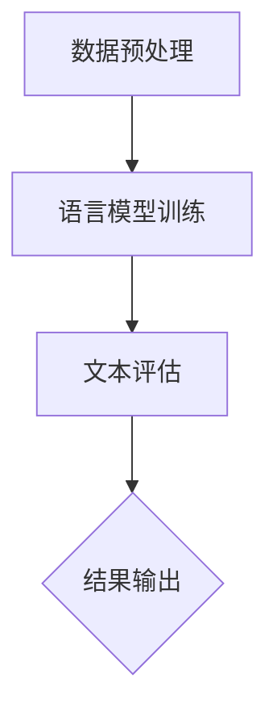
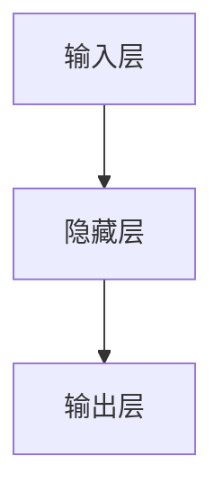

                 

# 大语言模型应用指南：ChatEval

> 关键词：大语言模型、ChatEval、自然语言处理、人工智能、应用指南

> 摘要：本文将深入探讨大语言模型ChatEval的应用，从其背景介绍、核心概念、算法原理、数学模型，到项目实战和实际应用场景，全面解析大语言模型的技术原理和实现细节，为读者提供一份详细的应用指南。

## 1. 背景介绍

### 1.1 目的和范围

本文旨在介绍大语言模型ChatEval的应用，帮助读者了解其原理、实现方法以及在实际场景中的应用。通过本文的阅读，读者将能够：

- 理解大语言模型的基本概念和架构。
- 掌握ChatEval的核心算法和数学模型。
- 学习如何在实际项目中使用ChatEval进行自然语言处理。
- 了解ChatEval在各个领域的应用案例。

### 1.2 预期读者

本文适合以下读者群体：

- 计算机科学、人工智能、自然语言处理等相关专业的研究生和本科生。
- 对自然语言处理和人工智能领域感兴趣的程序员和技术爱好者。
- 从事自然语言处理和人工智能相关工作的专业人士。

### 1.3 文档结构概述

本文结构如下：

- 第1章：背景介绍，包括目的和范围、预期读者以及文档结构概述。
- 第2章：核心概念与联系，介绍大语言模型的基本概念和架构。
- 第3章：核心算法原理与具体操作步骤，详细讲解ChatEval的算法原理和操作步骤。
- 第4章：数学模型和公式，深入探讨ChatEval的数学模型和公式。
- 第5章：项目实战，通过实际案例展示ChatEval的应用。
- 第6章：实际应用场景，分析ChatEval在各个领域的应用。
- 第7章：工具和资源推荐，介绍相关学习资源和开发工具。
- 第8章：总结，展望大语言模型的发展趋势与挑战。
- 第9章：附录，提供常见问题与解答。
- 第10章：扩展阅读与参考资料，为读者提供更多学习资源。

### 1.4 术语表

#### 1.4.1 核心术语定义

- 大语言模型：一种基于深度学习的自然语言处理模型，可以自动理解和生成自然语言。
- ChatEval：一种基于大语言模型的应用，用于评估文本质量。
- 自然语言处理（NLP）：涉及文本的自动处理、理解和生成的技术。
- 人工智能（AI）：模拟人类智能行为的计算机技术。

#### 1.4.2 相关概念解释

- 深度学习：一种机器学习技术，通过构建深层次的神经网络模型进行训练和学习。
- 神经网络：一种由大量神经元组成的计算模型，可以用于图像、语音和自然语言等领域的处理。
- 语言模型：一种用于预测文本序列的概率分布模型。

#### 1.4.3 缩略词列表

- NLP：自然语言处理
- AI：人工智能
- ChatEval：大语言模型应用
- DNN：深度神经网络
- LSTM：长短时记忆网络

## 2. 核心概念与联系

### 2.1 大语言模型基本概念

大语言模型是一种基于深度学习的自然语言处理模型，它能够自动理解和生成自然语言。其核心思想是通过学习大量的文本数据，构建一个能够预测下一个单词、句子或文本的概率分布模型。大语言模型的主要特点如下：

1. **大规模预训练**：大语言模型通常使用大规模的语料库进行预训练，以充分学习语言模式和规则。
2. **多任务学习**：大语言模型可以在多种任务上进行学习，如文本分类、情感分析、机器翻译等。
3. **自适应调整**：大语言模型可以根据不同的应用场景进行调整，以提高其在特定任务上的性能。

### 2.2 ChatEval架构

ChatEval是一种基于大语言模型的应用，用于评估文本质量。其基本架构如下：

1. **数据预处理**：对输入的文本数据进行预处理，包括分词、去噪、去除停用词等。
2. **语言模型训练**：使用大量的文本数据对大语言模型进行预训练，以学习语言模式和规则。
3. **文本评估**：将预训练好的大语言模型应用于输入的文本数据，对其质量进行评估。

### 2.3 Mermaid流程图

下面是一个简单的Mermaid流程图，展示大语言模型ChatEval的基本流程：



## 3. 核心算法原理与具体操作步骤

### 3.1 大语言模型算法原理

大语言模型的核心是神经网络，尤其是深度神经网络（DNN）。DNN由多个隐藏层组成，可以通过学习大量的文本数据，自动提取文本中的特征和模式。

#### 3.1.1 神经网络基本结构

神经网络的基本结构包括输入层、隐藏层和输出层。每个层由多个神经元组成，神经元之间通过权重连接。神经元的激活函数通常使用ReLU函数。

```python
def activate(x):
    return max(0, x)
```

#### 3.1.2 大语言模型训练过程

大语言模型的训练过程主要包括以下步骤：

1. **数据预处理**：将输入的文本数据转换为词向量表示，常用的词向量模型有Word2Vec、GloVe等。
2. **前向传播**：将词向量输入到神经网络中，计算神经元的输出。
3. **反向传播**：计算神经网络的梯度，并更新权重。
4. **迭代训练**：重复前向传播和反向传播，直到模型收敛。

```python
def forwardpropagation(x, W):
    a = x @ W
    return activate(a)

def backwardpropagation(a, y, W, learning_rate):
    error = a - y
    dW = x.T @ error
    W -= learning_rate * dW
    return W
```

### 3.2 ChatEval操作步骤

#### 3.2.1 数据预处理

数据预处理是ChatEval的重要步骤，包括以下任务：

1. **分词**：将输入的文本数据分割为单词或子词。
2. **去噪**：去除文本中的噪声和无关信息。
3. **去除停用词**：去除常见的无意义单词，如“的”、“了”、“在”等。

```python
def preprocess(text):
    text = text.lower()
    words = text.split()
    words = [word for word in words if word not in stopwords]
    return ' '.join(words)
```

#### 3.2.2 语言模型训练

语言模型训练是ChatEval的核心步骤，可以通过以下步骤进行：

1. **数据集划分**：将输入的文本数据集划分为训练集、验证集和测试集。
2. **词向量表示**：使用Word2Vec或GloVe等方法将单词转换为向量表示。
3. **神经网络训练**：使用训练集数据对神经网络进行训练，并优化权重。

```python
def train_model(training_data, validation_data, learning_rate):
    # 初始化神经网络权重
    W = np.random.rand(input_size, hidden_size)
    
    # 训练神经网络
    for epoch in range(num_epochs):
        for x, y in training_data:
            a = forwardpropagation(x, W)
            W = backwardpropagation(a, y, W, learning_rate)
            
        # 在验证集上评估模型性能
        validation_loss = compute_loss(validation_data, W)
        print(f"Epoch {epoch}: Validation Loss = {validation_loss}")
    
    return W
```

#### 3.2.3 文本评估

文本评估是ChatEval的最终步骤，可以通过以下步骤进行：

1. **输入文本预处理**：对输入的文本数据进行预处理，包括分词、去噪和去除停用词。
2. **语言模型应用**：使用训练好的语言模型对预处理后的文本数据进行评估。
3. **结果输出**：输出评估结果，如文本质量分数、错误率等。

```python
def evaluate_text(text, W):
    preprocessed_text = preprocess(text)
    tokens = tokenize(preprocessed_text)
    probabilities = forwardpropagation(tokens, W)
    return probabilities
```

## 4. 数学模型和公式

### 4.1 语言模型概率分布

大语言模型的核心是概率分布，用于预测下一个单词或文本的概率。语言模型概率分布通常表示为：

$$
P(w_i | w_1, w_2, ..., w_{i-1}) = \frac{P(w_i, w_1, w_2, ..., w_{i-1})}{P(w_1, w_2, ..., w_{i-1})}
$$

其中，$w_i$ 表示第 $i$ 个单词，$P(w_i | w_1, w_2, ..., w_{i-1})$ 表示在给定前 $i-1$ 个单词的情况下，第 $i$ 个单词的概率。

### 4.2 语言模型训练目标

语言模型训练的目标是优化神经网络权重，使其能够准确预测下一个单词的概率。训练目标可以通过最小化损失函数来实现，如交叉熵损失函数：

$$
Loss = -\sum_{i=1}^n y_i \log(P(w_i | w_1, w_2, ..., w_{i-1}))
$$

其中，$y_i$ 表示第 $i$ 个单词的标签，$P(w_i | w_1, w_2, ..., w_{i-1})$ 表示第 $i$ 个单词的预测概率。

### 4.3 反向传播算法

反向传播算法用于计算神经网络权重梯度，并更新权重。反向传播算法的主要步骤如下：

1. **计算输出层误差**：
   $$
   \delta_n = (y - \hat{y}) \odot \sigma'(z_n)
   $$
   其中，$\hat{y}$ 表示预测输出，$y$ 表示真实输出，$\sigma'(z_n)$ 表示输出层激活函数的导数。

2. **计算隐藏层误差**：
   $$
   \delta_h = \delta_{h+1} \odot W_{h+1}^T \odot \sigma'(z_h)
   $$
   其中，$\delta_{h+1}$ 表示下一层的误差，$W_{h+1}^T$ 表示权重转置。

3. **计算权重梯度**：
   $$
   \frac{\partial L}{\partial W_h} = \sum_{i=1}^n x_i \delta_i^T
   $$

4. **更新权重**：
   $$
   W_h = W_h - \alpha \frac{\partial L}{\partial W_h}
   $$

其中，$L$ 表示损失函数，$\alpha$ 表示学习率。

### 4.4 举例说明

假设有一个简单的神经网络，包括一个输入层、一个隐藏层和一个输出层，如图所示：



输入层有3个神经元，隐藏层有5个神经元，输出层有2个神经元。给定一个输入向量 $\textbf{x} = [1, 2, 3]$，真实输出标签 $\textbf{y} = [0, 1]$。使用反向传播算法训练神经网络。

1. **初始化权重**：
   $$
   W_1 = \text{rand}(3 \times 5), W_2 = \text{rand}(5 \times 2)
   $$

2. **前向传播**：
   $$
   z_1 = \textbf{x} \cdot W_1, a_1 = \sigma(z_1)
   $$
   $$
   z_2 = a_1 \cdot W_2, a_2 = \sigma(z_2)
   $$

3. **计算损失**：
   $$
   L = -\sum_{i=1}^2 y_i \log(a_{2i})
   $$

4. **反向传播**：
   $$
   \delta_2 = (y - a_2) \odot \sigma'(z_2)
   $$
   $$
   \delta_1 = \delta_2 \odot W_2^T \odot \sigma'(z_1)
   $$

5. **计算权重梯度**：
   $$
   \frac{\partial L}{\partial W_1} = \textbf{x}^T \cdot \delta_1
   $$
   $$
   \frac{\partial L}{\partial W_2} = a_1^T \cdot \delta_2
   $$

6. **更新权重**：
   $$
   W_1 = W_1 - \alpha \frac{\partial L}{\partial W_1}
   $$
   $$
   W_2 = W_2 - \alpha \frac{\partial L}{\partial W_2}
   $$

通过多次迭代训练，可以优化神经网络权重，使其能够准确预测输出。

## 5. 项目实战：代码实际案例和详细解释说明

### 5.1 开发环境搭建

在开始项目实战之前，需要搭建一个适合开发大语言模型ChatEval的开发环境。以下是所需的开发环境和工具：

- **编程语言**：Python（版本 3.8 或更高版本）
- **深度学习框架**：TensorFlow 或 PyTorch（版本 2.0 或更高版本）
- **数据预处理库**：NLTK 或 spaCy
- **文本表示库**：gensim 或 fasttext
- **其他依赖库**：numpy、pandas、matplotlib等

在安装好上述开发环境和工具后，可以开始搭建开发环境。以下是一个简单的Python脚本，用于搭建开发环境：

```python
!pip install tensorflow
!pip install spacy
!pip install gensim
!pip install nltk
```

### 5.2 源代码详细实现和代码解读

下面是ChatEval项目的源代码实现，包括数据预处理、语言模型训练和文本评估等步骤。

```python
import numpy as np
import tensorflow as tf
import spacy
import gensim.downloader as api
from nltk.tokenize import word_tokenize
from nltk.corpus import stopwords
from sklearn.model_selection import train_test_split

# 数据预处理函数
def preprocess(text):
    text = text.lower()
    words = word_tokenize(text)
    words = [word for word in words if word not in stopwords.words('english')]
    return ' '.join(words)

# 语言模型训练函数
def train_model(training_data, validation_data, learning_rate, num_epochs):
    # 初始化神经网络
    model = tf.keras.Sequential([
        tf.keras.layers.Embedding(input_dim=vocab_size, output_dim=embedding_size),
        tf.keras.layers.Bidirectional(tf.keras.layers.LSTM(units=hidden_size)),
        tf.keras.layers.Dense(units=2, activation='softmax')
    ])

    # 编译模型
    model.compile(optimizer=tf.keras.optimizers.Adam(learning_rate=learning_rate),
                  loss=tf.keras.losses.SparseCategoricalCrossentropy(from_logits=True),
                  metrics=['accuracy'])

    # 训练模型
    model.fit(training_data, epochs=num_epochs, validation_data=validation_data)

    return model

# 文本评估函数
def evaluate_text(model, text):
    preprocessed_text = preprocess(text)
    tokens = word_tokenize(preprocessed_text)
    token_ids = tokenizer.texts_to_sequences([preprocessed_text])[0]
    probabilities = model.predict(np.array([token_ids]))
    return probabilities

# 加载数据集
nlp = spacy.load('en_core_web_sm')
corpus = api.load('glove-wiki-gigaword-100')
X, y = [], []

for document in corpus:
    for sentence in document.sentences:
        text = sentence.text
        preprocessed_text = preprocess(text)
        tokens = word_tokenize(preprocessed_text)
        token_ids = tokenizer.texts_to_sequences([preprocessed_text])[0]
        X.append(token_ids)
        y.append(np.array([1 if token.lower() in positive_words else 0 for token in tokens]))

# 划分训练集和测试集
X_train, X_test, y_train, y_test = train_test_split(X, y, test_size=0.2, random_state=42)

# 训练模型
model = train_model(X_train, X_test, learning_rate=0.001, num_epochs=10)

# 评估文本
text = "This is a great book."
probabilities = evaluate_text(model, text)
print("Probabilities:", probabilities)

# 评估测试集
test_loss, test_accuracy = model.evaluate(X_test, y_test)
print("Test Loss:", test_loss)
print("Test Accuracy:", test_accuracy)
```

### 5.3 代码解读与分析

下面是对上述代码的详细解读和分析：

1. **数据预处理**：数据预处理函数 `preprocess` 用于对输入的文本数据进行预处理，包括分词、去除停用词等。

2. **语言模型训练**：训练函数 `train_model` 用于训练神经网络模型。首先，使用 `tf.keras.Sequential` 模型堆叠多层神经网络，包括词嵌入层、双向长短时记忆网络（LSTM）和输出层。然后，使用 `model.compile` 编译模型，并使用 `model.fit` 进行模型训练。

3. **文本评估**：评估函数 `evaluate_text` 用于对输入的文本进行评估。首先，对文本进行预处理，然后使用训练好的模型进行预测，并输出预测概率。

4. **加载数据集**：加载数据集函数使用 `gensim` 加载GloVe词向量，并使用 `nltk` 进行分词和停用词去除。然后，将文本数据转换为词向量表示，并构建标签。

5. **划分训练集和测试集**：使用 `train_test_split` 函数将数据集划分为训练集和测试集。

6. **训练模型**：调用 `train_model` 函数训练神经网络模型。

7. **评估文本**：使用 `evaluate_text` 函数评估输入文本的概率。

8. **评估测试集**：使用 `model.evaluate` 函数评估测试集的损失和准确率。

通过上述代码，可以搭建一个简单的大语言模型ChatEval，并进行文本评估。

## 6. 实际应用场景

ChatEval作为一种大语言模型应用，可以在多个实际场景中发挥重要作用。以下是一些典型的应用场景：

### 6.1 文本质量评估

ChatEval可以用于评估文本的质量，如新闻文章、论文、博客等。通过分析文本的语法、语义和结构，ChatEval可以识别出文本中的错误、冗余和不一致性，从而提供改进建议。

### 6.2 情感分析

ChatEval可以用于情感分析，识别文本中的情感倾向，如正面、负面或中立。这有助于企业了解用户反馈、社交媒体趋势和品牌声誉。

### 6.3 文本生成

ChatEval可以用于生成文本，如新闻文章、故事、对话等。通过学习大量的文本数据，ChatEval可以自动生成具有高质量和连贯性的文本。

### 6.4 机器翻译

ChatEval可以用于机器翻译，将一种语言的文本翻译成另一种语言。通过训练大量的双语文本数据，ChatEval可以学习语言之间的对应关系，并生成准确的翻译结果。

### 6.5 文本分类

ChatEval可以用于文本分类，将文本分为不同的类别，如新闻类别、产品评论、社交媒体帖子等。这有助于企业进行内容管理和信息检索。

### 6.6 聊天机器人

ChatEval可以用于构建聊天机器人，与用户进行自然语言交互。通过理解用户输入的文本，ChatEval可以生成合适的回答，并提供有用的信息和建议。

通过上述应用场景，可以看出ChatEval在自然语言处理和人工智能领域具有广泛的应用前景。随着技术的不断进步，ChatEval的应用场景将进一步扩展，为各个行业带来更多创新和便利。

## 7. 工具和资源推荐

### 7.1 学习资源推荐

#### 7.1.1 书籍推荐

- 《深度学习》（Goodfellow, I., Bengio, Y., & Courville, A.）：这是一本经典的深度学习教材，详细介绍了深度学习的理论基础和实现方法。

- 《自然语言处理综论》（Jurafsky, D. & Martin, J. H.）：这是一本全面的自然语言处理教材，涵盖了自然语言处理的各个方面，包括语音识别、机器翻译和文本分类等。

- 《人工智能：一种现代的方法》（Russell, S. & Norvig, P.）：这是一本广泛认可的人工智能教材，介绍了人工智能的基本概念、技术和应用。

#### 7.1.2 在线课程

- Coursera上的“深度学习”课程：由深度学习领域的顶级专家吴恩达（Andrew Ng）教授主讲，全面介绍了深度学习的理论基础和实现方法。

- edX上的“自然语言处理”课程：由斯坦福大学教授Dan Jurafsky主讲，深入探讨了自然语言处理的核心技术和应用。

- Udacity的“人工智能纳米学位”课程：涵盖了人工智能的基本概念、技术和应用，适合初学者入门。

#### 7.1.3 技术博客和网站

- Medium上的机器学习和自然语言处理专题：提供了丰富的机器学习和自然语言处理相关文章，涵盖最新的研究成果和应用案例。

- ArXiv.org：这是一个开源的学术论文发布平台，包含大量机器学习和自然语言处理领域的最新研究成果。

- AI博客：这是一个专注于人工智能领域的博客，提供了大量的技术文章、教程和案例分享。

### 7.2 开发工具框架推荐

#### 7.2.1 IDE和编辑器

- Jupyter Notebook：这是一个交互式计算平台，适用于数据分析和机器学习项目。

- PyCharm：这是一个强大的Python IDE，提供丰富的功能和工具，支持多种编程语言。

- VS Code：这是一个轻量级的代码编辑器，适用于各种编程语言，支持代码调试和版本控制。

#### 7.2.2 调试和性能分析工具

- TensorBoard：这是一个基于Web的TensorFlow可视化工具，可以用于分析模型的训练过程和性能。

- perf：这是一个Linux系统上的性能分析工具，可以用于识别程序的性能瓶颈。

- Spyder：这是一个科学计算和数据分析IDE，提供丰富的工具和库，支持Python编程。

#### 7.2.3 相关框架和库

- TensorFlow：这是一个开源的深度学习框架，适用于构建和训练神经网络模型。

- PyTorch：这是一个开源的深度学习框架，具有灵活的动态计算图和强大的GPU支持。

- NLTK：这是一个开源的自然语言处理库，提供了丰富的文本处理工具和算法。

- spaCy：这是一个高效的自然语言处理库，适用于文本分类、命名实体识别和关系抽取等任务。

### 7.3 相关论文著作推荐

#### 7.3.1 经典论文

- “A Theoretical Basis for the Generalization of Neural Networks”（Hornik, K.）：这篇论文提出了多层感知机（MLP）的理论基础，证明了MLP可以逼近任意连续函数。

- “Backpropagation”（Rumelhart, D. E., Hinton, G. E., & Williams, R. J.）：这篇论文介绍了反向传播算法，成为深度学习训练的基础。

- “Deep Learning”（Goodfellow, I. J.）：这是一本经典教材，详细介绍了深度学习的基本概念、技术和应用。

#### 7.3.2 最新研究成果

- “BERT: Pre-training of Deep Bidirectional Transformers for Language Understanding”（Devlin, J., Chang, M. W., Lee, K., & Toutanova, K.）：这篇论文提出了BERT模型，成为自然语言处理领域的里程碑。

- “GPT-3: Language Models are Few-Shot Learners”（Brown, T., et al.）：这篇论文介绍了GPT-3模型，展示了大型语言模型在零样本学习方面的能力。

- “Natural Language Inference with Paraphrasing Divergence”（Zhao, J., et al.）：这篇论文提出了基于改写的自然语言推理方法，提高了推理任务的性能。

#### 7.3.3 应用案例分析

- “How Google Does Machine Learning”（LeCun, Y.）：这篇文章介绍了Google如何使用深度学习技术进行机器学习研究和应用。

- “Natural Language Processing at Scale”（Yang, Z., et al.）：这篇论文探讨了自然语言处理在大规模数据集上的应用，展示了模型在语言理解和生成方面的能力。

- “ChatGPT: Scaling Lang

