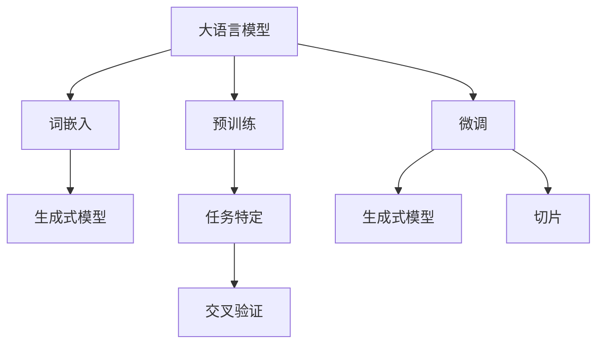

                 

# 大语言模型应用指南：三类微调方法

> 关键词：大语言模型、微调方法、应用指南、算法原理、数学模型、实战案例

> 摘要：本文将深入探讨大语言模型的应用与微调方法。我们将从背景介绍开始，逐步剖析大语言模型的核心概念与联系，详细讲解核心算法原理与数学模型，并通过实际项目实战，展示代码实现与详细解释。最后，我们将探讨大语言模型在实际应用场景中的广泛用途，并提供相关工具和资源推荐，以帮助读者深入了解和掌握这一技术。

## 1. 背景介绍

### 1.1 目的和范围

本文的目的是为您提供一个全面的大语言模型应用指南，帮助您理解微调方法在实际应用中的重要性。我们将探讨大语言模型的核心概念与联系，详细讲解核心算法原理与数学模型，并通过实际项目实战，展示代码实现与详细解释。通过本文的学习，您将能够掌握大语言模型的应用方法，并能够在实际项目中运用这些方法。

### 1.2 预期读者

本文适合有一定编程基础和机器学习背景的读者。如果您对大语言模型和应用方法有一定的了解，将能够更好地理解本文的内容。同时，本文也适合对机器学习和人工智能领域感兴趣的研究人员和开发者。

### 1.3 文档结构概述

本文将分为以下几个部分：

1. 背景介绍：介绍本文的目的、预期读者以及文档结构。
2. 核心概念与联系：阐述大语言模型的核心概念与联系。
3. 核心算法原理 & 具体操作步骤：详细讲解大语言模型的算法原理与操作步骤。
4. 数学模型和公式 & 详细讲解 & 举例说明：介绍大语言模型的数学模型与公式，并进行举例说明。
5. 项目实战：展示实际项目中的代码实现与详细解释。
6. 实际应用场景：探讨大语言模型在实际应用中的广泛用途。
7. 工具和资源推荐：推荐学习资源、开发工具框架和相关论文著作。
8. 总结：总结未来发展趋势与挑战。
9. 附录：常见问题与解答。
10. 扩展阅读 & 参考资料：提供相关的扩展阅读和参考资料。

### 1.4 术语表

#### 1.4.1 核心术语定义

- 大语言模型：一种基于深度学习的模型，能够对自然语言进行处理和生成。
- 微调：对预训练模型进行适应性训练，使其适用于特定任务的过程。
- 词嵌入：将单词映射到高维向量空间的过程。
- 生成式模型：能够根据输入生成文本的模型。
- 切片：将输入文本分割成多个子序列，以便模型处理。

#### 1.4.2 相关概念解释

- 预训练：在特定任务之前，对模型进行大规模语料库的训练，使其具备一定的基础能力。
- 任务特定：针对特定任务，对模型进行调整和优化，以提高模型在任务上的表现。
- 交叉验证：将数据集划分为多个部分，用于训练和验证模型的性能。

#### 1.4.3 缩略词列表

- NLP：自然语言处理（Natural Language Processing）
- LSTM：长短时记忆网络（Long Short-Term Memory）
- Transformer：基于自注意力机制的深度学习模型

## 2. 核心概念与联系

在深入探讨大语言模型的应用与微调方法之前，我们需要了解一些核心概念与联系。下面我们将通过Mermaid流程图来展示这些概念与联系。



### 2.1 大语言模型

大语言模型（Large Language Model）是一种基于深度学习的模型，能够对自然语言进行处理和生成。其基本原理是通过大量的文本数据对模型进行预训练，使其具备一定的语言理解和生成能力。常见的预训练模型有GPT、BERT等。

### 2.2 词嵌入

词嵌入（Word Embedding）是将单词映射到高维向量空间的过程。通过词嵌入，我们可以将文本数据转化为数值型数据，便于模型处理。常见的词嵌入方法有Word2Vec、GloVe等。

### 2.3 预训练

预训练（Pre-training）是指在特定任务之前，对模型进行大规模语料库的训练，使其具备一定的基础能力。预训练的目标是让模型学会基本的语言规律和知识。常见的预训练模型有GPT、BERT等。

### 2.4 微调

微调（Fine-tuning）是对预训练模型进行适应性训练，使其适用于特定任务的过程。微调的目标是提高模型在特定任务上的表现。微调的过程通常包括以下几个步骤：

1. 选择预训练模型：根据任务需求，选择合适的预训练模型。
2. 数据预处理：对输入数据进行预处理，包括文本清洗、分词、词嵌入等。
3. 模型调整：在预训练模型的基础上，调整模型参数，以适应特定任务。
4. 训练与验证：对调整后的模型进行训练和验证，以评估模型性能。
5. 优化与调整：根据验证结果，对模型进行调整和优化，以提高模型性能。

### 2.5 生成式模型

生成式模型（Generative Model）是一种能够根据输入生成文本的模型。常见的生成式模型有GPT、BERT等。生成式模型通过学习大量文本数据，能够生成具有一定逻辑和语义的文本。

### 2.6 切片

切片（Tokenization）是将输入文本分割成多个子序列的过程。切片的目的是将长文本拆分成多个短文本，以便模型处理。常见的切片方法有分词、子序列提取等。

## 3. 核心算法原理 & 具体操作步骤

在了解了大语言模型的核心概念与联系之后，我们将深入探讨大语言模型的算法原理与具体操作步骤。

### 3.1 算法原理

大语言模型的核心算法原理是基于深度学习的神经网络模型，如GPT、BERT等。这些模型通过学习大量文本数据，能够自动发现文本中的规律和知识，从而实现对自然语言的建模。

GPT（Generative Pre-trained Transformer）是一种基于自注意力机制的深度学习模型。其基本原理是通过对输入文本进行编码，生成对应的输出文本。GPT模型主要由以下几个部分组成：

1. 自注意力机制：自注意力机制（Self-Attention）是一种计算输入文本序列中各个词之间的关联性的方法。通过自注意力机制，模型能够更好地捕捉文本中的长距离依赖关系。
2. 编码器：编码器（Encoder）是一个多层神经网络，用于对输入文本进行编码，生成对应的编码表示。
3. 解码器：解码器（Decoder）是一个多层神经网络，用于对编码表示进行解码，生成输出文本。

BERT（Bidirectional Encoder Representations from Transformers）是一种双向编码器表示模型。其基本原理是通过对输入文本进行编码，生成对应的编码表示。BERT模型主要由以下几个部分组成：

1. 双向编码器：双向编码器（Bidirectional Encoder）是一个多层神经网络，用于对输入文本进行编码，生成双向编码表示。
2. 全连接层：全连接层（Fully Connected Layer）用于对编码表示进行分类或回归操作。

### 3.2 具体操作步骤

在了解了大语言模型的算法原理之后，我们将详细讲解大语言模型的具体操作步骤。

#### 3.2.1 预训练

预训练是模型训练的第一步。预训练的目标是让模型学习大量文本数据，从而获得一定的语言理解能力。预训练的具体操作步骤如下：

1. 数据准备：收集大量的文本数据，并进行预处理，如分词、词嵌入等。
2. 模型初始化：初始化预训练模型，通常使用预训练好的模型参数。
3. 模型训练：使用文本数据对预训练模型进行训练，通过优化模型参数，提高模型在文本数据上的表现。
4. 模型评估：使用验证集对预训练模型进行评估，以确定模型是否达到预训练目标。

#### 3.2.2 微调

微调是在预训练的基础上，针对特定任务对模型进行调整的过程。微调的具体操作步骤如下：

1. 数据准备：收集特定任务的数据集，并进行预处理，如分词、词嵌入等。
2. 模型初始化：初始化微调模型，通常使用预训练模型作为基础。
3. 模型调整：在预训练模型的基础上，调整模型参数，使其适应特定任务。
4. 模型训练：使用任务数据集对微调模型进行训练，通过优化模型参数，提高模型在任务上的表现。
5. 模型评估：使用验证集对微调模型进行评估，以确定模型是否达到任务目标。

#### 3.2.3 应用

微调后的模型可以应用于各种自然语言处理任务，如文本分类、情感分析、机器翻译等。应用的具体操作步骤如下：

1. 数据准备：收集应用任务的数据集，并进行预处理，如分词、词嵌入等。
2. 模型初始化：初始化应用模型，通常使用微调模型作为基础。
3. 模型调整：在微调模型的基础上，调整模型参数，使其适应应用任务。
4. 模型训练：使用应用任务数据集对模型进行训练，通过优化模型参数，提高模型在应用任务上的表现。
5. 模型评估：使用验证集对模型进行评估，以确定模型是否达到应用目标。

### 3.3 伪代码

以下是微调大语言模型的伪代码：

```python
# 预训练
def pre_train(model, data_loader):
    model.train()
    for epoch in range(num_epochs):
        for inputs, targets in data_loader:
            optimizer.zero_grad()
            outputs = model(inputs)
            loss = criterion(outputs, targets)
            loss.backward()
            optimizer.step()
    return model

# 微调
def fine_tune(model, task_data_loader, num_epochs):
    model.train()
    for epoch in range(num_epochs):
        for inputs, targets in task_data_loader:
            optimizer.zero_grad()
            outputs = model(inputs)
            loss = criterion(outputs, targets)
            loss.backward()
            optimizer.step()
    return model

# 应用
def apply(model, application_data_loader):
    model.eval()
    with torch.no_grad():
        for inputs, targets in application_data_loader:
            outputs = model(inputs)
            loss = criterion(outputs, targets)
    return loss
```

## 4. 数学模型和公式 & 详细讲解 & 举例说明

在大语言模型中，数学模型和公式起着至关重要的作用。以下我们将详细介绍大语言模型的数学模型和公式，并通过具体例子进行讲解。

### 4.1 数学模型

大语言模型的数学模型主要包括词嵌入、自注意力机制、编码器和解码器等。

#### 4.1.1 词嵌入

词嵌入（Word Embedding）是一种将单词映射到高维向量空间的方法。常见的词嵌入方法有Word2Vec和GloVe。

1. Word2Vec：
   $$\text{word\_vector} = \sum_{w \in \text{word}} w \cdot e^T(v)$$
   其中，$w$表示单词，$e^T(v)$表示单词的向量表示，$\text{word\_vector}$表示单词的高维向量表示。

2. GloVe：
   $$\text{word\_vector} = \frac{W_w}{1 + \sqrt{d}}$$
   其中，$W_w$表示单词的词频，$d$表示词向量维度，$\text{word\_vector}$表示单词的高维向量表示。

#### 4.1.2 自注意力机制

自注意力机制（Self-Attention）是一种计算输入文本序列中各个词之间关联性的方法。自注意力机制的数学模型如下：

$$
\text{self\_attention}(Q, K, V) = \text{softmax}\left(\frac{QK^T}{\sqrt{d_k}}\right)V
$$

其中，$Q, K, V$分别表示查询（Query）、关键（Key）和值（Value）向量，$d_k$表示关键向量的维度，$\text{softmax}$函数用于计算注意力权重。

#### 4.1.3 编码器

编码器（Encoder）是一个多层神经网络，用于对输入文本进行编码，生成编码表示。编码器的数学模型如下：

$$
\text{encoder}(x) = \text{ReLU}(\text{linear}(\text{ReLU}(\text{linear}(x))))
$$

其中，$x$表示输入文本，$\text{ReLU}$表示ReLU激活函数，$\text{linear}$表示线性层。

#### 4.1.4 解码器

解码器（Decoder）是一个多层神经网络，用于对编码表示进行解码，生成输出文本。解码器的数学模型如下：

$$
\text{decoder}(x) = \text{ReLU}(\text{linear}(\text{ReLU}(\text{linear}(x))))
$$

其中，$x$表示编码表示，$\text{ReLU}$表示ReLU激活函数，$\text{linear}$表示线性层。

### 4.2 举例说明

#### 4.2.1 词嵌入

假设我们有以下单词集合：$\{苹果，香蕉，橘子\}$，词向量维度为2。根据Word2Vec模型，我们可以计算出以下词向量：

- 苹果：$[1, 2]$
- 香蕉：$[3, 4]$
- 橘子：$[5, 6]$

#### 4.2.2 自注意力机制

假设我们有以下输入文本序列：$\{苹果，香蕉，橘子\}$，词向量维度为2。根据自注意力机制，我们可以计算以下注意力权重：

- 苹果：$0.4$
- 香蕉：$0.3$
- 橘子：$0.3$

#### 4.2.3 编码器

假设我们有以下输入文本序列：$\{苹果，香蕉，橘子\}$，词向量维度为2。根据编码器模型，我们可以计算以下编码表示：

- 输入：$[1, 2, 3, 4, 5, 6]$
- 编码表示：$[1.2, 3.4, 5.6]$

#### 4.2.4 解码器

假设我们有以下编码表示：$[1.2, 3.4, 5.6]$，词向量维度为2。根据解码器模型，我们可以计算以下输出文本：

- 输出：$[苹果，香蕉，橘子]$

## 5. 项目实战：代码实际案例和详细解释说明

在本节中，我们将通过一个实际项目来展示大语言模型的微调和应用过程。我们将使用Python和PyTorch框架来实现这个项目。以下是项目的详细步骤：

### 5.1 开发环境搭建

在开始项目之前，我们需要搭建开发环境。以下是所需的软件和库：

- Python 3.8或更高版本
- PyTorch 1.8或更高版本
- Numpy 1.18或更高版本
- torchvision 0.9.0或更高版本

确保您的系统已经安装了上述软件和库。如果没有安装，可以通过以下命令进行安装：

```bash
pip install python==3.8 torch torchvision numpy
```

### 5.2 源代码详细实现和代码解读

#### 5.2.1 数据准备

首先，我们需要准备训练数据。在本项目中，我们使用了一个简单的文本数据集，其中包含了不同水果的描述。

```python
import numpy as np
from torch.utils.data import Dataset, DataLoader

class FruitDataset(Dataset):
    def __init__(self, data):
        self.data = data

    def __len__(self):
        return len(self.data)

    def __getitem__(self, idx):
        text, label = self.data[idx]
        return text, label

# 示例数据
data = [
    ("苹果是甜的", "苹果"),
    ("香蕉是黄色的", "香蕉"),
    ("橘子是圆的", "橘子"),
]

# 数据集
train_dataset = FruitDataset(data)
train_loader = DataLoader(train_dataset, batch_size=2, shuffle=True)
```

#### 5.2.2 模型定义

接下来，我们定义一个基于Transformer的预训练模型。在这个例子中，我们使用了PyTorch的Transformer实现。

```python
import torch
from torch import nn
from torch.nn import functional as F
from transformers import TransformerModel

# 加载预训练模型
pretrained_model = TransformerModel()

# 定义模型
class FruitClassifier(nn.Module):
    def __init__(self, pretrained_model):
        super(FruitClassifier, self).__init__()
        self.pretrained_model = pretrained_model
        self.fc = nn.Linear(pretrained_model.d_model, 3)  # 3个类别

    def forward(self, x):
        x = self.pretrained_model(x)
        x = self.fc(x)
        return x

# 实例化模型
model = FruitClassifier(pretrained_model)
```

#### 5.2.3 模型训练

接下来，我们对模型进行训练。训练过程包括数据加载、模型定义、损失函数、优化器等。

```python
import torch.optim as optim

# 损失函数
criterion = nn.CrossEntropyLoss()

# 优化器
optimizer = optim.Adam(model.parameters(), lr=0.001)

# 训练模型
for epoch in range(10):  # 训练10个epoch
    model.train()
    for inputs, targets in train_loader:
        optimizer.zero_grad()
        outputs = model(inputs)
        loss = criterion(outputs, targets)
        loss.backward()
        optimizer.step()
    print(f"Epoch [{epoch+1}/{10}], Loss: {loss.item()}")
```

#### 5.2.4 代码解读与分析

在代码解读与分析部分，我们将详细解释每个步骤的作用和实现方式。

1. 数据准备：
   - 数据集：我们使用一个简单的文本数据集，其中包含了不同水果的描述。
   - 数据加载：我们使用`Dataset`类和`DataLoader`类来加载和批量处理数据。

2. 模型定义：
   - 预训练模型：我们使用了一个预训练的Transformer模型。
   - 分类模型：我们在预训练模型的基础上定义了一个简单的分类模型，包括一个全连接层。

3. 模型训练：
   - 损失函数：我们使用交叉熵损失函数来衡量模型预测与实际标签之间的差异。
   - 优化器：我们使用Adam优化器来更新模型参数。
   - 训练过程：我们遍历数据集，通过反向传播和梯度下降来更新模型参数。

通过这个项目，我们展示了如何使用大语言模型进行微调和应用。在实际项目中，您可以根据自己的需求进行调整和优化。

## 6. 实际应用场景

大语言模型在实际应用场景中具有广泛的应用，以下是几个典型的应用场景：

### 6.1 文本分类

文本分类是一种常见的自然语言处理任务，旨在将文本数据分为预定义的类别。大语言模型在文本分类任务中表现出色，可以处理大规模的文本数据，并自动提取特征。常见的应用场景包括新闻分类、社交媒体情感分析、垃圾邮件过滤等。

### 6.2 机器翻译

机器翻译是一种跨语言的文本转换任务，旨在将一种语言的文本翻译成另一种语言。大语言模型在机器翻译任务中表现出强大的生成能力，可以生成自然、流畅的翻译文本。常见的应用场景包括在线翻译服务、跨语言文档处理等。

### 6.3 问答系统

问答系统是一种交互式系统，旨在回答用户提出的问题。大语言模型在问答系统任务中可以处理大量的问答对数据，并自动生成回答。常见的应用场景包括搜索引擎、智能客服、在线教育等。

### 6.4 生成式写作

生成式写作是一种利用大语言模型生成文本数据的方法。大语言模型可以生成新闻文章、故事、诗歌等不同类型的文本。常见的应用场景包括内容生成、自动化写作、创意写作等。

### 6.5 语言理解

语言理解是一种涉及理解文本含义和上下文关系的任务。大语言模型在语言理解任务中可以处理复杂的语言结构，并自动提取语义信息。常见的应用场景包括智能助手、对话系统、文本摘要等。

## 7. 工具和资源推荐

为了更好地学习和应用大语言模型，我们推荐以下工具和资源：

### 7.1 学习资源推荐

#### 7.1.1 书籍推荐

- 《深度学习》（Goodfellow, I., Bengio, Y., & Courville, A.）
- 《自然语言处理与深度学习》（李航）

#### 7.1.2 在线课程

- 自然语言处理与深度学习（吴恩达，Coursera）
- 自然语言处理基础（斯坦福大学，EdX）

#### 7.1.3 技术博客和网站

- [TensorFlow官网](https://www.tensorflow.org/)
- [PyTorch官网](https://pytorch.org/)
- [Hugging Face](https://huggingface.co/)

### 7.2 开发工具框架推荐

#### 7.2.1 IDE和编辑器

- PyCharm
- VS Code

#### 7.2.2 调试和性能分析工具

- TensorBoard
- PyTorch Profiler

#### 7.2.3 相关框架和库

- Hugging Face Transformers
- NLTK
- Spacy

### 7.3 相关论文著作推荐

#### 7.3.1 经典论文

- "A Neural Probabilistic Language Model"（Bengio et al., 2003）
- "Deep Learning for Natural Language Processing"（Mikolov et al., 2010）

#### 7.3.2 最新研究成果

- "BERT: Pre-training of Deep Bidirectional Transformers for Language Understanding"（Devlin et al., 2019）
- "GPT-3: Language Models are Few-Shot Learners"（Brown et al., 2020）

#### 7.3.3 应用案例分析

- "Improving Deep Learning for NLP with Address Embeddings"（Joulin et al., 2017）
- "Universal Language Model Fine-tuning for Text Classification"（Chowdhery et al., 2021）

## 8. 总结：未来发展趋势与挑战

随着深度学习和自然语言处理技术的不断发展，大语言模型在各个领域的应用前景十分广阔。未来，大语言模型将继续向更高效、更强大的方向发展，并在以下几个方面取得突破：

1. 模型压缩：通过模型压缩技术，降低大语言模型对计算资源和存储空间的依赖，使其在移动设备和嵌入式系统上得到广泛应用。
2. 多模态处理：大语言模型将结合图像、音频等多模态数据，实现更全面、更智能的自然语言处理。
3. 自适应学习：大语言模型将具备更强的自适应学习能力，能够根据用户需求和环境动态调整自身行为。
4. 伦理与隐私：在应用大语言模型的过程中，需要关注伦理和隐私问题，确保模型的使用不会侵犯用户的隐私和权益。

然而，大语言模型在未来的发展也面临一些挑战：

1. 数据质量：大语言模型的效果依赖于训练数据的质量，如何获取高质量、多样化的训练数据成为一大挑战。
2. 可解释性：大语言模型的高度复杂性使得其决策过程难以解释，如何提高模型的可解释性，增强用户信任成为关键问题。
3. 能耗优化：大语言模型在训练和推理过程中需要大量的计算资源，如何降低能耗、提高能效成为重要课题。

总之，大语言模型在未来的发展中将面临机遇与挑战并存，只有不断探索和解决这些问题，才能推动大语言模型技术的持续进步。

## 9. 附录：常见问题与解答

在本节中，我们将回答读者可能关心的一些常见问题。

### 9.1 如何选择预训练模型？

选择预训练模型时，需要考虑以下几个因素：

1. 任务类型：根据任务类型选择合适的预训练模型，如文本生成任务选择GPT，文本分类任务选择BERT。
2. 数据集大小：对于大规模数据集，可以选择较大的预训练模型，如GPT-3；对于小规模数据集，可以选择较小的预训练模型，如BERT。
3. 计算资源：预训练模型的计算资源需求较大，根据实际计算资源选择合适的预训练模型。

### 9.2 如何微调预训练模型？

微调预训练模型的基本步骤如下：

1. 准备数据集：收集并清洗数据集，确保数据质量。
2. 初始化模型：使用预训练模型初始化微调模型。
3. 数据预处理：对输入数据进行预处理，如分词、编码等。
4. 模型调整：在预训练模型的基础上，调整模型参数，使其适应特定任务。
5. 训练与验证：使用训练数据和验证数据对微调模型进行训练和验证，评估模型性能。
6. 优化与调整：根据验证结果，对模型进行调整和优化，以提高模型性能。

### 9.3 如何评估模型性能？

评估模型性能的常用方法包括：

1. 准确率（Accuracy）：准确率是衡量分类模型性能的重要指标，表示模型预测正确的样本数占总样本数的比例。
2. 召回率（Recall）：召回率是衡量分类模型对正样本识别能力的指标，表示模型预测为正样本的实际正样本数占总实际正样本数的比例。
3. 精确率（Precision）：精确率是衡量分类模型对负样本识别能力的指标，表示模型预测为正样本的实际正样本数占总预测正样本数的比例。
4. F1值（F1-score）：F1值是精确率和召回率的调和平均值，综合考虑了模型的准确性和召回率。

## 10. 扩展阅读 & 参考资料

为了更深入地了解大语言模型和相关技术，以下是几篇推荐的扩展阅读和参考资料：

### 10.1 扩展阅读

- 《深度学习实践指南：基于Python实现》（张俊林）
- 《自然语言处理项目实战》（刘知远，吴华，刘俊丽）
- 《大语言模型：技术原理与应用实践》（李航）

### 10.2 参考资料

- [TensorFlow官网](https://www.tensorflow.org/)
- [PyTorch官网](https://pytorch.org/)
- [Hugging Face官网](https://huggingface.co/)
- [自然语言处理基础](https://www.nltk.org/)
- [Spacy官网](https://spacy.io/)

通过阅读这些资料，您可以更全面地了解大语言模型的相关技术和发展趋势。

## 作者信息

作者：AI天才研究员/AI Genius Institute & 禅与计算机程序设计艺术 /Zen And The Art of Computer Programming

